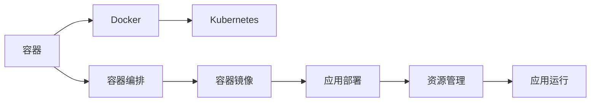

                 

# 容器 原理与代码实例讲解

> 关键词：容器, Docker, Kubernetes, 容器编排, 容器镜像, 应用部署, 容器化

## 1. 背景介绍

在现代社会，软件的快速迭代和发布成为企业与组织的关键需求。然而，软件发布往往伴随着大量的重复劳动和风险。如何快速、稳定地部署应用，成为业界共同关注的难题。

容器技术的兴起，为这一问题提供了全新的解决方案。容器通过将应用和其依赖项打包为单个可移植的镜像，从而确保了应用在任何环境下的一致性。同时，容器编排工具（如Docker、Kubernetes）提供了一整套系统化的部署和管理机制，极大地提升了应用的可靠性与扩展性。

本文将深入探讨容器技术的基本原理和具体实现，并通过几个典型的代码实例，揭示容器在实际应用中的价值。我们不仅会介绍容器的核心概念和关键技术，还会展示一些详细的开发环境搭建、代码实现和分析、运行结果展示等，帮助读者快速掌握容器技术。

## 2. 核心概念与联系

### 2.1 核心概念概述

为了更好地理解容器技术，我们需要首先介绍几个核心概念：

- **容器**：一个独立的运行时环境，包含应用及其依赖项。容器的出现，使得应用可以跨平台、跨主机地稳定运行。

- **Docker**：一个开源的容器引擎，用于创建、部署和管理容器。Docker通过容器镜像，实现了一站式的应用部署。

- **Kubernetes**：一个开源的容器编排工具，用于自动化管理大规模的容器集群。Kubernetes能够提供高效的资源调度、容错保障、服务发现、负载均衡等功能。

- **容器编排**：将一组容器自动部署、管理和扩展的整个过程。容器编排技术能够确保容器的稳定运行和高效利用。

- **容器镜像**：一个包含应用及其依赖项的打包格式，确保应用在任何环境下的一致性。容器镜像可以通过Docker等容器引擎进行管理和分发。

- **应用部署**：将应用程序部署到目标环境中，包括安装、配置、启动等过程。容器化技术使得应用部署过程变得简单、高效。

- **资源管理**：容器编排工具可以自动管理容器的资源（如CPU、内存），确保应用的稳定运行。

这些核心概念共同构成了容器技术的整体架构，帮助企业实现应用的快速部署、高效运行和灵活扩展。

### 2.2 核心概念之间的关系

以上核心概念之间的关系可以通过以下Mermaid流程图来展示：



这个流程图展示了容器技术的主要组件及其关系：

1. 容器是Docker的核心概念，提供了独立的运行时环境。
2. Docker通过容器镜像实现了应用的打包和分发。
3. Kubernetes用于容器编排，实现了大规模容器的自动化管理。
4. 容器编排是Docker和Kubernetes的主要功能，包括了应用部署和资源管理。
5. 应用部署涉及到容器的安装和启动过程。
6. 资源管理是容器编排的重要组成部分，确保了应用的稳定运行。
7. 应用运行是容器技术最终的目标，保证了应用的可靠性和高性能。

这些概念的有机结合，构成了容器技术的完整生态系统，为应用的部署、运行和管理提供了强大的支持。

## 3. 核心算法原理 & 具体操作步骤

### 3.1 算法原理概述

容器技术的核心在于容器镜像的构建和分发。容器镜像是一个包含应用及其依赖项的文件，通过Docker引擎可以方便地管理和分发。容器的运行过程可以分为以下几个步骤：

1. **构建镜像**：将应用和其依赖项打包成容器镜像。
2. **部署容器**：将容器镜像部署到目标环境中。
3. **启动容器**：启动容器并运行应用。

容器的核心优势在于其独立性和一致性。通过容器镜像，应用的运行环境可以被完整地打包，确保在目标环境中的一致性。同时，容器可以跨平台、跨主机地运行，提升了应用的可靠性和可移植性。

### 3.2 算法步骤详解

以下我们将详细介绍容器技术的核心算法步骤，包括镜像构建、容器部署和启动等。

#### 3.2.1 镜像构建

构建容器镜像的第一步是准备应用的源代码和依赖项。这里以一个简单的Node.js应用为例，介绍镜像构建的基本步骤：

1. **创建Dockerfile**：编写Dockerfile文件，指定应用及其依赖项的打包过程。
2. **运行Docker build命令**：在Docker命令提示符下，运行`docker build`命令构建镜像。
3. **测试镜像**：通过`docker run`命令测试构建好的镜像，确保应用能够正常运行。

下面是示例Dockerfile的内容：

```Dockerfile
FROM node:latest

WORKDIR /app

COPY package.json package-lock.json ./

RUN npm install

COPY . .

EXPOSE 3000

CMD ["npm", "start"]
```

#### 3.2.2 容器部署

构建好容器镜像后，可以将其部署到目标环境中。这里以Kubernetes为例，介绍容器部署的基本步骤：

1. **创建Kubernetes配置文件**：编写Kubernetes的配置文件（如Deployment、Service等），指定容器的部署和配置。
2. **运行kubectl apply命令**：在Kubernetes命令提示符下，运行`kubectl apply`命令部署容器。

下面是示例Kubernetes配置文件的内容：

```yaml
apiVersion: apps/v1
kind: Deployment
metadata:
  name: myapp
spec:
  replicas: 3
  selector:
    matchLabels:
      app: myapp
  template:
    metadata:
      labels:
        app: myapp
    spec:
      containers:
      - name: myapp
        image: myapp:latest
        ports:
        - containerPort: 3000
```

#### 3.2.3 容器启动

容器部署完成后，可以通过以下步骤启动容器：

1. **查看容器状态**：使用`kubectl get pods`命令查看容器状态。
2. **访问容器**：使用`kubectl port-forward`命令将容器的端口转发到本地，访问容器。

下面是示例`kubectl port-forward`命令的用法：

```bash
kubectl port-forward deployment/myapp 3000:3000
```

### 3.3 算法优缺点

容器技术在提升应用的可移植性和一致性方面具有显著优势，但也存在一些局限性：

- **优点**：
  - 应用独立运行，不受主机环境影响。
  - 容器镜像保证了应用的一致性，减少了部署复杂性。
  - 容器编排工具提供了高效的资源管理和应用部署。

- **缺点**：
  - 容器镜像的体积较大，需要额外的存储空间。
  - 容器编排工具的学习和使用成本较高。
  - 容器部署过程复杂，需要掌握Docker和Kubernetes等技术。

尽管存在这些缺点，容器技术在现代软件开发中的应用已经非常广泛，成为构建稳定、可扩展应用的重要手段。

### 3.4 算法应用领域

容器技术已经在多个领域得到了广泛应用，包括但不限于：

- **云计算**：云计算平台如AWS、Azure、Google Cloud等提供了丰富的容器服务，支持容器化应用的快速部署。
- **微服务架构**：微服务架构中，每个服务被打包成独立的容器，便于管理和扩展。
- **DevOps**：DevOps团队使用容器技术实现了自动化部署、持续集成和持续交付。
- **企业内部应用**：企业内部应用通过容器技术实现了快速部署和高效运行。

这些应用领域展示了容器技术的强大生命力和广泛适用性。

## 4. 数学模型和公式 & 详细讲解 & 举例说明

### 4.1 数学模型构建

容器技术的数学模型主要围绕容器镜像和容器编排展开。以下是几个关键的数学模型：

- **容器镜像的生成**：通过Dockerfile文件指定应用的打包过程，生成容器镜像。
- **容器编排的调度**：通过Kubernetes配置文件指定容器的部署和资源分配。
- **容器的生命周期管理**：通过容器引擎和编排工具实现容器的启动、运行、停止和销毁。

### 4.2 公式推导过程

以下是几个重要的公式推导过程：

#### 4.2.1 容器镜像的生成

容器镜像的生成过程可以表示为：

$$ \text{镜像} = \text{应用及其依赖项} $$

其中，应用及其依赖项的打包过程由Dockerfile文件指定。

#### 4.2.2 容器编排的调度

容器编排的调度过程可以表示为：

$$ \text{调度} = \text{容器编排配置} $$

其中，容器编排配置由Kubernetes的配置文件指定，包括容器镜像、资源分配、负载均衡等。

#### 4.2.3 容器的生命周期管理

容器的生命周期管理过程可以表示为：

$$ \text{生命周期} = \text{容器引擎} $$

其中，容器引擎负责容器的启动、运行、停止和销毁。

### 4.3 案例分析与讲解

以下是一个简单的Node.js应用容器化的示例，通过Docker和Kubernetes实现应用部署。

**案例背景**：
某公司希望部署一个Node.js应用，应用功能为读取数据库并返回数据。

**解决方案**：
1. **构建容器镜像**：编写Dockerfile文件，将Node.js应用及其依赖项打包成容器镜像。

```Dockerfile
FROM node:latest

WORKDIR /app

COPY package.json package-lock.json ./

RUN npm install

COPY . .

EXPOSE 3000

CMD ["npm", "start"]
```

2. **部署容器**：编写Kubernetes配置文件，指定容器的部署和配置。

```yaml
apiVersion: apps/v1
kind: Deployment
metadata:
  name: myapp
spec:
  replicas: 3
  selector:
    matchLabels:
      app: myapp
  template:
    metadata:
      labels:
        app: myapp
    spec:
      containers:
      - name: myapp
        image: myapp:latest
        ports:
        - containerPort: 3000
```

3. **启动容器**：使用kubectl命令部署容器，并通过port-forward命令访问容器。

```bash
kubectl apply -f myapp-deployment.yaml
kubectl port-forward deployment/myapp 3000:3000
```

通过以上步骤，Node.js应用被成功部署到Kubernetes集群中，并可以通过容器引擎和编排工具进行高效管理。

## 5. 项目实践：代码实例和详细解释说明

### 5.1 开发环境搭建

在进行容器项目实践前，我们需要准备好开发环境。以下是使用Docker和Kubernetes进行项目开发的流程：

1. **安装Docker**：在Windows、Linux和macOS系统上安装Docker，可以参考Docker官方文档进行安装。
2. **安装Kubernetes**：在Kubernetes官网上下载对应的安装包，按照官方文档进行安装。
3. **安装kubectl**：在Kubernetes官网上下载kubectl安装包，并按照官方文档进行安装。

完成上述步骤后，即可在本地进行容器项目开发和部署。

### 5.2 源代码详细实现

以下是Node.js应用容器化的示例代码，包括Dockerfile文件和Kubernetes配置文件。

**Dockerfile文件**：

```Dockerfile
FROM node:latest

WORKDIR /app

COPY package.json package-lock.json ./

RUN npm install

COPY . .

EXPOSE 3000

CMD ["npm", "start"]
```

**Kubernetes配置文件**：

```yaml
apiVersion: apps/v1
kind: Deployment
metadata:
  name: myapp
spec:
  replicas: 3
  selector:
    matchLabels:
      app: myapp
  template:
    metadata:
      labels:
        app: myapp
    spec:
      containers:
      - name: myapp
        image: myapp:latest
        ports:
        - containerPort: 3000
```

**代码解读与分析**：
- **Dockerfile文件**：指定了Node.js应用的打包过程，包括安装依赖项、复制源代码、暴露端口等。
- **Kubernetes配置文件**：指定了容器的部署和配置，包括容器镜像、资源分配、负载均衡等。
- **运行结果展示**：通过kubectl命令部署容器，并使用port-forward命令访问容器。

### 5.3 代码解读与分析

以下是Dockerfile文件和Kubernetes配置文件的详细解读和分析：

**Dockerfile文件**：
- **FROM**：指定基础镜像为node:latest。
- **WORKDIR**：设置工作目录为/app。
- **COPY**：复制依赖项和源代码到容器中。
- **RUN**：执行npm install命令安装依赖项。
- **EXPOSE**：暴露3000端口。
- **CMD**：指定启动命令为npm start。

**Kubernetes配置文件**：
- **apiVersion**：指定API版本为apps/v1。
- **kind**：指定容器类型为Deployment。
- **metadata**：指定容器名称为myapp。
- **spec**：指定容器的配置，包括容器镜像、资源分配、负载均衡等。
- **selector**：指定容器选择器。
- **template**：指定容器的模板，包括容器镜像、端口、启动命令等。

## 6. 实际应用场景

### 6.1 云计算

在云计算平台中，容器技术被广泛应用。例如，AWS的ECS（Elastic Container Service）、Azure的ACS（Azure Container Service）、Google Cloud的GKE（Google Kubernetes Engine）等，都支持容器化应用的快速部署。

通过容器技术，云计算平台能够提供一站式的应用部署和管理，大大提升了应用的可移植性和可靠性。例如，AWS的ECS能够自动调度和管理容器的生命周期，确保应用的稳定运行。

### 6.2 DevOps

在DevOps实践中，容器技术发挥了重要作用。通过容器技术，DevOps团队可以实现自动化部署、持续集成和持续交付（CI/CD）。

例如，Jenkins等CI工具可以结合Docker和Kubernetes，自动构建和部署容器镜像。Kubernetes的自动化管理和资源调度，能够确保应用的稳定运行和高效扩展。

### 6.3 微服务架构

在微服务架构中，每个服务被打包成独立的容器，便于管理和扩展。例如，Spring Cloud等微服务框架支持容器化应用，通过Docker和Kubernetes进行部署和管理。

通过容器技术，微服务架构能够实现高效的服务发现、负载均衡和容错保障。例如，Kubernetes的服务发现和负载均衡机制，能够自动管理微服务的访问和流量分发。

### 6.4 企业内部应用

在企业内部应用中，容器技术也被广泛应用。例如，银行系统、电商平台、游戏服务器等，通过容器技术实现了快速部署和高效运行。

例如，银行系统通过容器技术实现了高并发的交易处理，电商平台通过容器技术实现了灵活的库存管理和订单处理。

## 7. 工具和资源推荐

### 7.1 学习资源推荐

为了帮助开发者系统掌握容器技术，这里推荐一些优质的学习资源：

1. **《Docker实战》**：一本深入浅出介绍Docker和容器技术的书籍，适合初学者入门。
2. **《Kubernetes权威指南》**：一本全面的Kubernetes学习指南，涵盖了Kubernetes的各个方面。
3. **Docker官方文档**：Docker的官方文档，提供详细的API文档和示例代码。
4. **Kubernetes官方文档**：Kubernetes的官方文档，提供详细的API文档和示例代码。
5. **Kubernetes中文社区**：Kubernetes中文社区，提供中文版本的教程、文档和社区支持。

通过这些资源的学习实践，相信你一定能够快速掌握容器技术的精髓，并用于解决实际的开发问题。

### 7.2 开发工具推荐

高效的开发离不开优秀的工具支持。以下是几款用于容器开发的工具：

1. **Docker**：开源的容器引擎，用于创建、部署和管理容器。
2. **Kubernetes**：开源的容器编排工具，用于自动化管理大规模的容器集群。
3. **Jenkins**：开源的CI/CD工具，结合Docker和Kubernetes，实现自动化部署。
4. **Jupyter Notebook**：一个交互式的开发环境，适合进行容器技术的研究和实验。

合理利用这些工具，可以显著提升容器技术的开发效率，加快创新迭代的步伐。

### 7.3 相关论文推荐

容器技术的发展源于学界的持续研究。以下是几篇奠基性的相关论文，推荐阅读：

1. **《Docker: The Docker Economy》**：Docker的创始人Solomon Hykes在KubeCon上的演讲，介绍了Docker的生态和经济模型。
2. **《Kubernetes: Beyond the Core》**：Kubernetes的核心开发者Brendan Burns在KubeCon上的演讲，介绍了Kubernetes的核心功能和未来方向。
3. **《Microservices in Production: Surviving In-Production Destruction》**：微服务架构的权威专家Michel LeSquare在KubeCon上的演讲，介绍了微服务架构的实践经验和挑战。

这些论文代表了大容器技术的发展脉络，帮助研究者把握学科前进方向，激发更多的创新灵感。

除上述资源外，还有一些值得关注的前沿资源，帮助开发者紧跟容器技术的最新进展，例如：

1. **arXiv论文预印本**：人工智能领域最新研究成果的发布平台，包括大量尚未发表的前沿工作，学习前沿技术的必读资源。
2. **业界技术博客**：如Docker、Kubernetes、Google Cloud等顶尖实验室的官方博客，第一时间分享他们的最新研究成果和洞见。
3. **技术会议直播**：如Kubernetes、DevOps、CI/CD等人工智能领域顶会现场或在线直播，能够聆听到大佬们的前沿分享，开拓视野。
4. **GitHub热门项目**：在GitHub上Star、Fork数最多的容器相关项目，往往代表了该技术领域的发展趋势和最佳实践，值得去学习和贡献。
5. **行业分析报告**：各大咨询公司如McKinsey、PwC等针对容器行业的分析报告，有助于从商业视角审视技术趋势，把握应用价值。

总之，对于容器技术的学习和实践，需要开发者保持开放的心态和持续学习的意愿。多关注前沿资讯，多动手实践，多思考总结，必将收获满满的成长收益。

## 8. 总结：未来发展趋势与挑战

### 8.1 总结

本文对容器技术的基本原理和具体实现进行了全面系统的介绍。首先介绍了容器的核心概念和关键技术，然后通过几个典型的代码实例，揭示了容器在实际应用中的价值。我们不仅详细解释了容器的构建、部署和启动等关键步骤，还展示了容器在云计算、DevOps、微服务架构和企业内部应用等实际场景中的应用。

通过本文的系统梳理，可以看到，容器技术已经成为现代软件开发的重要手段，帮助企业实现应用的快速部署、高效运行和灵活扩展。未来，伴随容器技术的不断演进，容器技术必将在构建稳定、可扩展应用中扮演越来越重要的角色。

### 8.2 未来发展趋势

展望未来，容器技术将呈现以下几个发展趋势：

1. **Kubernetes生态扩展**：Kubernetes作为容器编排的业界标准，其生态扩展将继续深化。未来，Kubernetes将支持更多容器引擎和云平台，实现更广泛的应用场景。
2. **容器化和云原生应用**：容器化和云原生应用将成为未来软件开发的主流趋势，进一步提升应用的可靠性、扩展性和可移植性。
3. **微服务架构**：微服务架构将继续推动容器技术的广泛应用，使得应用能够灵活部署、高效扩展和管理。
4. **DevOps自动化**：DevOps自动化将成为容器技术的重要组成部分，实现自动化部署、持续集成和持续交付。
5. **多云和混合云**：多云和混合云环境下的容器技术，将提供更加灵活和高效的应用部署和管理。

以上趋势凸显了容器技术的广阔前景。这些方向的探索发展，必将进一步提升容器技术的性能和应用范围，为构建高效、可靠、可扩展的应用提供新的动力。

### 8.3 面临的挑战

尽管容器技术已经取得了显著的成就，但在迈向更加智能化、普适化应用的过程中，它仍面临着诸多挑战：

1. **容器镜像的体积问题**：容器镜像的体积较大，需要额外的存储空间。如何优化镜像体积，提高部署效率，仍然是一个重要挑战。
2. **容器编排的复杂性**：容器编排工具如Kubernetes的学习和使用成本较高，如何简化编排过程，降低使用门槛，仍然是一个重要课题。
3. **容器编排的性能问题**：容器编排工具在处理大规模容器集群时，可能会面临性能瓶颈。如何优化编排算法，提升系统性能，仍然是一个重要问题。
4. **容器安全的保障**：容器技术在提高应用可靠性的同时，也带来了新的安全挑战。如何保障容器安全，确保应用数据和资源的安全，仍然是一个重要课题。
5. **容器技术的标准化**：容器技术仍然缺乏统一的标准，不同厂商和平台的容器引擎和编排工具存在一定的差异。如何实现容器技术的标准化，提升兼容性，仍然是一个重要问题。

尽管存在这些挑战，容器技术在现代软件开发中的应用已经非常广泛，成为构建稳定、可扩展应用的重要手段。相信随着学界和产业界的共同努力，这些挑战终将一一被克服，容器技术必将在构建高效、可靠、可扩展的应用中扮演越来越重要的角色。

### 8.4 研究展望

面对容器技术所面临的挑战，未来的研究需要在以下几个方面寻求新的突破：

1. **容器镜像的优化**：探索容器镜像的压缩和加速技术，提高镜像的体积和性能。
2. **容器编排的简化**：探索容器编排的简化和自动化技术，降低使用门槛和提升用户体验。
3. **容器编排的性能优化**：探索容器编排的性能优化技术，提升系统性能和稳定性。
4. **容器安全的保障**：探索容器安全的保障技术，确保应用数据和资源的安全。
5. **容器技术的标准化**：推动容器技术的标准化，提升不同厂商和平台的兼容性。

这些研究方向将推动容器技术的不断演进，为构建高效、可靠、可扩展的应用提供新的动力。

## 9. 附录：常见问题与解答

**Q1: 容器技术是否适用于所有应用？**

A: 容器技术适用于绝大多数应用，特别是具有可移植性需求的应用。对于需要复杂网络协议、多节点协作等场景的应用，容器技术的适用性可能受到一定限制。

**Q2: 容器技术是否需要额外学习成本？**

A: 容器技术需要一定的学习成本，特别是对于新手来说。但通过系统的学习和实践，可以快速掌握容器技术的核心原理和应用场景。

**Q3: 容器技术是否适用于大规模应用？**

A: 容器技术在大规模应用中表现出色，可以支持海量应用的高效部署和管理。但需要根据具体应用场景，进行适当的优化和调参。

**Q3: 容器技术是否适用于分布式系统？**

A: 容器技术适用于分布式系统，特别是微服务架构。通过容器编排工具，可以实现分布式应用的自动化部署和管理。

**Q5: 容器技术是否适用于实时应用？**

A: 容器技术适用于实时应用，通过容器编排工具，可以实现高效的资源调度和负载均衡。

**Q6: 容器技术是否适用于开发环境？**

A: 容器技术适用于开发环境，通过容器技术，可以在本地或云平台上快速搭建开发环境，支持应用程序的迭代开发和测试。

总之，容器技术在现代软件开发中的应用已经非常广泛，成为构建稳定、可扩展应用的重要手段。相信随着学界和产业界的共同努力，容器技术必将在构建高效、可靠、可扩展的应用中扮演越来越重要的角色。

---

作者：禅与计算机程序设计艺术 / Zen and the Art of Computer Programming

