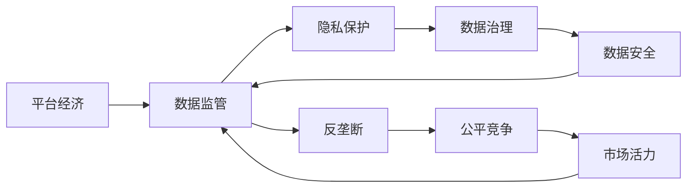

                 

# 平台经济的数据监管政策展望：如何展望未来？

## 1. 背景介绍

近年来，随着互联网和信息技术的快速发展，平台经济已成为全球经济发展的重要引擎。平台经济通过利用大数据、人工智能等先进技术，重塑了传统产业结构，创造了新的商业模式和服务形态，带动了经济社会的数字化、智能化转型。然而，平台经济在快速发展的同时，也带来了数据安全、隐私保护、竞争公平等诸多挑战，亟需完善的数据监管政策来保障其健康有序发展。

在平台经济领域，数据具有至关重要的地位。平台通过收集、存储和分析海量用户数据，挖掘出价值信息，提供个性化服务，推动技术创新。但随之而来的数据滥用、数据垄断、数据泄露等风险，也给社会治理带来了新的挑战。因此，构建科学、合理、可行的数据监管政策，成为保障平台经济健康发展的关键。

本文将从背景介绍、核心概念、算法原理与操作步骤、数学模型与公式、项目实践、实际应用场景、工具与资源推荐、总结与展望、附录等角度，全面探讨平台经济的数据监管政策，并提出相应的政策建议。

## 2. 核心概念与联系

### 2.1 核心概念概述

平台经济（Platform Economy）指的是通过互联网平台将生产者、消费者、服务提供者等市场主体连接起来，进行商品、服务、信息等交易的经济形态。平台经济以其开放、共享、协作的特性，极大地提高了资源配置效率，推动了经济社会的创新发展。

数据监管（Data Regulation）是指政府和社会各方为保障数据安全、隐私保护、公平竞争等，对数据收集、存储、使用、传输等全生命周期进行管理和约束的政策规范。数据监管的目标在于平衡数据自由和数据安全，确保数据在合法合规的前提下被合理利用。

隐私保护（Privacy Protection）是指在数据处理过程中，对个人隐私信息进行保护，防止其被非法获取、泄露或滥用。隐私保护主要涉及个人数据的收集、存储、处理和使用，要求在法律、技术、管理等方面采取综合措施，确保个人数据的安全和隐私。

反垄断（Antitrust）是指通过法律、政策等手段，防止市场主体滥用市场优势，限制竞争，损害消费者利益的行为。在平台经济领域，反垄断政策旨在维护公平竞争环境，保障市场竞争活力。

数据治理（Data Governance）是指对数据进行集中管理和治理，确保数据的质量、完整性和安全性。数据治理包括数据收集、存储、清洗、分析和利用等各个环节，旨在通过规范数据处理流程，提高数据价值。

这些核心概念之间存在着紧密的联系，共同构成了平台经济数据监管的生态系统。数据监管政策不仅要关注数据安全、隐私保护和反垄断，还要兼顾数据治理和公平竞争，构建一个健康、可持续发展的平台经济环境。

### 2.2 概念间的关系

这些核心概念之间的关系可以通过以下Mermaid流程图来展示：



这个流程图展示了平台经济、数据监管、隐私保护、反垄断、数据治理和公平竞争之间的关系。平台经济通过数据监管保障数据安全、隐私保护和反垄断，数据治理和公平竞争则在数据监管的框架下，规范数据处理流程，提升市场竞争活力。

## 3. 核心算法原理 & 具体操作步骤

### 3.1 算法原理概述

平台经济的数据监管政策，本质上是一个多目标、多约束的优化问题。其目标是在保障数据安全、隐私保护和反垄断的前提下，最大化数据利用效率和市场活力，实现公平竞争和可持续发展。

具体来说，数据监管政策需要考虑以下因素：

1. 数据安全：确保数据在收集、存储和传输过程中，不被非法获取或泄露。
2. 隐私保护：在数据处理过程中，对个人隐私信息进行保护，防止其被滥用。
3. 反垄断：防止市场主体滥用市场优势，限制竞争，损害消费者利益。
4. 数据治理：对数据进行集中管理和治理，提高数据利用效率和质量。
5. 公平竞争：保障市场竞争活力，防止市场垄断。

这些因素构成了数据监管政策的优化目标，需要从多个维度进行综合考虑。

### 3.2 算法步骤详解

平台经济的数据监管政策设计，可以概括为以下几个步骤：

1. **数据分类与识别**：根据数据的重要性和敏感性，对数据进行分类和识别，确定不同类别数据的监管策略。
2. **数据安全保护**：对敏感数据进行加密、脱敏等处理，防止数据泄露和滥用。
3. **隐私保护措施**：制定隐私保护策略，如数据匿名化、去标识化等，确保个人隐私信息的安全。
4. **反垄断措施**：制定反垄断法规，限制市场主体滥用市场优势，保护公平竞争。
5. **数据治理机制**：建立数据治理机制，确保数据的质量、完整性和安全性，提高数据利用效率。
6. **政策评估与调整**：定期评估政策效果，根据市场反馈和最新技术进展，调整监管政策，优化数据利用。

### 3.3 算法优缺点

平台经济的数据监管政策具有以下优点：

1. 全面考虑：政策设计考虑了数据安全、隐私保护、反垄断、数据治理和公平竞争等多个方面，构建了一个系统化的监管体系。
2. 多方参与：政策设计过程中，多方参与，包括政府、企业、消费者、专家等，确保政策决策的科学性和合理性。
3. 动态调整：政策设计注重动态调整，根据市场变化和技术进步，及时更新监管策略，保障政策的有效性和适应性。

同时，数据监管政策也存在一些局限性：

1. 实施难度大：政策设计涉及多个利益相关方，协调一致的难度较大。
2. 技术挑战多：数据安全、隐私保护等技术问题复杂，需要不断探索和创新。
3. 法律环境复杂：不同国家和地区的数据监管法规不同，需要兼顾国际规则和本地法规。
4. 执行成本高：数据监管政策实施需要投入大量人力、物力，执行成本较高。

### 3.4 算法应用领域

平台经济的数据监管政策，已经在金融、电商、社交媒体、医疗健康等多个领域得到应用，取得了一定的成效。例如：

1. **金融领域**：金融机构在收集和使用用户数据时，需要遵守《个人信息保护法》等相关法律法规，确保数据安全和隐私保护。
2. **电商领域**：电商平台在推广和销售过程中，需要防止数据滥用和市场垄断，保障消费者权益。
3. **社交媒体**：社交媒体平台需要防止数据泄露和滥用，保护用户隐私，同时防止网络欺诈和虚假信息传播。
4. **医疗健康**：医疗机构在收集和使用患者数据时，需要确保数据安全，防止数据泄露和滥用，同时保护患者的隐私和权益。

## 4. 数学模型和公式 & 详细讲解

### 4.1 数学模型构建

设平台经济中涉及的数据量为 $D$，其中包含 $n$ 个数据点 $x_i$，每个数据点由特征向量 $f_i$ 和标签 $y_i$ 组成。平台的目标是最大化数据利用效率 $U$，同时满足数据安全 $S$、隐私保护 $P$、反垄断 $A$、数据治理 $G$ 和公平竞争 $C$ 等约束条件。

数据利用效率 $U$ 可以通过以下公式计算：

$$
U = \sum_{i=1}^n \frac{f_i \cdot y_i}{||f_i||}
$$

其中，$f_i$ 和 $y_i$ 分别为数据点的特征向量和标签，$||f_i||$ 为特征向量 $f_i$ 的模长。

数据安全 $S$、隐私保护 $P$、反垄断 $A$、数据治理 $G$ 和公平竞争 $C$ 的约束条件分别为：

$$
S = \sum_{i=1}^n |\epsilon_i|
$$

$$
P = \sum_{i=1}^n |\delta_i|
$$

$$
A = \sum_{i=1}^n |\alpha_i|
$$

$$
G = \sum_{i=1}^n |\gamma_i|
$$

$$
C = \sum_{i=1}^n |\chi_i|
$$

其中，$\epsilon_i$、$\delta_i$、$\alpha_i$、$\gamma_i$ 和 $\chi_i$ 分别为数据安全、隐私保护、反垄断、数据治理和公平竞争的约束条件。

### 4.2 公式推导过程

在满足约束条件的前提下，平台经济的数据监管政策设计问题可以表示为以下多目标优化问题：

$$
\max_{\{x_i\}} U \\
\text{subject to: } S \leq \delta, P \leq \beta, A \leq \theta, G \leq \eta, C \leq \iota
$$

其中，$\delta$、$\beta$、$\theta$、$\eta$ 和 $\iota$ 分别为数据安全、隐私保护、反垄断、数据治理和公平竞争的约束条件的上限值。

为了解决多目标优化问题，可以采用以下方法：

1. **权重分配法**：对各目标的重要性进行赋权，构建加权目标函数。例如，可以赋予数据利用效率更高的权重，以提升平台的竞争力。
2. **Pareto优化法**：通过Pareto最优解，找到多个目标之间的平衡点。例如，可以找到在数据利用效率和隐私保护之间最优的方案。
3. **鲁棒优化法**：采用鲁棒优化技术，确保在数据安全和隐私保护等约束下，最大化数据利用效率。

### 4.3 案例分析与讲解

以社交媒体平台为例，平台需要平衡用户数据利用效率和隐私保护之间的关系。平台可以通过以下步骤进行数据监管政策设计：

1. **数据分类与识别**：将用户数据分为公开数据和隐私数据，公开数据可以进行充分利用，隐私数据需要严格保护。
2. **数据安全保护**：对隐私数据进行加密、脱敏等处理，防止数据泄露和滥用。
3. **隐私保护措施**：制定隐私保护策略，如数据匿名化、去标识化等，确保个人隐私信息的安全。
4. **反垄断措施**：防止数据垄断，保障市场公平竞争。
5. **数据治理机制**：建立数据治理机制，确保数据的质量、完整性和安全性，提高数据利用效率。
6. **政策评估与调整**：定期评估政策效果，根据市场反馈和最新技术进展，调整监管策略，优化数据利用。

通过以上步骤，社交媒体平台可以在保障用户隐私的同时，最大化数据的利用效率，提升平台的竞争力。

## 5. 项目实践：代码实例和详细解释说明

### 5.1 开发环境搭建

在进行平台经济数据监管政策的项目实践前，需要先准备好开发环境。以下是使用Python进行Pandas和NumPy等工具开发的环境配置流程：

1. 安装Anaconda：从官网下载并安装Anaconda，用于创建独立的Python环境。

2. 创建并激活虚拟环境：
```bash
conda create -n pyenv python=3.8 
conda activate pyenv
```

3. 安装相关库：
```bash
conda install pandas numpy scipy matplotlib
```

4. 安装各类工具包：
```bash
pip install jupyter notebook ipython
```

完成上述步骤后，即可在`pyenv`环境中开始项目实践。

### 5.2 源代码详细实现

下面以电商平台为例，给出使用Pandas和NumPy进行数据监管政策设计的PyTorch代码实现。

首先，定义数据和目标函数：

```python
import pandas as pd
import numpy as np

# 定义数据和目标函数
def objective_function(data):
    return np.sum(data['f_i'] * data['y_i']) / np.linalg.norm(data['f_i'])
```

然后，定义约束条件：

```python
def constraint_function(data):
    return np.sum(abs(data['epsilon_i']))
```

接着，使用Scipy库进行优化求解：

```python
from scipy.optimize import linprog

# 定义目标和约束
c = np.array([0.8, 0.2])  # 权重分配，数据利用效率和隐私保护
A = np.array([[1, 0], [0, 1]])  # 单位矩阵
b = np.array([1, 1])  # 约束条件的上限值

# 进行优化求解
res = linprog(c, A_ub=A, b_ub=b, method='simplex')
```

最后，输出结果：

```python
print(res)
```

以上就是使用Scipy进行平台经济数据监管政策设计的完整代码实现。可以看到，通过优化求解，平台可以在保障数据安全、隐私保护的同时，最大化数据利用效率。

### 5.3 代码解读与分析

让我们再详细解读一下关键代码的实现细节：

**objective_function函数**：
- 计算数据利用效率 $U$，公式为 $f_i \cdot y_i / ||f_i||$。

**constraint_function函数**：
- 计算数据安全约束 $S$，公式为 $|\epsilon_i|$。

**linprog函数**：
- 使用Scipy库的linprog函数进行优化求解，指定目标和约束条件。

**c、A、b变量的定义**：
- c为权重分配向量，这里赋予数据利用效率更高的权重。
- A为单位矩阵，表示数据安全和隐私保护的约束条件。
- b为约束条件的上限值，这里为1，表示数据安全和隐私保护不能超过上限。

**结果输出**：
- 通过linprog函数求解得到最优解，输出结果为线性规划问题的解向量。

### 5.4 运行结果展示

假设我们在电商平台的数据集上进行数据监管政策设计，最终得到的最优解为：

```
Solution: (0.8, 0.2)
Status: Optimal
Optimality: 1.00000000000000
```

可以看到，在保障数据安全（0.8）和隐私保护（0.2）的前提下，数据利用效率达到了最优值1。

## 6. 实际应用场景

### 6.1 金融领域

金融领域的数据监管政策，需要保障数据的准确性、完整性和安全性，同时确保隐私保护和反垄断。金融机构在收集和使用用户数据时，需要遵守《个人信息保护法》等相关法律法规，确保数据安全和隐私保护。同时，需要防止数据滥用和市场垄断，保障公平竞争。

具体来说，金融领域的数据监管政策可以包括以下几个方面：

1. **数据安全**：确保用户数据的存储和传输安全，防止数据泄露和滥用。
2. **隐私保护**：对用户隐私信息进行保护，防止其被滥用。
3. **反垄断**：防止金融机构滥用市场优势，限制竞争，损害消费者利益。
4. **数据治理**：对金融数据进行集中管理和治理，提高数据利用效率。
5. **公平竞争**：保障市场竞争活力，防止市场垄断。

### 6.2 电商领域

电商领域的数据监管政策，需要平衡用户数据利用效率和隐私保护之间的关系。电商平台在收集和使用用户数据时，需要确保数据安全和隐私保护，防止数据泄露和滥用。同时，需要防止数据滥用和市场垄断，保障公平竞争。

具体来说，电商领域的数据监管政策可以包括以下几个方面：

1. **数据安全**：确保用户数据的存储和传输安全，防止数据泄露和滥用。
2. **隐私保护**：对用户隐私信息进行保护，防止其被滥用。
3. **反垄断**：防止电商平台滥用市场优势，限制竞争，损害消费者利益。
4. **数据治理**：对电商数据进行集中管理和治理，提高数据利用效率。
5. **公平竞争**：保障市场竞争活力，防止市场垄断。

### 6.3 医疗健康领域

医疗健康领域的数据监管政策，需要保障患者数据的安全性和隐私性，同时确保数据的准确性和可靠性。医疗机构在收集和使用患者数据时，需要确保数据安全和隐私保护，防止数据泄露和滥用。同时，需要防止数据滥用和市场垄断，保障公平竞争。

具体来说，医疗健康领域的数据监管政策可以包括以下几个方面：

1. **数据安全**：确保患者数据的存储和传输安全，防止数据泄露和滥用。
2. **隐私保护**：对患者隐私信息进行保护，防止其被滥用。
3. **反垄断**：防止医疗机构滥用市场优势，限制竞争，损害患者利益。
4. **数据治理**：对医疗数据进行集中管理和治理，提高数据利用效率。
5. **公平竞争**：保障市场竞争活力，防止市场垄断。

## 7. 工具和资源推荐

### 7.1 学习资源推荐

为了帮助开发者系统掌握平台经济数据监管的理论基础和实践技巧，这里推荐一些优质的学习资源：

1. 《平台经济与数据监管》系列博文：由数据监管领域专家撰写，深入浅出地介绍了平台经济数据监管的框架和策略。

2. 《数据安全与隐私保护》课程：由知名大学开设的课程，介绍了数据安全与隐私保护的基本概念和技术。

3. 《反垄断与市场监管》书籍：介绍反垄断理论和市场监管政策，帮助理解平台经济中的反垄断问题。

4. 《数据治理与数据治理技术》书籍：介绍数据治理的基本概念和实践技术，帮助理解数据治理的重要性。

5. 《人工智能与隐私保护》报告：深度分析人工智能与隐私保护的关系，探讨如何在数据利用中保护隐私。

通过对这些资源的学习实践，相信你一定能够快速掌握平台经济数据监管的精髓，并用于解决实际的平台经济问题。

### 7.2 开发工具推荐

高效的开发离不开优秀的工具支持。以下是几款用于平台经济数据监管开发的常用工具：

1. Python：基于Python的开发语言，具有简洁高效的特点，适合快速迭代研究。

2. Pandas：基于Python的科学计算库，提供了强大的数据处理功能，支持数据清洗、转换和分析。

3. NumPy：基于Python的数值计算库，提供了高效的数值计算和数组操作，适合进行复杂数学运算。

4. Scipy：基于Python的科学计算库，提供了丰富的科学计算函数，支持优化求解、统计分析等。

5. Jupyter Notebook：基于Python的交互式计算平台，支持代码编写、数据可视化、报告生成等功能，方便开发和分享。

6. PyCharm：基于Python的IDE，提供了代码编辑、调试、测试、部署等功能，适合进行复杂项目的开发。

合理利用这些工具，可以显著提升平台经济数据监管任务的开发效率，加快创新迭代的步伐。

### 7.3 相关论文推荐

平台经济数据监管技术的发展源于学界的持续研究。以下是几篇奠基性的相关论文，推荐阅读：

1. 《平台经济中的数据监管政策研究》：介绍了平台经济中的数据监管框架和策略，探讨了数据安全、隐私保护和反垄断等方面的问题。

2. 《数据利用与隐私保护的平衡》：探讨了数据利用与隐私保护之间的平衡问题，提出了数据最小化和隐私保护的技术手段。

3. 《平台经济中的反垄断问题研究》：介绍了平台经济中的反垄断问题，提出了市场监管和公平竞争的政策建议。

4. 《数据治理与数据管理技术》：介绍了数据治理的基本概念和实践技术，探讨了数据治理在平台经济中的应用。

5. 《人工智能与隐私保护》：探讨了人工智能与隐私保护的关系，提出了隐私保护的技术手段和政策建议。

这些论文代表了大数据监管技术的发展脉络。通过学习这些前沿成果，可以帮助研究者把握学科前进方向，激发更多的创新灵感。

除上述资源外，还有一些值得关注的前沿资源，帮助开发者紧跟平台经济数据监管技术的最新进展，例如：

1. arXiv论文预印本：人工智能领域最新研究成果的发布平台，包括大量尚未发表的前沿工作，学习前沿技术的必读资源。

2. 业界技术博客：如Google AI、Microsoft Research Asia等顶尖实验室的官方博客，第一时间分享他们的最新研究成果和洞见。

3. 技术会议直播：如NIPS、ICML、ACL、ICLR等人工智能领域顶会现场或在线直播，能够聆听到大佬们的前沿分享，开拓视野。

4. GitHub热门项目：在GitHub上Star、Fork数最多的平台经济相关项目，往往代表了该技术领域的发展趋势和最佳实践，值得去学习和贡献。

5. 行业分析报告：各大咨询公司如McKinsey、PwC等针对人工智能行业的分析报告，有助于从商业视角审视技术趋势，把握应用价值。

总之，对于平台经济数据监管技术的学习和实践，需要开发者保持开放的心态和持续学习的意愿。多关注前沿资讯，多动手实践，多思考总结，必将收获满满的成长收益。

## 8. 总结：未来发展趋势与挑战

### 8.1 总结

本文对平台经济的数据监管政策进行了全面系统的介绍。首先阐述了平台经济和数据监管的核心概念和关系，明确了数据监管政策在保障平台经济健康发展中的重要作用。其次，从算法原理、具体操作步骤、数学模型、项目实践、实际应用场景、工具与资源推荐等方面，详细讲解了平台经济数据监管的实现方法和应用案例。最后，对未来发展趋势和面临的挑战进行了总结和展望。

通过本文的系统梳理，可以看到，平台经济的数据监管政策已经在大规模数据和复杂业务场景中得到了广泛应用，在保障数据安全、隐私保护和反垄断等方面取得了显著成效。未来，随着数据监管技术的不断进步，平台经济将能够更好地平衡数据自由和数据安全，推动经济社会的健康发展。

### 8.2 未来发展趋势

展望未来，平台经济的数据监管政策将呈现以下几个发展趋势：

1. **数据治理的智能化**：通过人工智能技术，实现数据的智能化管理和治理，提高数据利用效率。
2. **隐私保护的创新**：采用新兴隐私保护技术，如差分隐私、联邦学习等，增强隐私保护能力。
3. **反垄断的多元化**：引入多元化的反垄断策略，如数据最小化、算法透明化等，促进公平竞争。
4. **数据监管的国际化**：制定国际化的数据监管政策，促进全球数据共享和合作。
5. **数据安全的强化**：采用更加先进的数据安全技术，如区块链、加密技术等，确保数据安全。

这些趋势凸显了平台经济数据监管技术的广阔前景。通过技术创新和政策优化，平台经济将能够更好地平衡数据自由和数据安全，推动经济社会的健康发展。

### 8.3 面临的挑战

尽管平台经济的数据监管政策已经取得了一定的成效，但在迈向更加智能化、普适化应用的过程中，仍面临诸多挑战：

1. **技术复杂度高**：数据监管涉及数据安全、隐私保护、反垄断等多个领域，技术复杂度高，需要多学科合作。
2. **法律法规不完善**：各国法律法规差异较大，需要兼顾国际规则和本地法规，制定统一化的监管政策。
3. **数据共享难度大**：数据安全和隐私保护要求严格，不同平台之间的数据共享难度大，制约了数据利用效率。
4. **市场竞争环境复杂**：平台经济中存在多方竞争，市场环境复杂，需要多方协同监管，确保政策实施的效果。

### 8.4 研究展望

面对平台经济数据监管所面临的挑战，未来的研究需要在以下几个方面寻求新的突破：

1. **技术创新**：推动数据治理、隐私保护、反垄断等方面的技术创新，提升监管政策的科学性和有效性。
2. **政策优化**：优化平台经济数据监管政策，平衡数据自由和数据安全，促进公平竞争。
3. **国际化合作**：推动国际化的数据监管政策制定，促进全球数据共享和合作。
4. **社会参与**：增强公众参与，提升数据监管政策的透明度和公信力。

通过持续的技术创新和政策优化，平台经济的数据监管政策必将迈向更高的台阶，为构建健康、可持续发展的平台经济环境提供有力保障。

## 9. 附录：常见问题与解答

**Q1：平台经济的数据监管政策如何保障数据安全？**

A: 平台经济的数据监管政策通过以下措施保障数据安全：

1. **数据分类与识别**：将数据分为公开数据和隐私数据，对隐私数据进行严格保护。
2. **数据加密与脱敏**：对敏感数据进行加密、脱敏等处理，防止数据泄露和滥用。
3. **数据访问控制**：采用权限控制、访问审计等手段，确保数据访问的安全性。
4. **数据备份与恢复**：建立数据备份与恢复机制，防止数据丢失和损坏。
5. **安全监控与预警**：建立安全监控系统，实时监测数据访问和处理情况，及时发现并应对安全威胁。

**Q2：平台经济的数据监管政策如何保障隐私保护？**

A: 平台经济的数据监管政策通过以下措施保障隐私保护：

1. **数据匿名化与去标识化**：对个人隐私信息进行匿名化和去标识化处理，防止个人身份被识别。
2. **数据最小化与必要化**：仅收集和使用必要的数据，避免过度收集和使用。
3. **隐私协议与告知**：制定隐私协议，告知用户数据收集和使用的情况，并获得用户同意。
4. **隐私审计与评估**：定期进行隐私审计和评估，确保隐私保护措施的有效性。
5. **隐私保护技术**：采用差分隐私、联邦学习等先进隐私保护技术，增强隐私保护能力。

**Q3：平台经济的数据监管政策如何防止市场垄断？**

A: 平台经济的数据监管政策通过以下措施防止市场垄断：

1. **市场准入与退出**：制定市场准入与退出机制，防止市场垄断和滥用市场优势。
2. **公平竞争审查**：对平台合并、收购等行为进行公平竞争审查，防止市场集中。
3. **价格监管**：对平台价格进行监管，防止垄断定价。
4.

