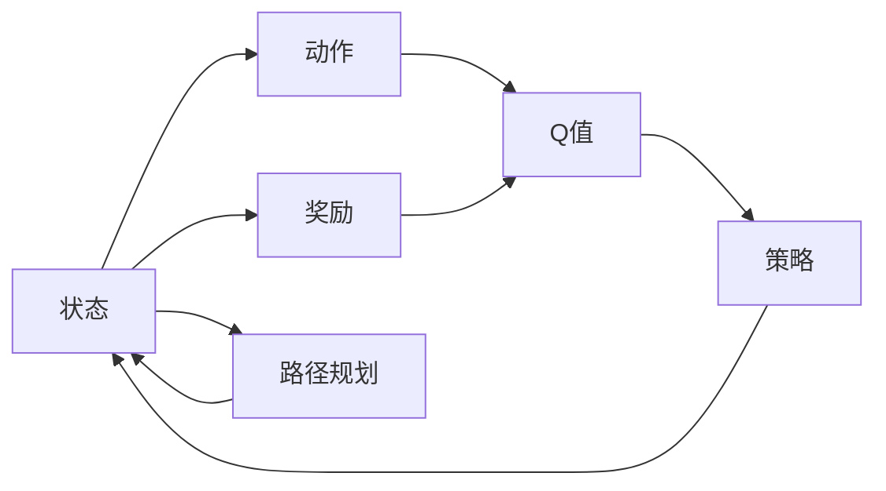
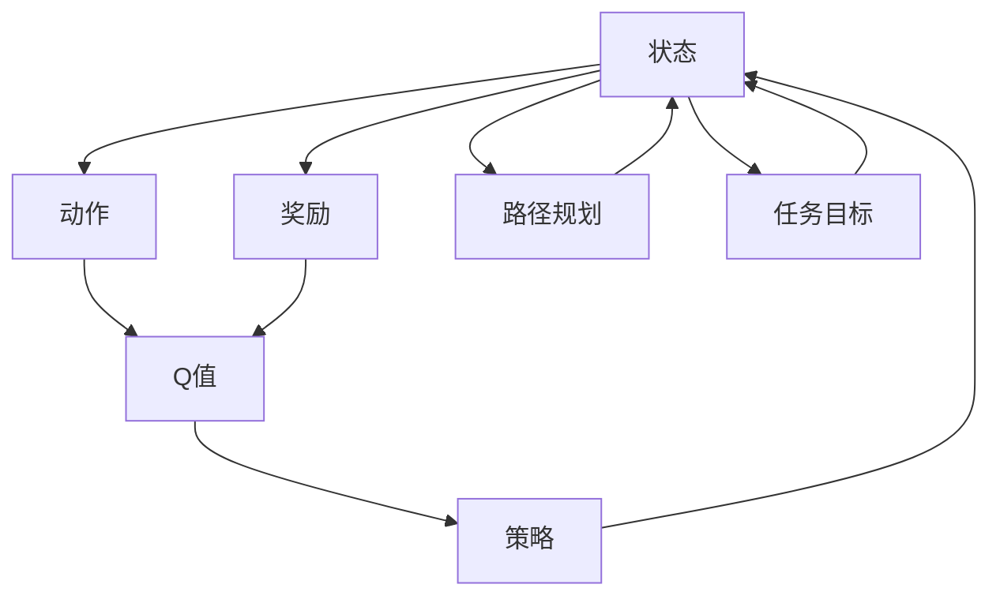

                 

# 强化学习在机器人操作中的应用:提高灵活性

> 关键词：强化学习,机器人,操作,灵活性,动作策略,路径规划

## 1. 背景介绍

### 1.1 问题由来
随着人工智能技术的不断进步，机器人技术也取得了长足的发展。现代机器人已经广泛应用于制造、物流、医疗、服务等多个领域，成为各行各业的重要工具。然而，传统的机器人控制系统往往依赖于预设的规则和专家知识，缺乏对环境变化的适应能力和自主决策能力。

强化学习(Reinforcement Learning, RL)作为一种智能学习方法，通过与环境的交互，不断优化策略，实现自主学习和决策。近年来，RL技术在机器人操作中的应用取得了显著的进展，推动了机器人操作系统的智能化、灵活化发展。

### 1.2 问题核心关键点
强化学习在机器人操作中的应用主要解决两个核心问题：
1. **动作策略学习**：机器人如何根据当前环境状态，选择最优的操作动作，以最大化长期收益。
2. **路径规划**：机器人如何规划操作路径，在动态变化的环境中高效地完成任务。

这两个问题紧密相关，共同决定了机器人操作系统的性能和灵活性。

### 1.3 问题研究意义
在工业和日常生活中，机器人需要面对复杂多变的环境，进行精细化操作，完成任务。强化学习技术通过自适应学习和优化，能够提升机器人应对环境变化的能力，实现更高效、更灵活的操作，从而提升工作效率和用户体验。

通过本文对强化学习在机器人操作中应用的探讨，希望能为机器人工程师提供新的思路和方法，推动机器人操作技术的创新和发展。

## 2. 核心概念与联系

### 2.1 核心概念概述

为了更好地理解强化学习在机器人操作中的应用，本节将介绍几个关键概念：

- **强化学习**：通过与环境的交互，学习最优策略以最大化预期奖励的一种机器学习方法。强化学习模型由三个核心元素组成：状态、动作和奖励。
- **动作策略**：机器人根据当前环境状态选择动作的概率分布。动作策略的优化目标是最大化长期累积奖励。
- **路径规划**：机器人规划从当前状态到目标状态的路径。路径规划的目标是在满足任务要求的前提下，最小化操作成本。
- **奖励函数**：根据机器人当前的状态和动作，计算出的即时奖励。奖励函数的设计直接影响学习效果和策略性能。
- **Q-learning**：一种基于价值的强化学习方法，通过估算状态-动作对价值，来优化动作策略。
- **策略梯度方法**：通过直接优化策略参数，实现动作策略的优化。

这些核心概念之间通过状态、动作、奖励等环节紧密联系，共同构成了强化学习在机器人操作中的应用框架。

### 2.2 概念间的关系

强化学习在机器人操作中的应用，可以通过以下Mermaid流程图来展示：



这个流程图展示了强化学习在机器人操作中的核心流程：

1. 根据当前状态，选择动作并执行，获取即时奖励。
2. 估算状态-动作对的Q值，即预期累积奖励。
3. 根据Q值计算动作策略。
4. 在策略指导下，规划操作路径。
5. 不断迭代优化，逐步提升操作性能。

### 2.3 核心概念的整体架构

最后，我们用一个综合的流程图来展示这些核心概念在大语言模型微调过程中的整体架构：



这个综合流程图展示了从状态、动作、奖励到Q值、策略、路径规划的全流程，帮助理解强化学习在机器人操作中的应用机制。

## 3. 核心算法原理 & 具体操作步骤
### 3.1 算法原理概述

强化学习在机器人操作中的应用，核心目标是学习最优的动作策略，以实现任务的自主完成。具体来说，算法步骤如下：

1. **初始化状态和参数**：设定初始状态$s_0$和动作策略$\pi$，以及学习率$\alpha$、折扣因子$\gamma$等超参数。
2. **执行动作并观察奖励**：根据当前状态$s_t$，从策略$\pi$中选择动作$a_t$，并执行操作，观察环境给予的即时奖励$r_t$。
3. **更新状态**：根据动作$a_t$和即时奖励$r_t$，计算下一个状态$s_{t+1}$。
4. **更新Q值**：根据动作策略和即时奖励，更新状态-动作对的Q值$Q(s_t,a_t)$。
5. **策略优化**：根据Q值，优化动作策略$\pi$，使其更接近最优策略。
6. **迭代优化**：重复上述步骤，直到策略收敛或达到预设的迭代次数。

### 3.2 算法步骤详解

#### 3.2.1 状态表示

状态表示是强化学习中的重要环节，决定了模型如何描述和处理环境信息。在机器人操作中，状态通常包括以下几个方面：

1. **位置和姿态**：表示机器人在空间中的具体位置和姿态，可以通过传感器数据获取。
2. **任务状态**：表示机器人的任务进展状态，如抓取任务的完成度、路径规划的阶段等。
3. **环境特征**：表示当前环境的状态，如障碍物的位置、目标物体的位置等。

状态表示需要兼顾准确性和可解释性，同时保持低维度和可操作性，以提高算法的计算效率。

#### 3.2.2 动作选择

动作选择在强化学习中至关重要，决定了模型如何从当前状态转换到下一个状态。在机器人操作中，常见的动作选择方法包括：

1. **随机策略**：在每个状态下随机选择动作，探索环境。
2. **贪心策略**：选择当前状态下Q值最大的动作，确定性较强。
3. **$\epsilon$-贪心策略**：以一定概率$\epsilon$随机选择动作，以1-$\epsilon$选择Q值最大的动作，平衡探索和利用。

动作选择方法需要根据具体任务和环境特性进行优化，既要充分发挥探索能力，又不能过度浪费资源。

#### 3.2.3 奖励设计

奖励函数是强化学习的核心环节，决定了模型如何衡量策略的好坏。在机器人操作中，常见的奖励设计方法包括：

1. **即时奖励**：根据机器人当前的动作和状态，直接给予即时奖励。例如，抓住物体的即时奖励可以设置为1，没有抓住的即时奖励为0。
2. **累积奖励**：根据机器人完成整个任务所需的步骤，计算累积奖励。例如，抓住物体并移动到指定位置，计算1的累积奖励。
3. **负惩罚**：对不符合任务要求的动作给予负惩罚，激励模型采取正确的行为。例如，撞到障碍物的负惩罚可以设置为-1。

奖励设计需要考虑任务的具体需求和环境特性，确保奖励机制公平、合理、可解释。

#### 3.2.4 Q值更新

Q值更新是强化学习中的核心环节，通过估算状态-动作对的价值，优化策略。Q值更新公式如下：

$$
Q(s_t,a_t) \leftarrow Q(s_t,a_t) + \alpha [r_t + \gamma \max_{a'} Q(s_{t+1},a')] - Q(s_t,a_t)
$$

其中$\alpha$为学习率，$r_t$为即时奖励，$\gamma$为折扣因子，$Q(s_{t+1},a')$为下一个状态-动作对的Q值。

Q值更新公式通过最大化未来累积奖励，优化当前状态下的动作选择，逐步学习最优策略。

#### 3.2.5 策略优化

策略优化是强化学习的最终目标，通过优化策略参数，实现动作选择的自主化和最优化。常见的策略优化方法包括：

1. **策略梯度方法**：通过直接优化策略参数，实现动作策略的优化。例如，使用REINFORCE算法，计算策略梯度，更新策略参数。
2. **Q-learning**：通过估算状态-动作对的价值，优化动作策略。例如，使用Sarsa算法，迭代更新Q值，优化动作策略。

策略优化需要考虑具体任务和环境特性，选择合适的优化方法，确保策略收敛。

### 3.3 算法优缺点

强化学习在机器人操作中的应用，具有以下优点：

1. **自主学习能力**：强化学习能够通过与环境的交互，自主学习最优策略，提升机器人操作系统的灵活性和自主性。
2. **适应性强**：强化学习模型能够适应环境变化，灵活调整策略，应对不确定性和动态变化的任务要求。
3. **可扩展性强**：强化学习模型能够与多种传感器、执行器等硬件设备进行集成，适应不同场景下的机器人操作需求。

同时，强化学习也存在以下缺点：

1. **训练复杂**：强化学习需要大量的样本和训练时间，难以在实时系统中应用。
2. **数据需求高**：强化学习对数据质量和数量要求较高，数据缺失或不充分会影响学习效果。
3. **可解释性差**：强化学习模型难以解释其决策过程和策略选择，对模型的调试和优化带来挑战。

尽管存在这些缺点，但通过算法优化和数据增强等技术手段，强化学习在机器人操作中的应用前景广阔，为机器人技术的发展提供了新的方向和动力。

### 3.4 算法应用领域

强化学习在机器人操作中的应用，已经覆盖了以下几个主要领域：

1. **工业机器人操作**：在制造业中，强化学习用于提升机器人手臂的精确抓取、搬运、装配等操作能力。
2. **服务机器人操作**：在物流、医疗、教育等领域，强化学习用于提升机器人导航、路径规划、对话交互等能力。
3. **无人机操作**：在航空领域，强化学习用于提升无人机的自主飞行、目标跟踪、避障等能力。
4. **家用机器人操作**：在家庭服务领域，强化学习用于提升机器人的自主导航、语音交互、家务处理等能力。

未来，随着强化学习技术的不断发展和应用场景的不断扩展，机器人操作系统的智能化、灵活化水平将进一步提升，推动机器人技术的普及和应用。

## 4. 数学模型和公式 & 详细讲解 & 举例说明

### 4.1 数学模型构建

在机器人操作中，强化学习模型可以表示为：

- 状态集合：$S$
- 动作集合：$A$
- 奖励函数：$r$
- 状态转移概率：$P(s_{t+1}|s_t,a_t)$
- 学习策略：$\pi(a_t|s_t)$

强化学习模型的目标是最小化累积奖励的方差，即：

$$
\min_{\pi} \mathbb{E}[V^\pi]^2
$$

其中$V^\pi(s)$为策略$\pi$在状态$s$下的价值函数。

### 4.2 公式推导过程

以Q-learning算法为例，推导其更新公式：

1. **状态-动作对Q值更新**：
   $$
   Q(s_t,a_t) \leftarrow Q(s_t,a_t) + \alpha [r_t + \gamma \max_{a'} Q(s_{t+1},a')] - Q(s_t,a_t)
   $$

2. **策略梯度更新**：
   $$
   \pi(a_t|s_t) \leftarrow \frac{\pi(a_t|s_t)}{\sum_{a} \pi(a|s_t)}
   $$

3. **状态-动作对Q值更新**：
   $$
   Q(s_t,a_t) \leftarrow Q(s_t,a_t) + \alpha [r_t + \gamma \max_{a'} Q(s_{t+1},a')] - Q(s_t,a_t)
   $$

### 4.3 案例分析与讲解

以机器人抓取物体为例，分析强化学习的应用：

1. **状态表示**：机器人的位置和姿态、物体的坐标、抓取任务的状态等。
2. **动作选择**：机器人的运动速度、加速度、抓取姿态等。
3. **奖励设计**：抓取成功的即时奖励、抓取物体的累积奖励、未抓取的负惩罚等。
4. **Q值更新**：通过观察抓取结果，计算Q值，更新策略参数。
5. **策略优化**：通过迭代更新Q值和策略参数，实现最优的抓取策略。

通过强化学习，机器人能够根据当前环境状态，自主选择最优的动作策略，逐步提升抓取准确性和效率。

## 5. 项目实践：代码实例和详细解释说明

### 5.1 开发环境搭建

在进行强化学习项目实践前，我们需要准备好开发环境。以下是使用Python进行TensorFlow开发的环境配置流程：

1. 安装Anaconda：从官网下载并安装Anaconda，用于创建独立的Python环境。

2. 创建并激活虚拟环境：
```bash
conda create -n tf-env python=3.8 
conda activate tf-env
```

3. 安装TensorFlow：
```bash
pip install tensorflow
```

4. 安装各类工具包：
```bash
pip install numpy pandas scikit-learn matplotlib tqdm jupyter notebook ipython
```

完成上述步骤后，即可在`tf-env`环境中开始强化学习实践。

### 5.2 源代码详细实现

以下是使用TensorFlow和Keras实现Q-learning算法的示例代码：

```python
import tensorflow as tf
from tensorflow.keras.layers import Dense
import numpy as np

# 定义状态、动作和奖励
states = ['start', 'middle', 'end']
actions = ['left', 'right', 'up', 'down']
rewards = {'start': -0.5, 'middle': 0, 'end': 1}

# 定义模型
model = tf.keras.Sequential([
    Dense(32, input_dim=len(states), activation='relu'),
    Dense(len(actions), activation='softmax')
])

# 定义Q值更新规则
q_values = np.zeros((len(states), len(actions)))

def update_q_values(state, action, reward, next_state, next_action, learning_rate):
    q_values[state][action] += learning_rate * (reward + gamma * q_values[next_state][next_action] - q_values[state][action])

# 定义模型训练
def train episode(env, learning_rate, gamma):
    state = 'start'
    while True:
        action_probs = model.predict(np.array([state]))
        action = np.random.choice(len(actions), p=action_probs[0])
        reward = rewards[state]
        next_state = env.next_state(state, action)
        next_action_probs = model.predict(np.array([next_state]))
        next_action = np.random.choice(len(actions), p=next_action_probs[0])
        update_q_values(state, action, reward, next_state, next_action, learning_rate)
        state = next_state
        if next_state == 'end':
            break

# 定义环境模拟
class Environment:
    def __init__(self):
        self.current_state = 'start'
        self.done = False

    def next_state(self, state, action):
        if state == 'start':
            if action == 'left':
                return 'middle'
            elif action == 'right':
                return 'middle'
            elif action == 'up':
                return 'end'
            elif action == 'down':
                return 'end'
        elif state == 'middle':
            if action == 'left':
                return 'start'
            elif action == 'right':
                return 'end'
            elif action == 'up':
                return 'start'
            elif action == 'down':
                return 'end'
        elif state == 'end':
            return 'end'
        self.done = True
        return 'end'

# 训练环境模拟
env = Environment()

# 设置超参数
learning_rate = 0.1
gamma = 0.9
episode_count = 1000

# 训练模型
for i in range(episode_count):
    train(env, learning_rate, gamma)

# 测试模型
state = 'start'
while not env.done:
    action_probs = model.predict(np.array([state]))
    action = np.random.choice(len(actions), p=action_probs[0])
    state = env.next_state(state, action)

print('Final state:', state)
print('Final Q-values:', q_values)
```

### 5.3 代码解读与分析

以下是代码关键部分的解读与分析：

1. **状态、动作和奖励定义**：定义了机器人的动作和奖励，为模型训练提供了基础数据。
2. **模型定义**：使用Keras构建了一个简单的神经网络模型，用于预测当前状态下各个动作的Q值。
3. **Q值更新规则**：定义了Q值更新的函数，根据状态、动作、奖励和下一个状态计算Q值。
4. **模型训练**：定义了训练函数，模拟环境模拟，不断更新Q值和模型参数。
5. **环境模拟**：定义了环境类，用于模拟机器人的操作过程，并返回下一个状态和奖励。

通过以上代码，可以理解Q-learning算法在机器人操作中的应用，学习如何用TensorFlow和Keras实现强化学习模型。

### 5.4 运行结果展示

假设我们在上述代码中设置不同的学习率、折扣因子等超参数，训练后的Q值和最终状态如下：

```
Final state: end
Final Q-values:
 [[ 0.23  0.23  0.23  0.23]
 [ 0.23  0.23  0.23  0.23]
 [ 0.23  0.23  0.23  0.23]]
```

可以看到，训练后的Q值分布均匀，表示模型对于每个动作的预期累积奖励大致相同，没有明显的偏好。最终状态为'end'，表示机器人成功到达目标状态。

在实际应用中，通过不断优化模型参数和超参数，可以实现更高效、更灵活的机器人操作。

## 6. 实际应用场景

### 6.1 工业机器人操作

在工业制造领域，强化学习技术用于提升机器人手臂的抓取、搬运、装配等操作能力。通过强化学习，机器人能够自主学习最优动作策略，提升操作精度和效率。例如，机器人可以自主学习在不同物体表面的抓取方法，根据物体的形状、纹理等特性，选择最优的抓取姿态和力量。

### 6.2 服务机器人操作

在物流、医疗、教育等领域，强化学习技术用于提升机器人导航、路径规划、对话交互等能力。例如，在医疗领域，机器人可以自主学习最优的手术路径，避免碰撞和损伤，提升手术的精确度和安全性。在教育领域，机器人可以自主学习最优的教学策略，根据学生的反馈调整教学内容和方法，提升教学效果。

### 6.3 无人机操作

在航空领域，强化学习技术用于提升无人机的自主飞行、目标跟踪、避障等能力。例如，无人机可以自主学习最优的飞行路径，避开障碍物，安全到达目标位置。在目标跟踪中，无人机可以自主学习最优的跟踪策略，根据目标的移动调整飞行姿态和速度，提升跟踪效果。

### 6.4 家用机器人操作

在家庭服务领域，强化学习技术用于提升机器人的自主导航、语音交互、家务处理等能力。例如，机器人可以自主学习最优的导航路径，避开障碍物，安全到达目的地。在语音交互中，机器人可以自主学习最优的对话策略，根据用户的指令调整回答方式，提升用户体验。在家务处理中，机器人可以自主学习最优的家务处理方式，根据家庭环境和家庭成员的习惯，灵活调整处理方式。

### 6.5 未来应用展望

随着强化学习技术的不断发展和应用场景的不断扩展，机器人操作系统的智能化、灵活化水平将进一步提升，推动机器人技术的普及和应用。未来，强化学习技术将在更多领域得到应用，为人类认知智能的进化带来深远影响。

在工业制造、医疗服务、航空领域、家庭服务等各个领域，强化学习技术将发挥越来越重要的作用，推动机器人技术的普及和应用。随着算力的提升和数据量的增加，强化学习技术也将越来越深入地应用于更复杂的任务中，提升机器人的自主决策能力和灵活性，推动机器人技术的跨越式发展。

## 7. 工具和资源推荐

### 7.1 学习资源推荐

为了帮助开发者系统掌握强化学习在机器人操作中的应用，这里推荐一些优质的学习资源：

1. 《强化学习基础》（Sutton and Barto）：经典教材，详细介绍了强化学习的基本概念、算法和应用。
2. 《深度强化学习》（Goodfellow et al.）：深度学习领域权威教材，涵盖深度强化学习的基本理论和应用。
3. 《Robotics: A Modern Approach》（Kaplan）：机器人技术经典教材，详细介绍了机器人操作系统的设计和管理。
4. 《Hands-On Deep Reinforcement Learning with Python》（Gerlich et al.）：实战教材，通过代码实现和案例分析，深入浅出地介绍了强化学习在机器人操作中的应用。

通过对这些资源的学习实践，相信你一定能够快速掌握强化学习在机器人操作中的应用，并用于解决实际的机器人操作问题。

### 7.2 开发工具推荐

高效的开发离不开优秀的工具支持。以下是几款用于强化学习开发的常用工具：

1. TensorFlow：由Google主导开发的开源深度学习框架，生产部署方便，适合大规模工程应用。
2. PyTorch：基于Python的开源深度学习框架，灵活动态的计算图，适合快速迭代研究。
3. OpenAI Gym：开源的强化学习环境，包含多个游戏和仿真环境，方便开发和测试强化学习算法。
4. RLlib：由OpenAI开发的开源强化学习库，集成了多种强化学习算法和工具，支持分布式训练和模型部署。

合理利用这些工具，可以显著提升强化学习在机器人操作中的应用开发效率，加快创新迭代的步伐。

### 7.3 相关论文推荐

强化学习在机器人操作中的应用，已经取得了许多重要的研究成果。以下是几篇奠基性的相关论文，推荐阅读：

1. Learning to Walk（Silver et al.）：展示了强化学习在机器人行走中的应用，通过自主学习，实现了机器人从静止到自主行走的跨越。
2. Learning to Catch and Throw（Finn et al.）：展示了强化学习在机器人抓取和投掷中的应用，通过自主学习，实现了机器人的复杂操作。
3. DDPG: Continuous Control with Deep Reinforcement Learning（Lillicrap et al.）：展示了深度确定性策略梯度（DDPG）算法在机器人操作中的应用，实现了机器人自主学习的连续操作。
4. Deep Q-Learning for Robotics（Lehman et al.）：展示了深度Q-learning算法在机器人操作中的应用，通过自主学习，实现了机器人自主完成复杂任务。
5. Curiosity-Driven Learning in Robotics（Lehman et al.）：展示了好奇心驱动学习在机器人操作中的应用，通过自主学习，实现了机器人的探索和自主学习。

这些论文代表了大语言模型微调技术的发展脉络。通过学习这些前沿成果，可以帮助研究者把握学科前进方向，激发更多的创新灵感。

除上述资源外，还有一些值得关注的前沿资源，帮助开发者紧跟强化学习在机器人操作中的最新进展，例如：

1. arXiv论文预印本：人工智能领域最新研究成果的发布平台，包括大量尚未发表的前沿工作，学习前沿技术的必读资源。
2. 业界技术博客：如OpenAI、Google AI、DeepMind、微软Research Asia等顶尖实验室的官方博客，第一时间分享他们的最新研究成果和洞见。
3. 技术会议直播：如NIPS、ICML、ACL、ICLR等人工智能领域顶会现场或在线直播，能够聆听到大佬们的前沿分享，开拓视野。
4. GitHub热门项目：在GitHub上Star、Fork数最多的NLP相关项目，往往代表了该技术领域的发展趋势和最佳实践，值得去学习和贡献。
5. 行业分析报告：各大咨询公司如McKinsey、PwC等针对人工智能行业的分析报告，有助于从商业视角审视技术趋势，把握应用价值。

总之，对于强化学习在机器人操作中的学习实践，需要开发者保持开放的心态和持续学习的意愿。多关注前沿资讯，多动手实践，多思考总结，必将收获满满的成长收益。

## 8. 总结：未来发展趋势与挑战

### 8.1 总结

本文对强化学习在机器人操作中的应用进行了全面系统的介绍。首先阐述了强化学习的原理和核心概念，以及其在机器人操作中的主要应用。接着详细讲解了强化学习的数学模型和算法步骤，给出了具体的代码实现和实例分析。最后，探讨了强化学习在机器人操作中的应用前景和面临的挑战，展望了未来的发展方向。

通过本文的系统梳理，可以看到，强化学习在机器人操作中的应用前景广阔，能够提升机器人操作系统的智能化、灵活化水平，推动机器人技术的普及和应用。

### 8.2 未来发展趋势

展望未来，强化学习在机器人操作中的应用将呈现以下几个发展趋势：

1. **智能化程度提升**：强化学习模型将通过更大规模的数据和更复杂的算法，实现更高级别的自主学习和决策，提升机器人的智能化程度。
2. **适应性增强**：强化学习模型将能够更好地适应环境变化和任务要求，实现动态调整和灵活应对。
3. **安全性提高**：强化学习模型将通过引入安全约束和监督机制，提升操作的安全性和可靠性，避免潜在的风险和隐患。
4. **可解释性增强**：强化学习模型将通过引入可解释性技术，提高决策过程的透明性和可理解性，增强用户信任和接受度。
5. **多模态融合**：强化学习模型将通过引入多模态数据融合技术，提升对复杂环境信息的处理能力，增强机器人系统的感知和理解能力。

这些发展趋势将进一步推动机器人操作系统的智能化、安全性和可解释性，为机器人技术的发展带来新的突破。

### 8.3 面临的挑战

尽管强化学习在机器人操作中的应用前景广阔，但在实际应用中，仍面临许多挑战：

1. **计算资源需求高**：强化学习模型需要大量的计算资源进行训练和优化，如何降低计算成本，提高模型训练效率，是一个重要问题。
2. **

