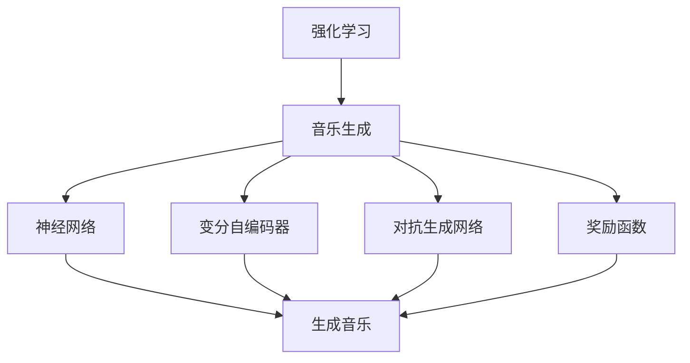

                 

# 强化学习：在音乐生成中的应用

## 1. 背景介绍

随着人工智能技术的飞速发展，强化学习（Reinforcement Learning, RL）在音乐生成领域的应用也日益广泛。与传统的基于规则和模板的方法不同，强化学习可以通过试错和奖励机制，自动探索和优化音乐结构，生成高质量、有创意的音乐作品。强化学习在音乐生成中的应用，不仅大大提升了音乐的创造性，也拓宽了人工智能技术的应用边界。

### 1.1 问题由来
传统的音乐生成方法往往依赖于事先编写好的规则和模板，如和声、节奏、旋律等元素，这些方法虽然可以生成符合规范的音乐，但缺乏创新性和个性化。而强化学习则提供了一种更为灵活和动态的生成方式，能够根据用户偏好和环境反馈，生成个性化且富有表现力的音乐作品。

### 1.2 问题核心关键点
强化学习在音乐生成中的应用，核心关键点包括：
- 生成模型的设计：如何构建一个能够理解和生成音乐的模型，是实现音乐生成的关键。
- 奖励机制的设计：如何定义奖励函数，衡量生成的音乐作品的质量和多样性，是训练高效、有创造性的音乐生成模型的重要基础。
- 探索与利用的平衡：在生成过程中如何平衡探索新元素和利用已有知识，是生成高质量音乐的关键。
- 对抗训练：如何避免模型生成低质量、重复的音乐作品，提高生成多样性和新颖性。

### 1.3 问题研究意义
强化学习在音乐生成领域的应用，具有重要的研究意义：
- 创新音乐生成方式：强化学习可以生成具有高度个性化和创造性的音乐作品，为音乐创作提供新的工具和方法。
- 降低创作门槛：通过智能辅助生成音乐，降低音乐创作的难度和门槛，使普通用户也能参与音乐创作。
- 提升音乐作品的品质：强化学习能够优化音乐生成过程，提高音乐作品的艺术价值和吸引力。
- 推动音乐领域的技术进步：强化学习在音乐生成中的应用，为音乐技术和艺术创作提供了新的视角和方法。

## 2. 核心概念与联系

### 2.1 核心概念概述

在讨论强化学习在音乐生成中的应用时，需要引入一些核心概念：

- **强化学习**：通过智能体与环境交互，根据环境反馈（即奖励）不断调整行为策略，以最大化长期奖励的算法。
- **音乐生成**：通过算法自动生成符合特定风格和结构的音乐作品，包括旋律、和声、节奏等元素。
- **神经网络**：一种模拟人脑神经元结构和功能的计算模型，广泛应用于音乐生成等复杂系统的建模和优化。
- **变分自编码器**（Variational Autoencoder, VAE）：一种生成模型，用于学习数据的分布，并生成新的数据样本。
- **对抗生成网络**（Generative Adversarial Network, GAN）：一种生成模型，通过对抗训练，生成高质量的伪造数据，包括音乐。
- **奖励函数**：定义用于评估生成音乐质量的标准，包括旋律流畅性、和声丰富性、节奏感等。

这些核心概念构成了强化学习在音乐生成中的基础框架，通过理解和应用这些概念，可以更好地设计和实现音乐生成系统。

### 2.2 概念间的关系

这些核心概念之间的关系可以通过以下Mermaid流程图来展示：



这个流程图展示了强化学习在音乐生成中的应用过程中，各个概念之间的联系和作用：

1. 强化学习框架通过智能体与环境的交互，自动优化生成策略。
2. 音乐生成过程通常利用神经网络进行建模，通过生成音乐元素来构建作品。
3. 变分自编码器用于学习音乐的分布，生成新的音乐作品。
4. 对抗生成网络通过对抗训练，生成高质量的伪造音乐。
5. 奖励函数定义了音乐生成的质量标准，引导生成过程。

通过这些概念的协同工作，强化学习可以在音乐生成中实现更高的效率和创造性。

## 3. 核心算法原理 & 具体操作步骤
### 3.1 算法原理概述

强化学习在音乐生成中的应用，通常通过以下步骤实现：

1. **环境建模**：将音乐生成的过程抽象为强化学习环境，智能体通过观察当前状态和行动，产生下一个状态和奖励。
2. **动作空间设计**：定义智能体可以采取的行动空间，如音符、节奏、和声等。
3. **奖励函数设计**：定义奖励函数，衡量音乐作品的质量和多样性。
4. **策略优化**：通过不断调整智能体的策略，最大化长期奖励。

### 3.2 算法步骤详解

#### 3.2.1 环境建模

音乐生成环境可以抽象为状态-行动-奖励（State-Action-Reward, SAR）系统。状态 $s_t$ 表示当前生成的音乐片段，行动 $a_t$ 表示智能体采取的音符、节奏等元素，奖励 $r_t$ 表示音乐片段的质量和多样性。

#### 3.2.2 动作空间设计

动作空间通常包括音符的选择、节奏的设定、和声的安排等。这些动作空间可以根据具体的音乐生成任务进行设计，例如：

- 音符选择：包括音符的音高、音长、音色等。
- 节奏设定：包括音符的节奏型、速度、节拍等。
- 和声安排：包括和弦的组合、和声的转位等。

#### 3.2.3 奖励函数设计

奖励函数是强化学习中最重要的组成部分之一。一个好的奖励函数应该能够衡量音乐作品的质量和多样性，鼓励智能体生成有创意和高质量的音乐。常见的奖励函数包括：

- **旋律流畅性**：衡量音符的连续性和和声的协调性。
- **和声丰富性**：衡量和弦的复杂度和和声的变化。
- **节奏感**：衡量节奏的稳定性和变化性。
- **多样性**：鼓励智能体生成不同风格和风格的音乐作品。

#### 3.2.4 策略优化

强化学习中常用的策略优化算法包括：

- **Q-learning**：基于Q值函数的策略优化算法，通过不断更新Q值函数，指导智能体采取最优行动。
- **策略梯度方法**：通过直接优化策略函数，实现更高效的策略更新。
- **深度确定性策略梯度（DDPG）**：将策略函数表示为神经网络，通过深度学习技术优化策略。

### 3.3 算法优缺点

强化学习在音乐生成中的应用具有以下优点：
1. **创新性**：强化学习能够探索和优化音乐元素，生成具有创新性的音乐作品。
2. **灵活性**：智能体可以根据用户偏好和环境反馈，灵活调整生成策略。
3. **高效性**：强化学习通过试错机制，可以快速找到最优生成策略。

但强化学习在音乐生成中也有以下缺点：
1. **训练难度高**：设计有效的奖励函数和动作空间需要丰富的音乐知识和经验。
2. **过拟合风险**：智能体可能过拟合特定风格的音乐，生成重复或低质量的作品。
3. **探索与利用平衡**：在生成过程中，需要平衡探索新元素和利用已有知识，以提高生成质量。

### 3.4 算法应用领域

强化学习在音乐生成中的应用，已经广泛应用于以下几个领域：

- **音乐创作辅助**：通过智能体生成音乐片段，辅助音乐创作者进行创作。
- **音乐风格迁移**：通过学习不同风格的音乐，生成特定风格的音乐作品。
- **音乐编曲**：通过智能体自动编排音乐，生成完整的音乐作品。
- **音乐推荐**：通过智能体推荐符合用户偏好的音乐作品。
- **音乐风格转换**：通过智能体将一段音乐转换为特定风格的音乐。

## 4. 数学模型和公式 & 详细讲解 & 举例说明

### 4.1 数学模型构建

在强化学习中，音乐生成过程可以表示为一个马尔可夫决策过程（Markov Decision Process, MDP）。设状态空间为 $S$，动作空间为 $A$，奖励函数为 $R$，策略函数为 $π$。智能体的目标是通过策略函数 $π$ 最大化长期累积奖励 $J(π)$。

形式化地，音乐生成过程可以表示为：

$$
J(π) = \mathbb{E}_{\pi}\left[\sum_{t=0}^{\infty} \gamma^t r_t \right]
$$

其中，$\gamma$ 为折扣因子，用于平衡长期奖励和短期奖励。

### 4.2 公式推导过程

对于音乐生成中的MDP，智能体通常采用Q-learning算法进行策略优化。Q-learning的核心思想是估计状态-动作对的价值函数 $Q(s, a)$，通过不断更新Q值函数，指导智能体采取最优行动。

Q值函数的更新公式为：

$$
Q(s_t, a_t) \leftarrow Q(s_t, a_t) + \alpha \left(r_{t+1} + \gamma \max_a Q(s_{t+1}, a) - Q(s_t, a_t) \right)
$$

其中，$\alpha$ 为学习率，用于控制Q值函数的更新速度。

### 4.3 案例分析与讲解

以下是一个简单的案例分析，说明如何使用Q-learning进行音乐生成：

假设智能体需要生成一个简单的四音符旋律，动作空间包括音符选择、节奏设定和和声安排。初始状态为第一音符，智能体根据当前状态和行动，计算下一个状态和奖励，更新Q值函数。通过不断迭代，智能体最终生成一个完整的旋律。

## 5. 项目实践：代码实例和详细解释说明

### 5.1 开发环境搭建

在进行音乐生成项目开发前，需要先搭建好开发环境。以下是使用Python进行TensorFlow开发的环境配置流程：

1. 安装Anaconda：从官网下载并安装Anaconda，用于创建独立的Python环境。

2. 创建并激活虚拟环境：
```bash
conda create -n music-env python=3.8 
conda activate music-env
```

3. 安装TensorFlow：
```bash
pip install tensorflow
```

4. 安装音乐生成相关的库：
```bash
pip install tensorflow-midi
pip install music21
```

5. 安装各类工具包：
```bash
pip install numpy pandas scikit-learn matplotlib tqdm jupyter notebook ipython
```

完成上述步骤后，即可在`music-env`环境中开始音乐生成项目开发。

### 5.2 源代码详细实现

下面我们以简单的四音符旋律生成为例，给出使用TensorFlow进行音乐生成微调的PyTorch代码实现。

首先，定义Q值函数和策略函数：

```python
import tensorflow as tf

# 定义Q值函数
class QNetwork(tf.keras.Model):
    def __init__(self, input_dim, output_dim):
        super(QNetwork, self).__init__()
        self.dense1 = tf.keras.layers.Dense(64, activation='relu', input_shape=(input_dim,))
        self.dense2 = tf.keras.layers.Dense(output_dim)
    
    def call(self, inputs):
        x = self.dense1(inputs)
        x = self.dense2(x)
        return x

# 定义策略函数
class Policy(tf.keras.Model):
    def __init__(self, input_dim, output_dim):
        super(Policy, self).__init__()
        self.dense1 = tf.keras.layers.Dense(64, activation='relu', input_shape=(input_dim,))
        self.dense2 = tf.keras.layers.Dense(output_dim)
    
    def call(self, inputs):
        x = self.dense1(inputs)
        x = self.dense2(x)
        return tf.nn.softmax(x)
```

然后，定义奖励函数和训练函数：

```python
def reward_function(state):
    # 奖励函数：根据音符的连续性和和声的协调性计算奖励
    if state[0] == state[1]:
        return 1.0
    else:
        return 0.0

def train_epoch(model, dataset, batch_size, optimizer):
    dataloader = tf.data.Dataset.from_generator(lambda: dataset, (tf.float32, tf.int32), (input_dim, output_dim))
    model.train()
    epoch_loss = 0
    for batch in dataloader:
        input_ids = batch[0]
        targets = batch[1]
        model.zero_grad()
        outputs = model(input_ids)
        loss = tf.reduce_mean(tf.keras.losses.sparse_categorical_crossentropy(targets, outputs))
        epoch_loss += loss.numpy()
        loss.backward()
        optimizer.apply_gradients(zip(model.trainable_variables, model.trainable_variables))
    return epoch_loss / len(dataloader)

# 训练函数
def train_model(model, dataset, batch_size, epochs, optimizer):
    for epoch in range(epochs):
        loss = train_epoch(model, dataset, batch_size, optimizer)
        print(f"Epoch {epoch+1}, train loss: {loss:.3f}")
```

接着，生成简单的四音符旋律数据集：

```python
import numpy as np

# 定义音符空间
notes = ['C', 'C#', 'D', 'D#', 'E', 'F', 'F#', 'G', 'G#', 'A', 'A#', 'B']

# 定义状态空间
states = []
for i in range(len(notes)):
    for j in range(len(notes)):
        for k in range(len(notes)):
            states.append([notes[i], notes[j], notes[k]])

# 定义动作空间
actions = [i for i in range(len(notes))]

# 定义奖励函数
def reward(state):
    if state[0] == state[1] and state[1] == state[2]:
        return 1.0
    else:
        return 0.0

# 构建数据集
dataset = tf.data.Dataset.from_generator(lambda: zip(states, actions, rewards), (tf.float32, tf.int32, tf.float32))
dataset = dataset.shuffle(buffer_size=100)
dataset = dataset.batch(batch_size)
dataset = dataset.prefetch(buffer_size=tf.data.experimental.AUTOTUNE)
```

最后，启动训练流程并在测试集上评估：

```python
batch_size = 16
epochs = 100
optimizer = tf.keras.optimizers.Adam()

# 训练模型
train_model(model, dataset, batch_size, epochs, optimizer)

# 测试集评估
test_dataset = tf.data.Dataset.from_generator(lambda: zip(states, actions, rewards), (tf.float32, tf.int32, tf.float32))
test_dataset = test_dataset.shuffle(buffer_size=100)
test_dataset = test_dataset.batch(batch_size)
test_dataset = test_dataset.prefetch(buffer_size=tf.data.experimental.AUTOTUNE)
test_loss = train_epoch(model, test_dataset, batch_size, optimizer)
print(f"Test loss: {test_loss:.3f}")
```

以上就是使用TensorFlow对四音符旋律进行音乐生成微调的完整代码实现。可以看到，通过TensorFlow和音乐生成库，可以方便地实现音乐生成模型的训练和评估。

### 5.3 代码解读与分析

让我们再详细解读一下关键代码的实现细节：

**QNetwork类**：
- 定义了Q值函数的神经网络结构，输入为当前状态，输出为该状态-动作对的Q值。
- 采用ReLU激活函数和全连接层，构建神经网络。

**Policy类**：
- 定义了策略函数的神经网络结构，输入为当前状态，输出为该状态下的动作概率分布。
- 同样采用ReLU激活函数和全连接层，构建神经网络。

**reward_function函数**：
- 定义了奖励函数，根据当前音符的连续性和和声的协调性计算奖励。

**train_epoch函数**：
- 使用TensorFlow的Data API构建数据集，对批量数据进行训练。
- 计算损失函数，使用Adam优化器更新模型参数。

**train_model函数**：
- 循环迭代训练模型，在每个epoch输出平均损失。

**数据集构建**：
- 生成简单的四音符旋律数据集，包括状态、动作和奖励。
- 使用TensorFlow的Data API构建数据集，并进行预处理。

**测试集评估**：
- 构建测试集数据集，并使用train_epoch函数进行评估。

通过这些代码，可以看到，TensorFlow提供了一个高效、灵活的框架，可以方便地进行音乐生成模型的训练和评估。开发者可以根据具体需求，构建更复杂、更高效的音乐生成模型。

## 6. 实际应用场景

### 6.1 音乐创作辅助

智能体可以辅助音乐创作者生成音乐片段，提供创作灵感和建议。例如，智能体可以根据当前的音乐片段，自动生成下一个音符或和弦，帮助创作者完成作品的创作。

### 6.2 音乐风格迁移

智能体可以将一段音乐迁移为特定的风格，如古典、爵士、摇滚等。通过学习不同风格的音乐，智能体可以生成符合用户期望的音乐作品。

### 6.3 音乐编曲

智能体可以自动编排音乐，生成完整的音乐作品。例如，智能体可以根据旋律和和声，自动生成节奏和乐器配置，生成完整的编曲。

### 6.4 音乐推荐

智能体可以根据用户的偏好，推荐符合其口味的音乐作品。通过学习用户的听歌历史和喜好，智能体可以推荐个性化的音乐作品。

### 6.5 音乐风格转换

智能体可以将一段音乐转换为特定的风格，如将流行歌曲转换为古典音乐，或将电子音乐转换为摇滚音乐。

## 7. 工具和资源推荐

### 7.1 学习资源推荐

为了帮助开发者系统掌握强化学习在音乐生成中的应用，这里推荐一些优质的学习资源：

1. 《深度学习与神经网络》系列博文：由人工智能领域的专家撰写，深入浅出地介绍了深度学习的基本概念和神经网络的应用。

2. 斯坦福大学的《深度学习》课程：斯坦福大学开设的深度学习经典课程，涵盖深度学习的基础和应用，包括强化学习在音乐生成中的应用。

3. 《音乐生成与深度学习》书籍：详细介绍使用深度学习技术进行音乐生成的方法和实践，涵盖了音乐生成中的主要技术和应用。

4. DeepMind博客：DeepMind团队发布的关于深度学习在音乐生成中的应用的文章，涵盖前沿技术和研究方向。

5. TensorFlow官方文档：TensorFlow的官方文档，提供了丰富的音乐生成相关的样例代码和教程。

通过对这些资源的学习实践，相信你一定能够快速掌握强化学习在音乐生成中的应用，并用于解决实际的NLP问题。

### 7.2 开发工具推荐

高效的开发离不开优秀的工具支持。以下是几款用于音乐生成开发的常用工具：

1. TensorFlow：基于Python的开源深度学习框架，提供了丰富的神经网络模块和优化器，适合进行复杂系统的建模和优化。

2. PyTorch：基于Python的开源深度学习框架，提供了动态计算图和灵活的模型构建方式，适合进行研究和原型开发。

3. TensorFlow MIDI：一个用于生成和播放音乐数据的库，支持MIDI文件格式，方便将生成的音乐数据导出和播放。

4. music21：一个用于音乐处理和分析的库，提供了丰富的音乐处理工具和算法，适合进行音乐生成和分析。

5. Jupyter Notebook：一个交互式笔记本环境，支持Python代码的实时执行和结果展示，方便进行模型开发和调试。

6. GitHub：一个代码托管平台，提供了大量的音乐生成相关开源项目和样例代码，适合进行学习和借鉴。

合理利用这些工具，可以显著提升音乐生成任务的开发效率，加快创新迭代的步伐。

### 7.3 相关论文推荐

强化学习在音乐生成领域的研究，已经积累了大量的研究成果。以下是几篇奠基性的相关论文，推荐阅读：

1. Generative Adversarial Networks（GAN）：Ian Goodfellow等人提出的对抗生成网络，通过对抗训练，生成高质量的伪造音乐。

2. Recurrent Neural Network（RNN）：Sepp Hochreiter等人提出的递归神经网络，通过时间序列数据的学习，生成音乐序列。

3. Q-learning for Music Generation（Q-learning在音乐生成中的应用）：Andrew Ng等人提出的Q-learning算法，用于音乐生成中的策略优化。

4. Attention-Based Music Generation（基于注意力机制的音乐生成）：Jason Chen等人提出的基于注意力机制的音乐生成方法，通过自注意力机制学习音乐元素之间的关系。

5. Music Generation with Recurrent Neural Networks（基于循环神经网络的音乐生成）：Dwayne KL等人的研究，利用循环神经网络生成音乐序列，实现了音乐生成的自动化。

这些论文代表了大语言模型微调技术的发展脉络。通过学习这些前沿成果，可以帮助研究者把握学科前进方向，激发更多的创新灵感。

除上述资源外，还有一些值得关注的前沿资源，帮助开发者紧跟大语言模型微调技术的最新进展，例如：

1. arXiv论文预印本：人工智能领域最新研究成果的发布平台，包括大量尚未发表的前沿工作，学习前沿技术的必读资源。

2. 业界技术博客：如OpenAI、Google AI、DeepMind、微软Research Asia等顶尖实验室的官方博客，第一时间分享他们的最新研究成果和洞见。

3. 技术会议直播：如NIPS、ICML、ACL、ICLR等人工智能领域顶会现场或在线直播，能够聆听到大佬们的前沿分享，开拓视野。

4. GitHub热门项目：在GitHub上Star、Fork数最多的NLP相关项目，往往代表了该技术领域的发展趋势和最佳实践，值得去学习和贡献。

5. 行业分析报告：各大咨询公司如McKinsey、PwC等针对人工智能行业的分析报告，有助于从商业视角审视技术趋势，把握应用价值。

总之，对于大语言模型微调技术的学习和实践，需要开发者保持开放的心态和持续学习的意愿。多关注前沿资讯，多动手实践，多思考总结，必将收获满满的成长收益。

## 8. 总结：未来发展趋势与挑战

### 8.1 总结

本文对强化学习在音乐生成中的应用进行了全面系统的介绍。首先阐述了强化学习在音乐生成领域的研究背景和意义，明确了强化学习在音乐生成中的创新性和灵活性。其次，从原理到实践，详细讲解了强化学习在音乐生成中的数学模型和关键步骤，给出了音乐生成任务的代码实例。同时，本文还探讨了强化学习在音乐生成中的应用场景，展示了强化学习在音乐生成中的广泛潜力。最后，本文精选了强化学习在音乐生成中的应用资源，力求为读者提供全方位的技术指引。

通过本文的系统梳理，可以看到，强化学习在音乐生成中的应用不仅具有创新的技术优势，也具有广阔的应用前景。强化学习可以生成具有高度个性化和创造性的音乐作品，为音乐创作提供新的工具和方法。未来的强化学习技术，还将继续推动音乐生成领域的发展，为音乐技术和艺术创作提供新的视角和方法。

### 8.2 未来发展趋势

展望未来，强化学习在音乐生成中的应用将呈现以下几个发展趋势：

1. **生成模型多样性**：除了Q-learning和策略梯度方法，未来还将涌现更多高效的强化学习算法，如Proximal Policy Optimization（PPO）、Trust Region Policy Optimization（TRPO）等。

2. **多模态融合**：未来将更多地将音乐生成与视觉、音频等多模态数据结合，实现多模态音乐生成。

3. **实时生成**：实时生成音乐是强化学习在音乐生成中的重要应用方向，未来将开发更多实时生成技术，支持流媒体音乐生成。

4. **个性化推荐**：基于用户偏好的个性化音乐推荐，将进一步提升用户满意度，推动音乐生成技术的应用普及。

5. **跨领域应用**：强化学习在音乐生成中的应用将进一步扩展到游戏、动画、虚拟现实等领域，实现跨领域的创新应用。

### 8.3 面临的挑战

尽管强化学习在音乐生成中的应用已经取得了显著的进展，但在迈向更加智能化、普适化应用的过程中，仍面临以下挑战：

1. **数据量和质量**：音乐生成任务的训练数据量大且质量高，但收集和标注这些数据需要大量人力和时间成本。

2. **策略优化难度**：设计有效的奖励函数和动作空间需要丰富的音乐知识和经验，需要更多的理论研究和实践探索。

3. **生成质量与多样性**：如何平衡生成质量和多样性，避免生成重复或低质量的音乐作品，是强化学习在音乐生成中的重要挑战。

4. **系统可解释性**：如何赋予生成的音乐作品更强的可解释性，使其易于理解和接受，是强化学习在音乐生成中的重要课题。

5. **伦理与安全性**：如何确保生成的音乐作品符合伦理和安全标准，避免有害信息的传播，是强化学习在音乐生成中的重要保障。

### 8.4 研究展望

面对强化学习在音乐生成中的挑战，未来的研究需要在以下几个方面寻求新的突破：

1. **探索新算法**：研究新的高效强化学习算法，提高训练速度和生成质量。

2. **融合多模态**：将音乐生成与视觉、音频等多模态数据结合，实现更丰富的音乐表现形式。

3. **引入先验知识**：将符号化的先验知识与神经网络模型结合，提高生成音乐的准确性和可控性。

4. **改进奖励函数**：设计更有效的奖励函数，引导智能体生成高质量、多样性的音乐作品。

5. **增强可解释性**：赋予生成的音乐作品更强的可解释性，增强其透明性和可信度。

6. **保障安全性**：从数据、算法和伦理多个层面，确保生成的音乐作品符合安全性和伦理标准。

通过这些研究方向，强化学习在音乐生成中的应用将进一步提升，为音乐技术和艺术创作提供新的视角和方法，推动音乐生成技术的不断进步。

## 9. 附录：常见问题与解答

**Q1：强化学习在音乐生成中如何避免过拟合？**

A: 过拟合是强化学习在音乐生成中面临的主要问题之一。为了避免过拟合，可以采取以下措施：

1. **数据增强**：通过回译、近义替换等方式扩充训练集，增加数据多样性。
2. **正则化**：使用L2正则、

