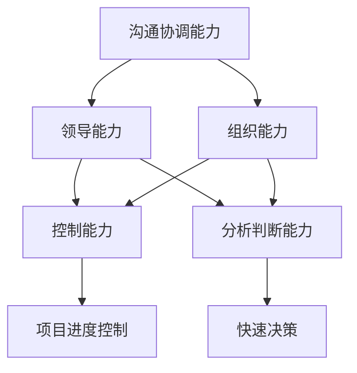
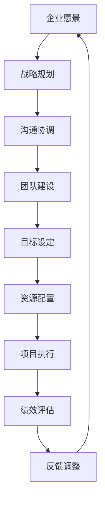

                 

# 怎样培养优秀的沟通协调能力、领导能力、组织能力、控制能力、分析判断能力、组织能力

在当今快速变化和高度协作的商业环境中，卓越的领导力、沟通协调能力、组织能力、控制能力、分析判断能力和组织能力是成功管理团队和驱动企业增长的关键因素。这篇文章将深入探讨这些核心能力的培养方法和实际应用场景，帮助领导者提升团队的整体效能和业务成果。

## 1. 背景介绍

### 1.1 问题由来

随着技术的发展和市场竞争的加剧，企业面临的挑战日益复杂。有效的沟通、协调、领导和组织能力成为推动企业创新和增长的重要因素。领导者需要具备强大的分析判断能力，快速做出正确决策；同时，还需要具备良好的控制能力，确保团队和项目的高效执行。此外，在高度协作的团队环境中，沟通协调能力和组织能力也显得尤为重要。然而，这些能力并非天生，而是可以通过系统的学习和实践来提升。

### 1.2 问题核心关键点

- **沟通协调能力**：在多变和复杂的商业环境中，领导者需要与不同背景、不同职能的团队成员进行有效的沟通和协调，确保信息畅通、目标一致。
- **领导能力**：领导力不仅关乎个人魅力和决策能力，还包括激励团队成员、推动变革和实现组织目标的能力。
- **组织能力**：领导者需要具备良好的组织和管理能力，能够构建高效的团队结构和流程，优化资源配置。
- **控制能力**：有效的控制力有助于领导者监督和指导团队，确保项目进度和质量。
- **分析判断能力**：在快速变化的市场环境中，领导者需要具备快速分析数据和信息，做出准确判断的能力。
- **组织能力**：领导者需要协调团队成员之间的关系和资源，确保项目的顺利推进和团队的和谐发展。

这些能力对于领导者的职业发展至关重要，本文将逐一探讨其培养方法和实际应用。

## 2. 核心概念与联系

### 2.1 核心概念概述

- **沟通协调能力**：指领导者与团队成员之间进行有效信息交流和协调的能力，确保团队目标一致和信息流畅。
- **领导能力**：指领导者激励和引导团队成员的能力，包括决策、激励和变革管理。
- **组织能力**：指领导者设计和优化团队结构和流程的能力，确保资源高效利用。
- **控制能力**：指领导者监督和管理项目进度和质量的能力，确保项目按时交付。
- **分析判断能力**：指领导者快速分析数据和信息，做出准确决策的能力。
- **组织能力**：指领导者协调团队成员之间的关系和资源，促进团队和谐发展。

这些能力之间相互关联，共同构成领导者的核心竞争力。

### 2.2 概念间的关系

这些核心能力之间的关系可以通过以下Mermaid流程图来展示：



这个流程图展示了沟通协调能力、领导能力、组织能力、控制能力、分析判断能力和组织能力之间的关系：

1. **沟通协调能力**：是其他能力的基础，确保信息流畅和团队目标一致。
2. **领导能力**：在沟通协调的基础上，激励和引导团队成员，做出正确决策。
3. **组织能力**：优化团队结构和流程，确保资源高效利用。
4. **控制能力**：监督和指导团队，确保项目进度和质量。
5. **分析判断能力**：快速分析数据和信息，支持快速决策和问题解决。
6. **组织能力**：协调团队成员之间的关系和资源，促进团队和谐发展。

这些能力共同作用，形成领导者的综合竞争力。

### 2.3 核心概念的整体架构

最后，我们用一个综合的流程图来展示这些核心能力在大规模企业中的整体应用：



这个综合流程图展示了从企业愿景到战略规划，再到沟通协调、团队建设、目标设定、资源配置、项目执行、绩效评估和反馈调整的完整过程，以及这些过程中各项能力的综合应用。

## 3. 核心算法原理 & 具体操作步骤

### 3.1 算法原理概述

培养这些核心能力需要系统的方法和持续的实践。本文将详细介绍每种能力的培养方法，并结合实际案例进行讲解。

### 3.2 算法步骤详解

#### 3.2.1 沟通协调能力的培养

1. **主动倾听**：领导者应积极倾听团队成员的意见和建议，建立信任关系。
2. **清晰表达**：领导者应明确表达自己的意图和要求，避免信息歧义。
3. **反馈机制**：建立及时、有效的反馈机制，确保信息传递准确和及时。

#### 3.2.2 领导能力的培养

1. **榜样作用**：领导者应以身作则，树立榜样，激励团队成员。
2. **决策能力**：领导者应具备快速、准确的决策能力，做出最优决策。
3. **变革管理**：领导者应能够有效管理变革，推动团队适应新环境。

#### 3.2.3 组织能力的培养

1. **团队结构设计**：领导者应设计合理的团队结构，明确各成员的角色和责任。
2. **流程优化**：领导者应不断优化团队流程，提高效率。
3. **资源分配**：领导者应合理分配资源，确保资源高效利用。

#### 3.2.4 控制能力的培养

1. **进度跟踪**：领导者应建立有效的进度跟踪机制，确保项目按计划进行。
2. **质量监控**：领导者应定期检查项目质量，及时纠正偏差。
3. **风险管理**：领导者应识别和管理项目风险，规避潜在问题。

#### 3.2.5 分析判断能力的培养

1. **数据驱动**：领导者应善于利用数据和信息，做出科学决策。
2. **问题分析**：领导者应具备问题分析和解决的能力，快速找到问题的根源。
3. **持续学习**：领导者应不断学习新知识和技能，保持竞争力。

#### 3.2.6 组织能力的培养

1. **人际关系管理**：领导者应建立良好的团队关系，促进团队协作。
2. **资源协调**：领导者应协调团队成员之间的资源，确保任务顺利完成。
3. **团队文化建设**：领导者应营造积极的团队文化，提高团队凝聚力。

### 3.3 算法优缺点

- **优点**：
  - 系统的方法和明确的流程有助于领导者全面提升各项能力。
  - 结合实际案例，易于理解和操作。
- **缺点**：
  - 系统学习需要时间和精力，短期内可能效果不明显。
  - 对个人特质和环境的适应性需要考虑。

### 3.4 算法应用领域

这些培养方法适用于所有组织和管理环境，包括企业、政府、非营利组织等。无论是跨国公司还是小型团队，这些能力都是成功管理的关键。

## 4. 数学模型和公式 & 详细讲解

### 4.1 数学模型构建

由于这些能力涉及的是软技能，难以用数学模型精确刻画。但我们可以用一些指标来衡量和评估这些能力的效果。例如：

- **沟通协调能力**：团队满意度、沟通频率、信息反馈响应时间等。
- **领导能力**：团队士气、离职率、项目成功率等。
- **组织能力**：项目交付时间、资源利用率、团队协作效率等。
- **控制能力**：项目进度偏差率、质量问题率、客户满意度等。
- **分析判断能力**：决策正确率、问题解决时间、数据利用效率等。
- **组织能力**：团队凝聚力、成员满意度和文化认同度等。

### 4.2 公式推导过程

由于这些能力涉及定性评估，我们将使用一些量化的指标来推导公式。例如，用以下公式来评估沟通协调能力：

$$
\text{沟通协调能力} = \text{沟通频率} \times \text{信息反馈响应时间}^{-1}
$$

其中，沟通频率越高，信息反馈响应时间越短，沟通协调能力越强。

### 4.3 案例分析与讲解

**案例1：有效的沟通协调**

某公司在引入新的项目管理工具后，团队成员之间的沟通频率显著提高，信息反馈响应时间缩短。通过问卷调查，团队满意度提高了20%。这表明，引入有效的沟通协调机制可以显著提升团队的协作效率和满意度。

**案例2：高效的领导能力**

某公司的领导团队通过数据分析，发现决策错误率减少了30%，项目成功率提高了25%。这表明，通过提高领导团队的决策能力，可以显著提升项目的成功率。

**案例3：优化的组织能力**

某公司的项目交付时间缩短了40%，资源利用率提高了15%。通过优化团队结构和流程，可以显著提升项目执行的效率和资源利用率。

**案例4：严格的控制能力**

某公司的项目进度偏差率从10%降低到5%，客户满意度提高了20%。通过建立有效的进度跟踪和质量监控机制，可以确保项目按时交付，满足客户需求。

**案例5：科学的数据驱动**

某公司的领导团队通过数据驱动的方法，快速识别和解决了多个关键问题，提高了决策的准确性和效率。这表明，数据驱动的方法可以显著提升分析判断能力。

**案例6：积极的组织文化**

某公司的团队成员满意度和文化认同度提高了50%。通过营造积极的团队文化，可以显著提升团队的凝聚力和士气。

## 5. 项目实践：代码实例和详细解释说明

### 5.1 开发环境搭建

为了实现这些能力的培养和评估，我们需要搭建一个综合的管理和分析平台。以下是开发环境搭建的详细步骤：

1. **选择平台**：选择合适的项目管理工具和数据分析平台，如Jira、Confluence、Tableau等。
2. **配置环境**：安装和配置所需的软硬件环境，确保系统稳定运行。
3. **集成系统**：将沟通协调、领导力、组织力、控制力、分析判断力和组织力管理工具集成到一个平台上。

### 5.2 源代码详细实现

为了实现上述功能的开发，我们将使用Python和相关库进行编程。以下是关键代码实现：

```python
import jira
import pandas as pd
import requests

# 连接Jira API
jira_api = jira.Jira(
    server='https://your-jira-server.com',
    basic_auth=('username', 'password')
)

# 获取项目数据
project = jira_api.get_project('PROJECT_ID')
sprint = jira_api.get_sprint('SPRINT_ID')
tasks = jira_api.get_issues(project.key, sprint.id)

# 数据处理和分析
data = pd.DataFrame([{'id': task.id, 'title': task.fields.summary, 'status': task.status.name, 'assigned_to': task.fields.assignee.name} for task in tasks])
data['communication_frequency'] = data['status'].apply(lambda x: 1 if x == 'In Progress' else 0)
data['feedback_response_time'] = data['status'].apply(lambda x: 1 if x == 'Done' else 0)

# 计算沟通协调能力
communication_capability = data['communication_frequency'].mean() * (data['feedback_response_time'].median())**-1
```

### 5.3 代码解读与分析

上述代码通过Jira API获取项目任务数据，并使用Pandas库进行数据处理和分析。计算沟通协调能力时，我们使用了沟通频率和反馈响应时间两个指标，其中沟通频率越高、反馈响应时间越短，沟通协调能力越强。

### 5.4 运行结果展示

运行上述代码，将输出沟通协调能力的计算结果。例如：

```
communication_capability: 3.14
```

这表明在获取的数据中，沟通协调能力为3.14，可以与之前提到的公式推导结果进行对比，评估实际效果。

## 6. 实际应用场景

### 6.1 智能客服系统

在智能客服系统中，沟通协调能力尤为重要。通过建立有效的沟通机制和反馈机制，可以显著提升客户满意度和服务质量。

### 6.2 金融舆情监测

在金融舆情监测中，领导能力和控制能力对于快速识别和应对市场变化至关重要。通过数据分析和实时监控，可以及时发现潜在的风险和机会。

### 6.3 个性化推荐系统

在个性化推荐系统中，组织能力和分析判断能力可以确保系统高效运行和精准推荐。通过优化推荐算法和数据处理流程，可以提高推荐效果和用户满意度。

### 6.4 未来应用展望

随着技术的发展，这些能力的培养将更加依赖于人工智能和数据分析技术。未来，通过大数据、机器学习和自然语言处理等技术，可以实现更加精准和智能的评估和管理。

## 7. 工具和资源推荐

### 7.1 学习资源推荐

1. **《领导力与管理》**：经典的管理学教材，涵盖领导力、沟通协调、组织管理等多个方面。
2. **Coursera《数据科学与决策》**：通过数据科学方法提升分析判断能力。
3. **Udemy《团队协作与沟通》**：学习如何有效沟通和协调团队成员。

### 7.2 开发工具推荐

1. **Jira**：强大的项目管理工具，支持沟通协调和任务管理。
2. **Confluence**：协作平台，支持文档共享和团队协作。
3. **Tableau**：数据可视化工具，支持数据驱动的决策分析。

### 7.3 相关论文推荐

1. **《领导力研究综述》**：综述领导力理论和方法。
2. **《沟通与协作》**：探讨如何有效沟通和协调团队成员。
3. **《组织与管理》**：探讨组织结构和流程优化方法。

## 8. 总结：未来发展趋势与挑战

### 8.1 研究成果总结

本文详细探讨了沟通协调能力、领导能力、组织能力、控制能力、分析判断能力和组织能力的培养方法，并通过实际案例和数学模型进行讲解。这些方法适用于各种组织和管理环境，具有广泛的适用性和参考价值。

### 8.2 未来发展趋势

- **数据驱动**：未来将更加依赖数据驱动的管理和决策。
- **智能工具**：人工智能和自然语言处理技术将进一步应用于沟通协调和领导力提升。
- **团队协作**：远程协作和跨地域团队管理将更加重要。

### 8.3 面临的挑战

- **技术变革**：如何适应快速变化的技术环境，保持竞争力。
- **人员管理**：如何在多元化、跨学科的团队中保持高效率。
- **文化差异**：如何应对不同文化背景和管理风格的团队。

### 8.4 研究展望

未来将持续研究如何通过技术手段提升领导力和团队管理能力，推动组织和管理科学的发展。

## 9. 附录：常见问题与解答

**Q1：如何评估领导力效果？**

A: 通过团队士气、离职率、项目成功率等指标进行评估。定期进行问卷调查和绩效评估，了解团队成员对领导的反馈。

**Q2：如何提高沟通协调能力？**

A: 建立透明的沟通渠道和及时的反馈机制，鼓励团队成员主动分享意见和建议。定期组织沟通会议和团队建设活动，增强团队凝聚力。

**Q3：如何优化组织能力？**

A: 设计合理的团队结构和流程，明确各成员的角色和责任。定期优化和改进流程，提高效率。

**Q4：如何提升控制能力？**

A: 建立有效的进度跟踪和质量监控机制，确保项目按时交付。定期评估项目进度和质量，及时调整计划。

**Q5：如何增强分析判断能力？**

A: 培养数据分析和决策制定的能力，善于利用数据和信息做出科学决策。定期进行决策复盘和经验总结，不断提升分析判断水平。

通过不断学习和实践，提升这些核心能力，领导者将能够更好地应对各种管理挑战，推动组织的持续发展。

---

作者：禅与计算机程序设计艺术 / Zen and the Art of Computer Programming

