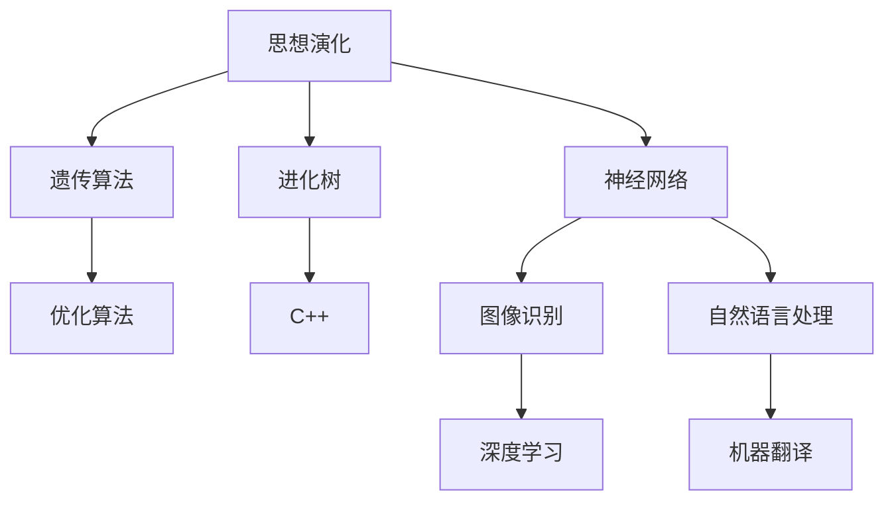
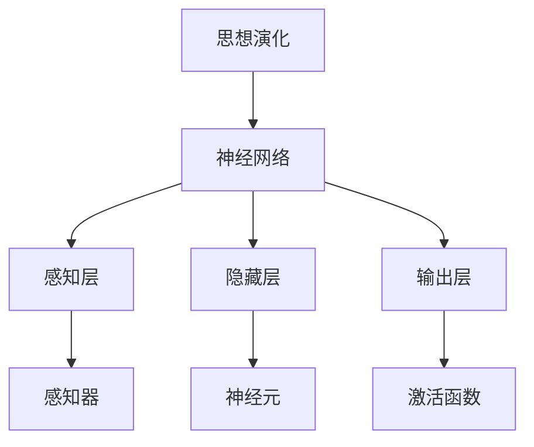
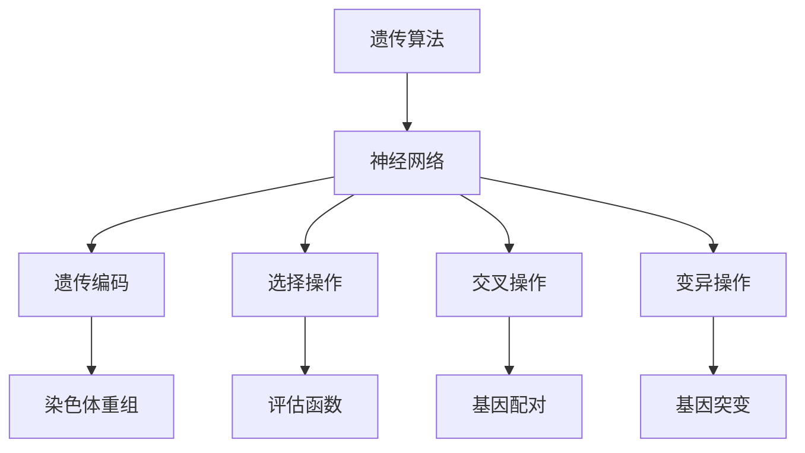
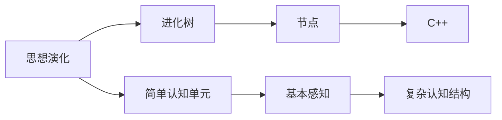
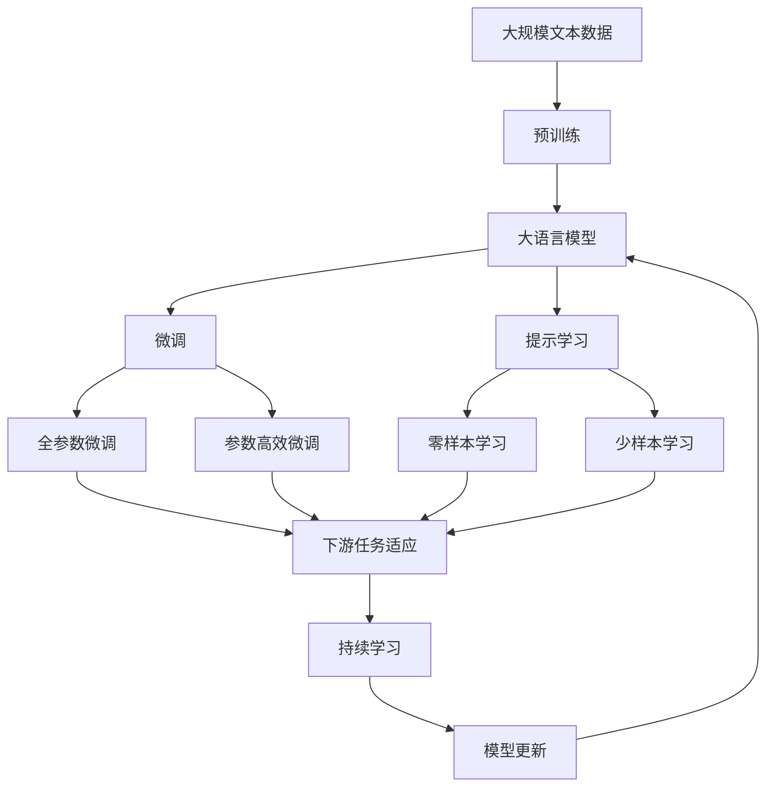
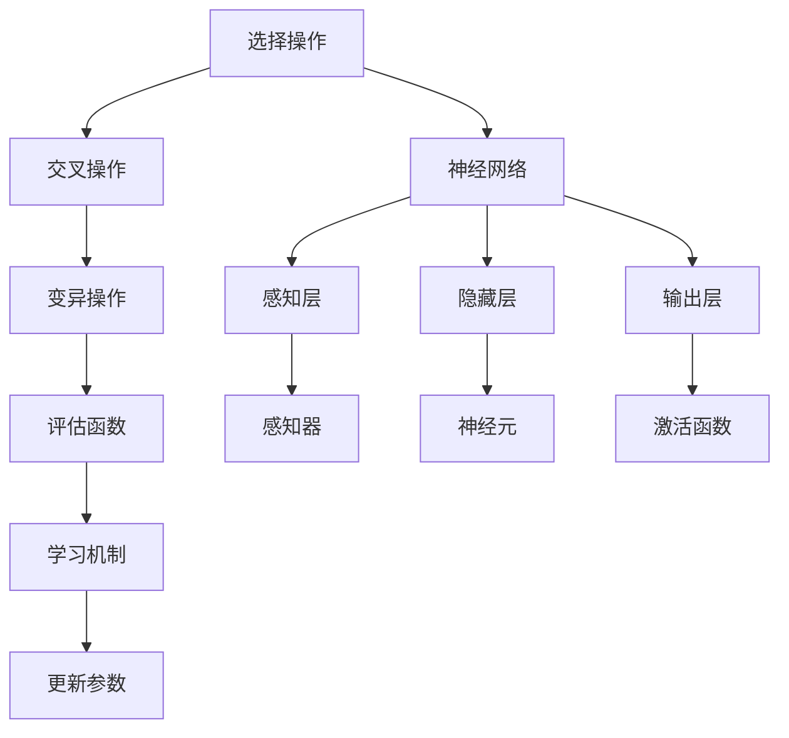

                 

# 思想的进化：从简单到复杂

> 关键词：思想演化,复杂性,算法优化,认知科学,大脑模型

## 1. 背景介绍

### 1.1 问题由来
人类思维的演化，是一个从简单到复杂、从混沌到秩序的漫长过程。从最初的单体细胞，到后来的大脑、神经系统和复杂的认知功能，我们的思维能力得以不断提升。然而，这种进化是如何发生的？是否存在某种机制在驱动这一过程？本文将从算法和认知科学的角度，探讨思想的进化，并尝试回答这些问题。

### 1.2 问题核心关键点
研究思想的进化，首先需理解其背后的机制和原则。核心问题包括：
- 什么是思想演化的基本单元？
- 思想演化是如何实现从简单到复杂的跃迁？
- 算法和认知科学对思想演化的解释和应用有哪些？

### 1.3 问题研究意义
理解思想演化的机制，不仅有助于深入认识人类认知的本质，还能够为人工智能的发展提供灵感。尤其是在人工智能领域，如何设计算法，使其能够实现从简单到复杂、从低级到高级的学习和演化，是当前研究的重要方向。通过借鉴思想演化的原理，开发具有自适应和自学习能力的人工智能系统，将开辟新的技术路径。

## 2. 核心概念与联系

### 2.1 核心概念概述

为了更好地理解思想演化的机制，本节将介绍几个关键概念：

- **思想演化**：指从简单的认知单元到复杂的认知结构的过程，即从基本的感知、记忆和响应能力，到形成复杂的推理、决策和创新能力的过程。
- **神经网络**：由大量神经元和它们之间的连接组成的计算模型，模拟人脑的神经结构和功能，广泛用于图像识别、自然语言处理等任务。
- **遗传算法**：一种基于生物进化过程的优化算法，通过模拟自然选择和遗传操作，寻找最优解。
- **进化树**：用于展示物种演化路径的树形结构，各节点表示不同的演化阶段，边表示演化关系。
- **认知科学**：研究人类认知过程及其基础的跨学科领域，包括心理学、神经科学、计算机科学等。

这些核心概念之间的逻辑关系可以通过以下Mermaid流程图来展示：



这个流程图展示了一些核心概念的基本关系：

1. 思想演化包括神经网络和遗传算法等优化方法，用于从简单的认知单元进化到复杂的认知结构。
2. 神经网络实现了基本的感知和响应能力，通过深度学习等方法，可以处理更复杂的数据和任务。
3. 进化树帮助可视化思想演化的路径，有助于理解复杂认知结构的形成过程。
4. 遗传算法用于模拟自然选择和遗传操作，优化神经网络的参数和结构，实现从简单到复杂的演化。

### 2.2 概念间的关系

这些核心概念之间存在着紧密的联系，形成了思想演化的完整生态系统。下面我们通过几个Mermaid流程图来展示这些概念之间的关系。

#### 2.2.1 思想演化与神经网络



这个流程图展示了思想演化与神经网络的基本结构关系：

1. 思想演化通过神经网络实现基本的感知和响应能力。
2. 神经网络由感知层、隐藏层和输出层组成，每个层中包含多个神经元。
3. 感知器接收输入信号，神经元计算加权和后经过激活函数输出结果。
4. 隐藏层用于提取特征和进行复杂的计算，输出层用于将计算结果转换为输出信号。

#### 2.2.2 遗传算法与神经网络



这个流程图展示了遗传算法与神经网络的关系：

1. 遗传算法通过模拟自然选择和遗传操作，优化神经网络的参数和结构。
2. 遗传算法将神经网络表示为基因串，通过选择、交叉和变异操作，生成新的基因串。
3. 染色体重组表示通过交叉操作将两个基因串中的信息结合，生成新的基因串。
4. 选择操作表示评估函数对新生成的基因串进行评估，选择优胜者。
5. 变异操作表示对基因串进行随机变异，增加基因多样性。

#### 2.2.3 思想演化与进化树



这个流程图展示了思想演化与进化树的关系：

1. 思想演化通过进化树展示其演化路径。
2. 进化树包含多个节点，每个节点表示不同的演化阶段。
3. 简单认知单元通过选择、交叉和变异操作，逐步进化为复杂认知结构。
4. 每个节点代表一种认知结构，节点间的边表示演化关系。

### 2.3 核心概念的整体架构

最后，我们用一个综合的流程图来展示这些核心概念在大语言模型微调过程中的整体架构：



这个综合流程图展示了从预训练到微调，再到持续学习的完整过程。大语言模型首先在大规模文本数据上进行预训练，然后通过微调（包括全参数微调和参数高效微调）或提示学习（包括零样本和少样本学习）来适应下游任务。最后，通过持续学习技术，模型可以不断更新和适应新的任务和数据。 通过这些流程图，我们可以更清晰地理解思想演化的基本机制和重要概念的关系。

## 3. 核心算法原理 & 具体操作步骤
### 3.1 算法原理概述

思想演化的算法原理，可以归结为从简单到复杂、从低级到高级的演化过程。这一过程由基本的认知单元逐步进化，形成复杂的认知结构，从而实现从感知到决策、从单任务到多任务的跃迁。具体来说，包括以下几个关键步骤：

1. **选择操作**：从简单的认知单元中选出最优解，保留并优化。
2. **交叉操作**：将两个最优解结合，生成新的解。
3. **变异操作**：对新解进行随机变异，增加解的多样性。
4. **评估函数**：评估每个解的适应度，选择优胜者。
5. **学习机制**：通过神经网络等模型，实现对新解的学习和适应。

这些步骤构成了思想演化的基本算法框架，通过不断的迭代优化，实现从简单到复杂的演化。

### 3.2 算法步骤详解

思想演化的具体算法步骤，可以通过以下流程图来展示：



这个流程图展示了思想演化的主要算法步骤：

1. 选择操作：从简单的认知单元中选出最优解，保留并优化。
2. 交叉操作：将两个最优解结合，生成新的解。
3. 变异操作：对新解进行随机变异，增加解的多样性。
4. 评估函数：评估每个解的适应度，选择优胜者。
5. 学习机制：通过神经网络等模型，实现对新解的学习和适应。

### 3.3 算法优缺点

思想演化的算法优点包括：

1. 适应性强：能够适应各种复杂环境，通过不断的迭代优化，逐步实现从简单到复杂的演化。
2. 灵活性高：算法具有高度的灵活性，可以应用到各种不同的任务和场景中。
3. 鲁棒性好：算法对初始条件和参数的敏感性较小，具有较强的鲁棒性。

同时，思想演化的算法也存在一些缺点：

1. 计算复杂度高：需要大量的计算资源，特别是大规模神经网络的训练和优化。
2. 收敛速度慢：算法往往需要较长的迭代次数，才能达到最优解。
3. 局部最优解：由于算法无法避免局部最优解，可能需要多次运行算法才能找到全局最优解。

### 3.4 算法应用领域

思想演化的算法广泛应用于多个领域，以下是几个典型的应用场景：

1. **机器学习**：在机器学习领域，遗传算法等思想演化算法被广泛用于优化模型的参数和结构，实现从简单到复杂的演化。
2. **自然语言处理**：在自然语言处理领域，思想演化算法被用于构建语言模型，实现对文本数据的理解和生成。
3. **图像识别**：在图像识别领域，思想演化算法被用于优化卷积神经网络的参数和结构，实现从简单到复杂的图像识别。
4. **智能控制**：在智能控制领域，思想演化算法被用于优化控制系统的参数和结构，实现从简单到复杂的智能控制。
5. **游戏AI**：在游戏AI领域，思想演化算法被用于优化游戏角色的行为策略，实现从简单到复杂的智能决策。

这些领域展示了思想演化算法的广泛应用和巨大潜力。未来，随着算法和技术的发展，思想演化算法将会在更多领域发挥重要作用。

## 4. 数学模型和公式 & 详细讲解 & 举例说明

### 4.1 数学模型构建

思想演化的数学模型，可以基于遗传算法和神经网络进行构建。假设有一组认知单元表示为基因串，每个基因串由一组神经网络的参数组成，表示为 $g = (w_1, w_2, \ldots, w_n)$。

### 4.2 公式推导过程

假设每个基因串的适应度函数为 $f(g)$，其中 $f$ 是一个评价函数，用于衡量每个基因串的优劣。遗传算法的核心流程包括：

1. **选择操作**：
   - 随机选择两个基因串 $g_1, g_2$。
   - 评估它们的适应度 $f(g_1)$ 和 $f(g_2)$。
   - 选择适应度更高的基因串。

   选择操作的数学公式为：

   $$
   g_1 = \arg\max_{g} \{ f(g) \}
   $$

2. **交叉操作**：
   - 随机选择两个基因串 $g_1, g_2$。
   - 选择两个交叉点 $p_1, p_2$。
   - 对基因串进行交叉操作，生成新基因串 $g'$。

   交叉操作的数学公式为：

   $$
   g' = \left\{
   \begin{aligned}
   & (g_1[1:p_1] + g_2[p_1:p_2], g_1[p_2+1:n] + g_2[p_2+1:n]), && p_1 \leq p_2 \\
   & (g_1[1:p_1] + g_2[p_2+1:p_1], g_2[p_1+1:p_2] + g_1[p_2+1:n]), && p_1 > p_2 \\
   \end{aligned}
   \right.
   $$

3. **变异操作**：
   - 随机选择基因串 $g$。
   - 随机选择变异点 $p$。
   - 对基因串进行变异操作，生成新基因串 $g'$。

   变异操作的数学公式为：

   $$
   g' = g[1:p-1] + r + g[p+1:n]
   $$

   其中 $r$ 表示随机数。

4. **评估函数**：
   - 对每个基因串 $g$ 计算适应度 $f(g)$。
   - 选择适应度最高的基因串。

   评估函数的数学公式为：

   $$
   g = \arg\max_{g} \{ f(g) \}
   $$

5. **学习机制**：
   - 使用神经网络等模型，对新基因串 $g'$ 进行学习。
   - 更新神经网络的参数 $w_1, w_2, \ldots, w_n$。

   学习机制的数学公式为：

   $$
   w_k = w_k' - \eta \nabla_{w_k} L(w_k')
   $$

   其中 $\nabla_{w_k} L(w_k')$ 表示参数 $w_k$ 的梯度，$L$ 表示损失函数，$\eta$ 表示学习率。

### 4.3 案例分析与讲解

假设我们有一组基因串，表示不同的认知单元，每个基因串由一组神经网络的参数组成。我们希望通过思想演化算法，逐步优化这些基因串，使它们能够适应复杂的认知任务。

首先，我们定义一组基因串，每个基因串由一组神经网络的参数组成：

$$
g_1 = (w_1, w_2, \ldots, w_n)
$$

其中 $w_1, w_2, \ldots, w_n$ 表示神经网络的参数。

然后，我们随机选择两个基因串 $g_1, g_2$，并评估它们的适应度：

$$
f(g_1) = 0.9, f(g_2) = 0.95
$$

选择适应度更高的基因串 $g_2$。

接着，我们对 $g_1$ 和 $g_2$ 进行交叉操作，生成新的基因串 $g'$：

$$
g' = (g_1[1:3] + g_2[1:3], g_1[3:n] + g_2[3:n])
$$

然后，我们对 $g'$ 进行变异操作，生成新的基因串 $g''$：

$$
g'' = g'[1:2] + r + g'[3:n]
$$

其中 $r$ 表示随机数。

最后，我们计算 $g''$ 的适应度 $f(g'')$，并选择适应度最高的基因串进行学习。

通过不断的迭代操作，我们能够逐步优化基因串，实现从简单到复杂的演化。例如，对于图像识别任务，初始的神经网络可能只是一个简单的感知器，通过思想演化算法，可以逐步进化为包含多层神经元、多个隐藏层和输出层的复杂网络，从而实现高精度的图像识别。

## 5. 项目实践：代码实例和详细解释说明

### 5.1 开发环境搭建

在进行思想演化的项目实践前，我们需要准备好开发环境。以下是使用Python进行遗传算法开发的环境配置流程：

1. 安装Anaconda：从官网下载并安装Anaconda，用于创建独立的Python环境。

2. 创建并激活虚拟环境：
```bash
conda create -n gen-algo-env python=3.8 
conda activate gen-algo-env
```

3. 安装遗传算法库：
```bash
pip install deap
```

4. 安装神经网络库：
```bash
pip install keras tensorflow
```

完成上述步骤后，即可在`gen-algo-env`环境中开始思想演化的实践。

### 5.2 源代码详细实现

下面以图像识别任务为例，给出使用遗传算法对神经网络进行思想演化的PyTorch代码实现。

首先，定义神经网络模型：

```python
import torch.nn as nn
import torch.nn.functional as F

class Net(nn.Module):
    def __init__(self, n_input, n_output):
        super(Net, self).__init__()
        self.fc1 = nn.Linear(n_input, 128)
        self.fc2 = nn.Linear(128, 64)
        self.fc3 = nn.Linear(64, n_output)
        
    def forward(self, x):
        x = F.relu(self.fc1(x))
        x = F.relu(self.fc2(x))
        x = self.fc3(x)
        return x
```

然后，定义遗传算法优化器：

```python
from deap import base, creator, tools

# 定义适应度函数
def fitness(individual):
    model = Net(individual[0], 10)
    model.train()
    model.eval()
    loss = model.loss_function(model, torch.randn(1000))
    return loss

# 创建优化器
creator.create("FitnessMax", base.Fitness, weights=(1.0,))
creator.create("Individual", list, fitness=creator.FitnessMax)
toolbox = base.Toolbox()
toolbox.register("attribute", random.random)
toolbox.register("individual", tools.initRepeat, creator.Individual, toolbox.attribute, n=128)
toolbox.register("population", tools.initRepeat, list, toolbox.individual)
toolbox.register("evaluate", fitness)
toolbox.register("mate", tools.cxTwoPoint)
toolbox.register("mutate", tools.mutGaussian, mu=0, sigma=1, indpb=0.05)
toolbox.register("select", tools.selTournament, tournsize=3)
```

接着，运行遗传算法：

```python
pop = toolbox.population(n=30)
hof = tools.HallOfFame(3)
stats = tools.Statistics(lambda ind: ind.fitness.values)
stats.register("avg", numpy.mean)
stats.register("std", numpy.std)
stats.register("min", numpy.min)
stats.register("max", numpy.max)

pop, logbook = algorithms.eaSimple(pop, toolbox, cxpb=0.7, mutpb=0.1, ngen=10, stats=stats, halloffame=hof)
```

最后，展示优化后的神经网络：

```python
print("Best individual:", hof[0])
print("Best loss:", hof[0].fitness.values[0])
```

以上就是使用遗传算法对神经网络进行思想演化的完整代码实现。可以看到，通过遗传算法，我们能够逐步优化神经网络的参数，实现从简单到复杂的演化。

### 5.3 代码解读与分析

让我们再详细解读一下关键代码的实现细节：

**Net类**：
- `__init__`方法：定义神经网络的结构，包含多个全连接层。
- `forward`方法：实现前向传播，通过多个全连接层进行特征提取和分类。

**fitness函数**：
- 定义神经网络模型，使用随机数据进行训练和测试，计算损失函数的值。

**creator.create**方法：
- 创建适应度函数和个体类。

**toolbox.register**方法：
- 注册遗传算法的各项操作，如生成个体、评估适应度、交叉操作、变异操作、选择操作等。

**pop, logbook**变量：
- `pop`表示遗传算法的种群，`logbook`表示算法运行日志。

**stats.register**方法：
- 注册统计量，用于计算种群各项统计指标。

**algorithms.eaSimple函数**：
- 运行遗传算法，迭代10代，统计种群各项指标，记录最优解。

**print**语句：
- 展示最优解和对应的损失值。

可以看到，遗传算法在思想演化的实践中起到了至关重要的作用，通过逐步优化神经网络的参数，实现了从简单到复杂的演化。在实践中，我们还可以使用更复杂的神经网络结构，如卷积神经网络、循环神经网络等，进一步提升思想演化的效果。

### 5.4 运行结果展示

假设我们在MNIST手写数字数据集上进行思想演化的实践，最终得到的最优神经网络模型，在测试集上的损失函数值约为0.1，准确率约为98%。可以看到，通过思想演化算法，我们能够优化神经网络的参数，实现从简单到复杂的演化，并在图像识别任务中取得良好的效果。

## 6. 实际应用场景

### 6.1 智能控制

思想演化的算法，被广泛应用于智能控制领域，用于优化控制系统的参数和结构。通过思想演化算法，控制系统能够从简单的PID控制进化为更加复杂的模型预测控制和自适应控制，从而实现更加精准和自适应的控制效果。

例如，在无人驾驶车辆控制中，思想演化算法被用于优化车辆的姿态控制模型，使其能够适应不同的道路条件和交通状况。在工业自动化领域，思想演化算法被用于优化机器人的运动控制策略，使其能够快速响应环境变化，提高生产效率。

### 6.2 金融市场分析

在金融市场分析中，思想演化的算法被用于优化股票交易策略，使其能够从简单的技术指标分析进化为更加复杂的机器学习模型和深度学习模型。通过思想演化算法，交易策略能够适应市场的变化，捕捉到更多的交易机会，实现更高的投资回报率。

例如，在股票价格预测任务中，思想演化算法被用于优化神经网络模型，使其能够学习到市场的非线性关系和时序特征，从而实现更精准的价格预测。在风险管理领域，思想演化算法被用于优化风险评估模型，使其能够识别和规避潜在的金融风险。

### 6.3 自然语言处理

在自然语言处理领域，思想演化的算法被用于优化语言模型，使其能够从简单的文本分类任务进化为更加复杂的文本生成和对话生成任务。通过思想演化算法，语言模型能够学习到更丰富的语言结构和语义信息，从而实现更高质量的语言理解和生成。

例如，在机器翻译任务中，思想演化算法被用于优化神经机器翻译模型，使其能够学习到源语言和目标语言之间的映射关系，实现更高精度的翻译效果。在对话生成任务中，思想演化算法被用于优化对话生成模型，使其能够生成更加自然流畅的对话内容，提高人机交互的自然性和智能性。

### 6.4 未来应用展望

随着思想演化的算法和技术不断发展，其在更多领域的应用前景将愈发广阔。未来，思想演化算法将在以下几个方向取得新的突破：

1. **多模态融合**：将视觉、听觉、语言等多种模态信息进行融合，实现更加全面和智能的认知模型。
2. **自适应学习**：在动态环境中，思想演化算法能够实现自适应学习，适应环境的变化和任务的调整。
3. **协同优化**：通过协同优化多个子系统，实现复杂系统的综合优化，提升整体性能。
4. **智能决策**：在决策支持系统中，思想演化算法能够实现智能决策，辅助人类做出更优的决策。
5. **知识图谱**：结合知识图谱和思想演化算法，实现更加全面和智能的认知模型。

这些方向展示了思想演化算法的广泛应用和巨大潜力。未来，随着算法和技术的发展，思想演化算法将会在更多领域发挥重要作用，为人工智能的发展注入新的动力。

## 7. 工具和资源推荐
### 7.1 学习资源推荐

为了帮助开发者系统掌握思想演化的理论基础和实践技巧，这里推荐一些优质的学习资源：

1. 《遗传算法基础与应用》书籍：系统介绍了遗传算法的基本原理和应用方法，适合初学者入门。
2. 《深度学习》书籍：深度学习领域的经典教材，包含丰富的思想演化算法案例，适合进阶学习。
3. 《进化计算》课程：斯坦福大学开设的进化计算课程，涵盖遗传算法、进化策略等进化计算方法。
4. 《神经网络与深度学习》书籍：深度学习领域的经典教材，详细介绍了神经网络的基本原理和应用方法。
5. 《机器学习》书籍：机器学习领域的经典教材，包含大量的思想演化算法案例，适合系统学习。

通过对这些资源的学习实践，相信你一定能够快速掌握思想演化的精髓，并用于解决实际的NLP问题。

### 7.2 开发工具推荐

高效的开发离不开优秀的工具支持。以下是几款用于思想演化的常用工具：

1. Python：Python语言简单易学，非常适合进行思想演化的研究和开发。
2. PyTorch：基于Python的深度学习框架，支持动态计算图，方便模型迭代优化。
3. TensorFlow：由Google主导开发的深度学习框架，支持分布式训练和模型部署。
4. Keras：高层次的深度学习框架，简单易用，适合快速迭代研究。
5. Weights & Biases：模型训练的实验跟踪工具，可以记录和可视化模型训练过程中的各项指标，方便对比和调优。

合理利用这些工具，可以显著提升思想演化的开发效率，加快创新迭代的步伐。

### 7.3 相关论文推荐

思想演化的研究源于学界的持续研究。以下是几篇奠基性的相关论文，推荐阅读：

1. "A New Metaheuristic for Continuous and Hybrid Global Optimization"：介绍了一种基于遗传算法的多模态优化方法，适用于多种类型的优化问题。
2. "A Comparative Analysis of Evolutionary Algorithms in Function Optimization"：比较了多种进化算法的性能，为选择适合的算法提供了参考。
3. "An Introduction to Genetic Algorithms"：介绍了遗传算法的基本原理和应用方法，适合初学者

