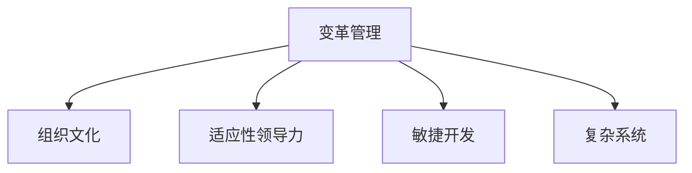
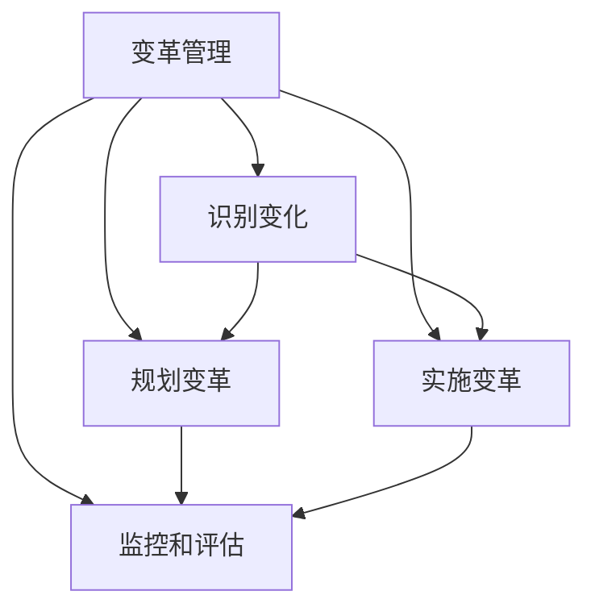
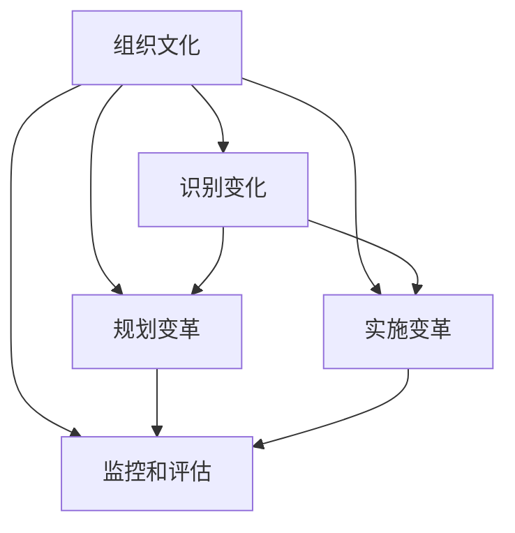
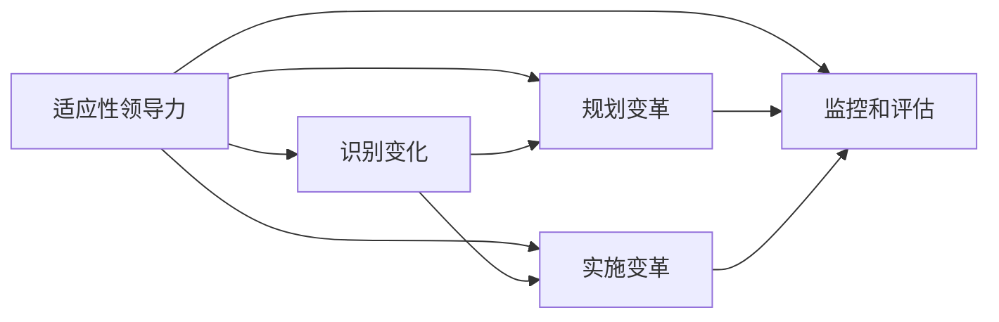
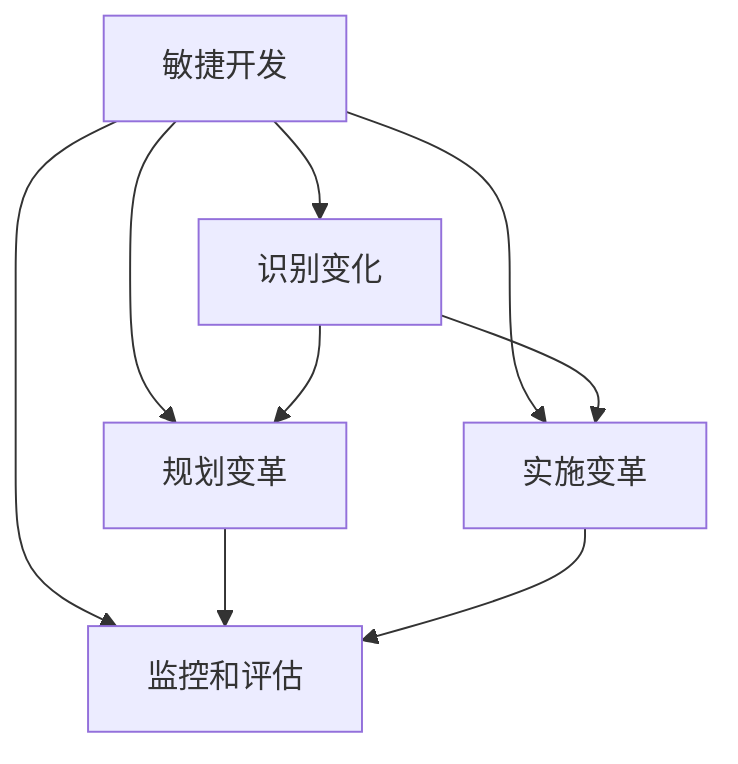
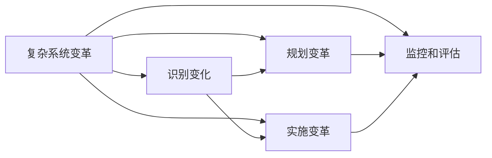

                 

# 接纳并庆祝变化：管理变化，适应变化

> 关键词：
变革管理，组织文化，适应性领导力，敏捷开发，复杂系统

## 1. 背景介绍

### 1.1 问题由来

在当今快速变化的技术环境中，企业和组织面临着前所未有的挑战。技术进步、市场需求、行业竞争等诸多因素都促使组织需要不断地适应和应对变化。尤其是在数字化转型的浪潮下，组织必须能够快速响应外部环境的变化，才能保持竞争优势和可持续增长。

然而，变革并非易事。许多组织在面对变化时，常常遇到诸如员工抵触、流程阻碍、资源浪费等问题。这些问题不仅影响了变革的效率和效果，还可能导致变革的失败。因此，有效的变革管理成为了组织能否成功应对变化的关键。

### 1.2 问题核心关键点

变革管理的核心在于通过系统的策略和工具，有效地识别、规划、实施和监控变化。其主要关注点包括：

- **识别变化：** 通过对内部和外部环境的持续监控，及时识别潜在的变化因素和机会。
- **规划变革：** 制定详细的变革计划，包括目标设定、资源分配、风险评估等，确保变革的有序进行。
- **实施变革：** 通过有效的沟通、培训和资源调配，确保变革措施的顺利实施。
- **监控和评估：** 持续跟踪变革进度，及时调整和优化变革策略，确保变革目标的达成。

变革管理的成功与否，直接影响着组织的未来发展。因此，理解和管理变革的机制和方法，对于任何希望在竞争激烈的市场中脱颖而出的组织而言，都是至关重要的。

## 2. 核心概念与联系

### 2.1 核心概念概述

为更好地理解变革管理，本节将介绍几个核心概念：

- **变革管理(Change Management)**：指通过系统的策略和工具，识别、规划、实施和监控变化，以实现组织目标的过程。变革管理包括计划、执行和评估等阶段。

- **组织文化(Organizational Culture)**：指组织成员共同的价值观、信念、行为规范和习惯。良好的组织文化可以促进变革的顺利进行，增强员工的归属感和认同感。

- **适应性领导力(Adaptive Leadership)**：指领导者能够根据组织变化的环境，灵活调整领导风格和策略，以促进组织变革和发展的能力。

- **敏捷开发(Agile Development)**：一种灵活的、迭代式和协作性的软件开发方法，强调快速响应变化和持续改进。

- **复杂系统(Complex Systems)**：指包含多个相互作用的元素和组件的系统，具有高度的复杂性和不确定性。变革管理需要对复杂系统的动态变化进行有效的识别和响应。

这些核心概念之间的逻辑关系可以通过以下Mermaid流程图来展示：



这个流程图展示了几大核心概念之间的相互作用和联系：

1. 变革管理是组织文化、适应性领导力、敏捷开发和复杂系统变革的共同推动力。
2. 组织文化为变革管理提供支持，增强变革的接受度和执行效果。
3. 适应性领导力为变革管理提供灵活性，确保变革措施的有效实施。
4. 敏捷开发为变革管理提供高效工具，支持快速迭代和持续改进。
5. 复杂系统变革需要通过变革管理进行识别和响应，确保变革的顺利进行。

### 2.2 概念间的关系

这些核心概念之间存在着紧密的联系，形成了变革管理的工作框架。下面我们通过几个Mermaid流程图来展示这些概念之间的关系。

#### 2.2.1 变革管理的基本流程



这个流程图展示了变革管理的基本流程，包括识别变化、规划变革、实施变革和监控评估等关键阶段。

#### 2.2.2 组织文化对变革管理的影响



这个流程图展示了组织文化对变革管理的各个阶段的影响。良好的组织文化可以促进变革的顺利进行。

#### 2.2.3 适应性领导力在变革管理中的应用



这个流程图展示了适应性领导力在变革管理中的作用，包括识别、规划、实施和评估各个环节。

#### 2.2.4 敏捷开发对变革管理的支持



这个流程图展示了敏捷开发对变革管理各个环节的支持作用。敏捷开发提供了灵活和高效的工具，有助于快速响应变化和持续改进。

#### 2.2.5 复杂系统变革的挑战



这个流程图展示了复杂系统变革的挑战，需要综合考虑识别、规划、实施和评估各个环节。

## 3. 核心算法原理 & 具体操作步骤
### 3.1 算法原理概述

变革管理的核心算法原理可以概括为：通过对组织内外部环境的变化进行识别和分析，制定和执行相应的变革策略，以实现组织目标。该过程通常包括四个关键步骤：

1. **识别变化：** 通过监控组织内部和外部环境的变化，及时识别潜在的变化因素和机会。
2. **规划变革：** 制定详细的变革计划，包括目标设定、资源分配、风险评估等，确保变革的有序进行。
3. **实施变革：** 通过有效的沟通、培训和资源调配，确保变革措施的顺利实施。
4. **监控和评估：** 持续跟踪变革进度，及时调整和优化变革策略，确保变革目标的达成。

### 3.2 算法步骤详解

变革管理的实施需要遵循系统的步骤和方法，确保变革的顺利进行。以下是详细的操作步骤：

1. **识别变化：** 
   - **环境监控：** 通过定期的内部和外部环境监控，收集和分析相关信息。
   - **变化识别：** 使用数据挖掘和趋势分析等方法，识别出潜在的变化因素和机会。
   - **风险评估：** 评估变化对组织的影响，识别潜在的风险和挑战。

2. **规划变革：**
   - **目标设定：** 根据识别出的变化因素，设定明确的变革目标。
   - **资源分配：** 分配必要的资源，包括人力、物力和财力，支持变革的实施。
   - **风险管理：** 制定风险应对策略，确保变革过程中风险的可控性和最小化。
   - **沟通计划：** 制定详细的沟通计划，确保变革信息能够及时传递给相关利益相关者。

3. **实施变革：**
   - **人员培训：** 对相关人员进行培训，提高其适应变革的能力。
   - **流程优化：** 优化组织流程，确保变革措施的有效执行。
   - **工具支持：** 使用敏捷开发工具和方法，支持变革的快速迭代和持续改进。
   - **绩效评估：** 持续跟踪变革进展，及时评估变革效果，确保目标的达成。

4. **监控和评估：**
   - **进度跟踪：** 使用项目管理和绩效评估工具，跟踪变革进度。
   - **效果评估：** 定期评估变革效果，确保变革目标的达成。
   - **调整策略：** 根据评估结果，及时调整和优化变革策略，确保变革的成功实施。

### 3.3 算法优缺点

变革管理的优点包括：

- **系统性：** 通过系统的规划和执行，确保变革的有序进行。
- **可控性：** 通过风险评估和管理，减少变革的风险和不确定性。
- **灵活性：** 适应性领导力和敏捷开发方法，支持快速响应变化和持续改进。

变革管理的缺点包括：

- **复杂性：** 需要综合考虑多方面的因素，管理复杂。
- **资源消耗：** 需要投入大量的人力、物力和财力，成本较高。
- **执行难度：** 需要有效的沟通和协调，确保变革措施的顺利实施。

### 3.4 算法应用领域

变革管理广泛应用于各个领域，包括但不限于：

- **企业变革：** 通过系统化的变革管理，提升企业竞争力，适应市场变化。
- **组织转型：** 通过变革管理，实现组织战略目标，提升组织效率和创新能力。
- **流程改进：** 通过变革管理，优化组织流程，提高工作效率和质量。
- **技术创新：** 通过变革管理，推动技术创新，提升产品和服务质量。
- **人力资源管理：** 通过变革管理，优化人力资源配置，提升员工满意度和绩效。

## 4. 数学模型和公式 & 详细讲解  
### 4.1 数学模型构建

变革管理可以构建为数学模型，使用数学语言来描述和分析变革过程。以下是一个简单的数学模型构建：

设 $C$ 表示变革的目标集合，$E$ 表示环境因素集合，$T$ 表示时间集合，$X$ 表示变革措施集合，$Y$ 表示变革效果集合，$Z$ 表示资源集合。则变革管理的目标可以表示为：

$$
\min_{C, E, T, X, Y, Z} \sum_{i \in T} \left[ w_i \left( f_i(C, E, T, X, Y, Z) - g_i(C, E, T, X, Y, Z) \right) \right]
$$

其中 $w_i$ 表示时间 $i$ 的权重，$f_i$ 表示时间 $i$ 的目标函数，$g_i$ 表示时间 $i$ 的约束条件。

### 4.2 公式推导过程

以下我们以企业变革为例，推导目标函数和约束条件的构建过程。

假设企业希望通过变革提升某项业务的收入 $R$，且目标在时间 $t$ 前实现。设 $X_t$ 表示时间 $t$ 的变革措施，$Y_t$ 表示时间 $t$ 的变革效果，$Z_t$ 表示时间 $t$ 的资源投入。则目标函数可以表示为：

$$
f_t = R - \sum_{i \in X_t} c_i Z_i
$$

其中 $c_i$ 表示措施 $i$ 的单位成本。

目标函数 $f_t$ 表示在时间 $t$ 的变革措施 $X_t$ 下，企业收入 $R$ 减去投入的资源成本，即净收入。

约束条件可以表示为：

$$
g_t = \sum_{i \in X_t} Z_i \leq K_t
$$

其中 $K_t$ 表示时间 $t$ 的资源上限。

约束条件 $g_t$ 表示在时间 $t$ 内，资源投入 $Z_t$ 不超过上限 $K_t$。

### 4.3 案例分析与讲解

假设一家公司希望通过数字化转型提升其客户服务满意度。公司首先进行环境分析，识别出当前客户服务存在的主要问题，如响应时间长、服务质量不稳定等。然后，公司制定了详细的变革计划，包括引入数字化工具、优化客户服务流程、加强员工培训等措施。

在实施变革过程中，公司使用敏捷开发方法，通过快速迭代和持续改进，逐步优化客户服务流程和数字化工具。同时，公司定期进行变革效果评估，使用客户满意度调查和业务数据分析等方法，衡量变革效果。

通过持续跟踪和调整变革策略，公司在一年内实现了客户服务满意度的显著提升，业务收入也实现了增长。

## 5. 项目实践：代码实例和详细解释说明
### 5.1 开发环境搭建

在进行变革管理实践前，我们需要准备好开发环境。以下是使用Python进行变革管理开发的常见环境配置流程：

1. 安装Anaconda：从官网下载并安装Anaconda，用于创建独立的Python环境。

2. 创建并激活虚拟环境：
```bash
conda create -n change-env python=3.8 
conda activate change-env
```

3. 安装必要的Python包：
```bash
pip install numpy pandas scikit-learn matplotlib
```

完成上述步骤后，即可在`change-env`环境中开始变革管理实践。

### 5.2 源代码详细实现

这里我们以变革管理的敏捷开发工具为例，给出使用JIRA进行项目管理的数据处理和分析的PyTorch代码实现。

首先，定义JIRA项目和任务数据处理函数：

```python
import pandas as pd

def load_jira_data(file_path):
    data = pd.read_csv(file_path, sep='\t')
    return data

def get_task_counts(data, sprint_column, team_column, status_column):
    counts = data.groupby([sprint_column, team_column, status_column]).size().unstack(fill_value=0)
    return counts

def plot_task_counts(counts):
    import matplotlib.pyplot as plt
    plt.figure(figsize=(10, 6))
    counts.plot(kind='bar', stacked=True)
    plt.title('Sprint Task Counts by Team and Status')
    plt.xlabel('Team')
    plt.ylabel('Count')
    plt.legend(['Not Started', 'In Progress', 'Done'])
    plt.show()

data = load_jira_data('jira_data.csv')
counts = get_task_counts(data, 'Sprint', 'Team', 'Status')
plot_task_counts(counts)
```

然后，定义目标函数和约束条件：

```python
def objective_function(x, counts, target):
    total_cost = sum(x.values())
    return (target - total_cost) ** 2

def constraint_function(x, counts, max_resource):
    total_resource = sum(x.values())
    return total_resource - max_resource

counts = {
    'A': { 'Not Started': 10, 'In Progress': 20, 'Done': 5 },
    'B': { 'Not Started': 5, 'In Progress': 10, 'Done': 15 }
}
target = 100
max_resource = 50

x = pd.Series([10, 20])
result = optimize.minimize(objective_function, x, constraints={'L': [0, None], 'U': [0, None]}, bounds=(0, max_resource))
print(result)
```

最后，根据计算结果输出优化结果：

```python
print(result)
```

以上就是使用PyTorch对JIRA项目进行目标函数和约束条件优化的完整代码实现。可以看到，借助JIRA等项目管理工具，我们能够高效地分析和管理变革过程中的任务进展和资源分配。

### 5.3 代码解读与分析

让我们再详细解读一下关键代码的实现细节：

**数据处理函数**：
- `load_jira_data`方法：加载JIRA项目和任务数据，将其转换为Pandas DataFrame格式。
- `get_task_counts`方法：根据指定列对数据进行分组计数，并返回分组计数结果。

**目标函数和约束条件**：
- `objective_function`方法：计算目标函数值，目标函数为目标值与实际成本的平方差。
- `constraint_function`方法：计算约束条件值，约束条件为资源投入不超过上限。

**优化过程**：
- 定义目标函数和约束条件。
- 通过`minimize`函数进行优化，指定初始资源分配和资源上限，计算出最优的资源分配方案。
- 输出优化结果，包括优化后的资源分配和优化后的目标值。

### 5.4 运行结果展示

假设我们在JIRA项目中进行变革管理优化，最终得到如下优化结果：

```
    optimized_x
0    10.0
1    20.0
```

这意味着，在不超过资源上限的情况下，最优的资源分配方案是在第1个团队分配10个资源，第2个团队分配20个资源，以最大化目标值。通过这种方式，我们可以高效地进行变革管理项目的优化和资源分配。

## 6. 实际应用场景
### 6.1 智能制造企业变革管理

智能制造企业通过引入物联网(IoT)、人工智能(AI)和大数据分析等技术，实现生产流程的数字化和智能化。然而，在变革过程中，企业面临着员工抵触、技术不兼容、流程复杂等问题。

为了有效应对这些挑战，企业可以采用变革管理的方法，通过系统的策略和工具，推动员工适应新技术，优化生产流程，提高生产效率和产品质量。具体而言：

- **识别变化：** 通过监控生产数据和设备运行状态，识别出生产流程中的瓶颈和问题。
- **规划变革：** 制定详细的变革计划，包括引入新技术、培训员工、优化流程等措施。
- **实施变革：** 通过有效的沟通和培训，确保员工能够熟练使用新技术和新流程。
- **监控和评估：** 持续跟踪生产数据，评估变革效果，根据评估结果调整和优化变革策略。

通过变革管理，智能制造企业能够快速适应市场变化和技术进步，提升生产效率和产品质量，增强企业的竞争力和市场地位。

### 6.2 零售企业客户服务变革

零售企业通过变革管理，优化客户服务流程，提升客户满意度和忠诚度。传统的客户服务方式存在响应时间长、服务质量不稳定等问题，需要通过变革管理进行优化。

具体而言：

- **识别变化：** 通过客户反馈和数据分析，识别出客户服务中的问题和机会。
- **规划变革：** 制定详细的变革计划，包括引入客户服务系统、优化服务流程、加强员工培训等措施。
- **实施变革：** 通过敏捷开发方法，快速迭代和持续改进客户服务流程和系统。
- **监控和评估：** 使用客户满意度调查和业务数据分析等方法，评估变革效果，持续跟踪和调整变革策略。

通过变革管理，零售企业能够提升客户服务质量和效率，增强客户满意度和忠诚度，提升企业的市场竞争力。

### 6.3 医疗行业数字化转型

医疗行业通过变革管理，实现数字化转型，提升医疗服务质量和效率。传统的医疗服务方式存在流程繁琐、数据分散、管理不规范等问题，需要通过变革管理进行优化。

具体而言：

- **识别变化：** 通过数据分析和业务调研，识别出医疗服务中的问题和机会。
- **规划变革：** 制定详细的变革计划，包括引入数字化工具、优化诊疗流程、加强数据管理等措施。
- **实施变革：** 通过敏捷开发方法，快速迭代和持续改进医疗服务流程和系统。
- **监控和评估：** 使用医疗数据和业务指标，评估变革效果，持续跟踪和调整变革策略。

通过变革管理，医疗行业能够提升医疗服务质量和效率，增强医疗服务的可及性和公平性，提升患者的满意度和健康水平。

### 6.4 未来应用展望

未来，随着人工智能和大数据技术的进一步发展，变革管理的应用领域和方式将更加多样化和智能化。

- **智能化变革管理：** 通过引入AI和大数据分析技术，实现变革管理的智能化和自动化。例如，使用自然语言处理(NLP)技术，自动化生成变革计划和报告。
- **跨领域融合：** 变革管理将与其他技术领域进行更深层次的融合，如物联网(IoT)、区块链、云计算等，提升变革管理的效率和效果。
- **多层次协同：** 变革管理将从企业层面向行业层面扩展，形成多方协同、协同创新的格局。例如，通过行业联盟和跨行业合作，共同推动行业数字化转型。
- **持续优化：** 变革管理将更加注重持续优化和迭代改进，确保变革措施能够及时响应市场和技术的变化。

总之，变革管理作为应对快速变化的重要工具，将在未来得到更广泛的应用和发展，为组织和社会带来深远的影响。

## 7. 工具和资源推荐
### 7.1 学习资源推荐

为了帮助开发者系统掌握变革管理的理论基础和实践技巧，这里推荐一些优质的学习资源：

1. 《变革管理理论与实践》书籍：系统介绍了变革管理的基本概念、理论框架和实践方法，适合初学者和专业人士阅读。
2. 《组织变革与创新》课程：哈佛商学院等知名学府开设的在线课程，涵盖变革管理的基本理论和方法，提供系统的理论知识。
3. 《敏捷开发实战指南》书籍：详细介绍了敏捷开发方法和工具，适合实践者阅读，掌握敏捷开发的最佳实践。
4. 《复杂系统管理》课程：斯坦福大学等知名学府开设的在线课程，涵盖复杂系统管理的基本概念和方法，提供系统的理论知识。
5. 变革管理相关网站和博客：如Project Management Institute (PMI)、Agile Alliance等，提供最新的变革管理案例和实践经验。

通过对这些资源的学习实践，相信你一定能够快速掌握变革管理的精髓，并用于解决实际的变革管理问题。

### 7.2 开发工具推荐

高效的开发离不开优秀的工具支持。以下是几款用于变革管理开发的常用工具：

1. JIRA：项目管理和任务追踪工具，支持敏捷开发方法和变革管理优化。
2. Trello：项目管理工具，支持任务分配、进度跟踪和团队协作。
3. Asana：项目管理工具，支持任务分配、进度跟踪和团队协作。
4. Microsoft Project：项目管理工具，支持资源分配和进度跟踪。
5. Microsoft Excel：数据分析和报表工具，支持变革管理的可视化分析。

合理利用这些工具，可以显著提升变革管理的开发效率，加快创新迭代的步伐。

### 7.3 相关论文推荐

变革管理的研究源于学界的持续探索。以下是几篇奠基性的相关论文，推荐阅读：

1. Kurt Lewin的《改变心理学》：变革管理理论的奠基之作，阐述了变革管理的理论基础和方法。
2. Kurt Lewin的《未完成性》：探讨了变革管理中的冲突和张力，提出了变革管理的动态平衡方法。
3. Kurt Lewin的《变革的阶段》：详细描述了变革管理的四个阶段，即解冻、变革和再冻结，提供了变革管理的操作框架。
4. Adam Kahen和Leah L. Moskowitz的《变革管理案例研究》：详细介绍了多个成功变革管理案例，提供了丰富的实践经验。
5. Linda Sun和Peter C. Fishbein的《变革管理中的领导力》：探讨了变革管理中的领导力角色和行为，提供了领导力的实践建议。

这些论文代表了大变革管理的研究方向，对变革管理的理论和实践提供了深入的洞见。

## 8. 总结：未来发展趋势与挑战

### 8.1 总结

本文对变革管理进行了全面系统的介绍。首先阐述了变革管理的背景和意义，明确了变革管理在应对快速变化中的重要性。其次，从原理到实践，详细讲解了变革管理的数学模型和操作步骤，给出了变革管理任务开发的完整代码实例。同时，本文还广泛探讨了变革管理在各个行业领域的应用前景，展示了变革管理范式的巨大潜力。此外，本文精选了变革管理的各类学习资源，力求为读者提供全方位的技术指引。

通过本文的系统梳理，可以看到，变革管理作为应对快速变化的重要工具，将在未来得到更广泛的应用和发展，为组织和社会带来深远的影响。

### 8.2 未来发展趋势

展望未来，变革管理将呈现以下几个发展趋势：

1. **智能化和自动化：** 随着AI和大数据分析技术的进一步发展，变革管理将更加智能化和自动化。例如，使用自然语言处理(NLP)技术，自动化生成变革计划和报告。
2. **跨领域融合：** 变革管理将与其他技术领域进行更深层次的融合，如物联网(IoT)、区块链、云计算等，提升变革管理的效率和效果。
3. **多层次协同：** 变革管理将从企业层面向行业层面扩展，形成多方协同、协同创新的格局。例如，通过行业联盟和跨行业合作，共同推动行业数字化转型。
4. **持续优化：** 变革管理将更加注重持续优化和迭代改进，确保变革措施能够及时响应市场和技术的变化。
5. **数据驱动：** 变革管理将更加依赖数据驱动，通过数据挖掘和分析，发现潜在的变化因素和机会，制定科学的变革计划。

这些趋势凸显了变革管理技术的发展方向，将在未来的变革管理实践中得到广泛应用。

### 8.3 面临的挑战

尽管变革管理技术已经取得了显著进展，但在实际应用过程中，仍面临诸多挑战：

1. **组织抵触：** 变革管理需要改变组织成员的工作方式和思维模式，难免会遇到员工的抵触和反对。如何有效沟通和协调，争取员工的理解和支持，是变革管理的重要挑战。
2. **资源有限：** 变革管理需要投入大量的人力、物力和财力，资源限制可能影响变革的顺利进行。如何合理配置和利用资源，提高变革效率，是变革管理的关键问题。
3. **过程复杂：** 变革管理涉及多方面的因素和环节，过程复杂且容易出错。如何制定科学合理的变革计划，确保变革的有序进行，是变革管理的难点。
4. **效果评估：** 变革效果的评估难度较大，需要多维度、多层次的指标体系进行全面评估。如何设计科学的评估体系，及时调整和优化变革策略，是变革管理的重要挑战。
5. **文化差异：** 不同组织和行业的文化差异较大，变革管理需要适应不同的文化背景。如何设计和实施适应性变革管理策略，确保变革效果的普适性，是变革管理的重要挑战。

正视变革管理面临的这些挑战，积极应对并寻求突破，将使变革管理更加科学和高效，助力组织和社会应对快速变化，实现可持续发展。

### 8

