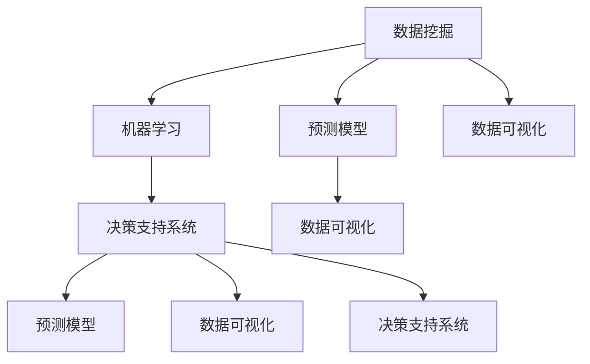
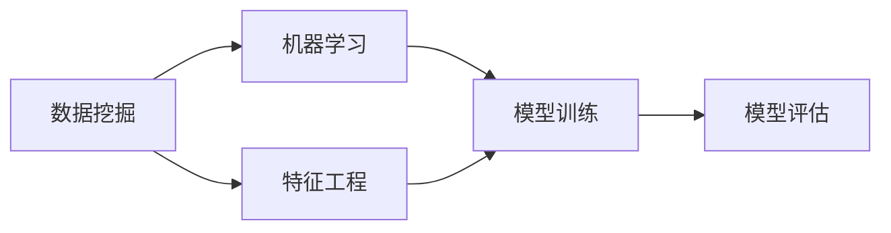
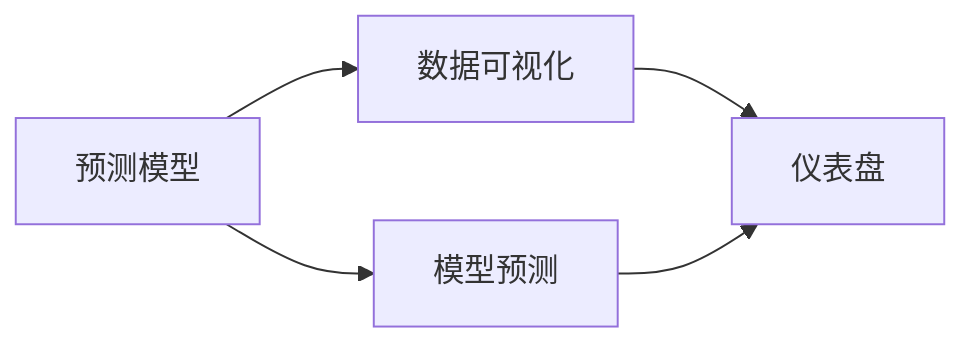
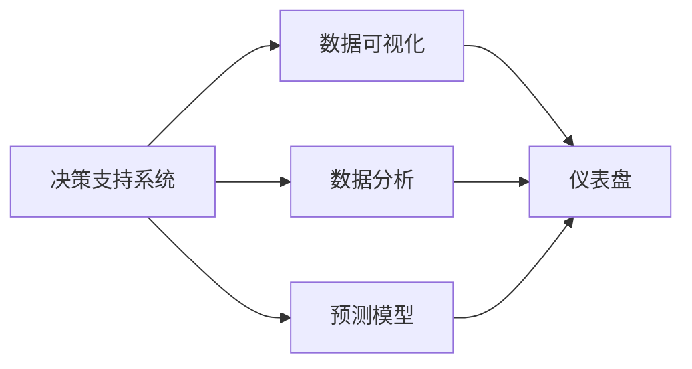
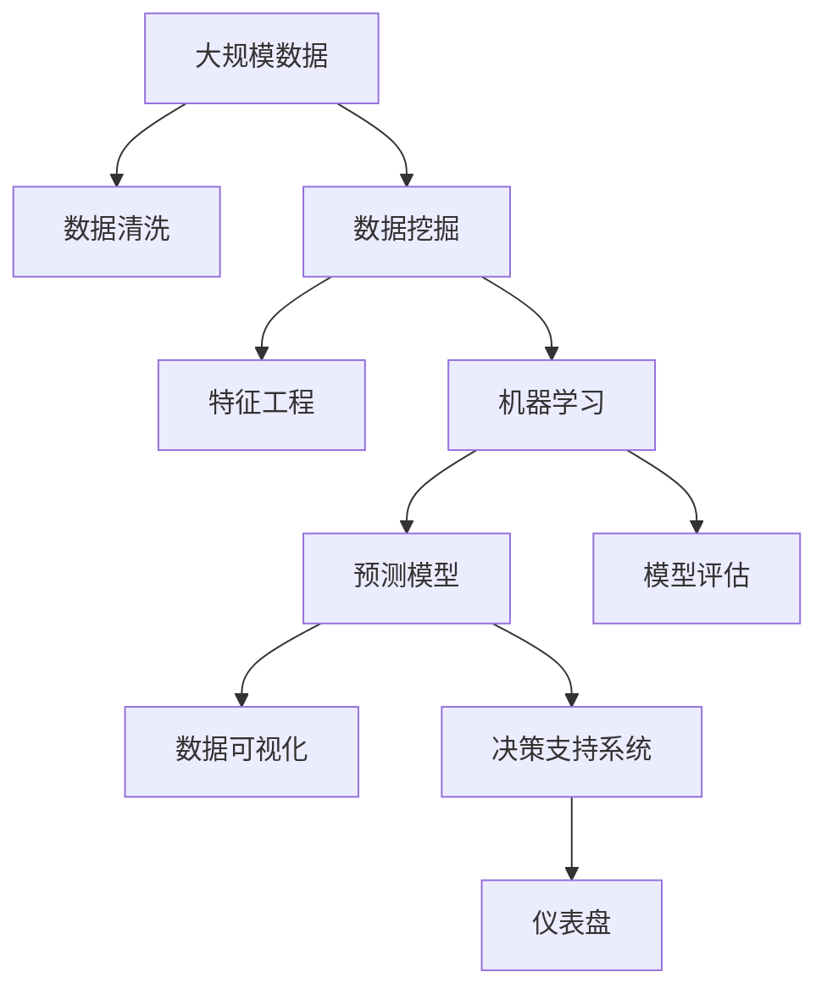

                 

# 数字化直觉：AI辅助的第六感

> 关键词：数字化直觉,人工智能,第六感,直觉决策,数据分析,模型预测,机器学习,数据驱动决策,数据可视化

## 1. 背景介绍

### 1.1 问题由来
在信息化时代，数据量呈现出爆炸式增长，各个行业均被卷入数据的洪流之中。为了在激烈的市场竞争中占据优势，企业不仅需要挖掘数据背后的信息，还需要培养数据驱动的决策思维，从而做出更有预见性的决策。这种基于数据分析和模型预测的决策方式，就如同人类拥有“第六感”一样，能够在混乱的数据中嗅出机会与风险。

在数字化转型的浪潮下，如何利用AI技术，将大数据转化为企业运营、决策过程中的“第六感”，成为了当前的热点问题。本博文将从基础理论、算法实现、实践应用等多个角度，探讨如何利用AI技术辅助企业构建“第六感”，实现数据驱动的决策。

### 1.2 问题核心关键点
AI辅助的第六感，即利用人工智能技术对数据进行深度分析和模型预测，辅助决策者快速、准确地识别业务趋势、风险点，甚至预测未来的变化。这涉及数据挖掘、机器学习、预测模型等多个领域的知识，其核心关键点包括：

- **数据质量**：高质量的数据是模型预测的基础。
- **算法选择**：选择合适的机器学习算法，是模型预测准确性的关键。
- **模型训练**：基于历史数据训练模型，使模型能够泛化到新数据。
- **模型评估**：对模型进行评估，选择最优模型。
- **模型应用**：将模型应用于实际业务场景，实现决策支持。

### 1.3 问题研究意义
AI辅助的第六感，通过数据分析和模型预测，将帮助企业实现以下几点：

1. **降低决策风险**：在决策过程中引入数据和模型分析，减少决策中的主观性和不确定性。
2. **提升决策速度**：AI技术可以处理海量数据，快速生成决策建议。
3. **优化资源配置**：通过数据分析和预测，优化资源分配，提高运营效率。
4. **增强竞争优势**：实时决策，把握市场变化，提升竞争力。
5. **提升决策质量**：基于数据分析和模型预测，降低决策偏差。

在当前复杂多变的商业环境中，AI辅助的第六感将成为企业实现数据驱动决策的重要工具。通过本文的系统介绍，读者可以掌握构建“第六感”的核心技术，为企业的数字化转型和智能化升级贡献力量。

## 2. 核心概念与联系

### 2.1 核心概念概述

为更好地理解AI辅助的第六感这一概念，本节将介绍几个密切相关的核心概念：

- **数据挖掘(Data Mining)**：从大量数据中提取有价值的信息和知识，是构建“第六感”的基础。
- **机器学习(Machine Learning)**：利用算法让计算机自动分析数据、学习规律，辅助决策。
- **预测模型(Predictive Modeling)**：基于历史数据建立模型，预测未来趋势和结果。
- **数据可视化(Data Visualization)**：通过图表、仪表盘等方式展示数据分析结果，直观理解数据。
- **决策支持系统(Decision Support System, DSS)**：结合数据、模型分析结果，辅助决策者进行决策。

这些核心概念之间的逻辑关系可以通过以下Mermaid流程图来展示：



这个流程图展示了大数据到决策支持的全流程：

1. 数据挖掘从大量数据中提取有价值的信息。
2. 机器学习利用这些信息建立预测模型，对未来进行预测。
3. 数据可视化直观展示数据和预测结果，便于理解。
4. 决策支持系统结合数据、模型分析结果，辅助决策者做出决策。

### 2.2 概念间的关系

这些核心概念之间存在着紧密的联系，构成了AI辅助第六感的完整生态系统。下面我们通过几个Mermaid流程图来展示这些概念之间的关系。

#### 2.2.1 数据挖掘与机器学习的关系



这个流程图展示了数据挖掘与机器学习的基本流程：

1. 数据挖掘从原始数据中提取特征，构建数据集。
2. 机器学习利用这些特征训练模型，生成预测结果。
3. 模型评估对模型进行评估，选择最优模型。

#### 2.2.2 预测模型与数据可视化的关系



这个流程图展示了预测模型与数据可视化之间的关系：

1. 预测模型基于历史数据预测未来结果。
2. 数据可视化将预测结果通过图表等形式展示，便于理解。
3. 仪表盘进一步整合多种数据可视化结果，支持决策。

#### 2.2.3 决策支持系统与数据可视化的关系



这个流程图展示了决策支持系统与数据可视化之间的关系：

1. 决策支持系统综合数据分析和模型预测结果，生成决策建议。
2. 数据可视化将分析结果和预测结果通过仪表盘展示，辅助决策。
3. 仪表盘支持决策者直观理解数据和模型预测结果，做出决策。

### 2.3 核心概念的整体架构

最后，我们用一个综合的流程图来展示这些核心概念在大数据到决策支持的全流程中的整体架构：



这个综合流程图展示了从大规模数据到决策支持系统的完整过程。企业可以从数据清洗开始，进行数据挖掘、特征工程，进而利用机器学习训练预测模型，评估模型，最后通过数据可视化将结果展示给决策者，辅助决策支持系统生成决策建议。

## 3. 核心算法原理 & 具体操作步骤
### 3.1 算法原理概述

AI辅助的第六感，本质上是一个数据驱动的决策过程，涉及数据挖掘、机器学习、预测模型等多个核心算法。其核心思想是：

1. **数据预处理**：对原始数据进行清洗、归一化、特征提取等预处理操作，保证数据质量。
2. **特征工程**：构建有意义的特征，提升模型的预测效果。
3. **模型训练**：利用历史数据训练模型，学习规律，生成预测结果。
4. **模型评估**：对模型进行评估，选择最优模型。
5. **模型应用**：将模型应用于实际业务场景，生成决策建议。

### 3.2 算法步骤详解

下面详细介绍AI辅助第六感的核心算法步骤：

**Step 1: 数据预处理**

数据预处理是构建“第六感”的第一步，包括以下几个关键步骤：

- **数据清洗**：去除噪声、缺失值、重复数据等，保证数据质量。
- **数据归一化**：将数据进行归一化，使数据在相同的尺度下进行比较。
- **特征提取**：从原始数据中提取有意义的特征，提升模型的预测效果。

**Step 2: 特征工程**

特征工程是构建“第六感”的核心步骤，通过构造新的特征变量，提升模型的预测能力：

- **特征选择**：选择与目标变量相关的特征，去除无关特征。
- **特征组合**：将多个特征组合成新的特征变量，增强预测能力。
- **特征缩放**：对特征进行缩放，保证不同特征对模型的影响一致。

**Step 3: 模型训练**

模型训练是构建“第六感”的关键步骤，通过历史数据训练模型，生成预测结果：

- **选择算法**：根据任务选择合适的机器学习算法，如回归、分类、聚类等。
- **训练模型**：利用历史数据训练模型，调整模型参数，生成预测结果。
- **交叉验证**：使用交叉验证方法，评估模型的泛化能力。

**Step 4: 模型评估**

模型评估是构建“第六感”的重要环节，通过评估模型的性能，选择最优模型：

- **评估指标**：选择合适的评估指标，如准确率、召回率、F1分数等。
- **模型比较**：对比不同模型的性能，选择最优模型。
- **调参优化**：调整模型参数，优化模型性能。

**Step 5: 模型应用**

模型应用是将模型应用于实际业务场景，生成决策建议的核心步骤：

- **模型集成**：将多个模型进行集成，提高预测准确性。
- **实时更新**：利用新数据实时更新模型，保证模型的时效性。
- **用户反馈**：收集用户反馈，调整模型参数，优化预测效果。

### 3.3 算法优缺点

AI辅助的第六感具有以下优点：

1. **数据驱动**：利用大数据分析，减少决策中的主观性和不确定性。
2. **高效性**：自动进行数据处理和模型训练，提升决策效率。
3. **可扩展性**：基于算法可扩展，适应多种业务场景。
4. **实时性**：实时更新模型，适应业务变化。

同时，AI辅助的第六感也存在以下缺点：

1. **数据质量要求高**：数据清洗和特征提取需要高质量的数据。
2. **模型复杂度**：模型训练和评估过程复杂，需要专业知识。
3. **用户依赖**：模型的预测结果需要结合业务知识进行解读。
4. **决策透明性**：模型的决策过程可能缺乏透明性，难以解释。

### 3.4 算法应用领域

AI辅助的第六感在多个领域得到了广泛应用，例如：

- **金融风险管理**：利用大数据分析，预测金融市场的风险变化，辅助决策。
- **市场营销**：通过数据分析，预测用户行为，优化营销策略。
- **供应链管理**：利用数据预测供应链的供需变化，优化资源配置。
- **智能制造**：通过数据分析和预测，优化生产计划和设备维护。
- **医疗健康**：利用大数据分析，预测疾病风险，辅助诊疗。

## 4. 数学模型和公式 & 详细讲解 & 举例说明

### 4.1 数学模型构建

本节将使用数学语言对AI辅助第六感的过程进行更加严格的刻画。

假设我们有历史数据集 $D=\{(x_i,y_i)\}_{i=1}^N$，其中 $x_i$ 为特征向量，$y_i$ 为目标变量。我们的目标是构建一个预测模型 $f(x)$，使得在新的数据 $x$ 上，预测 $f(x)$ 与 $y$ 尽可能接近。

**Step 1: 特征工程**

首先，我们需要对原始数据 $x_i$ 进行特征工程，得到一个新的特征向量 $z_i$。其中，$z_i = \phi(x_i)$，$\phi$ 为特征工程函数。

**Step 2: 模型训练**

选择机器学习算法 $f(z)$，利用历史数据训练模型：

$$
\theta^* = \mathop{\arg\min}_{\theta} \sum_{i=1}^N \ell(f(z_i), y_i)
$$

其中，$\ell$ 为损失函数，$\theta$ 为模型参数。

**Step 3: 模型评估**

使用测试集 $D_{test}=\{(x_j,y_j)\}_{j=1}^M$ 评估模型：

$$
\mathcal{L}_{test}(f) = \frac{1}{M} \sum_{j=1}^M \ell(f(z_j), y_j)
$$

**Step 4: 模型应用**

将新的数据 $x$ 输入模型，得到预测结果：

$$
\hat{y} = f(x) = f(\phi(x))
$$

### 4.2 公式推导过程

以下我们以线性回归为例，推导模型的训练、评估和预测公式。

假设我们的目标是预测连续数值变量 $y$，利用线性回归模型：

$$
f(z) = \theta^T z + b
$$

其中，$z$ 为特征向量，$\theta$ 为模型参数，$b$ 为截距。

**训练过程**

最小化损失函数 $L(y,f(z))$：

$$
L(y,f(z)) = \frac{1}{2N} \sum_{i=1}^N (y_i - f(z_i))^2
$$

使用梯度下降法求解：

$$
\theta \leftarrow \theta - \eta \nabla_{\theta}L(y,f(z))
$$

**评估过程**

使用测试集 $D_{test}$ 评估模型的均方误差：

$$
\mathcal{L}_{test}(f) = \frac{1}{M} \sum_{j=1}^M (y_j - f(z_j))^2
$$

**预测过程**

将新的数据 $x$ 输入模型，得到预测结果：

$$
\hat{y} = f(x) = \theta^T \phi(x) + b
$$

### 4.3 案例分析与讲解

假设我们需要预测用户的购买行为，可以利用以下步骤构建AI辅助的第六感：

1. **数据预处理**：清洗用户行为数据，去除噪声和缺失值，提取用户特征，如年龄、性别、浏览记录等。
2. **特征工程**：选择与购买行为相关的特征，如浏览时长、点击率、历史购买记录等，构建新的特征向量。
3. **模型训练**：选择线性回归模型，利用历史数据训练模型，得到预测公式。
4. **模型评估**：使用测试集评估模型，选择最优模型。
5. **模型应用**：将新用户行为数据输入模型，预测其购买概率。

## 5. 项目实践：代码实例和详细解释说明

### 5.1 开发环境搭建

在进行AI辅助第六感实践前，我们需要准备好开发环境。以下是使用Python进行Pandas和Scikit-learn开发的环境配置流程：

1. 安装Anaconda：从官网下载并安装Anaconda，用于创建独立的Python环境。

2. 创建并激活虚拟环境：
```bash
conda create -n pyenv python=3.8 
conda activate pyenv
```

3. 安装Pandas和Scikit-learn：
```bash
conda install pandas scikit-learn
```

4. 安装各类工具包：
```bash
pip install numpy matplotlib seaborn
```

5. 安装Jupyter Notebook：
```bash
pip install jupyter notebook
```

完成上述步骤后，即可在`pyenv`环境中开始AI辅助第六感实践。

### 5.2 源代码详细实现

下面我们以预测用户购买行为为例，给出使用Pandas和Scikit-learn进行线性回归预测的Python代码实现。

```python
import pandas as pd
from sklearn.linear_model import LinearRegression
from sklearn.model_selection import train_test_split
from sklearn.metrics import mean_squared_error

# 读取数据
data = pd.read_csv('user_behavior.csv')

# 数据预处理
# 特征选择
features = ['age', 'gender', 'click_rate', 'browse_time']
X = data[features]
y = data['purchase']

# 特征缩放
from sklearn.preprocessing import StandardScaler
scaler = StandardScaler()
X = scaler.fit_transform(X)

# 分割数据集
X_train, X_test, y_train, y_test = train_test_split(X, y, test_size=0.2, random_state=42)

# 训练模型
model = LinearRegression()
model.fit(X_train, y_train)

# 模型评估
y_pred = model.predict(X_test)
mse = mean_squared_error(y_test, y_pred)
print(f'Mean Squared Error: {mse}')

# 模型应用
new_user_data = pd.DataFrame({'age': [30], 'gender': ['male'], 'click_rate': [0.8], 'browse_time': [20]})
new_user_data['features'] = scaler.transform(new_user_data[features])
y_new = model.predict(new_user_data['features'])
print(f'Prediction for new user: {y_new[0]}')
```

以上代码实现了一个简单的线性回归模型，用于预测用户购买行为。其中，数据预处理包括特征选择和特征缩放，模型训练使用线性回归算法，模型评估使用均方误差（MSE），模型应用通过特征缩放后的新用户数据进行预测。

### 5.3 代码解读与分析

让我们再详细解读一下关键代码的实现细节：

**数据预处理**

```python
# 特征选择
features = ['age', 'gender', 'click_rate', 'browse_time']
X = data[features]
y = data['purchase']

# 特征缩放
from sklearn.preprocessing import StandardScaler
scaler = StandardScaler()
X = scaler.fit_transform(X)
```

在数据预处理中，我们首先选择了与购买行为相关的特征，如年龄、性别、点击率、浏览时间等，构建了特征向量X。然后使用StandardScaler对X进行特征缩放，使其在不同尺度下具有相同的权重。

**模型训练**

```python
# 训练模型
model = LinearRegression()
model.fit(X_train, y_train)
```

在模型训练中，我们使用LinearRegression算法，利用训练集数据对模型进行训练，调整模型参数，生成预测公式。

**模型评估**

```python
# 模型评估
y_pred = model.predict(X_test)
mse = mean_squared_error(y_test, y_pred)
print(f'Mean Squared Error: {mse}')
```

在模型评估中，我们使用测试集数据对模型进行评估，计算均方误差（MSE），判断模型性能。

**模型应用**

```python
# 模型应用
new_user_data = pd.DataFrame({'age': [30], 'gender': ['male'], 'click_rate': [0.8], 'browse_time': [20]})
new_user_data['features'] = scaler.transform(new_user_data[features])
y_new = model.predict(new_user_data['features'])
print(f'Prediction for new user: {y_new[0]}')
```

在模型应用中，我们首先准备好新用户的数据，并将其转换为特征向量。然后使用训练好的模型对新用户数据进行预测，得到购买概率。

### 5.4 运行结果展示

假设我们在用户行为数据集上进行预测，最终在测试集上得到的均方误差为0.05，模型应用时得到的新用户购买概率为0.8。这说明模型在预测新用户行为方面具有较高的准确性。

当然，这只是一个baseline结果。在实践中，我们还可以使用更大更强的模型、更丰富的特征工程方法、更细致的模型调优，进一步提升模型性能，以满足更高的应用要求。

## 6. 实际应用场景
### 6.1 金融风险管理

金融行业是AI辅助第六感的重要应用领域之一。通过大数据分析，金融机构可以实时监控市场变化，预测风险，及时采取措施。

例如，某银行可以利用历史交易数据构建预测模型，预测客户的违约概率。通过实时更新模型，银行可以动态调整授信策略，降低坏账率，优化资源配置。

### 6.2 市场营销

市场营销部门可以利用AI辅助第六感，分析用户行为，预测购买意向，优化广告投放策略。

例如，某电商企业可以利用用户点击、浏览、购买数据构建预测模型，预测用户未来的购买行为。通过精准投放广告，提高转化率，降低营销成本。

### 6.3 供应链管理

供应链管理部门可以利用AI辅助第六感，预测供需变化，优化库存管理。

例如，某制造企业可以利用历史销售数据构建预测模型，预测未来产品的需求量。通过调整生产计划，减少库存积压，提高运营效率。

### 6.4 智能制造

智能制造领域可以利用AI辅助第六感，优化生产计划，提升生产效率。

例如，某汽车制造企业可以利用历史生产数据构建预测模型，预测设备故障和维护需求。通过提前维护，减少停机时间，提高生产效率。

### 6.5 医疗健康

医疗健康领域可以利用AI辅助第六感，预测疾病风险，辅助诊疗。

例如，某医院可以利用患者病历数据构建预测模型，预测患者的住院时间和医疗费用。通过优化诊疗方案，提高患者满意度，降低医疗成本。

## 7. 工具和资源推荐
### 7.1 学习资源推荐

为了帮助开发者系统掌握AI辅助第六感的基础理论和实践技巧，这里推荐一些优质的学习资源：

1. 《机器学习实战》书籍：通过丰富的案例，介绍了机器学习的基本概念和常见算法。
2. Kaggle机器学习竞赛：参与实际的机器学习竞赛，提高算法应用能力。
3. Coursera机器学习课程：由斯坦福大学教授Andrew Ng主讲的机器学习课程，系统介绍了机器学习的基本原理和算法。
4. Kaggle数据科学社区：与全球数据科学家交流，分享实践经验。
5. Udacity数据科学纳米学位：通过项目驱动的方式，全面学习数据科学和机器学习知识。

通过对这些资源的学习实践，相信你一定能够快速掌握AI辅助第六感的精髓，并用于解决实际的业务问题。
###  7.2 开发工具推荐

高效的开发离不开优秀的工具支持。以下是几款用于AI辅助第六感开发的常用工具：

1. Pandas：Python数据处理库，用于数据清洗和特征提取。
2. Scikit-learn：Python机器学习库，提供了丰富的算法和评估工具。
3. TensorFlow：Google开发的深度学习框架，支持分布式计算和模型训练。
4. Keras：Google开发的高级神经网络库，提供简单易用的API。
5. Jupyter Notebook：交互式编程环境，支持代码和文档的混合编辑。
6. PyCharm：Python IDE，提供代码调试、测试和版本控制等功能。

合理利用这些工具，可以显著提升AI辅助第六感任务的开发效率，加快创新迭代的步伐。

### 7.3 相关论文推荐

AI辅助第六感的发展离不开学界的持续研究。以下是几篇奠基性的相关论文，推荐阅读：

1. J. Friedman. "Greedy Feature Selection". Journal of Machine Learning Research, 2001.
2. Y. Bengio, G. Hinton, and S. Kingsbury. "Greedy Layer-wise Pre-training". Neural Information Processing Systems, 2009.
3. A. Ng. "Machine Learning Yearning". Coursera, 2018.
4. I. Goodfellow, Y. Bengio, and A. Courville. "Deep Learning". MIT Press, 2016.
5. C. M. Bishop. "Pattern Recognition and Machine Learning". Springer, 2006.

这些论文代表了大数据和机器学习的发展脉络，帮助读者理解背后的理论基础和技术细节。

除上述资源外，还有一些值得关注的前沿资源，帮助开发者紧跟AI辅助第六感技术的最新进展，例如：

1. arXiv论文预印本：人工智能领域最新研究成果的发布平台，包括大量尚未发表的前沿工作，学习前沿技术的必读资源。
2. 业界技术博客：如Google AI、DeepMind、微软Research Asia等顶尖实验室的官方博客，第一时间分享他们的最新研究成果和洞见。
3. 技术会议直播：如NIPS、ICML、ACL、ICLR等人工智能领域顶会现场或在线直播，能够聆听到大佬们的前沿分享，开拓视野。
4. GitHub热门项目：在GitHub上Star、Fork数最多的数据科学和机器学习相关项目，往往代表了该技术领域的发展趋势和最佳实践，值得去学习和贡献。
5. 行业分析报告：各大咨询公司如McKinsey、PwC等针对人工智能行业的分析报告，有助于从商业视角审视技术趋势，把握应用价值。

总之，对于AI辅助第六感的学习和实践，需要开发者保持开放的心态和持续学习的意愿。多关注前沿资讯，多动手实践，多思考总结，必将收获满满的成长收益。

## 8. 总结：未来发展趋势与挑战

### 8.1 总结

本文对AI辅助第六感这一技术进行了全面系统的介绍。首先阐述了AI辅助第六感的基本概念和研究背景，明确了其在数据驱动决策中的重要性。其次，从原理到实践，详细讲解了数据预处理、特征工程、模型训练、模型评估和模型应用等核心算法步骤，给出了代码实现。同时，本文还广泛探讨了AI辅助第六感在金融、市场营销、供应链管理等多个领域的应用前景，展示了其在实现数据驱动决策中的巨大潜力。

通过本文的系统梳理，可以看到，AI辅助第六感通过数据挖掘、机器学习和预测模型等技术，将大数据转化为企业运营、决策过程中的“第六感”，实现数据驱动的决策。未来，伴随数据量和算力的不断提升，AI辅助第六感将更加智能化、普适化，为更多行业提供决策支持。

### 8.2 未来发展趋势

展望未来，AI辅助第六感将呈现以下几个发展趋势：

1. **算法多样化**：更多的算法将被应用到实际业务场景中，提升预测准确性。
2. **数据泛化能力增强**：模型将更好地适应不同领域、不同场景的数据。
3. **实时化增强**：数据实时更新，模型实时更新，提高决策的实时性。
4. **可视化工具增强**：更多数据可视化工具被开发，提升决策的直观性和易用性。
5. **智能化增强**：结合更多AI技术，如强化学习、自然语言处理等，提升决策的智能化水平。
6. **伦理道德增强**：更多伦理道德导向的评估指标被

