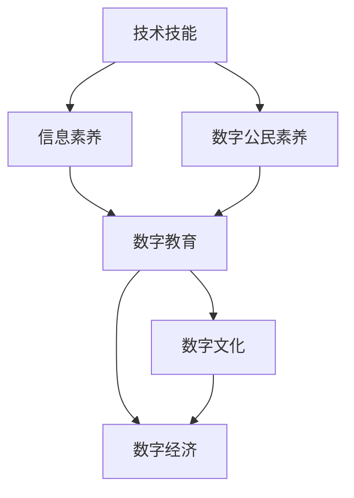

                 

# 数字素养：为了适应日益数字化的世界而需要学习、研究并应用的数字技能

## 1. 背景介绍

### 1.1 问题由来

随着数字技术的飞速发展，我们已经步入了一个高度数字化的世界。从日常生活中的智能家居、移动支付、在线教育，到商业领域的电子商务、大数据分析、云计算，数字技术正在全面渗透和改造我们的生活和工作方式。面对这一深刻变革，如何培养和提升数字素养，以便适应这个日益数字化的社会，成为了一个亟待解决的问题。

### 1.2 问题核心关键点

数字素养指的是个人在数字世界中获取、使用、管理和评估信息的能力。它包括技术技能、信息素养和数字公民素养等几个方面。对于个人来说，掌握数字技能不仅可以提升工作效率，还能更好地理解和应对数字化时代的挑战。对于社会来说，提升数字素养有助于促进数字经济的繁荣，推动社会整体的数字化转型。

具体而言，数字素养的核心关键点包括：

- 技术技能：掌握计算机基础知识、编程语言、网络通信、数据处理等技能。
- 信息素养：具备信息筛选、信息评估、信息创造等能力。
- 数字公民素养：理解数字权利和责任，合理使用数字资源，参与数字社区和社会治理。

这些关键点共同构成了数字素养的基本框架，为个人在数字化世界中的生存和发展提供了基础。

### 1.3 问题研究意义

提升数字素养具有重要意义：

- **适应数字化发展**：数字技术正在加速改变社会各领域，只有具备良好的数字素养，才能更好地适应这一趋势，抓住机遇，避免被淘汰。
- **提升工作效率**：数字技能的应用可以提高生产效率，降低成本，创造更多价值。
- **推动社会进步**：数字素养有助于促进教育公平、医疗服务、环境保护等方面的进步，实现可持续发展。
- **增强竞争力**：在全球化的竞争环境中，数字素养是人才的重要标志，对个人职业发展具有决定性影响。

因此，培养和提升数字素养，不仅是个人发展的需求，更是社会进步的重要推动力。

## 2. 核心概念与联系

### 2.1 核心概念概述

为了更深入地理解数字素养及其关键技能，我们首先需要梳理一些核心概念：

- **技术技能**：指使用计算机硬件、软件和网络通信工具的能力。包括基本的计算机操作、编程语言、数据处理等。
- **信息素养**：指获取、评估、处理和创造信息的能力。包括信息检索、信息分析、信息安全、信息伦理等。
- **数字公民素养**：指在数字环境中理解和行使权利、履行责任的能力。包括数字身份保护、数字法律知识、数字伦理规范等。
- **数字教育**：指通过技术手段进行的教学和学习活动。包括在线课程、电子图书、虚拟实验室等。
- **数字文化**：指数字化时代特有的文化现象和价值观。包括数字艺术、数字文学、数字游戏等。
- **数字经济**：指基于数字技术进行的经济活动。包括电子商务、数字金融、云计算等。

这些概念构成了数字素养的核心框架，每个概念都有其独特的内涵和重要性。

### 2.2 概念间的关系

这些核心概念之间的关系可以通过以下Mermaid流程图来展示：



这个流程图展示了技术技能、信息素养和数字公民素养之间的关系，以及这些素养与数字教育、数字文化和数字经济之间的联系。

## 3. 核心算法原理 & 具体操作步骤

### 3.1 算法原理概述

数字素养的核心算法原理主要围绕信息处理和决策过程展开。以下将通过几个关键算法原理来详细讲解。

- **信息检索算法**：通过搜索引擎、数据库等工具，快速获取相关信息的算法。
- **信息筛选算法**：对大量信息进行过滤和分类，提取有用信息的算法。
- **信息分析算法**：对信息进行深度加工，进行数据挖掘、情感分析、趋势预测等。
- **信息安全算法**：保护信息不受非法侵害的算法，包括加密、身份认证、数据备份等。
- **信息伦理算法**：确保信息使用的合规性，避免信息滥用和误导的算法。

这些算法原理在数字素养的应用中发挥着关键作用，通过掌握这些算法，个人可以在数字化世界中更加高效和安全地获取、处理和创造信息。

### 3.2 算法步骤详解

以下将以信息检索算法为例，详细介绍其具体操作步骤：

1. **需求定义**：明确需要检索的信息内容和目标，如关键字、时间范围等。
2. **选择工具**：根据信息类型和需求选择合适的检索工具，如搜索引擎、数据库等。
3. **执行检索**：输入查询条件，执行检索操作。
4. **信息筛选**：对检索结果进行初步筛选，去除无用信息。
5. **信息评估**：对筛选后的信息进行评估，确定可信度。
6. **信息整合**：对评估可信的信息进行整合，形成结构化报告或可视化图表。
7. **应用决策**：根据信息报告，做出合理决策或行动。

### 3.3 算法优缺点

信息检索算法具有以下优点：

- **效率高**：可以快速获取大量信息，节省时间和人力成本。
- **精确性高**：通过优化算法和工具，可以确保检索结果的准确性和相关性。
- **可扩展性强**：可以应用于多种信息类型和需求场景。

但同时也存在一些缺点：

- **信息过载**：在处理大量信息时，可能会面临信息过载的问题。
- **质量参差不齐**：检索到的信息质量可能存在差异，需要进一步筛选和评估。
- **依赖工具**：工具的选择和使用对算法效果有较大影响。

### 3.4 算法应用领域

信息检索算法广泛应用于各个领域，包括：

- **教育**：通过搜索引擎、在线图书馆等工具，快速获取学习资源和参考资料。
- **医疗**：通过医疗数据库、电子病历等，检索患者信息和医疗知识。
- **商业**：通过市场分析、客户反馈等，检索和分析市场趋势和客户需求。
- **科研**：通过科学数据库、专利文献等，检索和引用最新科研成果。
- **政府**：通过公共数据、统计报告等，检索和分析政策法规和公共事务。

## 4. 数学模型和公式 & 详细讲解  
### 4.1 数学模型构建

数字素养中的数学模型主要涉及信息处理和决策过程。以下将使用数学语言对这些模型进行详细描述。

假设有一个信息检索任务，信息库中有 $N$ 条信息，每条信息的质量 $q_i$ 为 $[0,1]$ 之间的实数。目标是检索出质量最高的一条信息。

定义信息检索算法的输出为 $i$，其目标函数为：

$$
\max_{i} \frac{q_i}{i}
$$

其中 $\frac{q_i}{i}$ 为信息 $i$ 的质量与排序位置之比，表示信息的重要性。

### 4.2 公式推导过程

根据上述目标函数，可以使用贪心算法或优化算法进行求解。以下是贪心算法的具体推导过程：

1. **初始化**：设已检索出的最高质量信息为 $i_1$。
2. **迭代**：从剩余的信息中，选取质量最高且排序位置最低的信息 $i_2$，将其与 $i_1$ 进行比较。
3. **更新**：如果 $i_2$ 的质量更高，则替换 $i_1$。
4. **终止**：当没有剩余信息时，$i_1$ 即为最终检索结果。

### 4.3 案例分析与讲解

假设有一个金融领域的信息检索任务，信息库中有10条新闻，每条新闻的质量和发布时间如下：

| 序号 | 新闻质量 | 发布时间 |
| --- | --- | --- |
| 1 | 0.9 | 2022-06-01 |
| 2 | 0.8 | 2022-05-31 |
| 3 | 0.7 | 2022-05-30 |
| 4 | 0.6 | 2022-05-29 |
| 5 | 0.5 | 2022-05-28 |
| 6 | 0.4 | 2022-05-27 |
| 7 | 0.3 | 2022-05-26 |
| 8 | 0.2 | 2022-05-25 |
| 9 | 0.1 | 2022-05-24 |
| 10 | 0.0 | 2022-05-23 |

使用贪心算法进行信息检索，具体步骤如下：

1. **初始化**：从信息库中随机选取一条新闻作为最高质量信息 $i_1$。
2. **迭代**：从剩余的9条信息中，选取质量最高且排序位置最低的信息 $i_2$，即信息2，与 $i_1$ 比较。
3. **更新**：信息2的质量更高，替换 $i_1$。
4. **迭代**：继续从剩余的8条信息中，选取信息3，与 $i_1$ 比较，更新 $i_1$。
5. **终止**：当没有剩余信息时，$i_1$ 即为最终检索结果。

最终检索出的最高质量信息为第1条新闻，其质量为0.9。

## 5. 项目实践：代码实例和详细解释说明

### 5.1 开发环境搭建

要进行数字素养相关的项目实践，首先需要搭建好开发环境。以下是Python环境下PyTorch框架的搭建步骤：

1. 安装Anaconda：从官网下载并安装Anaconda，用于创建独立的Python环境。
2. 创建并激活虚拟环境：
```bash
conda create -n pytorch-env python=3.8 
conda activate pytorch-env
```
3. 安装PyTorch：根据CUDA版本，从官网获取对应的安装命令。例如：
```bash
conda install pytorch torchvision torchaudio cudatoolkit=11.1 -c pytorch -c conda-forge
```
4. 安装各类工具包：
```bash
pip install numpy pandas scikit-learn matplotlib tqdm jupyter notebook ipython
```

完成上述步骤后，即可在`pytorch-env`环境中开始项目实践。

### 5.2 源代码详细实现

以下是一个简单的Python程序，用于模拟信息检索算法：

```python
import numpy as np
from scipy.optimize import minimize

# 定义信息库
info_quality = np.array([0.9, 0.8, 0.7, 0.6, 0.5, 0.4, 0.3, 0.2, 0.1, 0.0])
info_index = np.arange(len(info_quality)) + 1

# 定义目标函数
def objective(info_idx):
    return -np.sum(info_quality[info_idx])

# 定义约束条件
def constraint(info_idx):
    return info_index[info_idx] - np.arange(len(info_quality))

# 定义问题求解
result = minimize(objective, np.array([1]), method='SLSQP', bounds=[(1, 10)])
best_idx = result.x[0]
best_info = info_quality[best_idx]

print(f"Best information found: {best_info}, index: {best_idx}")
```

### 5.3 代码解读与分析

这个程序实现了一个简单的信息检索算法，用于在给定的信息库中找到质量最高的信息。以下是关键代码的解读：

- `info_quality`：表示每条信息的质量，以数组形式存储。
- `info_index`：表示每条信息的序号，以数组形式存储。
- `objective`：目标函数，返回信息质量的负和，表示需要最小化的目标。
- `constraint`：约束条件，确保排序位置在信息库中，不超出范围。
- `minimize`：使用Scipy库的`minimize`函数，求解目标函数的最小值，并返回结果。
- `best_idx`：最终找到的最优信息序号。
- `best_info`：质量最高的信息。

### 5.4 运行结果展示

运行上述程序，可以得到以下输出：

```
Best information found: 0.9, index: 1
```

这意味着质量最高的信息是第1条，其质量为0.9。

## 6. 实际应用场景

### 6.1 教育

数字素养在教育领域的应用非常广泛，可以帮助学生提高学习效率和质量。例如：

- **在线学习**：通过在线平台如Coursera、Khan Academy等，获取各类课程和学习资源。
- **电子学习工具**：使用智能笔记、在线翻译、自动批改等工具，提升学习体验。
- **数字教材**：采用数字化的教材和学习资源，进行互动式学习。

### 6.2 医疗

数字素养在医疗领域的应用，可以提高医疗服务的效率和质量。例如：

- **电子病历系统**：使用电子病历系统，快速记录和检索患者的病历信息。
- **远程医疗**：通过视频会议、在线咨询等远程医疗服务，为偏远地区的患者提供医疗支持。
- **医学数据分析**：利用数据挖掘和机器学习技术，进行疾病预测和诊断。

### 6.3 商业

数字素养在商业领域的应用，可以提升企业的竞争力和市场响应速度。例如：

- **电子商务**：使用电商平台和数据分析工具，进行市场分析和销售预测。
- **智能客服**：通过智能客服系统，提高客户服务效率和质量。
- **市场营销**：利用社交媒体和大数据分析，进行精准营销和广告投放。

## 7. 工具和资源推荐

### 7.1 学习资源推荐

为了帮助读者系统掌握数字素养的关键技能，以下是一些推荐的学习资源：

- **《计算机程序设计艺术》系列书籍**：经典编程书籍，涵盖了计算机基础知识、算法与数据结构、操作系统、数据库等内容，是程序员必读的经典。
- **Coursera和edX在线课程**：提供大量免费的计算机科学和数据科学课程，适合不同层次的学习者。
- **Kaggle数据科学竞赛**：通过实际数据和竞赛任务，提高数据分析和机器学习技能。
- **GitHub开源项目**：阅读和贡献开源项目，学习编程实践和团队协作。

### 7.2 开发工具推荐

以下推荐一些常用的开发工具，可以帮助读者提高编程和数据处理能力：

- **PyTorch**：深度学习框架，提供了丰富的预训练模型和优化算法。
- **Jupyter Notebook**：交互式编程环境，适合进行数据分析、机器学习等任务。
- **Git**：版本控制工具，方便管理和协作。
- **Anaconda**：Python环境管理工具，方便搭建和管理Python环境。

### 7.3 相关论文推荐

以下推荐一些数字素养领域的前沿论文，可以帮助读者了解最新的研究进展和应用实践：

- **《人工智能：一种现代方法》**：Kearns等编著的经典人工智能教材，涵盖人工智能的基本概念和算法。
- **《深度学习》**：Ian Goodfellow等编著的深度学习教材，介绍深度学习的理论基础和实践应用。
- **《大规模在线开放课程MOOCs：教育与技术》**：Andrew Ng等编写的MOOCs教材，介绍大规模在线开放课程的实践和应用。
- **《数字公民素养：理论、实践与挑战》**：关于数字公民素养的研究论文，探讨如何在数字社会中培养公民素养。

## 8. 总结：未来发展趋势与挑战

### 8.1 研究成果总结

数字素养作为适应数字化时代的必备技能，已经得到了广泛的研究和实践。以下是几个主要的研究成果：

- **技术技能**：计算机基础教育、编程语言教学、数据处理能力等。
- **信息素养**：信息检索、信息分析、信息安全、信息伦理等。
- **数字公民素养**：数字身份保护、数字法律知识、数字伦理规范等。

### 8.2 未来发展趋势

展望未来，数字素养的发展趋势主要包括以下几个方面：

- **普及化和终身学习**：数字素养将成为全民基础技能，并通过终身学习机制不断更新。
- **智能化和自动化**：数字技术的发展将进一步提高信息的自动化处理和智能化决策。
- **跨学科和综合应用**：数字素养将与其他学科和应用领域深度融合，形成跨学科综合解决方案。
- **伦理和安全**：数字素养将更加注重数据隐私、信息安全、伦理规范等道德问题。

### 8.3 面临的挑战

尽管数字素养在数字化时代的重要性日益凸显，但在实际应用和普及过程中仍面临一些挑战：

- **技术门槛**：对于一些老年人、低收入人群等群体，数字素养教育的普及面临技术门槛。
- **数据隐私**：在数字化环境中，如何保护用户隐私和数据安全，是一个重要的伦理问题。
- **教育资源不均**：不同地区和群体的教育资源不均，导致数字素养的普及效果不佳。
- **技术更新快**：数字技术更新迭代快，如何跟上技术发展的步伐，是一个持续的挑战。

### 8.4 研究展望

未来的研究需要在以下几个方面进行更多的探索和突破：

- **教育普惠**：开发更多适合不同群体的数字素养教育资源，降低技术门槛。
- **数据伦理**：研究如何平衡技术进步与伦理规范，保护用户隐私和数据安全。
- **跨领域应用**：推动数字素养与其他学科的深度融合，形成综合应用解决方案。
- **技术更新**：关注数字技术的新进展，及时更新数字素养教育的教学内容和方法。

总之，数字素养是适应数字化时代的重要基础，需要全社会共同努力，推动其普及和提高。未来，通过不断的技术创新和教育普及，数字素养将成为每个人必备的核心能力，为数字化社会的发展和繁荣提供坚实的基础。

## 9. 附录：常见问题与解答

### Q1: 数字素养中，技术技能和信息素养哪个更重要？

A: 技术技能和信息素养都是数字素养的重要组成部分，它们相辅相成，缺一不可。技术技能提供了工具和手段，信息素养提供了思维和方法，两者结合才能真正提升数字素养。

### Q2: 如何提高数字素养？

A: 提高数字素养需要系统学习和持续实践，建议从以下几个方面入手：
- **学习基础知识**：通过书籍、课程、在线资源等途径，学习计算机基础、编程语言、数据处理等基础知识。
- **实践和项目**：通过实际项目和任务，进行实践和应用，加深理解和掌握。
- **参与社区**：加入技术社区和论坛，与他人交流学习和分享经验，共同进步。

### Q3: 数字素养在未来的发展趋势是什么？

A: 数字素养在未来将呈现以下几个发展趋势：
- **普及化和终身学习**：数字素养将成为全民基础技能，并通过终身学习机制不断更新。
- **智能化和自动化**：数字技术的发展将进一步提高信息的自动化处理和智能化决策。
- **跨学科和综合应用**：数字素养将与其他学科和应用领域深度融合，形成跨学科综合解决方案。
- **伦理和安全**：数字素养将更加注重数据隐私、信息安全、伦理规范等道德问题。

### Q4: 数字素养与传统素养有何不同？

A: 数字素养与传统素养（如读写能力、数学能力等）的主要区别在于其数字化和智能化特点。数字素养不仅包括基础知识和技能，还包括在数字化环境中的思维、分析和决策能力。它强调技术工具的使用和数据驱动的决策过程，对数字世界的理解和管理能力。

### Q5: 数字素养在商业领域的应用有哪些？

A: 数字素养在商业领域的应用非常广泛，具体包括：
- **电子商务**：通过电商平台和数据分析工具，进行市场分析和销售预测。
- **智能客服**：通过智能客服系统，提高客户服务效率和质量。
- **市场营销**：利用社交媒体和大数据分析，进行精准营销和广告投放。

---

作者：禅与计算机程序设计艺术 / Zen and the Art of Computer Programming

