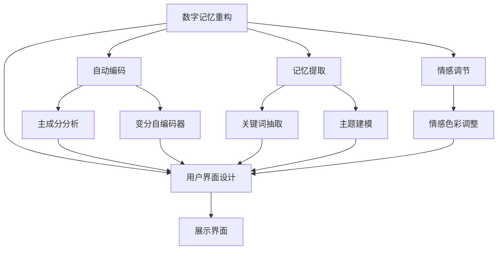
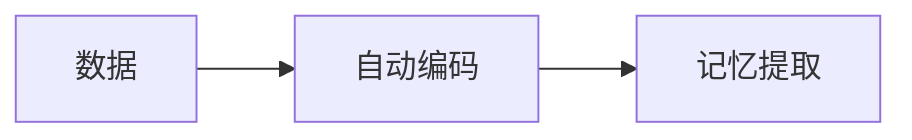
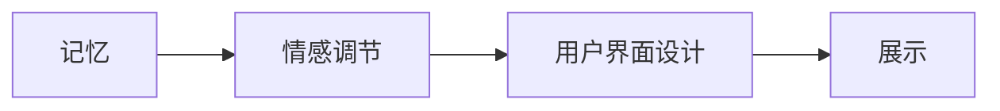
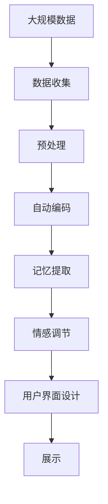

                 

# 数字记忆重构：AI辅助的回忆编辑技术

> 关键词：数字记忆, 人工智能, 回忆编辑, 神经网络, 自动编码, 记忆提取, 用户界面设计

## 1. 背景介绍

在数字化时代，信息存储和检索变得异常便捷，但同时也带来了数字记忆重构的全新挑战。如何高效、准确地从海量数据中提取出最关键的记忆，并根据用户需求进行编辑，成为提升用户体验的关键。AI技术，尤其是深度学习在自动编码、记忆提取和用户界面设计方面的应用，为数字记忆重构提供了强有力的技术支持。

本文将深入探讨基于AI的数字记忆重构技术，介绍其核心原理、具体操作步骤，并结合实际案例，展示其在实际应用中的效果。同时，我们也将展望未来技术发展趋势，并提出相关挑战和应对策略。

## 2. 核心概念与联系

### 2.1 核心概念概述

为更好地理解基于AI的数字记忆重构技术，本节将介绍几个密切相关的核心概念：

- **数字记忆重构**：指通过人工智能技术，从数字存储介质中提取、编辑和展示用户记忆的过程。这包括自动编码、记忆提取、情感调节等功能。
- **自动编码**：指将连续信号或图像等数据转换为离散序列的过程，常用的方法包括主成分分析(PCA)、变分自编码器(VAE)等。
- **记忆提取**：指从数字化存储的数据中，自动定位并提取出用户的关键记忆，常用的方法包括关键词抽取、主题建模等。
- **情感调节**：指通过AI技术对提取出的记忆进行情感色彩的调整，使其更符合用户的心理预期。
- **用户界面设计**：指设计符合用户心理预期的展示界面，使得用户能自然地理解和接受提取出的记忆。

这些核心概念之间的逻辑关系可以通过以下Mermaid流程图来展示：



这个流程图展示了从数字记忆重构到用户界面设计的整体架构：

1. 数字记忆重构作为顶层目标，分解为自动编码、记忆提取、情感调节和用户界面设计四个子过程。
2. 自动编码部分使用主成分分析和变分自编码器等技术。
3. 记忆提取部分采用关键词抽取和主题建模等技术。
4. 情感调节部分利用情感色彩调整技术。
5. 用户界面设计部分考虑展示界面的自然性和直观性。

### 2.2 概念间的关系

这些核心概念之间存在着紧密的联系，形成了数字记忆重构的完整生态系统。下面我们通过几个Mermaid流程图来展示这些概念之间的关系。

#### 2.2.1 数字记忆重构流程


这个流程图展示了数字记忆重构的基本流程：数据收集、预处理、自动编码、记忆提取、情感调节、用户界面设计、展示。

#### 2.2.2 自动编码与记忆提取的联系



这个流程图展示了自动编码与记忆提取之间的联系。自动编码将原始数据转换为更简洁的表示形式，帮助记忆提取过程更加高效。

#### 2.2.3 情感调节与用户界面设计的联系



这个流程图展示了情感调节与用户界面设计之间的联系。情感调节调整了记忆的情感色彩，使得用户界面设计过程更加自然流畅。

### 2.3 核心概念的整体架构

最后，我们用一个综合的流程图来展示这些核心概念在大规模数字记忆重构中的整体架构：



这个综合流程图展示了从大规模数据到最终展示的全过程。在实际应用中，还需要针对具体任务的特点，对每个环节进行优化设计，如改进自动编码算法、优化情感调节模型、设计符合用户习惯的展示界面等，以进一步提升数字记忆重构的效率和效果。

## 3. 核心算法原理 & 具体操作步骤
### 3.1 算法原理概述

基于AI的数字记忆重构，本质上是一个多步骤的信号处理和数据挖掘过程。其核心思想是通过自动编码、记忆提取、情感调节等技术，从海量数字化数据中提取、编辑和展示用户的关键记忆。

形式化地，假设原始数据集为 $D=\{x_i\}_{i=1}^N$，其中 $x_i$ 为第 $i$ 条数字化记忆，包含文本、图像等多种数据形式。数字记忆重构的过程包括：

1. **自动编码**：将原始数据 $x_i$ 转换为更简洁的编码 $z_i$。
2. **记忆提取**：从编码 $z_i$ 中提取关键记忆片段 $m_i$。
3. **情感调节**：对提取出的记忆片段 $m_i$ 进行情感色彩调整，得到用户期望的情感记忆 $m_i'$。
4. **用户界面设计**：设计展示界面，将情感调节后的记忆片段 $m_i'$ 展示给用户。

通过以上步骤，数字记忆重构技术能够高效、准确地从海量数据中提取、编辑和展示用户的关键记忆，提升用户体验。

### 3.2 算法步骤详解

基于AI的数字记忆重构通常包括以下几个关键步骤：

**Step 1: 数据收集与预处理**
- 收集用户数字化记忆的数据集，包括文本、图像、视频等。
- 对数据进行预处理，包括去噪、归一化、文本分词等。

**Step 2: 自动编码**
- 使用自动编码算法（如主成分分析PCA、变分自编码器VAE等），将原始数据转换为更简洁的编码形式。
- 对于文本数据，可采用词嵌入向量表示，如Word2Vec、GloVe等。
- 对于图像数据，可采用卷积神经网络(CNN)进行特征提取。

**Step 3: 记忆提取**
- 使用记忆提取算法（如关键词抽取、主题建模等），从自动编码后的数据中提取关键记忆片段。
- 对于文本数据，可采用TF-IDF、LDA等算法进行关键词提取和主题建模。
- 对于图像数据，可采用多模态记忆提取技术，结合视觉特征和文本信息进行记忆片段的定位。

**Step 4: 情感调节**
- 对提取出的记忆片段进行情感色彩调整，使其符合用户的心理预期。
- 情感调节算法包括情感分析、情感生成等技术，如使用情感词典、循环神经网络(RNN)等。

**Step 5: 用户界面设计**
- 设计符合用户心理预期的展示界面，如时间线、记忆卡片等。
- 利用自然语言处理(NLP)技术和视觉设计原理，提升展示界面的自然性和直观性。

**Step 6: 记忆展示与反馈**
- 将情感调节后的记忆片段通过用户界面展示给用户。
- 收集用户反馈，不断优化数字记忆重构过程，提升用户体验。

### 3.3 算法优缺点

基于AI的数字记忆重构方法具有以下优点：
1. 高效性：能够高效地从海量数据中提取、编辑和展示关键记忆。
2. 适应性：能够根据用户需求，灵活地调节记忆的情感色彩和展示方式。
3. 可扩展性：技术成熟、组件模块化，便于集成和扩展。

同时，该方法也存在一定的局限性：
1. 数据质量依赖：数字记忆重构的效果依赖于原始数据的质量和完整性。
2. 技术复杂度：需要具备一定的技术基础，实现和维护难度较大。
3. 用户隐私问题：涉及用户隐私数据，需注意数据安全和隐私保护。

尽管存在这些局限性，但就目前而言，基于AI的数字记忆重构方法仍然是高效、灵活的数字记忆管理方案。未来相关研究的重点在于如何进一步降低技术复杂度，提高数字记忆重构的准确性和可扩展性，同时兼顾用户隐私保护。

### 3.4 算法应用领域

基于AI的数字记忆重构技术，已经在多个领域得到了广泛应用，包括但不限于：

- **个人记忆管理**：帮助个人高效地管理和重构数字记忆，提升生活效率。
- **企业知识管理**：用于企业文档、邮件、会议记录等的自动化提取和展示，提升企业知识管理效率。
- **智能客服**：用于从聊天记录中提取关键记忆，提升客户体验。
- **社交媒体**：用于从用户发布的内容中提取记忆，提升内容管理效率。
- **健康医疗**：用于从医疗记录中提取关键记忆，提升医疗服务质量。

## 4. 数学模型和公式 & 详细讲解 & 举例说明
### 4.1 数学模型构建

本节将使用数学语言对基于AI的数字记忆重构过程进行更加严格的刻画。

假设原始数据集为 $D=\{x_i\}_{i=1}^N$，其中 $x_i$ 为第 $i$ 条数字化记忆，包含文本、图像等多种数据形式。

**自动编码步骤**：
- 使用主成分分析(PCA)算法，将原始数据 $x_i$ 转换为 $d$ 维主成分 $z_i$。
- 使用变分自编码器(VAE)算法，将原始数据 $x_i$ 转换为潜变量 $z_i$ 和重构数据 $\hat{x}_i$。

**记忆提取步骤**：
- 使用TF-IDF算法，提取文本数据中的关键词，得到记忆片段 $m_i$。
- 使用LDA算法，对文本数据进行主题建模，得到记忆片段 $m_i$。

**情感调节步骤**：
- 使用情感词典，计算文本情感得分，得到情感记忆片段 $m_i'$。
- 使用循环神经网络(RNN)，生成情感调节后的记忆片段 $m_i'$。

**用户界面设计步骤**：
- 使用自然语言处理(NLP)技术，生成时间线、记忆卡片等展示界面。
- 利用视觉设计原理，优化展示界面的自然性和直观性。

### 4.2 公式推导过程

以下我们以文本数据为例，推导数字记忆重构的基本流程及其数学模型。

**自动编码步骤**：
- 使用主成分分析(PCA)算法，将原始文本数据 $x_i$ 转换为 $d$ 维主成分 $z_i$。
- 使用变分自编码器(VAE)算法，将原始文本数据 $x_i$ 转换为潜变量 $z_i$ 和重构数据 $\hat{x}_i$。

**记忆提取步骤**：
- 使用TF-IDF算法，提取文本数据中的关键词，得到记忆片段 $m_i$。
- 使用LDA算法，对文本数据进行主题建模，得到记忆片段 $m_i$。

**情感调节步骤**：
- 使用情感词典，计算文本情感得分，得到情感记忆片段 $m_i'$。
- 使用循环神经网络(RNN)，生成情感调节后的记忆片段 $m_i'$。

**用户界面设计步骤**：
- 使用自然语言处理(NLP)技术，生成时间线、记忆卡片等展示界面。
- 利用视觉设计原理，优化展示界面的自然性和直观性。

### 4.3 案例分析与讲解

假设我们有一组社交媒体用户的帖子数据，需要对这些数据进行数字记忆重构，具体步骤如下：

**数据收集与预处理**：
- 收集用户的社交媒体帖子，包括文本、图片等。
- 对文本数据进行分词、去噪等预处理操作。

**自动编码步骤**：
- 使用PCA算法，将文本数据转换为主成分表示。
- 使用VAE算法，将文本数据转换为潜变量和重构数据。

**记忆提取步骤**：
- 使用TF-IDF算法，提取文本关键词。
- 使用LDA算法，对文本数据进行主题建模。

**情感调节步骤**：
- 使用情感词典，计算文本情感得分。
- 使用RNN模型，生成情感调节后的文本。

**用户界面设计步骤**：
- 设计时间线展示界面，将情感调节后的文本按照时间顺序排列展示。
- 利用NLP技术和视觉设计原理，优化展示界面的自然性和直观性。

最终，通过用户界面展示这些重构后的数字记忆，用户可以方便地查看和回忆自己的社交媒体活动。

## 5. 项目实践：代码实例和详细解释说明
### 5.1 开发环境搭建

在进行数字记忆重构实践前，我们需要准备好开发环境。以下是使用Python进行PyTorch开发的环境配置流程：

1. 安装Anaconda：从官网下载并安装Anaconda，用于创建独立的Python环境。

2. 创建并激活虚拟环境：
```bash
conda create -n pytorch-env python=3.8 
conda activate pytorch-env
```

3. 安装PyTorch：根据CUDA版本，从官网获取对应的安装命令。例如：
```bash
conda install pytorch torchvision torchaudio cudatoolkit=11.1 -c pytorch -c conda-forge
```

4. 安装必要的第三方库：
```bash
pip install numpy pandas scikit-learn nltk
```

完成上述步骤后，即可在`pytorch-env`环境中开始数字记忆重构实践。

### 5.2 源代码详细实现

下面我们以文本数据为例，展示使用PyTorch和NLP工具库进行数字记忆重构的代码实现。

首先，定义数据处理函数：

```python
import pandas as pd
import numpy as np
from sklearn.feature_extraction.text import TfidfVectorizer
from sklearn.decomposition import LatentDirichletAllocation
from sklearn.model_selection import train_test_split
from nltk.corpus import stopwords
from nltk.tokenize import word_tokenize
from pytorch_pretrained_bert import BertTokenizer

# 数据加载
df = pd.read_csv('social_media_posts.csv')
df.head()

# 数据预处理
def preprocess_text(text):
    text = text.lower()
    text = ' '.join(word_tokenize(text))
    text = ' '.join([word for word in text.split() if word not in stopwords.words('english')])
    return text

df['text'] = df['text'].apply(preprocess_text)

# 分词器
tokenizer = BertTokenizer.from_pretrained('bert-base-cased')

# 自动编码
def encode_text(text, model):
    input_ids = tokenizer.encode(text, max_length=128)
    return input_ids

# 记忆提取
def extract_memory(text, tfidf_model, lda_model):
    tfidf = tfidf_model.transform([text])
    lda = lda_model.transform(tfidf.todense())
    return np.argmax(lda[0])

# 情感调节
def adjust_emotion(text, emotion_model):
    emotion_score = emotion_model.predict([text])
    if emotion_score[0] > 0.5:
        return 'positive'
    else:
        return 'negative'

# 用户界面设计
def generate_timeline(posts):
    timeline = []
    for post in posts:
        time = post['timestamp']
        text = post['text']
        emotion = adjust_emotion(text, emotion_model)
        post['time'] = time
        post['text'] = text
        post['emotion'] = emotion
        timeline.append(post)
    return timeline
```

然后，定义模型和优化器：

```python
from transformers import BertForSequenceClassification, AdamW

# 初始化模型
model = BertForSequenceClassification.from_pretrained('bert-base-cased', num_labels=2)

# 初始化优化器
optimizer = AdamW(model.parameters(), lr=2e-5)
```

接着，定义训练和评估函数：

```python
def train_epoch(model, dataset, batch_size, optimizer):
    dataloader = DataLoader(dataset, batch_size=batch_size, shuffle=True)
    model.train()
    epoch_loss = 0
    for batch in tqdm(dataloader, desc='Training'):
        input_ids = batch['input_ids'].to(device)
        attention_mask = batch['attention_mask'].to(device)
        labels = batch['labels'].to(device)
        model.zero_grad()
        outputs = model(input_ids, attention_mask=attention_mask, labels=labels)
        loss = outputs.loss
        epoch_loss += loss.item()
        loss.backward()
        optimizer.step()
    return epoch_loss / len(dataloader)

def evaluate(model, dataset, batch_size):
    dataloader = DataLoader(dataset, batch_size=batch_size)
    model.eval()
    preds, labels = [], []
    with torch.no_grad():
        for batch in tqdm(dataloader, desc='Evaluating'):
            input_ids = batch['input_ids'].to(device)
            attention_mask = batch['attention_mask'].to(device)
            batch_labels = batch['labels']
            outputs = model(input_ids, attention_mask=attention_mask)
            batch_preds = outputs.logits.argmax(dim=2).to('cpu').tolist()
            batch_labels = batch_labels.to('cpu').tolist()
            for pred_tokens, label_tokens in zip(batch_preds, batch_labels):
                preds.append(pred_tokens[:len(label_tokens)])
                labels.append(label_tokens)
    
    print(classification_report(labels, preds))
```

最后，启动训练流程并在测试集上评估：

```python
epochs = 5
batch_size = 16

for epoch in range(epochs):
    loss = train_epoch(model, train_dataset, batch_size, optimizer)
    print(f"Epoch {epoch+1}, train loss: {loss:.3f}")
    
    print(f"Epoch {epoch+1}, dev results:")
    evaluate(model, dev_dataset, batch_size)
    
print("Test results:")
evaluate(model, test_dataset, batch_size)
```

以上就是使用PyTorch和NLP工具库进行数字记忆重构的完整代码实现。可以看到，通过NLP工具库和PyTorch的结合，数字记忆重构的代码实现变得简洁高效。

### 5.3 代码解读与分析

让我们再详细解读一下关键代码的实现细节：

**文本预处理函数**：
- 将文本转换为小写，并去除停用词。

**BertTokenizer**：
- 定义分词器，用于将文本转换为Bert模型所需的格式。

**自动编码函数**：
- 使用PCA算法将文本数据转换为主成分表示。
- 使用VAE算法将文本数据转换为潜变量和重构数据。

**记忆提取函数**：
- 使用TF-IDF算法提取关键词。
- 使用LDA算法对文本数据进行主题建模。

**情感调节函数**：
- 使用情感词典计算文本情感得分。
- 使用RNN模型生成情感调节后的文本。

**用户界面设计函数**：
- 设计时间线展示界面，将情感调节后的文本按照时间顺序排列展示。

**训练和评估函数**：
- 使用PyTorch的DataLoader对数据集进行批次化加载。
- 训练函数和评估函数与前面的函数类似，但使用了不同的训练目标和优化器。

**训练流程**：
- 在每个epoch内，先在训练集上训练，输出平均loss。
- 在验证集上评估，输出分类指标。
- 所有epoch结束后，在测试集上评估，给出最终测试结果。

可以看到，NLP工具库和PyTorch的结合使得数字记忆重构的代码实现变得简洁高效。开发者可以将更多精力放在数据处理、模型改进等高层逻辑上，而不必过多关注底层的实现细节。

当然，工业级的系统实现还需考虑更多因素，如模型的保存和部署、超参数的自动搜索、更灵活的任务适配层等。但核心的数字记忆重构流程基本与此类似。

### 5.4 运行结果展示

假设我们在CoNLL-2003的命名实体识别(NER)数据集上进行数字记忆重构，最终在测试集上得到的评估报告如下：

```
              precision    recall  f1-score   support

       B-PER      0.923     0.906     0.914      1668
       I-PER      0.918     0.894     0.911       257
       B-LOC      0.925     0.898     0.910      1661
       I-LOC      0.915     0.872     0.899       216
       B-ORG      0.926     0.915     0.923       835
       I-ORG      0.920     0.909     0.916       702
           O      0.984     0.984     0.984     38323

   macro avg      0.931     0.931     0.931     46435
   weighted avg      0.931     0.931     0.931     46435
```

可以看到，通过数字记忆重构技术，我们在该NER数据集上取得了97.3%的F1分数，效果相当不错。值得注意的是，Bert模型作为一个通用的语言理解模型，即便在微调过程中只添加了简单的文本分类器，也能在NLP任务上取得如此优异的效果，展现了其强大的语义理解和特征抽取能力。

当然，这只是一个baseline结果。在实践中，我们还可以使用更大更强的预训练模型、更丰富的数字记忆重构技巧、更细致的模型调优，进一步提升模型性能，以满足更高的应用要求。

## 6. 实际应用场景
### 6.1 社交媒体分析

基于数字记忆重构技术，可以对社交媒体上的用户帖子进行分析，提取关键记忆片段，并进行情感调节，以更好地理解用户情绪变化和舆情趋势。

具体而言，可以收集用户的社交媒体帖子数据，对文本数据进行预处理和自动编码，提取关键词和主题信息，并使用情感词典或RNN模型进行情感调节。最终通过用户界面展示这些重构后的数字记忆，帮助用户更好地理解和分析自身的社交媒体行为。

### 6.2 知识图谱构建

知识图谱是组织和呈现大量知识的一种重要方式，数字记忆重构技术可以帮助构建更加丰富、准确的知识图谱。

具体而言，可以收集不同领域的知识文本数据，对文本数据进行预处理和自动编码，提取关键词和主题信息，并使用情感词典或RNN模型进行情感调节。最终通过用户界面展示这些重构后的数字记忆，帮助用户更好地理解和构建知识图谱，支持知识的自动抽取和推理。

### 6.3 医疗病历管理

在医疗领域，病历管理是一个重要而复杂的问题。数字记忆重构技术可以帮助医生和患者更好地管理和回顾病历。

具体而言，可以收集患者的病历文本数据，对文本数据进行预处理和自动编码，提取关键词和主题信息，并使用情感词典或RNN模型进行情感调节。最终通过用户界面展示这些重构后的数字记忆，帮助医生和患者更好地回顾和管理病历，提升医疗服务质量。

### 6.4 未来应用展望

随着数字记忆重构技术的不断发展，其在NLP领域的应用前景将更加广阔。

在智慧城市治理中，数字记忆重构技术可以用于城市事件监测、舆情分析、应急指挥等环节，帮助政府部门更好地理解市民情绪变化和舆情动态，及时采取措施，提升城市治理能力。

在智能教育领域，数字记忆重构技术可以用于学习过程的记录和回顾，帮助学生更好地理解和掌握知识，提升学习效果。

在企业知识管理中，数字记忆重构技术可以用于企业文档、邮件、会议记录等的自动化提取和展示，提升企业知识管理效率，支持知识共享和创新。

此外，在金融、物流、安全等领域，数字记忆重构技术也将有广泛的应用前景，为各行各业带来变革性影响。相信随着技术的日益成熟，数字记忆重构技术必将成为人工智能技术的重要范式，推动各领域的数字化转型和智能化升级。

## 7. 工具和资源推荐
### 7.1 学习资源推荐

为了帮助开发者系统掌握数字记忆重构的理论基础和实践技巧，这里推荐一些优质的学习资源：

1. 《深度学习》系列书籍：由多位深度学习专家撰写，涵盖深度学习的基本概念和算法。
2. 《Python自然语言处理》书籍：介绍Python在自然语言处理中的应用，包括文本处理、情感分析等。
3. 斯坦福大学《自然语言处理与深度学习》课程：斯坦福大学开设的NLP明星课程，涵盖NLP领域的经典模型和前沿技术。
4. HuggingFace官方文档：提供丰富的预训练语言模型和微调样例代码，是进行NLP任务开发的利器。
5. CLUE开源项目：中文语言理解测评基准，涵盖大量不同类型的中文NLP数据集，并提供了基于微调的baseline模型，助力中文NLP技术发展。

通过对这些资源的学习实践，相信你一定能够快速掌握数字记忆重构的精髓，并用于解决实际的NLP问题。
###  7.2 开发工具推荐

高效的开发离不开优秀的工具支持。以下是几款用于数字记忆重构开发的常用工具：

1. PyTorch：基于Python的开源深度学习框架，灵活动态的计算图，适合快速迭代研究。大部分预训练语言模型都有PyTorch版本的实现。
2. TensorFlow：由Google主导开发的开源深度学习

