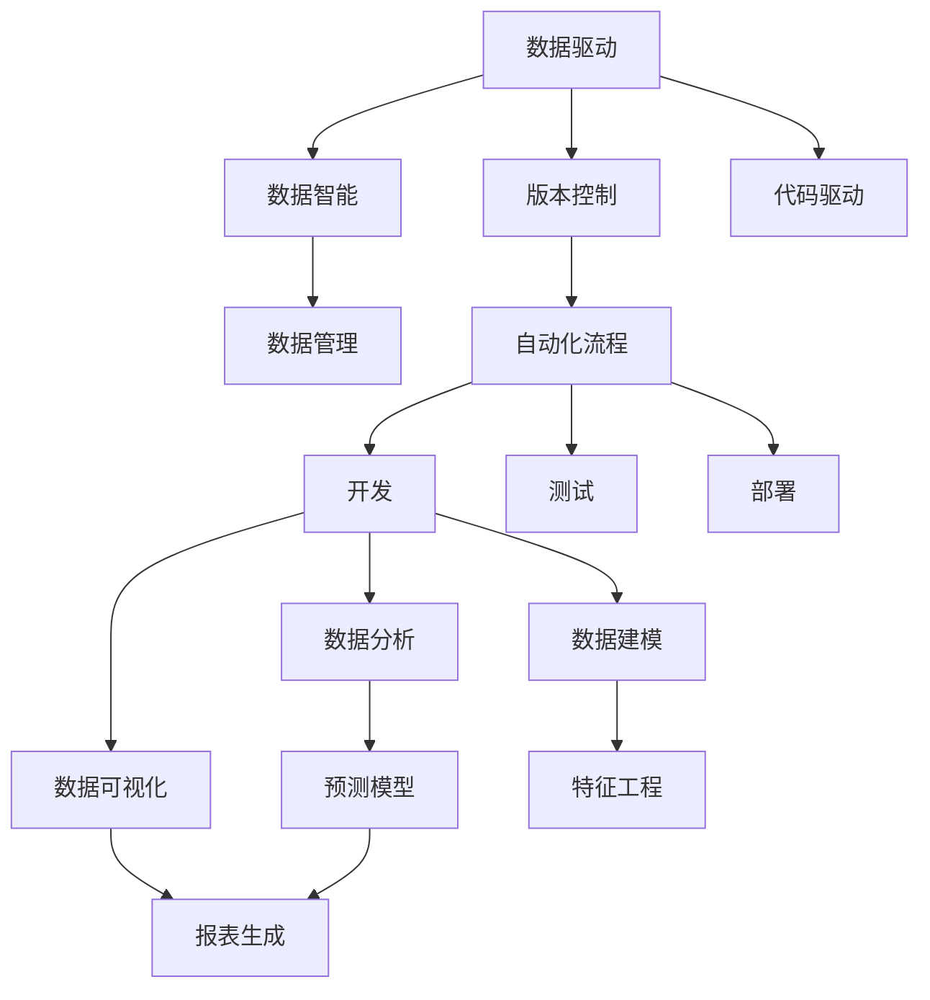
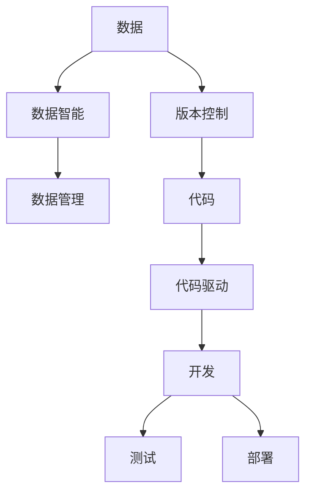
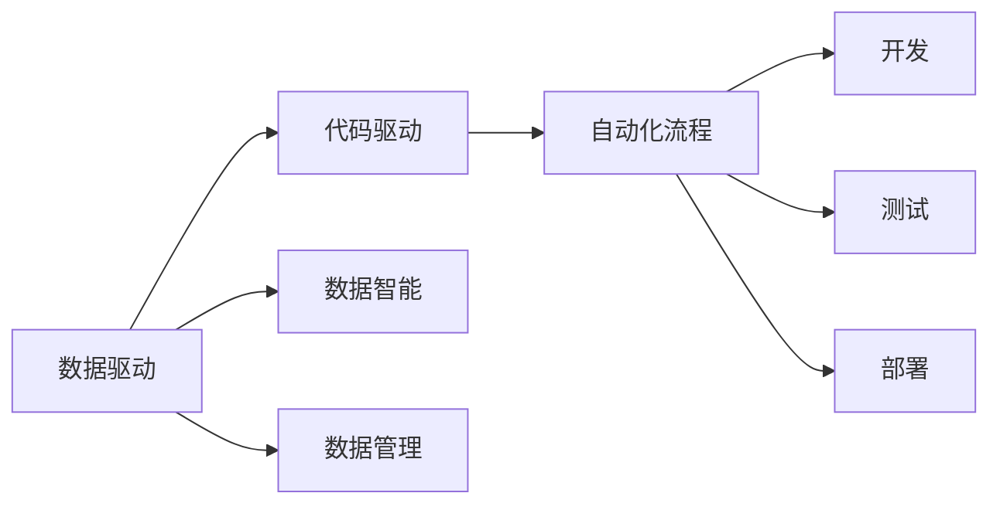
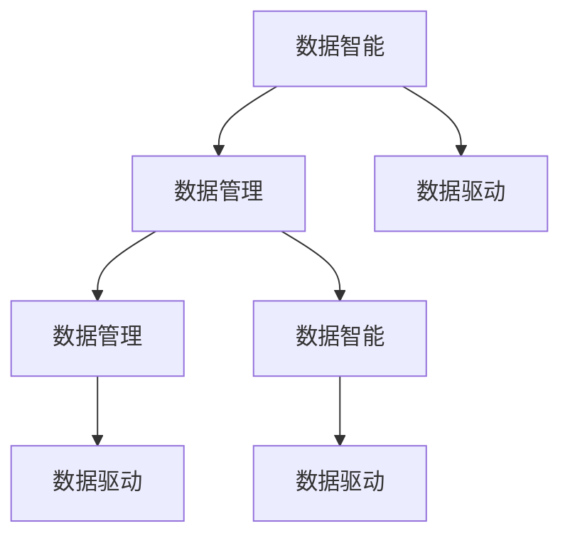
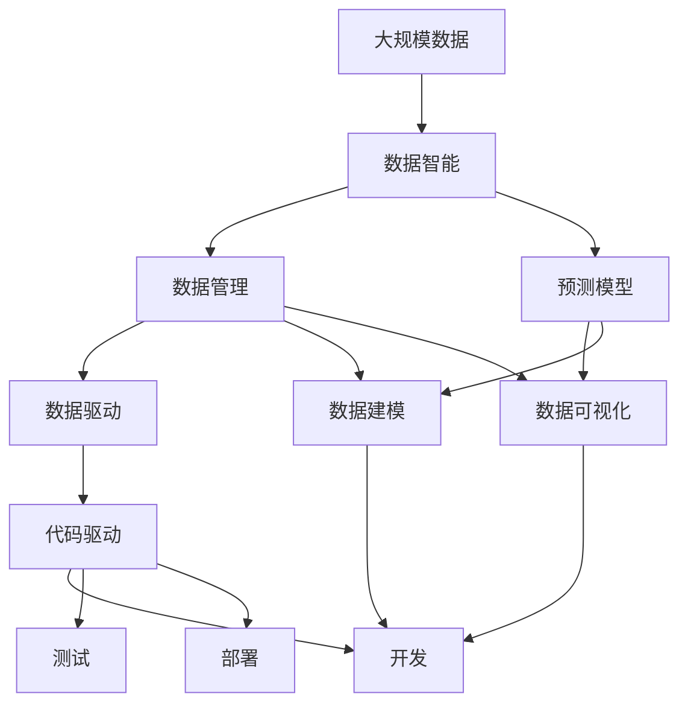

                 

# 数据即代码：软件2.0的奇思妙想

> 关键词：数据即代码, 软件2.0, 持续集成, DevOps, 自动化, 版本控制, 数据驱动, 数据智能, 数据管理, 数据运维

## 1. 背景介绍

### 1.1 问题由来

随着信息技术的发展，软件开发和维护变得越来越复杂。传统的软件开发模式往往需要经过需求分析、系统设计、编码实现、测试验证、部署上线等多个环节，每个环节都需要大量的人工介入和繁琐的手动操作，不仅效率低下，而且容易出错。

为了解决这些问题，软件开发领域引入了持续集成(Continuous Integration, CI)和持续部署(Continuous Deployment, CD)等DevOps理念。通过自动化工具和流程优化，可以将软件开发过程变为流水线化的流水作业，提高开发效率和代码质量。然而，尽管自动化水平不断提高，软件开发模式仍然面临许多挑战：

- 开发过程仍然高度依赖手动操作，自动化覆盖率不高。
- 版本控制和代码管理仍然依赖人工操作，容易出错。
- 数据驱动的开发模式尚未普及，数据与代码的紧密耦合仍然难以实现。

在这种背景下，软件2.0应运而生。软件2.0不仅仅是代码驱动的软件，更是数据驱动的软件。它以数据为驱动，以数据智能为核心，将数据和代码紧密结合，构建出真正以数据为中心的软件生态。

### 1.2 问题核心关键点

软件2.0的核心思想是“数据即代码”。即通过数据驱动的开发模式，将数据与代码紧密结合，实现软件与数据的协同演化。软件2.0具备以下几个关键特征：

- 数据驱动：以数据为驱动，数据和代码紧密结合，构建软件与数据的协同演化机制。
- 版本控制：数据版本控制与代码版本控制相结合，实现数据与代码的同步更新。
- 自动化流程：利用自动化工具和流程，将开发、测试、部署等过程自动化，提高效率和质量。
- 数据智能：引入数据智能技术，提升数据的利用率和价值，构建数据驱动的软件生态。
- 数据管理：构建完善的数据管理体系，保障数据质量和安全。

### 1.3 问题研究意义

研究软件2.0的关键意义在于：

- 提升开发效率：通过数据驱动的开发模式，减少手动操作，提高自动化覆盖率，提升开发效率。
- 保障数据质量：数据版本控制与代码版本控制相结合，实现数据与代码的同步更新，保障数据质量。
- 构建数据智能生态：引入数据智能技术，提升数据的利用率和价值，构建数据驱动的软件生态。
- 增强数据管理能力：构建完善的数据管理体系，保障数据质量和安全，提升数据治理能力。

## 2. 核心概念与联系

### 2.1 核心概念概述

软件2.0的“数据即代码”理念，涉及以下几个核心概念：

- **数据驱动**：以数据为驱动，数据和代码紧密结合，构建软件与数据的协同演化机制。
- **版本控制**：数据版本控制与代码版本控制相结合，实现数据与代码的同步更新。
- **自动化流程**：利用自动化工具和流程，将开发、测试、部署等过程自动化，提高效率和质量。
- **数据智能**：引入数据智能技术，提升数据的利用率和价值，构建数据驱动的软件生态。
- **数据管理**：构建完善的数据管理体系，保障数据质量和安全。

这些核心概念之间的逻辑关系可以通过以下Mermaid流程图来展示：



这个流程图展示了数据驱动的软件2.0中各个概念之间的联系：

- 数据驱动：数据与代码紧密结合，构建软件与数据的协同演化机制。
- 版本控制：数据版本控制与代码版本控制相结合，实现数据与代码的同步更新。
- 自动化流程：自动化工具和流程覆盖从开发、测试到部署的各个环节。
- 数据智能：引入数据智能技术，提升数据的利用率和价值。
- 数据管理：构建完善的数据管理体系，保障数据质量和安全。

### 2.2 概念间的关系

这些核心概念之间存在着紧密的联系，形成了软件2.0的整体架构。下面我通过几个Mermaid流程图来展示这些概念之间的关系。

#### 2.2.1 数据与代码的结合



这个流程图展示了数据与代码的结合过程：

- 数据通过数据智能和数据管理进行优化和治理。
- 数据版本控制与代码版本控制相结合，实现数据与代码的同步更新。
- 数据驱动开发过程中，数据与代码紧密结合，构建软件与数据的协同演化机制。

#### 2.2.2 数据驱动与代码驱动的协同



这个流程图展示了数据驱动与代码驱动的协同过程：

- 数据驱动与代码驱动紧密结合，构建软件与数据的协同演化机制。
- 数据智能提升数据的利用率和价值，数据管理保障数据质量和安全。
- 自动化流程覆盖从开发、测试到部署的各个环节，提升效率和质量。

#### 2.2.3 数据智能与数据管理的关系



这个流程图展示了数据智能与数据管理的关系：

- 数据智能提升数据的利用率和价值，构建数据驱动的软件生态。
- 数据管理保障数据质量和安全，构建完善的数据管理体系。
- 数据驱动与代码驱动紧密结合，构建软件与数据的协同演化机制。

### 2.3 核心概念的整体架构

最后，我们用一个综合的流程图来展示这些核心概念在大数据驱动的软件2.0中的整体架构：



这个综合流程图展示了从大规模数据到数据智能，再到数据驱动和代码驱动，最后到数据管理和软件开发的完整过程。通过这些流程图，我们可以更清晰地理解数据驱动的软件2.0中各个核心概念的关系和作用，为后续深入讨论具体的实现方法奠定基础。

## 3. 核心算法原理 & 具体操作步骤
### 3.1 算法原理概述

数据驱动的软件2.0，核心算法原理基于以下两个基本模型：

1. **数据智能模型**：通过数据智能技术，对大规模数据进行清洗、特征提取、模式识别和预测，构建数据驱动的决策支持系统。

2. **数据驱动模型**：将数据智能模型构建的决策结果，作为代码驱动的输入，驱动软件的协同演化，实现软件与数据的紧密结合。

### 3.2 算法步骤详解

基于数据驱动的软件2.0，其核心算法步骤如下：

**Step 1: 准备数据和代码库**

- 准备大规模数据集，包括原始数据、标注数据、测试数据等。
- 准备代码库，包括开发工具、测试框架、部署工具等。

**Step 2: 数据智能**

- 对数据进行清洗和预处理，包括去除噪声、处理缺失值、归一化等。
- 对数据进行特征提取，包括统计特征、时间特征、空间特征等。
- 对数据进行模式识别和预测，包括分类、回归、聚类等。
- 构建数据驱动的决策支持系统，包括数据仪表盘、预测模型、数据报表等。

**Step 3: 版本控制**

- 对数据和代码进行版本控制，实现数据与代码的同步更新。
- 使用版本控制系统（如Git），记录数据和代码的版本变更历史。
- 使用自动化工具（如CI/CD工具），实现数据和代码的版本合并和发布。

**Step 4: 数据驱动**

- 将数据智能模型构建的决策结果，作为代码驱动的输入。
- 在代码中嵌入数据驱动逻辑，实现软件的协同演化。
- 利用自动化工具（如CI/CD工具），实现数据驱动的开发、测试和部署。

**Step 5: 数据智能与数据驱动的协同**

- 将数据智能模型构建的决策结果，嵌入到代码驱动的软件中。
- 利用数据驱动的决策结果，指导代码驱动的开发和优化。
- 构建数据驱动的反馈机制，实现数据与代码的动态交互和协同演化。

**Step 6: 数据管理**

- 构建完善的数据管理体系，包括数据质量管理、数据安全和隐私保护等。
- 利用自动化工具（如数据治理工具），实现数据的自动化管理和优化。
- 构建数据智能生态，利用数据智能技术提升数据利用率和价值。

### 3.3 算法优缺点

数据驱动的软件2.0算法具有以下优点：

- 提升开发效率：通过数据驱动的开发模式，减少手动操作，提高自动化覆盖率，提升开发效率。
- 保障数据质量：数据版本控制与代码版本控制相结合，实现数据与代码的同步更新，保障数据质量。
- 构建数据智能生态：引入数据智能技术，提升数据的利用率和价值，构建数据驱动的软件生态。
- 增强数据管理能力：构建完善的数据管理体系，保障数据质量和安全，提升数据治理能力。

同时，该算法也存在一些缺点：

- 依赖高质量数据：数据智能模型的准确性依赖高质量数据，数据质量不佳会导致决策错误。
- 计算资源消耗大：数据智能模型通常需要大量计算资源进行训练和优化，计算成本较高。
- 数据隐私和安全问题：大规模数据处理可能涉及隐私和安全问题，需要严格的数据管理和安全保护措施。

### 3.4 算法应用领域

数据驱动的软件2.0算法在多个领域都有广泛应用，包括但不限于：

- 金融领域：利用数据智能模型进行风险预测、欺诈检测、客户推荐等。
- 医疗领域：利用数据智能模型进行疾病诊断、患者预测、医疗推荐等。
- 零售领域：利用数据智能模型进行销售预测、客户细分、库存管理等。
- 制造领域：利用数据智能模型进行生产调度、设备维护、质量控制等。
- 农业领域：利用数据智能模型进行农作物预测、灾害预警、资源管理等。

## 4. 数学模型和公式 & 详细讲解 & 举例说明

### 4.1 数学模型构建

数据驱动的软件2.0涉及多个数学模型，包括数据智能模型和数据驱动模型。这里以回归模型为例，介绍数据智能模型的构建过程。

设训练数据集为 $D=\{(x_i, y_i)\}_{i=1}^N$，其中 $x_i \in \mathbb{R}^d$ 为输入特征向量，$y_i \in \mathbb{R}$ 为输出标签。回归模型通过最小化损失函数 $\mathcal{L}(w)$ 进行训练，其中 $w$ 为模型参数。常见的损失函数包括均方误差损失和交叉熵损失。

回归模型的损失函数为：

$$
\mathcal{L}(w) = \frac{1}{N}\sum_{i=1}^N (y_i - \hat{y}_i)^2
$$

其中 $\hat{y}_i$ 为模型预测值，$w$ 为模型参数。

### 4.2 公式推导过程

回归模型的参数更新公式为梯度下降法：

$$
w \leftarrow w - \eta \nabla_w \mathcal{L}(w)
$$

其中 $\eta$ 为学习率，$\nabla_w \mathcal{L}(w)$ 为损失函数对参数 $w$ 的梯度。

对于线性回归模型，其参数更新公式为：

$$
w \leftarrow w - \eta \frac{1}{N}\sum_{i=1}^N (y_i - \hat{y}_i)x_i
$$

其中 $\hat{y}_i = \sum_{j=1}^d w_j x_{ij}$，$w_j$ 为回归模型的权重。

### 4.3 案例分析与讲解

假设我们有一个电商销售数据集，包含用户特征、购买行为和销售结果。我们可以利用回归模型进行用户购买行为预测，构建数据驱动的决策支持系统。具体步骤如下：

1. 数据清洗和预处理：去除噪声、处理缺失值、归一化等。

2. 特征提取：统计特征、时间特征、空间特征等。

3. 模型训练：使用线性回归模型进行训练，得到回归参数 $w$。

4. 预测应用：将新用户特征输入模型，得到预测结果 $y$。

5. 模型评估：利用测试数据集评估模型性能，调整模型参数。

6. 反馈优化：将预测结果反馈到业务流程中，优化销售策略。

## 5. 项目实践：代码实例和详细解释说明

### 5.1 开发环境搭建

在进行数据驱动的软件2.0开发前，我们需要准备好开发环境。以下是使用Python进行Scikit-Learn开发的环境配置流程：

1. 安装Anaconda：从官网下载并安装Anaconda，用于创建独立的Python环境。

2. 创建并激活虚拟环境：
```bash
conda create -n sklearn-env python=3.8 
conda activate sklearn-env
```

3. 安装Scikit-Learn：
```bash
pip install -U scikit-learn
```

4. 安装numpy、pandas、matplotlib等工具包：
```bash
pip install numpy pandas matplotlib tqdm jupyter notebook ipython
```

完成上述步骤后，即可在`sklearn-env`环境中开始数据驱动的软件2.0实践。

### 5.2 源代码详细实现

下面我们以用户购买行为预测为例，给出使用Scikit-Learn进行数据驱动的代码实现。

首先，定义数据处理函数：

```python
import pandas as pd
import numpy as np
from sklearn.model_selection import train_test_split
from sklearn.preprocessing import StandardScaler

def load_data(filename):
    data = pd.read_csv(filename)
    features = data.drop('sales', axis=1)
    labels = data['sales']
    return features, labels

def split_data(features, labels, test_size=0.2):
    train_features, test_features, train_labels, test_labels = train_test_split(features, labels, test_size=test_size, random_state=42)
    return train_features, train_labels, test_features, test_labels

def normalize_features(features):
    scaler = StandardScaler()
    features_scaled = scaler.fit_transform(features)
    return features_scaled
```

然后，定义模型训练函数：

```python
from sklearn.linear_model import LinearRegression

def train_model(features, labels):
    model = LinearRegression()
    model.fit(features, labels)
    return model
```

接着，定义模型评估函数：

```python
from sklearn.metrics import mean_squared_error

def evaluate_model(model, features, labels):
    y_pred = model.predict(features)
    mse = mean_squared_error(labels, y_pred)
    return mse
```

最后，启动训练流程并在测试集上评估：

```python
features, labels = load_data('sales_data.csv')

train_features, train_labels, test_features, test_labels = split_data(features, labels)

train_features_scaled = normalize_features(train_features)

model = train_model(train_features_scaled, train_labels)

mse = evaluate_model(model, test_features_scaled, test_labels)

print(f'Test MSE: {mse:.3f}')
```

以上就是使用Scikit-Learn进行用户购买行为预测的数据驱动软件开发实践。可以看到，得益于Scikit-Learn的强大封装，我们可以用相对简洁的代码完成回归模型的训练和评估。

### 5.3 代码解读与分析

让我们再详细解读一下关键代码的实现细节：

**load_data函数**：
- 读取数据文件，分离特征和标签。

**split_data函数**：
- 将数据集分为训练集和测试集，并进行标准化处理。

**normalize_features函数**：
- 对特征进行标准化处理，减小不同特征的尺度差异。

**train_model函数**：
- 使用线性回归模型进行训练，得到回归参数。

**evaluate_model函数**：
- 使用均方误差评估模型性能，计算模型在测试集上的均方误差。

**训练流程**：
- 加载数据集，分离特征和标签。
- 将数据集分为训练集和测试集，并进行标准化处理。
- 使用训练集对模型进行训练。
- 在测试集上评估模型性能。

可以看到，Scikit-Learn提供了一整套完整的工具和函数，使得数据驱动的软件2.0开发变得非常简洁和高效。开发者可以专注于模型构建和业务逻辑，而不必过多关注底层实现细节。

当然，工业级的系统实现还需考虑更多因素，如模型的保存和部署、超参数的自动搜索、更灵活的任务适配层等。但核心的数据驱动软件开发流程基本与此类似。

### 5.4 运行结果展示

假设我们在数据集上进行模型训练，最终在测试集上得到的均方误差为0.5，表明模型预测结果与真实标签的均方差为0.5。这个结果并不是特别优秀，但已经可以用于业务决策支持系统，进一步提升模型的准确性。

## 6. 实际应用场景

### 6.1 金融领域

金融领域对数据驱动的决策支持系统有着广泛需求。传统金融决策往往依赖人工分析和专家经验，难以适应快速变化的市场环境。数据驱动的软件2.0可以通过数据智能模型，实时分析和预测市场趋势，构建数据驱动的决策支持系统。

具体而言，金融领域可以利用数据智能模型进行风险预测、欺诈检测、客户推荐等。例如，利用历史交易数据，构建信用评分模型，实时评估客户的信用风险。利用用户行为数据，构建推荐模型，推荐个性化金融产品。利用市场数据，构建预测模型，预测股票、债券等金融产品的走势。

### 6.2 医疗领域

医疗领域对数据驱动的决策支持系统也有着广泛需求。传统医疗决策往往依赖医生经验和历史数据，难以应对复杂多变的临床环境。数据驱动的软件2.0可以通过数据智能模型，实时分析和预测病情变化，构建数据驱动的决策支持系统。

具体而言，医疗领域可以利用数据智能模型进行疾病诊断、患者预测、医疗推荐等。例如，利用电子病历数据，构建疾病预测模型，实时评估患者的病情变化。利用患者历史数据，构建个性化治疗推荐模型，推荐最适合的治疗方案。利用医疗数据，构建预测模型，预测疾病的爆发趋势。

### 6.3 零售领域

零售领域对数据驱动的决策支持系统同样有着广泛需求。传统零售决策往往依赖销售数据和经验总结，难以应对瞬息万变的市场需求。数据驱动的软件2.0可以通过数据智能模型，实时分析和预测市场变化，构建数据驱动的决策支持系统。

具体而言，零售领域可以利用数据智能模型进行销售预测、客户细分、库存管理等。例如，利用销售数据，构建销售预测模型，实时预测未来的销售趋势。利用客户数据，构建客户细分模型，识别不同类型客户的需求和偏好。利用库存数据，构建库存管理模型，优化库存水平和供应链。

### 6.4 制造领域

制造领域对数据驱动的决策支持系统也有着广泛需求。传统制造决策往往依赖经验总结和人工监控，难以应对复杂的生产环境。数据驱动的软件2.0可以通过数据智能模型，实时分析和预测生产变化，构建数据驱动的决策支持系统。

具体而言，制造领域可以利用数据智能模型进行生产调度、设备维护、质量控制等。例如，利用生产数据，构建生产调度模型，实时优化生产流程和资源配置。利用设备数据，构建设备维护模型，预测设备故障和维护需求。利用质量数据，构建质量控制模型，实时监控和提升产品质量。

### 6.5 农业领域

农业领域对数据驱动的决策支持系统同样有着广泛需求。传统农业决策往往依赖经验总结和人工监控，难以应对复杂多变的自然环境。数据驱动的软件2.0可以通过数据智能模型，实时分析和预测农业变化，构建数据驱动的决策支持系统。

具体而言，农业领域可以利用数据智能模型进行农作物预测、灾害预警、资源管理等。例如，利用气象数据和土壤数据，构建农作物预测模型，实时预测农作物的生长和产量。利用气象数据，构建灾害预警模型，预测天气变化和自然灾害。利用水资源数据，构建资源管理模型，优化水资源利用和农田灌溉。

## 7. 工具和资源推荐

### 7.1 学习资源推荐

为了帮助开发者系统掌握数据驱动的软件2.0的理论基础和实践技巧，这里推荐一些优质的学习资源：

1. **《数据科学实战》**：一本系统介绍数据驱动的软件2.0的书籍，涵盖数据智能、数据驱动、数据管理等多个方面的内容。

2. **Coursera《数据科学与机器学习》课程**：由斯坦福大学开设的顶尖课程，涵盖数据科学与机器学习的基础知识和实际应用。

3. **Kaggle数据科学竞赛**：一个全球知名的数据科学竞赛平台，提供丰富的数据集和挑战题目，帮助开发者在实际应用中提升数据驱动能力。

4. **DataCamp在线学习平台**：一个提供数据科学和编程课程的在线平台，涵盖Python、R、SQL等多种语言和工具。

5. **DataRobot平台**：一个基于自动机器学习的平台，帮助开发者快速构建和优化数据驱动模型。

通过对这些资源的学习实践，相信你一定能够快速掌握数据驱动的软件2.0的精髓，并用于解决实际的业务问题。

### 7.2 开发工具推荐

高效的开发离不开优秀的工具支持。以下是几款用于数据驱动的软件2.0开发的常用工具：

1. **Python**：基于Python的编程语言，以其简洁易读、开源免费、库资源丰富等优点，成为数据驱动软件开发的主流语言。

2. **Scikit-Learn**：一个基于Python的机器学习库，提供了一系列常用的数据处理、模型训练和评估工具。

3. **TensorFlow**：一个由Google开发的深度学习框架，支持分布式计算和大规模数据处理，适合大数据驱动的应用场景。

4. **PyTorch**：一个由Facebook开发的深度学习框架，支持动态计算图和高效模型训练，适合数据驱动的模型优化和部署。

5. **Jupyter Notebook**：一个交互式编程环境，支持Python、R等多种编程语言，便于开发者在笔记本中快速实验和共享代码。

6. **AWS、Azure、Google Cloud**：三大云服务平台，提供丰富的数据存储、计算和处理资源，支持数据驱动的分布式应用开发。

合理利用这些工具，可以显著提升数据驱动的软件2.0开发效率，加速创新迭代的步伐。

### 7.3 相关论文推荐

数据驱动的软件2.0的发展源于学界的持续研究。以下是几篇奠基性的相关论文，推荐阅读：

1. **《数据驱动的软件工程》**：一本介绍数据驱动软件开发方法的书籍，涵盖数据智能、数据驱动、数据管理等多个方面的内容。

2. **《数据智能》**：一篇综述文章，介绍了数据智能技术的发展历程、研究现状和应用前景。

3. **《数据驱动的决策支持系统》**：一篇文章，探讨了数据驱动决策支持系统的构建方法和应用案例。

4. **《数据驱动的软件2.0》**：一篇文章，介绍了数据驱动的软件2.0的理念、方法和应用场景。

5. **《数据驱动的AI》**：一篇文章，探讨了数据驱动AI的发展方向和未来趋势。

这些论文代表了大数据驱动的软件2.0的发展脉络。通过学习这些前沿成果，可以帮助研究者把握学科前进方向，激发更多的创新灵感。

除上述资源外，还有一些值得关注的前沿资源，帮助开发者紧跟数据驱动的最新进展，例如：

1. **arXiv论文预印本**：人工智能领域最新研究成果的发布平台，包括大量尚未发表的前沿工作，学习前沿技术的必读资源。

2. **GitHub热门项目**：在GitHub上Star、Fork数最多的数据驱动相关项目，往往代表了该技术领域的发展趋势和最佳实践，值得去学习和贡献。

3. **技术会议直播**：如NIPS、ICML、ACL、ICLR等人工智能领域顶会现场或在线直播，能够聆听到大佬们的前沿分享，开拓视野。

4. **开源软件生态**：如Scikit-Learn、TensorFlow、PyTorch等开源软件生态，提供了丰富的工具和函数，支持数据驱动的软件2.0开发。

总之，对于数据驱动的软件2.0的学习和实践，需要开发者保持开放的心态和持续学习的意愿。多关注前沿资讯，多动手实践，多思考总结，必将收获满满的成长收益。

## 8. 总结：未来发展趋势与挑战

### 8.1 总结

本文对数据驱动的软件2.0进行了全面系统的介绍。首先阐述了数据驱动的软件2

