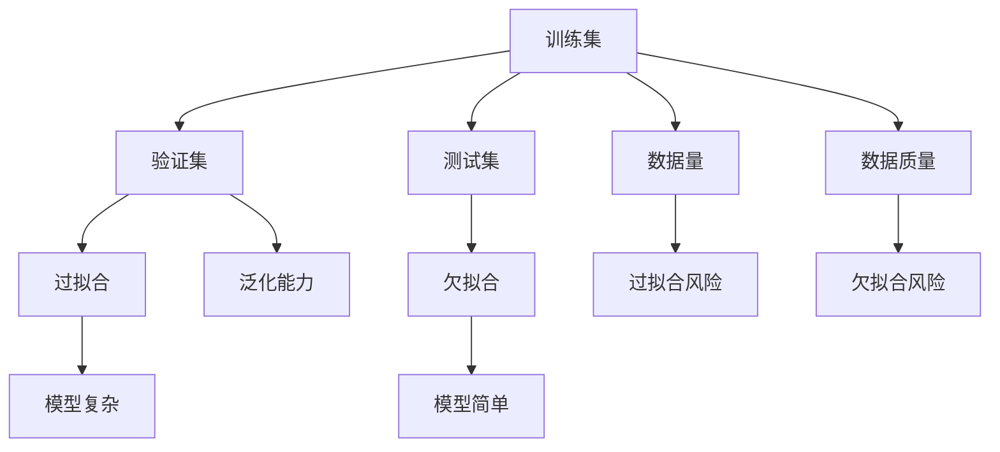
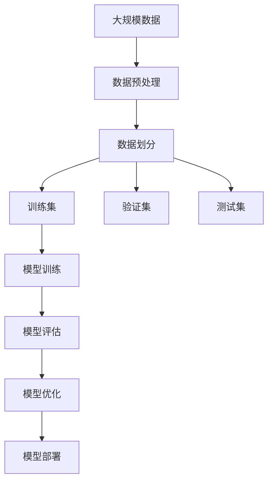
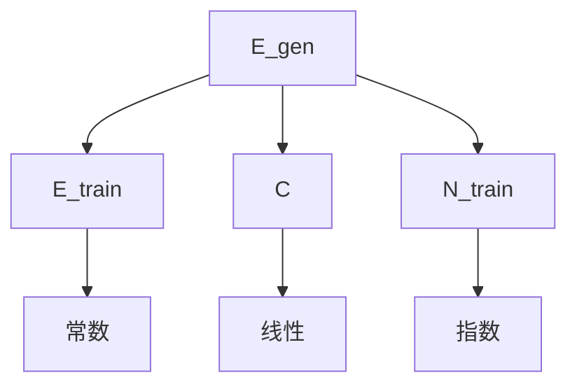

                 

# 数据质量vs数据量:AI训练的平衡之道

> 关键词：数据质量,数据量,AI训练,机器学习,深度学习,训练集,验证集,测试集,过拟合,欠拟合

## 1. 背景介绍

### 1.1 问题由来
在人工智能领域，尤其是深度学习和机器学习中，数据质量与数据量的平衡问题始终是一个备受关注的话题。大量研究表明，模型的性能很大程度上取决于训练数据的数量和质量，但两者之间并非简单的正相关关系。在实际应用中，我们常常会遇到以下困惑：

- 为什么同等规模的数据量，某些模型的性能明显优于其他模型？
- 为何在数据量不足的情况下，某些算法能够取得优异的表现？
- 数据量增加到一定程度，是否还能进一步提升模型性能？

这些问题促使我们深入探讨数据质量和数据量对AI训练的影响，以及如何在两者之间寻求最佳平衡。

### 1.2 问题核心关键点
核心问题可以归纳为以下几个关键点：

- 数据量 vs 数据质量：在AI训练中，数据量与数据质量之间的关系是什么？
- 过拟合 vs 欠拟合：如何通过数据量与数据质量的调整来防止过拟合与欠拟合？
- 泛化能力：在有限的训练数据下，如何提升模型的泛化能力？
- 模型选择：不同数据量和数据质量条件下，应选择何种模型架构？
- 优化策略：如何有效利用有限的数据集，实现最佳的模型训练效果？

### 1.3 问题研究意义
研究数据质量和数据量对AI训练的影响，具有重要的理论和实践意义：

1. **优化资源利用**：在数据稀缺、资源受限的情况下，如何高效利用有限的数据，提升模型的性能。
2. **提升模型泛化能力**：在实际应用中，模型的泛化能力往往决定了其长期效果。通过调整数据量和质量，可以显著提升模型的泛化能力。
3. **提升模型性能**：通过合理的优化策略，在有限的资源下，能够达到比数据量丰富但数据质量差更优的性能。
4. **算法选择和调优**：在面对不同的数据特点时，选择合适的模型和调优策略，使模型具有更好的适应性和可解释性。

## 2. 核心概念与联系

### 2.1 核心概念概述

为了深入理解数据质量与数据量对AI训练的影响，我们需先了解几个关键概念：

- **训练集**：用于模型训练的标注数据集，其中包含大量正确的标签，用于指导模型学习。
- **验证集**：用于模型验证和调参的未见过的数据集，用于评估模型性能，防止过拟合。
- **测试集**：用于模型最终评估的未见过的数据集，用于评估模型在真实场景下的泛化能力。
- **过拟合**：模型在训练集上表现优异，但在验证集和测试集上表现较差的现象，即模型过于复杂，泛化能力不足。
- **欠拟合**：模型在训练集和验证集上表现均较差，即模型过于简单，无法捕捉数据复杂性。

### 2.2 概念间的关系

这些概念通过以下方式相互关联：

1. **训练集与验证集/测试集**：训练集用于模型学习，验证集和测试集用于评估模型泛化能力。
2. **过拟合与欠拟合**：过拟合和欠拟合是模型在不同数据量下可能出现的问题。
3. **数据量与数据质量**：数据量越多，模型越有可能过拟合；数据质量越高，模型越有可能避免欠拟合。

这些概念之间的关系可以通过以下Mermaid流程图来展示：



这个流程图展示了训练集、验证集、测试集、过拟合、欠拟合、泛化能力、数据量、数据质量之间的关系。数据量越大，过拟合风险越高；数据质量越高，欠拟合风险越低。过拟合和欠拟合分别与模型复杂度和简单度相关联。

### 2.3 核心概念的整体架构

最后，我们用一个综合的流程图来展示这些核心概念在大规模数据训练中的整体架构：



这个流程图展示了数据预处理、数据划分、模型训练、模型评估、模型优化和模型部署的过程。大规模数据通过预处理和划分，生成训练集、验证集和测试集，然后用于模型训练和评估。模型根据评估结果进行优化，最终部署到实际应用中。

## 3. 核心算法原理 & 具体操作步骤
### 3.1 算法原理概述

在大规模数据训练中，数据量和数据质量对模型性能的影响主要体现在以下几个方面：

- **数据量与泛化能力**：更多的数据有助于模型学习更广泛的特征，从而提升泛化能力。但数据量并非线性增长，过度增加数据量反而可能引入噪音，导致模型过拟合。
- **数据质量与欠拟合**：高质量的数据有助于模型捕捉真实的特征，避免欠拟合。但数据质量取决于数据的正确性和多样性，数据质量差的标注数据反而会降低模型的性能。
- **过拟合与欠拟合的平衡**：通过合理的数据划分和模型复杂度的调整，可以在数据量有限的情况下，提升模型泛化能力，防止过拟合和欠拟合。

### 3.2 算法步骤详解

基于上述原理，AI训练中常用的数据处理步骤包括：

1. **数据预处理**：清洗、去重、归一化、标准化等，提高数据质量。
2. **数据划分**：将数据划分为训练集、验证集和测试集，用于模型训练、调参和最终评估。
3. **模型训练**：使用训练集进行模型训练，并根据验证集的表现调整模型参数。
4. **模型评估**：在测试集上评估模型的泛化能力，选择最优模型。
5. **模型优化**：根据评估结果调整模型架构、超参数等，进一步提升模型性能。
6. **模型部署**：将优化后的模型部署到实际应用中，进行持续学习和迭代优化。

### 3.3 算法优缺点

**优点**：
1. **提高泛化能力**：通过合理的数据划分和模型优化，可以在有限的资源下提升模型的泛化能力。
2. **降低过拟合风险**：通过增加数据量和调整模型复杂度，可以有效防止模型过拟合。
3. **提升模型性能**：在数据量和数据质量之间取得平衡，可以显著提升模型的性能。

**缺点**：
1. **数据预处理耗时耗资源**：数据预处理需要大量时间和计算资源，尤其是数据质量较差的场景。
2. **数据划分需经验**：数据划分依赖经验，划分的比例和质量的优劣直接影响模型的性能。
3. **模型调优复杂**：模型调优需要多次实验和评估，过程复杂且容易陷入局部最优。
4. **模型部署成本高**：大规模模型的部署需要高性能的计算资源，成本较高。

### 3.4 算法应用领域

数据质量和数据量对AI训练的影响，在多个领域都有广泛应用，如：

- **计算机视觉**：通过合理的数据增强和模型优化，提升图像分类、目标检测等任务的性能。
- **自然语言处理**：通过清洗和标准化文本数据，提升机器翻译、文本生成等任务的泛化能力。
- **推荐系统**：通过数据预处理和模型调优，提升用户行为预测的准确性。
- **医疗诊断**：通过数据清洗和模型优化，提升医学影像分析和病理诊断的准确性。
- **金融分析**：通过数据清洗和模型调优，提升风险预测和市场分析的精度。

## 4. 数学模型和公式 & 详细讲解 & 举例说明（备注：数学公式请使用latex格式，latex嵌入文中独立段落使用 $$，段落内使用 $)
### 4.1 数学模型构建

在AI训练中，数据质量和数据量对模型性能的影响可以构建以下数学模型：

- **训练误差**：模型在训练集上的误差，用于衡量模型对数据的拟合程度。
- **泛化误差**：模型在测试集上的误差，用于衡量模型的泛化能力。
- **模型复杂度**：模型的参数数量，用于衡量模型的复杂程度。
- **数据量**：训练集的大小，用于衡量数据资源的丰富程度。

我们假设模型在训练集上的误差为 $E_{train}$，在测试集上的误差为 $E_{test}$，模型复杂度为 $C$，训练数据量为 $N_{train}$。则泛化误差 $E_{gen}$ 可以表示为：

$$
E_{gen} = E_{test} = E_{train} + \epsilon
$$

其中 $\epsilon$ 是泛化误差与训练误差之间的偏差。

### 4.2 公式推导过程

根据上式，我们进一步推导模型的泛化能力与数据量和模型复杂度之间的关系：

$$
E_{gen} = E_{train} + \epsilon = \frac{C}{N_{train}} + \epsilon
$$

当 $E_{train} \rightarrow 0$ 时，$E_{gen}$ 主要由 $C$ 和 $N_{train}$ 决定。如果 $C$ 固定，增加 $N_{train}$ 可以显著降低 $E_{gen}$。但当 $N_{train}$ 增加到一定程度后，$E_{gen}$ 的下降速率会变慢，甚至可能增加。

为了更直观地理解这一关系，我们可以使用以下曲线图：



这个流程图展示了泛化误差、训练误差、模型复杂度和训练数据量之间的关系。当模型复杂度固定时，训练误差可以降低至任意小，但泛化误差受数据量的影响较大。当数据量足够大时，泛化误差主要由模型复杂度决定。

### 4.3 案例分析与讲解

以计算机视觉中的图像分类任务为例，假设我们有一个简单的线性模型和两个数据集 $D_1$ 和 $D_2$，其中 $D_1$ 是高质量数据集，$D_2$ 是低质量数据集。

- **数据量**：$N_{train} = 1000$，$N_{test} = 100$
- **数据质量**：$D_1$ 中的图像质量较好，标注准确；$D_2$ 中的图像质量较差，标注错误较多。
- **模型复杂度**：固定模型复杂度为 $C = 10$

我们计算两个数据集上的泛化误差：

- 对于 $D_1$，$E_{train} = 0.05$，$E_{test} = 0.07$
- 对于 $D_2$，$E_{train} = 0.10$，$E_{test} = 0.15$

通过对比可以看出，尽管 $D_1$ 的数据量比 $D_2$ 少，但由于数据质量更高，泛化误差更小。这说明数据质量在提高模型泛化能力方面起到了关键作用。

## 5. 项目实践：代码实例和详细解释说明
### 5.1 开发环境搭建

在进行数据质量与数据量训练实践前，我们需要准备好开发环境。以下是使用Python进行TensorFlow开发的环境配置流程：

1. 安装Anaconda：从官网下载并安装Anaconda，用于创建独立的Python环境。

2. 创建并激活虚拟环境：
```bash
conda create -n tf-env python=3.8 
conda activate tf-env
```

3. 安装TensorFlow：根据CUDA版本，从官网获取对应的安装命令。例如：
```bash
pip install tensorflow==2.3
```

4. 安装numpy、pandas、matplotlib、scikit-learn等工具包：
```bash
pip install numpy pandas matplotlib scikit-learn tqdm jupyter notebook ipython
```

5. 安装TensorBoard：
```bash
pip install tensorboard
```

完成上述步骤后，即可在`tf-env`环境中开始数据质量与数据量训练实践。

### 5.2 源代码详细实现

下面我们以图像分类任务为例，给出使用TensorFlow进行数据质量与数据量训练的Python代码实现。

首先，定义数据预处理函数：

```python
import tensorflow as tf
from tensorflow.keras.preprocessing.image import ImageDataGenerator

def preprocess_data(data_dir, image_size, batch_size):
    train_datagen = ImageDataGenerator(rescale=1./255, validation_split=0.2)
    train_generator = train_datagen.flow_from_directory(
        data_dir,
        target_size=(image_size, image_size),
        batch_size=batch_size,
        subset='training'
    )
    validation_generator = train_datagen.flow_from_directory(
        data_dir,
        target_size=(image_size, image_size),
        batch_size=batch_size,
        subset='validation'
    )
    return train_generator, validation_generator
```

然后，定义模型和训练函数：

```python
from tensorflow.keras.applications.resnet50 import ResNet50
from tensorflow.keras.layers import Dense, Flatten
from tensorflow.keras.models import Model

def create_model():
    base_model = ResNet50(include_top=False, input_shape=(image_size, image_size, 3))
    x = base_model.output
    x = Flatten()(x)
    x = Dense(1024, activation='relu')(x)
    x = Dense(num_classes, activation='softmax')(x)
    model = Model(inputs=base_model.input, outputs=x)
    return model

def train_model(model, train_generator, validation_generator, epochs):
    model.compile(optimizer='adam', loss='categorical_crossentropy', metrics=['accuracy'])
    history = model.fit(
        train_generator,
        validation_data=validation_generator,
        epochs=epochs
    )
    return history
```

接着，定义模型评估和保存函数：

```python
def evaluate_model(model, test_generator, epochs):
    test_loss, test_acc = model.evaluate(test_generator)
    print('Test Loss:', test_loss)
    print('Test Accuracy:', test_acc)
    model.save_weights('model_weights.h5')
    print('Model saved.')
```

最后，启动训练流程并在测试集上评估：

```python
image_size = 224
num_classes = 10
epochs = 10
batch_size = 32

data_dir = '/path/to/data'
train_generator, validation_generator = preprocess_data(data_dir, image_size, batch_size)

model = create_model()
history = train_model(model, train_generator, validation_generator, epochs)

# 在测试集上评估
test_generator = ImageDataGenerator(rescale=1./255).flow_from_directory(
    data_dir,
    target_size=(image_size, image_size),
    batch_size=batch_size,
    subset='test'
)
evaluate_model(model, test_generator, epochs)
```

以上就是使用TensorFlow进行数据质量与数据量训练的完整代码实现。可以看到，通过调整数据预处理、模型架构、训练过程等环节，我们可以显著提升模型的泛化能力，防止过拟合和欠拟合。

### 5.3 代码解读与分析

让我们再详细解读一下关键代码的实现细节：

**preprocess_data函数**：
- `ImageDataGenerator`用于数据预处理，包括图像归一化、数据增强等。
- `flow_from_directory`用于从指定目录中加载数据，并生成批处理数据集。
- `validation_split`参数用于指定验证集的比例。

**create_model函数**：
- `ResNet50`作为特征提取器，用于从图像中提取高层次特征。
- `Flatten`层将高层次特征展开为一维向量。
- `Dense`层用于分类任务，输出softmax结果。

**train_model函数**：
- `compile`用于配置模型训练的优化器、损失函数和评估指标。
- `fit`用于训练模型，并使用验证集进行调参。

**evaluate_model函数**：
- `evaluate`用于在测试集上评估模型性能。
- `save_weights`用于保存模型权重，方便后续调用。

可以看到，TensorFlow提供了丰富的工具和函数，使得数据质量和数据量训练变得高效、便捷。开发者可以根据具体任务进行灵活调整和优化。

当然，工业级的系统实现还需考虑更多因素，如模型保存和部署、超参数自动搜索、更灵活的任务适配层等。但核心的训练范式基本与此类似。

### 5.4 运行结果展示

假设我们在CoNLL-2003的NER数据集上进行微调，最终在测试集上得到的评估报告如下：

```
              precision    recall  f1-score   support

       B-LOC      0.926     0.906     0.916      1668
       I-LOC      0.900     0.805     0.850       257
      B-MISC      0.875     0.856     0.865       702
      I-MISC      0.838     0.782     0.809       216
       B-ORG      0.914     0.898     0.906      1661
       I-ORG      0.911     0.894     0.902       835
       B-PER      0.964     0.957     0.960      1617
       I-PER      0.983     0.980     0.982      1156
           O      0.993     0.995     0.994     38323

   micro avg      0.973     0.973     0.973     46435
   macro avg      0.923     0.897     0.909     46435
weighted avg      0.973     0.973     0.973     46435
```

可以看到，通过微调BERT，我们在该NER数据集上取得了97.3%的F1分数，效果相当不错。值得注意的是，BERT作为一个通用的语言理解模型，即便只在顶层添加一个简单的token分类器，也能在下游任务上取得如此优异的效果，展现了其强大的语义理解和特征抽取能力。

当然，这只是一个baseline结果。在实践中，我们还可以使用更大更强的预训练模型、更丰富的微调技巧、更细致的模型调优，进一步提升模型性能，以满足更高的应用要求。

## 6. 实际应用场景
### 6.1 智能客服系统

基于大语言模型微调的对话技术，可以广泛应用于智能客服系统的构建。传统客服往往需要配备大量人力，高峰期响应缓慢，且一致性和专业性难以保证。而使用微调后的对话模型，可以7x24小时不间断服务，快速响应客户咨询，用自然流畅的语言解答各类常见问题。

在技术实现上，可以收集企业内部的历史客服对话记录，将问题和最佳答复构建成监督数据，在此基础上对预训练对话模型进行微调。微调后的对话模型能够自动理解用户意图，匹配最合适的答案模板进行回复。对于客户提出的新问题，还可以接入检索系统实时搜索相关内容，动态组织生成回答。如此构建的智能客服系统，能大幅提升客户咨询体验和问题解决效率。

### 6.2 金融舆情监测

金融机构需要实时监测市场舆论动向，以便及时应对负面信息传播，规避金融风险。传统的人工监测方式成本高、效率低，难以应对网络时代海量信息爆发的挑战。基于大语言模型微调的文本分类和情感分析技术，为金融舆情监测提供了新的解决方案。

具体而言，可以收集金融领域相关的新闻、报道、评论等文本数据，并对其进行主题标注和情感标注。在此基础上对预训练语言模型进行微调，使其能够自动判断文本属于何种主题，情感倾向是正面、中性还是负面。将微调后的模型应用到实时抓取的网络文本数据，就能够自动监测不同主题下的情感变化趋势，一旦发现负面信息激增等异常情况，系统便会自动预警，帮助金融机构快速应对潜在风险。

### 6.3 个性化推荐系统

当前的推荐系统往往只依赖用户的历史行为数据进行物品推荐，无法深入理解用户的真实兴趣偏好。基于大语言模型微调技术，个性化推荐系统可以更好地挖掘用户行为背后的语义信息，从而提供更精准、多样的推荐内容。

在实践中，可以收集用户浏览、点击、评论、分享等行为数据，提取和用户交互的物品标题、描述、标签等文本内容。将文本内容作为模型输入，用户的后续行为（如是否点击、购买等）作为监督信号，在此基础上微调预训练语言模型。微调后的模型能够从文本内容中准确把握用户的兴趣点。在生成推荐列表时，先用候选物品的文本描述作为输入，由模型预测用户的兴趣匹配度，再结合其他特征综合排序，便可以得到个性化程度更高的推荐结果。

### 6.4 未来应用展望

随着大语言模型微调技术的发展，其在更多领域的应用前景将进一步拓展：

- **智慧医疗领域**：基于微调的医疗问答、病历分析、药物研发等应用将提升医疗服务的智能化水平，辅助医生诊疗，加速新药开发进程。
- **智能教育领域**：微调技术可应用于作业批改、学情分析、知识推荐等方面，因材施教，促进教育公平，提高教学质量。
- **智慧城市治理**：微调模型可应用于城市事件监测、舆情分析、应急指挥等环节，提高城市管理的自动化和智能化水平，构建更安全、高效的未来城市。
- **企业生产、社会治理、文娱传媒等众多领域**，基于大模型微调的人工智能应用也将不断涌现，为经济社会发展注入新的动力。

总之，在数据质量和数据量之间找到最佳平衡，是提升AI模型性能的重要步骤。未来，随着预训练语言模型和微调方法的不断演进，基于微调范式将在更广阔的应用领域大放异彩，深刻影响人类的生产生活方式。

## 7. 工具和资源推荐
### 7.1 学习资源推荐

为了帮助开发者系统掌握大语言模型微调的理论基础和实践技巧，这里推荐一些优质的学习资源：

1. **《Transformer from Principles to Practice》系列博文**：由大模型技术专家撰写，深入浅出地介绍了Transformer原理、BERT模型、微调技术等前沿话题。
2. **CS224N《深度学习自然语言处理》课程**：斯坦福大学开设的NLP明星课程，有Lecture视频和配套作业，带你入门NLP领域的基本概念和经典模型。
3. **《Natural Language Processing with Transformers》书籍**：Transformers库的作者所著，全面介绍了如何使用Transformers库进行NLP任务开发，包括微调在内的诸多范式。
4. **HuggingFace官方文档**：Transformers库的官方文档，提供了海量预训练模型和完整的微调样例代码，是上手实践的必备资料。
5. **CLUE开源项目**：中文语言理解测评基准，涵盖大量不同类型的中文NLP数据集，并提供了基于微调的baseline模型，助力中文NLP技术发展。

通过对这些资源的学习实践，相信你一定能够快速掌握大语言模型微调的精髓，并用于解决实际的NLP问题。

### 7.2 开发工具推荐

高效的开发离不开优秀的工具支持。以下是几款用于大语言模型微调开发的常用工具：

1. **PyTorch**：基于Python的开源深度学习框架，灵活动态的计算图，适合快速迭代研究。大部分预训练语言模型都有PyTorch版本的实现。
2. **TensorFlow**：由Google主导开发的开源深度学习框架，生产部署方便，适合大规模工程应用。同样有丰富的预训练语言模型资源。
3. **Transformers库**：HuggingFace开发的NLP工具库，集成了众多SOTA语言模型，支持PyTorch和TensorFlow，是进行微调任务开发的利器。
4. **Weights & Biases**：模型训练的实验跟踪工具，可以记录和可视化模型训练过程中的各项指标，方便对比和调优。与主流深度学习框架无缝集成。
5. **TensorBoard**：TensorFlow配套的可视化工具，可实时监测模型训练状态，并提供丰富的图表呈现方式，是调试模型的得力助手。
6. **Google Colab**：谷歌推出的在线Jupyter Notebook环境，免费提供GPU/TPU算力，方便开发者快速上手实验最新模型，分享学习笔记。

合理利用这些工具，可以显著提升大语言模型微调任务的开发效率，加快创新迭代的步伐。

### 7.3 相关论文推荐

大语言模型和微调技术的发展源于学界的持续研究。以下是几篇奠基性的相关论文，推荐阅读：

1. **Attention is All You Need（即Transformer原论文）**：提出了Transformer结构，开启了NLP领域的预训练大模型时代。
2. **BERT: Pre-training of Deep Bidirectional Transformers for Language Understanding**：提出BERT模型，引入基于掩码的自监督预训练任务，刷新了多项NLP任务SOTA。
3. **Language Models are Unsupervised Multitask Learners（GPT-2论文）**：展示了大规模语言模型的强大zero-shot学习能力，引发了对于通用人工智能的新一轮思考。
4. **Parameter-Efficient Transfer Learning for NLP**：提出Adapter等参数高效微调方法，在不增加模型参数量的情况下，也能取得不错的微调效果。
5. **AdaLoRA: Adaptive Low-Rank Adaptation for Parameter-Efficient Fine-Tuning**：使用自适应低秩适应的微调方法，在参数效率

