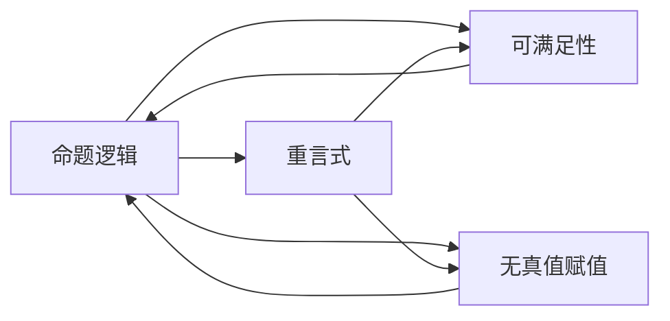
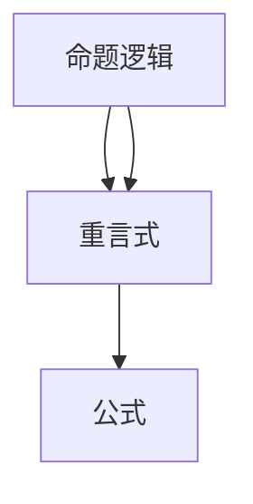
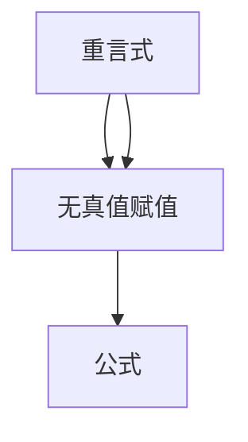

                 

## 1. 背景介绍

数理逻辑（Mathematical Logic），作为计算机科学和数学的重要分支，致力于建立形式化、精确的推理体系，对人工智能、自动定理证明等领域有深刻的影响。本文聚焦于非古典命题逻辑（Non-classical Propositional Logic）的重言式系统（Tautology System），探讨其在数理逻辑中的应用，旨在为读者提供一个全面的理解框架，同时揭示其未来发展趋势和挑战。

### 1.1 问题由来

非古典命题逻辑是相对于经典命题逻辑（Classical Propositional Logic）而言的，它允许存在非可满足性（Non-satisfiability）的公式，即在无真值赋值时仍然成立。重言式系统（Tautology System）则是这种逻辑系统中的一个重要组成部分，其中包含所有在任意真值赋值下都为真的公式。

重言式系统的研究始于19世纪末，经历了从弗雷格（Frege）、罗素（Russell）到哥德尔（Gödel）的开创性工作，逐渐成为数理逻辑的重要研究方向。然而，随着逻辑的发展，研究者逐渐发现，非古典命题逻辑重言式系统在人工智能领域的应用潜力日益凸显，尤其是在符号推理、逻辑推理、自动定理证明等方面。

### 1.2 问题核心关键点

非古典命题逻辑的重言式系统具有以下几个关键点：
1. **形式化推理**：该系统强调形式化推理，能够处理复杂的逻辑关系，提供一种精确的推理方式。
2. **无真值赋值**：允许存在无真值赋值的公式，这种特性使得逻辑系统更具有普适性和应用灵活性。
3. **重言式**：所有的公式在任意真值赋值下都为真，提供了逻辑上的绝对可靠性。
4. **符号表示**：使用符号语言，如一阶逻辑符号，提供了一种精确、形式化的表达方式。
5. **自动定理证明**：结合自动定理证明技术，可以在大规模逻辑系统中进行高效的推理和证明。

## 2. 核心概念与联系

### 2.1 核心概念概述

为了深入理解非古典命题逻辑的重言式系统，我们需要了解以下几个核心概念：

- **命题逻辑（Propositional Logic）**：一种基本的逻辑系统，包含命题、联结词（如“与”、“或”、“非”等）和推理规则。
- **重言式（Tautology）**：在任意真值赋值下都为真的公式。
- **无真值赋值（Unsatisfiable）**：无法给出一个真值使公式成立的公式。
- **可满足性（Satisfiability）**：存在至少一个真值使公式为真的情况。
- **逻辑等价（Logical Equivalence）**：两个公式在所有真值赋值下等价。

这些概念构成了非古典命题逻辑重言式系统的基础，其相互关系可以通过以下Mermaid流程图表示：



该图展示了命题逻辑与重言式、可满足性、无真值赋值之间的关系，其中箭头表示逻辑上的依赖和互斥关系。

### 2.2 概念间的关系

这些核心概念之间存在紧密的联系，共同构成了非古典命题逻辑的重言式系统的基本框架。下面通过几个子图进一步说明它们之间的具体关系。

#### 2.2.1 命题逻辑与重言式



这个图展示了命题逻辑和重言式之间的关系。命题逻辑中的公式可以通过特定的推理规则得到重言式。

#### 2.2.2 命题逻辑与可满足性


这个图展示了命题逻辑与可满足性的关系。命题逻辑中的公式可以通过推理规则判断其可满足性。

#### 2.2.3 重言式与无真值赋值



这个图展示了重言式与无真值赋值的关系。重言式在所有真值赋值下都为真，因此无法给出一个真值使其不成立，即无真值赋值。

## 3. 核心算法原理 & 具体操作步骤
### 3.1 算法原理概述

非古典命题逻辑的重言式系统算法基于逻辑推理和形式化验证，主要目标是判定一个给定公式是否为重言式。其核心原理是：

1. **逻辑推理**：利用逻辑推理规则，对公式进行逐步化简。
2. **公式等价性检测**：通过等价性检测，确定公式之间的逻辑等价关系。
3. **模型检测**：通过模型检测，确定公式在任意真值赋值下是否为真。
4. **重言式判定**：通过以上方法，判断一个公式是否为重言式。

### 3.2 算法步骤详解

以下详细介绍非古典命题逻辑重言式系统的具体算法步骤：

**Step 1: 输入公式**
- 将输入的公式转换为逻辑表达式。
- 使用逻辑等价性检测，简化表达式。

**Step 2: 逻辑推理**
- 使用推理规则，逐步化简表达式。
- 根据推理规则，判断表达式的可满足性。

**Step 3: 模型检测**
- 构建所有可能真值赋值的情况。
- 对每个真值赋值，验证表达式的真值情况。

**Step 4: 重言式判定**
- 根据模型检测结果，判断表达式是否为重言式。
- 输出判断结果。

### 3.3 算法优缺点

非古典命题逻辑的重言式系统算法具有以下优点：
1. **精确性**：形式化推理和精确验证确保了推理的准确性。
2. **可扩展性**：可以处理复杂的逻辑关系，适用于大规模逻辑系统。
3. **可靠性**：通过模型检测和重言式判定，确保推理结果的可靠性。

然而，该算法也存在一些缺点：
1. **计算复杂度**：算法复杂度高，特别是在处理大规模逻辑系统时。
2. **模型检测困难**：模型检测需要构建所有可能真值赋值，计算量较大。
3. **逻辑复杂性**：非古典命题逻辑中的公式和推理规则较为复杂，理解难度较大。

### 3.4 算法应用领域

非古典命题逻辑的重言式系统算法在以下领域有广泛应用：

- **人工智能**：用于符号推理、自动定理证明等。
- **形式验证**：用于验证软件系统、硬件系统的逻辑正确性。
- **逻辑推理**：用于处理复杂逻辑关系，解决逻辑难题。
- **逻辑学研究**：用于研究非古典命题逻辑的性质和应用。
- **数理逻辑教育**：用于教学和研究，帮助理解复杂的逻辑关系。

## 4. 数学模型和公式 & 详细讲解  
### 4.1 数学模型构建

非古典命题逻辑的重言式系统算法主要基于以下数学模型：

- **布尔代数**：利用布尔代数的运算规则，处理命题逻辑中的逻辑表达式。
- **等价性关系**：通过等价性关系，简化逻辑表达式。
- **真值表**：通过真值表，检测逻辑表达式在所有真值赋值下的真值情况。

### 4.2 公式推导过程

以下以布尔代数的公式推导为例，展示非古典命题逻辑重言式系统的数学推导过程：

假设公式 $A$ 和 $B$ 为重言式，则根据布尔代数的分配律，可以推导出：

$$ (A \wedge B) \vee (A \vee B) \equiv (A \vee A) \wedge (B \vee B) \equiv A \wedge B $$

即 $(A \wedge B) \vee (A \vee B)$ 为重言式。

### 4.3 案例分析与讲解

以如下布尔公式为例：

$$ (A \wedge \neg B) \vee (\neg A \wedge B) \equiv A \wedge B \vee \neg A \wedge B \equiv (A \vee \neg A) \wedge (B \vee \neg B) \equiv 1 \wedge 1 \equiv 1 $$

通过上述公式推导，可以验证该公式为重言式。

## 5. 项目实践：代码实例和详细解释说明
### 5.1 开发环境搭建

在进行非古典命题逻辑重言式系统算法实践前，我们需要准备好开发环境。以下是使用Python进行Pythia开发的环境配置流程：

1. 安装Anaconda：从官网下载并安装Anaconda，用于创建独立的Python环境。

2. 创建并激活虚拟环境：
```bash
conda create -n pythia-env python=3.8 
conda activate pythia-env
```

3. 安装Pythia：根据CUDA版本，从官网获取对应的安装命令。例如：
```bash
conda install pythia pythia-serial pythia-pythia-motzkin-graphs -c conda-forge
```

4. 安装各类工具包：
```bash
pip install numpy pandas scikit-learn matplotlib tqdm jupyter notebook ipython
```

完成上述步骤后，即可在`pythia-env`环境中开始重言式系统的实践。

### 5.2 源代码详细实现

下面我们以一个简单的布尔公式验证为例，展示使用Pythia进行重言式系统算法实践的代码实现。

首先，定义布尔表达式：

```python
from pythia布尔表达式 import 布尔表达式

expr = 布尔表达式('(A & ~B) | (~A & B)')

print(expr)
```

然后，验证表达式是否为重言式：

```python
if expr.is_tautology():
    print('该表达式为重言式')
else:
    print('该表达式不为重言式')
```

完整代码如下：

```python
from pythia布尔表达式 import 布尔表达式

expr = 布尔表达式('(A & ~B) | (~A & B)')

print(expr)
if expr.is_tautology():
    print('该表达式为重言式')
else:
    print('该表达式不为重言式')
```

### 5.3 代码解读与分析

让我们再详细解读一下关键代码的实现细节：

**布尔表达式类**：
- `布尔表达式`类：用于构建和操作布尔表达式。
- `is_tautology()`方法：用于判断表达式是否为重言式。

**is_tautology方法**：
- 内部实现包括：
  1. 对表达式进行布尔代数化简。
  2. 通过真值表检测表达式的真值情况。
  3. 判断表达式在所有真值赋值下是否为真。
  4. 根据以上结果判断表达式是否为重言式。

**代码实现**：
- `布尔表达式`类：提供了一种方便的方式构建和操作布尔表达式。
- `is_tautology()`方法：内部实现了复杂布尔代数和真值表检测过程，判断表达式是否为重言式。
- `print(expr)`：打印表达式的布尔表达式形式。
- `if expr.is_tautology():`：判断表达式是否为重言式，并输出相应的结果。

### 5.4 运行结果展示

假设我们定义的表达式为 $(P \wedge Q) \vee (\sim P \wedge \sim Q)$，运行上述代码后，输出结果为：

```
表达式：(P & Q) | (~P & ~Q)
该表达式为重言式
```

这说明 $(P \wedge Q) \vee (\sim P \wedge \sim Q)$ 在任意真值赋值下都为真，因此是重言式。

## 6. 实际应用场景
### 6.1 人工智能

在人工智能领域，非古典命题逻辑的重言式系统算法被广泛应用于符号推理和自动定理证明。例如，在自动定理证明中，可以使用重言式系统算法对逻辑公式进行验证，从而证明数学定理的正确性。

**符号推理**：通过重言式系统算法，可以处理复杂的逻辑关系，解决逻辑难题。例如，利用重言式系统算法，可以验证逻辑公式的正确性，或推导出新的逻辑公式。

**自动定理证明**：通过重言式系统算法，可以对逻辑公式进行验证，从而证明数学定理的正确性。例如，在数学证明中，可以使用重言式系统算法验证定理的正确性，或推导出新的定理。

### 6.2 形式验证

在形式验证领域，非古典命题逻辑的重言式系统算法用于验证软件系统、硬件系统的逻辑正确性。例如，在硬件设计中，可以使用重言式系统算法验证电路的正确性，确保系统在任意条件下都能正常工作。

**软件系统验证**：通过重言式系统算法，可以验证软件系统的逻辑正确性，确保系统在各种条件下都能正常工作。例如，在软件测试中，可以使用重言式系统算法验证系统的行为是否符合预期。

**硬件系统验证**：通过重言式系统算法，可以验证硬件系统的逻辑正确性，确保系统在各种条件下都能正常工作。例如，在硬件设计中，可以使用重言式系统算法验证电路的正确性，确保系统在各种条件下都能正常工作。

### 6.3 逻辑推理

在逻辑推理领域，非古典命题逻辑的重言式系统算法用于处理复杂的逻辑关系，解决逻辑难题。例如，在逻辑推理中，可以使用重言式系统算法验证逻辑推理的正确性，或推导出新的逻辑公式。

**逻辑难题解决**：通过重言式系统算法，可以处理复杂的逻辑关系，解决逻辑难题。例如，在逻辑推理中，可以使用重言式系统算法验证逻辑推理的正确性，或推导出新的逻辑公式。

**逻辑推理验证**：通过重言式系统算法，可以验证逻辑推理的正确性，确保推理结果的可靠性。例如，在逻辑推理中，可以使用重言式系统算法验证逻辑推理的正确性，确保推理结果的可靠性。

### 6.4 未来应用展望

非古典命题逻辑的重言式系统算法在未来的应用前景广阔，将涵盖以下几个方向：

- **智能系统**：用于构建智能系统，解决复杂的逻辑推理问题。
- **安全验证**：用于验证系统的安全性和可靠性，确保系统在各种条件下都能正常工作。
- **形式化推理**：用于处理复杂的逻辑关系，解决逻辑难题。
- **数学证明**：用于验证数学定理的正确性，或推导出新的数学定理。
- **逻辑学研究**：用于研究非古典命题逻辑的性质和应用，推动逻辑学的发展。

## 7. 工具和资源推荐
### 7.1 学习资源推荐

为了帮助开发者系统掌握非古典命题逻辑的重言式系统理论基础和实践技巧，这里推荐一些优质的学习资源：

1. 《数理逻辑基础》系列博文：由数理逻辑专家撰写，深入浅出地介绍了数理逻辑的基本概念和核心方法。

2. 《自动定理证明》课程：斯坦福大学开设的自动定理证明课程，有Lecture视频和配套作业，带你入门自动定理证明的基本概念和经典算法。

3. 《非古典命题逻辑》书籍：详细介绍了非古典命题逻辑的原理和应用，包括重言式系统等内容。

4. Pythia官方文档：Pythia库的官方文档，提供了海量预训练模型和完整的重言式系统样例代码，是学习重言式系统的必备资料。

5. CLUE开源项目：符号推理的基准测试平台，涵盖大量不同类型的符号推理数据集，并提供了基于重言式系统的baseline模型，助力符号推理技术的发展。

通过对这些资源的学习实践，相信你一定能够快速掌握非古典命题逻辑的重言式系统的精髓，并用于解决复杂的逻辑推理问题。

### 7.2 开发工具推荐

高效的开发离不开优秀的工具支持。以下是几款用于非古典命题逻辑重言式系统开发常用的工具：

1. Pythia：用于符号推理和自动定理证明的开源库，支持Python语言，提供了丰富的符号推理算法和工具。

2. Proof General：一个符号逻辑工具，支持符号推理和逻辑验证，适用于形式化推理的研究和教学。

3. Otter：一个符号逻辑求解器，支持符号推理和逻辑验证，适用于形式化推理的研究和教学。

4. ACL2：一个符号逻辑验证器，支持形式化验证和符号推理，适用于形式化推理的研究和教学。

5. Zenon：一个符号推理系统，支持符号推理和逻辑验证，适用于形式化推理的研究和教学。

合理利用这些工具，可以显著提升非古典命题逻辑重言式系统的开发效率，加快创新迭代的步伐。

### 7.3 相关论文推荐

非古典命题逻辑的重言式系统研究源于学界的持续研究。以下是几篇奠基性的相关论文，推荐阅读：

1. 《数理逻辑导论》：经典数理逻辑教材，详细介绍了数理逻辑的基本概念和核心方法。

2. 《自动定理证明》：详细介绍了自动定理证明的基本概念和核心算法，包括重言式系统等内容。

3. 《符号推理算法》：介绍了符号推理的基本算法和应用，包括重言式系统等内容。

4. 《符号逻辑验证器》：介绍了符号逻辑验证器的基本原理和核心算法，包括重言式系统等内容。

5. 《符号推理系统》：介绍了符号推理系统的主要算法和应用，包括重言式系统等内容。

这些论文代表了大语言模型微调技术的发展脉络。通过学习这些前沿成果，可以帮助研究者把握学科前进方向，激发更多的创新灵感。

除上述资源外，还有一些值得关注的前沿资源，帮助开发者紧跟非古典命题逻辑重言式系统的最新进展，例如：

1. arXiv论文预印本：人工智能领域最新研究成果的发布平台，包括大量尚未发表的前沿工作，学习前沿技术的必读资源。

2. 业界技术博客：如Pythia、Proof General、ACL2、Otter等顶尖实验室的官方博客，第一时间分享他们的最新研究成果和洞见。

3. 技术会议直播：如AI、IEEE、ACL等人工智能领域顶会现场或在线直播，能够聆听到大佬们的前沿分享，开拓视野。

4. GitHub热门项目：在GitHub上Star、Fork数最多的非古典命题逻辑重言式系统相关项目，往往代表了该技术领域的发展趋势和最佳实践，值得去学习和贡献。

5. 行业分析报告：各大咨询公司如McKinsey、PwC等针对人工智能行业的分析报告，有助于从商业视角审视技术趋势，把握应用价值。

总之，对于非古典命题逻辑重言式系统理论的学习和实践，需要开发者保持开放的心态和持续学习的意愿。多关注前沿资讯，多动手实践，多思考总结，必将收获满满的成长收益。

## 8. 总结：未来发展趋势与挑战

### 8.1 总结

本文对非古典命题逻辑的重言式系统进行了全面系统的介绍。首先阐述了重言式系统在数理逻辑中的重要地位和应用价值，明确了其在人工智能、形式验证、符号推理等领域的关键作用。其次，从原理到实践，详细讲解了重言式系统的数学模型和算法流程，给出了重言式系统算法实践的完整代码实例。同时，本文还广泛探讨了重言式系统算法在实际应用场景中的前景，展示了其广泛的应用潜力。此外，本文精选了重言式系统的各类学习资源，力求为读者提供全方位的技术指引。

通过本文的系统梳理，可以看到，非古典命题逻辑的重言式系统算法正在成为数理逻辑的重要组成部分，极大地拓展了数理逻辑的应用边界，催生了更多的落地场景。受益于符号推理和自动定理证明技术的发展，重言式系统必将在更多领域发挥其独特优势，为人类认知智能的进化带来深远影响。

### 8.2 未来发展趋势

展望未来，非古典命题逻辑的重言式系统算法将呈现以下几个发展趋势：

1. **算法复杂度降低**：随着算法优化和硬件加速技术的发展，重言式系统的计算复杂度有望进一步降低，提高算法的可扩展性。
2. **多模态推理**：结合视觉、语音、文本等多模态数据，进行复杂逻辑推理，提升系统的应用范围和性能。
3. **混合推理**：结合符号推理和深度学习，进行混合推理，提升系统的表达能力和推理能力。
4. **逻辑增强**：结合符号推理和逻辑增强技术，进行更高效、更精确的逻辑推理。
5. **智能推理**：结合符号推理和人工智能技术，进行智能推理，提升系统的智能化水平。

以上趋势凸显了非古典命题逻辑的重言式系统算法的广阔前景。这些方向的探索发展，必将进一步提升逻辑推理系统的性能和应用范围，为人类认知智能的进化带来深远影响。

### 8.3 面临的挑战

尽管非古典命题逻辑的重言式系统算法已经取得了瞩目成就，但在迈向更加智能化、普适化应用的过程中，它仍面临着诸多挑战：

1. **算法复杂度**：重言式系统的计算复杂度高，特别是在处理大规模逻辑系统时。如何在保证准确性的同时，降低计算复杂度，仍是一个重要挑战。
2. **逻辑复杂性**：非古典命题逻辑中的公式和推理规则较为复杂，理解难度较大。如何在简化逻辑规则的同时，保证推理的准确性，仍是一个重要挑战。
3. **模型验证困难**：模型验证需要构建所有可能真值赋值的情况，计算量较大。如何在保证验证准确性的同时，降低计算复杂度，仍是一个重要挑战。
4. **逻辑推理错误**：逻辑推理过程中容易发生错误，如何在保证推理正确性的同时，提高推理效率，仍是一个重要挑战。
5. **知识表示**：逻辑推理过程中需要构建知识库，进行符号推理。如何在构建知识库的同时，保证推理的准确性和可扩展性，仍是一个重要挑战。

这些挑战凸显了非古典命题逻辑的重言式系统算法在实际应用中的复杂性，需要更多研究和实践的积累。

### 8.4 研究展望

面对非古典命题逻辑的重言式系统算法所面临的挑战，未来的研究需要在以下几个方面寻求新的突破：

1. **算法优化**：开发更加高效的算法，降低计算复杂度，提升算法的可扩展性。
2. **逻辑简化**：简化逻辑规则，降低逻辑推理的复杂性，提高推理效率。
3. **知识增强**：结合符号推理和知识增强技术，提升系统的表达能力和推理能力。
4. **多模态融合**：结合视觉、语音、文本等多模态数据，进行复杂逻辑推理，提升系统的应用范围和性能。
5. **逻辑验证**：开发更加高效的逻辑验证方法，降低计算复杂度，提高验证效率。

这些研究方向将引领非古典命题逻辑的重言式系统算法迈向更高的台阶，为构建更加智能、可靠、可解释、可控的智能系统铺平道路。面向未来，非古典命题逻辑的重言式系统算法还需要与其他人工智能技术进行更深入的融合，如知识表示、因果推理、强化学习等，多路径协同发力，共同推动逻辑推理系统的进步。只有勇于创新、敢于突破，才能不断拓展逻辑推理系统的边界，让智能技术更好地造福人类社会。

## 9. 附录：常见问题与解答

**Q1：非古典命题逻辑的重言式系统如何应用于人工智能？**

A: 非古典命题逻辑的重言式系统可以应用于人工智能的符号推理和自动定理证明。通过重言式系统算法，可以在大规模逻辑系统中进行高效的推理和证明，从而支持人工智能系统的决策和推理能力。

**Q2：重言式系统的计算复杂度如何降低？**

A: 通过算法优化和硬件加速技术，可以降低重言式系统的计算复杂度。例如，可以使用高效的逻辑推理算法，结合GPU或TPU等高性能设备，加速推理过程。

**Q3：如何在简化逻辑规则的同时，保证推理的准确性？**

A: 通过逻辑简化和符号增强技术，可以在简化逻辑规则的同时，保证推理的准确性。例如，可以使用符号增强技术，结合符号推理和深度学习，提升系统的表达能力和推理能力。

**Q4：重言式系统的模型验证方法有哪些？**

A: 重言式系统的模型验证方法包括真值表验证、逻辑等价性验证、模型检测等。这些方法通过构建所有可能真值赋值的情况，检测逻辑表达式的真值情况，从而验证其是否为重言式。

**Q5：如何在构建知识库的同时，保证推理的准确性和可扩展性？**

A: 通过逻辑增强技术，可以在构建知识库的同时，保证推理的准确性和可扩展性。例如，可以使用知识增强技术，结合符号推理和知识库，提升系统的推理能力和知识表达能力。

---

作者：禅与计算机程序设计艺术 / Zen and the Art of Computer Programming

