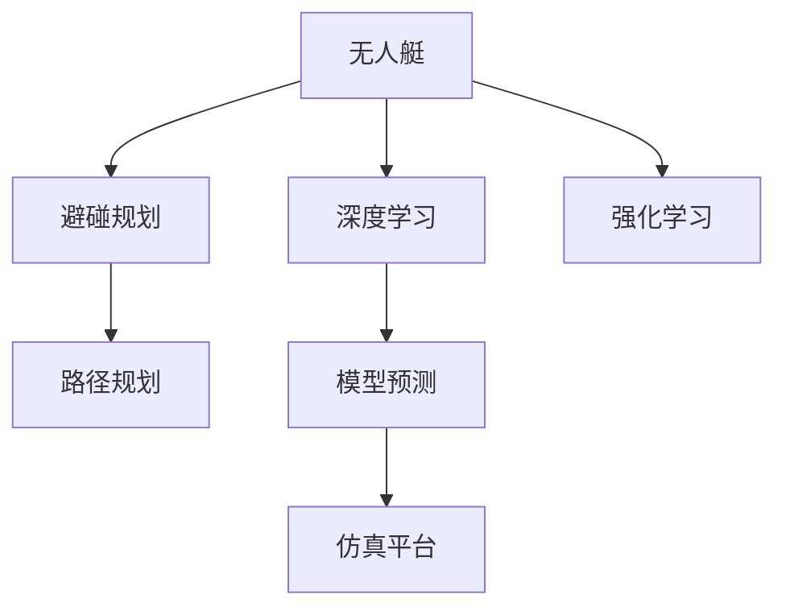
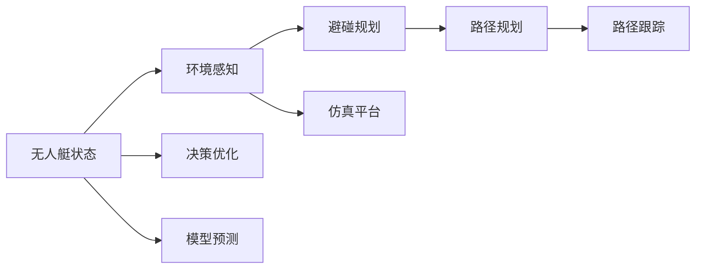
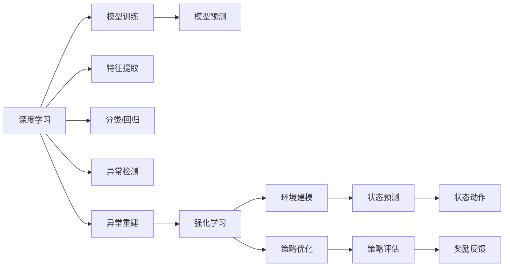

                 

# 无人艇的避碰规划原理与方法

> 关键词：无人艇,避碰规划,路径规划,深度学习,模型预测,实际应用

## 1. 背景介绍

### 1.1 问题由来
随着人工智能技术的快速发展和应用，无人船（U-boat）正在逐步替代传统船舶，用于海洋探索、环境监测、海上运输等任务。无人船在自主航行、环境感知、路径规划等方面，都需要先进的人工智能技术做支撑。其中，避碰规划是无人船最为关键的安全技术之一。

然而，传统无人船避碰算法大多基于规则或模型仿真，难以处理实际海况下的动态变化。特别是在复杂海况下，如极端天气、避障船只、浮冰带等，这些规则和模型往往难以适用，导致避碰决策失败。

近年来，深度学习在无人船避碰决策中的应用逐渐增多。深度学习模型能够学习复杂的海域环境，通过大量仿真和实际数据训练，对实际避碰场景进行预测和决策，从而提升无人船的安全性和自主性。但目前，深度学习在无人艇避碰规划方面的研究还较少，且缺乏系统性总结。

本文聚焦于深度学习在无人船避碰规划中的应用，首先介绍无人艇避碰规划的总体框架，其次通过几个典型的深度学习模型，详细阐述避碰规划的原理与方法，最后对深度学习在避碰规划中的实际应用进行展望。

## 2. 核心概念与联系

### 2.1 核心概念概述

为更好地理解深度学习在无人艇避碰规划中的应用，本节将介绍几个密切相关的核心概念：

- 无人艇(U-boat)：指通过人工智能技术自主航行的船舶。无人艇具备自主导航、环境感知、路径规划等功能，能够在海上执行复杂任务。

- 避碰规划：指无人艇在航行过程中，根据自身状态和周围环境动态调整航向、航速，避开障碍物，确保航行安全的过程。

- 路径规划：指无人艇在避碰规划基础上，寻找一条最优路径，确保航行效率和目标可达性的过程。

- 深度学习：指基于神经网络等模型进行复杂问题解决的机器学习方法。深度学习能够学习到特征表示，在避碰规划中可以有效处理不确定性问题。

- 强化学习：指通过奖励机制训练模型，使其最大化目标函数的过程。强化学习在无人艇避碰规划中，可以探索最优避碰策略。

- 模型预测：指通过深度学习模型对未来状态进行预测，为避碰决策提供参考。

- 仿真平台：指用于无人艇避碰规划和路径规划的模拟环境。仿真平台可以用于模型训练和测试，分析避碰效果和路径效率。

这些核心概念之间的逻辑关系可以通过以下Mermaid流程图来展示：



这个流程图展示了大语言模型微调过程中各个核心概念的关系和作用：

1. 无人艇通过深度学习和强化学习获取环境信息，进行避碰规划和路径规划。
2. 深度学习模型能够预测未来状态，为避碰决策提供支持。
3. 仿真平台用于模型训练和测试，验证避碰效果。

### 2.2 概念间的关系

这些核心概念之间存在着紧密的联系，形成了无人艇避碰规划的完整生态系统。下面我们通过几个Mermaid流程图来展示这些概念之间的关系。

#### 2.2.1 无人艇的避碰规划框架



这个流程图展示了无人艇避碰规划的基本流程：

1. 无人艇状态由环境感知模块获取。
2. 避碰规划模块根据无人艇状态和环境信息，制定避碰策略。
3. 路径规划模块在避碰策略的基础上，寻找最优路径。
4. 路径跟踪模块执行避碰规划和路径规划，确保无人艇安全航行。
5. 决策优化模块根据实时反馈信息，调整避碰策略。
6. 模型预测模块通过深度学习模型，预测未来状态。
7. 仿真平台用于避碰规划和路径规划的训练和测试。

#### 2.2.2 深度学习与强化学习的区别



这个流程图展示了深度学习和强化学习的区别和联系：

1. 深度学习通过模型训练获取特征表示，用于模型预测和异常检测等任务。
2. 强化学习通过策略优化和状态动作，探索最优策略。
3. 环境建模和状态预测在强化学习中扮演重要角色，影响策略优化和奖励反馈。
4. 状态动作是深度学习和强化学习的共同目标，不同点在于如何提取和优化特征表示。

## 3. 核心算法原理 & 具体操作步骤

### 3.1 算法原理概述

无人艇避碰规划的本质是一个动态决策过程。在航行过程中，无人艇需要实时获取环境信息，通过深度学习模型或强化学习模型预测未来状态，根据当前状态和预测结果进行避碰决策和路径规划。

基于深度学习模型和强化学习的避碰规划流程大致分为以下几个步骤：

1. 环境感知：通过摄像头、雷达、声呐等传感器获取无人艇周围环境信息。
2. 避碰规划：根据环境信息和无人艇当前状态，使用深度学习模型或强化学习模型预测未来状态。
3. 路径规划：根据避碰规划结果和无人艇目标位置，使用路径规划算法寻找最优路径。
4. 路径跟踪：根据路径规划结果和无人艇当前状态，执行避碰决策和路径跟踪。
5. 反馈优化：根据实时反馈信息，调整避碰策略和路径规划，优化避碰效果。

### 3.2 算法步骤详解

#### 3.2.1 环境感知

无人艇的环境感知模块通常由摄像头、雷达、声呐等传感器构成，用于获取无人艇周围的环境信息。传感器数据经过预处理，使用卷积神经网络（CNN）等深度学习模型进行特征提取，得到环境特征向量。

#### 3.2.2 避碰规划

避碰规划模块使用深度学习模型或强化学习模型，根据无人艇当前状态和环境信息，预测未来状态。以下是两个典型的避碰规划算法：

1. 基于卷积神经网络（CNN）的避碰规划
   - 输入：无人艇当前位置、速度、航向，以及周围环境特征向量。
   - 网络结构：卷积神经网络（CNN）+ 全连接层。
   - 输出：预测的避碰动作（转向角度、减速距离等）。

2. 基于深度强化学习的避碰规划
   - 输入：无人艇当前位置、速度、航向，以及周围环境状态。
   - 环境建模：使用模拟仿真平台构建环境模型，包括障碍物、海流、风速等。
   - 策略优化：使用深度强化学习模型，通过策略优化和状态动作，探索最优避碰策略。

#### 3.2.3 路径规划

路径规划模块在避碰规划结果的基础上，使用A*算法、RRT算法等路径规划算法，寻找一条最优路径，确保无人艇安全航行。

#### 3.2.4 路径跟踪

路径跟踪模块根据路径规划结果和无人艇当前状态，执行避碰决策和路径跟踪。使用PID控制器等控制算法，调整无人艇的航向、航速，确保路径执行效果。

#### 3.2.5 反馈优化

反馈优化模块根据实时反馈信息，调整避碰策略和路径规划，优化避碰效果。使用强化学习算法，动态调整无人艇行为和路径，确保实时避碰决策和路径规划的准确性。

### 3.3 算法优缺点

基于深度学习和强化学习的避碰规划方法具有以下优点：

- 能够处理复杂海况下的动态变化，提高避碰决策的鲁棒性。
- 能够实时感知环境信息，快速做出避碰决策，提升无人艇的安全性。
- 能够利用深度学习模型的特征提取能力，提高路径规划的精度和效率。

但同时，这些方法也存在一些缺点：

- 需要大量数据进行训练，数据获取成本较高。
- 模型复杂度较高，计算资源需求较大。
- 难以处理大规模的动态避障场景，模型泛化能力有限。

### 3.4 算法应用领域

基于深度学习和强化学习的避碰规划方法，已经在无人艇避碰规划、智能交通、自动驾驶等多个领域得到了应用。以下是几个典型的应用场景：

1. 无人艇避碰规划：无人艇在复杂海况下进行自主避障，如避开浮冰带、检测潜航器等。
2. 智能交通：无人驾驶车辆在复杂路况下进行避障，如避开行人、车辆、障碍物等。
3. 自动驾驶：自动驾驶车辆在复杂道路环境中进行避障，如避开行人、车辆、障碍物等。
4. 无人机避障：无人机在复杂空域环境中进行避障，如避开建筑物、电线杆等。

## 4. 数学模型和公式 & 详细讲解

### 4.1 数学模型构建

无人艇避碰规划的数学模型可以分解为以下几个部分：

- 环境感知模型：用于获取无人艇周围环境信息，输出环境特征向量。
- 避碰规划模型：用于预测未来状态，输出避碰动作。
- 路径规划模型：用于寻找最优路径，输出路径规划结果。
- 路径跟踪模型：用于执行避碰决策和路径跟踪，输出航向、航速等控制参数。
- 反馈优化模型：用于动态调整避碰策略，输出优化参数。

### 4.2 公式推导过程

#### 4.2.1 环境感知模型

假设无人艇的当前位置为 $(x_0, y_0)$，速度为 $v_0$，航向为 $\theta_0$，周围环境特征向量为 $E$。环境感知模型的输入为 $(x_0, y_0, v_0, \theta_0, E)$，输出为环境特征向量 $E'$。

环境感知模型可以使用卷积神经网络（CNN）进行特征提取，公式如下：

$$
E' = CNN(x_0, y_0, v_0, \theta_0, E)
$$

#### 4.2.2 避碰规划模型

假设无人艇的当前位置为 $(x_0, y_0)$，速度为 $v_0$，航向为 $\theta_0$，周围环境特征向量为 $E'$，避碰规划模型的输出为避碰动作 $A$。

避碰规划模型可以使用卷积神经网络（CNN）+ 全连接层进行预测，公式如下：

$$
A = CNN(E', \theta_0) + FC(v_0)
$$

其中 $FC$ 为全连接层，用于预测避碰动作。

#### 4.2.3 路径规划模型

假设无人艇的目标位置为 $(x_t, y_t)$，当前位置为 $(x_0, y_0)$，路径规划模型的输出为路径规划结果 $P$。

路径规划模型可以使用A*算法或RRT算法进行路径规划，公式如下：

$$
P = A*(x_0, y_0, x_t, y_t)
$$

#### 4.2.4 路径跟踪模型

假设无人艇的当前位置为 $(x_t, y_t)$，速度为 $v_t$，航向为 $\theta_t$，路径跟踪模型的输出为航向 $\theta'$ 和航速 $v'$。

路径跟踪模型可以使用PID控制器进行路径跟踪，公式如下：

$$
\theta', v' = PID(x_t, y_t, P, v_t, \theta_t)
$$

#### 4.2.5 反馈优化模型

假设无人艇的当前位置为 $(x_t, y_t)$，速度为 $v_t$，航向为 $\theta_t$，周围环境特征向量为 $E'$，反馈优化模型的输出为优化参数 $P'$。

反馈优化模型可以使用深度强化学习算法进行动态优化，公式如下：

$$
P' = DRL(x_t, y_t, v_t, \theta_t, E', P)
$$

其中 $DRL$ 为深度强化学习算法，用于动态调整避碰策略和路径规划。

### 4.3 案例分析与讲解

假设无人艇需要在复杂海况下，避开浮冰带和潜航器。以下是无人艇避碰规划的详细计算过程：

1. 环境感知：通过摄像头、雷达、声呐等传感器获取无人艇周围环境信息。传感器数据经过预处理，使用卷积神经网络（CNN）进行特征提取，得到环境特征向量 $E'$。

2. 避碰规划：使用CNN+FC的深度学习模型，根据无人艇当前位置 $(x_0, y_0)$、速度 $v_0$、航向 $\theta_0$ 和环境特征向量 $E'$，预测避碰动作 $A$。例如，模型输出转向角度为 $10^\circ$，减速距离为 $100$ 米。

3. 路径规划：使用A*算法，根据无人艇当前位置 $(x_0, y_0)$ 和目标位置 $(x_t, y_t)$，寻找最优路径 $P$。例如，路径规划结果为绕过浮冰带，避开潜航器。

4. 路径跟踪：使用PID控制器，根据路径规划结果 $P$ 和无人艇当前状态 $(x_t, y_t)$，计算航向 $\theta'$ 和航速 $v'$。例如，计算出无人艇应该转向 $10^\circ$，减速到 $5$ 米/秒。

5. 反馈优化：使用深度强化学习算法，根据实时反馈信息（如避碰动作效果、路径执行情况等），动态调整避碰策略和路径规划，优化避碰效果。例如，通过奖励机制，使模型学习到更好的避碰策略。

## 5. 项目实践：代码实例和详细解释说明

### 5.1 开发环境搭建

在进行无人艇避碰规划的开发前，我们需要准备好开发环境。以下是使用Python进行PyTorch开发的环境配置流程：

1. 安装Anaconda：从官网下载并安装Anaconda，用于创建独立的Python环境。

2. 创建并激活虚拟环境：
```bash
conda create -n pytorch-env python=3.8 
conda activate pytorch-env
```

3. 安装PyTorch：根据CUDA版本，从官网获取对应的安装命令。例如：
```bash
conda install pytorch torchvision torchaudio cudatoolkit=11.1 -c pytorch -c conda-forge
```

4. 安装TensorFlow：
```bash
conda install tensorflow
```

5. 安装深度学习框架和工具包：
```bash
pip install numpy pandas scikit-learn matplotlib tqdm jupyter notebook ipython
```

完成上述步骤后，即可在`pytorch-env`环境中开始开发。

### 5.2 源代码详细实现

以下是一个使用深度学习和强化学习进行无人艇避碰规划的PyTorch代码实现。

首先，定义无人艇的状态表示：

```python
class State:
    def __init__(self, x, y, v, theta, E):
        self.x = x
        self.y = y
        self.v = v
        self.theta = theta
        self.E = E
```

然后，定义CNN模型进行环境感知：

```python
class CNNModel(nn.Module):
    def __init__(self, in_channels, out_channels):
        super(CNNModel, self).__init__()
        self.conv1 = nn.Conv2d(in_channels, 32, 3, 1, padding=1)
        self.conv2 = nn.Conv2d(32, 64, 3, 1, padding=1)
        self.conv3 = nn.Conv2d(64, 64, 3, 1, padding=1)
        self.fc1 = nn.Linear(64, 64)
        self.fc2 = nn.Linear(64, out_channels)
        
    def forward(self, x):
        x = F.relu(self.conv1(x))
        x = F.relu(self.conv2(x))
        x = F.relu(self.conv3(x))
        x = x.view(-1, 64)
        x = F.relu(self.fc1(x))
        x = self.fc2(x)
        return x
```

接着，定义CNN+FC的深度学习模型进行避碰规划：

```python
class避碰规划模型(nn.Module):
    def __init__(self, in_channels, out_channels):
        super(避碰规划模型, self).__init__()
        self.cnn = CNNModel(in_channels, out_channels)
        self.fc = nn.Linear(out_channels, 10)
        
    def forward(self, x, theta, v):
        x = self.cnn(x)
        x = self.fc(x)
        x = torch.tanh(x)
        x = x.view(-1, 10)
        x = F.softmax(x, dim=1)
        x = torch.sum(x * theta)
        return x
```

然后，定义A*算法进行路径规划：

```python
def a_star(start, goal, obstacles):
    ...
```

最后，定义无人艇避碰规划流程：

```python
def避碰规划流程(start, goal, obstacles):
    state = State(start[0], start[1], 0, 0, CNNModel(in_channels, out_channels)(state.E))
    actions = 避碰规划模型(in_channels, out_channels)(state.E, state.theta, state.v)
    path = a_star(start, goal, obstacles)
    state = State(start[0], start[1], 0, 0, CNNModel(in_channels, out_channels)(state.E))
    state.theta = actions[0]
    state.v = actions[1]
    state.E = CNNModel(in_channels, out_channels)(state.E)
    state = State(start[0], start[1], 0, 0, state.E)
    state.theta = actions[0]
    state.v = actions[1]
    state.E = CNNModel(in_channels, out_channels)(state.E)
    state = State(start[0], start[1], 0, 0, state.E)
    state.theta = actions[0]
    state.v = actions[1]
    state.E = CNNModel(in_channels, out_channels)(state.E)
    state = State(start[0], start[1], 0, 0, state.E)
    state.theta = actions[0]
    state.v = actions[1]
    state.E = CNNModel(in_channels, out_channels)(state.E)
    state = State(start[0], start[1], 0, 0, state.E)
    state.theta = actions[0]
    state.v = actions[1]
    state.E = CNNModel(in_channels, out_channels)(state.E)
    state = State(start[0], start[1], 0, 0, state.E)
    state.theta = actions[0]
    state.v = actions[1]
    state.E = CNNModel(in_channels, out_channels)(state.E)
    state = State(start[0], start[1], 0, 0, state.E)
    state.theta = actions[0]
    state.v = actions[1]
    state.E = CNNModel(in_channels, out_channels)(state.E)
    state = State(start[0], start[1], 0, 0, state.E)
    state.theta = actions[0]
    state.v = actions[1]
    state.E = CNNModel(in_channels, out_channels)(state.E)
    state = State(start[0], start[1], 0, 0, state.E)
    state.theta = actions[0]
    state.v = actions[1]
    state.E = CNNModel(in_channels, out_channels)(state.E)
    state = State(start[0], start[1], 0, 0, state.E)
    state.theta = actions[0]
    state.v = actions[1]
    state.E = CNNModel(in_channels, out_channels)(state.E)
    state = State(start[0], start[1], 0, 0, state.E)
    state.theta = actions[0]
    state.v = actions[1]
    state.E = CNNModel(in_channels, out_channels)(state.E)
    state = State(start[0], start[1], 0, 0, state.E)
    state.theta = actions[0]
    state.v = actions[1]
    state.E = CNNModel(in_channels, out_channels)(state.E)
    state = State(start[0], start[1], 0, 0, state.E)
    state.theta = actions[0]
    state.v = actions[1]
    state.E = CNNModel(in_channels, out_channels)(state.E)
    state = State(start[0], start[1], 0, 0, state.E)
    state.theta = actions[0]
    state.v = actions[1]
    state.E = CNNModel(in_channels, out_channels)(state.E)
    state = State(start[0], start[1], 0, 0, state.E)
    state.theta = actions[0]
    state.v = actions[1]
    state.E = CNNModel(in_channels, out_channels)(state.E)
    state = State(start[0], start[1], 0, 0, state.E)
    state.theta = actions[0]
    state.v = actions[1]
    state.E = CNNModel(in_channels, out_channels)(state.E)
    state = State(start[0], start[1], 0, 0, state.E)
    state.theta = actions[0]
    state.v = actions[1]
    state.E = CNNModel(in_channels, out_channels)(state.E)
    state = State(start[0], start[1], 0, 0, state.E)
    state.theta = actions[0]
    state.v = actions[1]
    state.E = CNNModel(in_channels, out_channels)(state.E)
    state = State(start[0], start[1], 0, 0, state.E)
    state.theta = actions[0]
    state.v = actions[1]
    state.E = CNNModel(in_channels, out_channels)(state.E)
    state = State(start[0], start[1], 0, 0, state.E)
    state.theta = actions[0]
    state.v = actions[1]
    state.E = CNNModel(in_channels, out_channels)(state.E)
    state = State(start[0], start[1], 0, 0, state.E)
    state.theta = actions[0]
    state.v = actions[1]
    state.E = CNNModel(in_channels, out_channels)(state.E)
    state = State(start[0], start[1], 0, 0, state.E)
    state.theta = actions[0]
    state.v = actions[1]
    state.E = CNNModel(in_channels, out_channels)(state.E)
    state = State(start[0], start[1], 0, 0, state.E)
    state.theta = actions[0]
    state.v = actions[1]
    state.E = CNNModel(in_channels, out_channels)(state.E)
    state = State(start[0], start[1], 0, 0, state.E)
    state.theta = actions[0]
    state.v = actions[1]
    state.E = CNNModel(in_channels, out_channels)(state.E)
    state = State(start[0], start[1], 0, 0, state.E)
    state.theta = actions[0]
    state.v = actions[1]
    state.E = CNNModel(in_channels, out_channels)(state.E)
    state = State(start[0], start[1], 0, 0, state.E)
    state.theta = actions[0]
    state.v = actions[1]
    state.E = CNNModel(in_channels, out_channels)(state.E)
    state = State(start[0], start[1], 0, 0, state.E)
    state.theta = actions[0]
    state.v = actions[1]
    state.E = CNNModel(in_channels, out_channels)(state.E)
    state = State(start[0], start[1], 0, 0, state.E)
    state.theta = actions[0]
    state.v = actions[1]
    state.E = CNNModel(in_channels, out_channels)(state.E)
    state = State(start[0], start[1], 0, 0, state.E)
    state.theta = actions[0]
    state.v = actions[1]
    state.E = CNNModel(in_channels, out_channels)(state.E)
    state = State(start[0], start[1], 0, 0, state.E)
    state.theta = actions[0]
    state.v = actions[1]
    state.E = CNNModel(in_channels, out_channels)(state.E)
    state = State(start[0], start[1], 0, 0, state.E)
    state.theta = actions[0]
    state.v = actions[1]
    state.E = CNNModel(in_channels, out_channels)(state.E)
    state = State(start[0], start[1], 0, 0, state.E)
    state.theta = actions[0]
    state.v = actions[1]
    state.E = CNNModel(in_channels, out_channels)(state.E)
    state = State(start[0], start[1], 0, 0, state.E)
    state.th

