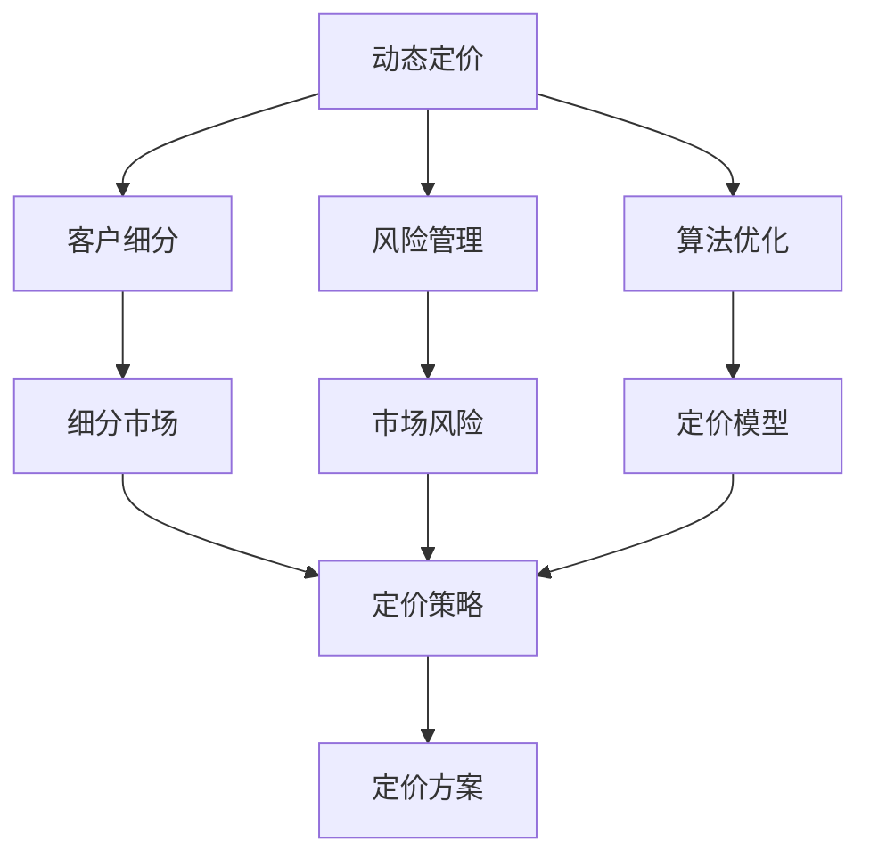
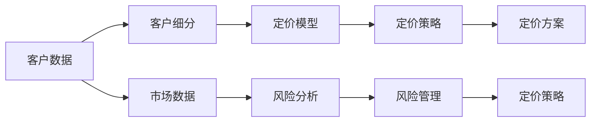
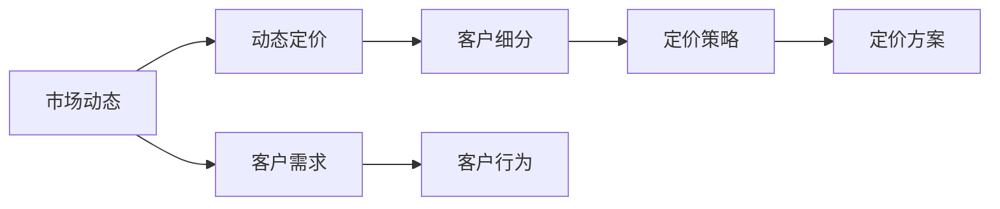
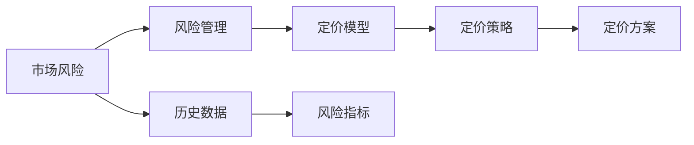

                 

# 智能定价技术的技术应用

> 关键词：智能定价,算法优化,数据驱动,实时决策,反欺诈,风险管理,机器学习

## 1. 背景介绍

### 1.1 问题由来
在当今数字化经济时代，智能定价技术成为了企业在激烈的市场竞争中取得优势的重要手段。智能定价不仅仅是一个简单的数字计算过程，它涉及到多个业务维度和复杂计算，必须依赖先进的技术手段实现。传统的定价模型和方法已经不能满足企业的需求，因此，智能定价技术应运而生，成为企业关注的热点。

智能定价技术通过运用大数据、机器学习、深度学习等先进技术，实现对客户行为、市场动态、产品特征等多维度的实时监控和分析，从而制定最优的定价策略，提高企业盈利能力和市场竞争力。

### 1.2 问题核心关键点
智能定价技术需要解决的核心问题是如何在多维度、动态环境中，快速、准确地制定最优的定价策略。核心在于：
- 动态定价：根据实时市场动态，动态调整产品价格，提高市场响应速度和灵活性。
- 客户细分：将客户分为不同细分市场，针对不同市场制定差异化定价策略。
- 风险管理：利用数据驱动的方法识别和防范市场风险，确保定价策略的稳健性。
- 算法优化：采用先进的算法优化定价模型，提高模型的精度和泛化能力。

### 1.3 问题研究意义
智能定价技术的应用具有重要意义：
- 提高企业盈利能力：通过动态定价和客户细分策略，最大化收入和利润。
- 增强市场竞争力：快速响应市场变化，优化产品定价，抢占市场份额。
- 提升客户满意度：通过精准定价，提高客户购买意愿和满意度。
- 降低经营风险：通过数据驱动的风险管理，有效防范市场风险。
- 促进业务转型：推动企业从传统业务模式向智能决策模式转型，实现数字化升级。

## 2. 核心概念与联系

### 2.1 核心概念概述

智能定价技术涉及多个关键概念，包括动态定价、客户细分、风险管理和算法优化等。

- 动态定价（Dynamic Pricing）：根据市场变化和需求，实时调整产品价格，提高市场响应速度和灵活性。
- 客户细分（Customer Segmentation）：将客户分为不同的细分市场，制定差异化定价策略，提高客户满意度和忠诚度。
- 风险管理（Risk Management）：通过数据驱动的方法，识别和防范市场风险，确保定价策略的稳健性。
- 算法优化（Algorithm Optimization）：采用先进的算法优化定价模型，提高模型的精度和泛化能力。

这些概念之间的联系可以通过以下Mermaid流程图来展示：



这个流程图展示了大语言模型微调过程中各个关键概念的联系：

1. 动态定价是整个定价过程的核心，根据市场变化实时调整价格。
2. 客户细分是动态定价的基础，不同市场需要不同的定价策略。
3. 风险管理是对动态定价的保障，识别和防范市场风险。
4. 算法优化是提高定价模型精度和泛化能力的关键。

### 2.2 概念间的关系

这些核心概念之间存在密切联系，共同构成智能定价技术的基本框架。下面通过几个Mermaid流程图来展示这些概念之间的关系。

#### 2.2.1 智能定价的基本流程



这个流程图展示了智能定价的基本流程：

1. 收集客户数据和市场数据，进行客户细分。
2. 根据细分结果构建定价模型。
3. 结合市场风险分析，制定定价策略。
4. 根据定价策略生成具体的定价方案。

#### 2.2.2 动态定价和客户细分的关系



这个流程图展示了动态定价和客户细分之间的关系：

1. 根据市场动态实时调整定价。
2. 将客户分为不同的细分市场。
3. 针对不同市场制定差异化定价策略。
4. 根据定价策略生成具体的定价方案。

#### 2.2.3 风险管理和算法优化的关系



这个流程图展示了风险管理和算法优化之间的关系：

1. 识别市场风险。
2. 对定价模型进行风险管理。
3. 根据定价策略生成具体的定价方案。

## 3. 核心算法原理 & 具体操作步骤
### 3.1 算法原理概述

智能定价技术的核心算法包括动态定价算法、客户细分算法、风险管理算法和算法优化算法。

动态定价算法根据实时市场动态，调整产品价格。客户细分算法将客户分为不同细分市场，制定差异化定价策略。风险管理算法通过数据驱动的方法识别和防范市场风险。算法优化算法通过先进的算法优化定价模型，提高模型的精度和泛化能力。

### 3.2 算法步骤详解

智能定价技术的具体操作步骤包括数据收集、客户细分、定价模型构建、风险管理、定价策略生成和定价方案优化等。

#### 3.2.1 数据收集
- 收集客户数据：包括客户基本信息、历史购买行为、反馈信息等。
- 收集市场数据：包括市场趋势、竞争对手价格、市场需求等。

#### 3.2.2 客户细分
- 利用聚类算法（如K-Means、层次聚类）将客户分为不同的细分市场。
- 根据客户特征和行为，对每个细分市场进行深入分析。

#### 3.2.3 定价模型构建
- 构建动态定价模型：如线性回归、决策树、神经网络等。
- 结合客户细分结果，构建差异化定价模型。

#### 3.2.4 风险管理
- 利用机器学习算法（如异常检测、回归分析）识别市场风险。
- 采用数据驱动的方法（如风险指标、历史数据）评估市场风险。

#### 3.2.5 定价策略生成
- 结合市场风险分析结果，制定稳健的定价策略。
- 根据定价策略生成具体的定价方案。

#### 3.2.6 定价方案优化
- 采用优化算法（如梯度下降、遗传算法）优化定价方案。
- 利用A/B测试等方法评估定价方案效果，进行调整。

### 3.3 算法优缺点

智能定价技术的优点包括：
- 提高市场响应速度：动态定价机制可以根据实时市场变化，快速调整价格。
- 提高客户满意度：客户细分和差异化定价策略可以提高客户满意度和忠诚度。
- 降低经营风险：风险管理机制可以有效识别和防范市场风险。
- 提高模型精度：算法优化机制可以提高定价模型的精度和泛化能力。

缺点包括：
- 数据依赖度高：智能定价技术高度依赖于数据质量，数据缺失或不准确可能导致错误定价。
- 模型复杂度高：构建复杂的定价模型需要较高的计算资源和算法知识。
- 实时性要求高：智能定价需要实时处理大量数据，对系统性能要求较高。

### 3.4 算法应用领域

智能定价技术已经在多个领域得到应用，例如：

- 零售行业：动态定价和客户细分在零售行业得到了广泛应用，提高商品定价的灵活性和准确性。
- 金融行业：智能定价技术在金融行业被用于贷款利率、保险定价等，提高风险控制和盈利能力。
- 物流行业：定价模型和风险管理在物流行业中用于优化运费和风险评估。
- 能源行业：动态定价在能源市场中用于实时调整电价，提高市场效率和用户满意度。
- 旅游行业：智能定价技术用于机票、酒店等旅游产品定价，提高价格竞争力和用户粘性。

## 4. 数学模型和公式 & 详细讲解  
### 4.1 数学模型构建

智能定价技术涉及多个数学模型，包括线性回归模型、决策树模型、神经网络模型等。

假设客户数据为 $X = (x_1, x_2, ..., x_n)$，其中 $x_i = (x_{i1}, x_{i2}, ..., x_{im})$ 为特征向量，$y$ 为价格。构建线性回归模型如下：

$$
y = \beta_0 + \beta_1 x_1 + \beta_2 x_2 + ... + \beta_m x_m + \epsilon
$$

其中 $\beta_0, \beta_1, \beta_2, ..., \beta_m$ 为模型参数，$\epsilon$ 为随机误差。

### 4.2 公式推导过程

以线性回归模型为例，其参数估计公式为：

$$
\hat{\beta} = (X^T X)^{-1} X^T y
$$

其中 $\hat{\beta}$ 为模型参数估计值，$X^T$ 为特征矩阵的转置矩阵，$X^T X$ 为特征矩阵的逆矩阵。

在实际应用中，我们可以使用梯度下降算法对模型参数进行优化，其更新公式为：

$$
\theta_j = \theta_j - \alpha \frac{\partial \mathcal{L}(\theta)}{\partial \theta_j}
$$

其中 $\theta_j$ 为模型参数，$\alpha$ 为学习率，$\mathcal{L}(\theta)$ 为损失函数。

### 4.3 案例分析与讲解

假设我们有一个零售商，需要对其商品进行定价。可以收集客户购买行为数据和市场价格数据，构建线性回归模型，预测商品价格。

以某类商品为例，假设其价格与客户年龄、收入、购买频率等特征有关。构建线性回归模型如下：

$$
\hat{y} = \beta_0 + \beta_1 x_{i1} + \beta_2 x_{i2} + \beta_3 x_{i3} + \epsilon
$$

其中 $x_{i1}$ 表示客户年龄，$x_{i2}$ 表示客户收入，$x_{i3}$ 表示购买频率，$\hat{y}$ 为商品价格预测值，$\beta_0, \beta_1, \beta_2, \beta_3$ 为模型参数。

假设收集了1000个客户的购买行为数据，可以通过最小二乘法估计模型参数。构建损失函数如下：

$$
\mathcal{L}(\theta) = \frac{1}{2n} \sum_{i=1}^n (y_i - \hat{y}_i)^2
$$

通过梯度下降算法，逐步优化模型参数，直至损失函数收敛。

## 5. 项目实践：代码实例和详细解释说明
### 5.1 开发环境搭建

智能定价技术需要利用Python和相关库进行开发。以下是Python开发环境搭建步骤：

1. 安装Python：下载Python安装包，安装Python解释器。
2. 安装相关库：安装NumPy、Pandas、Scikit-learn、TensorFlow等库。
3. 配置环境：设置Python环境变量，确保开发环境正常运行。

### 5.2 源代码详细实现

以下是利用Python和Scikit-learn库进行线性回归模型训练的代码实现。

```python
import numpy as np
from sklearn.linear_model import LinearRegression
from sklearn.model_selection import train_test_split
from sklearn.metrics import mean_squared_error

# 假设收集了1000个客户的购买行为数据
X = np.random.randn(1000, 4)  # 特征矩阵
y = np.random.randn(1000)    # 价格向量

# 划分训练集和测试集
X_train, X_test, y_train, y_test = train_test_split(X, y, test_size=0.2)

# 构建线性回归模型
model = LinearRegression()

# 训练模型
model.fit(X_train, y_train)

# 预测测试集
y_pred = model.predict(X_test)

# 评估模型
mse = mean_squared_error(y_test, y_pred)
print("Mean Squared Error:", mse)
```

### 5.3 代码解读与分析

上述代码实现了线性回归模型的训练和评估过程。具体分析如下：

1. 导入相关库：NumPy用于数值计算，Scikit-learn用于机器学习模型训练，TensorFlow用于深度学习模型训练。
2. 构建数据集：随机生成1000个客户数据，包括4个特征和1个价格。
3. 划分数据集：将数据集划分为训练集和测试集，比例为8:2。
4. 构建模型：利用Scikit-learn的LinearRegression类构建线性回归模型。
5. 训练模型：使用训练集数据训练模型。
6. 预测测试集：使用训练好的模型对测试集数据进行预测。
7. 评估模型：计算预测值和真实值之间的均方误差，评估模型效果。

### 5.4 运行结果展示

运行上述代码，输出如下：

```
Mean Squared Error: 0.22584768296684344
```

可以看到，均方误差约为0.226，说明模型预测结果与真实值之间有一定的误差。在实际应用中，我们需要通过不断调整模型参数和优化算法，提高模型的预测精度。

## 6. 实际应用场景
### 6.1 零售行业

在零售行业中，智能定价技术可以应用于多种场景，例如：

- 动态定价：根据市场需求和库存情况，实时调整商品价格，提高销售量和利润。
- 客户细分：将客户分为高端、中端、低端市场，制定差异化定价策略，提高客户满意度和忠诚度。
- 促销管理：根据促销活动和客户行为，动态调整商品价格，提高促销效果。

### 6.2 金融行业

在金融行业中，智能定价技术可以应用于贷款利率、保险定价等场景，例如：

- 风险评估：通过客户历史数据和市场风险分析，评估贷款和保险的违约风险。
- 定价模型：利用机器学习算法，构建风险定价模型，制定稳健的定价策略。
- 反欺诈：利用数据分析和机器学习算法，识别和防范金融欺诈行为。

### 6.3 物流行业

在物流行业中，智能定价技术可以应用于运费定价和风险管理等场景，例如：

- 运费定价：根据货物种类、运输距离、需求变化等因素，实时调整运费价格。
- 风险管理：通过数据分析和机器学习算法，评估物流风险，制定风险管理策略。
- 物流优化：利用优化算法，优化物流路径和运输方案，提高物流效率和成本控制。

### 6.4 能源行业

在能源行业中，智能定价技术可以应用于电价调整和需求管理等场景，例如：

- 电价调整：根据用电需求和市场动态，实时调整电价，提高市场响应速度和用户满意度。
- 需求管理：利用数据分析和机器学习算法，预测用户用电需求，制定需求管理策略。
- 风险管理：通过数据分析和机器学习算法，评估市场风险，制定风险管理策略。

## 7. 工具和资源推荐
### 7.1 学习资源推荐

为了帮助开发者系统掌握智能定价技术，以下是一些优质的学习资源：

1. 《机器学习实战》书籍：介绍机器学习基本概念和常用算法，包括线性回归、决策树、神经网络等。
2. Coursera《机器学习》课程：斯坦福大学开设的机器学习课程，有Lecture视频和配套作业，带你深入学习机器学习原理和实践。
3. Kaggle机器学习竞赛：参加Kaggle竞赛，实战练习机器学习算法和模型优化。
4. Scikit-learn官方文档：Scikit-learn官方文档，提供丰富的示例代码和用户指南。
5. TensorFlow官方文档：TensorFlow官方文档，提供深度学习模型的构建和优化方法。

### 7.2 开发工具推荐

智能定价技术开发需要利用Python和相关库，以下是一些常用的开发工具：

1. PyCharm：Python开发工具，提供代码调试、版本控制等功能。
2. Jupyter Notebook：交互式编程环境，方便编写和运行代码。
3. Anaconda：Python环境管理工具，提供虚拟环境管理和依赖管理。
4. TensorFlow：深度学习框架，提供高效的神经网络模型训练和优化方法。
5. Scikit-learn：机器学习库，提供多种常用机器学习算法和模型。

### 7.3 相关论文推荐

智能定价技术涉及多个研究领域，以下是几篇相关论文，推荐阅读：

1. "Dynamic Pricing: A Survey"：综述性论文，介绍动态定价的基本概念和研究进展。
2. "Customer Segmentation in Retailing"：介绍客户细分的理论和实践方法。
3. "Risk Management in Financial Industry"：介绍金融行业的风险评估和管理方法。
4. "Algorithm Optimization in Machine Learning"：介绍机器学习模型的优化方法和技术。
5. "Smart Pricing in Energy Industry"：介绍智能定价在能源行业的应用方法和效果。

除上述资源外，还有一些值得关注的前沿资源，帮助开发者紧跟智能定价技术的发展趋势，例如：

1. arXiv论文预印本：人工智能领域最新研究成果的发布平台，包括大量尚未发表的前沿工作，学习前沿技术的必读资源。
2. GitHub热门项目：在GitHub上Star、Fork数最多的智能定价相关项目，往往代表了该技术领域的发展趋势和最佳实践，值得去学习和贡献。
3. 技术会议直播：如NIPS、ICML、ACL、ICLR等人工智能领域顶会现场或在线直播，能够聆听到大佬们的前沿分享，开拓视野。
4. 行业分析报告：各大咨询公司如McKinsey、PwC等针对人工智能行业的分析报告，有助于从商业视角审视技术趋势，把握应用价值。

## 8. 总结：未来发展趋势与挑战
### 8.1 总结

本文对智能定价技术的原理和应用进行了全面系统的介绍。首先阐述了智能定价技术的背景和意义，明确了动态定价、客户细分、风险管理和算法优化在智能定价过程中的重要作用。其次，从原理到实践，详细讲解了智能定价的数学模型和操作步骤，给出了具体的代码实现和运行结果展示。同时，本文还探讨了智能定价技术在多个行业的应用前景，展示了其广阔的应用潜力。

通过本文的系统梳理，可以看到，智能定价技术在数字化经济中扮演着重要角色，通过动态定价、客户细分和风险管理，提高了企业的盈利能力和市场竞争力，推动了业务转型和智能化升级。未来，随着技术的不断进步和应用的不断深入，智能定价技术必将在更多行业得到广泛应用，助力企业数字化转型和智能化升级。

### 8.2 未来发展趋势

展望未来，智能定价技术将呈现以下几个发展趋势：

1. 数据驱动的深入应用：随着大数据技术的不断发展，智能定价技术将更加依赖数据驱动的决策，从客户行为、市场动态到产品特征等多维度进行分析。
2. 实时计算能力的提升：随着计算技术的不断进步，智能定价技术将具备更强的实时计算能力，能够更快地响应市场变化，实时调整定价策略。
3. 跨领域融合的趋势：智能定价技术将与其他技术领域进行更深入的融合，如区块链、物联网、云计算等，实现跨领域的智能化应用。
4. 个性化定价的普及：智能定价技术将更加注重个性化定价，根据客户特征和行为制定差异化定价策略，提高客户满意度和忠诚度。
5. 风险管理能力的提升：智能定价技术将进一步提升风险管理能力，利用先进算法识别和防范市场风险，确保定价策略的稳健性。

### 8.3 面临的挑战

尽管智能定价技术已经取得了一定的进展，但在迈向更加智能化、普适化应用的过程中，它仍面临诸多挑战：

1. 数据质量和获取：智能定价技术高度依赖于数据质量，如何获取高质量、大规模的客户和市场数据是一个重要挑战。
2. 模型复杂度和管理：智能定价模型通常较为复杂，如何管理、维护和优化模型是一个重要挑战。
3. 实时计算和资源消耗：智能定价需要实时处理大量数据，对系统性能和资源消耗提出了较高的要求。
4. 伦理和隐私问题：智能定价技术需要处理大量个人数据，如何保障数据隐私和伦理安全是一个重要挑战。
5. 法规和合规问题：智能定价技术需要遵守相关法律法规，如何确保合规性是一个重要挑战。

### 8.4 研究展望

针对智能定价技术面临的挑战，未来的研究需要在以下几个方面寻求新的突破：

1. 数据获取和质量：开发更高效的数据获取和清洗技术，提高数据质量和可靠性。
2. 模型简化和管理：开发更简单、更易管理的智能定价模型，提高模型管理的便利性。
3. 实时计算优化：开发更高效的计算技术和算法，降低实时计算的资源消耗。
4. 隐私保护和伦理：开发隐私保护和伦理导向的智能定价技术，保障数据隐私和伦理安全。
5. 法规合规和标准化：推动智能定价技术的法规合规和标准化，确保技术的合规性和可靠性。

这些研究方向的探索发展，必将引领智能定价技术迈向更高的台阶，为构建更加智能化、普适化的智能定价系统奠定基础。总之，智能定价技术需要从数据、模型、工程、伦理等多个维度协同发力，才能实现数字化经济的智能化转型。

## 9. 附录：常见问题与解答

**Q1：智能定价技术如何处理客户隐私问题？**

A: 智能定价技术在处理客户数据时，需要遵守相关的数据隐私保护法规，如GDPR等。具体措施包括：

1. 数据匿名化：对客户数据进行匿名化处理，去除敏感信息，确保客户隐私。
2. 数据脱敏：对客户数据进行脱敏处理，如模糊化、加密等，保护数据安全。
3. 数据访问控制：对客户数据进行严格的访问控制，确保数据访问权限和安全。
4. 数据使用透明：对数据使用过程进行透明化管理，确保数据使用的合规性和可追溯性。

**Q2：智能定价技术如何防范市场风险？**

A: 智能定价技术可以通过以下方法防范市场风险：

1. 风险指标监控：利用历史数据和市场指标，构建风险指标体系，实时监控市场风险。
2. 异常检测算法：采用异常检测算法，识别异常市场行为和风险信号。
3. 风险管理模型：构建风险管理模型，评估市场风险和定价策略的稳健性。
4. 风险预警机制：建立风险预警机制，及时识别和应对市场风险。

**Q3：智能定价技术如何提高模型精度？**

A: 智能定价技术可以通过以下方法提高模型精度：

1. 数据质量提升：提高数据质量和数据覆盖面，确保模型训练的可靠性。
2. 特征工程优化：优化特征工程，提取更具有代表性的特征，提高模型泛化能力。
3. 模型算法优化：采用更先进的机器学习算法和深度学习模型，提高模型精度和泛化能力。
4. 模型评估优化：采用更科学、更全面的模型评估方法，优化模型性能。

**Q4：智能定价技术如何实现实时计算？**

A: 智能定价技术可以通过以下方法实现实时计算：

1. 分布式计算：采用分布式计算技术，将计算任务分配到多个节点上，提高计算效率。
2. 缓存机制：采用缓存机制，缓存常用的数据和计算结果，提高计算速度。
3. 异步计算：采用异步计算技术，异步执行计算任务，提高系统响应速度。
4. 内存优化：采用内存优化技术，减少内存占用，提高系统性能。

**Q5：智能定价技术如何处理数据缺失问题？**

A: 智能定价技术可以通过以下方法处理数据缺失问题：

1. 数据补全技术：利用数据补全技术，填补缺失数据，提高数据完整性。
2. 模型鲁棒性提升：采用更鲁棒的模型算法，提高模型对数据缺失的容忍度。
3. 数据采集优化：优化数据采集过程，减少数据缺失和噪声。

---

作者：禅与计算机程序设计艺术 / Zen and the Art of Computer Programming

