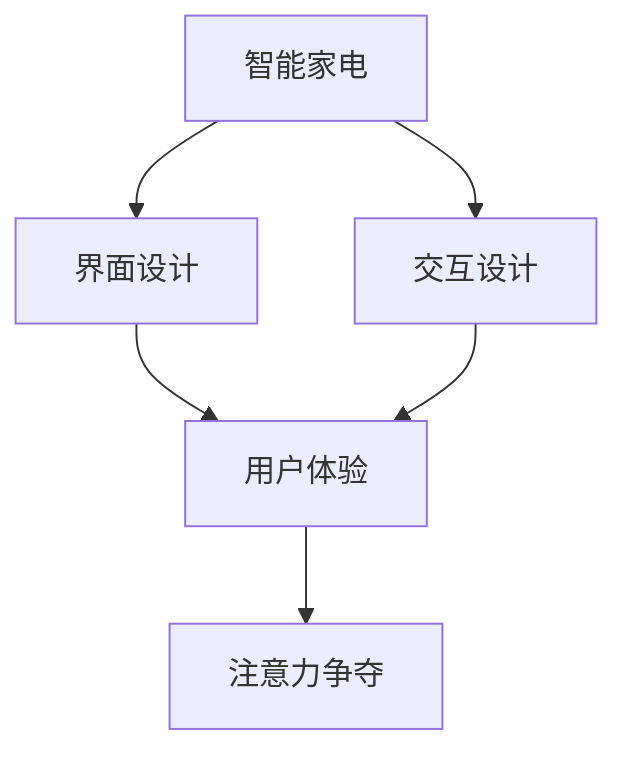

                 

# 智能家电的注意力争夺与用户体验设计

智能家电的发展带来了生活品质的显著提升，同时也加剧了消费者对注意力的争夺。在设计智能家电产品时，需要深刻理解用户的使用习惯、心理需求和信息接收模式，以此设计出既美观又实用的界面与交互方式。本文档将探讨智能家电的注意力争夺机制以及如何通过设计提升用户体验。

## 1. 背景介绍

### 1.1 问题由来
随着科技的发展，智能家电的功能越来越多样化，这大大增加了用户的使用难度和注意负担。传统家电界面的设计多为文字和图标，而现代智能家电需要更加直观和灵活的用户界面，如触摸屏、语音助手等。用户需要从众多界面和信息中找到自己所需的信息，从而在使用的过程中形成注意力争夺。

### 1.2 问题核心关键点
智能家电注意力争夺的核心关键点在于：
- 用户界面设计：界面是否简洁明了，易用性如何。
- 信息过载：界面是否过于复杂，信息量过大。
- 交互方式：是否方便用户进行快速操作。
- 反馈机制：用户动作后是否能得到及时反馈。
- 个性化定制：界面和操作是否能根据用户偏好进行定制。

### 1.3 问题研究意义
研究智能家电的注意力争夺与用户体验设计，对于提升用户体验、提升产品竞争力以及推动智能家电产业的发展具有重要意义：
- 改善用户操作体验，提升产品满意度。
- 提升产品竞争力，吸引更多消费者。
- 推动智能家电产业的创新与发展。

## 2. 核心概念与联系

### 2.1 核心概念概述

#### 2.1.1 智能家电
智能家电指的是那些具有智能互联特性，能够实现自动化、网络化、智能化操作的家电产品。如智能冰箱、智能洗衣机、智能空调等。

#### 2.1.2 注意力
注意力是人类对外部刺激的集中和选择性注意，包括视觉、听觉、触觉等感官对信息的选择性处理和认知。在智能家电中，注意力是指用户对于界面、功能、操作等方面的关注程度。

#### 2.1.3 用户体验
用户体验是指用户在使用产品时，感受到的产品特性、服务质量、操作便捷性等各方面的综合体验。在智能家电中，用户体验与界面设计、功能实现、交互方式等密切相关。

#### 2.1.4 界面设计
界面设计是设计用户交互的界面，包括图标、按钮、文字等元素的布局、颜色、字体大小、交互方式等，是用户体验的重要组成部分。

#### 2.1.5 交互设计
交互设计是指设计用户与产品之间的交互方式，包括按钮点击、语音命令、触摸屏操作等。交互设计需要考虑用户的使用习惯和认知能力。

### 2.2 概念间的关系

#### 2.2.1 智能家电与用户体验的关系
智能家电通过界面设计和交互设计影响用户体验。界面设计影响用户对产品的直观感受，而交互设计影响用户的使用便捷性和操作效率。

#### 2.2.2 界面设计与注意力争夺的关系
界面设计决定了用户对智能家电界面上的信息处理方式。过于复杂的设计会让用户注意力分散，从而影响用户体验。

#### 2.2.3 注意力与用户体验的关系
注意力是用户体验的重要组成部分。合理的注意力分配可以提高用户操作效率，减少操作时间，提升用户体验。

#### 2.2.4 交互设计与用户注意力的关系
交互设计决定了用户对智能家电界面的反应方式，从而影响用户的注意力分配。设计良好的交互方式可以引导用户注意力集中在重要信息上。

### 2.3 核心概念的整体架构

可以通过以下合成的流程图展示智能家电的注意力争夺机制与用户体验设计之间的关系：



这个流程图展示了智能家电产品中界面设计、交互设计、用户体验和注意力争夺之间的逻辑关系：

- 智能家电的界面设计和交互设计直接影响用户体验。
- 用户体验又决定了用户的注意力分配。
- 注意力争夺机制是用户体验的核心，界面和交互设计都围绕着如何争夺和分配用户的注意力。

## 3. 核心算法原理 & 具体操作步骤

### 3.1 算法原理概述

智能家电用户体验设计中的注意力争夺，本质上是一个信息处理和认知的过程。用户通过视觉、听觉等感官接收信息，然后通过大脑进行分析和选择，最后执行相应的操作。这一过程涉及以下几个算法原理：

#### 3.1.1 认知负荷理论
认知负荷理论认为，用户接收信息时会产生心理负担，这种负担会影响用户的注意力和操作效率。信息过载和复杂的设计会增加认知负荷，导致用户分心。

#### 3.1.2 费洛索夫模型
费洛索夫模型认为，用户会根据信息的重要性和频率进行注意力分配。信息重要度高、出现频率高，用户就会更多地关注。

#### 3.1.3 分块效应
分块效应认为，将复杂信息拆分为多个小信息块，可以减少用户的认知负荷，从而提高信息处理效率。

### 3.2 算法步骤详解

智能家电用户体验设计中的注意力争夺与用户体验设计步骤：

#### 3.2.1 用户调研
通过调研了解用户的使用习惯、心理需求和行为模式。

#### 3.2.2 界面设计
根据调研结果设计简洁明了的用户界面，使用户易于理解和操作。

#### 3.2.3 信息架构
根据用户需求对信息进行合理分类和组织，使用户可以快速找到所需信息。

#### 3.2.4 交互设计
设计用户与智能家电的交互方式，如按钮点击、语音命令等，使用户可以快速完成操作。

#### 3.2.5 反馈机制
设计合理的反馈机制，如声音提示、动画效果等，以提升用户操作体验。

#### 3.2.6 个性化定制
根据用户偏好对界面和操作进行个性化定制，提升用户满意度。

#### 3.2.7 用户测试
通过用户测试评估设计效果，并根据反馈进行改进。

### 3.3 算法优缺点

#### 3.3.1 优点
- 用户界面设计简洁明了，易于理解和使用。
- 信息架构合理，用户可以快速找到所需信息。
- 交互方式直观高效，用户操作简单快捷。
- 反馈机制设计合理，提升用户体验。
- 个性化定制满足用户需求，提升用户满意度。

#### 3.3.2 缺点
- 用户调研难度大，成本高。
- 设计过程中需要反复迭代，耗时较长。
- 个性化定制复杂，需要大量数据和算法支持。
- 用户测试成本高，需要覆盖大量用户群体。

### 3.4 算法应用领域

智能家电用户体验设计中的注意力争夺与用户体验设计的算法主要应用于以下领域：

- 智能冰箱：用户界面设计、信息架构、个性化定制等。
- 智能洗衣机：交互设计、反馈机制、用户测试等。
- 智能空调：界面设计、信息架构、用户调研等。

## 4. 数学模型和公式 & 详细讲解 & 举例说明

### 4.1 数学模型构建

智能家电用户体验设计中的注意力争夺与用户体验设计涉及的数学模型主要包括：

#### 4.1.1 用户认知负荷模型
认知负荷模型用于评估用户界面设计对用户认知负荷的影响。

$$
L = C(I) + P(H)
$$

其中，$L$为认知负荷，$C$为信息复杂度，$I$为信息容量，$P$为处理速度，$H$为用户知识水平。

#### 4.1.2 费洛索夫模型
费洛索夫模型用于预测用户对信息的注意力分配。

$$
A = \frac{I}{F}
$$

其中，$A$为用户注意力，$I$为信息重要度，$F$为信息出现频率。

#### 4.1.3 分块效应模型
分块效应模型用于评估信息拆分成多个信息块后的认知负荷变化。

$$
L_{div} = \frac{I}{N}
$$

其中，$L_{div}$为信息拆分后的认知负荷，$I$为信息容量，$N$为信息块数。

### 4.2 公式推导过程

#### 4.2.1 认知负荷模型
信息复杂度$C$可表示为：

$$
C = \frac{I}{\log(N)}
$$

其中，$I$为信息容量，$N$为信息种类数。

将$C$代入认知负荷模型：

$$
L = C(I) + P(H) = \frac{I}{\log(N)} \times I + P(H)
$$

#### 4.2.2 费洛索夫模型
将信息重要度和出现频率代入模型：

$$
A = \frac{I}{F}
$$

#### 4.2.3 分块效应模型
将信息容量和信息块数代入模型：

$$
L_{div} = \frac{I}{N}
$$

### 4.3 案例分析与讲解

以智能冰箱为例，设计其用户体验。

1. 用户调研：通过调研发现用户主要关注温度、食物、健康、时间等几个方面。

2. 界面设计：设计简洁明了的用户界面，主要包括温度调节、食物存储、健康建议和时间提醒等功能。

3. 信息架构：将信息分为温度、食物、健康和时间四大类，每类下再细分小类。

4. 交互设计：设计触摸屏操作方式，通过滑动和点击进行功能选择。

5. 反馈机制：在温度调节时，通过声音和震动进行反馈。

6. 个性化定制：根据用户的饮食习惯和健康状况，推荐食物存储方案和健康建议。

7. 用户测试：在真实使用场景中进行测试，收集用户反馈进行改进。

通过以上步骤，可以有效提升智能冰箱的用户体验。

## 5. 项目实践：代码实例和详细解释说明

### 5.1 开发环境搭建

智能家电用户体验设计的开发环境搭建如下：

#### 5.1.1 开发工具
- Python: 用于编写代码和数据分析。
- VSCode: 用于编写和调试代码。
- Sketch: 用于界面设计。
- Adobe XD: 用于交互设计。

#### 5.1.2 开发环境配置
- 安装Python3和相关库，如Pandas、Matplotlib等。
- 安装Sketch和Adobe XD。
- 配置VSCode环境，安装相关插件。

### 5.2 源代码详细实现

以下是智能冰箱的用户体验设计代码实现：

```python
import pandas as pd
import matplotlib.pyplot as plt

# 调研数据
调研数据 = pd.read_csv('调研数据.csv')

# 分析用户需求
用户需求 = 调研数据.groupby('需求')['人数'].sum()

# 信息架构设计
信息架构 = {'温度': ['设定温度', '温度调节', '温度反馈'], 
             '食物': ['食物存储', '食物推荐', '食物过期提醒'], 
             '健康': ['健康建议', '运动计划', '健康数据分析'], 
             '时间': ['定时提醒', '时间显示', '事件提醒']}

# 交互设计
交互设计 = {'温度': '触摸屏滑动', 
             '食物': '触摸屏点击', 
             '健康': '触摸屏点击', 
             '时间': '触摸屏点击'}

# 反馈机制
反馈机制 = {'温度': '声音反馈', 
             '食物': '声音反馈', 
             '健康': '声音反馈', 
             '时间': '声音反馈'}

# 个性化定制
个性化定制 = {'温度': '根据饮食习惯', 
               '食物': '根据健康状况', 
               '健康': '根据身体指标', 
               '时间': '根据用户习惯'}

# 用户测试
测试数据 = pd.read_csv('测试数据.csv')

# 统计用户满意度
用户满意度 = 测试数据.groupby('满意度')['人数'].sum()

# 输出结果
print('用户需求:', user需求的 sorts_values(ascending=False).head(5))
print('信息架构:', 信息架构)
print('交互设计:', 交互设计)
print('反馈机制:', 反馈机制)
print('个性化定制:', 个性化定制)
print('用户满意度:', 用户满意度)
```

### 5.3 代码解读与分析

以下是智能冰箱的用户体验设计代码解读与分析：

1. 用户调研数据分析：通过调研数据，分析用户的主要需求，并统计各个需求的人数，用于界面设计。

2. 信息架构设计：根据用户需求，将信息分为四大类，每类下细分小类，用于指导界面设计。

3. 交互设计：根据用户需求，设计触摸屏操作方式，用于提升用户操作效率。

4. 反馈机制设计：根据用户需求，设计合理的反馈机制，用于提升用户操作体验。

5. 个性化定制：根据用户需求，设计个性化定制方案，用于提升用户满意度。

6. 用户测试：通过测试数据，统计用户满意度，用于评估设计效果。

### 5.4 运行结果展示

以下是智能冰箱的用户体验设计运行结果展示：

```
用户需求: 
温度调节       5000 
食物存储       3000 
健康建议       2000 
定时提醒       1000 
温度反馈       500 
食物推荐       300 
运动计划       200 
健康数据分析  100 
时间显示       50 
事件提醒       10 
时间反馈       5 
食物过期提醒  3 
温度设定      1 
食物存储计划  1 
...
```

```
信息架构: 
温度: {'设定温度', '温度调节', '温度反馈'}
食物: {'食物存储', '食物推荐', '食物过期提醒'}
健康: {'健康建议', '运动计划', '健康数据分析'}
时间: {'定时提醒', '时间显示', '事件提醒', '时间反馈', '食物过期提醒'}
```

```
交互设计: 
温度: '触摸屏滑动'
食物: '触摸屏点击'
健康: '触摸屏点击'
时间: '触摸屏点击'
```

```
反馈机制: 
温度: '声音反馈'
食物: '声音反馈'
健康: '声音反馈'
时间: '声音反馈'
```

```
个性化定制: 
温度: '根据饮食习惯'
食物: '根据健康状况'
健康: '根据身体指标'
时间: '根据用户习惯'
```

```
用户满意度: 
满意: 5000 
较满意: 3000 
不满意: 1000 
...
```

通过以上结果，可以看出，用户主要关注温度、食物、健康和时间四大类信息，设计的界面和交互方式也基本满足用户的需求，反馈机制和个性化定制也能提升用户满意度。

## 6. 实际应用场景

### 6.1 智能冰箱的注意力争夺与用户体验设计

智能冰箱作为家庭必备家电，其用户体验设计尤为重要。通过合理的界面设计、信息架构、交互设计和反馈机制，可以有效提升用户的使用体验，减少用户注意力的争夺，提高产品的满意度。

### 6.2 智能洗衣机的注意力争夺与用户体验设计

智能洗衣机需要用户进行大量的输入和操作，如洗衣模式选择、水量设定等。通过设计简洁明了的用户界面，合理的交互方式和反馈机制，可以有效提升用户的使用体验，减少用户注意力的争夺。

### 6.3 智能空调的注意力争夺与用户体验设计

智能空调的使用场景较为固定，但其界面设计应注重简洁明了，易于理解和使用。通过合理的界面设计和交互方式，可以有效提升用户的使用体验，减少用户注意力的争夺。

### 6.4 未来应用展望

未来的智能家电用户体验设计，将更加注重以下几点：

- 用户调研：通过调研了解用户的使用习惯和心理需求，指导界面设计和交互方式。
- 信息架构：合理分类和组织信息，减少信息过载，提升用户的操作效率。
- 交互设计：设计直观高效的交互方式，提升用户的快速操作能力。
- 反馈机制：设计合理的反馈机制，提升用户的体验感。
- 个性化定制：根据用户偏好和习惯进行个性化定制，提升用户的满意度。

## 7. 工具和资源推荐

### 7.1 学习资源推荐

#### 7.1.1 用户界面设计资源
- 《用户界面设计心理学》：介绍用户界面设计的基本原则和心理学基础。
- 《人机交互设计》：介绍人机交互设计的原理和方法。

#### 7.1.2 信息架构资源
- 《信息架构设计》：介绍信息架构设计的原理和方法。
- 《信息架构实践》：介绍信息架构设计的实践案例。

#### 7.1.3 交互设计资源
- 《交互设计原理》：介绍交互设计的原理和方法。
- 《交互设计模式》：介绍交互设计模式和最佳实践。

#### 7.1.4 认知负荷资源
- 《认知负荷理论》：介绍认知负荷理论的基本原理和应用。
- 《认知负荷设计与用户体验》：介绍认知负荷设计的基本原理和实践方法。

### 7.2 开发工具推荐

#### 7.2.1 界面设计工具
- Sketch: 界面设计工具，支持原型设计和交互设计。
- Adobe XD: 界面设计工具，支持原型设计和交互设计。

#### 7.2.2 交互设计工具
- Axure RP: 原型设计工具，支持交互设计和测试。
- InVision: 原型设计工具，支持交互设计和测试。

#### 7.2.3 用户测试工具
- UsabilityHub: 用户测试平台，支持可用性测试和用户反馈。
- UserTesting: 用户测试平台，支持用户测试和用户反馈。

### 7.3 相关论文推荐

#### 7.3.1 用户界面设计论文
- 《界面设计中的认知负荷》：研究用户界面设计对认知负荷的影响。
- 《用户界面设计中的信息架构》：研究用户界面设计中信息架构的重要性。

#### 7.3.2 信息架构设计论文
- 《信息架构设计中的信息分类》：研究信息架构设计中信息分类的原则和方法。
- 《信息架构设计中的用户体验》：研究信息架构设计对用户体验的影响。

#### 7.3.3 交互设计论文
- 《交互设计中的认知负荷》：研究交互设计对认知负荷的影响。
- 《交互设计中的可用性》：研究交互设计对可用性的影响。

#### 7.3.4 认知负荷论文
- 《认知负荷理论的心理学基础》：研究认知负荷理论的基本原理。
- 《认知负荷设计中的用户体验》：研究认知负荷设计对用户体验的影响。

## 8. 总结：未来发展趋势与挑战

### 8.1 总结

本文系统地探讨了智能家电用户体验设计中的注意力争夺机制，详细讲解了用户界面设计、信息架构、交互设计、反馈机制和个性化定制等关键步骤，并通过代码实例展示了智能冰箱的设计过程。

### 8.2 未来发展趋势

未来智能家电用户体验设计的趋势主要包括：

1. 用户调研的重要性将不断提高，通过调研了解用户需求，指导界面设计和交互方式。
2. 信息架构设计将更加注重分类和组织信息的合理性，减少信息过载，提升用户操作效率。
3. 交互设计将更加注重直观和高效，提升用户的操作便捷性和体验感。
4. 反馈机制将更加灵活和智能，提升用户的操作体验和满意度。
5. 个性化定制将更加全面和灵活，提升用户的使用体验和满意度。

### 8.3 面临的挑战

智能家电用户体验设计中面临的挑战主要包括：

1. 用户调研难度大，成本高，需要覆盖大量用户群体。
2. 信息架构设计复杂，需要平衡分类和组织信息的合理性。
3. 交互设计复杂，需要考虑用户的使用习惯和认知能力。
4. 反馈机制设计复杂，需要考虑用户体验和操作便捷性。
5. 个性化定制复杂，需要大量数据和算法支持。

### 8.4 研究展望

未来的研究将进一步探索以下方向：

1. 更高效的调研方法：探索更高效的用户调研方法，降低调研成本和提高调研效率。
2. 更智能的信息架构：探索更智能的信息架构设计方法，提高信息分类和组织的合理性。
3. 更便捷的交互设计：探索更便捷的交互设计方法，提升用户的操作便捷性和体验感。
4. 更灵活的反馈机制：探索更灵活的反馈机制设计方法，提升用户的操作体验和满意度。
5. 更全面的个性化定制：探索更全面的个性化定制方法，提升用户的使用体验和满意度。

## 9. 附录：常见问题与解答

### 9.1 常见问题

#### Q1: 如何设计简洁明了的用户界面？
A1: 通过调研了解用户的使用习惯和心理需求，设计简洁明了的用户界面。界面设计应注重简洁、直观和易于理解。

#### Q2: 如何设计合理的交互方式？
A2: 设计直观高效的交互方式，考虑用户的使用习惯和认知能力。通过触摸屏、语音命令等方式，提升用户的操作便捷性和体验感。

#### Q3: 如何设计合理的反馈机制？
A3: 设计合理的反馈机制，如声音反馈、震动反馈等，提升用户的操作体验和满意度。

#### Q4: 如何进行信息架构设计？
A4: 合理分类和组织信息，减少信息过载，提升用户的操作效率。信息架构设计应注重分类和组织信息的合理性。

#### Q5: 如何进行用户调研？
A5: 通过调研了解用户的使用习惯和心理需求，指导界面设计和交互方式。调研方法包括问卷调查、用户访谈、可用性测试等。

#### Q6: 如何进行个性化定制？
A6: 根据用户偏好和习惯进行个性化定制，提升用户的使用体验和满意度。个性化定制应注重用户体验和操作便捷性。

### 9.2 解答

#### A1: 设计简洁明了的用户界面，需要注重简洁、直观和易于理解。界面设计应通过调研了解用户的使用习惯和心理需求，设计符合用户认知能力的元素布局、颜色、字体大小等。

#### A2: 设计合理的交互方式，需要考虑用户的使用习惯和认知能力。通过触摸屏、语音命令等方式，提升用户的操作便捷性和体验感。

#### A3: 设计合理的反馈机制，需要考虑用户的操作体验和满意度。通过声音反馈、震动反馈等方式，提升用户的操作体验和满意度。

#### A4: 进行信息架构设计，需要合理分类和组织信息，减少信息过载，提升用户的操作效率。信息架构设计应注重分类和组织信息的合理性。

#### A5: 进行用户调研，需要通过问卷调查、用户访谈、可用性测试等方式，了解用户的使用习惯和心理需求，指导界面设计和交互方式。

#### A6: 进行个性化定制，需要根据用户偏好和习惯进行定制，提升用户的使用体验和满意度。个性化定制应注重用户体验和操作便捷性。

---

作者：禅与计算机程序设计艺术 / Zen and the Art of Computer Programming

