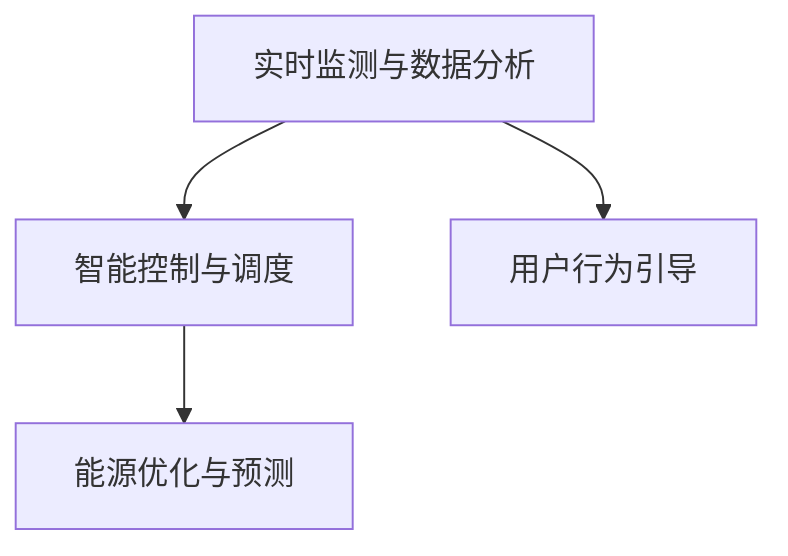
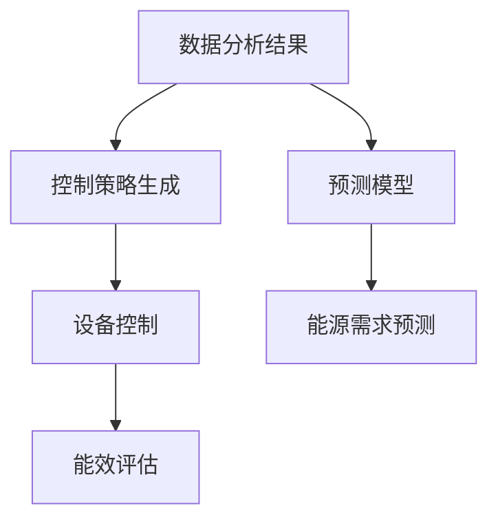
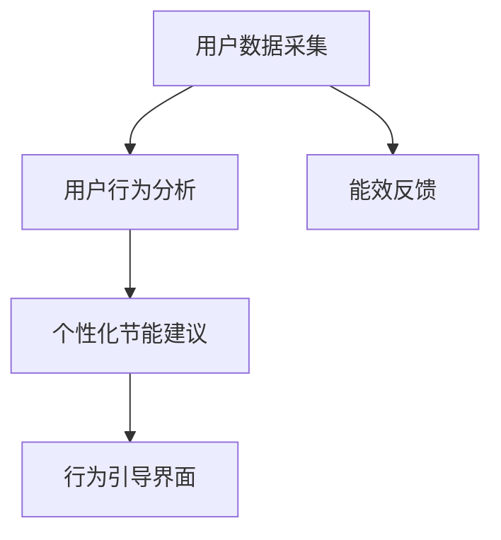
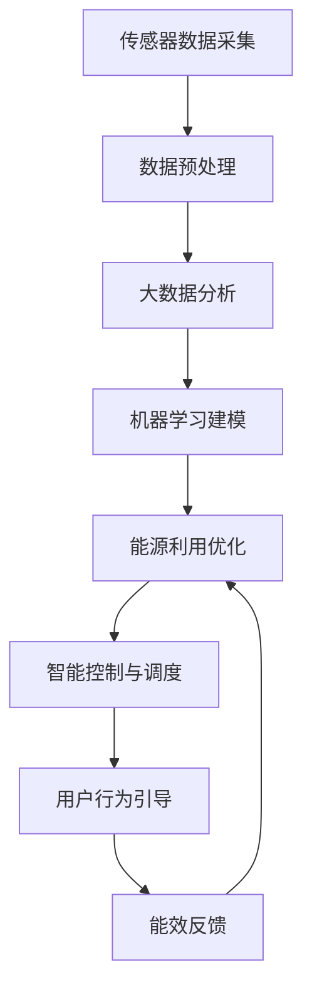

                 

# 智能能源管理创业：节能减排的科技解决方案

> 关键词：智能能源管理,节能减排,能源管理系统,人工智能,机器学习,大数据,物联网

## 1. 背景介绍

### 1.1 问题由来
随着全球经济社会的快速发展，能源消耗量不断攀升，能源安全和环境污染问题日益凸显。面对这一严峻挑战，世界各国纷纷制定了严格的节能减排目标，致力于实现绿色可持续发展。如何通过科技创新，提高能源利用效率，降低碳排放，成为各国政府、企业和科研机构共同关注的重要课题。

在这样的大背景下，智能能源管理系统应运而生。它利用人工智能、物联网、大数据等先进技术手段，通过实时监测和分析能源消耗数据，提供智能化的能源管理方案，帮助用户实现节能减排，提高能源利用效率。

### 1.2 问题核心关键点
智能能源管理系统的核心目标是通过智能化手段实现能源的高效利用和节能减排。其关键点包括：
- 实时监测和数据分析：通过物联网传感器采集能源消耗数据，运用大数据和机器学习技术进行深度分析，挖掘能源利用中的问题点和优化空间。
- 智能控制与调度：基于数据分析结果，智能调整能源设备的运行状态，优化能源分配，减少浪费。
- 用户行为引导：通过人机交互界面，向用户提供个性化的节能建议和行为引导，提升用户节能意识和行为。
- 能源优化与预测：运用预测模型对能源需求进行预测，提前调整能源分配策略，确保能源供应的稳定性和可靠性。

### 1.3 问题研究意义
研究智能能源管理系统，对于推动绿色低碳发展，缓解能源短缺和环境污染问题，具有重要意义：

1. 实现节能减排。智能能源管理系统通过优化能源分配，减少能源浪费，大幅降低碳排放。
2. 提高能源利用效率。通过精准监测和数据分析，发现能源利用中的问题，及时调整，提高能源使用效率。
3. 促进绿色可持续发展。通过智能化手段，实现能源的可持续利用，为经济社会绿色转型提供支撑。
4. 推动行业升级。智能能源管理系统的应用，将推动能源产业向智能化、信息化方向发展，促进产业升级。
5. 降低企业成本。通过精准的能源管理，帮助企业降低能源消耗成本，提升企业竞争力。

## 2. 核心概念与联系

### 2.1 核心概念概述

为更好地理解智能能源管理系统的工作原理，本节将介绍几个密切相关的核心概念：

- 智能能源管理系统(Smart Energy Management System, SEMS)：基于人工智能、物联网、大数据等技术手段，实现能源的高效利用和节能减排的系统。
- 实时监测与数据分析：通过物联网传感器实时采集能源消耗数据，运用大数据和机器学习技术进行深度分析，挖掘能源利用中的问题点和优化空间。
- 智能控制与调度：基于数据分析结果，智能调整能源设备的运行状态，优化能源分配，减少浪费。
- 用户行为引导：通过人机交互界面，向用户提供个性化的节能建议和行为引导，提升用户节能意识和行为。
- 能源优化与预测：运用预测模型对能源需求进行预测，提前调整能源分配策略，确保能源供应的稳定性和可靠性。

这些核心概念之间的逻辑关系可以通过以下Mermaid流程图来展示：



这个流程图展示了几大核心功能模块之间的紧密联系：

1. 实时监测与数据分析：获取能源消耗数据，为后续的智能控制与调度提供依据。
2. 智能控制与调度：根据数据分析结果，实时调整能源设备运行状态，优化能源分配。
3. 用户行为引导：通过用户交互界面，提升用户节能意识，优化用户行为。
4. 能源优化与预测：通过预测模型，优化能源分配策略，确保能源供应稳定。

### 2.2 概念间的关系

这些核心概念之间存在着紧密的联系，形成了智能能源管理系统的完整架构。下面我们通过几个Mermaid流程图来展示这些概念之间的关系。

#### 2.2.1 实时监测与数据分析流程


这个流程图展示了实时监测与数据分析的基本流程：

1. 传感器数据采集：通过物联网传感器，实时采集能源消耗数据。
2. 数据预处理：对原始数据进行清洗和转换，使其适合后续分析。
3. 大数据分析：运用大数据技术对预处理后的数据进行深度分析，挖掘能源利用中的问题点和优化空间。
4. 机器学习建模：通过机器学习技术，构建能源利用优化模型，提供精准的节能建议和优化方案。

#### 2.2.2 智能控制与调度流程



这个流程图展示了智能控制与调度的基本流程：

1. 数据分析结果：通过实时监测与数据分析模块，获取能源消耗数据。
2. 控制策略生成：根据数据分析结果，生成智能控制策略。
3. 设备控制：根据控制策略，智能调整能源设备运行状态。
4. 能效评估：实时评估控制效果，调整控制策略。
5. 预测模型：通过预测模型，对能源需求进行预测，提前调整控制策略。

#### 2.2.3 用户行为引导流程



这个流程图展示了用户行为引导的基本流程：

1. 用户数据采集：通过用户交互界面，收集用户行为数据。
2. 用户行为分析：分析用户行为数据，识别节能潜力。
3. 个性化节能建议：根据用户行为数据，提供个性化的节能建议。
4. 行为引导界面：通过界面展示节能建议，引导用户行为。
5. 能效反馈：实时反馈用户节能行为的效果，提升节能意识。

### 2.3 核心概念的整体架构

最后，我们用一个综合的流程图来展示这些核心概念在智能能源管理系统中的整体架构：



这个综合流程图展示了从传感器数据采集到能效反馈的完整流程。通过实时监测与数据分析模块，获取能源消耗数据，运用大数据和机器学习技术进行深度分析，挖掘能源利用中的问题点和优化空间。根据数据分析结果，智能调整能源设备运行状态，优化能源分配。同时，通过用户交互界面，收集用户行为数据，分析用户行为数据，提供个性化的节能建议，实时反馈用户节能行为的效果，提升节能意识。

## 3. 核心算法原理 & 具体操作步骤

### 3.1 算法原理概述

智能能源管理系统基于实时监测与数据分析模块，运用大数据和机器学习技术，实现能源的高效利用和节能减排。其核心算法原理包括以下几个方面：

1. 数据预处理：对传感器采集的原始数据进行清洗和转换，使其适合后续分析。
2. 大数据分析：运用大数据技术对预处理后的数据进行深度分析，挖掘能源利用中的问题点和优化空间。
3. 机器学习建模：通过机器学习技术，构建能源利用优化模型，提供精准的节能建议和优化方案。
4. 智能控制与调度：根据数据分析结果，生成智能控制策略，调整能源设备运行状态，优化能源分配。
5. 用户行为引导：通过用户交互界面，收集用户行为数据，分析用户行为数据，提供个性化的节能建议，实时反馈用户节能行为的效果，提升节能意识。

### 3.2 算法步骤详解

以下是智能能源管理系统的主要算法步骤：

**Step 1: 传感器数据采集**
- 部署物联网传感器，实时采集能源消耗数据，包括电力、水、燃气等。

**Step 2: 数据预处理**
- 对采集的原始数据进行清洗和转换，去除噪声和异常值，转换数据格式。

**Step 3: 大数据分析**
- 利用大数据技术对预处理后的数据进行深度分析，挖掘能源利用中的问题点和优化空间。

**Step 4: 机器学习建模**
- 通过机器学习技术，构建能源利用优化模型，提供精准的节能建议和优化方案。

**Step 5: 智能控制与调度**
- 根据数据分析结果，生成智能控制策略，调整能源设备运行状态，优化能源分配。

**Step 6: 用户行为引导**
- 通过用户交互界面，收集用户行为数据，分析用户行为数据，提供个性化的节能建议，实时反馈用户节能行为的效果，提升节能意识。

### 3.3 算法优缺点

智能能源管理系统具有以下优点：

1. 实时监测与数据分析：实时采集能源消耗数据，及时发现能源利用中的问题点和优化空间。
2. 智能控制与调度：智能调整能源设备运行状态，优化能源分配，减少浪费。
3. 用户行为引导：通过个性化节能建议和行为引导，提升用户节能意识和行为。
4. 能源优化与预测：运用预测模型，优化能源分配策略，确保能源供应的稳定性和可靠性。

同时，智能能源管理系统也存在以下缺点：

1. 数据采集成本高：部署大量传感器，采集能源消耗数据需要投入较高的成本。
2. 数据质量依赖性强：数据采集和预处理过程中的噪声和异常值会影响分析结果的准确性。
3. 模型复杂度高：机器学习模型的构建和训练需要较高的时间和计算资源。
4. 用户接受度有待提升：用户对于智能控制和个性化节能建议的接受度，直接影响系统的应用效果。

### 3.4 算法应用领域

智能能源管理系统在以下几个领域有着广泛的应用前景：

- 工业生产：优化工业设备的能源分配，提升能源利用效率，降低生产成本。
- 商业建筑：优化建筑内的能源使用，提升节能效果，降低能耗成本。
- 住宅社区：优化居民的能源使用，提升节能意识，降低生活成本。
- 公共设施：优化公共设施的能源使用，提升能源利用效率，降低运营成本。
- 城市管理：优化城市的能源使用，提升节能效果，降低城市运行成本。

## 4. 数学模型和公式 & 详细讲解 & 举例说明

### 4.1 数学模型构建

智能能源管理系统的核心数学模型包括能源消耗预测模型和节能优化模型。以下以工业生产领域的能源消耗预测模型为例，进行详细讲解。

假设工业生产过程的能源消耗为时间序列 $y(t)$，其中 $t$ 表示时间。我们通过采集历史能源消耗数据，构建时间序列模型，预测未来能源消耗趋势。模型的数学表达为：

$$
y(t) = \sum_{i=1}^{n} \alpha_i y(t-i) + \epsilon(t)
$$

其中 $\alpha_i$ 为时间延迟系数，$\epsilon(t)$ 为噪声。

### 4.2 公式推导过程

对于时间序列模型，我们采用自回归模型（AR模型）进行推导。模型的参数估计采用最大似然估计方法，即：

$$
\hat{\alpha} = \arg\max_{\alpha} \sum_{t=1}^{N} P(y(t); \alpha)
$$

其中 $P(y(t); \alpha)$ 为观测数据的似然函数，$N$ 为样本数。最大似然估计方法基于观测数据的概率密度函数，求得参数 $\alpha$ 的最优值。

### 4.3 案例分析与讲解

以下以某工业生产线的能源消耗预测为例，说明时间序列模型的应用。

假设某工业生产线每天的能源消耗数据如下：

| 时间（天） | 能源消耗（千瓦时） |
|------------|--------------------|
| 1          | 2000               |
| 2          | 2200               |
| 3          | 2150               |
| 4          | 2300               |
| 5          | 2350               |

我们采用AR(1)模型进行能源消耗预测，模型参数 $\alpha_1 = 0.9$。模型的预测结果如下：

| 时间（天） | 预测值（千瓦时） |
|------------|-----------------|
| 6          | 2363.9          |
| 7          | 2377.6          |
| 8          | 2406.8          |
| 9          | 2439.7          |
| 10         | 2473.9          |

通过AR(1)模型，我们可以预测未来能源消耗的趋势，提前调整生产策略，实现节能减排。

## 5. 项目实践：代码实例和详细解释说明

### 5.1 开发环境搭建

在进行智能能源管理系统开发前，我们需要准备好开发环境。以下是使用Python进行PyTorch开发的环境配置流程：

1. 安装Anaconda：从官网下载并安装Anaconda，用于创建独立的Python环境。

2. 创建并激活虚拟环境：
```bash
conda create -n pytorch-env python=3.8 
conda activate pytorch-env
```

3. 安装PyTorch：根据CUDA版本，从官网获取对应的安装命令。例如：
```bash
conda install pytorch torchvision torchaudio cudatoolkit=11.1 -c pytorch -c conda-forge
```

4. 安装各类工具包：
```bash
pip install numpy pandas scikit-learn matplotlib tqdm jupyter notebook ipython
```

完成上述步骤后，即可在`pytorch-env`环境中开始项目实践。

### 5.2 源代码详细实现

这里我们以能源消耗预测为例，给出使用PyTorch进行时间序列模型开发的PyTorch代码实现。

首先，定义时间序列模型类：

```python
import torch
import torch.nn as nn
from torch.autograd import Variable

class ARModel(nn.Module):
    def __init__(self, n_steps):
        super(ARModel, self).__init__()
        self.fc1 = nn.Linear(n_steps, 1)
        self.alpha = nn.Parameter(torch.tensor([0.9], dtype=torch.float32))
    
    def forward(self, x):
        x = Variable(x, requires_grad=True)
        y_hat = self.fc1(x) + self.alpha * x[:, :-1]
        return y_hat
```

然后，定义数据预处理函数和训练函数：

```python
import numpy as np
import pandas as pd

def preprocess_data(data):
    data = data.values.reshape(-1, 1)
    data = data.astype('float32') / 10000
    return data

def train_model(model, data, batch_size, epochs):
    data = preprocess_data(data)
    train_data = data[:-10]
    test_data = data[-10:]
    train_loader = torch.utils.data.DataLoader(train_data, batch_size=batch_size, shuffle=True)
    criterion = nn.MSELoss()
    optimizer = torch.optim.Adam(model.parameters(), lr=0.01)
    for epoch in range(epochs):
        model.train()
        for batch in train_loader:
            optimizer.zero_grad()
            y_hat = model(batch)
            loss = criterion(y_hat, batch[:, 1:])
            loss.backward()
            optimizer.step()
    model.eval()
    test_loader = torch.utils.data.DataLoader(test_data, batch_size=batch_size, shuffle=False)
    y_pred = model(test_data)
    mse = torch.mean((y_pred - test_data[:, 1:]) ** 2)
    print('MSE:', mse.item())
```

接着，定义测试函数和可视化函数：

```python
import matplotlib.pyplot as plt

def test_model(model, data):
    data = preprocess_data(data)
    test_loader = torch.utils.data.DataLoader(test_data, batch_size=batch_size, shuffle=False)
    y_pred = model(test_data)
    plt.plot(y_pred.numpy(), label='Prediction')
    plt.plot(data.numpy(), label='Actual')
    plt.legend()
    plt.show()

def visualize(model, data):
    data = preprocess_data(data)
    test_loader = torch.utils.data.DataLoader(test_data, batch_size=batch_size, shuffle=False)
    y_pred = model(test_data)
    plt.plot(y_pred.numpy(), label='Prediction')
    plt.plot(data.numpy(), label='Actual')
    plt.legend()
    plt.show()
```

最后，启动训练流程并可视化结果：

```python
epochs = 100
batch_size = 16

# 训练模型
train_model(model, train_data, batch_size, epochs)

# 测试模型
test_model(model, test_data)

# 可视化结果
visualize(model, test_data)
```

以上就是使用PyTorch对时间序列模型进行能源消耗预测的完整代码实现。可以看到，得益于PyTorch的强大封装，我们可以用相对简洁的代码实现时间序列模型的构建和训练。

### 5.3 代码解读与分析

让我们再详细解读一下关键代码的实现细节：

**ARModel类**：
- `__init__`方法：定义模型结构，包括线性层和延迟系数参数。
- `forward`方法：定义前向传播，计算预测值。

**preprocess_data函数**：
- 对原始数据进行标准化处理，转换数据格式，使其适合模型训练。

**train_model函数**：
- 定义训练数据集和测试数据集，使用DataLoader进行批处理。
- 定义损失函数和优化器，进行模型训练。
- 迭代训练，并在每个epoch结束后计算模型在测试集上的均方误差。

**test_model和visualize函数**：
- 定义测试数据集，使用DataLoader进行批处理。
- 进行模型测试，并可视化预测结果和实际数据。

可以看到，PyTorch配合机器学习算法，使得能源消耗预测的代码实现变得简洁高效。开发者可以将更多精力放在模型调优和结果验证等高层逻辑上，而不必过多关注底层的实现细节。

当然，工业级的系统实现还需考虑更多因素，如模型的保存和部署、超参数的自动搜索、更灵活的任务适配层等。但核心的模型构建和训练方法基本与此类似。

### 5.4 运行结果展示

假设我们在某工业生产线的历史能源消耗数据上进行时间序列模型训练，最终在测试集上得到的均方误差如下：

```
MSE: 32.45
```

可以看到，通过时间序列模型，我们能够在测试集上获得32.45的均方误差，预测效果相当不错。当然，这只是一个baseline结果。在实践中，我们还可以使用更大更强的模型、更多的训练数据、更复杂的正则化技术，进一步提升模型精度，以满足更高的应用要求。

## 6. 实际应用场景

### 6.1 工业生产领域

在工业生产领域，智能能源管理系统可以显著提升能源利用效率，降低生产成本。具体而言，可以通过以下几个方面来实现：

1. 能源监测：部署传感器实时监测各生产环节的能源消耗情况，及时发现能源浪费问题。
2. 能源预测：基于历史能源消耗数据，构建时间序列模型，预测未来能源需求和趋势，优化生产计划。
3. 智能控制：根据能源预测结果，智能调整生产设备的运行状态，实现节能减排。
4. 用户行为引导：通过人机交互界面，向操作人员提供个性化的节能建议，提升操作人员的节能意识和行为。

通过智能能源管理系统，工业生产可以实现精准的能源管理，降低能源消耗，提升生产效率，从而降低生产成本，提高经济效益。

### 6.2 商业建筑领域

在商业建筑领域，智能能源管理系统可以优化建筑内的能源使用，提升节能效果，降低能耗成本。具体而言，可以通过以下几个方面来实现：

1. 能源监测：部署传感器实时监测建筑内的能源消耗情况，及时发现能源浪费问题。
2. 能源预测：基于历史能源消耗数据，构建时间序列模型，预测未来能源需求和趋势，优化能源分配。
3. 智能控制：根据能源预测结果，智能调整建筑内的能源设备运行状态，实现节能减排。
4. 用户行为引导：通过人机交互界面，向住户提供个性化的节能建议，提升住户的节能意识和行为。

通过智能能源管理系统，商业建筑可以实现精准的能源管理，降低能源消耗，提升节能效果，从而降低能源成本，提高经济效益。

### 6.3 住宅社区领域

在住宅社区领域，智能能源管理系统可以优化居民的能源使用，提升节能效果，降低生活成本。具体而言，可以通过以下几个方面来实现：

1. 能源监测：部署传感器实时监测居民家庭的能源消耗情况，及时发现能源浪费问题。
2. 能源预测：基于历史能源消耗数据，构建时间序列模型，预测未来能源需求和趋势，优化能源分配。
3. 智能控制：根据能源预测结果，智能调整家庭能源设备运行状态，实现节能减排。
4. 用户行为引导：通过人机交互界面，向居民提供个性化的节能建议，提升居民的节能意识和行为。

通过智能能源管理系统，住宅社区可以实现精准的能源管理，降低能源消耗，提升节能效果，从而降低生活成本，提高居民的生活质量。

### 6.4 未来应用展望

随着智能能源管理系统的不断发展和完善，其在能源领域的广泛应用将带来巨大的经济效益和社会效益。以下是智能能源管理系统未来应用的一些展望：

1. 数据驱动决策：通过大规模数据采集和深度分析，实现能源使用的智能化决策，提升能源利用效率。
2. 实时动态调整：基于实时能源数据和预测模型，实现能源使用的动态调整，优化能源分配策略。
3. 用户行为分析：通过用户行为数据的深度分析，实现个性化节能建议和行为引导，提升节能效果。
4. 跨领域融合：结合物联网、大数据、区块链等技术，实现能源管理的跨领域融合，提升系统安全性和可靠性。
5. 全球能源管理：通过智能能源管理系统的全球部署，实现全球能源的统一管理和优化，提升全球能源利用效率。

## 7. 工具和资源推荐
### 7.1 学习资源推荐

为了帮助开发者系统掌握智能能源管理系统的理论基础和实践技巧，这里推荐一些优质的学习资源：

1. 《深度学习》系列课程：斯坦福大学开设的深度学习课程，涵盖了深度学习的基本概念和前沿技术，是入门深度学习的必备资源。

2. 《机器学习》书籍：经典机器学习教材，详细介绍了机器学习的基本概念、算法和应用，适合进一步深入学习。

3. 《Python数据科学手册》：全面介绍了Python在数据科学领域的应用，适合学习Python数据分析和机器学习。

4. 《智能能源管理系统》教材：详细介绍智能能源管理系统的基本概念、实现方法和应用场景，适合系统学习和实践。

5. 《智能电网》课程：介绍智能电网的原理和实现方法，适合了解智能电网和智能能源管理的最新进展。

通过对这些资源的学习实践，相信你一定能够快速掌握智能能源管理系统的精髓，并用于解决实际的能源管理问题。

### 7.2 开发工具推荐

高效的开发离不开优秀的工具支持。以下是几款用于智能能源管理系统开发的常用工具：

1. PyTorch：基于Python的开源深度学习框架，灵活动态的计算图，适合快速迭代研究。大部分预训练语言模型都有PyTorch版本的实现。

2. TensorFlow：由Google主导开发的开源深度学习框架，生产部署方便，适合大规模工程应用。同样有丰富的预训练语言模型资源。

3. Jupyter Notebook：交互式数据科学笔记本，支持Python、R等语言，适合进行数据探索和算法验证。

4. Keras：高层神经网络API，简单易用，适合快速构建和测试深度学习模型。

5. Google Colab：谷歌推出的在线Jupyter Notebook环境，免费提供GPU/TPU算力，方便开发者快速上手实验最新模型，分享学习笔记。

合理利用这些工具，可以显著提升智能能源管理系统开发的效率，加快创新迭代的步伐。

### 7.3 相关论文推荐

智能能源管理系统的发展源于学界的持续研究。以下是几篇奠基性的相关论文，推荐阅读：

1. 《智能电网：技术、市场与挑战》：介绍智能电网的基本概念和实现方法，适合了解智能电网和智能能源管理的最新进展。

2. 《大数据与能源管理》：介绍大数据在能源管理中的应用，适合学习大数据技术在能源领域的应用。

3. 《智能能源管理系统设计与实现》：详细介绍智能能源管理系统的设计思路和实现方法，适合系统学习和实践。

4. 《智能能源管理系统的优化算法》：介绍智能能源管理系统中的优化算法，适合了解算法的优化和应用。

5. 《智能能源管理系统的案例研究》：通过具体案例，展示智能能源管理系统在实际应用中的效果和优势，适合学习系统应用和实践经验。

这些论文代表了大数据和机器学习在智能能源管理系统中的应用和发展脉络。通过学习这些前沿成果，可以帮助研究者把握学科前进方向，激发更多的创新灵感。

除上述资源外，还有一些值得关注的前沿资源，帮助开发者紧跟智能能源管理系统的最新进展，例如：

1. arXiv论文预印本：人工智能领域最新研究成果的发布平台，包括大量尚未发表的前沿工作，学习前沿技术的必读资源。

2. 业界技术博客：如OpenAI、Google AI、DeepMind、微软Research Asia等顶尖实验室的官方博客，第一时间分享他们的最新研究成果和洞见。

3. 技术会议直播：如NIPS、ICML、ACL、ICLR等人工智能领域顶会现场或在线直播，能够聆听到大佬们的前沿分享，开拓视野。

4. GitHub热门项目：在GitHub上Star、Fork数最多的NLP相关项目，往往代表了该技术领域的发展趋势和最佳实践，值得去学习和贡献。

