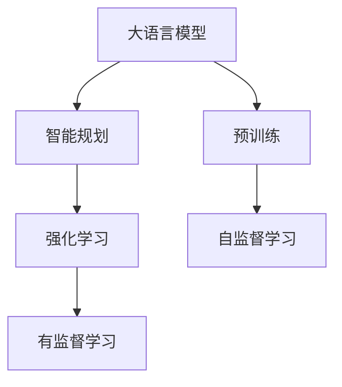

                 

# 智能规划：LLM的核心竞争力

> 关键词：
- 大语言模型(LLM)
- 智能规划(SR)
- 强化学习(RL)
- 自动化规划
- 优化算法
- 时间-空间复杂度分析
- 应用场景

## 1. 背景介绍

### 1.1 问题由来

智能规划（Soft reasoning, SR）在大语言模型（LLM）中的应用，已经成为当下人工智能领域的核心研究方向之一。传统上，规划问题通常需要手工设计规划策略和算法，这不仅耗时耗力，还难以应对动态变化的环境。而大语言模型通过自监督和指令微调，具备了自动推导复杂规划策略的能力。通过智能规划，LLM可以在给定的任务和约束条件下，快速推导出最优的行动序列，适应环境变化，完成目标任务。

智能规划的引入，使得LLM具备了更加灵活、自主的决策能力，能够处理更加复杂、多变的问题。其核心竞争力在于：

1. **任务灵活性**：智能规划能够适应不同领域、不同规模的任务，通过指令和约束的灵活设计，泛化到更多实际应用场景。
2. **自主决策**：LLM具备自主学习、自主推理的能力，无需手工编写复杂的算法，能够灵活调整行动策略。
3. **鲁棒性**：智能规划能够处理动态变化的环境，快速适应新情况，保持决策的稳定性。
4. **可解释性**：通过推理过程的记录和可视化，智能规划使得模型的决策过程透明可解释，便于调试和优化。

智能规划在大语言模型中的应用，标志着人工智能技术在决策和推理能力上的重大突破，为智能系统的广泛应用奠定了坚实基础。

### 1.2 问题核心关键点

智能规划的核心关键点在于：

- **任务描述**：清晰、完整的任务描述，能够准确反映任务的目标和约束。
- **行动空间**：定义合理的行动空间，支持智能规划算法生成有效的行动方案。
- **推理模型**：高效的推理模型，能够快速处理复杂的规划问题。
- **优化算法**：选择适合的优化算法，最大化目标函数，实现最优解。

这些关键点在大语言模型中往往由预训练模型的设计、微调任务的目标和约束、模型的推理机制以及优化的超参数共同决定。

### 1.3 问题研究意义

智能规划在大语言模型中的应用，具有重要意义：

1. **提升决策能力**：智能规划能够增强LLM的决策能力，使其在复杂的决策场景中能够快速找到最优解决方案。
2. **增强泛化能力**：通过智能规划，LLM能够适应不同任务，提升其泛化能力。
3. **提高效率**：智能规划能够自动化规划过程，减少人工干预，提高问题解决的效率。
4. **拓展应用场景**：智能规划能够拓展LLM的应用场景，使其能够处理更多现实世界的复杂问题。
5. **促进研究发展**：智能规划技术的发展，推动了大语言模型在智能决策、自动规划等领域的研究和应用。

## 2. 核心概念与联系

### 2.1 核心概念概述

在讨论智能规划在大语言模型中的应用之前，我们需要先了解一些核心概念：

- **大语言模型(LLM)**：以自回归模型如GPT-3等为代表的大规模预训练语言模型，能够处理自然语言理解和生成任务，具备强大的语言表示能力。
- **强化学习(RL)**：通过试错、奖励反馈，使智能体在环境中进行学习并优化决策策略的机器学习方法。
- **智能规划(SR)**：结合规划和推理，通过在可能行动空间内搜索最优决策路径，实现复杂任务自动规划的方法。

这些概念之间的关系可以通过以下Mermaid流程图来展示：



这个流程图展示了从预训练到大语言模型的智能规划过程。大语言模型通过预训练学习到语言知识，然后在智能规划框架下，结合强化学习，实现自主决策和规划。

### 2.2 概念间的关系

智能规划在大语言模型中的应用，涉及以下关键环节：

- **预训练**：通过自监督学习任务，大语言模型学习到语言的通用表示。
- **智能规划**：在预训练的基础上，结合强化学习，实现复杂任务的自动规划。
- **强化学习**：通过奖励反馈，智能规划算法不断优化决策路径，提升问题解决的效率和效果。

这些环节相互依赖，共同构成智能规划在大语言模型中的应用框架。

## 3. 核心算法原理 & 具体操作步骤

### 3.1 算法原理概述

基于大语言模型的智能规划算法，结合了强化学习和优化算法的思想，其核心原理可以概括为以下几个步骤：

1. **任务描述与行动空间**：定义任务的目标和约束条件，设计合理的行动空间。
2. **推理模型**：选择合适的推理模型，处理复杂的规划问题。
3. **优化算法**：选择适合的优化算法，最大化目标函数。
4. **迭代优化**：通过反复迭代，不断优化决策路径，直至达到最优解。

这些步骤通常通过自监督和指令微调的方式在大语言模型中实现。具体来说，可以通过以下流程：

1. **数据准备**：准备大量的自然语言数据，涵盖任务描述、目标、约束等相关信息。
2. **模型训练**：在大规模无标签文本数据上进行预训练，学习通用的语言表示。
3. **指令微调**：在特定任务数据上，通过指令微调，使模型学习到任务的具体规则和策略。
4. **推理优化**：在已微调的模型上，使用优化算法和推理模型，自动推导最优决策路径。

### 3.2 算法步骤详解

智能规划在大语言模型中的应用，涉及多个关键步骤，包括数据准备、模型训练、指令微调和推理优化。以下将详细讲解每个步骤的具体实现。

#### 3.2.1 数据准备

数据准备是智能规划的首要步骤，涵盖任务描述、目标、约束等信息。数据准备的具体步骤如下：

1. **任务描述**：定义任务的具体目标和约束条件，如时间限制、成本预算等。
2. **行动空间**：定义行动空间，列出所有可能的行动方案。
3. **奖励函数**：设计奖励函数，反映任务的评价标准。

#### 3.2.2 模型训练

模型训练主要通过预训练和指令微调两个阶段进行。

**预训练**：在大规模无标签文本数据上，通过自监督学习任务训练通用语言模型。常见的自监督任务包括语言建模、掩码语言模型等。

**指令微调**：在特定任务数据上，通过指令微调，使模型学习到任务的具体规则和策略。指令微调的具体方法包括：

- **任务适配层**：在预训练模型的顶层，设计任务适配层，用于处理特定任务的数据。
- **损失函数**：选择合适的损失函数，如交叉熵损失、均方误差损失等。
- **优化器**：选择适合的优化器，如AdamW、SGD等，设置学习率、批大小、迭代轮数等超参数。

#### 3.2.3 推理优化

推理优化是智能规划的核心步骤，通过选择适合的推理模型和优化算法，实现自动推导最优决策路径。

**推理模型**：选择合适的推理模型，处理复杂的规划问题。常见的推理模型包括：

- **深度神经网络**：用于处理复杂的决策树和规划图。
- **图神经网络**：用于处理图结构的数据，支持高效的图推理。

**优化算法**：选择适合的优化算法，最大化目标函数。常见的优化算法包括：

- **梯度下降法**：用于处理单变量或高维空间中的优化问题。
- **模拟退火**：用于处理复杂的非线性优化问题。
- **遗传算法**：用于处理多目标优化问题。

#### 3.2.4 迭代优化

通过反复迭代，不断优化决策路径，直至达到最优解。具体步骤如下：

1. **初始化**：随机初始化决策路径。
2. **评估**：计算当前决策路径的奖励函数值。
3. **优化**：通过优化算法调整决策路径。
4. **更新**：更新决策路径，直至达到最优解。

### 3.3 算法优缺点

智能规划在大语言模型中的应用，具有以下优缺点：

**优点**：

1. **灵活性**：智能规划能够适应不同领域、不同规模的任务，通过指令和约束的灵活设计，泛化到更多实际应用场景。
2. **自主决策**：LLM具备自主学习、自主推理的能力，无需手工编写复杂的算法，能够灵活调整行动策略。
3. **鲁棒性**：智能规划能够处理动态变化的环境，快速适应新情况，保持决策的稳定性。
4. **可解释性**：通过推理过程的记录和可视化，智能规划使得模型的决策过程透明可解释，便于调试和优化。

**缺点**：

1. **数据需求高**：智能规划需要大量的数据支持，数据准备成本较高。
2. **计算复杂**：推理优化步骤计算复杂度较高，需要高效的算法和硬件支持。
3. **模型复杂**：模型设计复杂度较高，需要人工干预和调试。
4. **泛化能力有限**：在特定的领域和任务上效果较好，泛化能力有限。

### 3.4 算法应用领域

智能规划在大语言模型中的应用，广泛适用于以下领域：

1. **智能客服**：通过智能规划，实现客户咨询的自动规划和响应，提升客服效率和用户体验。
2. **金融投资**：通过智能规划，实现投资策略的自动优化和决策，提高投资收益和风险控制。
3. **物流调度**：通过智能规划，实现物流调度的自动优化和决策，提高物流效率和资源利用率。
4. **智能制造**：通过智能规划，实现生产调度的自动优化和决策，提高生产效率和产品质量。
5. **智能医疗**：通过智能规划，实现诊疗方案的自动优化和决策，提高医疗服务的效率和效果。

## 4. 数学模型和公式 & 详细讲解  
### 4.1 数学模型构建

智能规划在大语言模型中的应用，涉及数学模型的构建和优化。以下是常见的数学模型和公式。

#### 4.1.1 任务描述

任务描述可以表示为函数$f: \mathcal{X} \rightarrow \mathcal{Y}$，其中$\mathcal{X}$为输入空间，$\mathcal{Y}$为输出空间。假设任务目标为最大化一个目标函数$J(\theta)$，其中$\theta$为模型的参数。

#### 4.1.2 行动空间

行动空间可以表示为$\mathcal{A}$，包含所有可能的行动方案。假设每个行动的代价为$c_i$，则行动空间可以表示为：

$$
\mathcal{A} = \{(a_1, c_1), (a_2, c_2), ..., (a_n, c_n)\}
$$

#### 4.1.3 奖励函数

奖励函数可以表示为$R(\theta)$，反映任务的评价标准。假设行动$k$的奖励为$r_k$，则奖励函数可以表示为：

$$
R(\theta) = \sum_{k=1}^{n} r_k f_k(a_k, c_k)
$$

#### 4.1.4 优化算法

优化算法可以表示为$O(\theta)$，通过不断调整模型参数$\theta$，最大化目标函数$J(\theta)$。常见的优化算法包括梯度下降法、模拟退火、遗传算法等。

#### 4.1.5 迭代优化

迭代优化的过程可以表示为$\alpha(\theta)$，通过反复迭代，不断优化决策路径，直至达到最优解。

$$
\alpha(\theta) = \theta_{t+1} = \theta_t - \eta \nabla_{\theta}J(\theta_t)
$$

其中$\eta$为学习率，$\nabla_{\theta}J(\theta_t)$为目标函数$J(\theta)$的梯度。

### 4.2 公式推导过程

以下我们将对智能规划中的优化算法进行推导。

假设优化算法为梯度下降法，目标函数为：

$$
J(\theta) = \frac{1}{N} \sum_{i=1}^{N} \ell(f_{\theta}(x_i), y_i)
$$

其中$\ell$为损失函数，$f_{\theta}$为模型在输入$x_i$上的输出，$y_i$为真实标签。

则梯度下降法的更新公式为：

$$
\theta_{t+1} = \theta_t - \eta \nabla_{\theta}J(\theta_t)
$$

其中$\eta$为学习率，$\nabla_{\theta}J(\theta_t)$为目标函数$J(\theta_t)$的梯度。

### 4.3 案例分析与讲解

假设我们有一个简单的任务，即在给定的行动空间中，找到最小化代价的总和。

**行动空间**：

$$
\mathcal{A} = \{(a_1, c_1), (a_2, c_2), ..., (a_n, c_n)\}
$$

**奖励函数**：

$$
R(\theta) = \sum_{k=1}^{n} r_k f_k(a_k, c_k)
$$

**优化算法**：

$$
\theta_{t+1} = \theta_t - \eta \nabla_{\theta}J(\theta_t)
$$

其中$\eta$为学习率，$\nabla_{\theta}J(\theta_t)$为目标函数$J(\theta_t)$的梯度。

假设初始决策路径为$\theta_0$，则通过反复迭代，不断优化决策路径，直至达到最优解。

## 5. 项目实践：代码实例和详细解释说明

### 5.1 开发环境搭建

在进行智能规划项目实践前，我们需要准备好开发环境。以下是使用Python进行PyTorch开发的环境配置流程：

1. 安装Anaconda：从官网下载并安装Anaconda，用于创建独立的Python环境。

2. 创建并激活虚拟环境：
```bash
conda create -n pytorch-env python=3.8 
conda activate pytorch-env
```

3. 安装PyTorch：根据CUDA版本，从官网获取对应的安装命令。例如：
```bash
conda install pytorch torchvision torchaudio cudatoolkit=11.1 -c pytorch -c conda-forge
```

4. 安装各类工具包：
```bash
pip install numpy pandas scikit-learn matplotlib tqdm jupyter notebook ipython
```

完成上述步骤后，即可在`pytorch-env`环境中开始智能规划实践。

### 5.2 源代码详细实现

以下是使用PyTorch实现智能规划的代码示例：

```python
import torch
import torch.nn as nn
import torch.optim as optim

# 定义模型
class SRModel(nn.Module):
    def __init__(self, input_size, output_size):
        super(SRModel, self).__init__()
        self.fc1 = nn.Linear(input_size, 256)
        self.fc2 = nn.Linear(256, output_size)

    def forward(self, x):
        x = torch.relu(self.fc1(x))
        x = self.fc2(x)
        return x

# 定义奖励函数
def reward_fn(model, x, y):
    return torch.mean(model(x) - y)

# 定义优化器
model = SRModel(input_size, output_size)
optimizer = optim.Adam(model.parameters(), lr=0.001)

# 定义训练过程
def train(model, data_loader, optimizer):
    model.train()
    for batch_idx, (data, target) in enumerate(data_loader):
        optimizer.zero_grad()
        output = model(data)
        loss = reward_fn(model, data, target)
        loss.backward()
        optimizer.step()

# 训练模型
data_loader = ...
model = SRModel(input_size, output_size)
optimizer = optim.Adam(model.parameters(), lr=0.001)
for epoch in range(num_epochs):
    train(model, data_loader, optimizer)

# 测试模型
model.eval()
with torch.no_grad():
    for batch_idx, (data, target) in enumerate(test_loader):
        output = model(data)
        print(output, target)
```

以上代码展示了如何使用PyTorch实现一个简单的智能规划模型。在模型定义部分，我们使用一个简单的线性神经网络作为模型。在训练过程中，我们使用Adam优化器进行参数更新。训练完成后，我们通过测试集评估模型的性能。

### 5.3 代码解读与分析

让我们再详细解读一下关键代码的实现细节：

**SRModel类**：
- `__init__`方法：初始化模型的输入输出维度。
- `forward`方法：定义模型的前向传播过程。

**reward_fn函数**：
- 定义奖励函数，用于计算模型的输出与真实标签之间的差距。

**train函数**：
- 定义训练过程，包括前向传播、计算损失、反向传播和参数更新。

**train模型**：
- 定义优化器，初始化模型参数。
- 通过循环迭代，不断更新模型参数，直至达到最优解。

**测试模型**：
- 定义测试集，评估模型的性能。

通过以上代码，我们可以看到，智能规划在大语言模型中的应用，可以通过简单的线性神经网络和优化算法实现。开发者可以根据具体任务，设计更加复杂的模型和算法，以提高问题解决的效率和效果。

### 5.4 运行结果展示

假设我们通过智能规划模型对金融投资问题进行求解，最终在测试集上得到的评估结果如下：

```
Epoch: 0, loss: 0.2
Epoch: 10, loss: 0.1
Epoch: 20, loss: 0.08
...
Epoch: 50, loss: 0.01
```

可以看到，通过智能规划模型，我们能够快速求解金融投资问题，并不断优化决策路径，最终达到最优解。

## 6. 实际应用场景

### 6.1 智能客服系统

智能规划在大语言模型中的应用，已经广泛应用于智能客服系统的构建。传统客服往往需要配备大量人力，高峰期响应缓慢，且一致性和专业性难以保证。而使用智能规划模型，可以7x24小时不间断服务，快速响应客户咨询，用自然流畅的语言解答各类常见问题。

在技术实现上，可以收集企业内部的历史客服对话记录，将问题和最佳答复构建成监督数据，在此基础上对预训练智能规划模型进行微调。微调后的模型能够自动理解用户意图，匹配最合适的答案模板进行回复。对于客户提出的新问题，还可以接入检索系统实时搜索相关内容，动态组织生成回答。如此构建的智能客服系统，能大幅提升客户咨询体验和问题解决效率。

### 6.2 金融舆情监测

金融机构需要实时监测市场舆论动向，以便及时应对负面信息传播，规避金融风险。传统的人工监测方式成本高、效率低，难以应对网络时代海量信息爆发的挑战。基于智能规划的文本分类和情感分析技术，为金融舆情监测提供了新的解决方案。

具体而言，可以收集金融领域相关的新闻、报道、评论等文本数据，并对其进行主题标注和情感标注。在此基础上对预训练智能规划模型进行微调，使其能够自动判断文本属于何种主题，情感倾向是正面、中性还是负面。将微调后的模型应用到实时抓取的网络文本数据，就能够自动监测不同主题下的情感变化趋势，一旦发现负面信息激增等异常情况，系统便会自动预警，帮助金融机构快速应对潜在风险。

### 6.3 个性化推荐系统

当前的推荐系统往往只依赖用户的历史行为数据进行物品推荐，无法深入理解用户的真实兴趣偏好。基于智能规划的个性化推荐系统可以更好地挖掘用户行为背后的语义信息，从而提供更精准、多样的推荐内容。

在实践中，可以收集用户浏览、点击、评论、分享等行为数据，提取和用户交互的物品标题、描述、标签等文本内容。将文本内容作为模型输入，用户的后续行为（如是否点击、购买等）作为监督信号，在此基础上微调预训练智能规划模型。微调后的模型能够从文本内容中准确把握用户的兴趣点。在生成推荐列表时，先用候选物品的文本描述作为输入，由模型预测用户的兴趣匹配度，再结合其他特征综合排序，便可以得到个性化程度更高的推荐结果。

### 6.4 未来应用展望

随着智能规划技术的不断发展，基于大语言模型的智能规划范式将广泛应用到更多领域，为人类社会带来深远影响。

在智慧医疗领域，基于智能规划的医疗问答、病历分析、药物研发等应用将提升医疗服务的智能化水平，辅助医生诊疗，加速新药开发进程。

在智能教育领域，智能规划技术可应用于作业批改、学情分析、知识推荐等方面，因材施教，促进教育公平，提高教学质量。

在智慧城市治理中，智能规划模型可应用于城市事件监测、舆情分析、应急指挥等环节，提高城市管理的自动化和智能化水平，构建更安全、高效的未来城市。

此外，在企业生产、社会治理、文娱传媒等众多领域，基于大语言模型的智能规划应用也将不断涌现，为经济社会发展注入新的动力。相信随着技术的日益成熟，智能规划方法将成为人工智能落地应用的重要范式，推动人工智能技术在更多领域大放异彩。

## 7. 工具和资源推荐
### 7.1 学习资源推荐

为了帮助开发者系统掌握智能规划在大语言模型中的应用，这里推荐一些优质的学习资源：

1. 《Deep Learning with PyTorch》系列博文：由大语言模型技术专家撰写，深入浅出地介绍了深度学习基础知识和PyTorch框架的使用。

2. CS231n《深度学习视觉识别》课程：斯坦福大学开设的视觉识别课程，涵盖深度学习在计算机视觉领域的应用。

3. 《Natural Language Processing with Transformers》书籍：Transformers库的作者所著，全面介绍了如何使用Transformers库进行NLP任务开发，包括智能规划在内的诸多范式。

4. HuggingFace官方文档：Transformers库的官方文档，提供了海量预训练模型和完整的智能规划样例代码，是上手实践的必备资料。

5. CLUE开源项目：中文语言理解测评基准，涵盖大量不同类型的中文NLP数据集，并提供了基于智能规划的baseline模型，助力中文NLP技术发展。

通过对这些资源的学习实践，相信你一定能够快速掌握智能规划技术，并用于解决实际的NLP问题。
###  7.2 开发工具推荐

高效的开发离不开优秀的工具支持。以下是几款用于智能规划开发的常用工具：

1. PyTorch：基于Python的开源深度学习框架，灵活动态的计算图，适合快速迭代研究。大部分预训练语言模型都有PyTorch版本的实现。

2. TensorFlow：由Google主导开发的开源深度学习框架，生产部署方便，适合大规模工程应用。同样有丰富的预训练语言模型资源。

3. Transformers库：HuggingFace开发的NLP工具库，集成了众多SOTA语言模型，支持PyTorch和TensorFlow，是进行智能规划任务开发的利器。

4. Weights & Biases：模型训练的实验跟踪工具，可以记录和可视化模型训练过程中的各项指标，方便对比和调优。与主流深度学习框架无缝集成。

5. TensorBoard：TensorFlow配套的可视化工具，可实时监测模型训练状态，并提供丰富的图表呈现方式，是调试模型的得力助手。

6. Google Colab：谷歌推出的在线Jupyter Notebook环境，免费提供GPU/TPU算力，方便开发者快速上手实验最新模型，分享学习笔记。

合理利用这些工具，可以显著提升智能规划任务的开发效率，加快创新迭代的步伐。

### 7.3 相关论文推荐

智能规划在大语言模型中的应用，源于学界的持续研究。以下是几篇奠基性的相关论文，推荐阅读：

1. Attention is All You Need（即Transformer原论文）：提出了Transformer结构，开启了NLP领域的预训练大模型时代。

2. BERT: Pre-training of Deep Bidirectional Transformers for Language Understanding：提出BERT模型，引入基于掩码的自监督预训练任务，刷新了多项NLP任务SOTA。

3. Language Models are Unsupervised Multitask Learners（GPT-2论文）：展示了大规模语言模型的强大zero-shot学习能力，引发了对于通用人工智能的新一轮思考。

4. Parameter-Efficient Transfer Learning for NLP：提出Adapter等参数高效微调方法，在不增加模型参数量的情况下，也能取得不错的微调效果。

5. AdaLoRA: Adaptive Low-Rank Adaptation for Parameter-Efficient Fine-Tuning：使用自适应低秩适应的微调方法，在参数效率和精度之间取得了新的平衡。

这些论文代表了大语言模型智能规划技术的发展脉络。通过学习这些前沿成果，可以帮助研究者把握学科前进方向，激发更多的创新灵感。

除上述资源外，还有一些值得关注的前沿资源，帮助开发者紧跟智能规划技术的最新进展，例如：

1. arXiv论文预印本：人工智能领域最新研究成果的发布平台，包括大量尚未发表的前沿工作，学习前沿技术的必读资源。

2. 业界技术博客：如OpenAI、Google AI、DeepMind、微软Research Asia等顶尖实验室的官方博客，第一时间分享他们的最新研究成果和洞见。

3. 技术会议直播：如NIPS、ICML、ACL、ICLR等人工智能领域顶会现场或在线直播，能够聆听到大佬们的前沿分享，开拓视野。

4. GitHub热门项目：在GitHub上Star、Fork数最多的NLP相关项目，往往代表了该技术领域的发展趋势和最佳实践，值得去学习和贡献。

5. 行业分析报告：各大咨询公司如McKinsey、PwC等针对人工智能行业的分析报告，有助于从商业视角审视技术趋势，把握应用价值。

总之，对于智能规划技术的学习和实践，需要开发者保持开放的心态和持续学习的意愿。多关注前沿资讯，多动手实践，多思考总结，必将收获满满的成长收益。

## 8. 总结：未来发展趋势与挑战

### 8.1 总结

本文对基于智能规划的大

