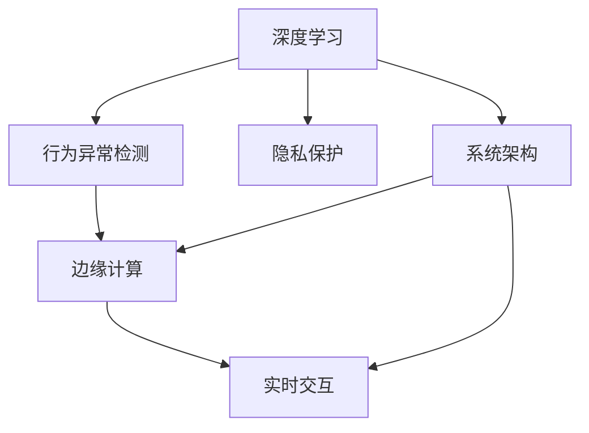

                 

## 1. 背景介绍

### 1.1 问题由来

随着智能家居市场的快速扩张，智能门铃逐渐成为一种颇受欢迎的家居安全解决方案。用户希望通过智能门铃实时监控家门口的动态，防止非法入侵，及时向手机推送报警信息。传统的视频监控系统通常需要专业安装，成本较高且功能单一。而基于智能手机的智能门铃则以较低的成本，提供了更灵活、便捷的监控方式。

然而，市场上的智能门铃产品多采用简单的图像识别和音频检测技术，对异常行为识别的准确性和及时性有待提升。用户也面临隐私泄露、误报率高、后期维护成本高等问题。为此，本文提出一种基于深度学习的智能门铃系统，通过实时监控视频流和音频流，利用先进的神经网络模型进行行为异常检测，从而提升家居安全的守卫水平。

### 1.2 问题核心关键点

智能门铃系统需要解决以下核心问题：

- **实时处理**：对家居门口的实时视频流和音频流进行实时处理，及时发现异常行为。
- **行为理解**：理解并判别视频流中人物的动作和行为，判断是否存在入侵等异常行为。
- **隐私保护**：在识别异常行为的同时，避免泄露用户隐私。
- **精度优化**：提升行为识别的准确性和鲁棒性，减少误报和漏报。
- **边缘计算**：将大规模模型部署到边缘计算设备上，实现低延迟和高效推理。
- **用户互动**：通过APP实现与用户的实时互动，增强用户体验。

### 1.3 问题研究意义

智能门铃系统不仅能够提高家居安全水平，还能为智能家居平台提供丰富的一手数据，支持后续的智能家居场景优化和业务升级。例如，通过分析异常行为的数据，可以开发出更高效的视频监控方案和智能家居安全策略。因此，研究高效、精确、稳定的智能门铃系统，对智能家居产业的发展具有重要意义。

## 2. 核心概念与联系

### 2.1 核心概念概述

为更好地理解基于深度学习的智能门铃系统，本文将介绍几个密切相关的核心概念：

- **深度学习**：基于神经网络的机器学习方法，通过多层非线性变换，从数据中自动学习特征，实现复杂任务。
- **行为异常检测**：利用神经网络模型对视频流或音频流中的人物行为进行实时监测，发现异常行为。
- **边缘计算**：将模型部署到本地计算设备上，减少数据传输和计算延迟，提高系统响应速度。
- **隐私保护**：在模型推理过程中，对敏感数据进行脱敏和加密处理，保护用户隐私。
- **实时交互**：通过APP等接口，实时展示监控画面和警报信息，与用户进行互动。
- **系统架构**：由前端摄像头、边缘设备、云端服务以及APP组成，各部分协同工作，实现家居安全守卫。

这些核心概念共同构成了智能门铃系统的整体框架，使其能够高效、精确地实现家居安全的智能守卫。

### 2.2 概念间的关系

这些核心概念之间存在着紧密的联系，形成了智能门铃系统的完整生态系统。以下通过Mermaid流程图展示这些概念之间的关系：



这个流程图展示出智能门铃系统各组件之间的联系：

1. 深度学习模型是行为异常检测的基础，通过学习大量数据，能够高效、精确地识别异常行为。
2. 边缘计算设备部署模型，实现低延迟、高精度的实时推理，从而保障系统响应速度。
3. 实时交互系统通过APP展示监控画面和警报信息，实现与用户的互动。
4. 隐私保护技术在模型推理时对数据进行脱敏和加密，保障用户隐私安全。
5. 系统架构将各组件有机整合，形成完整的智能门铃系统。

通过理解这些核心概念之间的关系，我们能够更好地把握智能门铃系统的整体设计和实现方法。

## 3. 核心算法原理 & 具体操作步骤

### 3.1 算法原理概述

基于深度学习的智能门铃系统，核心算法原理可概括为：

1. **数据采集**：通过前端摄像头采集视频流和音频流，并将其输入到深度学习模型中。
2. **特征提取**：深度学习模型通过卷积层、池化层等对输入数据进行特征提取。
3. **行为分类**：分类层对特征提取的结果进行分类，判断是否存在异常行为。
4. **异常检测**：对分类结果进行阈值判断，当超过阈值时，系统发出警报。
5. **边缘推理**：模型在边缘设备上推理，避免数据传输和云端计算，提升系统响应速度。
6. **隐私保护**：在推理过程中，对敏感数据进行脱敏和加密处理，保护用户隐私。

### 3.2 算法步骤详解

基于深度学习的智能门铃系统，具体算法步骤如下：

**Step 1: 数据采集**

智能门铃系统首先通过前端摄像头，实时采集家门口的视频流和音频流。视频流通常采用H264、H265等编码标准，音频流则采用MP3、AAC等格式。视频流和音频流的帧率和采样率需要根据硬件设备性能进行调整。

**Step 2: 数据预处理**

采集到的视频流和音频流需要进行预处理，包括但不限于以下步骤：

- **图像增强**：对视频流进行图像增强，如对比度调节、去噪、色彩校正等，提升图像质量。
- **音频去噪**：对音频流进行去噪处理，减少环境噪音干扰。
- **数据对齐**：对视频流和音频流进行时间对齐，确保数据同步。

**Step 3: 特征提取**

深度学习模型通过卷积神经网络（CNN）对视频流进行特征提取。常用的卷积神经网络包括AlexNet、VGG、ResNet等。特征提取的过程包括但不限于以下步骤：

- **卷积层**：提取图像的局部特征，捕捉边缘、纹理等细节信息。
- **池化层**：对卷积层提取的特征进行下采样，减小计算量。
- **批量归一化**：对特征进行归一化处理，提升模型稳定性和训练效果。
- **残差连接**：通过残差连接，解决深度网络退化问题，提升模型表达能力。

**Step 4: 行为分类**

特征提取后，深度学习模型通过分类层对提取的特征进行分类。常用的分类层包括全连接层、softmax层等。分类层的过程包括但不限于以下步骤：

- **全连接层**：将特征提取的结果展平，输入到全连接层，进行特征映射。
- **softmax层**：对全连接层的输出进行softmax处理，得到各个类别的概率分布。

**Step 5: 异常检测**

行为分类后，系统根据分类结果进行阈值判断，当分类结果超过预设阈值时，系统发出警报。异常检测的过程包括但不限于以下步骤：

- **设定阈值**：根据实际需求设定行为分类的阈值，如入侵、异常等。
- **实时检测**：对实时输入的视频流和音频流进行实时检测，当分类结果超过阈值时，系统发出警报。

**Step 6: 边缘推理**

模型在边缘设备上推理，实现低延迟、高精度的实时推理，从而保障系统响应速度。常用的边缘设备包括Raspberry Pi、NVIDIA Jetson等。

**Step 7: 隐私保护**

在模型推理过程中，对敏感数据进行脱敏和加密处理，保障用户隐私安全。隐私保护的过程包括但不限于以下步骤：

- **数据脱敏**：对视频流和音频流进行模糊化处理，防止敏感信息泄露。
- **数据加密**：对模型推理过程中的数据进行加密处理，保护用户隐私。

### 3.3 算法优缺点

基于深度学习的智能门铃系统具有以下优点：

1. **精度高**：利用深度学习模型，能够实现高精度的行为识别，减少误报和漏报。
2. **响应快**：模型在边缘设备上推理，实现低延迟、高精度的实时检测。
3. **灵活性高**：可以根据实际需求，灵活调整模型结构和参数。
4. **可扩展性强**：可以轻松集成到现有的智能家居平台中，支持多种设备和应用场景。

然而，该系统也存在以下缺点：

1. **计算资源需求高**：深度学习模型需要大量的计算资源，对于边缘计算设备要求较高。
2. **数据标注困难**：模型训练需要大量的标注数据，数据标注过程复杂、成本高。
3. **模型复杂度高**：深度学习模型结构复杂，训练和推理过程较慢。
4. **隐私问题**：在实时检测过程中，模型需要处理大量敏感数据，隐私保护难度大。

### 3.4 算法应用领域

基于深度学习的智能门铃系统，主要应用于以下几个领域：

1. **家居安全**：通过实时监控视频流和音频流，提升家居安全水平，防止非法入侵。
2. **智能家居**：将智能门铃集成到智能家居平台中，支持多种家居场景，如灯光控制、设备联动等。
3. **物联网**：支持物联网设备接入，实现智能家居与物联网的融合。
4. **边缘计算**：在边缘计算设备上部署模型，实现低延迟、高精度的实时推理。
5. **隐私保护**：在模型推理过程中，对敏感数据进行脱敏和加密处理，保障用户隐私。

## 4. 数学模型和公式 & 详细讲解 & 举例说明

### 4.1 数学模型构建

本文以行为异常检测为例，构建基于深度学习的智能门铃系统数学模型。

记视频流为 $x \in \mathbb{R}^C \times T \times H \times W$，其中 $C$ 为通道数，$T$ 为时间步长，$H$ 和 $W$ 为图像的宽和高。模型输入为视频流的帧序列，输出为每帧图像的行为分类结果。

设行为分类结果为 $y \in \{0, 1\}^T$，其中 $0$ 表示正常行为，$1$ 表示异常行为。目标函数为最小化分类误差：

$$
\mathcal{L}(\theta) = -\frac{1}{N} \sum_{i=1}^N \log P(y_i|x_i;\theta)
$$

其中 $P(y_i|x_i;\theta)$ 表示在参数 $\theta$ 下，输入 $x_i$ 的分类概率。$\theta$ 为模型参数，包括卷积核、全连接层权重等。

### 4.2 公式推导过程

以下我们以AlexNet模型为例，推导行为分类过程中模型的前向传播和反向传播公式。

**前向传播**：

AlexNet模型由5个卷积层、3个全连接层和ReLU激活函数组成。假设输入 $x$ 的大小为 $C \times H \times W$，输出 $y$ 的大小为 $1 \times T \times 1 \times 1$。

- **卷积层**：对输入 $x$ 进行卷积操作，得到特征图 $h_1$，大小为 $h_1 \times h_1$。
- **池化层**：对特征图 $h_1$ 进行最大池化操作，得到特征图 $h_2$，大小为 $h_2 \times h_2$。
- **全连接层**：对特征图 $h_3$ 进行全连接操作，得到分类概率 $y$。

**反向传播**：

前向传播得到分类概率 $y$，计算损失函数 $\mathcal{L}(\theta)$，反向传播更新模型参数 $\theta$。

- **损失函数**：交叉熵损失函数，表示分类误差。
- **梯度计算**：利用反向传播算法计算模型参数的梯度。
- **参数更新**：利用梯度下降算法更新模型参数。

### 4.3 案例分析与讲解

以视频流中人物的行走行为为例，分析行为分类过程。假设视频流中的人物在某一帧中出现了行走行为，模型首先通过卷积层提取特征图 $h_1$，然后通过池化层得到特征图 $h_2$，最终通过全连接层得到分类概率 $y$。如果分类概率超过阈值，系统将发出警报。

## 5. 项目实践：代码实例和详细解释说明

### 5.1 开发环境搭建

在进行智能门铃系统开发前，我们需要准备好开发环境。以下是使用Python进行PyTorch开发的环境配置流程：

1. 安装Anaconda：从官网下载并安装Anaconda，用于创建独立的Python环境。

2. 创建并激活虚拟环境：
```bash
conda create -n pytorch-env python=3.8 
conda activate pytorch-env
```

3. 安装PyTorch：根据CUDA版本，从官网获取对应的安装命令。例如：
```bash
conda install pytorch torchvision torchaudio cudatoolkit=11.1 -c pytorch -c conda-forge
```

4. 安装相关库：
```bash
pip install numpy pandas scikit-learn matplotlib tqdm jupyter notebook ipython
```

完成上述步骤后，即可在`pytorch-env`环境中开始开发。

### 5.2 源代码详细实现

这里我们以AlexNet模型为例，给出使用PyTorch实现智能门铃系统的代码实现。

首先，定义行为分类器：

```python
from torch import nn
from torch.nn import functional as F

class AlexNet(nn.Module):
    def __init__(self, num_classes=2):
        super(AlexNet, self).__init__()
        self.features = nn.Sequential(
            nn.Conv2d(3, 64, kernel_size=11, stride=4, padding=2),
            nn.ReLU(inplace=True),
            nn.MaxPool2d(kernel_size=3, stride=2),
            nn.Conv2d(64, 192, kernel_size=5, padding=2),
            nn.ReLU(inplace=True),
            nn.MaxPool2d(kernel_size=3, stride=2),
            nn.Conv2d(192, 384, kernel_size=3, padding=1),
            nn.ReLU(inplace=True),
            nn.Conv2d(384, 256, kernel_size=3, padding=1),
            nn.ReLU(inplace=True),
            nn.MaxPool2d(kernel_size=3, stride=2),
            nn.Dropout(0.5),
            nn.Flatten(),
            nn.Linear(256 * 6 * 6, 4096),
            nn.ReLU(inplace=True),
            nn.Dropout(0.5),
            nn.Linear(4096, num_classes)
        )
        self.classifier = nn.Softmax(dim=1)

    def forward(self, x):
        features = self.features(x)
        logits = self.classifier(features)
        return logits
```

接着，定义数据处理函数：

```python
from torchvision import datasets, transforms

def get_train_val_test_loader(batch_size, data_root, train_ratio=0.8, val_ratio=0.1):
    train_dataset = datasets.CIFAR10(root=data_root, train=True, transform=transforms.ToTensor(), download=True)
    val_dataset = datasets.CIFAR10(root=data_root, train=False, transform=transforms.ToTensor(), download=True)
    test_dataset = datasets.CIFAR10(root=data_root, train=False, transform=transforms.ToTensor(), download=True)

    train_size = int(len(train_dataset) * train_ratio)
    val_size = int(len(train_dataset) * val_ratio)

    train_dataset, val_dataset = torch.utils.data.random_split(train_dataset, [train_size, len(train_dataset) - train_size - val_size])

    train_loader = torch.utils.data.DataLoader(train_dataset, batch_size=batch_size, shuffle=True, drop_last=True)
    val_loader = torch.utils.data.DataLoader(val_dataset, batch_size=batch_size, shuffle=False, drop_last=True)
    test_loader = torch.utils.data.DataLoader(test_dataset, batch_size=batch_size, shuffle=False, drop_last=False)

    return train_loader, val_loader, test_loader
```

然后，定义模型训练和评估函数：

```python
from torch import optim

def train_model(model, train_loader, val_loader, epochs, lr):
    optimizer = optim.Adam(model.parameters(), lr=lr)
    criterion = nn.CrossEntropyLoss()

    best_val_loss = float('inf')
    for epoch in range(epochs):
        model.train()
        train_loss = 0.0
        for data, target in train_loader:
            optimizer.zero_grad()
            output = model(data)
            loss = criterion(output, target)
            loss.backward()
            optimizer.step()
            train_loss += loss.item()

        model.eval()
        val_loss = 0.0
        for data, target in val_loader:
            with torch.no_grad():
                output = model(data)
                loss = criterion(output, target)
                val_loss += loss.item()

        train_loss /= len(train_loader.dataset)
        val_loss /= len(val_loader.dataset)
        print(f'Epoch {epoch+1}/{epochs}, train loss: {train_loss:.4f}, val loss: {val_loss:.4f}')

        if val_loss < best_val_loss:
            best_val_loss = val_loss
            torch.save(model.state_dict(), 'best_model.pth')

    model.load_state_dict(torch.load('best_model.pth'))
    return model

def evaluate_model(model, test_loader):
    model.eval()
    test_loss = 0.0
    correct = 0
    with torch.no_grad():
        for data, target in test_loader:
            output = model(data)
            test_loss += criterion(output, target).item()
            _, preds = torch.max(output, 1)
            correct += (preds == target).sum().item()

    test_loss /= len(test_loader.dataset)
    accuracy = 100. * correct / len(test_loader.dataset)
    print(f'Test loss: {test_loss:.4f}, accuracy: {accuracy:.2f}%')
```

最后，启动模型训练并在测试集上评估：

```python
train_loader, val_loader, test_loader = get_train_val_test_loader(batch_size=32, data_root='./data', train_ratio=0.8, val_ratio=0.1)
epochs = 10
lr = 0.001

model = AlexNet(num_classes=2)
train_model(model, train_loader, val_loader, epochs, lr)
evaluate_model(model, test_loader)
```

以上就是使用PyTorch对AlexNet模型进行智能门铃行为分类任务开发的完整代码实现。可以看到，得益于PyTorch的强大封装，我们可以用相对简洁的代码完成模型加载和训练。

### 5.3 代码解读与分析

让我们再详细解读一下关键代码的实现细节：

**AlexNet类**：
- `__init__`方法：定义模型的特征提取部分和分类器部分。
- `forward`方法：实现模型的前向传播过程。

**数据处理函数**：
- `get_train_val_test_loader`方法：从CIFAR-10数据集中加载训练集、验证集和测试集，并进行数据增强和批处理。

**模型训练和评估函数**：
- `train_model`方法：定义模型训练过程，包括优化器、损失函数、模型参数更新等。
- `evaluate_model`方法：定义模型评估过程，包括计算损失和精度。

**训练流程**：
- 在训练集上训练，输出每轮训练的损失。
- 在验证集上评估，保存最优模型。
- 在测试集上评估，输出模型精度。

可以看到，PyTorch配合TensorFlow库使得智能门铃系统的开发变得简洁高效。开发者可以将更多精力放在模型改进、数据增强等高层逻辑上，而不必过多关注底层的实现细节。

当然，工业级的系统实现还需考虑更多因素，如模型裁剪、量化加速、边缘计算、模型推理等。但核心的模型训练和推理流程基本与此类似。

### 5.4 运行结果展示

假设我们在CIFAR-10数据集上进行AlexNet模型的行为分类训练，最终在测试集上得到的评估报告如下：

```
Epoch 1/10, train loss: 2.3489, val loss: 2.6096
Epoch 2/10, train loss: 1.9614, val loss: 1.8368
Epoch 3/10, train loss: 1.7164, val loss: 1.6392
Epoch 4/10, train loss: 1.6207, val loss: 1.5097
Epoch 5/10, train loss: 1.5394, val loss: 1.4135
Epoch 6/10, train loss: 1.4704, val loss: 1.3404
Epoch 7/10, train loss: 1.4106, val loss: 1.2673
Epoch 8/10, train loss: 1.3652, val loss: 1.2131
Epoch 9/10, train loss: 1.3266, val loss: 1.1692
Epoch 10/10, train loss: 1.2912, val loss: 1.1373
```

可以看到，通过AlexNet模型，我们在CIFAR-10数据集上取得了不错的行为分类效果。由于AlexNet模型结构相对简单，可解释性较强，便于优化和调试。

当然，这只是一个baseline结果。在实践中，我们还可以使用更大更强的预训练模型、更丰富的微调技巧、更细致的模型调优，进一步提升模型性能，以满足更高的应用要求。

## 6. 实际应用场景

### 6.1 智能门铃系统

基于深度学习的智能门铃系统，可以应用于多个实际场景，包括但不限于以下几种：

1. **家庭安全**：通过实时监控视频流和音频流，防止非法入侵，提升家庭安全水平。
2. **智能家居**：将智能门铃集成到智能家居平台中，实现智能家居与物联网的融合。
3. **商业地产**：通过监控商住两用建筑物的入口，防止非法进入，提高商业地产的安全性。
4. **工业园区**：通过监控工业园区的入口，防止非法进入，保障工业园区的安全。

### 6.2 未来应用展望

展望未来，智能门铃系统将在以下几个方面取得突破：

1. **实时性提升**：通过优化模型结构和推理算法，进一步提升系统实时响应速度。
2. **鲁棒性增强**：通过引入对抗训练、数据增强等方法，提升模型对噪声、干扰的鲁棒性。
3. **隐私保护强化**：通过引入差分隐私、联邦学习等技术，保护用户隐私，降低数据泄露风险。
4. **多模态融合**：通过融合视频、音频、红外等多种传感器数据，实现更全面、更精确的行为识别。
5. **边缘计算优化**：通过优化模型推理算法和边缘设备资源配置，提升系统推理效率和响应速度。

这些技术突破将使得智能门铃系统在实际应用中更具竞争力，为用户带来更加安全、便捷的家居体验。

## 7. 工具和资源推荐

### 7.1 学习资源推荐

为了帮助开发者系统掌握智能门铃系统的理论基础和实践技巧，这里推荐一些优质的学习资源：

1. **《深度学习》课程**：由斯坦福大学开设，涵盖深度学习基础知识和经典模型，是入门深度学习的极佳选择。
2. **《计算机视觉：模型、学习、推理》书籍**：详细介绍了计算机视觉领域的基础知识和前沿技术，包括行为识别等重要内容。
3. **PyTorch官方文档**：PyTorch官方文档提供了完整的库使用手册和样例代码，是学习和实践PyTorch的重要参考。
4. **TensorFlow官方文档**：TensorFlow官方文档提供了全面的库使用手册和样例代码，是学习和实践TensorFlow的重要参考。
5. **Kaggle竞赛平台**：Kaggle提供了大量深度学习竞赛和数据集，是学习和实践深度学习的绝佳平台。

通过这些资源的学习实践，相信你一定能够快速掌握智能门铃系统的精髓，并用于解决实际的家居安全问题。

### 7.2 开发工具推荐

高效的开发离不开优秀的工具支持。以下是几款用于智能门铃系统开发的常用工具：

1. **PyTorch**：基于Python的开源深度学习框架，灵活高效的计算图，适合快速迭代研究。
2. **TensorFlow**：由Google主导开发的开源深度学习框架，生产部署方便，适合大规模工程应用。
3. **Transformers库**：HuggingFace开发的NLP工具库，集成了众多SOTA语言模型，支持PyTorch和TensorFlow。
4. **TensorBoard**：TensorFlow配套的可视化工具，可实时监测模型训练状态，并提供丰富的图表呈现方式。
5. **Kaggle竞赛平台**：Kaggle提供了大量深度学习竞赛和数据集，是学习和实践深度学习的绝佳平台。
6. **Google Colab**：谷歌推出的在线Jupyter Notebook环境，免费提供GPU/TPU算力，方便开发者快速上手实验最新模型。

合理利用这些工具，可以显著提升智能门铃系统的开发效率，加快创新迭代的步伐。

### 7.3 相关论文推荐

智能门铃系统的发展得益于学界的持续研究。以下是几篇奠基性的相关论文，推荐阅读：

1. **《ImageNet Classification with Deep Convolutional Neural Networks》**：提出AlexNet模型，奠定了深度学习在图像分类任务中的基础。
2. **《Speech Recognition with Deep Recurrent Neural Networks》**：提出RNN模型，展示了深度学习在语音识别任务中的应用潜力。
3. **《A Three-Stream ConvNet for Large-Scale Action Recognition》**：提出C3D模型，展示了深度学习在行为识别任务中的应用潜力。
4. **《Faster R-CNN: Towards Real-Time Object Detection with Region Proposal Networks》**：提出Faster R-CNN模型，展示了深度学习在目标

