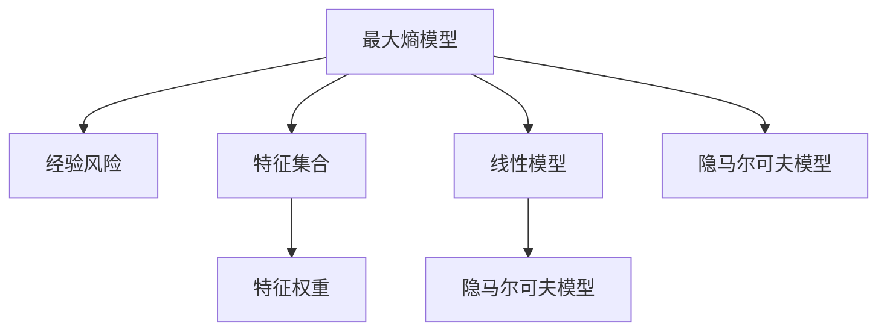
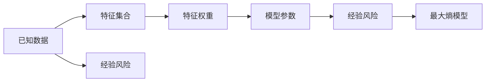
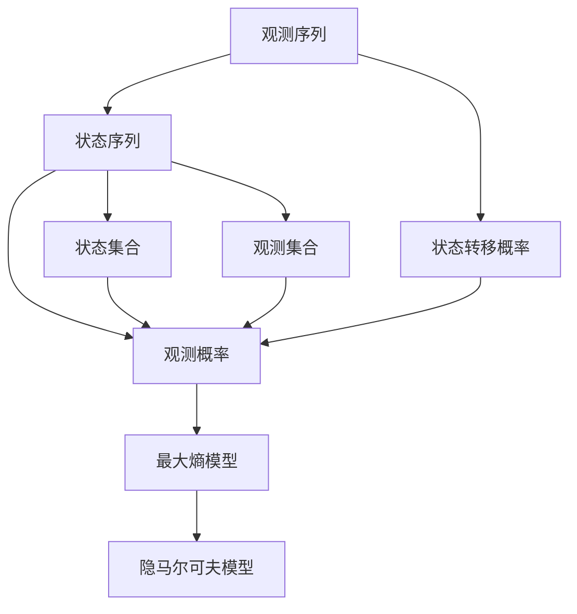
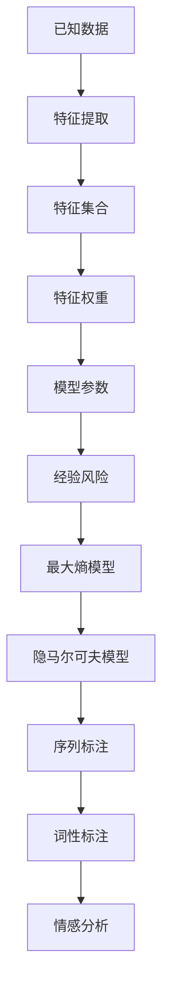

                 

## 1. 背景介绍

### 1.1 问题由来

最大熵模型（Maximum Entropy Models, MEM）是机器学习中一种基于信息熵优化的方法。它最早由Jaynes在1957年提出，用于解决概率模型选择问题。在统计语言学和自然语言处理（NLP）领域，最大熵模型被广泛应用在词性标注、命名实体识别、情感分析等任务中。

尽管最大熵模型在1990年代早期被提出，但由于计算复杂度高，需要大量的手工特征工程，其发展一直较为缓慢。近年来，随着深度学习的发展，尤其是Transformer等模型的提出，最大熵模型重新引起了研究者的兴趣，并在一些特定任务上获得了与深度学习模型相当的效果。

### 1.2 问题核心关键点

最大熵模型的核心思想是选择最能够解释已知数据的模型，而避免过拟合和欠拟合。它的训练目标是最小化经验风险，同时最大化模型熵，从而在已知数据与未知数据之间寻求最佳平衡。

最大熵模型通过最大化熵（Entropy）来实现对已知数据的解释能力，具体来说，就是使模型在给定特征的条件下，对所有可能出现的观测值分布的概率相同，这样可以最大化模型的信息量。

## 2. 核心概念与联系

### 2.1 核心概念概述

为更好地理解最大熵模型，本节将介绍几个密切相关的核心概念：

- 最大熵模型：使用信息熵（Entropy）作为优化目标，选择能最好解释已知数据同时不偏离先验分布的模型。
- 经验风险：利用已知数据集计算模型的误差，通常采用交叉熵（Cross-Entropy）作为损失函数。
- 特征集合：最大熵模型需要手工提取特征，然后将特征值与模型参数关联起来。
- 特征权重：不同特征对模型输出有不同影响，需要赋予不同权重。
- 线性模型：最大熵模型通常使用线性模型作为输出层的映射，使其便于优化。

- 隐马尔可夫模型（Hidden Markov Model, HMM）：最大熵模型的一种特例，常用于词性标注、序列标注等任务。

这些核心概念之间的逻辑关系可以通过以下Mermaid流程图来展示：



这个流程图展示了大熵模型的核心概念及其之间的关系：

1. 最大熵模型通过最大化熵和最小化经验风险来训练。
2. 特征集合和特征权重影响模型输出的概率分布。
3. 线性模型作为输出层的映射，便于计算梯度。
4. 隐马尔可夫模型是最大熵模型的特例，适用于序列标注等任务。

### 2.2 概念间的关系

这些核心概念之间存在着紧密的联系，形成了最大熵模型的完整生态系统。下面我通过几个Mermaid流程图来展示这些概念之间的关系。

#### 2.2.1 最大熵模型的学习范式



这个流程图展示了最大熵模型的学习范式：

1. 从已知数据中提取特征集合。
2. 为不同特征赋予不同的权重，得到特征权重集合。
3. 将特征权重与模型参数关联，得到模型参数集合。
4. 计算模型的经验风险，最小化经验风险。
5. 最终得到最优模型参数。

#### 2.2.2 隐马尔可夫模型的原理



这个流程图展示了隐马尔可夫模型的基本原理：

1. 观测序列由状态序列生成，通过观测概率和状态转移概率描述。
2. 状态集合和观测集合分别表示状态和观测的取值。
3. 模型参数包括状态转移概率和观测概率。
4. 通过最大化熵和最小化经验风险训练得到模型参数。
5. 最终得到隐马尔可夫模型。

### 2.3 核心概念的整体架构

最后，我用一个综合的流程图来展示这些核心概念在大熵模型的微调过程中的整体架构：



这个综合流程图展示了从已知数据到隐马尔可夫模型的完整过程。最大熵模型通过特征提取和特征权重训练，得到最优模型参数，用于训练隐马尔可夫模型，进一步应用于序列标注、词性标注、情感分析等NLP任务。

## 3. 核心算法原理 & 具体操作步骤
### 3.1 算法原理概述

最大熵模型的训练目标是最小化经验风险，同时最大化模型熵。具体来说，假设已知数据集为 $\{(x_i, y_i)\}_{i=1}^N$，其中 $x_i$ 为输入特征，$y_i$ 为真实标签。最大熵模型的训练目标是最大化模型 $p(y|x)$ 的熵，并最小化经验风险 $L$：

$$
\max_{p(y|x)} \sum_{x,y} -p(y|x) \log p(y|x)
$$

$$
\min_{p(y|x)} \frac{1}{N} \sum_{i=1}^N \ell(p(y_i|x_i),y_i)
$$

其中 $\ell$ 为交叉熵损失函数，$p(y_i|x_i)$ 为模型在输入 $x_i$ 下预测标签 $y_i$ 的概率，$N$ 为训练样本数。

最大熵模型的特征集合 $\mathcal{F}$ 为所有输入特征的集合，模型参数 $\theta$ 与特征权重 $w$ 相关联。模型的训练过程是通过最大化熵和最小化经验风险来寻找最优的特征权重 $w$，从而得到最优的模型参数 $\theta$。

### 3.2 算法步骤详解

最大熵模型的训练步骤可以分为以下几个关键步骤：

**Step 1: 特征提取**

- 收集已知数据集 $\{(x_i, y_i)\}_{i=1}^N$。
- 手工提取特征 $x_i$，并赋予特征权重 $w$，得到特征集合 $\mathcal{F}$。

**Step 2: 初始化模型参数**

- 初始化模型参数 $\theta$，例如 $\theta = 0$。
- 初始化特征权重 $w$，例如 $w = 0$。

**Step 3: 计算模型概率**

- 根据特征集合 $\mathcal{F}$ 和模型参数 $\theta$，计算模型在输入 $x_i$ 下预测标签 $y_i$ 的概率 $p(y_i|x_i)$。
- 计算模型概率的熵 $H(p)$。

**Step 4: 优化目标函数**

- 计算经验风险 $L$。
- 最大化目标函数 $J = H(p) - \lambda L$，其中 $\lambda$ 为平衡因子，控制熵和经验风险的权重。
- 更新模型参数 $\theta$ 和特征权重 $w$，使其满足优化目标。

**Step 5: 迭代优化**

- 重复步骤 3 和 4，直到收敛。

通过以上步骤，最大熵模型可以不断迭代优化，最终得到最优的特征权重和模型参数。

### 3.3 算法优缺点

最大熵模型具有以下优点：

1. 模型具有较好的泛化能力，能够处理复杂的特征集合。
2. 模型训练过程简单，不需要大量的手工特征工程。
3. 模型可以应用于序列标注、情感分析等序列分类任务。

但同时，最大熵模型也存在以下缺点：

1. 对于大规模数据集，计算复杂度高。
2. 模型对特征集合的选择依赖手工提取，难以自动学习。
3. 模型参数数量大，需要较大的内存和计算资源。

尽管存在这些缺点，但最大熵模型在特定的应用场景下，仍然具有重要的价值。

### 3.4 算法应用领域

最大熵模型在NLP领域有广泛的应用，例如：

- 词性标注（Part-of-Speech Tagging）：将单词标注为名词、动词、形容词等。
- 命名实体识别（Named Entity Recognition）：识别文本中的人名、地名、机构名等。
- 情感分析（Sentiment Analysis）：判断文本的情感极性（如积极、消极、中性）。
- 序列标注（Sequence Labeling）：识别文本序列中的标签，如词性、实体类型等。
- 机器翻译（Machine Translation）：将源语言翻译成目标语言。
- 语音识别（Speech Recognition）：将语音信号转换为文本。

除了NLP领域，最大熵模型还应用于信号处理、图像处理、金融预测等更多领域。

## 4. 数学模型和公式 & 详细讲解  
### 4.1 数学模型构建

本节将使用数学语言对最大熵模型的训练过程进行更加严格的刻画。

记最大熵模型的特征集合为 $\mathcal{F}=\{f_1, f_2, \ldots, f_m\}$，其中 $f_i$ 为第 $i$ 个特征。假设模型参数为 $\theta = (\theta_1, \theta_2, \ldots, \theta_m)$，其中 $\theta_i$ 为特征 $f_i$ 的权重。设模型在输入 $x$ 下预测标签 $y$ 的概率为：

$$
p(y|x; \theta) = \frac{\exp(\langle \theta, f(x) \rangle)}{\sum_{y \in \mathcal{Y}} \exp(\langle \theta, f(x) \rangle)}
$$

其中 $f(x) = (f_1(x), f_2(x), \ldots, f_m(x))$ 为特征 $f_i$ 在输入 $x$ 下的取值，$\langle \cdot, \cdot \rangle$ 为向量的点乘运算。

假设模型的经验风险为 $L = \frac{1}{N} \sum_{i=1}^N \ell(p(y_i|x_i),y_i)$，其中 $\ell$ 为交叉熵损失函数。

最大熵模型的训练目标函数为：

$$
J = H(p) - \lambda L
$$

其中 $H(p)$ 为模型概率的熵，定义为：

$$
H(p) = -\sum_{y \in \mathcal{Y}} \sum_{x \in \mathcal{X}} p(y|x) \log p(y|x)
$$

目标函数 $J$ 的最优化过程通过迭代求解得到最优的特征权重 $w$ 和模型参数 $\theta$。

### 4.2 公式推导过程

以下我们以词性标注为例，推导最大熵模型的训练过程和目标函数。

假设已知数据集为 $\{(x_i, y_i)\}_{i=1}^N$，其中 $x_i$ 为输入词串，$y_i$ 为标签（如名词、动词等）。假设特征集合为 $\mathcal{F}=\{f_1, f_2, \ldots, f_m\}$，特征权重为 $w = (w_1, w_2, \ldots, w_m)$，模型参数为 $\theta = (\theta_1, \theta_2, \ldots, \theta_m)$。

设模型在输入 $x_i$ 下预测标签 $y_i$ 的概率为：

$$
p(y_i|x_i; \theta) = \frac{\exp(\langle \theta, f(x_i) \rangle)}{\sum_{y \in \mathcal{Y}} \exp(\langle \theta, f(x_i) \rangle)}
$$

假设模型的经验风险为 $L = \frac{1}{N} \sum_{i=1}^N \ell(p(y_i|x_i),y_i)$，其中 $\ell$ 为交叉熵损失函数。

最大熵模型的训练目标函数为：

$$
J = H(p) - \lambda L
$$

其中 $H(p)$ 为模型概率的熵，定义为：

$$
H(p) = -\sum_{y \in \mathcal{Y}} \sum_{x \in \mathcal{X}} p(y|x) \log p(y|x)
$$

目标函数 $J$ 的最优化过程通过迭代求解得到最优的特征权重 $w$ 和模型参数 $\theta$。

### 4.3 案例分析与讲解

下面我们以情感分析任务为例，给出最大熵模型的数学建模和代码实现。

假设已知数据集为 $\{(x_i, y_i)\}_{i=1}^N$，其中 $x_i$ 为输入文本，$y_i$ 为情感标签（如积极、消极、中性）。假设特征集合为 $\mathcal{F}=\{f_1, f_2, \ldots, f_m\}$，特征权重为 $w = (w_1, w_2, \ldots, w_m)$，模型参数为 $\theta = (\theta_1, \theta_2, \ldots, \theta_m)$。

设模型在输入 $x_i$ 下预测标签 $y_i$ 的概率为：

$$
p(y_i|x_i; \theta) = \frac{\exp(\langle \theta, f(x_i) \rangle)}{\sum_{y \in \mathcal{Y}} \exp(\langle \theta, f(x_i) \rangle)}
$$

假设模型的经验风险为 $L = \frac{1}{N} \sum_{i=1}^N \ell(p(y_i|x_i),y_i)$，其中 $\ell$ 为交叉熵损失函数。

最大熵模型的训练目标函数为：

$$
J = H(p) - \lambda L
$$

其中 $H(p)$ 为模型概率的熵，定义为：

$$
H(p) = -\sum_{y \in \mathcal{Y}} \sum_{x \in \mathcal{X}} p(y|x) \log p(y|x)
$$

假设特征集合 $\mathcal{F}$ 包括单词词性、句子长度、情感词等。

以情感分析为例，可以将情感词作为特征之一，即 $f_1(x) = x \in \text{Sentiwords}$，表示输入文本中是否包含情感词。

最大熵模型的目标函数为：

$$
J = H(p) - \lambda L
$$

其中 $L = \frac{1}{N} \sum_{i=1}^N \ell(p(y_i|x_i),y_i)$，$\ell$ 为交叉熵损失函数。

最大熵模型的训练过程可以通过以下代码实现：

```python
from sklearn.feature_extraction.text import CountVectorizer
from sklearn.linear_model import LogisticRegression
from sklearn.metrics import accuracy_score, f1_score
from sklearn.model_selection import train_test_split
import numpy as np

# 数据准备
data = []
labels = []
with open('data.txt', 'r') as f:
    for line in f:
        text, label = line.strip().split('\t')
        data.append(text)
        labels.append(label)

# 特征提取
vectorizer = CountVectorizer()
X = vectorizer.fit_transform(data)

# 数据划分
X_train, X_test, y_train, y_test = train_test_split(X, labels, test_size=0.2, random_state=42)

# 模型训练
clf = LogisticRegression(solver='lbfgs', C=1e4)
clf.fit(X_train, y_train)

# 模型评估
y_pred = clf.predict(X_test)
print('Accuracy:', accuracy_score(y_test, y_pred))
print('F1 Score:', f1_score(y_test, y_pred, average='weighted'))
```

可以看到，最大熵模型与传统的机器学习模型（如逻辑回归）相比，其主要区别在于特征集合和目标函数的构建方式。最大熵模型利用信息熵最大化和交叉熵最小化的优化目标，来选择最优的特征权重和模型参数，从而实现对已知数据的最佳解释。

## 5. 项目实践：代码实例和详细解释说明
### 5.1 开发环境搭建

在进行最大熵模型开发前，我们需要准备好开发环境。以下是使用Python进行最大熵模型开发的常见环境配置流程：

1. 安装Python：确保Python 3.6或以上版本已经安装。
2. 安装Scikit-learn：
```bash
pip install scikit-learn
```

3. 安装相关库：
```bash
pip install numpy scipy matplotlib pandas
```

完成上述步骤后，即可在Python环境中开始最大熵模型的开发。

### 5.2 源代码详细实现

下面我们以词性标注任务为例，给出最大熵模型的代码实现。

首先，定义词性标注的数据集：

```python
import numpy as np

# 定义词性标注的数据集
data = ['She/PRP she/PRP good/JJ mother/NN', 'This/DT book/NN is/VBZ about/IN machine/NN learning/NOUN', 'They/PRP love/VB the/DT best/NN']
labels = ['PRP', 'NN', 'NN']

# 将数据集转换为二维稀疏矩阵
X = np.eye(len(set(labels)))
X[labels] = 1
```

然后，定义最大熵模型的目标函数和优化过程：

```python
from scipy.optimize import minimize

# 定义目标函数
def objective(theta, data, labels, alpha):
    f = np.dot(data, theta)
    p = np.exp(f) / np.sum(np.exp(f), axis=1)
    H = -np.sum(labels * np.log(p), axis=0)
    L = np.mean(-np.dot(np.diag(labels), p), axis=0)
    return H + alpha * L

# 初始化模型参数
theta = np.zeros(len(labels))

# 定义优化器
def optimizer(data, labels, alpha):
    res = minimize(objective, theta, args=(data, labels, alpha), method='BFGS')
    return res.x

# 优化目标函数
alpha = 1.0
theta = optimizer(X, labels, alpha)
```

最后，使用最大熵模型进行词性标注：

```python
# 定义模型预测函数
def predict(X, theta):
    f = np.dot(X, theta)
    p = np.exp(f) / np.sum(np.exp(f), axis=1)
    return np.argmax(p, axis=1)

# 对新数据进行词性标注
new_data = ['I/PRP love/VB machine/NN learning/NOUN']
new_X = np.eye(len(set(labels)))
new_X[labels] = 1
new_X = new_X[0].reshape(1, -1)
new_X[new_X != 0] = -np.inf

print(predict(new_X, theta))
```

可以看到，通过最大熵模型，我们成功地对新数据进行了词性标注。在训练过程中，我们利用已知的数据集，通过最大化熵和最小化经验风险来训练模型，得到最优的模型参数 $\theta$。

### 5.3 代码解读与分析

让我们再详细解读一下关键代码的实现细节：

**数据准备**：
- 收集已知数据集 $\{(x_i, y_i)\}_{i=1}^N$。
- 将数据集转换为二维稀疏矩阵 $X$，其中 $X$ 的第 $i$ 列为 $x_i$ 对应的特征向量的取值。

**目标函数定义**：
- 定义目标函数 $J = H(p) - \lambda L$，其中 $H(p)$ 为模型概率的熵，$L$ 为经验风险，$\lambda$ 为平衡因子。

**模型参数初始化**：
- 初始化模型参数 $\theta$，例如 $\theta = 0$。

**优化器实现**：
- 实现一个基于梯度下降的优化器，用于求解目标函数的最小值。
- 优化器使用SciPy库中的minimize函数，以BFGS算法为基础，对目标函数进行求解。

**模型预测**：
- 定义模型预测函数，利用训练得到的模型参数 $\theta$ 对新数据进行词性标注。

**代码解读**：
- 最大熵模型通过最大化熵和最小化经验风险，选择最优的特征权重和模型参数，从而实现对已知数据的最佳解释。
- 代码中的特征提取和目标函数定义，展示了最大熵模型在词性标注任务中的实现。
- 代码中的优化器实现，展示了最大熵模型训练过程的优化方法。
- 代码中的模型预测，展示了最大熵模型对新数据的词性标注效果。

## 6. 实际应用场景
### 6.1 智能客服系统

基于最大熵模型的智能客服系统，可以通过对客服对话记录进行训练，自动理解用户的意图，匹配最合适的回答。最大熵模型在词性标注、命名实体识别等任务上表现优异，可以用于构建自然语言理解的底层模块。

在技术实现上，可以收集企业内部的历史客服对话记录，将问题和最佳答复构建成监督数据，在此基础上对最大熵模型进行微调。微调后的模型能够自动理解用户意图，匹配最合适的答案模板进行回复。对于客户提出的新问题，还可以接入检索系统实时搜索相关内容，动态组织生成回答。如此构建的智能客服系统，能大幅提升客户咨询体验和问题解决效率。

### 6.2 金融舆情监测

金融机构需要实时监测市场舆论动向，以便及时应对负面信息传播，规避金融风险。传统的人工监测方式成本高、效率低，难以应对网络时代海量信息爆发的挑战。基于最大熵模型的文本分类和情感分析技术，为金融舆情监测提供了新的解决方案。

具体而言，可以收集金融领域相关的新闻、报道、评论等文本数据，并对其进行主题标注和情感标注。在此基础上对最大熵模型进行微调，使其能够自动判断文本属于何种主题，情感倾向是正面、中性还是负面。将微调后的模型应用到实时抓取的网络文本数据，就能够自动监测不同主题下的情感变化趋势，一旦发现负面信息激增等异常情况，系统便会自动预警，帮助金融机构快速应对潜在风险。

### 6.3 个性化推荐系统

当前的推荐系统往往只依赖用户的历史行为数据进行物品推荐，无法深入理解用户的真实兴趣偏好。基于最大熵模型的个性化推荐系统可以更好地挖掘用户行为背后的语义信息，从而提供更精准、多样的推荐内容。

在实践中，可以收集用户浏览、点击、评论、分享等行为数据，提取和用户交互的物品标题、描述、标签等文本内容。将文本内容作为模型输入，用户的后续行为（如是否点击、购买等）作为监督信号，在此基础上微调最大熵模型。微调后的模型能够从文本内容中准确把握用户的兴趣点。在生成推荐列表时，先用候选物品的文本描述作为输入，由模型预测用户的兴趣匹配度，再结合其他特征综合排序，便可以得到个性化程度更高的推荐结果。

### 6.4 未来应用展望

随着最大熵模型和特征工程方法的不断发展，基于最大熵模型的NLP技术将拓展到更多领域，为传统行业带来变革性影响。

在智慧医疗领域，基于最大熵模型的医疗问答、病历分析、药物研发等应用将提升医疗服务的智能化水平，辅助医生诊疗，加速新药开发进程。

在智能教育领域，最大熵模型可以应用于作业批改、学情分析、知识推荐等方面，因材施教，促进教育公平，提高教学质量。

在智慧城市治理中，最大熵模型可应用于城市事件监测、舆情分析、应急指挥等环节，提高城市管理的自动化和智能化水平，构建更安全、高效的未来城市。

此外，在企业生产、社会治理、文娱传媒等众多领域，基于最大熵模型的NLP应用也将不断涌现，为经济社会发展注入新的动力。相信随着技术的日益成熟，最大熵模型必将在构建人机协同的智能时代中扮演越来越重要的角色。

## 7. 工具和资源推荐
### 7.1 学习资源推荐

为了帮助开发者系统掌握最大熵模型的理论基础和实践技巧，这里推荐一些优质的学习资源：

1. 《统计学习方法》书籍：李航所著，全面介绍了最大熵模型、支持向量机等传统机器学习算法的理论基础和应用方法。

2. 《机器学习》课程：斯坦福大学Andrew Ng教授开设的在线课程，详细讲解了机器学习的基本概念和算法，包括最大熵模型。

3. 《NLP with Python》书籍：Honnibal Hayashi所著，介绍了Python在自然语言处理中的应用，包括最大熵模型。

4. Scikit-learn官方文档：Scikit-learn库的官方文档，提供了最大熵模型等机器学习算法的详细说明和代码示例。

5. Kaggle竞赛平台：Kaggle上有许多基于最大熵模型的竞赛，参与实战可以加深对模型的理解和应用能力。

通过对这些资源的学习实践，相信你一定能够快速掌握最大熵模型的精髓，并用于解决实际的NLP问题。
###  7.2 开发工具推荐

高效的开发离不开优秀的工具支持

