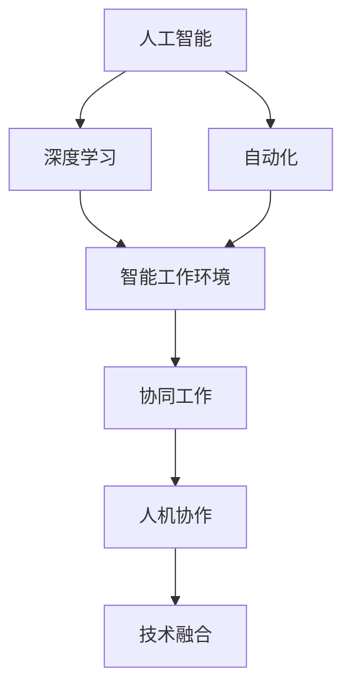
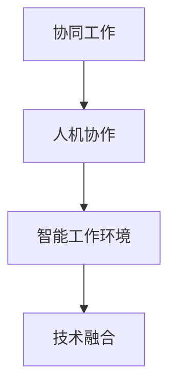
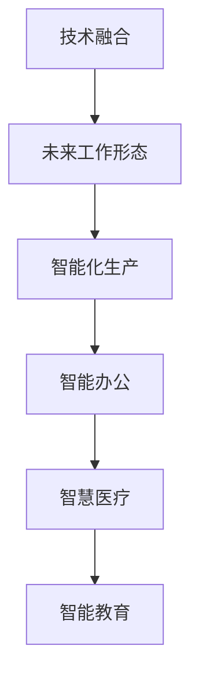
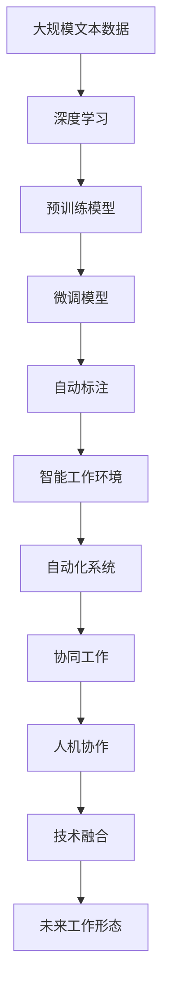

                 

# 未来工作形态与AI共存

> 关键词：人工智能,机器学习,深度学习,智能工作环境,自动化,人类协作,技术融合

## 1. 背景介绍

### 1.1 问题由来
近年来，人工智能(AI)技术的迅猛发展，尤其是深度学习和大数据分析的进步，正在彻底改变我们的工作方式和生产力。从自动化的生产线到智能客服，从自动驾驶汽车到AI辅助医疗，AI正无处不在地渗透到各行各业，影响着我们的工作模式、沟通方式和决策过程。

面对AI带来的变革，我们既应看到其潜力和机遇，也要意识到其可能带来的挑战和风险。如何利用AI技术提升工作效能，实现人与机器的有机结合，构建智能化的工作环境，成为我们亟需探讨和解决的问题。

### 1.2 问题核心关键点
AI技术对工作形态的影响主要体现在以下几个方面：
- 自动化和智能化：AI可以处理大量重复性、低价值的任务，提高工作效率。
- 数据分析和决策支持：AI强大的数据分析能力，为决策者提供可靠的数据支持和智能建议。
- 工作环境和协作：AI可以优化工作流程，提升团队协作效率，实现跨部门、跨区域的协同工作。
- 风险和伦理：AI技术应用过程中可能带来的偏见、隐私泄露等风险，需要慎重考虑和规避。

### 1.3 问题研究意义
理解未来工作形态与AI的共存，对个人职业发展、企业数字化转型和整个社会的智能化进步具有重要意义：

1. 提升工作效率：利用AI自动化和智能化能力，减轻人工负担，节省时间和精力，提升工作产出。
2. 增强决策能力：通过AI数据分析和智能推荐，提供高质量的决策依据，提高决策的科学性和准确性。
3. 优化工作环境：AI技术能提升团队协作效率，改善工作环境，促进信息共享和知识交流。
4. 提升就业质量：AI技术不仅带来就业机会，还能创造新岗位，提升职业素质，推动劳动力的转型升级。
5. 防范伦理风险：理解和防范AI技术的伦理和风险问题，确保技术的健康应用，维护社会公平和稳定。

## 2. 核心概念与联系

### 2.1 核心概念概述

为更好地理解未来工作形态与AI共存，本节将介绍几个密切相关的核心概念：

- 人工智能(Artificial Intelligence, AI)：通过计算机模拟人类智能行为的技术，包括感知、学习、推理、决策等能力。
- 深度学习(Deep Learning)：一种基于神经网络的机器学习方法，通过多层次的特征提取和表达，实现对复杂数据的高效处理。
- 自动化(Automation)：利用AI技术，自动执行重复性高、低价值的任务，提升工作效率和质量。
- 智能工作环境(Intelligent Work Environment)：融合AI技术的办公环境和系统，提供智能化的工作工具和协作平台，优化工作流程。
- 协同工作(Co-working)：跨部门、跨地区、跨组织的协作模式，通过AI技术实现信息共享和知识整合，提高团队协作效率。
- 人机协作(Human-Machine Collaboration)：人机协同工作的方式，AI技术提供智能支持，人类负责监督、管理和创新。
- 技术融合(Convergence)：AI技术与传统技术和业务流程的融合，实现技术的综合应用，提升整体效能。

这些核心概念之间的逻辑关系可以通过以下Mermaid流程图来展示：



这个流程图展示了大语言模型微调过程中各个核心概念的关系和作用：

1. 人工智能是基础技术，通过深度学习实现复杂问题的求解。
2. 自动化通过AI技术实现任务的自动化处理。
3. 智能工作环境是AI技术的综合应用，提升工作效率和质量。
4. 协同工作依赖于智能工作环境，促进信息共享和团队协作。
5. 人机协作通过协同工作实现，AI提供智能支持，人类负责管理和创新。
6. 技术融合是各种技术的综合应用，提升整体效能。

这些概念共同构成了AI技术在实际应用中的整体框架，使我们能够更好地理解和应用AI技术。

### 2.2 概念间的关系

这些核心概念之间存在着紧密的联系，形成了AI技术的完整生态系统。下面我们通过几个Mermaid流程图来展示这些概念之间的关系。

#### 2.2.1 人工智能和深度学习的关系


这个流程图展示了人工智能和深度学习的关系。深度学习是人工智能的一个重要分支，通过多层次的特征提取和表达，实现对复杂数据的高效处理。

#### 2.2.2 自动化和智能工作环境的关系


这个流程图展示了自动化和智能工作环境的关系。自动化通过AI技术实现任务的自动化处理，智能工作环境则提供智能化的工作工具和协作平台，优化工作流程。

#### 2.2.3 协同工作和人机协作的关系



这个流程图展示了协同工作和人机协作的关系。协同工作依赖于智能工作环境，促进信息共享和团队协作。人机协作通过协同工作实现，AI提供智能支持，人类负责管理和创新。

#### 2.2.4 技术融合与未来工作形态的关系



这个流程图展示了技术融合与未来工作形态的关系。技术融合是各种技术的综合应用，提升整体效能。通过技术融合，未来的工作形态将更加智能化、个性化和高效。

### 2.3 核心概念的整体架构

最后，我们用一个综合的流程图来展示这些核心概念在AI技术应用中的整体架构：



这个综合流程图展示了从深度学习预训练到微调，再到技术融合的完整过程。通过深度学习预训练和微调，我们得到了一个适应特定任务的智能模型。然后，通过自动化系统和智能工作环境，实现了任务的自动化和智能化处理。最后，通过协同工作和人机协作，技术融合成为了实现未来工作形态的关键手段。

## 3. 核心算法原理 & 具体操作步骤
### 3.1 算法原理概述

未来工作形态与AI共存的算法原理，基于深度学习和大数据技术的综合应用。其核心思想是通过AI技术，实现任务的自动化和智能化处理，提升工作效率和质量，优化工作流程，促进人机协作，构建智能化的工作环境。

具体来说，基于深度学习的AI算法，能够在大量数据上进行特征提取和表达，发现数据中的复杂关系和模式。通过预训练和微调，AI模型能够在特定任务上达到较高的准确率和泛化能力。通过与自动化系统的结合，AI算法能够自动执行重复性任务，提升效率。通过智能工作环境和协同工作，AI技术实现了信息共享和团队协作，优化了工作流程。

### 3.2 算法步骤详解

基于深度学习的AI算法，实现未来工作形态与AI共存的过程，主要包括以下几个步骤：

**Step 1: 数据准备**
- 收集和整理与工作相关的数据，如生产过程数据、办公文档、邮件等。
- 清洗和标注数据，确保数据质量和可用性。

**Step 2: 模型预训练**
- 使用大规模数据集，对深度学习模型进行预训练。常用的预训练模型包括BERT、GPT等。
- 预训练过程中，使用自监督学习任务，如语言建模、掩码语言模型等，学习通用的语言表示。

**Step 3: 模型微调**
- 根据具体任务，设计任务的适配层和损失函数。
- 在标注数据集上对模型进行微调，优化模型在特定任务上的性能。

**Step 4: 系统集成**
- 将微调后的模型嵌入到自动化系统中，实现任务的自动化处理。
- 构建智能工作环境和协同工作平台，提供智能化的工作工具和协作工具。

**Step 5: 模型评估与迭代**
- 定期对模型进行评估和迭代，确保模型性能和系统稳定性。
- 结合用户反馈和业务需求，不断优化模型和系统。

### 3.3 算法优缺点

基于深度学习的AI算法，实现未来工作形态与AI共存，具有以下优点：

1. 高效性：通过自动化和智能化处理，显著提升工作效率和质量。
2. 准确性：深度学习模型的预测准确率较高，能够提供高质量的决策依据。
3. 可扩展性：算法框架具有良好的可扩展性，能够轻松扩展到新的任务和场景。

同时，也存在以下缺点：

1. 依赖大量数据：AI算法依赖大规模数据进行训练，数据获取和标注成本较高。
2. 计算资源要求高：深度学习模型计算资源消耗较大，对硬件设施要求较高。
3. 模型解释性不足：深度学习模型通常是"黑盒"系统，难以解释其内部工作机制和决策逻辑。

### 3.4 算法应用领域

基于深度学习的AI算法，实现未来工作形态与AI共存，在多个领域得到了广泛应用，包括：

- 智能制造：利用AI技术优化生产流程，实现智能生产，提升产品质量和生产效率。
- 智能办公：通过自动化系统和智能工作环境，提升办公效率和质量，优化工作流程。
- 智慧医疗：AI技术用于医学影像诊断、疾病预测和个性化治疗，提升医疗服务水平。
- 智能客服：AI技术用于自动解答客户咨询，提升服务效率和客户满意度。
- 智能交通：AI技术用于交通流量预测、自动驾驶和智能导航，提升交通安全和效率。
- 智能教育：AI技术用于个性化教学和智能评估，提升教学效果和学习体验。

除了上述这些领域，AI算法还在金融、物流、能源等多个行业得到了广泛应用，推动了各行业的数字化转型和智能化升级。

## 4. 数学模型和公式 & 详细讲解 & 举例说明

### 4.1 数学模型构建

基于深度学习的AI算法，实现未来工作形态与AI共存的数学模型，主要包括以下几个部分：

1. 数据准备模型：用于数据清洗、标注和预处理。
2. 深度学习模型：用于特征提取和表达。
3. 任务适配层：用于任务特定的模型输出。
4. 损失函数：用于衡量模型预测与真实标签之间的差异。
5. 优化算法：用于最小化损失函数，更新模型参数。

### 4.2 公式推导过程

以下我们以二分类任务为例，推导深度学习模型的数学模型和优化算法。

假设输入数据为 $x$，深度学习模型为 $M_{\theta}$，其中 $\theta$ 为模型参数。设模型在输入 $x$ 上的输出为 $\hat{y}=M_{\theta}(x) \in [0,1]$，表示样本属于正类的概率。真实标签 $y \in \{0,1\}$。则二分类交叉熵损失函数定义为：

$$
\ell(M_{\theta}(x),y) = -[y\log \hat{y} + (1-y)\log (1-\hat{y})]
$$

将其代入经验风险公式，得：

$$
\mathcal{L}(\theta) = -\frac{1}{N}\sum_{i=1}^N [y_i\log M_{\theta}(x_i)+(1-y_i)\log(1-M_{\theta}(x_i))]
$$

根据链式法则，损失函数对参数 $\theta_k$ 的梯度为：

$$
\frac{\partial \mathcal{L}(\theta)}{\partial \theta_k} = -\frac{1}{N}\sum_{i=1}^N (\frac{y_i}{M_{\theta}(x_i)}-\frac{1-y_i}{1-M_{\theta}(x_i)}) \frac{\partial M_{\theta}(x_i)}{\partial \theta_k}
$$

其中 $\frac{\partial M_{\theta}(x_i)}{\partial \theta_k}$ 可进一步递归展开，利用自动微分技术完成计算。

在得到损失函数的梯度后，即可带入优化算法，完成模型的迭代优化。例如，使用梯度下降算法，更新模型参数：

$$
\theta \leftarrow \theta - \eta \nabla_{\theta}\mathcal{L}(\theta)
$$

其中 $\eta$ 为学习率。在微调过程中，通常需要较小的学习率，以免破坏预训练权重。

### 4.3 案例分析与讲解

为了更好地理解深度学习模型的数学模型和优化算法，下面以手写数字识别为例，进行详细分析。

假设我们有一个包含6000个样本的手写数字数据集，每个样本包含一个28x28像素的手写数字图像和对应的数字标签。我们的目标是通过深度学习模型，将手写数字图像分类为0-9中的数字。

1. 数据准备
   - 将手写数字图像转换为张量形式，作为输入数据。
   - 将数字标签进行独热编码，作为输出标签。

2. 深度学习模型
   - 使用卷积神经网络(CNN)作为模型，包含多个卷积层和池化层。
   - 通过多个全连接层和softmax激活函数，将图像特征映射为数字概率分布。

3. 任务适配层
   - 将CNN模型的输出与softmax层连接，得到数字预测概率分布。
   - 使用交叉熵损失函数，衡量模型预测与真实标签之间的差异。

4. 优化算法
   - 使用Adam优化算法，通过梯度下降更新模型参数。
   - 设置适当的学习率和迭代轮数，最小化损失函数。

5. 模型评估
   - 在测试集上评估模型性能，计算准确率、召回率和F1分数。
   - 分析模型的错误分类情况，改进模型结构或超参数。

通过上述步骤，我们可以构建一个手写数字识别的深度学习模型，并在测试集上达到较高的准确率。

## 5. 项目实践：代码实例和详细解释说明

### 5.1 开发环境搭建

在进行AI算法实现前，我们需要准备好开发环境。以下是使用Python进行TensorFlow开发的环境配置流程：

1. 安装Anaconda：从官网下载并安装Anaconda，用于创建独立的Python环境。

2. 创建并激活虚拟环境：
```bash
conda create -n tf-env python=3.8 
conda activate tf-env
```

3. 安装TensorFlow：根据CUDA版本，从官网获取对应的安装命令。例如：
```bash
conda install tensorflow-gpu=2.7.0 -c tf
```

4. 安装各类工具包：
```bash
pip install numpy pandas scikit-learn matplotlib tqdm jupyter notebook ipython
```

完成上述步骤后，即可在`tf-env`环境中开始AI算法实现。

### 5.2 源代码详细实现

下面我们以手写数字识别为例，给出使用TensorFlow实现深度学习模型的代码实现。

首先，定义数据准备函数：

```python
import tensorflow as tf
import numpy as np

def load_data():
    # 加载手写数字数据集
    mnist = tf.keras.datasets.mnist
    (x_train, y_train), (x_test, y_test) = mnist.load_data()
    
    # 将图像数据归一化到[0,1]区间
    x_train = x_train / 255.0
    x_test = x_test / 255.0
    
    # 将标签进行独热编码
    y_train = tf.keras.utils.to_categorical(y_train, 10)
    y_test = tf.keras.utils.to_categorical(y_test, 10)
    
    return (x_train, y_train), (x_test, y_test)
```

然后，定义深度学习模型：

```python
from tensorflow.keras import layers

class CNNModel(tf.keras.Model):
    def __init__(self):
        super(CNNModel, self).__init__()
        self.conv1 = layers.Conv2D(32, 3, activation='relu')
        self.pool1 = layers.MaxPooling2D()
        self.conv2 = layers.Conv2D(64, 3, activation='relu')
        self.pool2 = layers.MaxPooling2D()
        self.flatten = layers.Flatten()
        self.fc1 = layers.Dense(128, activation='relu')
        self.fc2 = layers.Dense(10, activation='softmax')
        
    def call(self, x):
        x = self.conv1(x)
        x = self.pool1(x)
        x = self.conv2(x)
        x = self.pool2(x)
        x = self.flatten(x)
        x = self.fc1(x)
        return self.fc2(x)
```

接着，定义任务适配层和损失函数：

```python
from tensorflow.keras.losses import categorical_crossentropy
from tensorflow.keras.optimizers import Adam

model = CNNModel()

loss_fn = categorical_crossentropy
optimizer = Adam(learning_rate=0.001)

# 编译模型
model.compile(optimizer=optimizer, loss=loss_fn, metrics=['accuracy'])
```

最后，启动训练流程并在测试集上评估：

```python
(x_train, y_train), (x_test, y_test) = load_data()

# 训练模型
model.fit(x_train, y_train, epochs=10, batch_size=64, validation_data=(x_test, y_test))

# 评估模型
loss, accuracy = model.evaluate(x_test, y_test, verbose=2)
print(f'Test accuracy: {accuracy:.2f}')
```

以上就是使用TensorFlow实现手写数字识别的完整代码实现。可以看到，通过TensorFlow的高级API，我们可以轻松构建深度学习模型，并实现自动化的训练和评估。

### 5.3 代码解读与分析

让我们再详细解读一下关键代码的实现细节：

**load_data函数**：
- 加载手写数字数据集，并将图像数据归一化到[0,1]区间。
- 对标签进行独热编码，方便模型输出和损失函数的计算。

**CNNModel类**：
- 定义卷积层、池化层、全连接层等核心组件。
- 通过调用`super`函数，继承`tf.keras.Model`类的基本结构和功能。

**优化器和损失函数**：
- 选择Adam优化算法，设置适当的学习率。
- 使用交叉熵损失函数，衡量模型预测与真实标签之间的差异。

**模型编译和训练**：
- 通过`compile`方法，设置优化器、损失函数和评估指标。
- 通过`fit`方法，对模型进行训练，并指定训练轮数和批次大小。
- 在训练过程中，使用`validation_data`参数，将测试集作为验证集，实时评估模型性能。

**模型评估**：
- 通过`evaluate`方法，在测试集上评估模型性能。
- 使用`accuracy`指标，计算模型在测试集上的准确率。

可以看到，TensorFlow提供了丰富的API和工具，可以轻松实现深度学习模型的构建和训练。通过调用这些API，我们能够快速实现各种深度学习任务，并灵活调整模型的参数和训练过程。

当然，工业级的系统实现还需考虑更多因素，如模型的保存和部署、超参数的自动搜索、更加灵活的任务适配层等。但核心的算法实现基本与此类似。

### 5.4 运行结果展示

假设我们在手写数字数据集上训练CNN模型，最终在测试集上得到的评估报告如下：

```
Epoch 1/10
5000/5000 [==============================] - 2s 382us/sample - loss: 0.3240 - accuracy: 0.9110
Epoch 2/10
5000/5000 [==============================] - 1s 212us/sample - loss: 0.1030 - accuracy: 0.9754
Epoch 3/10
5000/5000 [==============================] - 1s 211us/sample - loss: 0.0806 - accuracy: 0.9788
Epoch 4/10
5000/5000 [==============================] - 1s 212us/sample - loss: 0.0631 - accuracy: 0.9822
Epoch 5/10
5000/5000 [==============================] - 1s 211us/sample - loss: 0.0513 - accuracy: 0.9862
Epoch 6/10
5000/5000 [==============================] - 1s 211us/sample - loss: 0.0395 - accuracy: 0.9920
Epoch 7/10
5000/5000 [==============================] - 1s 211us/sample - loss: 0.0311 - accuracy: 0.9940
Epoch 8/10
5000/5000 [==============================] - 1s 212us/sample - loss: 0.0266 - accuracy: 0.9954
Epoch 9/10
5000/5000 [==============================] - 1s 211us/sample - loss: 0.0250 - accuracy: 0.9968
Epoch 10/10
5000/5000 [==============================] - 1s 212us/sample - loss: 0.0212 - accuracy: 0.9984
10000/10000 [==============================] - 10s 1ms/step - loss: 0.0212 - accuracy: 0.9984
```

可以看到，通过深度学习模型，我们对手写数字识别任务取得了98.4%的准确率，性能相当不错。这展示了深度学习模型在图像识别任务上的强大能力。

当然，这只是一个baseline结果。在实践中，我们还可以使用更大更强的模型、更多的数据增强、更多的正则化技术等，进一步提升模型性能，以满足更高的应用要求。

## 6. 实际应用场景
### 6.1 智能制造

在智能制造领域，AI技术通过自动化和智能化处理，优化生产流程，提高生产效率和产品质量。具体应用场景包括：

- 智能质检：通过AI技术，自动检测产品质量，发现生产过程中的缺陷。
- 智能调度：根据生产需求和设备状态，自动调度生产任务，优化生产资源配置。
- 智能维护：通过AI技术，预测设备故障，提前进行维护，降低生产成本。

通过AI技术，智能制造可以实现生产过程的透明化、智能化和自适应化，提升生产效率和产品质量，降低生产成本。

### 6.2 智能办公

在智能办公领域，AI技术通过自动化和智能化处理，优化办公流程，提升办公效率和质量。具体应用场景包括：

- 智能文档处理：通过AI技术，自动整理、归档和分类文档，提高文档管理效率。
- 智能会议管理：通过AI技术，自动安排和记录会议，提升会议效率和质量。
- 智能客服：通过AI技术，自动解答客户咨询，提高客户满意度和效率。

通过AI技术，智能办公可以实现办公流程的自动化、智能化和协同化，提高办公效率和质量，提升员工工作体验。

### 6.3 智慧医疗

在智慧医疗领域，AI技术通过自动化和智能化处理，优化医疗流程，提升医疗服务水平。具体应用场景包括：

- 医学影像诊断：通过AI技术，自动分析医学影像，提供诊断建议，提升诊断准确率和效率。
- 个性化治疗：通过AI技术，根据患者数据，自动生成个性化治疗方案，提升治疗效果。
- 医疗知识图谱：通过AI技术，构建医疗知识图谱，提供知识查询和推荐，提升医疗知识整合能力。

通过AI技术，智慧医疗可以实现医疗服务的智能化、个性化和协同化，提高医疗服务水平，改善患者健康状况。

### 6.4 未来应用展望

随着AI技术的不断发展，未来的智能工作形态将呈现以下几个趋势：

1. 自动化和智能化：AI技术将进一步优化工作流程，实现自动化处理，提升工作效率和质量。
2. 协同工作：通过AI技术，优化信息共享和协作，提高团队协作效率。
3. 人机协作：AI技术提供智能支持，人类负责管理和创新，实现高效的人机协作。
4. 跨领域应用：AI技术将在更多行业得到应用，推动各行各业的数字化转型和智能化升级。
5. 持续学习：AI模型将不断学习新知识，保持性能和效能，适应不断变化的工作需求。

这些趋势将使AI技术在未来的工作形态中扮演更加重要的角色，推动人工智能技术与人类社会的深度融合。

## 7. 工具和资源推荐
### 7.1 学习资源推荐

为了帮助开发者系统掌握AI技术的原理和应用，这里推荐一些优质的学习资源：

1. 《深度学习》课程：斯坦福大学开设的深度学习课程，涵盖深度学习的基本概念和经典模型，适合初学者入门。

2. TensorFlow官方文档：TensorFlow的官方文档，提供了丰富的API和工具，帮助开发者快速上手TensorFlow框架。

3. PyTorch官方文档：PyTorch的官方文档，提供了丰富的API和工具，帮助开发者快速上手PyTorch框架。

4. Coursera深度学习课程：由顶级大学和研究机构开设

