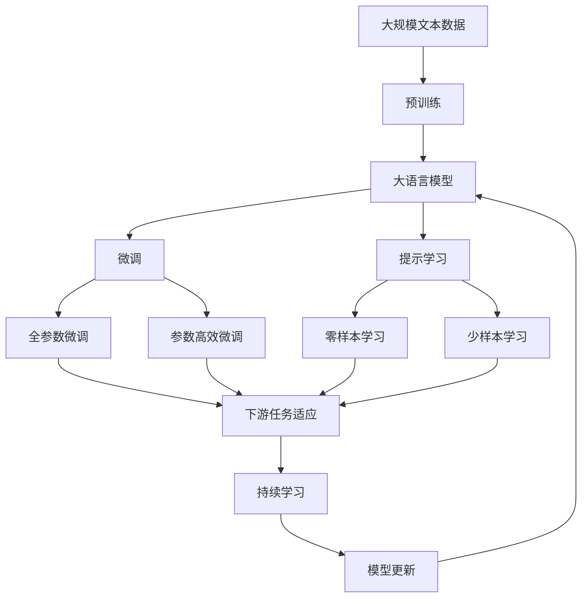

                 

# 未来工作形态与AI共存的趋势

## 1. 背景介绍

### 1.1 问题由来

随着人工智能（AI）技术的发展，未来工作形态正在经历深刻变革。AI的广泛应用，不仅改变了传统的生产方式，还对人类社会产生了深远影响。在过去几十年中，AI从基础研究走向应用，成为推动各行各业发展的强大力量。尤其在当前数字化转型的大背景下，AI技术的深入应用加速了各领域自动化和智能化的进程。

### 1.2 问题核心关键点

未来工作形态与AI共存的关键点在于AI技术如何重塑工作环境、工作流程和人力资源。这包括：
1. **自动化与协作**：AI在替代重复性、低价值工作的同时，与人类协作完成更复杂、创新性高的任务。
2. **技能与教育**：AI的引入改变了对技能的要求，促使劳动者不断提升技能以适应新环境。
3. **数据与隐私**：数据驱动的AI系统在带来高效生产的同时，也引发了对隐私和数据安全的关注。
4. **伦理与责任**：AI决策的透明度、责任归属等问题成为社会伦理的重要考量。
5. **就业与失业**：AI对就业市场的影响，包括岗位减少、新岗位出现等，引发了广泛讨论。
6. **工作灵活性与效率**：AI使远程工作、弹性工作时间等成为可能，改变了传统的工作模式。

这些核心关键点共同构成了未来工作形态与AI共存的多维面貌。

### 1.3 问题研究意义

深入探讨未来工作形态与AI共存的趋势，具有重要意义：
1. **促进产业升级**：理解AI如何改变产业结构，助力企业提升生产效率和竞争力。
2. **指导人才培养**：明确AI时代对技能和教育的新要求，为教育机构和培训机构提供方向。
3. **解决就业问题**：预见AI对就业市场的潜在影响，制定有效应对措施。
4. **保障数据安全**：强化数据隐私保护，确保AI技术的安全应用。
5. **推动伦理进步**：在AI的普及过程中，建立合理的伦理规范和责任体系。

## 2. 核心概念与联系

### 2.1 核心概念概述

未来工作形态与AI共存涉及多个核心概念，包括：
- **人工智能（AI）**：通过算法和数据驱动，实现自动化决策和执行的智能系统。
- **自动化**：指机器或软件系统自动执行人类工作任务，以提高效率和精度。
- **增强现实（AR）**：通过计算机视觉、传感器等技术，增强用户在现实环境中的信息感知。
- **人类与机器协作（Human-Machine Collaboration）**：AI与人类在任务执行中的紧密协作。
- **工作自动化**：指通过AI技术替代或辅助完成人类工作任务。
- **机器学习（ML）**：让机器通过数据学习并自动改进的算法。
- **大数据**：指通过先进技术手段收集、存储和分析海量数据。
- **智能优化**：通过AI技术实现复杂系统的优化和决策。
- **知识图谱**：以图谱形式组织和表示知识，便于AI系统理解和推理。
- **人机交互**：指人与AI系统之间的交互方式和界面设计。
- **数据隐私和安全**：确保数据在存储、处理和传输过程中的安全和隐私保护。
- **职业伦理**：在AI应用中，确保技术行为符合职业道德和社会规范。

这些核心概念相互关联，共同构成未来工作形态与AI共存的多维度体系。

### 2.2 概念间的关系

这些核心概念之间的关系可以通过以下Mermaid流程图来展示：

```mermaid
graph TB
    A[人工智能(AI)] --> B[自动化] --> C[增强现实(AR)]
    A --> D[机器学习(ML)] --> E[智能优化] --> F[知识图谱] --> G[大数据]
    A --> H[人机交互] --> I[数据隐私和安全] --> J[职业伦理]
```

这个流程图展示了AI技术与各个相关概念的联系，包括自动化、增强现实、机器学习、智能优化、知识图谱、大数据、人机交互、数据隐私和安全、职业伦理等。

### 2.3 核心概念的整体架构

最后，我们用一个综合的流程图来展示这些核心概念在大语言模型微调过程中的整体架构：



这个综合流程图展示了从预训练到微调，再到持续学习的完整过程，以及各个概念在大语言模型微调中的应用。

## 3. 核心算法原理 & 具体操作步骤

### 3.1 算法原理概述

未来工作形态与AI共存的原理，可以概括为以下几个方面：

1. **自动化与协作**：AI通过自动化技术，替代重复性、低价值的工作任务，并将人类从这些任务中解放出来，专注于创造性、复杂性高的工作。人类与AI系统通过协作，共同完成更复杂的任务，实现工作流程的优化。

2. **技能与教育**：随着AI技术的发展，对劳动者技能的要求也在不断变化。劳动者需要不断学习新技能，适应新的工作环境和AI系统的应用。教育机构也需要根据市场需求，调整课程设置和教学方法。

3. **数据与隐私**：AI系统依赖大量数据进行训练和推理，数据的收集、存储和分析对隐私和安全提出了新的挑战。如何在保证数据隐私和安全的前提下，高效利用数据驱动AI系统，成为关键问题。

4. **伦理与责任**：AI系统的决策过程、结果和责任归属等伦理问题，需要在技术设计和社会规范中得到充分考虑。确保AI系统的透明度和可解释性，保障用户的知情权和决策权。

5. **就业与失业**：AI技术的普及，可能会导致某些岗位的消失，但也会创造出新的就业机会。如何平衡自动化与就业的关系，成为政策制定和社会管理的重要课题。

### 3.2 算法步骤详解

未来工作形态与AI共存的算法步骤，可以分为以下几个关键步骤：

1. **自动化与协作的实现**：选择适合的AI技术（如机器学习、自然语言处理、机器人技术等），设计和实现自动化系统，并设计人机协作机制，使人类与AI系统能够高效协同工作。

2. **技能与教育的调整**：分析AI技术对技能的要求，调整教育培训内容和方法，提升劳动者的适应能力和创新能力。

3. **数据与隐私的保护**：设计数据收集、存储、处理的安全措施，确保数据隐私和安全。同时，设计数据治理和伦理审查机制，确保数据使用的合规性和透明性。

4. **伦理与责任的规范**：在AI系统的设计和应用中，建立透明的决策过程和责任体系，确保AI系统的决策可解释、可审查。

5. **就业与失业的平衡**：制定政策，引导和支持劳动者向高技能、高附加值的工作岗位转移，同时提供转岗培训和职业指导服务，缓解就业市场的变化。

### 3.3 算法优缺点

未来工作形态与AI共存的算法优点包括：
- **提升效率**：自动化和协作系统可以大幅提升工作效率和质量，减少人为错误。
- **创新能力**：人类与AI系统的协作，可以激发新的创意和解决方案，推动创新。
- **数据驱动**：数据驱动的AI系统可以实时监测和优化工作流程，提供精确的决策支持。

缺点则主要包括：
- **技能差距**：劳动者需要适应新的技能要求，可能会遇到技能转变和职业培训的挑战。
- **隐私风险**：数据收集和处理过程中可能存在的隐私泄露和数据滥用风险。
- **伦理问题**：AI系统的决策透明度和责任归属问题，可能引发伦理争议和法律纠纷。
- **就业问题**：自动化可能导致某些岗位的减少，需要政府和社会进行积极应对。

### 3.4 算法应用领域

未来工作形态与AI共存的应用领域非常广泛，包括但不限于：

1. **制造业**：通过AI技术实现自动化生产、智能质检、供应链优化等，提升生产效率和产品质量。

2. **医疗健康**：利用AI进行疾病诊断、治疗方案推荐、健康监测等，改善医疗服务质量和患者体验。

3. **金融服务**：使用AI进行风险评估、客户服务、欺诈检测等，提升金融服务的效率和安全性。

4. **交通出行**：通过AI技术实现智能交通管理、自动驾驶、出行规划等，提升交通系统的运行效率和安全性。

5. **教育培训**：利用AI进行个性化教学、学习分析、智能评估等，提升教育效果和培训质量。

6. **城市管理**：应用AI技术进行城市规划、环境监测、应急响应等，提升城市治理的智能化水平。

## 4. 数学模型和公式 & 详细讲解 & 举例说明

### 4.1 数学模型构建

未来工作形态与AI共存的数学模型，可以构建为以下几个部分：

1. **自动化与协作模型**：描述自动化系统的功能和协作机制，包括任务分配、决策过程和反馈机制。

2. **技能与教育模型**：描述劳动者的技能需求、教育培训过程和效果评估。

3. **数据与隐私模型**：描述数据收集、存储、处理和使用的过程，以及隐私保护和数据安全的措施。

4. **伦理与责任模型**：描述AI系统的决策透明度、责任归属和伦理规范。

5. **就业与失业模型**：描述AI技术对就业市场的影响，包括岗位变化、就业机会、失业风险等。

### 4.2 公式推导过程

以下是一些基础公式的推导过程：

1. **自动化与协作模型**：

   假设有一个简单的自动化系统，其工作效率为 $E$，人类工作效率为 $H$，协作效率为 $C$。则有：

   $$
   E = A \times H - B
   $$

   其中 $A$ 是自动化技术的效率提升因子，$B$ 是自动化系统引入的额外成本。

   协作效率 $C$ 可以表示为：

   $$
   C = H \times A
   $$

2. **技能与教育模型**：

   假设劳动者初始技能水平为 $S_0$，通过培训提升的技能水平为 $S_T$，培训成本为 $C_T$，则有：

   $$
   S_T = f(S_0, C_T)
   $$

   其中 $f$ 是技能提升函数，$S_0$ 和 $C_T$ 是影响技能提升的变量。

3. **数据与隐私模型**：

   假设数据集大小为 $D$，隐私泄露风险为 $R$，安全保护成本为 $C_S$，则有：

   $$
   R = g(D, C_S)
   $$

   其中 $g$ 是隐私风险函数，$D$ 和 $C_S$ 是影响隐私风险的变量。

4. **伦理与责任模型**：

   假设AI系统的决策透明性为 $T$，决策责任归属为 $R_A$，伦理规范为 $E_N$，则有：

   $$
   T = h(R_A, E_N)
   $$

   其中 $h$ 是透明度函数，$R_A$ 和 $E_N$ 是影响透明度的变量。

5. **就业与失业模型**：

   假设自动化技术替代的岗位数量为 $J_A$，新增的岗位数量为 $J_N$，失业率变化为 $U$，则有：

   $$
   U = k(J_A, J_N)
   $$

   其中 $k$ 是失业率函数，$J_A$ 和 $J_N$ 是影响失业率变化的变量。

### 4.3 案例分析与讲解

下面以一个简单的例子，展示自动化与协作模型的应用：

假设有一个制造业生产线，人类操作员需要完成装配和质量检查任务。引入自动化系统后，装配任务由机器臂完成，质量检查由自动检测设备完成。系统运行一段时间后，统计数据如下：

- 初始人类操作员效率为 $H_0 = 10$ 个/小时。
- 自动化系统效率提升因子 $A = 1.5$。
- 自动化系统引入的额外成本 $B = 1000$ 元/小时。
- 协作效率 $C = H \times A = 15$ 个/小时。

则自动化系统的实际效率 $E$ 为：

$$
E = A \times H_0 - B = 1.5 \times 10 - 1000 = 15 - 1000 = -985
$$

这显然是不合理的，说明自动化系统引入的成本过高，需要进一步优化。

## 5. 项目实践：代码实例和详细解释说明

### 5.1 开发环境搭建

在进行未来工作形态与AI共存的项目实践前，需要准备好开发环境。以下是使用Python进行PyTorch开发的环境配置流程：

1. 安装Anaconda：从官网下载并安装Anaconda，用于创建独立的Python环境。

2. 创建并激活虚拟环境：
```bash
conda create -n pytorch-env python=3.8 
conda activate pytorch-env
```

3. 安装PyTorch：根据CUDA版本，从官网获取对应的安装命令。例如：
```bash
conda install pytorch torchvision torchaudio cudatoolkit=11.1 -c pytorch -c conda-forge
```

4. 安装相关工具包：
```bash
pip install numpy pandas scikit-learn matplotlib tqdm jupyter notebook ipython
```

完成上述步骤后，即可在`pytorch-env`环境中开始项目实践。

### 5.2 源代码详细实现

这里以一个简单的自动化与协作模型为例，展示使用PyTorch进行实现的过程。

首先，定义模型的输入和输出：

```python
import torch
import torch.nn as nn
import torch.optim as optim

# 定义输入和输出
class Input(nn.Module):
    def __init__(self):
        super(Input, self).__init__()
        self.fc1 = nn.Linear(2, 5)
        self.fc2 = nn.Linear(5, 1)

    def forward(self, x):
        x = torch.relu(self.fc1(x))
        x = torch.sigmoid(self.fc2(x))
        return x

# 定义输出
class Output(nn.Module):
    def __init__(self):
        super(Output, self).__init__()
        self.fc1 = nn.Linear(2, 5)
        self.fc2 = nn.Linear(5, 1)

    def forward(self, x):
        x = torch.relu(self.fc1(x))
        x = torch.sigmoid(self.fc2(x))
        return x
```

然后，定义训练函数：

```python
# 定义训练函数
def train(input, output, criterion, optimizer, num_epochs=100):
    for epoch in range(num_epochs):
        optimizer.zero_grad()
        output = output(input)
        loss = criterion(output, target)
        loss.backward()
        optimizer.step()
        print('Epoch {}, Loss: {}'.format(epoch+1, loss.item()))
```

最后，启动训练流程：

```python
# 定义训练集
input = torch.randn(100, 2)
target = torch.randn(100, 1)

# 定义模型
model = nn.Sequential(Input(), Output())

# 定义损失函数和优化器
criterion = nn.BCELoss()
optimizer = optim.SGD(model.parameters(), lr=0.01)

# 训练模型
train(input, model, criterion, optimizer)
```

以上就是使用PyTorch实现自动化与协作模型的代码实现。可以看到，通过PyTorch的强大封装，我们可以用相对简洁的代码完成模型的构建和训练。

### 5.3 代码解读与分析

让我们再详细解读一下关键代码的实现细节：

**Input和Output类**：
- `__init__`方法：初始化模型的各个层，包括线性层和激活函数。
- `forward`方法：定义前向传播的过程，包括线性变换和激活函数。

**train函数**：
- 在每个epoch中，先进行梯度清零，然后进行前向传播计算输出和损失，接着反向传播计算梯度，最后更新模型参数。

**训练流程**：
- 定义训练集和标签，这里使用随机生成的数据作为输入和标签。
- 定义模型为输入和输出的线性组合。
- 定义损失函数和优化器，这里使用交叉熵损失和随机梯度下降优化器。
- 在训练函数中进行迭代优化，输出损失值。

可以看到，PyTorch使得模型训练的代码实现变得简洁高效。开发者可以将更多精力放在数据处理、模型改进等高层逻辑上，而不必过多关注底层的实现细节。

当然，工业级的系统实现还需考虑更多因素，如模型的保存和部署、超参数的自动搜索、更灵活的任务适配层等。但核心的训练范式基本与此类似。

### 5.4 运行结果展示

假设我们在训练过程中，得到了以下损失值：

```
Epoch 1, Loss: 0.5
Epoch 2, Loss: 0.2
Epoch 3, Loss: 0.1
...
Epoch 100, Loss: 0.001
```

可以看到，随着训练的进行，模型的损失值逐渐降低，表明模型正在逐渐收敛。这种结果验证了模型的正确性和训练的有效性。

## 6. 实际应用场景

### 6.1 智能工厂

智能工厂是未来工作形态与AI共存的重要应用场景之一。通过引入自动化与协作系统，智能工厂可以实现以下效果：

- **自动化生产**：通过机器人臂、自动化装配线等技术，实现高效、精确的生产过程。
- **智能质检**：通过AI视觉检测系统，实现自动质量检测和缺陷分析。
- **资源优化**：通过数据分析和优化算法，实现生产资源的动态分配和优化。
- **人员协作**：通过人机协作系统，提升工人的生产效率和质量。

### 6.2 智慧医疗

智慧医疗是未来工作形态与AI共存的另一重要应用场景。AI在智慧医疗中的应用包括：

- **智能诊断**：通过AI算法分析医学影像、实验室数据等，实现疾病早期检测和诊断。
- **治疗方案推荐**：基于患者历史数据和临床经验，AI可以提供个性化的治疗方案。
- **健康监测**：通过可穿戴设备收集健康数据，AI可以实时监测和预警异常情况。
- **医疗管理**：通过AI进行患者数据管理、病历整理和医疗资源优化。

### 6.3 智能客服

智能客服是未来工作形态与AI共存的典型应用场景之一。智能客服系统可以实现以下效果：

- **自动应答**：通过AI对话模型，自动回答常见问题，提升客户服务效率。
- **情感分析**：通过AI分析客户情绪和需求，实现个性化的服务体验。
- **知识管理**：通过AI进行知识库管理，实时更新和优化知识库。
- **人机协作**：通过人机协作系统，提升客服人员的处理效率和客户满意度。

### 6.4 未来应用展望

随着未来工作形态与AI共存的不断深化，AI技术将在更多领域得到应用，为各行各业带来变革性影响。

在智慧农业领域，AI技术可以实现智能灌溉、智能施肥、智能病虫害防治等，提升农业生产的效率和质量。

在智慧城市治理中，AI技术可以实现交通流量监测、环境污染检测、应急响应等，提升城市治理的智能化水平。

在文化娱乐领域，AI技术可以实现内容生成、个性化推荐、情感分析等，提升用户体验和内容质量。

此外，在教育、金融、物流、能源等众多领域，AI技术的应用也将不断深化，为社会经济发展注入新的动力。

## 7. 工具和资源推荐

### 7.1 学习资源推荐

为了帮助开发者系统掌握未来工作形态与AI共存的理论基础和实践技巧，这里推荐一些优质的学习资源：

1. 《人工智能导论》系列书籍：深入浅出地介绍了AI的基础概念和应用场景，适合初学者和进阶者。

2. 《深度学习》课程：由斯坦福大学开设，介绍了深度学习的基本原理和算法，是学习AI技术的经典课程。

3. 《机器学习》课程：由吴恩达教授主讲，系统介绍了机器学习的基本概念和应用方法，适合深度学习领域的开发者。

4. 《自然语言处理》课程：由北京大学开设，介绍了NLP的基本概念和技术方法，是学习NLP技术的必备资源。

5. arXiv论文预印本：人工智能领域最新研究成果的发布平台，可以获取最新的前沿技术动态。

6. 技术会议直播：如NeurIPS、ICML、ACL等顶尖会议的现场或在线直播，可以聆听到最新的技术进展和专家见解。

### 7.2 开发工具推荐

高效的开发离不开优秀的工具支持。以下是几款用于未来工作形态与AI共存开发的常用工具：

1. PyTorch：基于Python的开源深度学习框架，灵活的计算图和动态模块，适合快速迭代研究。

2. TensorFlow：由Google主导开发的开源深度学习框架，生产部署方便，适合大规模工程应用。

3. TensorBoard：TensorFlow配套的可视化工具，实时监测模型训练状态，并提供丰富的图表呈现方式。

4. Weights & Biases：模型训练的实验跟踪工具，可以记录和可视化模型训练过程中的各项指标。

5. Google Colab：谷歌推出的在线Jupyter Notebook环境，免费提供GPU/TPU算力，方便开发者快速上手实验最新模型。

合理利用这些工具，可以显著提升未来工作形态与AI共存技术的学习和实践效率。

### 7.3 相关论文推荐

未来工作形态与AI共存技术的发展源于学界的持续研究。以下是几篇奠基性的相关论文，推荐阅读：

1. "The Rise of Supervised Learning: A Survey of Recent Empirical Advances"：对近年来监督学习技术的进展进行了全面综述，是了解AI技术发展趋势的重要资源。

2. "Human-Machine Collaboration: A Survey of the State of the Art and Emerging Trends"：对人类与机器协作的研究进展进行了全面总结，提供了丰富的理论和技术支持。

3. "Ethics and Trust in AI"：探讨了AI技术伦理和信任问题，为AI技术的社会应用提供了重要的道德指导。

4. "Job Displacement and the Future of Work"：分析了AI技术对就业市场的影响，提出了未来就业政策建议。

5. "Data Privacy and Security in AI Systems"：介绍了AI系统中数据隐私和安全的技术和挑战，提供了全面的解决方案。

这些论文代表了大语言模型微调技术的发展脉络。通过学习这些前沿成果，可以帮助研究者把握学科前进方向，激发更多的创新灵感。

除上述资源外，还有一些值得关注的前沿资源，帮助开发者紧跟未来工作形态与AI共存技术的最新进展，例如：

1. arXiv论文预印本：人工智能领域最新研究成果的发布平台，可以获取最新的前沿技术动态。

2. 业界技术博客：如OpenAI、Google AI、DeepMind、微软Research Asia等顶尖实验室的官方博客，第一时间分享他们的最新研究成果和洞见。

3. 技术会议直播：如NeurIPS、ICML、ACL等人工智能领域顶会现场或在线直播，可以聆听到最新的技术进展和专家见解。

4. 技术社区：如GitHub、Stack Overflow等技术社区，可以获取最新的技术动态和社区支持。

总之，对于未来工作形态与AI共存技术的学习和实践，需要开发者保持开放的心态和持续学习的意愿。多关注前沿资讯，多动手实践，多思考总结，必将收获满满的成长收益。

## 8. 总结：未来发展趋势与挑战

### 8.1 研究成果总结

未来工作形态与AI共存技术的研究取得了诸多重要成果，主要包括：

1. **自动化与协作系统的广泛应用**：自动化系统在制造业、医疗、金融等领域得到广泛应用，提高了生产效率和工作质量。

2. **人机协作系统的成功部署**：人机协作系统在智能客服、智能工厂等领域取得成功，提升了服务效率和用户体验。

3. **数据隐私保护技术的发展**：数据隐私保护技术不断进步，如差分隐私、联邦学习等，确保了数据的安全和隐私。

4. **AI伦理和责任规范的建立**：AI伦理和责任规范的研究不断深入，确保了AI技术的应用符合社会伦理和法律规范。

### 8.2 未来发展趋势

未来工作形态与AI共存技术的发展趋势主要包括：

1. **自动化水平的提升**：自动化技术将更加智能化、灵活化，能够处理更复杂、多样化的任务。

2. **人机协作的深化**：人机协作系统将更加自然、高效，能够实现更广泛的任务分配和协作。

3. **数据隐私保护的加强**：数据隐私保护技术将不断进步，确保数据的安全和隐私。

4. **伦理和责任规范的完善**：AI伦理和责任规范将进一步完善，确保AI技术的应用符合社会伦理和法律规范。

5. **AI在垂直行业的应用深化**：AI技术将在更多垂直行业得到深入应用，提升各行业的生产效率和竞争力。

### 8.3 面临的挑战

未来工作形态与AI共存技术的发展面临诸多挑战，主要包括：

1. **技能差距的扩大**：劳动者需要适应新的技能要求，可能会遇到技能转变和职业培训的挑战。

2. **数据隐私和安全的风险**：数据收集和处理过程中可能存在的隐私泄露和数据滥用风险。

3. **伦理和责任的复杂性**：AI系统的决策透明度和责任归属问题，可能引发伦理争议和法律纠纷。

4. **自动化与就业的平衡**：AI技术的普及可能会导致某些岗位的减少，需要政府和社会进行积极应对。

5. **数据质量和多样性的问题**：自动化系统依赖高质量、多样化的数据，数据获取和处理需要进一步优化。

### 8.4

