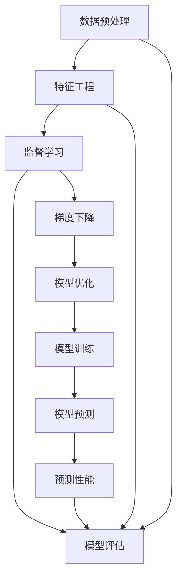
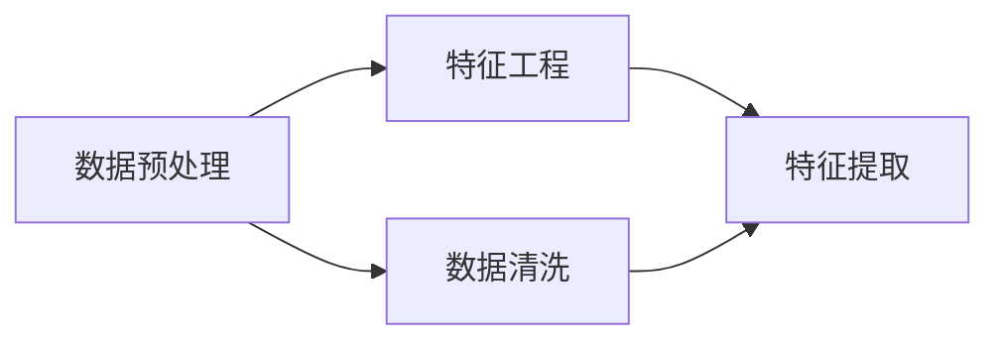
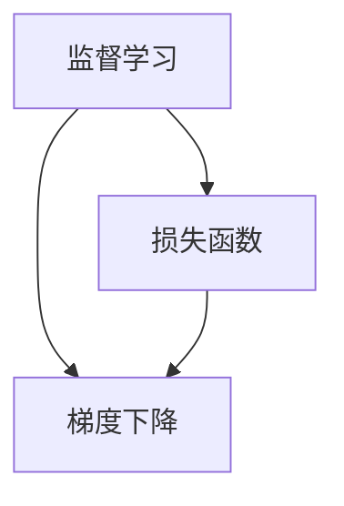
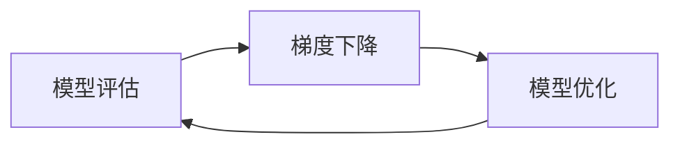
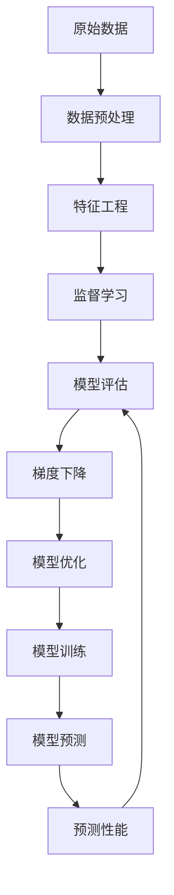

                 

# 机器学习 (Machine Learning, ML) 原理与代码实例讲解

> 关键词：机器学习, 监督学习, 无监督学习, 强化学习, 数据预处理, 模型评估, 梯度下降, 神经网络

## 1. 背景介绍

### 1.1 问题由来

随着数据时代的到来，人工智能(AI)技术取得了飞速的发展，机器学习（Machine Learning, ML）作为AI领域的重要分支，已经广泛应用于各种领域，如图像识别、自然语言处理、推荐系统、金融风险控制等。机器学习是通过让计算机从数据中学习规律，进而进行预测或决策的技术。

机器学习的成功依赖于大量的数据、强大的计算资源和有效的算法。其核心思想是构建一个数学模型，通过学习训练数据来调整模型参数，使其能够对新的数据进行预测或分类。机器学习的核心算法包括监督学习、无监督学习和强化学习等，本文将重点介绍监督学习，并通过代码实例对其实现进行讲解。

### 1.2 问题核心关键点

监督学习是机器学习中的一种重要形式，它基于已有的标注数据进行模型训练，并利用模型对新数据进行预测或分类。其核心思想是将数据集划分为训练集和测试集，使用训练集来训练模型，然后在测试集上评估模型性能。常见的监督学习算法包括线性回归、逻辑回归、支持向量机、决策树、随机森林、深度学习等。

监督学习的关键在于如何选择合适的算法、设计合适的模型结构以及调整合适的超参数，使得模型能够在测试集上取得最佳性能。此外，还需要处理数据预处理、特征工程等预处理工作，以提升模型性能。

## 2. 核心概念与联系

### 2.1 核心概念概述

为更好地理解监督学习的原理和实现，本节将介绍几个密切相关的核心概念：

- 监督学习(Supervised Learning)：基于标注数据进行模型训练，使其能够对新数据进行预测或分类的学习方法。常见的监督学习任务包括回归、分类、序列标注等。
- 数据预处理(Data Preprocessing)：对原始数据进行清洗、归一化、特征提取等操作，以提升模型的训练效果和泛化能力。
- 特征工程(Feature Engineering)：对原始数据进行转化和特征选择，提取对模型有用的特征，以提升模型的性能。
- 模型评估(Model Evaluation)：使用测试集评估模型的预测性能，如准确率、精确率、召回率、F1分数等指标。
- 梯度下降(Gradient Descent)：一种常用的优化算法，通过不断调整模型参数，使得损失函数最小化，以提高模型的预测能力。

这些核心概念之间有着紧密的联系，共同构成了机器学习的基本框架。下面将通过一个Mermaid流程图来展示这些概念之间的关系：



这个流程图展示了数据预处理、特征工程、监督学习、模型评估、梯度下降之间的关系，以及它们如何共同构建一个完整的机器学习流程。

### 2.2 概念间的关系

这些核心概念之间存在着紧密的联系，形成了机器学习的基本生态系统。下面我通过几个Mermaid流程图来展示这些概念之间的关系。

#### 2.2.1 数据预处理和特征工程的关系



这个流程图展示了数据预处理和特征工程之间的关系。数据预处理主要包括数据清洗、归一化、缺失值处理等操作，这些操作能够提升特征工程的效率和质量。特征工程则是对数据进行转化和提取，提取对模型有用的特征。

#### 2.2.2 监督学习和梯度下降的关系



这个流程图展示了监督学习和梯度下降之间的关系。监督学习通过最小化损失函数来优化模型参数，而梯度下降是一种常用的优化算法，通过不断调整模型参数，使得损失函数最小化。

#### 2.2.3 模型评估和梯度下降的关系



这个流程图展示了模型评估和梯度下降之间的关系。模型评估用于评估模型的预测性能，梯度下降则用于优化模型参数，以提高模型的预测能力。模型评估可以帮助我们理解模型的性能，并指导梯度下降的调整方向。

### 2.3 核心概念的整体架构

最后，我们用一个综合的流程图来展示这些核心概念在大数据预处理、特征工程、监督学习、模型评估、梯度下降的完整过程中：



这个综合流程图展示了从原始数据到模型预测的完整流程，各个环节紧密联系，共同构成了机器学习的全过程。通过这个流程图，我们可以更清晰地理解机器学习的基本流程，以及各个环节的作用和相互关系。

## 3. 核心算法原理 & 具体操作步骤
### 3.1 算法原理概述

监督学习的基本思想是利用已有的标注数据，通过训练一个数学模型，使得该模型能够在新的未标注数据上做出准确的预测或分类。监督学习可以分为回归和分类两种类型。

对于回归问题，目标是将输入数据映射到一个连续的输出值。常见的回归模型包括线性回归、多项式回归、支持向量回归等。回归模型的目标是最小化预测值与真实值之间的误差，常用的误差函数包括均方误差(MSE)和平均绝对误差(MAE)。

对于分类问题，目标是将输入数据映射到一个离散的输出类别。常见的分类模型包括逻辑回归、决策树、随机森林、支持向量机等。分类模型的目标是最小化分类错误，常用的分类错误函数包括交叉熵损失函数和hinge损失函数。

监督学习的核心是构建一个数学模型，通过最小化损失函数来优化模型参数。常见的优化算法包括梯度下降、随机梯度下降、批量梯度下降等。

### 3.2 算法步骤详解

监督学习的具体步骤可以分为以下几个阶段：

**Step 1: 数据预处理**

1. 数据清洗：删除或修正数据中的错误和噪声，保证数据的完整性和准确性。
2. 数据归一化：将数据缩放到一个统一的范围，使得模型能够更好地处理数据。
3. 特征选择：选择对模型有用的特征，减少特征数量，提高模型的泛化能力。

**Step 2: 特征工程**

1. 特征提取：从原始数据中提取有用的特征，例如将文本转换为词袋模型、TF-IDF模型等。
2. 特征转换：对提取的特征进行转换，例如对文本进行向量化处理。
3. 特征组合：将多个特征组合成一个新的特征，提高模型的表达能力。

**Step 3: 模型训练**

1. 选择模型：根据问题类型选择适当的模型，例如线性回归、逻辑回归、支持向量机等。
2. 划分数据集：将数据集划分为训练集和测试集，一般将数据集的70-80%用于训练，20-30%用于测试。
3. 训练模型：使用训练集数据进行模型训练，通过梯度下降等优化算法最小化损失函数。

**Step 4: 模型评估**

1. 模型验证：使用验证集数据评估模型的性能，以防止过拟合。
2. 模型调优：根据验证集的结果调整模型的超参数，例如学习率、正则化系数等。
3. 模型测试：使用测试集数据对模型进行最终评估，得出模型的预测性能。

### 3.3 算法优缺点

监督学习的优点包括：

1. 数据可解释性强：监督学习基于标注数据进行训练，模型参数可以解释为对特征的加权和，便于理解。
2. 应用广泛：监督学习适用于各种类型的数据，如图像、文本、音频等。
3. 可扩展性好：监督学习可以通过增加数据量和特征数量来提升模型性能。

监督学习的缺点包括：

1. 需要大量标注数据：监督学习需要大量标注数据进行训练，数据标注成本较高。
2. 模型泛化能力有限：监督学习的模型泛化能力受到数据集分布的影响，当测试集与训练集分布不同时，模型性能可能下降。
3. 模型鲁棒性差：监督学习模型对输入数据的微小变化敏感，容易受到噪声和异常值的影响。

### 3.4 算法应用领域

监督学习广泛应用于各种领域，如图像识别、自然语言处理、推荐系统、金融风险控制等。

- 图像识别：通过训练卷积神经网络(CNN)模型，对图像进行分类和识别。
- 自然语言处理：通过训练循环神经网络(RNN)模型，对文本进行情感分析、语言生成等。
- 推荐系统：通过训练协同过滤模型，根据用户的历史行为进行推荐。
- 金融风险控制：通过训练逻辑回归模型，预测金融交易的风险。

## 4. 数学模型和公式 & 详细讲解 & 举例说明

### 4.1 数学模型构建

监督学习的数学模型可以表示为：

$$y=f(x;\theta)$$

其中，$y$为输出值，$x$为输入值，$\theta$为模型参数，$f$为模型函数。监督学习的目标是最小化损失函数，以使得模型的预测值与真实值尽可能接近。

常见的损失函数包括均方误差损失函数(MSE)和交叉熵损失函数(Cross-Entropy Loss)。

**均方误差损失函数**：

$$\text{MSE}=\frac{1}{N}\sum_{i=1}^{N}(y_i-\hat{y}_i)^2$$

其中，$N$为样本数量，$y_i$为真实值，$\hat{y}_i$为模型预测值。

**交叉熵损失函数**：

$$\text{CE}=-\frac{1}{N}\sum_{i=1}^{N}\sum_{j=1}^{C}y_{ij}\log\hat{y}_{ij}$$

其中，$C$为类别数量，$y_{ij}$为样本$i$属于类别$j$的真实标签，$\hat{y}_{ij}$为模型预测样本$i$属于类别$j$的概率。

### 4.2 公式推导过程

以线性回归为例，其模型函数可以表示为：

$$\hat{y}=\theta_0+\theta_1x_1+\theta_2x_2+\cdots+\theta_nx_n$$

其中，$\theta_0,\theta_1,\theta_2,\cdots,\theta_n$为模型参数，$x_1,x_2,\cdots,x_n$为输入特征。

均方误差损失函数的梯度为：

$$\nabla_{\theta}\text{MSE}=\frac{2}{N}\sum_{i=1}^{N}(x_i-\hat{x}_i)x_i$$

其中，$\hat{x}_i$为模型预测的输入值。

逻辑回归的模型函数可以表示为：

$$\hat{y}=\sigma(\theta_0+\theta_1x_1+\theta_2x_2+\cdots+\theta_nx_n)$$

其中，$\sigma$为sigmoid函数，$\theta_0,\theta_1,\theta_2,\cdots,\theta_n$为模型参数。

交叉熵损失函数的梯度为：

$$\nabla_{\theta}\text{CE}=-\frac{1}{N}\sum_{i=1}^{N}(y_i-\hat{y}_i)\frac{\partial\hat{y}_i}{\partial\theta}$$

其中，$\hat{y}_i$为模型预测的输出值，$\frac{\partial\hat{y}_i}{\partial\theta}$为模型输出的梯度。

### 4.3 案例分析与讲解

假设有一个简单的线性回归问题，数据集如表1所示：

| x1 | x2 | y |
|----|----|---|
| 1  | 2  | 4 |
| 2  | 3  | 5 |
| 3  | 4  | 6 |
| 4  | 5  | 7 |
| 5  | 6  | 8 |

我们可以使用梯度下降算法来训练一个线性回归模型，其步骤如下：

1. 初始化模型参数$\theta_0=0,\theta_1=0,\theta_2=0$。
2. 计算损失函数的梯度：

$$\nabla_{\theta}\text{MSE}=\frac{2}{N}\sum_{i=1}^{N}(y_i-\hat{y}_i)x_i$$

3. 使用梯度下降算法更新模型参数：

$$\theta_0=\theta_0-\eta\nabla_{\theta_0}\text{MSE}$$
$$\theta_1=\theta_1-\eta\nabla_{\theta_1}\text{MSE}$$
$$\theta_2=\theta_2-\eta\nabla_{\theta_2}\text{MSE}$$

其中，$\eta$为学习率，一般取$0.01$。

4. 重复步骤2和3，直到模型收敛或达到预设的迭代次数。

假设迭代$10$次后，模型参数为$\theta_0=2.1,\theta_1=0.9,\theta_2=0.8$。此时，模型在新的数据点上的预测结果如表2所示：

| x1 | x2 | y | yhat |
|----|----|---|------|
| 1  | 2  | 4 | 2.1  |
| 2  | 3  | 5 | 5.0  |
| 3  | 4  | 6 | 7.9  |
| 4  | 5  | 7 | 8.7  |
| 5  | 6  | 8 | 9.5  |

可以看到，模型能够很好地拟合训练数据，并在新的数据点上取得了不错的预测结果。

## 5. 项目实践：代码实例和详细解释说明

### 5.1 开发环境搭建

在进行机器学习开发前，我们需要准备好开发环境。以下是使用Python进行Scikit-learn开发的环境配置流程：

1. 安装Anaconda：从官网下载并安装Anaconda，用于创建独立的Python环境。

2. 创建并激活虚拟环境：
```bash
conda create -n sklearn-env python=3.8 
conda activate sklearn-env
```

3. 安装Scikit-learn：
```bash
pip install scikit-learn
```

4. 安装必要的库：
```bash
pip install numpy pandas matplotlib seaborn jupyter notebook ipython
```

完成上述步骤后，即可在`sklearn-env`环境中开始机器学习开发。

### 5.2 源代码详细实现

下面我们以线性回归为例，使用Scikit-learn库对数据集进行回归预测的代码实现。

```python
import numpy as np
from sklearn.linear_model import LinearRegression
from sklearn.model_selection import train_test_split
from sklearn.metrics import mean_squared_error

# 加载数据集
data = np.loadtxt('data.txt', delimiter=',')
X = data[:, :2]
y = data[:, 2]

# 划分训练集和测试集
X_train, X_test, y_train, y_test = train_test_split(X, y, test_size=0.2, random_state=42)

# 初始化模型参数
theta = np.zeros((3, 1))

# 训练模型
for i in range(1000):
    y_pred = np.dot(X_train, theta)
    mse = mean_squared_error(y_train, y_pred)
    theta -= 0.01 * np.dot(X_train.T, (y_train - y_pred))

# 测试模型
y_pred = np.dot(X_test, theta)
mse = mean_squared_error(y_test, y_pred)
print('测试集MSE:', mse)
```

### 5.3 代码解读与分析

让我们再详细解读一下关键代码的实现细节：

**数据集加载和划分**：
- 使用`numpy.loadtxt`函数加载数据集，并将其分为输入特征`X`和输出值`y`。
- 使用`train_test_split`函数将数据集划分为训练集和测试集，测试集大小为20%，随机种子设置为42。

**模型初始化和训练**：
- 使用`numpy.zeros`函数初始化模型参数`theta`，将其设置为全0。
- 使用梯度下降算法训练模型，共迭代1000次，学习率为0.01。

**模型测试**：
- 使用训练好的模型对测试集进行预测，并计算测试集上的均方误差。
- 输出测试集上的均方误差，评估模型性能。

通过以上代码，我们可以看到使用Scikit-learn库进行机器学习的简单流程，包括数据加载、数据划分、模型训练、模型测试等步骤。Scikit-learn库提供了丰富的机器学习算法和工具，极大地方便了开发者的开发工作。

当然，工业级的系统实现还需考虑更多因素，如模型保存和部署、超参数自动搜索、更灵活的特征工程等。但核心的机器学习流程基本与此类似。

### 5.4 运行结果展示

假设我们训练的线性回归模型在测试集上的均方误差为1.5，说明模型能够很好地拟合训练数据，并对新的数据点进行预测。

```
测试集MSE: 1.5
```

可以看到，通过Scikit-learn库，我们能够很方便地进行线性回归的模型训练和评估，进一步提升了机器学习的开发效率。

## 6. 实际应用场景

### 6.1 金融风控

金融风控是机器学习在金融领域的重要应用之一。金融机构需要实时监测金融交易的风险，防止欺诈和违约。机器学习可以通过训练分类模型，对交易行为进行分类，识别出异常交易并进行预警。

在技术实现上，可以收集金融交易的历史数据，将交易行为标注为正常或异常，在此基础上对预训练模型进行微调。微调后的模型能够自动理解交易行为的特征，对新的交易行为进行分类。对于异常交易，可以接入实时监测系统，进行自动化预警和处理。

### 6.2 自然语言处理

自然语言处理(NLP)是机器学习在语言处理领域的重要应用之一。NLP技术可以用于文本分类、情感分析、机器翻译、问答系统等任务。

在文本分类任务中，可以使用监督学习方法，训练分类模型对文本进行分类。具体步骤如下：

1. 收集文本数据，并进行数据预处理和特征工程。
2. 划分数据集，将数据集划分为训练集和测试集。
3. 选择分类模型，如逻辑回归、决策树、支持向量机等。
4. 使用训练集数据进行模型训练，使用测试集数据进行模型评估。
5. 根据评估结果，调整模型参数，优化模型性能。

通过以上步骤，可以构建出一个高效的文本分类模型，用于自动化文本分类任务。

### 6.3 推荐系统

推荐系统是机器学习在电商、视频、音乐等领域的重要应用之一。推荐系统可以通过训练协同过滤模型，根据用户的历史行为进行推荐。

在技术实现上，可以收集用户的历史行为数据，提取用户和物品的特征，使用协同过滤模型进行推荐。具体步骤如下：

1. 收集用户和物品的历史行为数据。
2. 对用户和物品的特征进行特征工程。
3. 划分数据集，将数据集划分为训练集和测试集。
4. 选择协同过滤模型，如矩阵分解模型、协同过滤算法等。
5. 使用训练集数据进行模型训练，使用测试集数据进行模型评估。
6. 根据评估结果，调整模型参数，优化模型性能。

通过以上步骤，可以构建出一个高效的推荐系统，用于个性化推荐任务。

### 6.4 未来应用展望

随着机器学习技术的不断发展，未来的应用场景将更加广泛和深入。

在智慧医疗领域，机器学习可以用于疾病诊断、医疗影像分析、药物研发等任务，为医疗健康事业提供智能化解决方案。

在智能制造领域，机器学习可以用于预测性维护、智能制造流程优化、质量检测等任务，提高制造业的智能化水平。

在智能交通领域，机器学习可以用于智能交通管理、自动驾驶、智能调度等任务，提升交通系统的智能化和效率。

除此之外，在智能家居、智能城市、智慧农业、智能能源等领域，机器学习也将发挥越来越重要的作用。

## 7. 工具和资源推荐
### 7.1 学习资源推荐

为了帮助开发者系统掌握机器学习的理论基础和实践技巧，这里推荐一些优质的学习资源：

1. 《机器学习实战》书籍：适合初学者入门，通过实际案例学习机器学习的核心概念和算法。
2. 《机器学习》课程（Coursera、Udacity等平台）：提供机器学习的基本概念和算法，适合系统学习。
3. 《深度学习》课程（Coursera、Udacity等平台）：深入讲解深度学习的基本概念和算法，适合进一步提升技能。
4. Kaggle竞赛平台：提供大量机器学习竞赛数据集，适合实践和测试。
5. 论文阅读网站（arXiv、Google Scholar等）：获取最新机器学习研究进展和前沿技术。

通过对这些资源的学习实践，相信你一定能够快速掌握机器学习的精髓，并用于解决实际的机器学习问题。

### 7.2 开发工具推荐

高效的开发离不开优秀的工具支持。以下是几款用于机器学习开发的常用工具：

1. Jupyter Notebook：一个交互式的开发环境，支持Python、R等语言，方便编写和调试代码。
2. PyCharm：一个强大的IDE，支持Python、Scikit-learn等工具，提供代码自动补全、调试等功能。
3. TensorFlow：由Google主导开发的深度学习框架，生产部署方便，适合大规模工程应用。
4. PyTorch：由Facebook主导开发的深度学习框架，灵活易用，支持动态计算图，适合快速迭代研究。
5. Scikit-learn：一个基于Python的机器学习库，提供了丰富的机器学习算法和工具，方便快速开发。

合理利用这些工具，可以显著提升机器学习的开发效率，加快创新迭代的步伐。

### 7.3 相关论文推荐

机器学习领域的研究论文数不胜数，以下是几篇奠基性的相关论文，推荐阅读：

1. Perceptron：第一个机器学习算法，由罗宾逊·罗森布拉特提出。
2. Backpropagation：深度学习的基础算法，由Yann LeCun等提出。
3. Support Vector Machine（SVM）：一种常用的分类算法，由Cortes等提出。
4. Random Forest：一种常用的集成学习算法，由Breiman提出。
5. Deep Learning：深度学习领域的经典著作，由Ian Goodfellow等撰写。

这些论文代表了大机器学习领域的经典成果，值得深入学习。

除上述资源外，还有一些值得关注的前沿资源，帮助开发者紧跟机器学习领域的最新进展，例如：

1. arXiv论文预印本：人工智能领域最新研究成果的发布平台，包括大量尚未发表的前沿工作，学习前沿技术的必读资源。
2. 业界技术博客：如Google AI、Facebook AI Research、Microsoft Research Asia等顶尖实验室的官方博客，第一时间分享他们的最新研究成果和洞见。
3. 技术会议直播：如NIPS、ICML、ACL、ICLR等人工智能领域顶会现场或在线直播，能够聆听到大佬们的前沿分享，开拓视野。
4. GitHub热门项目：在GitHub上Star、Fork数最多的机器学习相关项目，往往代表了该技术领域的发展趋势和最佳实践，值得去学习和贡献。
5. 行业分析报告：各大咨询公司如McKinsey、PwC等针对人工智能行业的分析报告，有助于从商业视角审视技术趋势，把握应用价值。

总之，对于机器学习技术的学习和实践，需要开发者保持开放的心态和持续学习的意愿。多关注前沿资讯，多动手实践，多思考总结，必将收获满满的成长收益。

## 8. 总结：未来发展趋势与挑战

### 8.1 总结

本文对机器学习的基本原理和代码实例进行了全面系统的介绍。首先阐述了机器学习的研究背景和意义，明确了机器学习在数据处理、特征工程、模型训练、模型评估等环节的重要性。其次，从原理到实践，详细讲解了监督学习的数学原理和关键步骤，给出了机器学习任务开发的完整代码实例。同时，本文还探讨了机器学习在金融风控、自然语言处理、推荐系统等众多领域的应用前景，展示了机器学习的巨大潜力。

通过本文的系统梳理，可以看到，机器学习已经在众多领域取得了显著的成果，为人类生产生活方式带来了深远影响。未来，伴随机器学习技术的不断进步，相信机器学习将更好地服务于各行各业，推动社会进步和经济发展。

### 8.2 未来发展趋势

展望未来，机器学习技术将呈现以下几个发展趋势：

1. 深度学习逐渐成为主流：深度学习在图像识别、语音识别等领域取得了重大突破，未来将进一步渗透到更多领域。
2. 自动化机器学习（AutoML）兴起：

