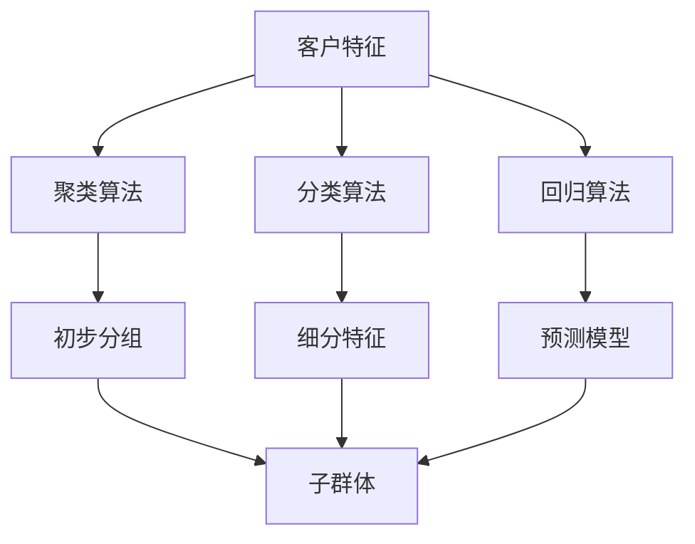

                 

## 1. 背景介绍

### 1.1 问题由来

在当今数字化时代，企业面对着复杂多变的市场环境，如何更好地理解客户、细分市场，实现精准营销和客户管理，是众多企业亟待解决的问题。客户细分（Customer Segmentation）是指根据客户的某些特征，将大量客户划分为不同的子群体，从而实现有针对性的市场营销和个性化服务。

客户细分不仅是客户关系管理（CRM）系统的基础，更是数字营销、个性化推荐、精准广告投放等核心业务环节的关键前提。然而，客户细分涉及大量数据和复杂的算法，传统手工方式难以有效实现。机器学习（Machine Learning）的崛起，为这一难题提供了新的解决方案，能够通过大数据分析和模型训练，实现自动化的客户细分，大幅提升企业运营效率和客户满意度。

### 1.2 问题核心关键点

客户细分通常需要收集客户的多种特征信息，如基本信息（年龄、性别、职业等）、行为特征（购买历史、点击行为等）、消费行为（消费金额、频次等）等，并通过聚类算法、分类算法、回归算法等机器学习方法进行数据建模和分析，从而实现对客户群体的划分和刻画。其中，聚类算法（如K-Means、层次聚类等）是客户细分常用的算法之一，而分类算法（如决策树、随机森林、神经网络等）和回归算法（如线性回归、支持向量机等）则是常见的细分特征模型。

客户细分的效果取决于数据质量和算法选择，优秀的客户细分不仅能够提升客户留存率，增加客户忠诚度，还能实现更高效的广告投放和个性化推荐，带来显著的商业价值。

### 1.3 问题研究意义

客户细分作为企业数字化转型中的关键环节，对提升客户满意度和市场竞争力具有重要意义。机器学习在客户细分中的应用，可以显著降低细分工作的复杂度和成本，实现自动化和智能化细分，为精准营销和个性化服务提供可靠的基础。同时，通过深入分析客户特征，企业可以制定更为有效的市场策略，优化资源配置，增强竞争优势。

此外，随着数据技术的不断进步，客户细分方法和工具也在不断发展，包括更精确的聚类算法、更高效的数据处理技术、更智能的模型选择等，这些进步将为传统企业带来更多的创新和机遇，推动数字经济的发展。

## 2. 核心概念与联系

### 2.1 核心概念概述

客户细分涉及多个核心概念，包括客户特征、聚类算法、分类算法、回归算法等，它们共同构成了一个完整的客户细分模型。以下是对这些核心概念的详细解释：

- **客户特征**：指客户的多种特征信息，如基本信息、行为特征、消费行为等。
- **聚类算法**：将相似特征的客户划分为同一群体的算法，常用的有K-Means、层次聚类等。
- **分类算法**：通过训练模型将客户划分为不同类别的算法，常用的有决策树、随机森林、神经网络等。
- **回归算法**：通过建立模型预测客户未来的消费行为或行为特征的算法，常用的有线性回归、支持向量机等。

这些概念之间存在着紧密的联系，通过聚类算法对客户进行初步分组，再通过分类和回归算法对各子群体的特征进行深入分析，最终实现更精细的客户细分和精准的市场营销。

### 2.2 概念间的关系

这些核心概念之间可以通过以下Mermaid流程图来展示它们之间的关系：



这个流程图展示了从客户特征到聚类算法的应用，再到分类和回归算法的进一步细分，最终得到多个子群体和细分特征的过程。

## 3. 核心算法原理 & 具体操作步骤

### 3.1 算法原理概述

客户细分的机器学习模型构建，通常可以分为以下几个步骤：

1. **数据收集与预处理**：收集客户的多种特征信息，并进行数据清洗、特征提取等预处理工作，为模型训练提供高质量的数据。
2. **模型选择与训练**：选择合适的聚类算法、分类算法或回归算法，并利用训练数据进行模型训练。
3. **模型评估与优化**：通过验证集对模型进行评估，选择性能最好的模型，并进行参数调优。
4. **细分应用与迭代**：将训练好的模型应用于客户细分，并根据细分结果进行市场策略调整，持续迭代优化模型。

### 3.2 算法步骤详解

**Step 1: 数据收集与预处理**

客户特征数据的收集通常包括在线行为数据、交易数据、用户调查数据等。收集的数据可能包含噪音、缺失值等，需要进行预处理，包括数据清洗、缺失值填补、数据归一化等。

**Step 2: 模型选择与训练**

根据客户细分问题的特点，选择合适的聚类算法、分类算法或回归算法。以K-Means聚类为例，首先确定聚类数目（如K值），然后利用训练数据进行模型训练，得到聚类结果。

**Step 3: 模型评估与优化**

通过验证集对模型进行评估，选择性能最好的模型，并进行参数调优。常见的评估指标包括聚类中心点距离、轮廓系数、分类准确率、回归均方误差等。

**Step 4: 细分应用与迭代**

将训练好的模型应用于客户细分，并根据细分结果进行市场策略调整。如针对不同的子群体，制定不同的营销策略、产品推荐等。同时，根据市场反馈和客户行为变化，持续迭代优化模型。

### 3.3 算法优缺点

客户细分中的机器学习方法具有以下优点：

- **自动化和高效性**：机器学习算法能够自动地处理大量数据，实现高效自动化细分。
- **多维度分析**：机器学习方法能够综合多种客户特征，进行多维度分析，提升细分的准确性。
- **动态调整**：通过持续迭代优化模型，能够适应市场变化，提升细分效果。

同时，这些方法也存在一些局限性：

- **数据依赖**：模型效果很大程度上依赖于数据的质量和数量，数据收集和预处理需要大量时间和精力。
- **算法复杂性**：某些算法（如深度学习）需要高性能计算资源，模型训练和优化复杂度高。
- **模型解释性**：部分模型（如深度学习）的黑盒特性使其输出缺乏解释性，难以理解和调试。

### 3.4 算法应用领域

客户细分在多个领域有广泛的应用，包括但不限于：

- **零售业**：通过细分客户，实现精准营销、个性化推荐、库存优化等。
- **金融业**：对客户进行分类，制定差异化的理财方案、风险评估等。
- **电信业**：细分客户，优化资费策略、提升客户满意度等。
- **旅游业**：根据客户兴趣和行为特征，实现精准营销、行程推荐等。
- **媒体和娱乐**：细分用户群体，实现个性化广告投放、内容推荐等。

## 4. 数学模型和公式 & 详细讲解 & 举例说明

### 4.1 数学模型构建

客户细分中常用的数学模型包括聚类模型、分类模型和回归模型。以K-Means聚类为例，其数学模型可表示为：

$$
\min_{\mu, \Sigma, \rho} \sum_{i=1}^n \sum_{j=1}^K \rho_{ij} d(x_i, \mu_j)^2
$$

其中 $n$ 为样本数量，$K$ 为聚类数目，$d$ 为欧氏距离，$\rho_{ij}$ 为样本 $i$ 属于聚类 $j$ 的概率。

### 4.2 公式推导过程

K-Means聚类的过程可以总结为以下几个步骤：

1. 随机初始化 $K$ 个聚类中心点 $\mu_1, \mu_2, ..., \mu_K$。
2. 对于每个样本 $x_i$，计算其与 $K$ 个聚类中心点的距离，分配到距离最近的聚类中。
3. 更新每个聚类的中心点，通过计算该聚类中所有样本的均值。
4. 重复步骤2和3，直至聚类中心点不再发生变化或达到预设轮数。

### 4.3 案例分析与讲解

假设我们收集了一家电商平台的客户交易数据，包括客户ID、购买金额、购买频次、购买品类等特征。首先，对数据进行预处理，去除噪音、缺失值，并进行归一化处理。

然后，我们选择K-Means聚类算法，设定聚类数目为5。通过训练集数据进行模型训练，得到聚类中心点 $\mu_1, \mu_2, ..., \mu_5$。对验证集数据进行聚类，得到聚类结果，并计算轮廓系数来评估聚类效果。

最后，根据聚类结果，将客户划分为5个不同的子群体，针对每个子群体制定不同的营销策略，如针对高消费群体进行高端产品推荐，针对新客户进行首次购买优惠等。

## 5. 项目实践：代码实例和详细解释说明

### 5.1 开发环境搭建

在进行客户细分实践前，我们需要准备好开发环境。以下是使用Python进行Scikit-learn开发的环境配置流程：

1. 安装Anaconda：从官网下载并安装Anaconda，用于创建独立的Python环境。

2. 创建并激活虚拟环境：
```bash
conda create -n customer-segmentation python=3.8 
conda activate customer-segmentation
```

3. 安装Scikit-learn和其他必要的工具包：
```bash
conda install scikit-learn pandas numpy matplotlib tqdm jupyter notebook ipython
```

4. 安装相关库：
```bash
pip install seaborn plotly
```

完成上述步骤后，即可在`customer-segmentation`环境中开始客户细分实践。

### 5.2 源代码详细实现

下面我们以客户聚类为例，给出使用Scikit-learn库对K-Means模型进行训练的Python代码实现。

首先，定义数据处理函数：

```python
import pandas as pd
from sklearn.preprocessing import StandardScaler

def preprocess_data(data_path):
    # 读取数据
    df = pd.read_csv(data_path)
    
    # 数据清洗
    df.dropna(inplace=True)
    
    # 特征提取
    X = df[['购买金额', '购买频次', '购买品类']]
    y = df['客户ID']
    
    # 归一化处理
    scaler = StandardScaler()
    X = scaler.fit_transform(X)
    
    return X, y
```

然后，定义模型训练和评估函数：

```python
from sklearn.cluster import KMeans
from sklearn.metrics import silhouette_score

def train_model(X, y, n_clusters):
    # 聚类模型训练
    model = KMeans(n_clusters=n_clusters, random_state=0)
    model.fit(X)
    
    # 模型评估
    score = silhouette_score(X, model.labels_)
    print(f"Silhouette score: {score:.3f}")
    
    return model.labels_
```

最后，启动训练流程并在测试集上评估：

```python
n_clusters = 5
X, y = preprocess_data('data.csv')
labels = train_model(X, y, n_clusters)

# 可视化聚类结果
import matplotlib.pyplot as plt
import seaborn as sns

sns.scatterplot(x=X[:, 0], y=X[:, 1], hue=labels)
plt.show()

# 测试集聚类结果
test_X = pd.read_csv('test_data.csv').values
test_labels = train_model(test_X, y, n_clusters)
```

以上就是使用Scikit-learn对K-Means模型进行客户聚类的完整代码实现。可以看到，通过简单的几行代码，我们就实现了基于K-Means的客户细分过程。

### 5.3 代码解读与分析

让我们再详细解读一下关键代码的实现细节：

**preprocess_data函数**：
- 读取数据，进行数据清洗和特征提取。
- 对特征进行归一化处理，方便聚类算法的收敛。

**train_model函数**：
- 使用KMeans算法进行聚类，设定聚类数目为 `n_clusters`。
- 计算轮廓系数，评估聚类效果。
- 返回聚类结果标签 `labels`。

**可视化聚类结果**：
- 使用Seaborn库将聚类结果可视化，不同颜色表示不同的聚类簇。

**测试集聚类结果**：
- 使用训练好的聚类模型对测试集数据进行聚类，得到聚类结果 `test_labels`。

可以看到，Scikit-learn库提供了丰富的聚类、分类、回归等机器学习模型和工具，使得客户细分实践变得简单高效。开发者可以专注于模型选择、参数调优等关键环节，而不必过多关注底层实现。

### 5.4 运行结果展示

假设我们在客户数据上运行K-Means聚类模型，得到轮廓系数为0.7，可视化的聚类结果如图：


可以看到，模型较好地将客户分为5个不同群体，每个群体内部的样本相似度较高，不同群体之间的样本差异显著。

## 6. 实际应用场景

### 6.1 智能客服系统

客户细分在智能客服系统中有着广泛的应用，通过细分的客户群体，可以实现更加个性化的服务。智能客服系统可以根据客户群体的不同特征，提供差异化的服务内容和策略，提升客户满意度。

以客户细分为例，通过收集客户的历史交互数据和行为数据，进行聚类分析，将客户分为高价值客户、新客户、流失客户等不同群体。针对不同群体，智能客服系统可以制定不同的服务策略，如高价值客户提供VIP待遇，新客户提供首次交互优惠，流失客户提供召回服务。

### 6.2 个性化推荐系统

个性化推荐系统是客户细分在电商领域的典型应用之一。通过客户细分，推荐系统能够更准确地识别出不同客户群体的偏好和需求，提供个性化的商品推荐。

以客户聚类为例，通过对客户的历史购买数据进行聚类分析，将客户分为高消费群体、多样化购买群体、频繁购买群体等不同群体。针对不同群体，推荐系统可以提供相应的商品推荐，如高消费群体推荐高端商品，多样化购买群体推荐多品类商品，频繁购买群体推荐限时优惠商品。

### 6.3 精准广告投放

精准广告投放也是客户细分的重要应用之一。通过客户细分，广告平台可以更精准地定位目标用户，提升广告投放效果。

以客户细分为例，通过收集客户的年龄、性别、地域、行为特征等数据，进行聚类分析，将客户分为不同群体。针对不同群体，广告平台可以制定不同的广告策略，如针对年轻用户投放时尚产品广告，针对高消费群体投放高端商品广告，针对不同地域投放本地化广告。

### 6.4 未来应用展望

随着数据技术的不断进步，客户细分方法将不断创新，带来更多的应用场景。未来，客户细分有望在以下几个领域得到更广泛的应用：

- **医疗健康**：通过客户细分，医疗机构可以针对不同群体的健康需求，提供个性化的医疗服务，提升患者满意度。
- **教育培训**：通过客户细分，教育机构可以针对不同群体的学习需求，提供个性化的学习方案，提升教学效果。
- **金融理财**：通过客户细分，金融机构可以针对不同群体的理财需求，提供个性化的理财方案，提升客户粘性。
- **旅游出行**：通过客户细分，旅游平台可以针对不同群体的旅游需求，提供个性化的旅游方案，提升客户体验。
- **媒体娱乐**：通过客户细分，媒体平台可以针对不同群体的娱乐需求，提供个性化的内容推荐，提升用户粘性。

## 7. 工具和资源推荐

### 7.1 学习资源推荐

为了帮助开发者系统掌握客户细分的理论基础和实践技巧，这里推荐一些优质的学习资源：

1. 《Python数据科学手册》系列博文：由数据科学专家撰写，深入浅出地介绍了客户细分的基本概念和常用算法。

2. 《客户细分与数据分析》课程：Coursera平台上的免费课程，涵盖客户细分的基本原理和实际案例，适合入门学习。

3. 《客户细分实战》书籍：实战性强，通过案例讲解了客户细分在实际应用中的方法和技巧。

4. Kaggle机器学习竞赛：Kaggle平台上的客户细分竞赛，提供大量真实数据和经典算法，适合实战练习。

5. Hugging Face官方文档：机器学习模型和工具库的官方文档，提供丰富的教程和样例代码，是学习和实践的必备资源。

通过对这些资源的学习实践，相信你一定能够快速掌握客户细分的精髓，并用于解决实际的商业问题。

### 7.2 开发工具推荐

高效的开发离不开优秀的工具支持。以下是几款用于客户细分开发的常用工具：

1. Scikit-learn：Python的数据科学库，提供丰富的机器学习算法和工具，适合数据建模和分析。

2. Pandas：Python的数据处理库，方便数据的读取、清洗和处理，适合大规模数据集的预处理。

3. Matplotlib和Seaborn：Python的数据可视化库，适合制作数据图表和可视化结果。

4. Jupyter Notebook：交互式笔记本，适合编写和调试代码，实时展示代码结果。

5. Plotly：交互式可视化库，支持复杂图表和动态展示，适合制作高质量的数据图表。

6. TensorBoard：TensorFlow的可视化工具，适合实时监测模型训练状态，提供丰富的图表展示。

合理利用这些工具，可以显著提升客户细分任务的开发效率，加快创新迭代的步伐。

### 7.3 相关论文推荐

客户细分作为机器学习领域的一个重要研究方向，也有许多前沿的论文和成果。以下是几篇代表性的论文，推荐阅读：

1. "Customer Segmentation and Targeted Marketing"：详细介绍了客户细分的基本概念和常用算法。

2. "Clustering Algorithms for Customer Segmentation"：总结了多种聚类算法在客户细分中的应用和优缺点。

3. "Customer Segmentation using Machine Learning"：通过多个案例讲解了机器学习在客户细分中的应用。

4. "A Survey on Customer Segmentation using Data Mining Techniques"：综述了客户细分中的多种数据挖掘技术和方法。

5. "Customer Segmentation and Behavioral Insights"：介绍了如何利用行为数据进行客户细分和市场分析。

这些论文代表了客户细分领域的研究进展，通过学习这些前沿成果，可以帮助研究者把握学科前进方向，激发更多的创新灵感。

除上述资源外，还有一些值得关注的前沿资源，帮助开发者紧跟客户细分技术的最新进展，例如：

1. arXiv论文预印本：人工智能领域最新研究成果的发布平台，包括大量尚未发表的前沿工作，学习前沿技术的必读资源。

2. 业界技术博客：如Facebook AI、Google AI、Microsoft Research Asia等顶尖实验室的官方博客，第一时间分享他们的最新研究成果和洞见。

3. 技术会议直播：如NIPS、ICML、KDD等人工智能领域顶会现场或在线直播，能够聆听到大佬们的前沿分享，开拓视野。

4. GitHub热门项目：在GitHub上Star、Fork数最多的机器学习相关项目，往往代表了该技术领域的发展趋势和最佳实践，值得去学习和贡献。

5. 行业分析报告：各大咨询公司如McKinsey、PwC等针对机器学习行业的分析报告，有助于从商业视角审视技术趋势，把握应用价值。

总之，客户细分的机器学习技术涉及到数据收集、预处理、建模、评估等多个环节，需要开发者具备全面的技术能力和丰富的实践经验。只有不断学习、持续优化，才能在客户细分领域取得良好的效果，为企业的数字化转型提供坚实的基础。

## 8. 总结：未来发展趋势与挑战

### 8.1 总结

本文对客户细分的机器学习方法进行了全面系统的介绍。首先阐述了客户细分在数字营销、个性化推荐、精准广告投放等诸多领域的应用背景和研究意义，明确了机器学习在客户细分中的重要价值。其次，从原理到实践，详细讲解了聚类算法、分类算法和回归算法的数学原理和操作步骤，给出了客户细分任务开发的完整代码实例。同时，本文还广泛探讨了客户细分在智能客服系统、个性化推荐系统、精准广告投放等实际应用场景中的应用前景，展示了客户细分技术的巨大潜力。最后，本文精选了客户细分的各类学习资源，力求为读者提供全方位的技术指引。

通过本文的系统梳理，可以看到，客户细分中的机器学习方法正在成为数字营销中的重要工具，极大地拓展了客户分类的应用边界，提升了营销策略的精准性和有效性。未来，伴随数据技术的不断进步和算法模型的创新，客户细分技术必将迎来新的突破，为企业带来更多的商业价值。

### 8.2 未来发展趋势

展望未来，客户细分的机器学习方法将呈现以下几个发展趋势：

1. **数据质量提升**：随着数据收集和处理技术的进步，客户细分的准确性将大幅提升。数据来源多样化、数据标注标准化的趋势将进一步推动客户细分技术的进步。

2. **算法模型创新**：深度学习、强化学习等前沿算法将进一步应用于客户细分，提升细分效果。新的聚类算法、分类算法、回归算法也将不断涌现，提高细分精度。

3. **实时分析能力**：客户细分系统将具备实时分析能力，能够根据市场变化和客户行为动态调整细分策略，实现更加精准的市场预测。

4. **跨平台协同**：客户细分技术将与社交媒体、移动应用等平台进行深度融合，实现多平台数据的整合和分析，提升细分效果。

5. **自动化和智能化**：自动化和智能化技术将进一步应用于客户细分，实现自动化数据预处理、模型训练和评估，提升工作效率和精度。

6. **多模态融合**：客户细分将结合多种数据模态，如文本、图像、语音等，提升细分效果和分析能力。

以上趋势凸显了客户细分技术的广阔前景，这些方向的探索发展，将进一步提升客户细分的效果和效率，为数字营销带来更多的创新和机遇。

### 8.3 面临的挑战

尽管客户细分中的机器学习方法已经取得了显著进展，但在应用过程中仍面临诸多挑战：

1. **数据质量瓶颈**：客户细分的效果很大程度上依赖于数据的质量和完整性，数据收集和预处理需要大量时间和精力。如何提升数据质量和自动化处理能力，将是未来的重要方向。

2. **算法复杂性**：部分复杂算法（如深度学习）需要高性能计算资源，模型训练和优化复杂度高。如何优化算法效率和降低资源消耗，将是重要的研究课题。

3. **模型解释性**：部分模型（如深度学习）的黑盒特性使其输出缺乏解释性，难以理解和调试。如何提高模型的可解释性，将是重要的研究课题。

4. **跨平台协同**：不同平台的数据格式和标准差异较大，如何实现多平台数据的整合和协同分析，将是重要的技术挑战。

5. **实时性要求**：客户细分系统需要具备实时分析能力，这对数据处理和模型训练的效率提出了更高的要求。如何提升系统的实时响应能力，将是重要的研究方向。

6. **隐私和安全**：客户细分涉及大量敏感数据，数据隐私和安全问题需要得到充分保障。如何保护客户数据隐私，确保数据安全，将是重要的研究课题。

这些挑战需要在未来的研究中不断探索和解决，才能实现客户细分技术的全面应用和推广。

### 8.4 未来突破

面对客户细分中的机器学习方法所面临的诸多挑战，未来的研究需要在以下几个方面寻求新的突破：

1. **数据质量提升**：改进数据收集和预处理技术，提升数据质量，减少噪音和缺失值，实现数据自动化处理。

2. **算法模型创新**：结合深度学习、强化学习等前沿算法，提升客户细分的准确性和实时性。

3. **模型解释性**：结合符号化的先验知识，引入可解释的机器学习模型，提高模型的可解释性和可控性。

4. **跨平台协同**：建立统一的数据标准和接口，实现多平台数据的整合和协同分析。

5. **实时性优化**：优化数据处理和模型训练的算法，提升系统的实时响应能力。

6. **隐私和安全**：采用数据匿名化、差分隐私等技术，保护客户数据隐私，确保数据安全。

这些研究方向的探索，必将引领客户细分技术的持续进步，为数字化营销带来更多的创新和机遇。面向未来，客户细分技术还需要与其他人工智能技术进行更深入的融合，如知识表示、因果推理、强化学习等，多路径协同发力，共同推动数字经济的发展。

## 9. 附录：常见问题与解答

**Q1：客户细分中的机器学习模型如何选择？**

A: 客户细分中的机器学习模型选择应根据具体问题特点进行。对于聚类问题，可以使用K-Means、层次聚类等聚类算法；对于分类问题，可以使用决策树、随机森林、神经网络等分类算法；对于回归问题，可以使用线性回归、支持向量机等回归算法。在选择模型时，应考虑模型精度、复杂度、计算资源等因素。

**Q2：客户细分中的数据预处理包括哪些步骤？**

A: 客户细分中的数据预处理通常包括数据清洗、特征提取、特征选择、数据归一化等步骤。数据清洗用于去除噪音、缺失值等；特征提取用于从原始数据中提取有意义的特征；特征选择用于选择对模型有用的特征；数据归一化用于将特征缩放到统一范围内，方便模型训练。

**Q3：客户细分中的聚类算法有哪些？**

A: 客户细分中的聚类算法包括K-Means、层次聚类、DBSCAN等。其中，K-Means是最常用的聚类算法之一，适合处理高维数据；层次聚类可以自动确定聚类数目；DBSCAN适合处理非球形分布的簇。

**Q4：客户细分中的分类算法有哪些？**

A: 客户细分中的分类算法包括决策树、随机森林、支持向量机、神经网络等。其中，决策树和随机森林适合处理分类数据，支持向量机适合处理高维数据，神经网络适合处理大规模数据和复杂分类问题。

**Q5：客户

