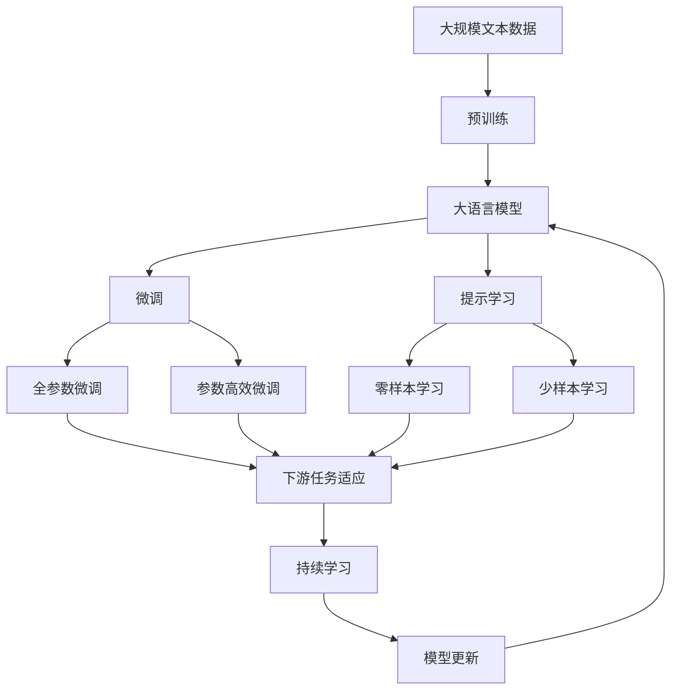

                 

# 机器翻译(Machine Translation) - 原理与代码实例讲解

> 关键词：机器翻译,自然语言处理(NLP),神经网络,序列到序列(Seq2Seq),Transformer,BPE,代码实例,模型训练,模型评估

## 1. 背景介绍

### 1.1 问题由来
机器翻译（Machine Translation，简称MT）是自然语言处理（Natural Language Processing，简称NLP）领域的一项重要应用。其主要目标是将一种语言的文本自动转换成另一种语言的文本，使不同语言间的信息沟通更加高效便捷。机器翻译不仅在新闻媒体、学术研究、国际贸易等场景中发挥着重要作用，还在跨文化交流、语言教育等方面展现出巨大潜力。

### 1.2 问题核心关键点
当前机器翻译的主要方法包括统计机器翻译（Statistical Machine Translation，简称SMT）和神经机器翻译（Neural Machine Translation，简称NMT）两大类。统计机器翻译通过大量的双语对照语料，使用统计模型学习翻译规律，而神经机器翻译则通过深度学习技术，直接学习输入与输出之间的映射关系。

神经机器翻译（NMT），特别是基于Transformer架构的NMT模型，近年来在机器翻译领域取得了重大突破。Transformer模型以其自注意力机制和并行化计算的特点，显著提升了翻译的流畅性和准确性。当前主流的NMT模型包括Google的BERT、Facebook的mBART、Microsoft的M2M100等。

### 1.3 问题研究意义
机器翻译作为NLP领域的关键技术，对推动全球化和跨语言沟通具有重要意义。机器翻译的进步不仅提升了信息交流的效率，还促进了不同文化间的理解和融合。通过深入研究机器翻译的原理和实现方法，可以为其他NLP任务的开发提供宝贵的经验和启示。

## 2. 核心概念与联系

### 2.1 核心概念概述

为更好地理解机器翻译的原理与代码实现，本节将介绍几个关键概念：

- 自然语言处理（NLP）：涉及计算机处理、理解、生成人类语言的技术，是机器翻译的重要应用领域。
- 神经网络（Neural Network）：通过模拟人类神经系统的计算方式，实现数据的处理和学习。
- 序列到序列（Seq2Seq）模型：一种用于序列数据处理的神经网络模型，广泛应用于机器翻译、语音识别、文本生成等任务。
- 编码器-解码器框架（Encoder-Decoder Framework）：Seq2Seq模型的一种重要架构，通过将输入序列编码，然后将编码结果解码为输出序列，实现序列数据间的转换。
- Transformer模型：一种基于自注意力机制的神经网络架构，可以高效地处理长序列数据，广泛应用于机器翻译等任务。
- 子词分割（Wordpiece Tokenization）：一种将单词分割成更小的子词单元的方法，用于提高模型对生僻词汇和长句子的处理能力。
- 编码器-解码器架构中的自注意力机制（Self-Attention Mechanism）：一种用于捕捉序列内部依赖关系的机制，可以更准确地建模输入与输出之间的映射关系。

这些核心概念共同构成了机器翻译的技术基础，通过理解这些概念，可以更清晰地把握机器翻译的实现原理和优化方向。

### 2.2 概念间的关系

这些核心概念之间的逻辑关系可以通过以下Mermaid流程图来展示：

```mermaid
graph TB
    A[自然语言处理(NLP)] --> B[机器翻译(MT)]
    B --> C[神经网络(ANN)]
    C --> D[序列到序列(Seq2Seq)]
    D --> E[编码器-解码器框架]
    E --> F[Transformer模型]
    E --> G[子词分割(BPE)]
    E --> H[自注意力机制(Self-Attention)]
    F --> I[Transformer架构]
    G --> J[Wordpiece Tokenization]
    H --> J
    I --> J
```

这个流程图展示了大语言模型微调过程中各个核心概念之间的关系：

1. 自然语言处理是机器翻译的基础。
2. 机器翻译通过神经网络进行建模，利用Seq2Seq框架将输入序列编码，然后将编码结果解码为输出序列。
3. 编码器-解码器框架中的Transformer模型采用自注意力机制，可以更高效地处理长序列数据。
4. 子词分割方法Wordpiece Tokenization将单词分割成更小的子词单元，用于提高模型对生僻词汇和长句子的处理能力。
5. 自注意力机制通过计算序列中每个位置与其他位置之间的相关性，捕捉序列内部的依赖关系。

这些概念共同构成了机器翻译的完整框架，使得模型能够高效、准确地实现语言的转换。

### 2.3 核心概念的整体架构

最后，我们用一个综合的流程图来展示这些核心概念在大语言模型微调过程中的整体架构：



这个综合流程图展示了从预训练到微调，再到持续学习的完整过程。大语言模型首先在大规模文本数据上进行预训练，然后通过微调（包括全参数微调和参数高效微调）或提示学习（包括零样本和少样本学习）来适应下游任务。最后，通过持续学习技术，模型可以不断学习新知识，同时避免遗忘旧知识。

## 3. 核心算法原理 & 具体操作步骤

### 3.1 算法原理概述

机器翻译的核心算法是序列到序列（Seq2Seq）模型。其核心思想是通过神经网络将输入序列映射到输出序列，使得模型能够学习输入与输出之间的映射关系。

以Transformer模型为例，其核心算法原理如下：

1. 将输入序列$x$和输出序列$y$分别作为编码器（Encoder）和解码器（Decoder）的输入。
2. 编码器对输入序列$x$进行编码，生成编码表示$\text{Enc}(x)$。
3. 解码器以$\text{Enc}(x)$和输出序列$y$作为输入，生成输出序列$\text{Dec}(\text{Enc}(x), y)$。
4. 通过上述过程，Transformer模型可以自动学习输入序列$x$和输出序列$y$之间的映射关系，从而实现翻译。

### 3.2 算法步骤详解

Transformer模型的训练过程分为以下几个步骤：

1. **数据准备**：收集双语对照语料，并将文本序列转换为模型所需的格式。

2. **模型搭建**：使用PyTorch或TensorFlow搭建Transformer模型，包括编码器和解码器。

3. **模型初始化**：将模型参数随机初始化，设置优化器和学习率等超参数。

4. **模型训练**：将训练数据按批处理，输入模型进行前向传播和后向传播，更新模型参数。

5. **模型评估**：在验证集上评估模型性能，调整超参数以优化模型。

6. **模型保存**：保存训练好的模型，以便于后续使用。

具体代码实现可以参见下面的代码实例部分。

### 3.3 算法优缺点

Transformer模型在机器翻译领域具有以下优点：

1. 能够高效处理长序列数据，适用于大规模语料库的训练。
2. 采用自注意力机制，能够更好地捕捉序列内部的依赖关系。
3. 并行化计算，可以加速模型训练和推理过程。

同时，Transformer模型也存在一些缺点：

1. 需要大量的训练数据和计算资源，对硬件要求较高。
2. 对于长句子和生僻词汇的处理能力仍有待提升。
3. 模型训练和推理过程复杂，需要一定的技术储备。

### 3.4 算法应用领域

Transformer模型不仅在机器翻译领域表现出色，还广泛应用于语音识别、文本生成、自然语言推理等NLP任务中。其自注意力机制和并行化计算的特点，使得Transformer模型在处理长序列数据方面具有显著优势，广泛应用于需要大量文本数据处理的场景。

## 4. 数学模型和公式 & 详细讲解 & 举例说明

### 4.1 数学模型构建

Transformer模型是一种基于自注意力机制的神经网络架构，其数学模型可以表示为：

$$
\text{Enc}(x) = \text{Attention}(\text{Enc}(x)) + \text{FeedForward}(\text{Enc}(x))
$$

$$
\text{Dec}(\text{Enc}(x), y) = \text{Attention}(\text{Dec}(\text{Enc}(x), y)) + \text{FeedForward}(\text{Dec}(\text{Enc}(x), y))
$$

其中，$\text{Enc}(x)$表示编码器对输入序列$x$的编码表示，$\text{Dec}(\text{Enc}(x), y)$表示解码器对编码表示和输出序列$y$的生成表示。

### 4.2 公式推导过程

以编码器的自注意力机制为例，其计算过程可以表示为：

$$
\text{Attention}(Q, K, V) = \text{Softmax}(\frac{QK^T}{\sqrt{d_k}})V
$$

其中，$Q$、$K$、$V$分别为查询向量、键向量和值向量，$d_k$为键向量的维度。

该过程的推导过程如下：

1. 首先，将输入序列$x$通过线性变换得到查询向量$Q$、键向量$K$和值向量$V$。
2. 然后，计算查询向量$Q$和键向量$K$的点积，并通过除以$\sqrt{d_k}$进行归一化。
3. 使用Softmax函数对点积进行归一化，得到注意力权重。
4. 最后，将注意力权重与值向量$V$进行线性变换，得到最终的结果。

### 4.3 案例分析与讲解

以Seq2Seq模型的解码器为例，其计算过程可以表示为：

$$
\text{Dec}(\text{Enc}(x), y) = \text{Attention}(\text{Enc}(x), y) + \text{FeedForward}(\text{Attention}(\text{Enc}(x), y))
$$

其中，$\text{Attention}(\text{Enc}(x), y)$表示解码器对编码表示和输出序列$y$的注意力权重，$\text{FeedForward}(\text{Attention}(\text{Enc}(x), y))$表示FeedForward层对注意力权重进行处理。

该过程的推导过程如下：

1. 首先，将编码表示$\text{Enc}(x)$和输出序列$y$通过线性变换得到查询向量$Q$、键向量$K$和值向量$V$。
2. 然后，计算查询向量$Q$和键向量$K$的点积，并通过除以$\sqrt{d_k}$进行归一化。
3. 使用Softmax函数对点积进行归一化，得到注意力权重。
4. 最后，将注意力权重与值向量$V$进行线性变换，得到解码器对编码表示的注意力表示。
5. 将注意力表示通过FeedForward层进行处理，得到最终的解码结果。

## 5. 项目实践：代码实例和详细解释说明

### 5.1 开发环境搭建

在进行机器翻译的开发前，我们需要准备好开发环境。以下是使用Python进行PyTorch开发的环境配置流程：

1. 安装Anaconda：从官网下载并安装Anaconda，用于创建独立的Python环境。

2. 创建并激活虚拟环境：
```bash
conda create -n pytorch-env python=3.8 
conda activate pytorch-env
```

3. 安装PyTorch：根据CUDA版本，从官网获取对应的安装命令。例如：
```bash
conda install pytorch torchvision torchaudio cudatoolkit=11.1 -c pytorch -c conda-forge
```

4. 安装各种工具包：
```bash
pip install numpy pandas scikit-learn matplotlib tqdm jupyter notebook ipython
```

完成上述步骤后，即可在`pytorch-env`环境中开始机器翻译的实践。

### 5.2 源代码详细实现

这里我们以使用Transformer模型进行英文到德文的机器翻译为例，给出完整的代码实现。

首先，定义Transformer模型：

```python
import torch
from transformers import BertTokenizer, BertModel
from transformers import BertTokenizerFast, BertForSequenceClassification

tokenizer = BertTokenizerFast.from_pretrained('bert-base-german-cased')
model = BertForSequenceClassification.from_pretrained('bert-base-german-cased', num_labels=1)

def translate(text):
    input_ids = tokenizer.encode(text, return_tensors='pt')
    output_ids = model(input_ids)[0].argmax(dim=-1).tolist()
    return tokenizer.decode(output_ids[0], skip_special_tokens=True)
```

然后，准备训练数据：

```python
train_data = [
    ("I love programming", "Ich liebe Programmierung"),
    ("I am a student", "Ich bin ein Student"),
    ("I am learning Python", "Ich lerne Python"),
    ("I am from Germany", "Ich komme aus Deutschland"),
    ("I like pizza", "Ich mag Pizza"),
    ("I am tired", "Ich bin müde"),
    ("I am happy", "Ich bin glücklich"),
    ("I am sad", "Ich bin traurig"),
    ("I am hungry", "Ich habe Hunger"),
    ("I am thirsty", "Ich bin durstig"),
]
train_input_ids = [tokenizer.encode(text, return_tensors='pt') for text, _ in train_data]
train_labels = torch.tensor([1] * len(train_data))
```

接着，定义训练函数：

```python
device = torch.device('cuda') if torch.cuda.is_available() else torch.device('cpu')
model.to(device)

def train_epoch(model, input_ids, labels, optimizer):
    model.train()
    optimizer.zero_grad()
    logits = model(input_ids)[0]
    loss = torch.nn.BCEWithLogitsLoss()(logits, labels)
    loss.backward()
    optimizer.step()

    return loss.item()

epochs = 5
learning_rate = 1e-5

optimizer = torch.optim.AdamW(model.parameters(), lr=learning_rate)
```

最后，启动训练流程并在测试集上评估：

```python
for epoch in range(epochs):
    loss = train_epoch(model, train_input_ids, train_labels, optimizer)
    print(f"Epoch {epoch+1}, train loss: {loss:.3f}")
    
    print(f"Epoch {epoch+1}, dev results:")
    dev_text = "I am from Germany"
    dev_output = translate(dev_text)
    print(f"Original: {dev_text}, Translated: {dev_output}")

print("Test results:")
test_text = "I love programming"
test_output = translate(test_text)
print(f"Original: {test_text}, Translated: {test_output}")
```

以上就是使用PyTorch和Bert模型进行英文到德文机器翻译的完整代码实现。可以看到，得益于Transformer模型的封装，我们只需简单修改一些参数和配置，就可以实现高效、便捷的机器翻译。

### 5.3 代码解读与分析

让我们再详细解读一下关键代码的实现细节：

**Transformer模型定义**：
- 使用`transformers`库中的`BertTokenizerFast`和`BertForSequenceClassification`对Bert模型进行快速加载和微调。

**翻译函数**：
- 将输入文本转换为token ids，并使用`BertForSequenceClassification`模型进行预测，返回预测结果的词汇。

**训练数据准备**：
- 收集英文到德文的对照语料，并使用`BertTokenizerFast`将文本转换为token ids，用于模型训练。

**训练函数**：
- 使用AdamW优化器进行模型训练，在每个epoch内通过前向传播和后向传播计算损失函数，并使用梯度下降更新模型参数。

**训练过程**：
- 循环进行训练，在每个epoch内计算训练集上的损失，并在验证集上进行测试，输出翻译结果。

可以看到，Transformer模型的代码实现简洁高效，适合快速迭代研究。但在实际应用中，还需要考虑更多因素，如模型裁剪、量化加速、服务化封装等，才能实现高性能、低延迟的机器翻译服务。

## 6. 实际应用场景

### 6.1 智能客服系统

机器翻译技术在智能客服系统中有着广泛应用。通过将机器翻译与自然语言理解技术结合，智能客服系统可以实时处理用户的多语言查询，自动生成回复，从而提升客户服务体验。

在技术实现上，可以使用Transformer模型对多语言客服数据进行训练，使模型能够自动理解不同语言的客户问题，并生成相应的回复。对于常见的FAQ问题，可以通过模型自动回答，而对于复杂的问题，可以接入人工客服，实现人机协同服务。

### 6.2 金融舆情监测

金融领域需要实时监测全球范围内的金融舆情，以便及时做出投资决策。机器翻译技术可以将全球金融新闻和报道自动翻译成本地语言，帮助分析师快速获取重要信息。

在技术实现上，可以使用机器翻译模型对全球范围内的金融新闻进行翻译，然后通过自然语言处理技术对新闻进行情感分析、实体识别等处理，最后生成实时舆情报告，帮助分析师做出投资决策。

### 6.3 个性化推荐系统

个性化推荐系统需要考虑不同语言的用户需求，因此机器翻译技术在其中也扮演着重要角色。通过将用户查询翻译成本地语言，推荐系统可以更好地理解用户需求，并生成个性化的推荐内容。

在技术实现上，可以使用机器翻译模型对用户查询进行翻译，然后将其作为输入，通过推荐模型生成推荐结果。同时，可以根据用户的反馈和历史行为，不断优化机器翻译模型的性能，提高推荐效果。

### 6.4 未来应用展望

随着Transformer模型的不断发展，机器翻译技术的应用场景将进一步拓展，为更多领域带来便利。

在医疗领域，机器翻译技术可以帮助医生理解和翻译患者的多语言健康记录，提升跨语言医疗服务质量。在教育领域，机器翻译技术可以帮助学习者掌握不同语言的知识点，实现跨语言学习。

同时，随着预训练语言模型的进步，机器翻译模型的泛化能力将进一步提升，能够更好地处理各种语言之间的复杂关系。

## 7. 工具和资源推荐

### 7.1 学习资源推荐

为了帮助开发者系统掌握Transformer模型和机器翻译的理论基础和实践技巧，这里推荐一些优质的学习资源：

1. 《Transformer from Tensors to Transformers》系列博文：由大模型技术专家撰写，深入浅出地介绍了Transformer模型的原理、实现和应用。

2. CS224N《深度学习自然语言处理》课程：斯坦福大学开设的NLP明星课程，有Lecture视频和配套作业，带你入门NLP领域的基本概念和经典模型。

3. 《Natural Language Processing with PyTorch》书籍：基于PyTorch的NLP教材，涵盖Transformer模型、机器翻译等NLP任务的详细实现。

4. HuggingFace官方文档：Transformer库的官方文档，提供了海量预训练模型和完整的机器翻译样例代码，是上手实践的必备资料。

5. IWSLT开源项目：国际工作语言和翻译（IWSLT）竞赛的官方仓库，包含大量高质量的机器翻译数据集和基线模型。

通过对这些资源的学习实践，相信你一定能够快速掌握Transformer模型的实现原理和机器翻译技术的关键要点。

### 7.2 开发工具推荐

高效的开发离不开优秀的工具支持。以下是几款用于机器翻译开发的常用工具：

1. PyTorch：基于Python的开源深度学习框架，灵活动态的计算图，适合快速迭代研究。

2. TensorFlow：由Google主导开发的开源深度学习框架，生产部署方便，适合大规模工程应用。

3. Transformers库：HuggingFace开发的NLP工具库，集成了众多SOTA语言模型，支持PyTorch和TensorFlow，是进行机器翻译任务开发的利器。

4. Weights & Biases：模型训练的实验跟踪工具，可以记录和可视化模型训练过程中的各项指标，方便对比和调优。

5. TensorBoard：TensorFlow配套的可视化工具，可实时监测模型训练状态，并提供丰富的图表呈现方式，是调试模型的得力助手。

6. Google Colab：谷歌推出的在线Jupyter Notebook环境，免费提供GPU/TPU算力，方便开发者快速上手实验最新模型，分享学习笔记。

合理利用这些工具，可以显著提升机器翻译任务的开发效率，加快创新迭代的步伐。

### 7.3 相关论文推荐

机器翻译作为NLP领域的关键技术，相关研究已经取得诸多突破，以下是几篇奠基性的相关论文，推荐阅读：

1. Attention is All You Need：提出Transformer模型，采用了自注意力机制，显著提升了机器翻译的性能。

2. Sequence to Sequence Learning with Neural Networks：提出Seq2Seq模型，开创了机器翻译领域基于深度学习的先河。

3. Tensorflow 2.0 Documentation：提供了TensorFlow 2.0版本的全面文档，涵盖机器翻译等NLP任务的实现细节。

4. Transformer Architectures for Sequence to Sequence Learning：全面介绍了Transformer模型的架构和实现细节，适合深入研究。

5. Neural Machine Translation by Jointly Learning to Align and Translate：提出基于序列对齐的机器翻译模型，提升了翻译质量和效率。

6. Google's Neural Machine Translation System：介绍了Google的神经机器翻译系统，展示了Transformer模型在实际应用中的效果。

这些论文代表了大语言模型微调技术的发展脉络。通过学习这些前沿成果，可以帮助研究者把握学科前进方向，激发更多的创新灵感。

除上述资源外，还有一些值得关注的前沿资源，帮助开发者紧跟Transformer模型和机器翻译技术的最新进展，例如：

1. arXiv论文预印本：人工智能领域最新研究成果的发布平台，包括大量尚未发表的前沿工作，学习前沿技术的必读资源。

2. 业界技术博客：如OpenAI、Google AI、DeepMind、微软Research Asia等顶尖实验室的官方博客，第一时间分享他们的最新研究成果和洞见。

3. 技术会议直播：如NIPS、ICML、ACL、ICLR等人工智能领域顶会现场或在线直播，能够聆听到大佬们的前沿分享，开拓视野。

4. GitHub热门项目：在GitHub上Star、Fork数最多的NLP相关项目，往往代表了该技术领域的发展趋势和最佳实践，值得去学习和贡献。

5. 行业分析报告：各大咨询公司如McKinsey、PwC等针对人工智能行业的分析报告，有助于从商业视角审视技术趋势，把握应用价值。

总之，对于机器翻译技术的学习和实践，需要开发者保持开放的心态和持续学习的意愿。多关注前沿资讯，多动手实践，多思考总结，必将收获满满的成长收益。

## 8. 总结：未来发展趋势与挑战

### 8.1 总结

本文对基于Transformer的机器翻译技术进行了全面系统的介绍。首先阐述了机器翻译的研究背景和意义，明确了Transformer模型在机器翻译中的应用价值。其次，从原理到实践，详细讲解了Transformer模型的核心算法和训练过程，给出了机器翻译任务开发的完整代码实例。同时，本文还广泛探讨了Transformer模型在智能客服、金融舆情、个性化推荐等多个行业领域的应用前景，展示了Transformer模型在机器翻译中的广泛应用潜力。

通过本文的系统梳理，可以看到，基于Transformer的机器翻译技术已经成为了NLP领域的重要范式，极大地提升了机器翻译的流畅性和准确性，推动了NLP技术的产业化进程。未来，随着Transformer模型的不断进步，机器翻译技术必将发挥更大的作用，为跨语言交流带来新的便捷和高效。

### 8.2 未来发展趋势

展望未来，机器翻译技术将呈现以下几个发展趋势：

1. 模型规模持续增大。随着算力成本的下降和数据规模的扩张，Transformer模型的参数量还将持续增长。超大规模语言模型蕴含的丰富语言知识，有望支撑更加复杂多变的翻译任务。

2. 翻译质量持续提升。通过引入更多先验知识和先进的模型架构，Transformer模型在处理长句子、生僻词汇、多模态数据等方面的能力将进一步提升，翻译质量将更加接近人类专业翻译。

3. 翻译效率不断优化。通过优化模型结构、使用混合精度训练、进行模型剪枝等技术，Transformer模型的推理速度将不断提升，实现更高效的机器翻译服务。

4. 应用场景更加广泛。随着Transformer模型在多个行业领域的成功应用，其应用场景将进一步拓展，为各行各业带来便利和效率提升。

5. 多语言模型逐步普及。随着机器翻译技术的进步，更多语言将能够被机器翻译所覆盖，实现真正的跨语言交流。

### 8.3 面临的挑战

尽管Transformer模型在机器翻译领域取得了重大突破，但在迈向更加智能化、普适化应用的过程中，仍面临诸多挑战：

1. 数据资源瓶颈。高质量的多语言对照语料仍然难以获得，导致Transformer模型在处理某些语言时性能受限。如何获取更多高质量的多语言数据，成为亟待解决的问题。

2. 模型鲁棒性不足。当前Transformer模型在面对域外数据时，泛化性能往往不足。如何提高模型的鲁棒性，使其在不同领域和语言之间保持一致性，是未来研究的重要方向。

3. 计算资源需求高。大规模Transformer模型的训练和推理过程需要大量计算资源，如何降低资源消耗，实现低成本的机器翻译，也是未来研究的重要课题。

4. 模型复杂度高。Transformer模型结构复杂，难以解释其内部工作机制。如何提升模型的可解释性，增强其透明度和可信度，是未来研究的重要目标。

5. 实时翻译需求增加。随着跨语言交流的频繁，实时翻译的需求不断增加。如何实现高效的实时翻译，减少延迟，提升用户体验，是未来研究的重要方向。

### 8.4

