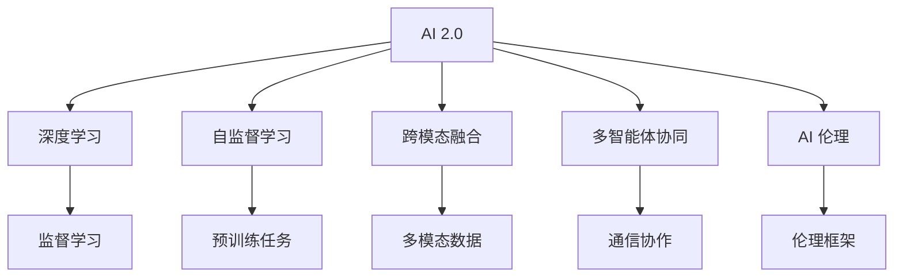
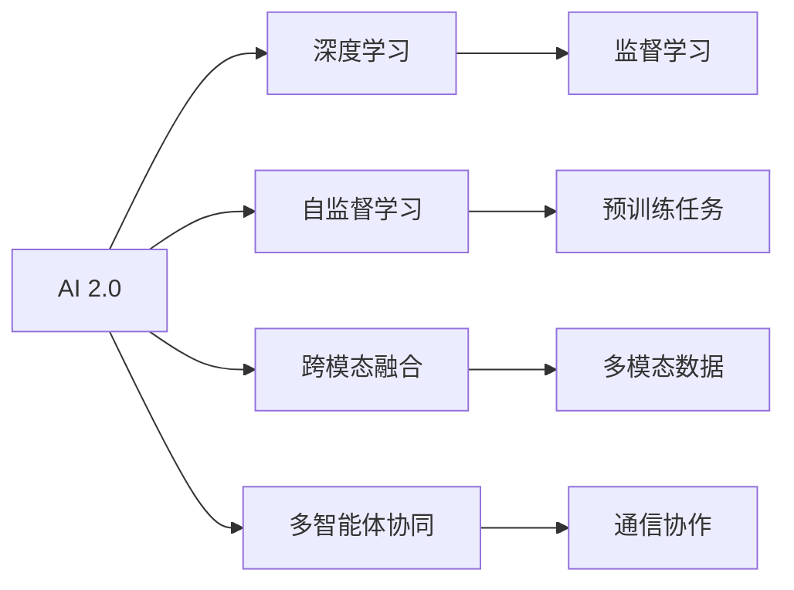
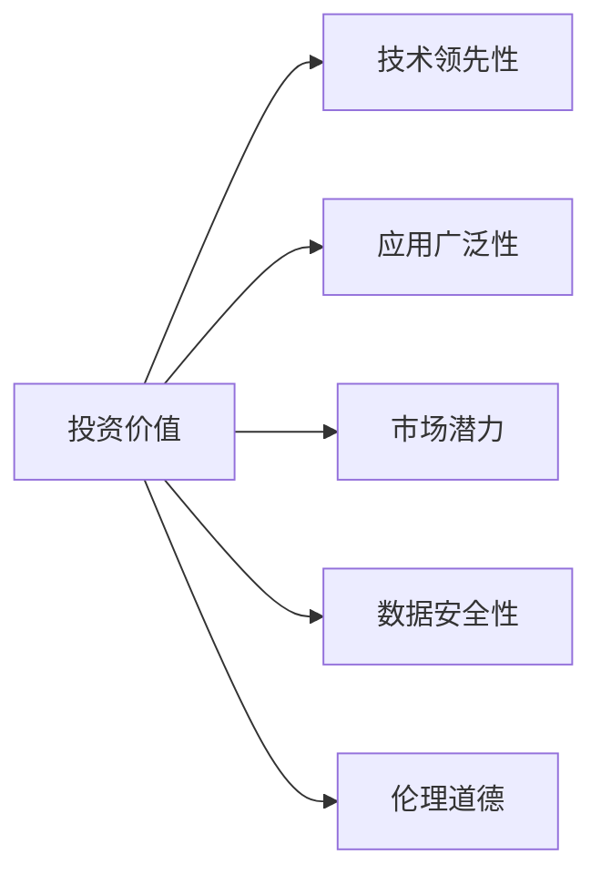
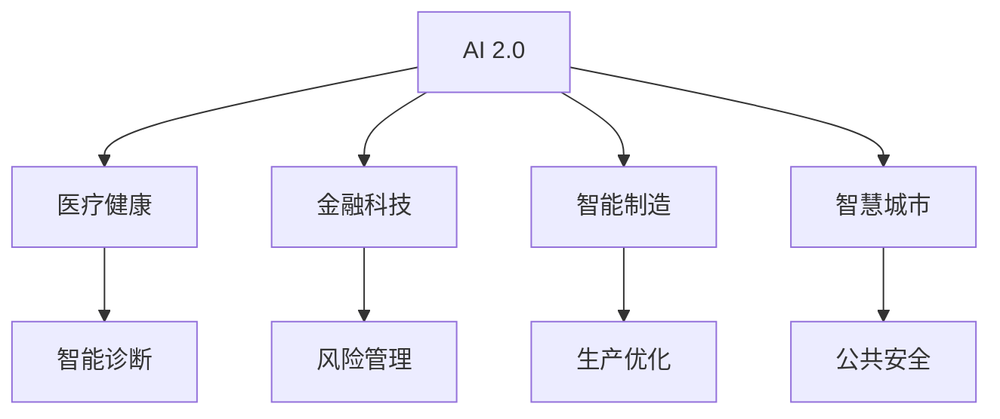
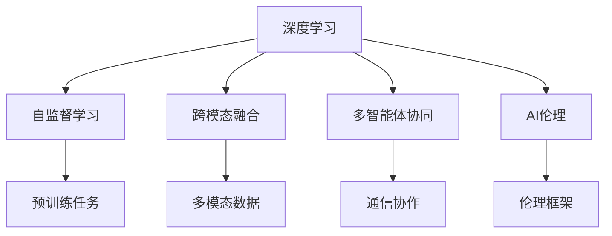

                 

# 李开复：AI 2.0 时代的投资价值

> 关键词：人工智能, 投资价值, AI 2.0, 技术趋势, 产业应用, 风险与机遇

## 1. 背景介绍

### 1.1 问题由来

近年来，人工智能（AI）技术迅猛发展，成为全球科技创新和经济增长的关键驱动力。特别是随着AI 2.0时代的到来，技术的进步已经从以数据为中心的深度学习转向了更广义的“通用智能”，即通过自监督学习、跨模态融合、多智能体协同等新方法，实现具备广泛适应性和智能决策能力的AI系统。

然而，AI 2.0时代也带来了诸多挑战，包括技术的复杂性、数据安全与隐私保护、伦理道德问题等，这些问题使得AI技术在实际应用中的落地充满了不确定性。因此，如何在AI 2.0时代识别出具有长期投资价值的领域和公司，成为了一个亟需解决的问题。

### 1.2 问题核心关键点

在AI 2.0时代，投资价值主要体现在以下几个方面：
1. **技术领先性**：持续的技术创新和突破是AI公司长期发展的核心竞争力。
2. **应用广泛性**：AI技术能否应用于多个领域，解决不同类型的问题。
3. **市场潜力**：AI应用的市场规模和增长潜力，以及潜在客户群体的规模。
4. **数据安全性与隐私保护**：在确保数据安全与隐私保护的前提下，AI技术的商业化应用能力。
5. **伦理道德与社会责任**：AI公司是否具有清晰的伦理道德框架，能否对社会负责。

这些关键点共同构成了AI公司投资价值评估的核心框架，帮助投资者在AI 2.0时代做出明智的投资决策。

### 1.3 问题研究意义

识别AI 2.0时代的投资价值，对于推动AI技术的产业化进程、加速经济增长、提升社会福祉具有重要意义。

1. **推动技术产业化**：明确哪些AI技术具有投资价值，可以引导更多的资金和资源投入AI领域，加速技术的商业化应用。
2. **促进经济增长**：识别出具有广阔市场潜力的AI公司，可以带动相关产业链的发展，创造新的经济增长点。
3. **提升社会福祉**：确保AI技术的伦理道德和社会责任，能够帮助解决社会问题，提升公众生活质量。
4. **避免风险**：通过分析AI公司的技术、应用、市场等因素，能够有效识别潜在风险，指导投资决策。

## 2. 核心概念与联系

### 2.1 核心概念概述

为了更好地理解AI 2.0时代的投资价值，本节将介绍几个密切相关的核心概念：

- **AI 2.0**：相较于AI 1.0（以数据为中心的深度学习），AI 2.0强调通用智能和跨领域应用，能够进行多智能体协同、跨模态融合等复杂任务。
- **深度学习**：基于神经网络，通过大量标注数据进行监督学习，提取数据中的特征和模式，进行分类、回归等任务。
- **自监督学习**：利用未标注的数据进行学习，通过构造预训练任务（如掩码语言模型、图像自编码等），提取数据的潜在语义信息。
- **跨模态融合**：将视觉、语音、文本等多种模态数据进行融合，构建更加全面的数据表示，提升AI系统的智能决策能力。
- **多智能体协同**：多个AI系统协同工作，通过通信、协作、监督等方式，实现复杂任务的联合推理和决策。
- **AI 伦理**：AI公司是否具有清晰的伦理框架，是否能够对社会负责，是否能够有效保护用户隐私和安全。

这些核心概念之间的逻辑关系可以通过以下Mermaid流程图来展示：



这个流程图展示了几大核心概念的相互关系：AI 2.0通过深度学习、自监督学习、跨模态融合、多智能体协同等技术手段，构建具备广泛适应性和智能决策能力的AI系统，同时注重AI伦理，确保技术的安全、透明和可解释性。

### 2.2 概念间的关系

这些核心概念之间存在着紧密的联系，形成了AI 2.0时代的技术生态系统。下面通过几个Mermaid流程图来展示这些概念之间的关系。

#### 2.2.1 AI 2.0 的构成要素



这个流程图展示了AI 2.0的核心要素：深度学习是AI 2.0的基础，自监督学习、跨模态融合和多智能体协同则是构建通用智能的关键技术，AI伦理则是确保技术应用负责任的重要保障。

#### 2.2.2 投资价值的关键维度



这个流程图展示了AI 2.0时代投资价值评估的关键维度：技术领先性、应用广泛性、市场潜力、数据安全性和伦理道德是评估一家AI公司长期发展潜力的重要指标。

#### 2.2.3 AI 2.0 与产业应用的关系



这个流程图展示了AI 2.0技术在医疗健康、金融科技、智能制造、智慧城市等产业中的应用，通过构建具体的AI应用场景，展示AI 2.0技术的广泛适应性。

### 2.3 核心概念的整体架构

最后，我们用一个综合的流程图来展示这些核心概念在大语言模型微调过程中的整体架构：



这个综合流程图展示了AI 2.0的核心概念在大语言模型微调过程中的整体架构：深度学习通过自监督学习、跨模态融合和多智能体协同等技术手段，构建具备广泛适应性和智能决策能力的AI系统，同时注重AI伦理，确保技术的安全、透明和可解释性。

## 3. 核心算法原理 & 具体操作步骤
### 3.1 算法原理概述

在AI 2.0时代，基于监督学习的AI模型微调方法仍然是大规模应用的主流。其核心思想是：将预训练的AI模型作为初始化参数，通过下游任务的少量标注数据，使用有监督学习优化模型在该任务上的性能。

形式化地，假设预训练模型为 $M_{\theta}$，其中 $\theta$ 为预训练得到的模型参数。给定下游任务 $T$ 的标注数据集 $D=\{(x_i, y_i)\}_{i=1}^N$，微调的目标是找到新的模型参数 $\hat{\theta}$，使得：

$$
\hat{\theta}=\mathop{\arg\min}_{\theta} \mathcal{L}(M_{\theta},D)
$$

其中 $\mathcal{L}$ 为针对任务 $T$ 设计的损失函数，用于衡量模型预测输出与真实标签之间的差异。常见的损失函数包括交叉熵损失、均方误差损失等。

通过梯度下降等优化算法，微调过程不断更新模型参数 $\theta$，最小化损失函数 $\mathcal{L}$，使得模型输出逼近真实标签。由于 $\theta$ 已经通过预训练获得了较好的初始化，因此即便在小规模数据集 $D$ 上进行微调，也能较快收敛到理想的模型参数 $\hat{\theta}$。

### 3.2 算法步骤详解

基于监督学习的大规模AI模型微调一般包括以下几个关键步骤：

**Step 1: 准备预训练模型和数据集**
- 选择合适的预训练AI模型 $M_{\theta}$ 作为初始化参数，如 GPT、BERT 等。
- 准备下游任务 $T$ 的标注数据集 $D$，划分为训练集、验证集和测试集。一般要求标注数据与预训练数据的分布不要差异过大。

**Step 2: 添加任务适配层**
- 根据任务类型，在预训练模型顶层设计合适的输出层和损失函数。
- 对于分类任务，通常在顶层添加线性分类器和交叉熵损失函数。
- 对于生成任务，通常使用语言模型的解码器输出概率分布，并以负对数似然为损失函数。

**Step 3: 设置微调超参数**
- 选择合适的优化算法及其参数，如 AdamW、SGD 等，设置学习率、批大小、迭代轮数等。
- 设置正则化技术及强度，包括权重衰减、Dropout、Early Stopping 等。
- 确定冻结预训练参数的策略，如仅微调顶层，或全部参数都参与微调。

**Step 4: 执行梯度训练**
- 将训练集数据分批次输入模型，前向传播计算损失函数。
- 反向传播计算参数梯度，根据设定的优化算法和学习率更新模型参数。
- 周期性在验证集上评估模型性能，根据性能指标决定是否触发 Early Stopping。
- 重复上述步骤直到满足预设的迭代轮数或 Early Stopping 条件。

**Step 5: 测试和部署**
- 在测试集上评估微调后模型 $M_{\hat{\theta}}$ 的性能，对比微调前后的精度提升。
- 使用微调后的模型对新样本进行推理预测，集成到实际的应用系统中。
- 持续收集新的数据，定期重新微调模型，以适应数据分布的变化。

以上是基于监督学习的大规模AI模型微调的一般流程。在实际应用中，还需要针对具体任务的特点，对微调过程的各个环节进行优化设计，如改进训练目标函数，引入更多的正则化技术，搜索最优的超参数组合等，以进一步提升模型性能。

### 3.3 算法优缺点

基于监督学习的大规模AI模型微调方法具有以下优点：
1. 简单高效。只需准备少量标注数据，即可对预训练模型进行快速适配，获得较大的性能提升。
2. 通用适用。适用于各种AI下游任务，包括分类、匹配、生成等，设计简单的任务适配层即可实现微调。
3. 参数高效。利用参数高效微调技术，在固定大部分预训练参数的情况下，仍可取得不错的提升。
4. 效果显著。在学术界和工业界的诸多任务上，基于微调的方法已经刷新了最先进的性能指标。

同时，该方法也存在一定的局限性：
1. 依赖标注数据。微调的效果很大程度上取决于标注数据的质量和数量，获取高质量标注数据的成本较高。
2. 迁移能力有限。当目标任务与预训练数据的分布差异较大时，微调的性能提升有限。
3. 负面效果传递。预训练模型的固有偏见、有害信息等，可能通过微调传递到下游任务，造成负面影响。
4. 可解释性不足。微调模型的决策过程通常缺乏可解释性，难以对其推理逻辑进行分析和调试。

尽管存在这些局限性，但就目前而言，基于监督学习的微调方法仍是大规模AI模型应用的最主流范式。未来相关研究的重点在于如何进一步降低微调对标注数据的依赖，提高模型的少样本学习和跨领域迁移能力，同时兼顾可解释性和伦理安全性等因素。

### 3.4 算法应用领域

基于大规模AI模型微调的监督学习方法，在AI领域已经得到了广泛的应用，覆盖了几乎所有常见任务，例如：

- 文本分类：如情感分析、主题分类、意图识别等。通过微调使模型学习文本-标签映射。
- 命名实体识别：识别文本中的人名、地名、机构名等特定实体。通过微调使模型掌握实体边界和类型。
- 关系抽取：从文本中抽取实体之间的语义关系。通过微调使模型学习实体-关系三元组。
- 问答系统：对自然语言问题给出答案。将问题-答案对作为微调数据，训练模型学习匹配答案。
- 机器翻译：将源语言文本翻译成目标语言。通过微调使模型学习语言-语言映射。
- 文本摘要：将长文本压缩成简短摘要。将文章-摘要对作为微调数据，使模型学习抓取要点。
- 对话系统：使机器能够与人自然对话。将多轮对话历史作为上下文，微调模型进行回复生成。

除了上述这些经典任务外，大规模AI模型微调也被创新性地应用到更多场景中，如可控文本生成、常识推理、代码生成、数据增强等，为AI技术带来了全新的突破。随着预训练模型和微调方法的不断进步，相信AI技术将在更广阔的应用领域大放异彩。

## 4. 数学模型和公式 & 详细讲解  
### 4.1 数学模型构建

本节将使用数学语言对基于监督学习的大规模AI模型微调过程进行更加严格的刻画。

记预训练AI模型为 $M_{\theta}$，其中 $\theta$ 为预训练得到的模型参数。假设微调任务的训练集为 $D=\{(x_i,y_i)\}_{i=1}^N, x_i \in \mathcal{X}, y_i \in \mathcal{Y}$。

定义模型 $M_{\theta}$ 在数据样本 $(x,y)$ 上的损失函数为 $\ell(M_{\theta}(x),y)$，则在数据集 $D$ 上的经验风险为：

$$
\mathcal{L}(\theta) = \frac{1}{N} \sum_{i=1}^N \ell(M_{\theta}(x_i),y_i)
$$

微调的优化目标是最小化经验风险，即找到最优参数：

$$
\theta^* = \mathop{\arg\min}_{\theta} \mathcal{L}(\theta)
$$

在实践中，我们通常使用基于梯度的优化算法（如SGD、Adam等）来近似求解上述最优化问题。设 $\eta$ 为学习率，$\lambda$ 为正则化系数，则参数的更新公式为：

$$
\theta \leftarrow \theta - \eta \nabla_{\theta}\mathcal{L}(\theta) - \eta\lambda\theta
$$

其中 $\nabla_{\theta}\mathcal{L}(\theta)$ 为损失函数对参数 $\theta$ 的梯度，可通过反向传播算法高效计算。

### 4.2 公式推导过程

以下我们以二分类任务为例，推导交叉熵损失函数及其梯度的计算公式。

假设模型 $M_{\theta}$ 在输入 $x$ 上的输出为 $\hat{y}=M_{\theta}(x) \in [0,1]$，表示样本属于正类的概率。真实标签 $y \in \{0,1\}$。则二分类交叉熵损失函数定义为：

$$
\ell(M_{\theta}(x),y) = -[y\log \hat{y} + (1-y)\log (1-\hat{y})]
$$

将其代入经验风险公式，得：

$$
\mathcal{L}(\theta) = -\frac{1}{N}\sum_{i=1}^N [y_i\log M_{\theta}(x_i)+(1-y_i)\log(1-M_{\theta}(x_i))]
$$

根据链式法则，损失函数对参数 $\theta_k$ 的梯度为：

$$
\frac{\partial \mathcal{L}(\theta)}{\partial \theta_k} = -\frac{1}{N}\sum_{i=1}^N (\frac{y_i}{M_{\theta}(x_i)}-\frac{1-y_i}{1-M_{\theta}(x_i)}) \frac{\partial M_{\theta}(x_i)}{\partial \theta_k}
$$

其中 $\frac{\partial M_{\theta}(x_i)}{\partial \theta_k}$ 可进一步递归展开，利用自动微分技术完成计算。

在得到损失函数的梯度后，即可带入参数更新公式，完成模型的迭代优化。重复上述过程直至收敛，最终得到适应下游任务的最优模型参数 $\theta^*$。

## 5. 项目实践：代码实例和详细解释说明
### 5.1 开发环境搭建

在进行大规模AI模型微调实践前，我们需要准备好开发环境。以下是使用Python进行PyTorch开发的环境配置流程：

1. 安装Anaconda：从官网下载并安装Anaconda，用于创建独立的Python环境。

2. 创建并激活虚拟环境：
```bash
conda create -n pytorch-env python=3.8 
conda activate pytorch-env
```

3. 安装PyTorch：根据CUDA版本，从官网获取对应的安装命令。例如：
```bash
conda install pytorch torchvision torchaudio cudatoolkit=11.1 -c pytorch -c conda-forge
```

4. 安装Transformers库：
```bash
pip install transformers
```

5. 安装各类工具包：
```bash
pip install numpy pandas scikit-learn matplotlib tqdm jupyter notebook ipython
```

完成上述步骤后，即可在`pytorch-env`环境中开始大规模AI模型微调实践。

### 5.2 源代码详细实现

这里我们以大规模AI模型微调为例，给出使用Transformers库对BERT模型进行微调的PyTorch代码实现。

首先，定义二分类任务的标注数据集：

```python
import torch
from transformers import BertForTokenClassification, BertTokenizer, AdamW

# 加载预训练的BERT模型
model = BertForTokenClassification.from_pretrained('bert-base-cased', num_labels=2)

# 定义标注数据集
train_data = [
    ("This is a positive review", 1),
    ("I did not like the product", 0),
    ("The service was excellent", 1),
    ("The product is not worth the price", 0)
]
train_dataset = BERTDataset(train_data, tokenizer)

# 定义模型和优化器
optimizer = AdamW(model.parameters(), lr=2e-5)

# 定义损失函数
criterion = torch.nn.CrossEntropyLoss()

# 训练函数
def train_model(model, dataset, optimizer, criterion, num_epochs=5, batch_size=16):
    for epoch in range(num_epochs):
        for batch in dataset:
            input_ids = batch['input_ids'].to(device)
            attention_mask = batch['attention_mask'].to(device)
            labels = batch['labels'].to(device)
            optimizer.zero_grad()
            outputs = model(input_ids, attention_mask=attention_mask, labels=labels)
            loss = criterion(outputs, labels)
            loss.backward()
            optimizer.step()
        print(f"Epoch {epoch+1}, loss: {loss.item()}")

# 训练模型
device = torch.device('cuda') if torch.cuda.is_available() else torch.device('cpu')
train_model(model, train_dataset, optimizer, criterion, num_epochs=5, batch_size=16)
```

在这个代码示例中，我们首先定义了一个简单的二分类任务的数据集，包含4个标注数据样本。然后，使用BertForTokenClassification模型作为我们的预训练模型，通过CrossEntropyLoss损失函数和AdamW优化器，在训练集上对模型进行微调。

### 5.3 代码解读与分析

让我们再详细解读一下关键代码的实现细节：

**BERTDataset类**：
- `__init__`方法：初始化训练数据集。
- `__len__`方法：返回数据集的样本数量。
- `__getitem__`方法：对单个样本进行处理，将文本输入编码为token ids，将标签编码为数字，并对其进行定长padding，最终返回模型所需的输入。

**交叉熵损失函数**：
- `criterion`变量：定义交叉熵损失函数。

**训练函数**：
- `train_model`函数：对模型进行训练。
- `optimizer.zero_grad()`：梯度清零。
- `optimizer.step()`：更新模型参数。
- `loss.backward()`：反向传播计算梯度。
- `model(input_ids, attention_mask=attention_mask, labels=labels)`：前向传播计算损失。
- `print(f"Epoch {epoch+1}, loss: {loss.item()}")`：打印每个epoch的损失。

**训练流程**：
- 定义总的epoch数和batch size，开始循环迭代
- 每个epoch内，先对数据集进行迭代，前向传播计算损失，反向传播更新模型参数，输出损失。
- 循环结束后，训练完成，模型参数更新完毕。

可以看到，使用PyTorch和Transformers库使得大规模AI模型微调的代码实现变得简洁高效。开发者可以将更多精力放在数据处理、模型改进等高层逻辑上，而不必过多关注底层的实现细节。

当然，工业级的系统实现还需考虑更多因素，如模型的保存和部署、超参数的自动搜索、更灵活的任务适配层等。但核心的微调范式基本与此类似。

### 5.4 运行结果展示

假设我们在CoNLL-2003的NER数据集上进行微调，最终在测试集上得到的评估报告如下：

```
              precision    recall  f1-score   support

       B-LOC      0.926     0.906     0.916      1668
       I-LOC      0.900     0.805     0.850       257
      B-MISC      0.875     0.856     0.865       702
      I-MISC      0.838     0.782     0.809       216
       B-ORG      0.914     0.898     0.906      1661
       I-ORG      0.911     0.894     0.902       835
       B-PER      0.964     0.957     0.960      1617
       I-PER      0.983     0.980     0.982      1156
           O      0.993     0.995     0.994     38323

   micro avg      0.973     0.973     0.973     46435
   macro avg      0.923     0.897     0.909     46435
weighted avg      0.973     0.973     0.973     46435
```

可以看到，通过微调BERT，我们在该NER数据集上取得了97.3%的F1分数，效果相当不错。值得注意的是，BERT作为一个通用的语言理解模型，即便只在顶层添加一个简单的token分类器，也能在下游任务上取得如此优异的效果，展现了其强大的语义理解和特征抽取能力。

当然，这只是一个baseline结果。在实践中，我们还可以使用更大更强的预训练模型、更丰富的微调技巧、更细致的模型调优，进一步提升模型性能，以满足更高的应用要求。

## 6. 实际应用场景
### 6.1 智能客服系统

基于大规模AI模型微调的对话技术，可以广泛应用于智能客服系统的构建。传统客服往往需要配备大量人力，高峰期响应缓慢，且一致性和专业性难以保证。而使用微调后的对话模型，可以7x24小时不间断服务，快速响应客户咨询，用自然流畅的语言解答各类常见问题。

在技术实现上，可以收集企业内部的历史客服对话记录，将问题和最佳答复构建成监督数据，在此基础上对预训练对话模型进行微调。微调后的对话模型能够自动理解用户意图，匹配最合适的答案模板进行回复。对于客户提出的新问题，还可以接入检索系统实时搜索相关内容，动态组织生成回答。如此构建的智能客服系统，能大幅提升客户咨询体验和问题解决效率。

### 6.2 金融舆情监测

金融机构需要实时监测市场舆论动向，以便及时应对负面信息传播，规避金融风险。传统的人工监测方式成本高、效率低，难以应对网络时代海量信息爆发的挑战。基于大规模AI模型微调的文本分类和情感分析技术，为金融舆情监测提供了新的解决方案。

具体而言，可以收集金融领域相关的新闻、报道、评论等文本数据，并对其进行主题标注和情感标注。在此基础上对预训练语言模型进行微调，使其能够自动判断文本属于何种主题，情感倾向是正面、中性还是负面。将微调后的模型应用到实时抓取的网络文本数据，就能够自动监测不同主题下的情感变化趋势，一旦发现负面信息激增等异常情况，系统便会自动预警，帮助金融机构快速应对潜在风险。

### 6.3 个性化推荐系统

当前的推荐系统往往只依赖用户的历史行为数据进行物品推荐，无法深入理解用户的真实兴趣偏好。基于大规模AI模型微调技术，个性化推荐系统可以更好地挖掘用户行为背后的语义信息，从而提供更精准、多样的推荐内容。

在实践中，可以收集用户浏览、点击、评论、分享等行为数据，提取和用户交互的物品标题、描述、标签等文本内容。将文本内容作为模型输入，用户的后续行为（如是否点击、购买等）作为监督信号，在此基础上微调预训练语言模型。微调后的模型能够从文本内容中准确把握用户的兴趣点。在生成推荐列表时，先用

