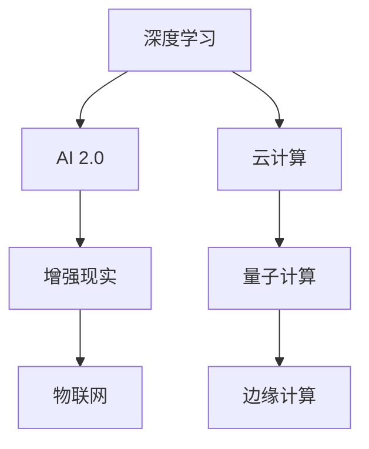

                 

# 李开复：AI 2.0 时代的生态

> 关键词：人工智能, 李开复, AI 2.0, 生态系统, 技术趋势, 未来展望

## 1. 背景介绍

### 1.1 问题由来

人工智能(AI)领域正处于快速变革之中，从AI 1.0向AI 2.0时代过渡。在这个过程中，我们面临新的挑战和机遇。李开复博士，作为人工智能领域的领军人物，对AI 2.0时代的生态系统进行了深入的探讨和预测。

### 1.2 问题核心关键点

AI 2.0时代的生态系统由多个关键组件构成，包括数据、算法、硬件、平台、人才和政策。这些组件相互依赖、相互作用，共同推动AI技术的发展和应用。理解这些组件及其相互关系，对于把握AI 2.0时代的发展方向至关重要。

## 2. 核心概念与联系

### 2.1 核心概念概述

1. **AI 2.0**：指的是基于深度学习和其他先进技术的人工智能系统，能够处理复杂任务，具备自主学习和推理能力。
2. **深度学习**：一种模仿人脑神经网络的学习方法，通过多层神经网络结构，实现对数据的高级抽象和表达。
3. **云计算**：基于互联网的计算服务，通过远程服务器池实现按需计算资源的分配和管理。
4. **量子计算**：一种新型计算技术，利用量子态叠加和纠缠实现超快速计算，具有巨大的潜力。
5. **增强现实(AR)**：通过计算机视觉和传感器技术，将虚拟信息叠加到现实世界，增强用户对环境的理解。

### 2.2 核心概念之间的关系

这些核心概念之间的关系可以通过以下Mermaid流程图来展示：



这个流程图展示了AI 2.0时代各关键技术之间的关系。深度学习作为AI 2.0的基础，通过云计算提供强大的计算能力，增强现实和物联网为AI 2.0的应用场景提供了丰富的数据源，而量子计算则提供了解决复杂计算问题的潜力。

## 3. 核心算法原理 & 具体操作步骤
### 3.1 算法原理概述

AI 2.0时代的核心算法原理包括深度学习、迁移学习、强化学习等。这些算法通过复杂的数学模型和优化技术，实现了对数据的高级抽象和表示，为AI应用提供了坚实的基础。

### 3.2 算法步骤详解

以深度学习为例，其基本步骤包括数据预处理、模型构建、训练和评估等。具体步骤如下：

1. **数据预处理**：收集、清洗和标注数据，将其转化为模型可以处理的格式。
2. **模型构建**：设计神经网络结构，选择合适的损失函数和优化器。
3. **模型训练**：通过反向传播算法更新模型参数，最小化损失函数。
4. **模型评估**：使用测试集评估模型性能，调整模型超参数。

### 3.3 算法优缺点

深度学习的优点包括：
- 可以自动学习数据特征，不需要手工设计特征。
- 模型表达能力强大，适用于各种复杂任务。

其缺点包括：
- 需要大量标注数据，获取成本高。
- 模型复杂，训练时间长，计算资源需求高。

### 3.4 算法应用领域

深度学习在图像识别、语音识别、自然语言处理等领域取得了显著成果。通过迁移学习，模型可以在新的任务上快速适应，大幅减少了标注数据需求。强化学习则在游戏、机器人控制等应用中展示了其独特的优势。

## 4. 数学模型和公式 & 详细讲解 & 举例说明

### 4.1 数学模型构建

深度学习的数学模型通常基于神经网络结构，包括全连接层、卷积层、循环层等。以全连接神经网络为例，其数学模型可以表示为：

$$
f(x) = \sigma(Wx + b)
$$

其中，$f(x)$表示模型输出，$\sigma$为激活函数，$W$和$b$为模型参数。

### 4.2 公式推导过程

以反向传播算法为例，其基本思想是通过链式法则计算梯度，更新模型参数。具体步骤如下：

1. **前向传播**：将输入数据$x$通过神经网络，计算输出$f(x)$。
2. **计算损失**：将输出$f(x)$与真实标签$y$比较，计算损失函数$J$。
3. **反向传播**：通过链式法则计算损失函数对每个参数的梯度$\nabla J$。
4. **参数更新**：使用优化器(如SGD)更新模型参数$W$和$b$，最小化损失函数$J$。

### 4.3 案例分析与讲解

以图像分类为例，假设有一个手写数字识别的数据集，包含60000张训练图像和10000张测试图像。通过深度学习模型(如CNN)进行训练，步骤如下：

1. **数据预处理**：将图像转换为32x32的灰度图像，并进行归一化处理。
2. **模型构建**：设计一个包含3个卷积层和3个池化层的CNN模型。
3. **模型训练**：使用随机梯度下降算法，迭代更新模型参数，最小化损失函数。
4. **模型评估**：在测试集上评估模型性能，计算准确率、召回率等指标。

## 5. 项目实践：代码实例和详细解释说明
### 5.1 开发环境搭建

在开始项目实践前，需要安装Python、TensorFlow或PyTorch等深度学习框架，以及所需的库和工具。

### 5.2 源代码详细实现

以TensorFlow为例，以下是手写数字识别的完整代码实现：

```python
import tensorflow as tf
from tensorflow.keras.datasets import mnist
from tensorflow.keras.models import Sequential
from tensorflow.keras.layers import Conv2D, MaxPooling2D, Flatten, Dense

# 加载数据集
(x_train, y_train), (x_test, y_test) = mnist.load_data()

# 数据预处理
x_train = x_train.reshape((-1, 28, 28, 1)) / 255.0
x_test = x_test.reshape((-1, 28, 28, 1)) / 255.0

# 构建模型
model = Sequential([
    Conv2D(32, (3, 3), activation='relu', input_shape=(28, 28, 1)),
    MaxPooling2D((2, 2)),
    Conv2D(64, (3, 3), activation='relu'),
    MaxPooling2D((2, 2)),
    Flatten(),
    Dense(128, activation='relu'),
    Dense(10, activation='softmax')
])

# 编译模型
model.compile(optimizer='adam', loss='sparse_categorical_crossentropy', metrics=['accuracy'])

# 训练模型
model.fit(x_train, y_train, epochs=10, validation_data=(x_test, y_test))

# 评估模型
model.evaluate(x_test, y_test)
```

### 5.3 代码解读与分析

代码中，首先加载了MNIST数据集，将其转换为32x32的灰度图像，并进行了归一化处理。然后，构建了一个包含两个卷积层、两个池化层和两个全连接层的CNN模型。使用adam优化器和交叉熵损失函数，对模型进行了编译和训练。最后，在测试集上评估了模型的性能。

## 6. 实际应用场景
### 6.1 智能家居

AI 2.0时代的智能家居系统，可以通过深度学习技术实现自动化和智能化。例如，通过传感器数据学习用户的行为习惯，自动调整室内温度、照明等环境设置。

### 6.2 智能医疗

在智能医疗领域，AI 2.0技术可以用于疾病诊断、药物研发、健康管理等。通过深度学习技术，医生可以更准确地诊断疾病，患者可以更好地管理健康数据。

### 6.3 自动驾驶

自动驾驶技术是AI 2.0的重要应用场景之一。通过深度学习和计算机视觉技术，自动驾驶系统可以识别道路、交通标志等，实现自动驾驶。

### 6.4 未来应用展望

未来，AI 2.0技术将在更多领域得到应用，如智慧城市、智能制造、金融科技等。通过与物联网、边缘计算、量子计算等技术的融合，AI 2.0系统将更加智能、高效、安全。

## 7. 工具和资源推荐
### 7.1 学习资源推荐

1. **《深度学习》书籍**：Ian Goodfellow等人合著的深度学习经典教材，全面介绍了深度学习的原理和应用。
2. **Coursera深度学习课程**：由Andrew Ng教授主讲的深度学习课程，涵盖了深度学习的基础理论和实践技巧。
3. **Google AI博客**：谷歌人工智能团队发布的最新技术进展和研究论文，提供丰富的学习资源。
4. **GitHub代码库**：包含深度学习相关的开源项目和代码，提供了大量学习资料和实践经验。

### 7.2 开发工具推荐

1. **TensorFlow**：由谷歌开发的深度学习框架，支持分布式计算和自动微分。
2. **PyTorch**：由Facebook开发的深度学习框架，以其灵活性和易用性著称。
3. **Keras**：一个高层次的深度学习API，提供简单易用的接口，可以快速构建模型。

### 7.3 相关论文推荐

1. **《深度学习》论文**：Yann LeCun等人发表的深度学习综述论文，全面介绍了深度学习的理论基础和应用前景。
2. **《ImageNet分类挑战》论文**：Alex Krizhevsky等人发表的图像分类竞赛论文，展示了深度学习的强大能力。
3. **《AlphaGo》论文**：David Silver等人发表的AlphaGo算法论文，展示了深度学习和强化学习在游戏领域的突破。

## 8. 总结：未来发展趋势与挑战
### 8.1 研究成果总结

AI 2.0时代的生态系统正在快速发展，深度学习、云计算、增强现实等技术为AI应用提供了坚实的基础。通过不断探索和创新，AI 2.0技术将在更多领域发挥重要作用。

### 8.2 未来发展趋势

1. **AI 2.0加速发展**：深度学习、量子计算等技术将进一步提升AI系统的性能和能力。
2. **跨领域融合**：AI 2.0技术将与其他技术如物联网、边缘计算等进行深度融合，实现更广泛的智能化应用。
3. **伦理和社会责任**：AI 2.0系统需要遵守伦理和社会责任，避免对人类社会造成伤害。

### 8.3 面临的挑战

1. **数据隐私和安全**：AI 2.0系统需要处理大量敏感数据，如何保护数据隐私和安全是一个重要挑战。
2. **计算资源瓶颈**：AI 2.0系统需要大量的计算资源，如何高效利用计算资源是一个重要问题。
3. **模型可解释性**：AI 2.0系统往往被认为是"黑盒"模型，如何增强模型的可解释性是一个重要研究方向。

### 8.4 研究展望

未来的研究需要从数据、算法、伦理等多个维度进行深入探索，推动AI 2.0技术的持续进步。通过协同创新，将AI 2.0技术应用于更多领域，为人类的生产和生活带来更大价值。

## 9. 附录：常见问题与解答

**Q1：AI 2.0时代的主要技术有哪些？**

A：AI 2.0时代的主要技术包括深度学习、云计算、增强现实、物联网、量子计算等。这些技术相互结合，推动AI系统的不断进步。

**Q2：AI 2.0技术的应用场景有哪些？**

A：AI 2.0技术的应用场景非常广泛，包括智能家居、智能医疗、自动驾驶、智慧城市等。未来，随着技术的不断发展，AI 2.0技术将在更多领域发挥重要作用。

**Q3：AI 2.0技术面临的挑战有哪些？**

A：AI 2.0技术面临的主要挑战包括数据隐私和安全、计算资源瓶颈、模型可解释性等。通过不断创新和改进，这些挑战有望逐步克服。

**Q4：如何学习和掌握AI 2.0技术？**

A：学习和掌握AI 2.0技术需要不断学习和实践，可以参考相关书籍、参加在线课程、参与开源项目等方式。同时，需要不断关注最新的技术进展和研究论文，保持对新技术的敏感度。

---

作者：禅与计算机程序设计艺术 / Zen and the Art of Computer Programming

