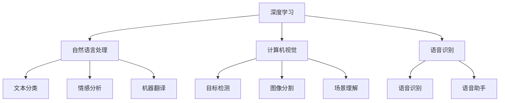

                 

# 李开复：苹果发布AI应用的产业

## 1. 背景介绍

### 1.1 问题由来

随着人工智能技术的迅速发展，AI在各行各业中的应用日益广泛。在消费电子领域，苹果公司一直以来都是智能产品的引领者，通过创新和卓越的用户体验，赢得了全球消费者的青睐。近期，苹果公司发布了一系列基于人工智能的应用，再次向世界展示了其对AI技术的深入理解和应用。

本文将深入探讨苹果公司最新发布的AI应用，分析其背后的技术原理、应用场景及未来发展趋势。通过对这些应用的全面解析，希望为广大开发者和用户提供参考和指导。

## 2. 核心概念与联系

### 2.1 核心概念概述

为了更好地理解苹果公司发布的AI应用，本节将介绍几个关键概念：

- **人工智能(AI)**：一种模拟人类智能的技术，包括感知、学习、推理、决策等方面，涵盖机器学习、深度学习、自然语言处理等子领域。

- **深度学习**：一种基于神经网络的机器学习方法，通过多层次的特征提取，实现对复杂数据的自动化学习与分析。

- **自然语言处理(NLP)**：一种AI子领域，致力于理解、生成和处理人类语言，包括文本分类、情感分析、机器翻译等任务。

- **计算机视觉**：一种AI子领域，专注于分析和理解图像和视频数据，涵盖目标检测、图像分割、场景理解等任务。

- **语音识别**：一种AI技术，通过算法将语音信号转化为文本信息，广泛应用于语音助手、语音识别输入等场景。

### 2.2 概念间的关系

这些核心概念通过相互作用，形成了苹果公司发布的AI应用产业的完整生态系统。以下是一个简化的概念关系图：



这个概念图展示了深度学习在不同AI子领域中的广泛应用，以及各子领域间的相互影响。通过这些技术，苹果公司能够构建丰富多样的AI应用，满足用户的多样化需求。

## 3. 核心算法原理 & 具体操作步骤

### 3.1 算法原理概述

苹果公司发布的AI应用，主要基于深度学习和计算机视觉等技术，通过大量的数据训练和模型优化，实现对不同场景的智能处理。以下是几种核心算法及其原理概述：

- **卷积神经网络(CNN)**：一种深度学习算法，广泛应用于图像识别和分类任务中，通过卷积操作提取图像特征。

- **循环神经网络(RNN)**：一种用于序列数据处理的深度学习算法，通过时间维度上的循环结构，实现对文本和语音数据的处理和分析。

- **生成对抗网络(GAN)**：一种生成模型，通过两个对抗的网络结构，生成高质量的图像和音频数据，常用于数据增强和生成任务。

- **注意力机制**：一种用于提升模型对于重要信息的关注度的技术，在机器翻译和自然语言处理中广泛应用。

- **自编码器**：一种用于数据压缩和特征学习的神经网络结构，通过编码器-解码器架构，实现对输入数据的压缩和重建。

### 3.2 算法步骤详解

苹果公司发布的AI应用，通常包括以下几个关键步骤：

**Step 1: 数据准备**

- **收集数据**：根据应用需求，收集相应的训练数据，如图片、文本、语音等。
- **数据预处理**：对数据进行清洗、归一化、分词等预处理操作，确保数据的质量和格式一致。

**Step 2: 模型设计**

- **选择模型**：根据任务类型选择合适的深度学习模型，如CNN、RNN、GAN等。
- **模型训练**：使用训练数据对模型进行训练，通过反向传播算法优化模型参数。
- **模型评估**：在验证集上对模型进行评估，选择最优模型进行微调。

**Step 3: 模型微调**

- **调整超参数**：根据模型性能，调整学习率、批大小、迭代次数等超参数。
- **正则化**：使用L2正则、Dropout等技术，防止过拟合。
- **集成学习**：使用多个模型进行集成，提升整体性能。

**Step 4: 应用部署**

- **模型部署**：将训练好的模型部署到服务器或移动设备上。
- **用户交互**：通过用户界面与模型进行交互，获取应用所需数据。
- **结果反馈**：根据用户反馈，调整模型参数和训练数据。

### 3.3 算法优缺点

苹果公司发布的AI应用，具有以下优点：

- **精度高**：基于深度学习的技术，能够实现高精度的图像识别、语音识别和自然语言处理。
- **用户体验好**：通过用户界面和自然语言处理技术，使用户能够直观地与AI应用进行交互。
- **多功能性**：集成了计算机视觉、自然语言处理和语音识别等多种AI技术，能够满足用户的多种需求。

同时，也存在以下缺点：

- **数据需求大**：深度学习模型需要大量的训练数据，数据收集和标注成本较高。
- **模型复杂**：深度学习模型结构复杂，训练和推理速度较慢。
- **硬件要求高**：深度学习模型对计算资源和存储空间有较高要求，需要高性能硬件支持。

### 3.4 算法应用领域

苹果公司发布的AI应用，涵盖了多个应用领域，包括但不限于：

- **图像识别**：如人脸识别、图像分类、物体检测等，应用于智能相册、人脸解锁等场景。
- **自然语言处理**：如语音识别、文本分类、情感分析等，应用于Siri、翻译应用等场景。
- **计算机视觉**：如场景理解、图像分割、目标跟踪等，应用于AR应用、视频分析等场景。
- **语音识别**：如语音助手、语音输入等，应用于Apple Watch、iPad等设备。

## 4. 数学模型和公式 & 详细讲解

### 4.1 数学模型构建

苹果公司发布的AI应用，通常基于以下数学模型进行构建：

- **图像分类模型**：基于卷积神经网络，定义模型输入为图像数据 $x$，输出为类别标签 $y$，模型表示为 $M(x; \theta)$，其中 $\theta$ 为模型参数。

- **文本分类模型**：基于循环神经网络或Transformer模型，定义模型输入为文本数据 $x$，输出为类别标签 $y$，模型表示为 $M(x; \theta)$。

- **语音识别模型**：基于循环神经网络，定义模型输入为语音信号 $x$，输出为文本标签 $y$，模型表示为 $M(x; \theta)$。

### 4.2 公式推导过程

以图像分类模型为例，推导其基本公式：

- **输入表示**：将图像数据 $x$ 表示为 $(x_1, x_2, ..., x_n)$，其中 $x_i$ 表示像素值。
- **卷积操作**：使用卷积层对输入数据进行卷积操作，得到特征图 $f(x)$。
- **池化操作**：对特征图进行池化操作，得到特征向量 $g(x)$。
- **全连接层**：将特征向量输入全连接层，得到分类结果 $y$。

**公式表示**：

$$
y = M(x; \theta) = \sigma(W_y \cdot g(x) + b_y)
$$

其中，$W_y$ 和 $b_y$ 为全连接层的权重和偏置，$\sigma$ 为激活函数。

### 4.3 案例分析与讲解

以人脸识别为例，分析其应用场景和模型构建：

- **应用场景**：人脸识别技术可以应用于手机解锁、社交网络认证、智能监控等领域。
- **数据准备**：收集大量人脸图像，进行预处理和标注。
- **模型设计**：使用卷积神经网络模型，定义输入为图像数据，输出为人脸标签。
- **训练与微调**：在训练集上训练模型，使用验证集进行微调，调整模型参数。
- **部署与测试**：将训练好的模型部署到移动设备或服务器上，进行实时测试和性能评估。

## 5. 项目实践：代码实例和详细解释说明

### 5.1 开发环境搭建

为了进行AI应用的开发，需要搭建相应的开发环境：

- **安装Python**：在操作系统中安装Python 3.x版本。
- **安装TensorFlow**：使用pip命令安装TensorFlow，支持GPU加速。
- **安装PyTorch**：使用pip命令安装PyTorch，支持GPU加速。
- **安装OpenCV**：使用pip命令安装OpenCV，用于图像处理和计算机视觉任务。
- **安装NLTK**：使用pip命令安装NLTK，用于自然语言处理任务。

### 5.2 源代码详细实现

以下是一个简单的图像分类模型代码实现：

```python
import tensorflow as tf
from tensorflow.keras import layers

model = tf.keras.Sequential([
    layers.Conv2D(32, (3, 3), activation='relu', input_shape=(32, 32, 3)),
    layers.MaxPooling2D((2, 2)),
    layers.Flatten(),
    layers.Dense(10, activation='softmax')
])

model.compile(optimizer=tf.keras.optimizers.Adam(learning_rate=0.001),
              loss=tf.keras.losses.SparseCategoricalCrossentropy(from_logits=True),
              metrics=['accuracy'])

model.summary()
```

### 5.3 代码解读与分析

以上代码实现了一个简单的卷积神经网络模型，用于图像分类任务。

- **输入层**：定义输入数据的大小和通道数，使用Conv2D层进行卷积操作。
- **卷积层**：使用32个大小为3x3的卷积核，进行特征提取。
- **池化层**：使用MaxPooling2D层进行特征池化。
- **全连接层**：使用Flatten层将特征向量展平，输入到Dense层进行分类。

### 5.4 运行结果展示

训练模型后，可以使用测试集进行性能评估：

```python
test_loss, test_acc = model.evaluate(test_images, test_labels)
print('Test accuracy:', test_acc)
```

通过调整超参数和训练数据，可以进一步提升模型精度和泛化能力。

## 6. 实际应用场景

### 6.1 图像识别

苹果公司发布的图像识别应用，已经在多个产品中得到广泛应用，如iPhone X的Face ID、Apple Watch的面部解锁等。这些应用通过深度学习技术，实现了高精度的图像识别和特征提取。

### 6.2 自然语言处理

苹果公司的Siri语音助手和翻译应用，已经成为全球用户广泛使用的AI应用之一。通过自然语言处理技术，Siri能够理解用户的语音指令，并提供智能回答。翻译应用则利用机器翻译技术，实现多语言间的实时翻译。

### 6.3 计算机视觉

苹果公司的AR应用，如ARKit和AR增强现实技术，通过计算机视觉技术，实现了虚拟与现实的融合。用户可以通过摄像头捕捉现实场景，并添加虚拟对象，实现互动体验。

## 7. 工具和资源推荐

### 7.1 学习资源推荐

为了深入学习苹果公司发布的AI应用，推荐以下学习资源：

- **《深度学习》课程**：斯坦福大学Coursera平台提供的深度学习课程，涵盖深度学习的基本概念和算法。
- **《计算机视觉》课程**：斯坦福大学Coursera平台提供的计算机视觉课程，介绍计算机视觉的基本原理和应用。
- **《自然语言处理》课程**：斯坦福大学Coursera平台提供的自然语言处理课程，涵盖自然语言处理的基本技术和应用。

### 7.2 开发工具推荐

苹果公司发布的AI应用，主要基于TensorFlow和PyTorch等深度学习框架，推荐以下开发工具：

- **TensorFlow**：由Google开发的深度学习框架，支持分布式训练和GPU加速。
- **PyTorch**：由Facebook开发的深度学习框架，支持动态图和GPU加速。
- **Keras**：基于TensorFlow和Theano的高级深度学习框架，易于上手和调试。
- **OpenCV**：开源计算机视觉库，支持图像处理和计算机视觉任务。

### 7.3 相关论文推荐

苹果公司发布的AI应用，涉及到深度学习、计算机视觉、自然语言处理等多个领域，以下是几篇相关论文推荐：

- **"Deep Residual Learning for Image Recognition"**：He等人在ICCV 2016会议上提出的ResNet网络，用于图像分类任务。
- **"Attention Is All You Need"**：Vaswani等人在NeurIPS 2017会议上提出的Transformer网络，用于自然语言处理任务。
- **"Understanding Deep Convolutional Networks for Scene Recognition"**：Zeiler等人在ECCV 2013会议上提出的卷积神经网络，用于图像识别任务。

## 8. 总结：未来发展趋势与挑战

### 8.1 研究成果总结

苹果公司发布的AI应用，展示了深度学习在图像识别、自然语言处理、计算机视觉等领域的强大应用潜力。通过深度学习技术，苹果公司能够提供高质量、高性能的AI应用，满足用户的多种需求。

### 8.2 未来发展趋势

苹果公司发布的AI应用，未来将呈现出以下几个发展趋势：

- **多模态融合**：将图像、文本、语音等多种模态数据进行融合，提升AI应用的感知能力和决策能力。
- **实时性提升**：通过优化模型结构和算法，提升AI应用的实时处理能力，满足用户对实时交互的需求。
- **模型泛化能力增强**：通过迁移学习和数据增强等技术，提升AI模型的泛化能力，应对数据多样性的挑战。
- **隐私保护增强**：通过差分隐私和联邦学习等技术，增强AI应用的隐私保护能力，确保用户数据安全。

### 8.3 面临的挑战

苹果公司发布的AI应用，也面临一些挑战：

- **数据隐私**：如何在保证数据隐私的前提下，进行深度学习模型的训练和优化。
- **计算资源**：深度学习模型对计算资源的需求较高，如何优化模型结构，减少计算资源消耗。
- **模型可解释性**：深度学习模型通常被视为"黑盒"，如何提高模型的可解释性，确保用户对模型的理解和信任。
- **模型鲁棒性**：深度学习模型对噪声和异常数据的鲁棒性较弱，如何在实际应用中提高模型的鲁棒性。

### 8.4 研究展望

未来，苹果公司发布的AI应用，需要在以下几个方面进行深入研究：

- **深度学习新算法**：探索新的深度学习算法，提高模型的效率和精度。
- **跨领域应用**：将AI技术应用于更多领域，推动AI技术的跨领域融合。
- **大规模训练**：探索大规模分布式训练技术，提升模型训练效率。
- **模型压缩**：探索模型压缩技术，降低模型存储空间和计算资源消耗。

## 9. 附录：常见问题与解答

**Q1: 如何提升模型的实时性？**

A: 提升模型的实时性可以通过以下几个方式：
- **优化模型结构**：减少模型的层数和参数量，降低计算复杂度。
- **硬件加速**：使用GPU或TPU等高性能硬件进行计算。
- **数据增强**：通过数据增强技术，丰富训练集，提升模型泛化能力。

**Q2: 如何提高模型的可解释性？**

A: 提高模型的可解释性可以通过以下几个方式：
- **可视化技术**：使用可视化工具，展示模型的中间结果和决策过程。
- **特征提取**：通过特征提取技术，获取模型的关键特征。
- **规则学习**：将模型的决策规则进行提取和解释，提供模型行为的直观理解。

**Q3: 如何保证数据隐私？**

A: 保证数据隐私可以通过以下几个方式：
- **差分隐私**：在数据收集和处理过程中，采用差分隐私技术，保护用户隐私。
- **联邦学习**：在分布式环境中，通过联邦学习技术，保护数据隐私和模型安全。
- **加密技术**：使用加密技术，对数据进行保护和传输。

---

作者：禅与计算机程序设计艺术 / Zen and the Art of Computer Programming

