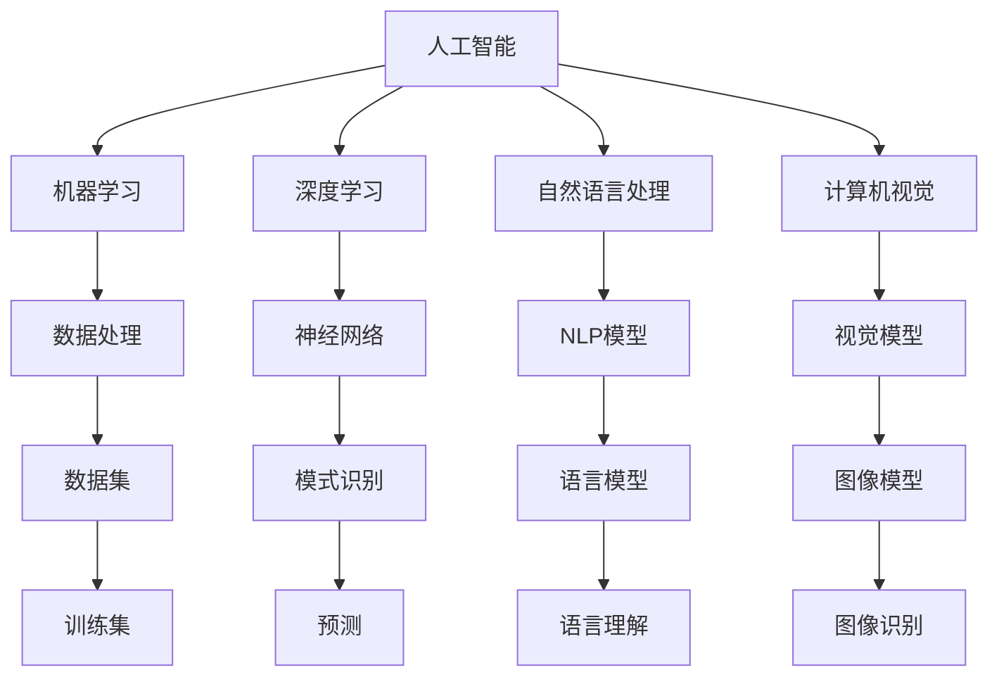

                 

# 李开复：苹果发布AI应用的市场

在人工智能领域的繁荣景象中，苹果公司（Apple）在AI应用市场的最新动作引起了广泛的关注。李开复博士，作为AI领域的权威，他对苹果的AI发展战略进行了深入分析，揭示了苹果在这一领域的雄心与策略。

## 1. 背景介绍

随着AI技术的不断进步，越来越多的企业将AI应用作为提升业务竞争力的重要手段。苹果公司，作为全球科技巨头，也在加速布局AI领域，旨在通过AI技术重塑产品和服务，进一步巩固其市场领导地位。李开复博士指出，苹果的AI应用市场不仅关乎技术创新，更关乎公司整体的战略布局和发展方向。

## 2. 核心概念与联系

### 2.1 核心概念概述

在探讨苹果的AI应用市场时，我们需要理解以下几个核心概念：

- **人工智能（AI）**：指模拟人类智能过程的技术，包括机器学习、深度学习、自然语言处理、计算机视觉等领域。
- **机器学习（ML）**：指让计算机从数据中学习模式并做出预测或决策的过程。
- **深度学习（DL）**：机器学习的一种，通过多层神经网络进行复杂模式识别和决策。
- **自然语言处理（NLP）**：使计算机能够理解、处理和生成人类语言的技术。
- **计算机视觉（CV）**：让计算机能够“看”和“理解”图像和视频的技术。

这些核心概念相互关联，共同构成了人工智能技术的基础架构。

### 2.2 核心概念原理和架构的 Mermaid 流程图



这个流程图展示了人工智能、机器学习、深度学习、自然语言处理和计算机视觉等概念之间的关系。每个概念都有其核心技术，通过数据处理、模型训练和推理等环节，共同完成复杂任务。

## 3. 核心算法原理 & 具体操作步骤

### 3.1 算法原理概述

苹果在AI应用市场的主要策略是利用深度学习和机器学习技术，开发具有高度智能化的产品和服务。其核心算法原理包括以下几个方面：

- **数据驱动的决策**：通过大规模数据集进行训练，学习数据中的模式，并据此做出预测和决策。
- **端到端的训练**：从原始数据到最终输出，通过端到端的深度学习模型，直接输出结果，无需中间处理。
- **自监督学习**：通过未标注的数据进行预训练，学习通用的特征表示，再通过监督学习进行微调。

这些原理构成了苹果AI应用的基石，使得其产品在性能和用户体验上均有所突破。

### 3.2 算法步骤详解

苹果的AI应用开发步骤一般包括以下几个关键步骤：

1. **数据收集与处理**：收集与目标应用相关的数据，并进行清洗、标注和归一化等预处理。
2. **模型选择与设计**：选择合适的深度学习模型，设计网络结构和超参数。
3. **模型训练与优化**：使用大规模数据集进行模型训练，通过反向传播等优化算法调整模型参数。
4. **模型评估与验证**：在验证集上评估模型性能，通过调整超参数和改进模型结构进行优化。
5. **模型部署与监控**：将训练好的模型部署到实际应用中，进行实时监控和性能评估。

### 3.3 算法优缺点

苹果的AI应用开发方法具有以下优点：

- **高效性**：端到端的训练过程简化了中间步骤，提高了开发效率。
- **精度高**：大规模数据训练和自监督学习使得模型精度较高，能够处理复杂任务。
- **可扩展性**：模型训练和优化过程可多次迭代，适用于不断变化的市场需求。

同时，也存在一些缺点：

- **资源消耗大**：大规模数据集和复杂模型需要大量计算资源，成本较高。
- **难以解释**：深度学习模型的决策过程复杂，难以解释其内部工作机制。
- **过拟合风险**：模型复杂度高，容易出现过拟合现象。

### 3.4 算法应用领域

苹果的AI应用涵盖了以下几个主要领域：

- **图像识别**：如Face ID、拍照功能等，利用计算机视觉技术识别和处理图像。
- **语音识别**：如Siri、语音助手等，利用自然语言处理技术理解人类语音并做出响应。
- **推荐系统**：如Apple Music、App Store等，利用机器学习推荐个性化内容和服务。
- **数据分析**：如iOS数据分析平台，利用机器学习技术分析用户行为，优化产品设计。
- **增强现实（AR）**：如ARKit、AR体验等，利用计算机视觉和深度学习技术创建虚拟现实体验。

## 4. 数学模型和公式 & 详细讲解

### 4.1 数学模型构建

在苹果的AI应用中，常用的数学模型包括线性回归、决策树、支持向量机、神经网络等。

以线性回归模型为例，其数学模型构建如下：

$$ y = w_0 + w_1x_1 + w_2x_2 + \cdots + w_nx_n + \epsilon $$

其中，$y$ 为输出变量，$x_i$ 为输入变量，$w_i$ 为模型参数，$\epsilon$ 为随机误差。

### 4.2 公式推导过程

以线性回归模型为例，其公式推导过程如下：

1. **目标函数**：最小化损失函数，即最小化实际值与预测值之间的差异。
2. **梯度下降**：通过梯度下降算法，调整模型参数，使损失函数最小化。
3. **正则化**：通过加入正则项，防止过拟合，如L1正则、L2正则等。

### 4.3 案例分析与讲解

以Face ID为例，其背后的数学模型包括卷积神经网络（CNN）和softmax回归。通过CNN提取面部特征，再通过softmax回归预测面部是否为授权用户。

## 5. 项目实践：代码实例和详细解释说明

### 5.1 开发环境搭建

苹果的AI应用开发环境包括Python、TensorFlow、PyTorch等。开发环境搭建如下：

1. **安装Python**：安装Python 3.7及以上版本，建议使用Anaconda管理依赖。
2. **安装TensorFlow和PyTorch**：通过pip安装TensorFlow和PyTorch，支持GPU加速。
3. **安装其他依赖库**：如NumPy、Pandas、Scikit-learn等。

### 5.2 源代码详细实现

以Face ID为例，其源代码实现如下：

```python
import tensorflow as tf
from tensorflow.keras.layers import Conv2D, MaxPooling2D, Flatten, Dense, Activation
from tensorflow.keras.models import Sequential
from tensorflow.keras.losses import categorical_crossentropy

# 定义模型结构
model = Sequential()
model.add(Conv2D(32, (3, 3), input_shape=(32, 32, 3)))
model.add(Activation('relu'))
model.add(MaxPooling2D((2, 2)))
model.add(Conv2D(64, (3, 3)))
model.add(Activation('relu'))
model.add(MaxPooling2D((2, 2)))
model.add(Conv2D(128, (3, 3)))
model.add(Activation('relu'))
model.add(MaxPooling2D((2, 2)))
model.add(Flatten())
model.add(Dense(64))
model.add(Activation('relu'))
model.add(Dense(2))
model.add(Activation('softmax'))

# 编译模型
model.compile(optimizer='adam', loss=categorical_crossentropy, metrics=['accuracy'])

# 训练模型
model.fit(X_train, y_train, epochs=10, batch_size=32)

# 评估模型
model.evaluate(X_test, y_test)
```

### 5.3 代码解读与分析

以上代码实现了Face ID的基本模型结构，包括卷积层、池化层、全连接层和softmax回归。其中，Conv2D层用于提取面部特征，MaxPooling2D层用于减小特征图大小，Flatten层将特征图展开为一维向量，Dense层用于分类。

## 6. 实际应用场景

苹果的AI应用已经在多个场景中得到广泛应用，如：

- **医疗健康**：利用深度学习分析医疗影像，提供诊断辅助。
- **自动驾驶**：利用计算机视觉和深度学习技术，实现自动驾驶功能。
- **智能家居**：利用自然语言处理技术，实现智能家居控制。
- **个性化推荐**：利用机器学习推荐个性化商品和服务。
- **智能客服**：利用自然语言处理技术，实现智能客服和客户支持。

## 7. 工具和资源推荐

### 7.1 学习资源推荐

1. **机器学习课程**：斯坦福大学、Coursera、edX等平台提供的机器学习课程，涵盖从基础到高级的内容。
2. **深度学习框架**：TensorFlow、PyTorch、MXNet等深度学习框架，提供了丰富的预训练模型和工具。
3. **自然语言处理库**：NLTK、spaCy等自然语言处理库，提供了丰富的NLP工具和模型。
4. **计算机视觉库**：OpenCV、Pillow等计算机视觉库，提供了丰富的图像处理工具。
5. **在线学习平台**：Kaggle、Udacity等在线学习平台，提供了大量的数据集和竞赛。

### 7.2 开发工具推荐

1. **Jupyter Notebook**：Python开发常用的交互式编程环境，支持代码编写、数据可视化等功能。
2. **Git**：版本控制系统，支持代码管理和协作开发。
3. **Docker**：容器化技术，支持模型和应用的快速部署和扩展。
4. **TensorBoard**：可视化工具，支持模型训练过程和结果的可视化。
5. **Weights & Biases**：实验跟踪工具，支持模型训练的记录和评估。

### 7.3 相关论文推荐

1. **《深度学习》（Deep Learning）**：Ian Goodfellow等著，全面介绍了深度学习的基本原理和应用。
2. **《计算机视觉：模型、学习、发现》（Computer Vision: Models, Learning, and Discovery）**：Joachim Makhoul等著，详细介绍了计算机视觉的基本原理和应用。
3. **《自然语言处理综论》（Speech and Language Processing）**：Daniel Jurafsky等著，全面介绍了自然语言处理的基本原理和应用。

## 8. 总结：未来发展趋势与挑战

### 8.1 研究成果总结

苹果在AI应用市场的布局，已经取得了显著成效。其AI技术不仅提升了产品性能，还拓展了新的应用场景，增强了市场竞争力。

### 8.2 未来发展趋势

未来，苹果在AI应用市场的发展趋势包括：

1. **边缘计算**：利用边缘计算技术，将AI模型部署到移动设备上，实现低延迟、高效率的应用。
2. **混合现实**：利用增强现实和虚拟现实技术，实现更加沉浸式的用户交互体验。
3. **联邦学习**：利用联邦学习技术，保护用户隐私的同时，实现全球范围内的模型训练和优化。
4. **智能芯片**：利用自研的芯片技术，提升AI应用的计算效率和性能。

### 8.3 面临的挑战

苹果在AI应用市场的发展面临以下挑战：

1. **数据隐私**：如何在保护用户隐私的前提下，获取足够的训练数据。
2. **计算资源**：如何优化模型结构，降低计算资源消耗。
3. **模型解释性**：如何提升模型的可解释性，增强用户信任。
4. **市场竞争**：如何在激烈的市场竞争中，保持技术领先。

### 8.4 研究展望

未来，苹果在AI应用市场的研究展望包括：

1. **模型压缩**：利用模型压缩技术，优化模型结构，提高计算效率。
2. **可解释性增强**：利用可解释性技术，提升模型决策的可理解性。
3. **跨领域融合**：将AI技术与更多领域的技术进行融合，实现跨领域的应用。
4. **伦理与道德**：加强伦理和道德研究，确保AI应用的安全性和可信度。

## 9. 附录：常见问题与解答

**Q1: 苹果的AI应用是如何进行数据训练的？**

A: 苹果的AI应用主要利用大规模数据集进行训练。其数据集包括来自iOS设备的传感器数据、用户行为数据、公共数据集等。苹果还开发了数据标注工具，用于数据清洗、标注和归一化等预处理。

**Q2: 苹果的AI应用开发中，如何保证模型解释性？**

A: 苹果在AI应用开发中，利用可解释性技术，如LIME（Local Interpretable Model-agnostic Explanations）、SHAP（Shapley Additive Explanations）等，提升模型的可解释性。这些技术可以帮助用户理解模型的决策过程，增强用户信任。

**Q3: 苹果的AI应用在实际应用中，如何保证数据隐私？**

A: 苹果在AI应用中，利用联邦学习技术，将模型训练和优化过程分布式进行，确保用户数据在本地设备上进行训练，不会泄露到云端。此外，苹果还采用了差分隐私技术，保护用户数据隐私。

---

作者：禅与计算机程序设计艺术 / Zen and the Art of Computer Programming

