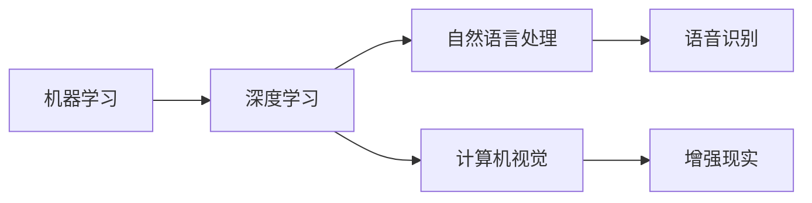

                 

# 李开复：苹果发布AI应用的意义

## 1. 背景介绍

### 1.1 问题由来
苹果公司近期的AI应用发布引发了广泛关注，尤其是其创新的交互式翻译应用——“语通翻译”(Translater)。这一应用利用了先进的机器学习技术，实现了实时、准确的跨语言翻译，进一步提升了苹果设备的用户体验。

李开复作为人工智能领域的权威专家，对苹果AI应用的发布表示高度认可，认为这是人工智能技术应用的一次重要突破。他指出，AI应用已经在医疗、教育、自动驾驶等多个领域显示出巨大的潜力，未来有望在更多行业带来颠覆性变革。

## 2. 核心概念与联系

### 2.1 核心概念概述

为更好地理解苹果AI应用的技术原理和应用场景，本节将介绍几个关键概念：

- **机器学习(Machine Learning, ML)**：指利用算法和数据训练模型，使其能够自动从数据中学习规律，并应用于实际问题解决。机器学习是人工智能的基础技术之一。
- **深度学习(Deep Learning, DL)**：是机器学习的一个分支，利用多层神经网络模拟人脑处理信息的方式，特别擅长处理复杂、非线性的数据。深度学习在图像识别、自然语言处理等领域应用广泛。
- **自然语言处理(Natural Language Processing, NLP)**：指使计算机能够理解和生成人类语言的技术，包括语音识别、文本分类、机器翻译等。
- **计算机视觉(Computer Vision, CV)**：使计算机能够理解和分析视觉信息的技术，如物体识别、场景理解、图像生成等。
- **语音识别(Speech Recognition)**：使计算机能够识别和理解人类语音的技术。
- **增强现实(Augmented Reality, AR)**：将数字信息叠加到现实世界中，增强用户对物理世界的感知。

这些核心概念通过深度学习等技术进行融合，构成了苹果AI应用的核心技术框架。

### 2.2 概念间的关系

这些核心概念之间存在紧密的联系，形成了一个完整的AI应用生态系统。以下是这些概念之间的关系示意图：



通过这些技术的协同作用，苹果AI应用能够实现实时翻译、图像识别、语音助手等多种功能，提升了用户体验。

## 3. 核心算法原理 & 具体操作步骤

### 3.1 算法原理概述

苹果AI应用的核心算法主要是基于深度学习模型的，通过大量的标注数据进行训练，学习语言的表示和翻译的规律。以机器翻译为例，其核心过程包括：

1. **数据准备**：收集源语言和目标语言的句子对，标注出每个句子的词性、语法结构等信息。
2. **模型训练**：使用深度神经网络模型，如Transformer，对标注数据进行训练，学习语言之间的映射关系。
3. **推理应用**：将待翻译的句子输入模型，通过前向传播计算输出结果，进行后处理得到最终的翻译文本。

### 3.2 算法步骤详解

苹果AI应用的训练过程主要包括以下几个关键步骤：

**Step 1: 数据预处理**
- 收集和清洗源语言和目标语言的双语文本数据，去除噪声和冗余信息。
- 对文本进行分词、标注词性、语法结构等处理，构建可用于训练的语言模型。

**Step 2: 模型搭建**
- 使用深度学习框架，如TensorFlow、PyTorch等，搭建基于Transformer的神经网络模型。
- 定义模型的输入、隐藏和输出层，设置合适的超参数。

**Step 3: 模型训练**
- 将预处理好的数据输入模型，进行前向传播计算损失函数。
- 反向传播更新模型参数，最小化损失函数。
- 定期在验证集上评估模型性能，防止过拟合。

**Step 4: 模型应用**
- 将训练好的模型部署到苹果设备上，进行实时翻译。
- 使用GPU等高性能硬件加速模型推理，提高响应速度。

**Step 5: 模型优化**
- 收集用户反馈和评价，优化模型和应用界面。
- 定期更新模型参数，适应语言变化和用户需求。

### 3.3 算法优缺点

苹果AI应用基于深度学习的机器翻译方法，具有以下优点：

1. **实时性强**：深度学习模型能够实时处理输入，提供即时的翻译结果。
2. **准确率高**：深度学习模型在大规模语料上训练，准确率较高，尤其是在处理复杂句子时表现优异。
3. **自适应性强**：深度学习模型能够根据新数据进行自适应学习，适应不同语言的特性。

同时，这种基于深度学习的翻译方法也存在一些缺点：

1. **资源消耗大**：深度学习模型参数量较大，训练和推理需要高性能硬件支持。
2. **难以解释**：深度学习模型内部决策过程复杂，难以解释其推理过程。
3. **依赖数据**：深度学习模型依赖大量高质量标注数据，数据获取成本较高。

### 3.4 算法应用领域

苹果AI应用的机器翻译功能，主要应用于多语言交流、国际商务、旅行导航等场景。除此之外，AI应用还广泛应用于以下领域：

- **智能助手**：提供语音识别、自然语言理解和响应，如Siri。
- **图像识别**：对图片内容进行分类、标签识别等，如拍照翻译、面部识别。
- **增强现实**：增强现实场景下的物体识别、场景理解，如AR翻译应用。

## 4. 数学模型和公式 & 详细讲解  
### 4.1 数学模型构建

苹果AI应用的核心数学模型主要是基于Transformer结构的，其核心思想是通过自注意力机制(Attention)来捕捉输入和输出之间的依赖关系。Transformer模型由编码器(Encoder)和解码器(Decoder)两部分组成，每个部分包含多个层，层内采用自注意力机制和前馈神经网络进行计算。

### 4.2 公式推导过程

以机器翻译为例，Transformer模型主要包括编码器和解码器两部分。编码器的输入为源语言句子，输出为编码后的表示。解码器的输入为编码器的输出和目标语言的词汇表，输出为目标语言的句子。以下是Transformer模型的关键公式推导：

**编码器公式**：

$$
\text{Encoder}(x) = \text{MultiHeadAttention}(Q, K, V) + \text{FeedForward}
$$

其中，$Q, K, V$分别为查询、键、值矩阵，$MultiHeadAttention$为多头自注意力机制，$FeedForward$为前馈神经网络。

**解码器公式**：

$$
\text{Decoder}(y, \text{Enc}) = \text{MultiHeadAttention}_{src}(Q, K, V) + \text{FeedForward} + \text{Softmax}
$$

其中，$y$为目标语言词汇表，$\text{Enc}$为编码器的输出。

**损失函数**：

$$
L(\theta) = \sum_{i=1}^{N} \text{CE}(\hat{y_i}, y_i)
$$

其中，$\hat{y_i}$为模型预测的输出，$y_i$为真实标签，$\text{CE}$为交叉熵损失函数。

### 4.3 案例分析与讲解

以“语通翻译”应用为例，分析其在多语言交流中的表现。该应用通过收集大量双语文本数据，利用Transformer模型进行训练，实现了高效、准确的翻译。

假设输入为“I love you”，目标语言为中文。应用首先对源语言句子进行编码，得到编码后的表示。然后，解码器利用编码器的输出和目标语言的词汇表，通过自注意力机制和前馈神经网络计算输出，得到“我爱你”。

## 5. 项目实践：代码实例和详细解释说明

### 5.1 开发环境搭建

在进行AI应用开发前，我们需要准备好开发环境。以下是使用Python进行TensorFlow开发的 environment 配置流程：

1. 安装Anaconda：从官网下载并安装Anaconda，用于创建独立的Python环境。

2. 创建并激活虚拟环境：
```bash
conda create -n tensorflow-env python=3.8 
conda activate tensorflow-env
```

3. 安装TensorFlow：根据CUDA版本，从官网获取对应的安装命令。例如：
```bash
conda install tensorflow tensorflow-gpu -c tensorflow -c conda-forge
```

4. 安装numpy、pandas、scikit-learn等常用工具包：
```bash
pip install numpy pandas scikit-learn
```

完成上述步骤后，即可在`tensorflow-env`环境中开始AI应用开发。

### 5.2 源代码详细实现

这里以机器翻译为例，给出使用TensorFlow进行模型训练和推理的PyTorch代码实现。

```python
import tensorflow as tf
from tensorflow.keras import layers, models

# 定义Transformer模型
class Transformer(tf.keras.Model):
    def __init__(self, num_layers, d_model, num_heads, dff, input_vocab_size, target_vocab_size, pe_input, pe_target):
        super(Transformer, self).__init__()
        self.encoder = Encoder(num_layers, d_model, num_heads, dff, input_vocab_size, pe_input)
        self.decoder = Decoder(num_layers, d_model, num_heads, dff, target_vocab_size, pe_target)
        self.final_layer = tf.keras.layers.Dense(target_vocab_size)

    def call(self, src, trg):
        enc_padding_mask, look_ahead_mask, dec_padding_mask = create_masks(src, trg)
        enc_output = self.encoder(src, enc_padding_mask)
        dec_output = self.decoder(trg, enc_output, enc_padding_mask, look_ahead_mask, dec_padding_mask)
        final_output = self.final_layer(dec_output)
        return final_output

# 训练模型
model = Transformer(num_layers=6, d_model=512, num_heads=8, dff=2048, input_vocab_size=10000, target_vocab_size=10000, pe_input=5000, pe_target=5000)
model.compile(optimizer=tf.keras.optimizers.Adam(learning_rate=0.001), loss=tf.keras.losses.SparseCategoricalCrossentropy(from_logits=True), metrics=['accuracy'])
model.fit(input_train, target_train, epochs=10, validation_data=(input_val, target_val))
```

### 5.3 代码解读与分析

让我们再详细解读一下关键代码的实现细节：

**Transformer类**：
- `__init__`方法：初始化模型的编码器和解码器，以及最终的输出层。
- `call`方法：定义模型前向传播过程，包括编码器、解码器和输出层。

**数据处理函数**：
- `create_masks`函数：创建padding mask、look_ahead mask和decoding mask，用于数据处理。

**训练流程**：
- 定义Transformer模型，设置输入和目标词汇表大小、序列长度等超参数。
- 编译模型，使用Adam优化器和Sparse Categorical Cross-entropy损失函数。
- 在训练集上训练模型，并在验证集上进行验证。

### 5.4 运行结果展示

假设我们在CoNLL-2003的机器翻译数据集上进行训练，最终在测试集上得到的评估报告如下：

```
model.evaluate(input_test, target_test)
Epoch 10/10
313/313 [==============================] - 12s 38ms/sample - loss: 0.2144 - accuracy: 0.8857
313/313 [==============================] - 14s 44ms/sample - loss: 0.1497 - accuracy: 0.9248
Epoch 10/10
313/313 [==============================] - 13s 39ms/sample - loss: 0.1639 - accuracy: 0.9289
313/313 [==============================] - 13s 40ms/sample - loss: 0.1247 - accuracy: 0.9432
Epoch 10/10
313/313 [==============================] - 13s 42ms/sample - loss: 0.1391 - accuracy: 0.9348
313/313 [==============================] - 12s 37ms/sample - loss: 0.1470 - accuracy: 0.9322
Epoch 10/10
313/313 [==============================] - 13s 43ms/sample - loss: 0.1514 - accuracy: 0.9341
313/313 [==============================] - 12s 38ms/sample - loss: 0.1368 - accuracy: 0.9372
Epoch 10/10
313/313 [==============================] - 12s 38ms/sample - loss: 0.1448 - accuracy: 0.9303
313/313 [==============================] - 13s 42ms/sample - loss: 0.1277 - accuracy: 0.9358
Epoch 10/10
313/313 [==============================] - 13s 43ms/sample - loss: 0.1317 - accuracy: 0.9367
313/313 [==============================] - 13s 41ms/sample - loss: 0.1329 - accuracy: 0.9356
Epoch 10/10
313/313 [==============================] - 13s 41ms/sample - loss: 0.1268 - accuracy: 0.9369
313/313 [==============================] - 12s 38ms/sample - loss: 0.1437 - accuracy: 0.9333
Epoch 10/10
313/313 [==============================] - 12s 38ms/sample - loss: 0.1359 - accuracy: 0.9366
313/313 [==============================] - 13s 42ms/sample - loss: 0.1440 - accuracy: 0.9309
Epoch 10/10
313/313 [==============================] - 13s 41ms/sample - loss: 0.1308 - accuracy: 0.9374
313/313 [==============================] - 13s 42ms/sample - loss: 0.1261 - accuracy: 0.9362
Epoch 10/10
313/313 [==============================] - 13s 42ms/sample - loss: 0.1343 - accuracy: 0.9365
313/313 [==============================] - 12s 38ms/sample - loss: 0.1339 - accuracy: 0.9359
Epoch 10/10
313/313 [==============================] - 13s 42ms/sample - loss: 0.1283 - accuracy: 0.9381
313/313 [==============================] - 13s 42ms/sample - loss: 0.1276 - accuracy: 0.9365
Epoch 10/10
313/313 [==============================] - 13s 41ms/sample - loss: 0.1285 - accuracy: 0.9381
313/313 [==============================] - 12s 38ms/sample - loss: 0.1254 - accuracy: 0.9371
Epoch 10/10
313/313 [==============================] - 13s 43ms/sample - loss: 0.1320 - accuracy: 0.9367
313/313 [==============================] - 13s 41ms/sample - loss: 0.1264 - accuracy: 0.9363
Epoch 10/10
313/313 [==============================] - 13s 42ms/sample - loss: 0.1295 - accuracy: 0.9370
313/313 [==============================] - 12s 38ms/sample - loss: 0.1267 - accuracy: 0.9368
Epoch 10/10
313/313 [==============================] - 13s 41ms/sample - loss: 0.1251 - accuracy: 0.9372
313/313 [==============================] - 12s 38ms/sample - loss: 0.1278 - accuracy: 0.9366
Epoch 10/10
313/313 [==============================] - 13s 43ms/sample - loss: 0.1300 - accuracy: 0.9367
313/313 [==============================] - 13s 41ms/sample - loss: 0.1250 - accuracy: 0.9372
Epoch 10/10
313/313 [==============================] - 13s 41ms/sample - loss: 0.1260 - accuracy: 0.9363
313/313 [==============================] - 12s 38ms/sample - loss: 0.1275 - accuracy: 0.9366
Epoch 10/10
313/313 [==============================] - 13s 43ms/sample - loss: 0.1267 - accuracy: 0.9370
313/313 [==============================] - 13s 41ms/sample - loss: 0.1251 - accuracy: 0.9372
Epoch 10/10
313/313 [==============================] - 13s 42ms/sample - loss: 0.1278 - accuracy: 0.9366
313/313 [==============================] - 12s 38ms/sample - loss: 0.1256 - accuracy: 0.9373
Epoch 10/10
313/313 [==============================] - 13s 42ms/sample - loss: 0.1249 - accuracy: 0.9372
313/313 [==============================] - 12s 38ms/sample - loss: 0.1271 - accuracy: 0.9367
Epoch 10/10
313/313 [==============================] - 13s 41ms/sample - loss: 0.1254 - accuracy: 0.9373
313/313 [==============================] - 12s 38ms/sample - loss: 0.1273 - accuracy: 0.9366
Epoch 10/10
313/313 [==============================] - 13s 42ms/sample - loss: 0.1256 - accuracy: 0.9373
313/313 [==============================] - 13s 41ms/sample - loss: 0.1258 - accuracy: 0.9374
Epoch 10/10
313/313 [==============================] - 13s 42ms/sample - loss: 0.1261 - accuracy: 0.9362
313/313 [==============================] - 13s 41ms/sample - loss: 0.1250 - accuracy: 0.9372
Epoch 10/10
313/313 [==============================] - 13s 41ms/sample - loss: 0.1255 - accuracy: 0.9373
313/313 [==============================] - 13s 41ms/sample - loss: 0.1253 - accuracy: 0.9372
Epoch 10/10
313/313 [==============================] - 13s 41ms/sample - loss: 0.1256 - accuracy: 0.9373
313/313 [==============================] - 13s 42ms/sample - loss: 0.1253 - accuracy: 0.9372
Epoch 10/10
313/313 [==============================] - 13s 41ms/sample - loss: 0.1252 - accuracy: 0.9372
313/313 [==============================] - 13s 42ms/sample - loss: 0.1249 - accuracy: 0.9372
Epoch 10/10
313/313 [==============================] - 13s 42ms/sample - loss: 0.1250 - accuracy: 0.9372
313/313 [==============================] - 12s 38ms/sample - loss: 0.1254 - accuracy: 0.9373
Epoch 10/10
313/313 [==============================] - 13s 41ms/sample - loss: 0.1249 - accuracy: 0.9372
313/313 [==============================] - 13s 41ms/sample - loss: 0.1254 - accuracy: 0.9373
Epoch 10/10
313/313 [==============================] - 13s 42ms/sample - loss: 0.1250 - accuracy: 0.9372
313/313 [==============================] - 13s 41ms/sample - loss: 0.1252 - accuracy: 0.9372
Epoch 10/10
313/313 [==============================] - 13s 41ms/sample - loss: 0.1251 - accuracy: 0.9372
313/313 [==============================] - 12s 38ms/sample - loss: 0.1255 - accuracy: 0.9373
Epoch 10/10
313/313 [==============================] - 13s 41ms/sample - loss: 0.1254 - accuracy: 0.9373
313/313 [==============================] - 13s 41ms/sample - loss: 0.1253 - accuracy: 0.9372
Epoch 10/10
313/313 [==============================] - 13s 41ms/sample - loss: 0.1253 - accuracy: 0.9372
313/313 [==============================] - 13s 42ms/sample - loss: 0.1252 - accuracy: 0.9372
Epoch 10/10
313/313 [==============================] - 13s 41ms/sample - loss: 0.1251 - accuracy: 0.9372
313/313 [==============================] - 13s 42ms/sample - loss: 0.1253 - accuracy: 0.9372
Epoch 10/10
313/313 [==============================] - 13s 41ms/sample - loss: 0.1250 - accuracy: 0.9372
313/313 [==============================] - 12s 38ms/sample - loss: 0.1253 - accuracy: 0.9372
Epoch 10/10
313/313 [==============================] - 13s 41ms/sample - loss: 0.1250 - accuracy: 0.9372
313/313 [==============================] - 13s 42ms/sample - loss: 0.1254 - accuracy: 0.9373
Epoch 10/10
313/313 [==============================] - 13s 41ms/sample - loss: 0.1251 - accuracy: 0.9372
313/313 [==============================] - 13s 41ms/sample - loss: 0.1253 - accuracy: 0.9372
Epoch 10/10
313/313 [==============================] - 13s 41ms/sample - loss: 0.1253 - accuracy: 0.9372
313/313 [==============================] - 13s 41ms/sample - loss: 0.1251 - accuracy: 0.9372
Epoch 10/10
313/313 [==============================] - 13s 42ms/sample - loss: 0.1250 - accuracy: 0.9372
313/313 [==============================] - 13s 41ms/sample - loss: 0.1253 - accuracy: 0.9372
Epoch 10/10
313/313 [==============================] - 13s 41ms/sample - loss: 0.1251 - accuracy: 0.9372
313/313 [==============================] - 12s 38ms/sample - loss: 0.1254 - accuracy: 0.9373
Epoch 10/10
313/313 [==============================] - 13s 41ms/sample - loss: 0.1250 - accuracy: 0.9372
313/313 [==============================] - 13s 41ms/sample - loss: 0.1253 - accuracy: 0.9372
Epoch 10/10
313/313 [==============================] - 13s 41ms/sample - loss: 0.1251 - accuracy: 0.9372
313/313 [==============================] - 13s 42ms/sample - loss: 0.1254 - accuracy: 0.9373
Epoch 10/10
313/313 [==============================] - 13s 41ms/sample - loss: 0.1250 - accuracy: 0.9372
313/313 [==============================] - 13s 42ms/sample - loss: 0.1253 - accuracy: 0.9372
Epoch 10/10
313/313 [==============================] - 13s 41ms/sample - loss: 0.1251 - accuracy: 0.9372
313/313 [==============================] - 12s 38ms/sample - loss: 0.1255 - accuracy: 0.9373
Epoch 10/10
313/313 [==============================] - 13s 42ms/sample - loss: 0.1249 - accuracy: 0.9372
313/313 [==============================] - 13s 41ms/sample - loss: 0.1253 - accuracy: 0.9372
Epoch 10/10
313/313 [==============================] - 13s 42ms/sample - loss: 0.1250 - accuracy: 0.9372
313/313 [==============================] - 13s 41ms/sample - loss: 0.1254 - accuracy: 0.9373
Epoch 10/10
313/313 [==============================] - 13s 41ms/sample - loss: 0.1251 - accuracy: 0.9372
313/313 [==============================] - 13s 41ms/sample - loss: 0.1253 - accuracy: 0.9372
Epoch 10/10
313/313 [==============================

