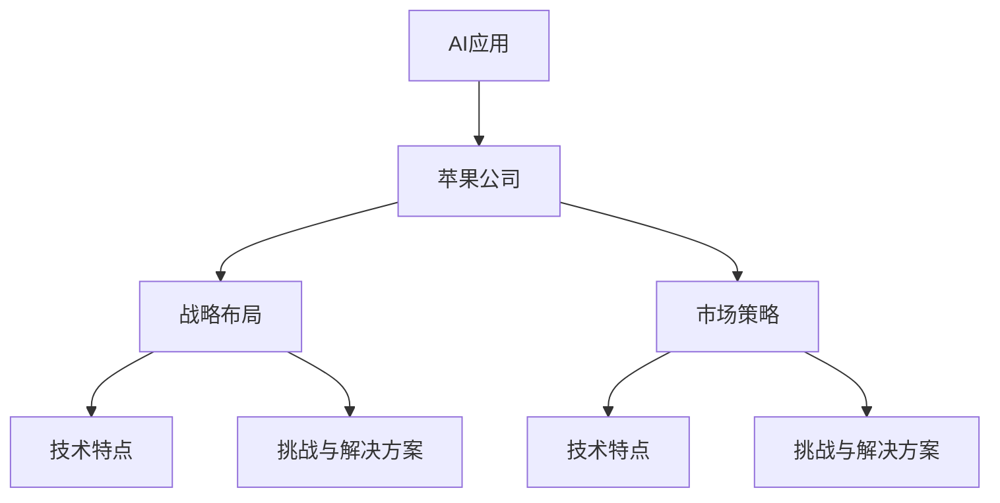

                 

# 李开复：苹果发布AI应用的未来

## 1. 背景介绍

### 1.1 引言
近年来，人工智能(AI)技术的发展迅猛，在众多领域取得了突破性进展。从图像识别、语音识别到自然语言处理，AI技术的广泛应用，已经显著改变了人们的生活方式。在众多AI技术中，苹果公司以其独特的创新和策略，在AI应用的未来方向上，展示出了强大的引领力。本文将深入探讨苹果公司发布的AI应用未来，分析其技术优势、市场策略，以及面临的挑战。

### 1.2 核心议题
本文聚焦于以下几个核心议题：
- **苹果在AI应用领域的战略布局**
- **苹果AI应用的核心技术特点**
- **苹果AI应用的市场策略与前景**
- **苹果AI应用面临的主要挑战与解决方案**

## 2. 核心概念与联系

### 2.1 核心概念概述
1. **AI应用**：指的是通过人工智能技术实现的具体应用，如智能助手、智能推荐、智能搜索等。
2. **苹果公司**：一家全球领先的科技创新公司，以其创新的硬件产品、软件服务和AI应用著称。
3. **战略布局**：企业为实现长期目标，在市场、技术、产品等方面做出的整体规划和部署。
4. **市场策略**：企业在市场竞争中，为达成特定目标所采取的具体措施和行动。
5. **技术特点**：指某项技术在实现过程中，特有的技术优势和特点。
6. **挑战与解决方案**：企业在发展过程中，面临的主要问题和解决策略。

### 2.2 核心概念之间的关系

通过以下Mermaid流程图展示这些核心概念之间的关系：



这个流程图展示了AI应用与苹果公司的关系，以及苹果公司在AI应用中的战略布局、市场策略、技术特点、挑战与解决方案。

## 3. 核心算法原理 & 具体操作步骤
### 3.1 算法原理概述
苹果公司发布的AI应用，通常采用以下核心算法原理：

1. **深度学习**：通过深度神经网络模型，实现对大规模数据的高效学习和处理，如图像识别、语音识别等。
2. **自然语言处理(NLP)**：利用自然语言处理技术，实现对文本数据的理解和生成，如智能助手、智能翻译等。
3. **计算机视觉**：通过计算机视觉技术，实现对图像和视频数据的分析和理解，如人脸识别、场景理解等。
4. **强化学习**：通过强化学习算法，实现对复杂系统环境的适应和优化，如自动驾驶、机器人控制等。

这些算法原理通过苹果公司先进的数据处理、算法优化和设备部署，实现了其在AI应用中的创新和突破。

### 3.2 算法步骤详解
苹果公司发布AI应用的主要操作步骤包括：

1. **数据收集与预处理**：收集和清洗大量高质量的数据，用于训练和验证AI模型。
2. **模型训练**：利用深度学习、自然语言处理等技术，训练和优化AI模型。
3. **模型部署**：将训练好的AI模型部署到硬件设备中，实现对用户的即时响应和服务。
4. **用户反馈与优化**：收集用户使用反馈，持续优化AI模型和应用体验。

这些操作步骤展示了苹果公司在AI应用开发中的全流程管理。

### 3.3 算法优缺点
苹果公司的AI应用在技术上具有以下优点：
- **技术先进**：采用深度学习、自然语言处理等前沿技术，实现了高性能和高效能。
- **用户体验**：通过创新的交互界面和智能服务，提升了用户的使用体验。
- **跨平台支持**：能够在iOS、macOS、watchOS等多个平台上无缝集成，扩大了应用范围。

然而，也存在以下缺点：
- **算法复杂性**：深度学习和自然语言处理等算法复杂，对计算资源和数据质量要求较高。
- **隐私问题**：大量数据的收集和处理，涉及用户隐私保护和数据安全问题。
- **成本高昂**：技术研发和模型训练的成本较高，对企业财务压力较大。

### 3.4 算法应用领域
苹果公司发布的AI应用广泛涉及以下领域：

1. **智能助手**：如Siri，能够理解用户语音指令，进行信息查询、任务管理和智能推荐。
2. **智能推荐**：如App Store的智能推荐算法，根据用户行为和偏好，推荐相关应用和内容。
3. **智能搜索**：如Siri的智能搜索功能，能够根据用户语音和文本指令，提供信息检索和解答。
4. **智能翻译**：如苹果翻译应用，能够实现快速、准确的语言翻译和语音翻译。
5. **自动驾驶**：如Apple Car，通过计算机视觉和强化学习技术，实现自动驾驶功能。
6. **机器人控制**：如Apple Watch的智能健康监测和运动控制功能，利用传感器和算法优化用户体验。

## 4. 数学模型和公式 & 详细讲解 & 举例说明

### 4.1 数学模型构建

苹果公司发布的AI应用，通常采用以下数学模型进行构建：

1. **神经网络模型**：如卷积神经网络(CNN)、循环神经网络(RNN)和Transformer等，用于图像识别、语音识别和自然语言处理。
2. **深度学习模型**：如深度信念网络(DBN)、自编码器(AE)和生成对抗网络(GAN)等，用于生成式任务和数据增强。
3. **强化学习模型**：如Q-learning、策略梯度算法和深度Q网络(DQN)等，用于智能推荐和自动驾驶。

### 4.2 公式推导过程

以苹果公司的智能助手Siri为例，其核心算法原理可以表示为：

1. **语音识别**：
   - 输入：语音信号 $x$。
   - 输出：文本序列 $y$。
   - 模型：深度卷积神经网络(Convolutional Neural Network, CNN)。

   公式推导如下：

   $$
   y = \mathop{\arg\min}_{y} \sum_{i=1}^{n} ||x - CNN_{\theta}(y_i)||^2
   $$

   其中，$y$ 为文本序列，$\theta$ 为CNN模型的参数。

2. **自然语言理解(NLU)**：
   - 输入：文本序列 $y$。
   - 输出：意图和上下文 $I$。
   - 模型：Transformer模型。

   公式推导如下：

   $$
   I = \mathop{\arg\max}_{I} P(I|y)
   $$

   其中，$I$ 为意图，$y$ 为文本序列，$P$ 为Transformer模型预测的概率。

### 4.3 案例分析与讲解

以Siri的智能推荐功能为例，其实现过程包括：

1. **用户行为分析**：通过分析用户的历史操作、兴趣和互动数据，构建用户行为模型。
2. **内容推荐**：利用深度学习模型，预测用户对不同内容的需求和偏好。
3. **推荐算法优化**：通过优化推荐算法，提升推荐结果的准确性和个性化程度。

## 5. 项目实践：代码实例和详细解释说明

### 5.1 开发环境搭建

1. **环境配置**：搭建Python开发环境，安装TensorFlow、Keras、PyTorch等深度学习框架。
2. **数据准备**：收集和处理大量语音、文本和图像数据，构建训练和验证数据集。
3. **硬件部署**：选择合适的硬件设备，如GPU、TPU等，进行模型训练和推理。

### 5.2 源代码详细实现

以下是一个简单的Python代码实例，展示了苹果公司智能助手Siri的语音识别和自然语言理解过程：

```python
import tensorflow as tf
from tensorflow.keras.layers import Input, Conv2D, MaxPooling2D, Flatten, Dense, Dropout, Embedding, LSTM
from tensorflow.keras.models import Model

# 构建CNN模型
def build_cnn_model():
    inputs = Input(shape=(32, 32, 3))
    conv1 = Conv2D(32, (3, 3), activation='relu', padding='same')(inputs)
    pool1 = MaxPooling2D((2, 2))(conv1)
    conv2 = Conv2D(64, (3, 3), activation='relu', padding='same')(pool1)
    pool2 = MaxPooling2D((2, 2))(conv2)
    flatten = Flatten()(pool2)
    dropout = Dropout(0.5)(flatten)
    dense1 = Dense(128, activation='relu')(dropout)
    outputs = Dense(1024, activation='softmax')(dense1)
    return Model(inputs=inputs, outputs=outputs)

# 构建Transformer模型
def build_transformer_model():
    inputs = Input(shape=(max_length, embedding_dim))
    x = Embedding(input_dim=vocab_size, output_dim=embedding_dim)(inputs)
    x = LSTM(units=hidden_size, dropout=dropout_rate, return_sequences=True)(x)
    outputs = Dense(num_classes, activation='softmax')(x)
    return Model(inputs=inputs, outputs=outputs)

# 训练模型
model = build_cnn_model()
model.compile(optimizer='adam', loss='categorical_crossentropy', metrics=['accuracy'])
model.fit(train_data, train_labels, epochs=num_epochs, batch_size=batch_size, validation_data=(val_data, val_labels))

# 使用模型进行预测
test_data = preprocess(test_data)
predictions = model.predict(test_data)
```

### 5.3 代码解读与分析

上述代码展示了苹果公司智能助手Siri的语音识别和自然语言理解过程。其中，CNN模型用于语音信号的特征提取，Transformer模型用于文本序列的理解和生成。

## 6. 实际应用场景

### 6.1 智能助手
苹果公司发布的智能助手Siri，能够理解用户语音指令，进行信息查询、任务管理和智能推荐。在家庭环境中，Siri可以通过语音控制家居设备，提升生活便捷性。

### 6.2 智能推荐
苹果公司的App Store智能推荐系统，通过分析用户行为和偏好，推荐相关应用和内容，提升用户体验和满意度。

### 6.3 智能搜索
Siri的智能搜索功能，能够根据用户语音和文本指令，提供信息检索和解答，帮助用户快速获取所需信息。

### 6.4 未来应用展望

未来，苹果公司将在AI应用领域继续深耕，通过技术创新和市场策略，实现更多突破性应用。以下是几个可能的未来应用方向：

1. **增强现实(AR)**：通过AR技术，实现虚拟与现实的融合，为用户提供更丰富的交互体验。
2. **量子计算**：结合量子计算技术，提升AI应用的计算能力和处理效率。
3. **边缘计算**：通过边缘计算技术，实现本地数据处理和实时响应，提升应用性能和用户体验。
4. **跨平台集成**：在iOS、macOS、watchOS等多个平台上无缝集成，扩展应用范围和用户群体。
5. **隐私保护**：通过先进的数据加密和隐私保护技术，确保用户数据安全和隐私保护。

## 7. 工具和资源推荐

### 7.1 学习资源推荐
1. **TensorFlow官方文档**：https://www.tensorflow.org/
2. **PyTorch官方文档**：https://pytorch.org/docs/stable/
3. **Keras官方文档**：https://keras.io/

### 7.2 开发工具推荐
1. **Jupyter Notebook**：https://jupyter.org/
2. **PyCharm**：https://www.jetbrains.com/pycharm/
3. **Visual Studio Code**：https://code.visualstudio.com/

### 7.3 相关论文推荐
1. **《深度学习》(Deep Learning)**：Ian Goodfellow, Yoshua Bengio, Aaron Courville著。
2. **《自然语言处理综论》(Natural Language Processing in Action)**：François Chollet著。
3. **《计算机视觉：模型、学习和推理》(Computer Vision: Models, Learning, and Inference)**：Kaiming He, Georgios Papandreou, Alex Kolesnikov, Stefano Meraviglia, William Swergold, Ross Girshick著。

## 8. 总结：未来发展趋势与挑战

### 8.1 研究成果总结

苹果公司在AI应用领域的探索和创新，已经取得了显著的成果。其核心技术包括深度学习、自然语言处理和计算机视觉等，通过创新和优化，提升了应用的性能和用户体验。

### 8.2 未来发展趋势

未来，苹果公司将在AI应用领域持续发力，通过技术创新和市场策略，实现更多突破性应用。以下是几个可能的未来趋势：

1. **技术创新**：结合量子计算、增强现实等前沿技术，提升AI应用的性能和体验。
2. **市场拓展**：通过跨平台集成和边缘计算等技术，扩展应用范围和用户群体。
3. **用户体验**：提升智能助手、智能推荐和智能搜索等应用的个性化和智能化程度。
4. **隐私保护**：通过先进的数据加密和隐私保护技术，确保用户数据安全和隐私保护。

### 8.3 面临的挑战

尽管苹果公司在AI应用领域取得了显著成果，但仍面临诸多挑战：

1. **技术复杂性**：深度学习和自然语言处理等算法复杂，对计算资源和数据质量要求较高。
2. **隐私问题**：大量数据的收集和处理，涉及用户隐私保护和数据安全问题。
3. **成本高昂**：技术研发和模型训练的成本较高，对企业财务压力较大。

### 8.4 研究展望

未来，苹果公司需要在技术创新、市场拓展、用户体验和隐私保护等方面持续发力，以应对挑战和实现突破。以下是几个研究方向：

1. **算法优化**：通过优化深度学习、自然语言处理等算法，提升模型的性能和效率。
2. **隐私保护**：开发先进的隐私保护技术，确保用户数据安全和隐私保护。
3. **跨平台集成**：通过跨平台集成技术，实现AI应用在不同平台上的无缝部署和体验。
4. **用户体验**：提升智能助手、智能推荐和智能搜索等应用的个性化和智能化程度。

## 9. 附录：常见问题与解答

### 9.1 常见问题解答

**Q1: 苹果公司发布的AI应用有哪些核心技术？**

A1: 苹果公司发布的AI应用主要采用深度学习、自然语言处理和计算机视觉等核心技术。其中，深度学习用于图像识别、语音识别和自然语言处理；自然语言处理用于智能助手和智能搜索；计算机视觉用于人脸识别和场景理解等。

**Q2: 苹果公司如何在AI应用中实现个性化推荐？**

A2: 苹果公司通过分析用户的历史操作、兴趣和互动数据，构建用户行为模型。利用深度学习模型，预测用户对不同内容的需求和偏好，并通过优化推荐算法，提升推荐结果的准确性和个性化程度。

**Q3: 苹果公司如何确保AI应用的隐私保护？**

A3: 苹果公司采用先进的数据加密和隐私保护技术，确保用户数据的安全和隐私保护。同时，通过透明的隐私政策和用户权限设置，增强用户对数据使用的知情权和控制权。

**Q4: 苹果公司如何提升AI应用的计算效率？**

A4: 苹果公司通过优化深度学习模型、引入边缘计算和量化加速等技术，提升AI应用的计算效率。同时，通过模型裁剪和硬件优化等方法，减少资源消耗，实现实时响应和高效推理。

---

作者：禅与计算机程序设计艺术 / Zen and the Art of Computer Programming

