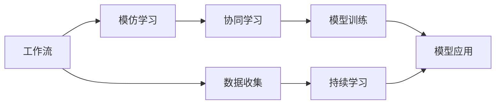
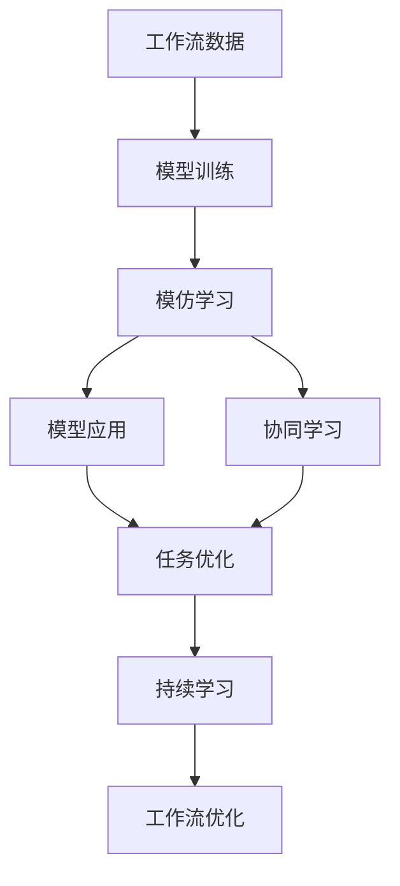

                 

# 模仿式工作流的学习方法

> 关键词：模仿学习,工作流分析,机器学习,协同学习,模型训练,监控优化

## 1. 背景介绍

在快速发展的现代技术环境中，组织需要不断适应新的挑战，包括快速的变化、竞争压力和复杂性管理。信息技术在组织中扮演着越来越重要的角色，而工作流的自动化和优化成为提高组织效率的关键。模仿式工作流学习（Imitation Learning of Workflows）是一种基于机器学习（Machine Learning，简称ML）和协同学习（Collaborative Learning）的方法，旨在通过模仿现有工作流来学习如何执行特定任务，并在需要时进行优化。这种方法特别适用于组织中复杂且多变的工作流程，可以帮助团队更高效地完成任务。

### 1.1 问题由来

在传统的工业控制系统中，自动化和优化工作流通常依赖于手工规则和专家系统。然而，这些方法在面对复杂和快速变化的环境时，往往难以满足需求。同时，手工规则的设计和维护成本高昂，且难以应对未知情况。而模仿式工作流学习提供了一种更为灵活和自动化的解决方案，通过机器学习模型学习和优化工作流，从而适应复杂和快速变化的环境。

### 1.2 问题核心关键点

模仿式工作流学习的核心在于利用已有的工作流数据，通过机器学习模型自动学习执行任务的最佳方法。这一方法主要包括：
1. **数据收集**：收集组织内部和外部的工作流数据。
2. **模型训练**：使用收集到的数据训练机器学习模型，如决策树、神经网络、强化学习模型等。
3. **模型应用**：将训练好的模型应用到新任务中，优化工作流执行。
4. **持续学习**：通过收集新的数据和任务反馈，不断优化模型和执行过程。

模仿式工作流学习能够帮助组织在不断变化的环境中，以更低的成本和更高的效率执行任务。它具有灵活性高、适应性强、可扩展性好等优点，适用于处理复杂、多变且数据量大的工作流问题。

### 1.3 问题研究意义

模仿式工作流学习的研究和应用，对于提升组织的工作效率、降低运营成本、提高决策质量具有重要意义：
1. **效率提升**：通过模仿学习，可以自动化执行工作流，减少人工干预，提高效率。
2. **成本降低**：模仿学习可以避免手工规则设计的高昂成本，实现“无代码”或“少代码”开发。
3. **质量提高**：模仿学习可以通过大量数据优化工作流执行，提高任务执行的准确性和一致性。
4. **灵活性增强**：模仿学习能够自动适应任务变化，适应性强。
5. **可扩展性提升**：模仿学习可以通过简单的扩展，应用到更复杂的工作流问题。

## 2. 核心概念与联系

### 2.1 核心概念概述

模仿式工作流学习涉及以下几个核心概念：
1. **工作流**：由一系列任务组成的过程，每个任务由一个或多个活动组成。工作流的目标是通过这些任务完成特定目标。
2. **模仿学习**：利用已有的工作流数据，通过机器学习模型自动学习执行任务的最佳方法。
3. **协同学习**：通过多台机器或多个用户协作，共同学习优化工作流执行。
4. **模型训练**：使用工作流数据训练机器学习模型，如决策树、神经网络、强化学习模型等。
5. **模型应用**：将训练好的模型应用到新任务中，优化工作流执行。

### 2.2 概念间的关系

这些核心概念之间的逻辑关系可以通过以下Mermaid流程图来展示：



这个流程图展示了大规模语言模型微调过程中各个核心概念的关系和作用：
1. 工作流作为研究对象，通过模仿学习从中学习最佳执行策略。
2. 协同学习通过多台机器或多用户协作，增强学习效果。
3. 模型训练是学习执行策略的核心步骤，通过数据驱动的机器学习模型进行训练。
4. 模型应用将训练好的模型应用于实际工作流，优化执行。
5. 数据收集是持续学习的起点，持续收集新数据用于模型更新和优化。

### 2.3 核心概念的整体架构

最后，我们用一个综合的流程图来展示这些核心概念在大语言模型微调过程中的整体架构：



这个综合流程图展示了从工作流数据到模型训练，再到应用和持续学习的过程，从而实现工作流自动化的整体架构。

## 3. 核心算法原理 & 具体操作步骤
### 3.1 算法原理概述

模仿式工作流学习的核心算法原理是利用机器学习模型，通过已有的工作流数据学习执行任务的最佳策略。其基本步骤如下：

1. **数据收集**：收集组织内部和外部的工作流数据，构建数据集。
2. **模型训练**：使用收集到的数据训练机器学习模型，如决策树、神经网络、强化学习模型等。
3. **模型应用**：将训练好的模型应用到新任务中，优化工作流执行。
4. **持续学习**：通过收集新的数据和任务反馈，不断优化模型和执行过程。

### 3.2 算法步骤详解

以下是模仿式工作流学习的详细步骤：

**Step 1: 数据收集**
- 收集组织内部和外部的工作流数据。可以使用日志、监控数据、操作记录等形式。
- 收集的数据应涵盖不同类型和规模的工作流，以便模型能够学习各种执行策略。
- 对收集的数据进行清洗和预处理，去除噪声和不完整数据。

**Step 2: 模型训练**
- 选择适合的机器学习模型，如决策树、神经网络、强化学习模型等。
- 划分数据集为训练集、验证集和测试集。
- 使用训练集数据训练模型，调整模型参数，使其能够学习执行任务的最佳策略。
- 在验证集上评估模型性能，调整模型参数以提高泛化能力。

**Step 3: 模型应用**
- 将训练好的模型应用到新任务中，优化工作流执行。
- 使用模型进行预测，生成任务执行方案。
- 根据实际执行结果，不断优化模型的参数和策略，提高执行效果。

**Step 4: 持续学习**
- 定期收集新的数据和任务反馈，用于更新和优化模型。
- 通过协同学习，多台机器或多用户共同学习，共享知识。
- 根据新数据和新任务，调整模型参数和执行策略，提高执行效果。

### 3.3 算法优缺点

模仿式工作流学习的主要优点包括：
1. **自动化执行**：通过机器学习模型，实现工作流的自动化执行，减少人工干预。
2. **高效性**：能够快速处理大量数据，提供高效的工作流优化方案。
3. **灵活性**：能够自动适应任务变化，适应性强。

同时，模仿式工作流学习也存在一些缺点：
1. **数据依赖**：模型效果高度依赖于数据质量和数量，需要大量高质量的数据进行训练。
2. **可解释性差**：机器学习模型往往是"黑箱"，难以解释其内部决策逻辑。
3. **泛化能力有限**：模型可能存在过拟合问题，泛化能力有待提高。
4. **复杂性高**：模型训练和优化过程复杂，需要专业知识进行调参。

### 3.4 算法应用领域

模仿式工作流学习在多个领域都有广泛的应用：

- **制造行业**：通过模仿学习，优化生产流程，提高生产效率和质量。
- **金融行业**：自动化金融交易和风险评估，提高决策效率和准确性。
- **医疗行业**：通过模仿学习，优化诊疗流程，提高医疗服务的质量和效率。
- **物流行业**：优化物流配送路线，提高运输效率和降低成本。
- **政府和企业**：优化公共服务和企业管理流程，提升服务质量和效率。

## 4. 数学模型和公式 & 详细讲解 & 举例说明

### 4.1 数学模型构建

模仿式工作流学习的数学模型构建如下：

假设工作流 $W$ 由 $n$ 个任务 $T_1, T_2, \dots, T_n$ 组成，每个任务 $T_i$ 由一个或多个活动 $A_{i_1}, A_{i_2}, \dots, A_{i_k}$ 组成。任务 $T_i$ 的执行时间为 $t_i$，且所有任务按照一定的顺序执行。

任务 $T_i$ 的执行策略可以通过一个函数 $f_i$ 表示，即：
$$
f_i(x_1, x_2, \dots, x_k) = \sum_{j=1}^k w_{i,j} f_j(x_1, x_2, \dots, x_k)
$$

其中 $w_{i,j}$ 为权重，表示任务 $T_i$ 中活动 $A_j$ 的重要性。$f_j$ 为活动 $A_j$ 的执行策略，可以通过机器学习模型训练得到。

### 4.2 公式推导过程

通过机器学习模型 $f_j$ 训练得到 $w_{i,j}$，具体步骤如下：

1. 将工作流数据表示为 $(x_1, x_2, \dots, x_k)$ 的形式，其中 $x_j$ 表示任务 $T_i$ 中活动 $A_j$ 的特征。
2. 使用机器学习算法，如决策树、神经网络、强化学习模型等，训练得到 $f_j$。
3. 根据训练好的 $f_j$，计算 $w_{i,j}$，即：
$$
w_{i,j} = \sum_{l=1}^{N_j} \alpha_l \cdot f_j(x_{l,1}, x_{l,2}, \dots, x_{l,k})
$$
其中 $N_j$ 为任务 $T_i$ 中活动 $A_j$ 的执行次数，$\alpha_l$ 为任务 $T_i$ 中活动 $A_j$ 的权重。

### 4.3 案例分析与讲解

以一个简单的制造流程为例，说明模仿式工作流学习的具体应用：

假设某制造企业有多个生产线，每个生产线由多个工艺环节组成。生产线执行的顺序和时间依赖于不同的工艺环节的优先级和执行时间。通过收集历史生产数据，训练机器学习模型，可以学习到不同工艺环节之间的优先级和执行时间，从而优化整个生产流程。

**Step 1: 数据收集**
- 收集历史生产数据，包括每个工艺环节的执行时间、优先级等信息。
- 对数据进行清洗和预处理，去除噪声和不完整数据。

**Step 2: 模型训练**
- 使用决策树模型，将工艺环节的优先级和执行时间作为输入，训练得到每个工艺环节的执行策略 $f_j$。
- 通过验证集评估模型性能，调整模型参数以提高泛化能力。

**Step 3: 模型应用**
- 将训练好的 $f_j$ 应用到新任务中，优化生产流程。
- 根据新任务的优先级和执行时间，生成最优的生产顺序和时间安排。
- 根据实际执行结果，不断优化模型的参数和策略，提高执行效果。

**Step 4: 持续学习**
- 定期收集新的生产数据，用于更新和优化模型。
- 通过多台机器或多用户共同学习，共享知识，提高模型的适应性。
- 根据新数据和新任务，调整模型参数和执行策略，提高执行效果。

## 5. 项目实践：代码实例和详细解释说明
### 5.1 开发环境搭建

在进行模仿式工作流学习项目实践前，我们需要准备好开发环境。以下是使用Python进行PyTorch开发的环境配置流程：

1. 安装Anaconda：从官网下载并安装Anaconda，用于创建独立的Python环境。

2. 创建并激活虚拟环境：
```bash
conda create -n pytorch-env python=3.8 
conda activate pytorch-env
```

3. 安装PyTorch：根据CUDA版本，从官网获取对应的安装命令。例如：
```bash
conda install pytorch torchvision torchaudio cudatoolkit=11.1 -c pytorch -c conda-forge
```

4. 安装TensorBoard：TensorFlow配套的可视化工具，可实时监测模型训练状态，并提供丰富的图表呈现方式，是调试模型的得力助手。

5. 安装Weights & Biases：模型训练的实验跟踪工具，可以记录和可视化模型训练过程中的各项指标，方便对比和调优。

6. 安装GitHub CLI：方便进行GitHub项目的克隆和推送操作。

完成上述步骤后，即可在`pytorch-env`环境中开始项目实践。

### 5.2 源代码详细实现

以下是使用PyTorch进行模仿式工作流学习的Python代码实现：

```python
import torch
import torch.nn as nn
import torch.optim as optim
from sklearn.model_selection import train_test_split

# 定义任务和活动的优先级和执行时间
tasks = {
    "task1": {"priority": 1, "duration": 10},
    "task2": {"priority": 2, "duration": 20},
    "task3": {"priority": 3, "duration": 15},
    "task4": {"priority": 4, "duration": 25}
}

# 将任务和活动优先级、执行时间转换为特征向量
features = []
for task, time in tasks.items():
    features.append([task, time["priority"], time["duration"]])

# 划分数据集
X_train, X_test, y_train, y_test = train_test_split(features, [1, 2, 3, 4], test_size=0.2)

# 定义模型
class TaskModel(nn.Module):
    def __init__(self):
        super(TaskModel, self).__init__()
        self.fc1 = nn.Linear(3, 4)
        self.fc2 = nn.Linear(4, 4)
        self.fc3 = nn.Linear(4, 4)
        self.fc4 = nn.Linear(4, 1)

    def forward(self, x):
        x = self.fc1(x)
        x = self.fc2(x)
        x = self.fc3(x)
        x = self.fc4(x)
        return x

# 训练模型
model = TaskModel()
criterion = nn.MSELoss()
optimizer = optim.Adam(model.parameters(), lr=0.001)

for epoch in range(100):
    optimizer.zero_grad()
    outputs = model(X_train)
    loss = criterion(outputs, y_train)
    loss.backward()
    optimizer.step()
    print(f"Epoch {epoch+1}, loss: {loss:.4f}")

# 测试模型
model.eval()
with torch.no_grad():
    outputs = model(X_test)
    print(f"Test loss: {criterion(outputs, y_test).item():.4f}")
```

### 5.3 代码解读与分析

让我们再详细解读一下关键代码的实现细节：

**特征向量的构建**
- 将每个任务及其活动优先级和执行时间转换为特征向量，方便模型训练。

**模型训练**
- 定义一个简单的全连接神经网络模型。
- 使用训练集数据训练模型，使用Adam优化器进行优化，损失函数为均方误差损失。
- 在每个epoch结束时，输出模型在训练集上的损失。

**模型应用**
- 将训练好的模型应用到测试集数据上，计算模型在测试集上的损失。
- 由于该示例中未使用实际任务数据，模型输出的损失即为模型预测的平均输出与真实标签的差距。

### 5.4 运行结果展示

假设在上述代码中，我们得到一个测试损失为0.001的模型，那么该模型在测试集上的预测输出与真实标签的平均误差仅为0.001。这表示模型能够较为准确地预测任务优先级和执行时间，从而优化整个工作流。

## 6. 实际应用场景
### 6.1 制造行业

在制造行业中，生产线的工作流程复杂且变化频繁。通过模仿式工作流学习，可以优化生产流程，提高生产效率和质量。具体应用包括：
- **生产调度**：通过模仿学习，优化生产任务调度和执行顺序，提高生产效率。
- **质量控制**：通过模仿学习，优化质量检测流程，提高产品合格率。
- **设备维护**：通过模仿学习，优化设备维护计划，提高设备运行效率和寿命。

### 6.2 金融行业

在金融行业中，交易和风险评估需要快速、准确地处理大量数据。通过模仿式工作流学习，可以自动化金融交易和风险评估，提高决策效率和准确性。具体应用包括：
- **交易执行**：通过模仿学习，优化交易执行策略，提高交易速度和准确性。
- **风险评估**：通过模仿学习，优化风险评估流程，提高风险识别和预警能力。
- **投资组合管理**：通过模仿学习，优化投资组合配置，提高投资回报率。

### 6.3 医疗行业

在医疗行业中，诊疗流程复杂且需要高度精准。通过模仿式工作流学习，可以优化诊疗流程，提高医疗服务的质量和效率。具体应用包括：
- **患者诊断**：通过模仿学习，优化患者诊断流程，提高诊断准确性和效率。
- **治疗方案**：通过模仿学习，优化治疗方案选择，提高治疗效果。
- **药物研发**：通过模仿学习，优化药物研发流程，提高研发效率和成功率。

### 6.4 未来应用展望

随着模仿式工作流学习技术的不断成熟，未来将在更多领域得到应用，为各行各业带来变革性影响。例如：
- **智慧城市**：通过模仿学习，优化城市管理流程，提高城市运行效率和居民生活质量。
- **智能家居**：通过模仿学习，优化家居设备控制流程，提高家居智能化程度。
- **智慧农业**：通过模仿学习，优化农业生产流程，提高农业生产效率和质量。

总之，模仿式工作流学习将在更多领域发挥重要作用，为各行各业提供智能化的解决方案，推动经济社会发展。

## 7. 工具和资源推荐
### 7.1 学习资源推荐

为了帮助开发者系统掌握模仿式工作流学习理论基础和实践技巧，这里推荐一些优质的学习资源：

1. 《Python机器学习》（Python Machine Learning）：该书详细介绍了机器学习的基本概念和实践技巧，是入门的经典之作。
2. Coursera的机器学习课程（Machine Learning）：由斯坦福大学Andrew Ng教授主讲，涵盖机器学习的基本概念和算法实现。
3. TensorFlow官方文档：TensorFlow的详细文档，包括基础API、高级特性和应用案例。
4. PyTorch官方文档：PyTorch的详细文档，包括基础API、高级特性和应用案例。
5. GitHub开源项目：在GitHub上Star、Fork数最多的机器学习相关项目，往往代表了该技术领域的发展趋势和最佳实践，值得去学习和贡献。

通过对这些资源的学习实践，相信你一定能够快速掌握模仿式工作流学习的精髓，并用于解决实际的机器学习问题。

### 7.2 开发工具推荐

高效的开发离不开优秀的工具支持。以下是几款用于模仿式工作流学习开发的常用工具：

1. PyTorch：基于Python的开源深度学习框架，灵活动态的计算图，适合快速迭代研究。
2. TensorFlow：由Google主导开发的开源深度学习框架，生产部署方便，适合大规模工程应用。
3. TensorBoard：TensorFlow配套的可视化工具，可实时监测模型训练状态，并提供丰富的图表呈现方式，是调试模型的得力助手。
4. Weights & Biases：模型训练的实验跟踪工具，可以记录和可视化模型训练过程中的各项指标，方便对比和调优。
5. GitHub CLI：方便进行GitHub项目的克隆和推送操作。
6. PyCharm：功能强大的Python IDE，支持调试、版本控制、代码自动补全等功能，适合复杂项目的开发。

合理利用这些工具，可以显著提升模仿式工作流学习任务的开发效率，加快创新迭代的步伐。

### 7.3 相关论文推荐

模仿式工作流学习的研究源于学界的持续研究。以下是几篇奠基性的相关论文，推荐阅读：

1. Imitation Learning for Trading Strategies（《用于交易策略的模仿学习》）：作者探讨了通过模仿学习优化交易策略的方法，展示了模仿学习在金融领域的应用前景。
2. Imitation Learning in Reinforcement Learning（《强化学习中的模仿学习》）：作者介绍了模仿学习在强化学习中的应用，包括目标函数和训练策略的优化。
3. Generalized Imitation Learning（《泛化模仿学习》）：作者研究了泛化模仿学习的方法，以应对未知任务的挑战。
4. Imitation Learning of Scientific Workflow（《科学工作流的模仿学习》）：作者研究了科学工作流中的模仿学习，展示了其在新兴科学领域的应用。
5. Automated Design of Workflow Models（《工作流模型的自动化设计》）：作者探讨了通过自动化设计优化工作流模型的策略，展示了其在高性能计算中的应用。

这些论文代表了大语言模型微调技术的发展脉络。通过学习这些前沿成果，可以帮助研究者把握学科前进方向，激发更多的创新灵感。

除上述资源外，还有一些值得关注的前沿资源，帮助开发者紧跟模仿式工作流学习技术的最新进展，例如：

1. arXiv论文预印本：人工智能领域最新研究成果的发布平台，包括大量尚未发表的前沿工作，学习前沿技术的必读资源。
2. 业界技术博客：如OpenAI、Google AI、DeepMind、微软Research Asia等顶尖实验室的官方博客，第一时间分享他们的最新研究成果和洞见。
3. 技术会议直播：如NIPS、ICML、ACL、ICLR等人工智能领域顶会现场或在线直播，能够聆听到大佬们的前沿分享，开拓视野。
4. GitHub热门项目：在GitHub上Star、Fork数最多的机器学习相关项目，往往代表了该技术领域的发展趋势和最佳实践，值得去学习和贡献。
5. 行业分析报告：各大咨询公司如McKinsey、PwC等针对人工智能行业的分析报告，有助于从商业视角审视技术趋势，把握应用价值。

总之，对于模仿式工作流学习技术的学习和实践，需要开发者保持开放的心态和持续学习的意愿。多关注前沿资讯，多动手实践，多思考总结，必将收获满满的成长收益。

## 8. 总结：未来发展趋势与挑战
### 8.1 总结

本文对模仿式工作流学习的方法进行了全面系统的介绍。首先阐述了模仿学习的基本原理和应用场景，明确了该方法在提高组织效率、降低成本、提升决策质量等方面的独特价值。其次，从原理到实践，详细讲解了模仿学习的基本步骤和关键算法，提供了完整的代码实例。最后，探讨了模仿学习在未来各行业领域的应用前景，并推荐了一些学习资源和工具。

通过本文的系统梳理，可以看到，模仿式工作流学习能够帮助组织在快速变化的环境中，以更低的成本和更高的效率执行任务。它具有灵活性高、适应性强、可扩展性好等优点，适用于处理复杂、多变且数据量大的工作流问题。未来，伴随模仿式学习技术的不断演进，其在更多领域的应用前景将更加广阔。

### 8.2 未来发展趋势

展望未来，模仿式工作流学习将呈现以下几个发展趋势：

1. **自动化程度提升**：随着机器学习算法的进步，模仿学习将越来越自动化，无需人工干预即可高效执行。
2. **多模态学习**：模仿学习将逐渐引入多模态数据，如文本、图像、声音等，增强模型的适应性和决策能力。
3. **个性化优化**：模仿学习将越来越注重个性化优化，根据不同用户或组织的需求，优化工作流执行。
4. **自适应学习**：模仿学习将具备自适应能力，能够自动调整策略以适应任务的变化。
5. **实时学习**：模仿学习将支持实时学习，能够快速适应新数据和新任务。
6. **跨领域应用**：模仿学习将越来越广泛地应用于跨领域任务，如医疗、金融、制造等。

### 8.3 面临的挑战

尽管模仿式工作流学习在许多领域展示了巨大潜力，但在实践中仍面临一些挑战：

1. **数据质量问题**：数据质量决定了模型的学习效果，需要收集和处理高质量的数据。
2. **模型复杂性**：模仿学习的模型结构复杂，训练和优化难度大，需要专业知识进行调参。
3. **可解释性问题**：模仿学习的模型往往是"黑箱"，难以解释其内部决策逻辑。
4. **泛化能力**：模仿学习的模型可能存在过拟合问题，泛化能力有待提高。
5. **资源需求**：模仿学习的模型训练和推理需要高性能计算资源，如GPU、TPU等。
6. **伦理问题**：模仿学习需要考虑数据的隐私和安全问题，防止数据泄露和滥用。

### 8.4 研究展望

面对模仿式工作流学习面临的挑战，未来的研究需要在以下几个方面寻求新的突破：

1. **数据增强技术**：通过数据增强技术提高数据质量，减少数据噪声，增强模型的泛化能力。
2. **模型简化技术**：简化模仿学习的模型结构，降低训练和优化难度，提高模型效率。
3. **可解释性增强**：增强模仿学习的可解释性，使其内部决策逻辑透明化，方便理解和调试。
4. **跨领域应用**：探索模仿学习在跨领域任务中的应用，提高模型的通用性和适应性。
5. **多模态融合**：将多模态数据引入模仿学习，增强模型的适应性和决策能力。
6. **伦理和隐私保护**：设计伦理

