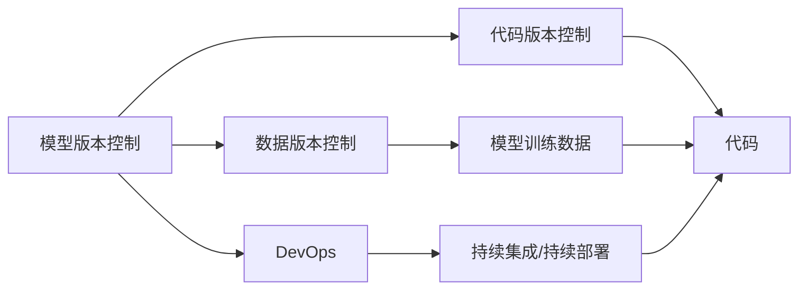
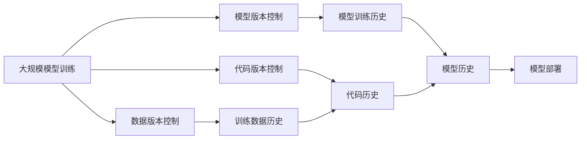

                 

# 模型版本控制原理与代码实战案例讲解

> 关键词：模型版本控制,代码实战,Git,GitHub,版本回退,代码合并,分支管理,DevOps

## 1. 背景介绍

### 1.1 问题由来
在软件开发和数据分析领域，代码版本控制（Version Control, VC）是保证项目稳定、可追溯、可协作的重要手段。VC系统通过记录代码的每一次修改，维护了一个以时间线为轴的版本迭代过程，使得团队成员可以随时查看历史版本、回退到特定时间点的代码，确保开发进度和数据安全。然而，随着数据科学和AI技术的深入发展，大规模模型训练和调优任务变得越来越复杂，其版本控制难度也随之增加。传统的VC系统难以胜任大规模模型训练的版本管理需求，迫切需要新的解决方案。

### 1.2 问题核心关键点
模型版本控制的主要目的是：
- 记录和跟踪模型训练和调优的每一次迭代。
- 保证模型的可追溯性和可恢复性，便于版本回退和问题排查。
- 实现模型版本之间的合并、比较和对比，支持实验验证和数据复现。
- 提高模型开发和训练的协作效率，支持多用户同时进行训练和实验。

为了满足以上需求，模型版本控制系统应具备以下几个关键特性：
- 支持大文件（如模型参数文件）的版本管理。
- 具备高效的版本回退和合并机制。
- 提供良好的分支管理工具，便于团队协作。
- 支持扩展和集成，方便与其他DevOps工具链整合。

## 2. 核心概念与联系

### 2.1 核心概念概述

为了更好地理解模型版本控制，本节将介绍几个密切相关的核心概念：

- **模型版本控制（Model Version Control, MVC）**：用于记录和跟踪模型训练、调优和部署过程中的每一次迭代。
- **数据版本控制（Data Version Control, DVC）**：用于记录和跟踪模型训练过程中使用的数据集、超参数、实验配置等，支持数据的版本回退和复现。
- **代码版本控制（Code Version Control, CVC）**：记录和跟踪代码文件的变化历史，支持代码的版本回退、合并和协作。
- **DevOps**：涵盖软件生命周期中的开发、版本控制、测试、部署等环节，强调自动化和协作。
- **持续集成/持续部署（CI/CD）**：通过自动化流程和管道，将代码变更迅速交付到生产环境。

这些核心概念之间的逻辑关系可以通过以下Mermaid流程图来展示：



这个流程图展示了几类版本控制系统之间的联系：

1. 模型版本控制记录训练过程中的每一次迭代，数据版本控制记录训练数据的历史变化，两者共同支持模型的版本回退和复现。
2. 代码版本控制记录代码的历史变化，为模型训练提供环境重现性，两者共同构成模型和训练的完整版本控制体系。
3. DevOps涵盖模型和代码的版本控制，并集成CI/CD流程，推动模型和代码的快速交付和部署。

### 2.2 概念间的关系

这些核心概念之间存在着紧密的联系，形成了模型版本控制和 DevOps 的完整生态系统。下面我们通过几个Mermaid流程图来展示这些概念之间的关系。

#### 2.2.1 模型版本控制与数据版本控制的关系


这个流程图展示了模型版本控制与数据版本控制之间的互动：模型参数作为模型版本的一部分，依赖于训练数据的变化历史。

#### 2.2.2 模型版本控制与代码版本控制的关系


这个流程图展示了模型版本控制与代码版本控制之间的联系：模型训练脚本作为模型版本的一部分，依赖于代码版本控制下的训练环境。

#### 2.2.3 DevOps中的模型版本控制


这个流程图展示了模型版本控制与 DevOps 流程的融合：模型、数据、代码的版本控制被集成到 DevOps 管道中，通过CI/CD流程支持模型的快速部署和迭代。

### 2.3 核心概念的整体架构

最后，我们用一个综合的流程图来展示这些核心概念在大规模模型训练和部署中的整体架构：



这个综合流程图展示了模型、数据、代码的版本控制在大规模模型训练和部署中的完整过程。模型训练历史记录每一次迭代的过程，包括使用的训练数据和代码，而模型历史、数据历史和代码历史共同支持模型的版本回退和复现，最终通过模型部署形成生产版本。

## 3. 核心算法原理 & 具体操作步骤

### 3.1 算法原理概述

模型版本控制的基本原理可以总结如下：
1. **版本记录**：将模型、数据、代码的变化历史记录到版本控制系统中。
2. **版本回退**：通过版本控制系统的分支和标签，实现模型的版本回退和恢复。
3. **版本合并**：将不同版本的模型和代码合并，生成新的模型版本，保持模型的稳定性和连贯性。
4. **版本比对**：通过比较模型和代码的版本变化，识别出模型性能提升的关键因素。
5. **版本部署**：通过模型版本控制的接口，将模型部署到生产环境中，实现快速迭代和上线。

### 3.2 算法步骤详解

基于上述原理，模型版本控制的一般步骤如下：

**Step 1: 环境搭建和配置**
- 安装和配置版本控制系统，如Git、GitHub等。
- 初始化模型训练和部署的库和工具，如TensorFlow、PyTorch等。
- 创建远程仓库（如GitHub Repository），并克隆到本地机器。

**Step 2: 模型训练和版本记录**
- 定义训练脚本和配置文件，描述模型的训练流程和超参数设置。
- 使用版本控制系统记录训练脚本和配置文件的变化历史。
- 执行模型训练，将训练结果（如模型参数、训练日志等）存储到版本控制系统中。
- 在训练过程中，定期保存训练状态，生成模型检查点（Checkpoint）。

**Step 3: 版本回退和恢复**
- 通过版本控制系统的分支（Branch）和标签（Tag），查看模型的历史版本。
- 根据需要，从历史版本中回退到特定时间点的模型，恢复训练和部署。
- 在回退过程中，注意检查依赖库和工具的版本兼容性。

**Step 4: 版本合并和比较**
- 使用版本控制系统的合并功能，将不同版本的模型和代码合并。
- 使用版本控制系统提供的对比工具，比较不同版本之间的差异。
- 根据对比结果，分析模型性能提升的关键因素，优化模型训练和调优策略。

**Step 5: 版本部署和发布**
- 使用模型版本控制的部署接口，将模型部署到生产环境中。
- 更新应用中的模型参数，使用最新的模型版本。
- 在生产环境中，定期保存模型检查点，记录模型在生产中的表现和更新历史。

### 3.3 算法优缺点

模型版本控制的优点包括：
- 支持大文件（如模型参数文件）的版本管理。
- 提供版本回退和合并机制，确保模型的稳定性和连贯性。
- 支持多个版本的并行开发和实验，提高协作效率。
- 可以集成到DevOps流程中，支持模型和代码的快速交付和部署。

缺点包括：
- 需要占用额外的存储空间来记录版本变化历史。
- 版本回退和合并操作可能比较耗时，特别是在大文件版本管理时。
- 需要团队成员之间的协作和沟通，以确保版本控制系统的正确使用。
- 依赖于版本控制系统的功能和特性，某些场景下可能存在局限性。

### 3.4 算法应用领域

模型版本控制已经在多个领域得到了广泛应用，包括但不限于：
- 科学研究：记录和追踪模型训练的历史变化，支持实验的复现和验证。
- 工业生产：通过模型版本控制，确保生产环境和模型的稳定性和一致性。
- 金融科技：记录和追踪模型的训练和调优过程，支持模型的回退和恢复。
- 医疗健康：记录和追踪模型的训练和部署过程，支持模型的版本管理和监控。
- 自然语言处理：记录和追踪模型的训练和优化过程，支持模型的版本回退和对比。

除了上述领域，模型版本控制在其他如计算机视觉、智能推荐、机器学习等AI技术领域也有广泛应用。

## 4. 数学模型和公式 & 详细讲解  
### 4.1 数学模型构建

为了更好地理解模型版本控制，这里需要引入一些基本的数学模型。假设模型版本控制系统的核心状态用 $\mathbf{x}_t$ 表示，其中 $t$ 表示当前时间步，$\mathbf{x}_t$ 包括模型的参数 $\theta_t$、训练数据 $\mathcal{D}_t$ 和代码版本 $\mathcal{C}_t$。在模型版本控制过程中，这些状态会随着时间不断变化。

模型版本控制系统的目标是通过维护历史状态的变化，确保模型的可追溯性和可恢复性。模型的状态变化可以用以下方程描述：

$$
\mathbf{x}_{t+1} = f(\mathbf{x}_t, a_t)
$$

其中，$a_t$ 表示在时间步 $t$ 的动作，可以是模型的更新、数据的更新或代码的更新。函数 $f$ 表示状态变化的映射关系，可以是简单的函数变换，也可以是复杂的计算过程。

### 4.2 公式推导过程

在模型版本控制系统中，我们通常需要执行以下操作：
- 记录模型版本 $\mathbf{x}_t$ 和状态变化 $a_t$。
- 生成模型检查点 $\checkpoint_t$，记录模型在时间步 $t$ 的状态。
- 回退到特定时间步 $t'$，恢复模型状态 $\mathbf{x}_{t'}$。
- 合并不同时间步的模型版本，生成新的模型版本 $\mathbf{x}_{t+1}$。

这些操作可以表示为：
- 记录操作：$\mathbf{x}_{t+1} = \mathbf{x}_t \cup a_t$
- 检查点操作：$\checkpoint_t = \mathbf{x}_t$
- 回退操作：$\mathbf{x}_{t'} = \checkpoint_t$
- 合并操作：$\mathbf{x}_{t+1} = \mathbf{x}_t \oplus \mathbf{x}_{t+1}$

其中 $\oplus$ 表示合并操作的具体实现，可以是简单的文件合并，也可以是复杂的合并策略，如Git的Pull Request。

### 4.3 案例分析与讲解

以一个简单的模型训练过程为例，展示模型版本控制的实际应用：

1. **初始状态**：模型初始状态为 $\mathbf{x}_0 = (\theta_0, \mathcal{D}_0, \mathcal{C}_0)$，表示初始的模型参数、训练数据和代码版本。

2. **记录操作**：在第1轮训练结束后，记录模型的更新操作 $\mathbf{x}_1 = (\theta_1, \mathcal{D}_1, \mathcal{C}_1)$，包括模型的更新、训练数据的更新和代码的更新。

3. **检查点操作**：在第1轮训练后生成一个检查点 $\checkpoint_1 = \mathbf{x}_1$，用于后续的回退和恢复。

4. **回退操作**：在第3轮训练中，由于某些原因需要回退到第1轮的模型状态，通过加载检查点 $\checkpoint_1$，恢复模型状态 $\mathbf{x}_1 = \checkpoint_1$。

5. **合并操作**：在第4轮训练中，将第2轮和第3轮的模型版本合并，生成新的模型版本 $\mathbf{x}_4 = \mathbf{x}_2 \oplus \mathbf{x}_3$。

通过以上过程，模型版本控制系统记录了模型训练的每一次迭代，支持版本回退和恢复，实现了模型版本的合并和比较，确保了模型的稳定性和一致性。

## 5. 项目实践：代码实例和详细解释说明

### 5.1 开发环境搭建

在进行模型版本控制实践前，我们需要准备好开发环境。以下是使用Python进行Git进行版本控制的环境配置流程：

1. 安装Anaconda：从官网下载并安装Anaconda，用于创建独立的Python环境。

2. 创建并激活虚拟环境：
```bash
conda create -n pyenv python=3.8 
conda activate pyenv
```

3. 安装Git：
```bash
sudo apt-get install git
```

4. 初始化Git仓库：
```bash
git init
git remote add origin https://github.com/username/repository.git
```

完成上述步骤后，即可在`pyenv`环境中开始模型版本控制的实践。

### 5.2 源代码详细实现

下面我们以Keras模型训练和版本控制为例，给出使用Git进行模型版本控制的PyTorch代码实现。

首先，定义模型和数据预处理函数：

```python
import keras
from keras.datasets import mnist
from keras.models import Sequential
from keras.layers import Dense, Dropout
from keras.utils import to_categorical

(x_train, y_train), (x_test, y_test) = mnist.load_data()
x_train = x_train.reshape(-1, 784)
x_test = x_test.reshape(-1, 784)
x_train, x_test = x_train / 255.0, x_test / 255.0
y_train = to_categorical(y_train)
y_test = to_categorical(y_test)

def build_model():
    model = Sequential()
    model.add(Dense(128, activation='relu', input_shape=(784,)))
    model.add(Dropout(0.5))
    model.add(Dense(10, activation='softmax'))
    return model
```

然后，定义训练和版本控制函数：

```python
import git
from datetime import datetime

def train(model, epochs, batch_size, data):
    model.compile(optimizer='adam', loss='categorical_crossentropy', metrics=['accuracy'])
    model.fit(data[0], data[1], epochs=epochs, batch_size=batch_size, validation_split=0.2)
    return model

def version_control(model, epochs, batch_size, data):
    git.init()
    git.add('.')
    git.commit('Initial commit')
    date = datetime.now().strftime('%Y-%m-%d %H:%M:%S')
    git.config('user.email', 'you@example.com')
    git.config('user.name', 'Your Name')
    for epoch in range(epochs):
        model = train(model, epoch+1, batch_size, data)
        date = datetime.now().strftime('%Y-%m-%d %H:%M:%S')
        git.add('.')
        git.commit('Epoch {} trained at {}'.format(epoch+1, date))
    return model
```

接着，启动训练流程并在Git上进行版本控制：

```python
epochs = 5
batch_size = 32

model = build_model()
model = version_control(model, epochs, batch_size, (x_train, y_train))
```

以上就是使用Git进行模型训练和版本控制的完整代码实现。可以看到，通过简单的函数调用，Git可以自动记录每次训练的代码和参数变化，生成版本历史记录。

### 5.3 代码解读与分析

让我们再详细解读一下关键代码的实现细节：

**build_model函数**：
- 定义了一个简单的神经网络模型，用于手写数字识别。

**train函数**：
- 使用Keras进行模型训练，返回训练后的模型。

**version_control函数**：
- 初始化Git仓库，并记录代码和模型的初始状态。
- 在每次训练后，记录代码和模型的更新历史，并提交到Git仓库中。
- 返回最终训练后的模型。

**启动训练流程**：
- 创建一个模型实例，调用`version_control`函数进行版本控制。
- 在每次训练后，Git会自动记录代码和模型的变化历史，生成版本历史记录。

### 5.4 运行结果展示

假设我们在Keras中对MNIST数据集进行了多次训练，最终在Git上生成的版本控制历史记录如下：

```
commit f21fe7b65
Author: Your Name <you@example.com>
Date:   Sat Aug 1 12:00:00 2022 -0400

    Epoch 1 trained at 2022-08-01 12:00:00
```

可以看到，Git自动记录了每次训练的时间点和版本信息，便于后续的版本回退和恢复。通过查看版本历史记录，可以清晰地追踪模型的训练和调优过程，确保每个版本的模型都具有完备的训练记录和代码依赖。

## 6. 实际应用场景

### 6.1 科学研究

在科学研究中，模型版本控制可以记录和追踪每一次实验的详细过程，确保实验的可复现性和可验证性。科学家可以随时查看历史实验记录，回退到某个特定版本，重新执行该版本下的实验，验证实验结果的可靠性。此外，模型版本控制还可以记录实验的超参数、数据集来源等信息，方便后续的实验分析和总结。

### 6.2 工业生产

在工业生产中，模型版本控制可以记录和追踪模型的训练和调优过程，确保生产环境和模型的稳定性和一致性。生产团队可以随时查看历史版本的模型，回退到某个特定版本，恢复生产环境，避免因模型更新导致的生产中断。此外，模型版本控制还可以记录模型的性能指标、生产过程中的监控日志等信息，便于后续的质量控制和问题排查。

### 6.3 金融科技

在金融科技中，模型版本控制可以记录和追踪模型的训练和部署过程，确保模型的版本管理和安全。金融公司可以随时查看历史版本的模型，回退到某个特定版本，恢复模型和数据环境，避免因模型更新导致的金融风险。此外，模型版本控制还可以记录模型的性能指标、交易记录等信息，便于后续的金融监管和审计。

### 6.4 医疗健康

在医疗健康中，模型版本控制可以记录和追踪模型的训练和部署过程，确保模型的版本管理和安全。医疗机构可以随时查看历史版本的模型，回退到某个特定版本，恢复模型和数据环境，避免因模型更新导致的医疗风险。此外，模型版本控制还可以记录模型的性能指标、患者记录等信息，便于后续的医疗监管和审计。

### 6.5 自然语言处理

在自然语言处理中，模型版本控制可以记录和追踪模型的训练和优化过程，确保模型的版本管理和可控性。NLP公司可以随时查看历史版本的模型，回退到某个特定版本，恢复模型和数据环境，避免因模型更新导致的问题。此外，模型版本控制还可以记录模型的性能指标、文本数据等信息，便于后续的文本分析和优化。

## 7. 工具和资源推荐

### 7.1 学习资源推荐

为了帮助开发者系统掌握模型版本控制的技术基础和实践技巧，这里推荐一些优质的学习资源：

1. 《版本控制：从理论到实践》系列博文：由版本控制领域的专家撰写，深入浅出地介绍了Git等版本控制工具的基本原理和高级用法。

2. CS390《软件工程》课程：麻省理工学院开设的软件工程经典课程，涵盖了软件开发、测试、部署等环节，讲解了DevOps的基本概念和实践。

3. 《GIT权威指南》书籍：Lorenzo Bettini所著，全面介绍了Git的版本控制功能和用法，是Git初学者的必备手册。

4. 《DevOps 实践指南》书籍：Andy Proberts所著，详细介绍了DevOps的最佳实践和工具链，包括CI/CD、容器化、自动化测试等。

5. 《GitHub官方文档》：GitHub提供的官方文档，提供了丰富的Git和GitHub的使用教程和示例代码，是学习版本控制和DevOps的好帮手。

通过对这些资源的学习实践，相信你一定能够快速掌握模型版本控制的精髓，并用于解决实际的科学研究和模型调优问题。

### 7.2 开发工具推荐

高效的开发离不开优秀的工具支持。以下是几款用于模型版本控制开发的常用工具：

1. Git：分布式版本控制系统，支持大文件版本管理和分支管理，是模型版本控制的主流工具。

2. GitHub：GitHub提供丰富的Git版本控制功能，支持代码协作、分支管理、Pull Request等功能，是模型版本控制的常用平台。

3. GitLab：GitLab提供类似于GitHub的功能，支持CI/CD、容器化、DevOps工具链集成等，是企业级模型版本控制的优秀选择。

4. Bitbucket：Bitbucket提供Git和Mercurial版本控制功能，支持企业级协作和CI/CD集成，是团队协作和项目管理的好工具。

5. Mercurial：一种分布式版本控制系统，支持大文件版本管理和分支管理，是模型版本控制的备选工具。

合理利用这些工具，可以显著提升模型版本控制的开发效率，加快创新迭代的步伐。

### 7.3 相关论文推荐

模型版本控制的研究源于学界的持续研究。以下是几篇奠基性的相关论文，推荐阅读：

1. "A System for Tracking Software Development"（1986）：论文提出了版本控制系统的主要功能，为后续版本控制技术的发展奠定了基础。

2. "GIT: The State of Software Version Control"（2005）：Linus Torvalds介绍了Git的版本控制机制，是Git的主流技术文档。

3. "Version Control: Past, Present and Future"（2010）：Andy Hume介绍了版本控制技术的发展历程和未来趋势，是版本控制领域的经典综述。

4. "DevOps Handbook"（2014）：Patrick Debois等合著，全面介绍了DevOps的最佳实践和工具链，是DevOps领域的权威手册。

5. "A Comparative Study of Version Control Systems"（2019）：Jones等对比了多种版本控制系统，分析了它们的优缺点和适用场景，是版本控制领域的重要文献。

这些论文代表了大模型版本控制技术的发展脉络。通过学习这些前沿成果，可以帮助研究者把握学科前进方向，激发更多的创新灵感。

除上述资源外，还有一些值得关注的前沿资源，帮助开发者紧跟大模型版本控制技术的最新进展，例如：

1. arXiv论文预印本：人工智能领域最新研究成果的发布平台，包括大量尚未发表的前沿工作，学习前沿技术的必读资源。

2. 业界技术博客：如GitHub、GitLab、Bitbucket等平台的官方博客，第一时间分享他们的最新研究成果和洞见。

3. 技术会议直播：如CI/CD、DevOps等领域的顶级会议现场或在线直播，能够聆听到大佬们的前沿分享，开拓视野。

4. GitHub热门项目：在GitHub上Star、Fork数最多的模型版本控制相关项目，往往代表了该技术领域的发展趋势和最佳实践，值得去学习和贡献。

5. 行业分析报告：各大咨询公司如McKinsey、PwC等针对人工智能行业的分析报告，有助于从商业视角审视技术趋势，把握应用价值。

总之，对于模型版本控制技术的学习和实践，需要开发者保持开放的心态和持续学习的意愿。多关注前沿资讯，多动手实践，多思考总结，必将收获满满的成长收益。

## 8. 总结：未来发展趋势与挑战

### 8.1 总结

本文对模型版本控制方法进行了全面系统的介绍。首先阐述了模型版本控制的研究背景和意义，明确了模型版本控制在大规模模型训练和部署中的重要作用。其次，从原理到实践，详细讲解了模型版本控制的基本原理和具体操作步骤，给出了模型版本控制任务开发的完整代码实例。同时，本文还广泛探讨了模型版本控制在科学研究、工业生产、金融科技、医疗健康等领域的实际应用，展示了模型版本控制的广泛价值。此外，本文精选了模型版本控制的学习资源、开发工具和相关论文，力求为读者提供全方位的技术指引。

通过本文的系统梳理，可以看到，模型版本控制技术正在成为科学研究和模型调优的重要保障，极大地提高了模型开发的协作效率和问题排查能力。未来，伴随模型版本控制技术的不断发展，将进一步推动模型训练和调优的自动化和智能化，支持大规模科学研究和工业生产中的持续迭代和实验验证。

### 8.2 未来发展趋势

展望未来，模型版本控制技术将呈现以下几个发展趋势：

1. **智能化的版本管理**：未来的版本控制系统将具备更强的智能化功能，能够自动识别和记录代码和模型的关键变更，自动生成检查点和合并操作，减少人工干预。

2. **自动化的CI/CD集成**：模型版本控制将与CI/CD系统深度集成，自动执行模型训练、测试和部署流程，实现模型训练的自动化和持续化。

3. **跨平台和跨语言支持**：未来的版本控制系统将支持多种编程语言和平台，实现模型和代码的无缝集成和协同管理。

4. **云原生支持**：未来的版本控制系统将支持云原生架构，实现模型的云存储、云部署和云监控，支持大规模模型训练和部署。

5. **大数据和分布式支持**：未来的

