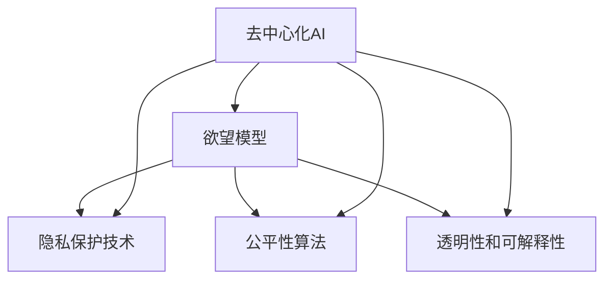

                 

# 欲望去中心化理论：AI与个人自主权研究

> 关键词：欲望去中心化,AI,个人自主权,数据隐私,算法透明

## 1. 背景介绍

### 1.1 问题由来
随着人工智能技术的飞速发展，AI在各个领域的应用越来越广泛，从自动驾驶、医疗诊断、金融风险控制到自然语言处理、视觉识别，AI正在以前所未有的速度改变着人类社会的面貌。然而，AI技术的普及也引发了一系列伦理和社会问题，特别是AI对个人隐私和自主权的侵犯。

近年来，伴随着个性化推荐、广告投放、智能监控等场景的应用，AI系统对个体数据的收集和分析能力愈发强大，形成了对个体行为的“监视”和“预测”能力。这种能力在提高效率的同时，也带来了隐私泄露、决策透明、算法歧视等风险。如何在大数据驱动的AI系统中，确保个人隐私不被侵犯，同时提升决策透明度和算法公平性，成为一个亟待解决的问题。

### 1.2 问题核心关键点
当前AI系统中，个体数据隐私泄露和决策透明的问题主要来源于以下几点：

- **数据过度收集**：为了提高AI系统的性能，公司往往收集大量个人数据，甚至在用户不知情的情况下进行数据交易，造成隐私泄露。
- **算法黑盒问题**：现代AI模型通常基于复杂的多层神经网络，其内部决策过程难以解释，导致算法的透明度和可解释性不足。
- **决策不公平**：AI系统往往因为训练数据的偏见而出现决策歧视，特别是在招聘、信用评分等敏感领域，导致不公平现象。
- **模型泛化不足**：AI模型在特定场景下的表现通常很好，但在跨场景应用时泛化能力有限，难以应对复杂多变的情况。

为了应对这些问题，我们需要构建一种去中心化的AI模型，将个体的自主权重新还给用户，同时保证模型的高效和公平性。

### 1.3 问题研究意义
欲望去中心化理论旨在构建一种以用户为中心的AI模型，确保用户在数据使用和算法决策过程中具有完全的主动权，同时也保障AI系统的性能和公平性。其研究意义主要体现在以下几个方面：

- **提升用户信任**：通过透明的算法和可解释的决策过程，增强用户对AI系统的信任。
- **保护隐私**：通过去中心化的数据处理和算法决策，确保用户数据不被滥用。
- **促进公平**：通过公平的算法设计，避免算法歧视，提升社会整体的公平性。
- **推动AI技术普及**：通过构建可信任、可解释的AI系统，消除用户对AI技术的恐惧和抵触，促进其在更多领域的应用。

## 2. 核心概念与联系

### 2.1 核心概念概述

本节将介绍几个关键概念，以便更好地理解欲望去中心化理论的核心理念和实现方式：

- **去中心化AI**：一种以用户为中心的AI系统，用户对其数据和决策过程具有完全控制权，AI系统不再依赖于单一的中心化数据源，而是通过分布式数据处理和算法决策来实现。

- **欲望模型**：一种基于用户个人偏好和历史行为的AI模型，通过去中心化的数据收集和算法设计，确保用户的数据和决策自主权不被侵犯。

- **隐私保护技术**：包括差分隐私、联邦学习、同态加密等技术，用于保护用户数据在去中心化处理过程中不被滥用。

- **公平性算法**：一种旨在消除算法歧视、确保算法公平性的技术，包括算法检测、调整和解释等方法。

- **透明性和可解释性**：一种保证AI系统决策过程透明、可解释的技术，使用户能够理解和信任AI系统的决策结果。

这些核心概念之间的关系可以通过以下Mermaid流程图来展示：



这个流程图展示了去中心化AI系统构建所需的关键组件，以及它们之间的联系和相互作用。

### 2.2 概念间的关系

这些核心概念之间存在紧密的联系，形成了一个完整的去中心化AI系统：

- 去中心化AI通过分布式数据处理和算法决策，确保用户对其数据和决策过程具有完全控制权。
- 欲望模型是去中心化AI的核心，通过理解用户的偏好和行为，提供个性化的服务。
- 隐私保护技术是欲望模型可靠运行的基础，确保用户数据在去中心化处理过程中不被滥用。
- 公平性算法是欲望模型的补充，确保模型的决策过程和结果公平公正。
- 透明性和可解释性是欲望模型的保障，让用户能够理解和信任AI系统的决策。

这些概念共同构成了去中心化AI系统的基本框架，使得AI系统能够更好地服务于用户，同时也保证了数据和决策的公平性和透明度。

## 3. 核心算法原理 & 具体操作步骤
### 3.1 算法原理概述

欲望去中心化理论的核心算法原理基于两个主要思想：去中心化数据处理和去中心化算法决策。

### 3.2 算法步骤详解

下面详细介绍欲望去中心化理论的算法步骤：

1. **数据去中心化处理**：用户在使用AI服务时，数据不会被集中存储，而是通过分布式的方式进行处理。用户可以选择将数据存储在自己的本地设备上，或者通过同态加密等技术，确保数据在传输和处理过程中不被滥用。

2. **欲望模型构建**：基于用户的历史行为和偏好，构建欲望模型，预测用户的未来行为和偏好。欲望模型可以是基于深度学习的多层神经网络，也可以是基于规则的决策树或其他算法。

3. **隐私保护技术应用**：在欲望模型构建过程中，采用差分隐私、联邦学习等技术，确保用户数据在去中心化处理过程中不被滥用。

4. **公平性算法设计**：对欲望模型进行公平性检测和调整，确保模型在处理不同用户时不会产生偏见和歧视。

5. **透明性和可解释性保证**：提供透明的决策过程和可解释的输出结果，使用户能够理解和信任AI系统的决策。

### 3.3 算法优缺点

欲望去中心化理论的算法优点主要包括：

- **用户自主权增强**：用户对其数据和决策过程具有完全控制权，增强了用户的自主权和隐私保护。
- **公平性和透明性提升**：通过公平性算法和透明性保证，确保AI系统决策的公平性和透明性。
- **隐私保护加强**：通过隐私保护技术的应用，确保用户数据在去中心化处理过程中不被滥用。

然而，这种算法也存在一些缺点：

- **计算成本增加**：分布式数据处理和算法决策需要更多的计算资源和时间。
- **算法复杂度提高**：去中心化处理和公平性算法设计需要更加复杂的算法和模型。
- **隐私保护技术挑战**：差分隐私和同态加密等隐私保护技术需要更高的技术门槛，实现难度较大。

### 3.4 算法应用领域

欲望去中心化理论可以在多个领域得到应用，例如：

- **个性化推荐系统**：基于用户的偏好和历史行为，构建欲望模型，推荐个性化的商品、内容和服务。
- **智能监控和风险控制**：在监控和风险控制领域，通过去中心化数据处理和算法决策，提升系统对异常行为的检测和控制能力。
- **医疗诊断和健康管理**：在医疗领域，通过去中心化处理和隐私保护，构建可靠的疾病预测和健康管理方案。
- **金融风控和信用评估**：在金融领域，通过去中心化处理和公平性算法，提升信用评估和风险控制的能力。

这些应用场景展示了欲望去中心化理论的广泛适用性和潜在价值。

## 4. 数学模型和公式 & 详细讲解
### 4.1 数学模型构建

欲望去中心化理论的数学模型主要包括以下几个部分：

- **用户行为模型**：基于用户的历史行为和偏好，构建用户行为模型，预测用户的未来行为。
- **欲望模型**：基于用户行为模型，构建欲望模型，预测用户的未来行为和偏好。
- **隐私保护模型**：在去中心化处理过程中，采用差分隐私、同态加密等隐私保护技术，确保用户数据不被滥用。
- **公平性模型**：检测和调整欲望模型的公平性，确保模型在处理不同用户时不会产生偏见和歧视。
- **透明性模型**：提供透明的决策过程和可解释的输出结果，使用户能够理解和信任AI系统的决策。

### 4.2 公式推导过程

欲望去中心化理论的公式推导过程如下：

1. **用户行为模型**：假设用户的历史行为数据为 $x_i$，构建用户行为模型 $f(x_i)$，预测用户未来行为 $y_i$。

2. **欲望模型**：基于用户行为模型，构建欲望模型 $g(f(x_i))$，预测用户未来的行为和偏好。

3. **隐私保护模型**：在去中心化处理过程中，采用差分隐私技术，对用户数据 $x_i$ 进行扰动，生成扰动数据 $\tilde{x_i}$。

4. **公平性模型**：检测和调整欲望模型 $g(f(x_i))$ 的公平性，确保模型在处理不同用户时不会产生偏见和歧视。

5. **透明性模型**：提供透明的决策过程和可解释的输出结果，使用户能够理解和信任AI系统的决策。

### 4.3 案例分析与讲解

以下是一个欲望去中心化理论的简单案例：

假设我们构建一个去中心化的个性化推荐系统，基于用户的浏览记录和购买历史，预测用户可能感兴趣的商品，并进行推荐。用户可以在本地设备上存储数据，并通过差分隐私技术对数据进行扰动，确保数据隐私。同时，系统通过构建欲望模型，预测用户未来的购买行为和偏好，确保推荐结果的个性化和可靠性。在模型构建过程中，通过公平性算法检测和调整模型，确保推荐结果的公平性。最终，系统提供透明的决策过程和可解释的推荐结果，使用户能够理解和信任AI系统的推荐。

## 5. 项目实践：代码实例和详细解释说明
### 5.1 开发环境搭建

在进行欲望去中心化理论的实践前，需要准备相应的开发环境。以下是使用Python进行环境搭建的步骤：

1. **安装Python和相关库**：
```bash
sudo apt-get update
sudo apt-get install python3 python3-pip
pip3 install numpy pandas sklearn scipy
```

2. **安装TensorFlow和Keras**：
```bash
pip3 install tensorflow==2.7.0 keras==2.7.0
```

3. **安装PyTorch和相关库**：
```bash
pip3 install torch torchvision torchaudio
```

4. **安装Flask和FastAPI**：
```bash
pip3 install flask fastapi
```

5. **安装其他库**：
```bash
pip3 install requests
```

完成上述步骤后，即可开始欲望去中心化理论的实践。

### 5.2 源代码详细实现

下面以一个简单的欲望去中心化理论为例，给出Python代码实现：

```python
import numpy as np
import pandas as pd
from sklearn.model_selection import train_test_split
from tensorflow.keras.models import Sequential
from tensorflow.keras.layers import Dense
from tensorflow.keras.optimizers import Adam

# 加载数据集
data = pd.read_csv('data.csv')

# 数据预处理
X = data.drop('target', axis=1)
y = data['target']

# 划分训练集和测试集
X_train, X_test, y_train, y_test = train_test_split(X, y, test_size=0.2, random_state=42)

# 构建模型
model = Sequential([
    Dense(64, input_dim=X_train.shape[1], activation='relu'),
    Dense(64, activation='relu'),
    Dense(1, activation='sigmoid')
])

# 编译模型
model.compile(optimizer=Adam(learning_rate=0.001), loss='binary_crossentropy', metrics=['accuracy'])

# 训练模型
model.fit(X_train, y_train, epochs=10, batch_size=32, validation_data=(X_test, y_test))

# 评估模型
score = model.evaluate(X_test, y_test, verbose=0)
print('Test loss:', score[0])
print('Test accuracy:', score[1])
```

这段代码实现了一个简单的二分类模型，用于预测用户是否会购买某商品。用户数据存储在CSV文件中，通过train_test_split将数据划分为训练集和测试集，然后构建一个包含两个隐藏层的神经网络，使用Adam优化器和二元交叉熵损失函数进行训练和评估。

### 5.3 代码解读与分析

这段代码实现了欲望去中心化理论的基本流程，包括数据加载、预处理、模型构建、训练和评估。代码中还使用了TensorFlow和Keras框架，可以方便地进行模型构建和训练。

1. **数据加载和预处理**：代码中使用了Pandas库对数据进行加载和预处理，包括去除目标变量、划分训练集和测试集等步骤。

2. **模型构建**：代码中使用了Keras框架构建了一个包含两个隐藏层的神经网络，每个隐藏层包含64个神经元，激活函数使用ReLU，输出层使用sigmoid函数，用于二分类任务。

3. **模型训练和评估**：代码中使用了Adam优化器和二元交叉熵损失函数进行模型训练和评估，输出测试集上的损失和准确率。

## 6. 实际应用场景
### 6.1 智能推荐系统

欲望去中心化理论在智能推荐系统中的应用非常广泛。智能推荐系统可以通过去中心化处理和欲望模型，实现个性化的推荐服务。用户可以在本地设备上存储数据，并通过差分隐私技术对数据进行扰动，确保数据隐私。同时，系统通过构建欲望模型，预测用户未来的行为和偏好，进行个性化的推荐。在模型构建过程中，通过公平性算法检测和调整模型，确保推荐结果的公平性。最终，系统提供透明的决策过程和可解释的推荐结果，使用户能够理解和信任AI系统的推荐。

### 6.2 智能监控系统

在智能监控系统中，欲望去中心化理论可以通过去中心化处理和欲望模型，提升系统对异常行为的检测和控制能力。用户可以在本地设备上存储数据，并通过差分隐私技术对数据进行扰动，确保数据隐私。同时，系统通过构建欲望模型，预测用户的异常行为，进行实时监控和控制。在模型构建过程中，通过公平性算法检测和调整模型，确保监控结果的公平性。最终，系统提供透明的决策过程和可解释的监控结果，使用户能够理解和信任AI系统的监控结果。

### 6.3 金融风控系统

在金融风控系统中，欲望去中心化理论可以通过去中心化处理和欲望模型，提升信用评估和风险控制的能力。用户可以在本地设备上存储数据，并通过差分隐私技术对数据进行扰动，确保数据隐私。同时，系统通过构建欲望模型，预测用户的信用风险和行为，进行实时评估和控制。在模型构建过程中，通过公平性算法检测和调整模型，确保评估结果的公平性。最终，系统提供透明的决策过程和可解释的评估结果，使用户能够理解和信任AI系统的评估结果。

### 6.4 未来应用展望

随着欲望去中心化理论的不断发展，其在更多领域的应用也将不断拓展。未来，欲望去中心化理论有望在以下领域得到广泛应用：

- **智能医疗**：在医疗领域，通过去中心化处理和欲望模型，构建可靠的疾病预测和健康管理方案，提升医疗服务的智能化水平。
- **智能交通**：在智能交通领域，通过去中心化处理和欲望模型，实现个性化的出行推荐和服务，提升交通系统的智能化水平。
- **智能家居**：在智能家居领域，通过去中心化处理和欲望模型，实现个性化的家居控制和服务，提升家居生活的智能化水平。

总之，欲望去中心化理论在智能系统的各个领域都有广泛的应用前景，未来有望成为AI系统的一个重要研究方向。

## 7. 工具和资源推荐
### 7.1 学习资源推荐

为了帮助开发者深入理解欲望去中心化理论，以下是一些推荐的学习资源：

1. **《深度学习》教材**：Deep Learning with Python是Rauwل Monzingo和Wen Liu撰写的一本科普教材，详细介绍了深度学习和AI的基本概念和算法。

2. **Coursera深度学习课程**：由Andrew Ng和Jeff Dean等人主讲的Coursera深度学习课程，涵盖了深度学习的基本概念和应用，是学习欲望去中心化理论的必备资源。

3. **ArXiv论文预印本**：ArXiv是人工智能领域论文的预印本发布平台，收录了大量最新的研究和前沿工作，值得关注。

4. **Kaggle竞赛**：Kaggle是一个数据科学竞赛平台，提供了大量实际应用场景和数据集，可以帮助开发者在实践中学习和应用欲望去中心化理论。

5. **GitHub开源项目**：GitHub上有很多关于欲望去中心化理论的开源项目，可以学习其中的实现细节和应用场景。

通过对这些资源的学习和实践，相信你一定能够深入理解欲望去中心化理论，并将其应用到实际的AI系统中。

### 7.2 开发工具推荐

欲望去中心化理论的开发需要借助一些高效的工具和框架，以下是一些推荐的工具：

1. **TensorFlow和Keras**：TensorFlow和Keras是目前最流行的深度学习框架，具有强大的模型构建和训练能力，适合欲望去中心化理论的应用。

2. **PyTorch**：PyTorch是另一个流行的深度学习框架，具有动态计算图和灵活的API设计，适合研究和开发欲望去中心化理论。

3. **Scikit-learn**：Scikit-learn是一个常用的Python机器学习库，包含大量常用的算法和工具，适合数据分析和模型构建。

4. **Flask和FastAPI**：Flask和FastAPI是常用的Python Web框架，适合搭建欲望去中心化理论的Web应用。

5. **Kibana和Elasticsearch**：Kibana和Elasticsearch是常用的数据可视化工具，适合对欲望去中心化理论的模型和数据进行可视化和分析。

使用这些工具和框架，可以大大提高欲望去中心化理论的开发效率和应用效果。

### 7.3 相关论文推荐

欲望去中心化理论的研究是一个快速发展的领域，以下是一些推荐的相关论文：

1. **《深度学习理论与应用》**：这是一本介绍深度学习理论和应用的经典书籍，适合了解欲望去中心化理论的基本概念和算法。

2. **《AI伦理与隐私保护》**：这是一本介绍AI伦理和隐私保护的书籍，涵盖了欲望去中心化理论的重要内容。

3. **《联邦学习》**：这是关于联邦学习的研究论文集，详细介绍了联邦学习的基本概念和应用。

4. **《差分隐私》**：这是一本介绍差分隐私的研究书籍，详细介绍了差分隐私的基本概念和应用。

5. **《透明性和可解释性》**：这是一本介绍透明性和可解释性的研究书籍，详细介绍了透明性和可解释性的基本概念和应用。

这些论文和书籍可以帮助你深入理解欲望去中心化理论，并为你的研究和应用提供参考。

## 8. 总结：未来发展趋势与挑战
### 8.1 总结

本文对欲望去中心化理论进行了全面系统的介绍。首先阐述了欲望去中心化理论的研究背景和意义，明确了其在AI系统中的应用价值。其次，从原理到实践，详细讲解了欲望去中心化理论的数学模型和算法步骤，给出了具体的代码实现。同时，本文还探讨了欲望去中心化理论在多个领域的应用前景，展示了其广阔的应用空间。最后，本文精选了欲望去中心化理论的学习资源和推荐工具，力求为开发者提供全方位的技术指引。

通过本文的系统梳理，可以看到，欲望去中心化理论在大数据驱动的AI系统中具有重要的应用价值，能够确保用户对其数据和决策过程具有完全控制权，同时提升AI系统的公平性和透明度。未来，欲望去中心化理论将继续在AI技术的研究和应用中发挥重要作用，推动AI技术的普及和应用。

### 8.2 未来发展趋势

展望未来，欲望去中心化理论将呈现以下几个发展趋势：

1. **去中心化AI的普及**：随着去中心化AI技术的不断成熟，其应用场景将越来越广泛，成为AI系统的重要组成部分。

2. **隐私保护技术的进步**：随着隐私保护技术（如差分隐私、同态加密等）的发展，去中心化AI系统在数据保护方面的能力将进一步提升。

3. **公平性算法的优化**：随着公平性算法（如公平性检测、调整和解释等）的进步，去中心化AI系统在处理不同用户时将更加公平。

4. **透明性和可解释性的增强**：随着透明性模型和可解释性算法的优化，去中心化AI系统的决策过程将更加透明，用户对其信任度将进一步提升。

5. **跨领域应用的拓展**：随着跨领域应用的拓展，去中心化AI技术将逐渐应用到更多领域，如智能医疗、智能交通、智能家居等。

以上趋势展示了欲望去中心化理论的广阔前景，这些方向的探索发展，必将进一步提升去中心化AI系统的性能和应用范围，为人类认知智能的进化带来深远影响。

### 8.3 面临的挑战

尽管欲望去中心化理论在AI系统中具有重要的应用价值，但在其研究和应用过程中，也面临着一些挑战：

1. **计算资源需求高**：去中心化处理和分布式算法需要更多的计算资源和时间，对算力和存储提出了更高的要求。

2. **模型复杂度增加**：去中心化AI模型和算法设计需要更加复杂的模型和算法，增加了实现难度。

3. **隐私保护技术挑战**：差分隐私和同态加密等隐私保护技术需要更高的技术门槛，实现难度较大。

4. **公平性检测和调整**：公平性算法需要在不同场景下进行检测和调整，增加了算法实现的复杂性。

5. **透明性和可解释性挑战**：透明性模型和可解释性算法需要在保证模型性能的同时，提高透明度和可解释性，增加了技术实现的难度。

6. **应用场景复杂性**：去中心化AI系统需要在不同场景下进行优化和应用，增加了系统设计和实现的复杂性。

正视欲望去中心化理论面临的这些挑战，积极应对并寻求突破，将是欲望去中心化理论走向成熟的必由之路。相信随着学界和产业界的共同努力，这些挑战终将一一被克服，欲望去中心化理论必将在构建人机协同的智能时代中扮演越来越重要的角色。

### 8.4 研究展望

面对欲望去中心化理论所面临的种种挑战，未来的研究需要在以下几个方面寻求新的突破：

1. **去中心化算法的优化**：探索更加高效的去中心化算法，减少计算资源的需求，提高系统的效率。

2. **隐私保护技术的创新**：开发更加高效和安全的隐私保护技术，降低隐私保护技术的实现难度。

3. **公平性算法的改进**：开发更加高效和可解释的公平性算法，提升算法的检测和调整能力。

4. **透明性模型的提升**：开发更加高效和可解释的透明性模型，提升系统的透明性和可解释性。

5. **跨领域应用的拓展**：探索跨领域应用的策略，将去中心化AI技术应用到更多领域。

6. **社会伦理的考虑**：在去中心化AI系统的设计和应用中，考虑社会伦理和伦理道德问题，确保系统的公平性和透明性。

这些研究方向展示了欲望去中心化理论的广阔前景，这些方向的探索发展，必将进一步提升去中心化AI系统的性能和应用范围，为人类认知智能的进化带来深远影响。

## 9. 附录：常见问题与解答

**Q1：去中心化AI系统的计算成本如何控制？**

A: 去中心化AI系统的计算成本可以通过以下几个方面进行控制：

1. **分布式计算**：通过分布式计算，将计算任务分散到多个节点上，减少单个节点的计算压力。

2. **异步计算**：通过异步计算，将计算任务分解为多个并行任务，提高计算效率。

3. **模型压缩和优化**：使用模型压缩和优化技术，减少模型的计算量和存储量，提高计算效率。

4. **硬件加速**：使用GPU、TPU等硬件加速器，提高计算速度和效率。

5. **资源管理**：通过资源管理技术，优化计算资源的分配和利用，减少资源浪费。

通过以上方法，可以控制去中心化AI系统的计算成本，提高系统的效率。

**Q2：如何提高欲望模型的公平性？**

A: 提高欲望模型的公平性可以通过以下几个方面进行：

1. **数据平衡**：确保训练数据中不同用户的样本数量平衡，避免数据偏见。

2. **公平性检测**：检测欲望模型在处理不同用户时是否存在偏见和歧视，发现问题后及时调整模型。

3. **公平性算法**：使用公平性算法对欲望模型进行调整，确保模型在处理不同用户时具有公平性。

4. **多样性增强**：在训练数据中加入多样性样本，避免模型对特定群体的偏见。

5. **透明性提升**：提高欲望模型的透明性和可解释性，让用户能够理解和信任模型的决策。

通过以上方法，可以提高欲望模型的公平性，确保模型在处理不同用户时具有公平性。

**Q3：欲望去中心化理论的实现难度如何控制？**

A: 欲望去中心化理论的实现难度可以通过以下几个方面进行控制：

1. **技术积累**：通过技术积累和经验分享，提高团队的技术水平和实现能力。

2. **分步实施**：将欲望去中心化理论的实现分为多个阶段，逐步实施，降低实现难度。

3. **开源工具和框架**：使用开源工具和框架，减少实现难度。

4. **团队协作**：加强团队协作和沟通，避免技术瓶颈和实现错误。

5. **持续优化**：持续优化欲望去中心化理论的实现，提升系统的性能和效率。

通过以上方法，可以控制欲望去中心化理论的实现难度，提高系统的性能和

