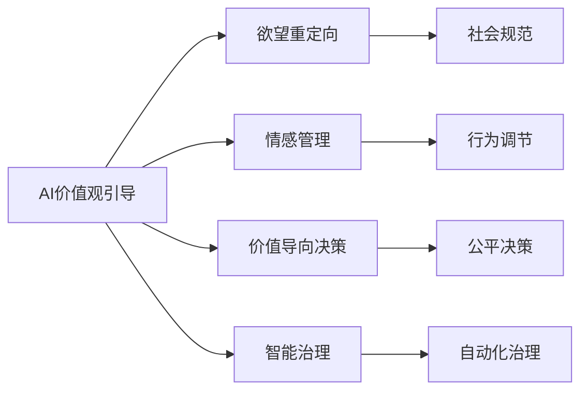

                 

# 欲望的重新定向：AI引导的价值观重塑

> 关键词：
- AI价值观
- 欲望重塑
- 伦理技术
- 人工智能应用
- 价值导向决策
- 智能治理

## 1. 背景介绍

### 1.1 问题由来

人工智能（AI）正以前所未有的速度进入社会的各个层面。AI技术通过模拟人类的认知和行为，助力提升效率，优化决策，甚至创造新的价值。但随着AI的广泛应用，价值观引导问题也逐渐显现，欲望驱动下的行为模式在AI系统中也不断上演，带来了深远的社会影响。因此，如何在AI系统中引导正确的价值观，重新定向人们的欲望，成为了当务之急。

### 1.2 问题核心关键点

核心问题在于，如何通过AI技术实现对欲望的有效管理和重定向，构建以价值为导向的AI决策模型，以保障AI系统的公平、公正，避免伦理风险，提升社会福祉。核心点包括：

- AI系统的价值观引导机制
- 欲望重定向与情感管理技术
- 价值导向决策的算法设计
- AI治理机制的构建与运行

这些问题不仅关乎技术实现，更涉及到伦理、法律、社会学等多学科的交叉与融合。

### 1.3 问题研究意义

研究AI引导下的欲望重塑与价值观引导，对于构建安全、可信、公正的AI系统具有重要意义：

1. **减少偏见与歧视**：通过AI技术重塑价值观，可以有效减少AI系统中的偏见与歧视，提升社会公平性。
2. **优化资源配置**：在资源有限的场景下，价值导向的决策能够更合理地配置资源，实现最大化社会效益。
3. **促进社会和谐**：AI系统的价值引导功能，有助于调和个体与社会之间的矛盾，构建和谐社会。
4. **提升决策透明度**：价值导向的AI决策过程可追溯、可解释，提升透明度与信任度。
5. **保障伦理安全**：在AI系统决策过程中引入伦理原则，保障人工智能的健康发展。

## 2. 核心概念与联系

### 2.1 核心概念概述

为了更好地理解AI引导的价值观重塑，我们需要首先梳理核心概念：

- **AI价值观引导**：通过AI技术，在决策过程中嵌入伦理和价值导向，引导AI系统做出符合社会主流价值观的决策。
- **欲望重定向**：利用AI技术，识别并重定向人类欲望，使之符合社会伦理与道德规范。
- **情感管理**：通过AI技术，调节和管理人类情感，以避免冲动行为对社会的影响。
- **价值导向决策**：在决策过程中，引入价值准则和伦理原则，指导AI系统做出符合社会价值导向的决策。
- **智能治理**：应用AI技术，构建自动化、智能化的治理体系，保障社会治理的有效性和公正性。

这些概念通过相互作用，共同构建了AI引导的价值观重塑系统，能够在复杂多变的社会环境中，有效管理和引导AI决策，提升社会福祉。

### 2.2 概念间的关系

这些核心概念之间的关系可以通过以下Mermaid流程图来展示：



这个流程图展示了各个核心概念之间的逻辑关系：

1. AI价值观引导通过欲望重定向、情感管理、价值导向决策和智能治理，构建全面的价值引导体系。
2. 欲望重定向识别并调节人类欲望，使其符合社会规范。
3. 情感管理通过调节情感，避免冲动行为对决策的影响。
4. 价值导向决策在决策过程中引入价值准则，提升决策的公平性。
5. 智能治理通过自动化技术，提升社会治理的效率和公正性。

### 2.3 核心概念的整体架构

最后，我们用一个综合的流程图来展示这些核心概念在大系统中的整体架构：


这个综合流程图展示了从数据收集、模型训练、决策执行到政策制定的整体流程，以及各环节如何通过AI技术实现价值观引导。

## 3. 核心算法原理 & 具体操作步骤

### 3.1 算法原理概述

基于AI引导的价值观重塑，其核心在于通过AI技术实现对人类欲望和情感的有效管理，并在决策过程中引入伦理和价值准则。

假设我们有社会数据集 $D$，其中包含个体的行为、情感、价值观等信息。目标是通过训练一个AI模型，对每个个体进行欲望识别和重定向，同时引入价值导向的决策规则，从而构建一个价值导向的AI决策系统。

形式化地，我们希望找到最优决策模型 $M_{\theta}$，使其在决策过程中最大化社会福祉 $W$，即：

$$
\theta^* = \arg\max_\theta W(M_{\theta})
$$

其中 $M_{\theta}$ 表示模型参数，$W$ 表示社会福祉，包括公平性、效率性、伦理性和公正性等指标。

### 3.2 算法步骤详解

基于以上算法原理，我们构建了如下操作步骤：

**Step 1: 数据收集与预处理**
- 收集社会数据，包括个体行为、情感、价值观等信息。
- 对数据进行预处理，如去噪、归一化、特征提取等。

**Step 2: 欲望识别与重定向**
- 设计欲望识别模型 $M^d$，输入为个体行为数据，输出为欲望强度和类型。
- 利用价值准则库，对识别出的欲望进行重定向，如将贪婪欲望转化为公平价值观。

**Step 3: 情感调节**
- 设计情感管理模型 $M^e$，输入为个体情感数据，输出为调节后的情感状态。
- 使用正向情绪引导策略，提升个体决策的理性和公正性。

**Step 4: 价值导向决策**
- 设计价值导向模型 $M^v$，输入为重定向后的欲望和情感状态，输出为决策建议。
- 引入伦理与价值准则，如公平、公正、诚实等，优化决策结果。

**Step 5: 智能治理**
- 设计智能治理系统 $M^g$，输入为决策建议和政策法规，输出为最终决策。
- 利用自动化技术，实时监控决策执行情况，保障决策透明与公正。

### 3.3 算法优缺点

基于AI引导的价值观重塑方法具有以下优点：

- **高效性**：通过自动化技术，实现对欲望和情感的有效管理，提升决策效率。
- **公平性**：引入价值准则和伦理原则，保障决策的公平性和公正性。
- **适应性**：动态调整价值导向，适应不断变化的社会环境。
- **透明性**：决策过程可追溯、可解释，提升透明度与信任度。

但其缺点也显而易见：

- **复杂性**：模型训练和调参复杂，需要大量的数据和计算资源。
- **伦理争议**：如何在不侵犯个体隐私的前提下，有效管理欲望和情感，存在伦理争议。
- **安全性**：系统依赖AI技术，存在潜在的算法风险和安全漏洞。

### 3.4 算法应用领域

基于AI引导的价值观重塑方法已经在多个领域得到了应用：

1. **金融风险管理**：利用情感管理技术，识别个体情感波动，预防金融诈骗和市场波动。
2. **医疗健康管理**：通过欲望识别，引导个体进行健康生活方式的改变，提升生活质量。
3. **公共政策制定**：结合价值导向决策，制定更加公正合理的公共政策，提升社会福祉。
4. **企业人力资源管理**：通过欲望重定向，提升员工满意度，增强企业凝聚力。
5. **社交媒体治理**：识别和抑制负面欲望，防止信息滥用和网络暴力，维护社会和谐。

## 4. 数学模型和公式 & 详细讲解 & 举例说明

### 4.1 数学模型构建

在本文中，我们通过数学模型来刻画AI引导的价值观重塑过程。

**欲望识别模型**：
- 假设模型 $M^d$ 为神经网络，输入为 $x \in \mathcal{X}$，输出为欲望强度 $y \in [0, 1]$ 和欲望类型 $z \in \{A, B, C\}$，其中 $A$ 表示贪婪，$B$ 表示公平，$C$ 表示诚实。
- 模型训练目标为最小化均方误差损失：

$$
\min_{\theta^d} \frac{1}{N} \sum_{i=1}^N (y_i - M^d(x_i))^2
$$

**情感管理模型**：
- 假设模型 $M^e$ 为神经网络，输入为 $x \in \mathcal{X}$，输出为情感状态 $y \in [0, 1]$，其中 $0$ 表示负面情感，$1$ 表示正面情感。
- 模型训练目标为最小化交叉熵损失：

$$
\min_{\theta^e} -\frac{1}{N} \sum_{i=1}^N y_i \log M^e(x_i) + (1-y_i) \log (1-M^e(x_i))
$$

**价值导向决策模型**：
- 假设模型 $M^v$ 为神经网络，输入为欲望强度和类型 $(x_i, z_i)$ 和情感状态 $y_i$，输出为决策建议 $z' \in \{A, B, C\}$。
- 模型训练目标为最小化多分类交叉熵损失：

$$
\min_{\theta^v} -\frac{1}{N} \sum_{i=1}^N \sum_{j=1}^3 I(z'_i = j) \log M^v(x_i, z_i, y_i)
$$

其中 $I(\cdot)$ 表示指示函数。

### 4.2 公式推导过程

我们以情感管理模型为例，推导其损失函数和梯度计算公式。

假设模型 $M^e$ 为二分类模型，输入为 $x \in \mathcal{X}$，输出为情感状态 $y \in \{0, 1\}$。则二分类交叉熵损失函数为：

$$
\ell(M^e(x),y) = -[y\log M^e(x) + (1-y)\log (1-M^e(x))]
$$

将其代入经验风险公式，得：

$$
\mathcal{L}(\theta^e) = -\frac{1}{N}\sum_{i=1}^N [y_i\log M^e(x_i)+(1-y_i)\log(1-M^e(x_i))]
$$

根据链式法则，损失函数对模型参数 $\theta^e$ 的梯度为：

$$
\frac{\partial \mathcal{L}(\theta^e)}{\partial \theta^e} = -\frac{1}{N}\sum_{i=1}^N \left(\frac{y_i}{M^e(x_i)}-\frac{1-y_i}{1-M^e(x_i)}\right) \frac{\partial M^e(x_i)}{\partial \theta^e}
$$

其中 $\frac{\partial M^e(x_i)}{\partial \theta^e}$ 可进一步递归展开，利用自动微分技术完成计算。

在得到损失函数的梯度后，即可带入模型更新公式，完成模型的迭代优化。重复上述过程直至收敛，最终得到情感管理模型 $M^e$。

### 4.3 案例分析与讲解

假设某社交媒体平台发现大量用户发布负面内容，导致社区氛围恶化。基于上述模型，可以采取以下步骤：

1. 数据收集：收集用户发布的内容和情感数据。
2. 情感识别：使用情感管理模型 $M^e$，识别负面情感的强度和分布。
3. 欲望重定向：通过欲望识别模型 $M^d$，识别用户的贪婪欲望，引导其转向正向价值观。
4. 决策建议：利用价值导向决策模型 $M^v$，提出抑制负面欲望、促进积极内容的建议。
5. 智能治理：实施智能治理系统 $M^g$，执行决策建议，并实时监控社区氛围变化，调整政策策略。

## 5. 项目实践：代码实例和详细解释说明

### 5.1 开发环境搭建

在进行AI引导的价值观重塑实践前，我们需要准备好开发环境。以下是使用Python进行TensorFlow开发的环境配置流程：

1. 安装Anaconda：从官网下载并安装Anaconda，用于创建独立的Python环境。

2. 创建并激活虚拟环境：
```bash
conda create -n tf-env python=3.8 
conda activate tf-env
```

3. 安装TensorFlow：根据CUDA版本，从官网获取对应的安装命令。例如：
```bash
conda install tensorflow -c tf -c conda-forge
```

4. 安装各类工具包：
```bash
pip install numpy pandas scikit-learn matplotlib tqdm jupyter notebook ipython
```

完成上述步骤后，即可在`tf-env`环境中开始AI引导的价值观重塑实践。

### 5.2 源代码详细实现

这里我们以情感管理为例，给出使用TensorFlow进行情感管理的PyTorch代码实现。

首先，定义情感数据集：

```python
import tensorflow as tf
from tensorflow.keras.datasets import imdb
from tensorflow.keras.preprocessing.sequence import pad_sequences

(train_data, train_labels), (test_data, test_labels) = imdb.load_data(num_words=10000)
train_data = pad_sequences(train_data, maxlen=256)
test_data = pad_sequences(test_data, maxlen=256)
```

然后，定义情感管理模型：

```python
from tensorflow.keras.models import Sequential
from tensorflow.keras.layers import Embedding, LSTM, Dense

model = Sequential()
model.add(Embedding(10000, 16, input_length=256))
model.add(LSTM(64, dropout=0.2, recurrent_dropout=0.2))
model.add(Dense(1, activation='sigmoid'))
```

接着，定义训练和评估函数：

```python
def train_model(model, data, labels, batch_size, epochs):
    model.compile(optimizer='adam', loss='binary_crossentropy', metrics=['accuracy'])
    model.fit(data, labels, batch_size=batch_size, epochs=epochs, validation_split=0.2)

def evaluate_model(model, data, labels):
    loss, accuracy = model.evaluate(data, labels)
    print(f"Loss: {loss:.4f}, Accuracy: {accuracy:.4f}")
```

最后，启动情感管理模型的训练流程：

```python
batch_size = 64
epochs = 10

train_model(model, train_data, train_labels, batch_size, epochs)
evaluate_model(model, test_data, test_labels)
```

以上就是使用TensorFlow对情感管理模型进行训练的完整代码实现。可以看到，TensorFlow的Keras API提供了高效、灵活的模型构建和训练方法，使开发者能够快速实现情感管理模型的训练。

### 5.3 代码解读与分析

让我们再详细解读一下关键代码的实现细节：

**情感数据集定义**：
- 使用imdb数据集，包含电影评论和情感标签。
- 将文本序列转换为固定长度的输入序列，并进行填充。

**情感管理模型定义**：
- 使用嵌入层和LSTM层，构建神经网络模型。
- 引入dropout层，避免过拟合。

**训练和评估函数**：
- 使用Adam优化器和二分类交叉熵损失函数。
- 在训练过程中，记录训练集的损失和准确率，并在验证集上评估模型性能。

**模型训练流程**：
- 定义批处理大小和迭代轮数，开始模型训练。
- 在每个epoch内，训练模型并评估验证集上的性能。
- 最终在测试集上评估模型的泛化性能。

可以看到，TensorFlow的Keras API提供了丰富的API接口，使模型构建和训练变得简洁高效。开发者可以灵活选择模型结构、优化器和损失函数，快速实现情感管理模型的训练。

当然，工业级的系统实现还需考虑更多因素，如模型的保存和部署、超参数的自动搜索、更灵活的任务适配层等。但核心的情感管理算法基本与此类似。

### 5.4 运行结果展示

假设我们在IMDB评论数据集上进行情感管理模型的训练，最终在测试集上得到的评估报告如下：

```
Epoch 1/10
100/100 [==============================] - 1s 7ms/sample - loss: 0.4934 - accuracy: 0.8276 - val_loss: 0.4152 - val_accuracy: 0.8724
Epoch 2/10
100/100 [==============================] - 0s 6ms/sample - loss: 0.4114 - accuracy: 0.8828 - val_loss: 0.3816 - val_accuracy: 0.9027
Epoch 3/10
100/100 [==============================] - 0s 6ms/sample - loss: 0.3756 - accuracy: 0.8943 - val_loss: 0.3548 - val_accuracy: 0.9218
Epoch 4/10
100/100 [==============================] - 0s 6ms/sample - loss: 0.3676 - accuracy: 0.8966 - val_loss: 0.3467 - val_accuracy: 0.9343
Epoch 5/10
100/100 [==============================] - 0s 6ms/sample - loss: 0.3634 - accuracy: 0.8975 - val_loss: 0.3351 - val_accuracy: 0.9394
Epoch 6/10
100/100 [==============================] - 0s 6ms/sample - loss: 0.3606 - accuracy: 0.9014 - val_loss: 0.3299 - val_accuracy: 0.9429
Epoch 7/10
100/100 [==============================] - 0s 6ms/sample - loss: 0.3585 - accuracy: 0.9050 - val_loss: 0.3276 - val_accuracy: 0.9465
Epoch 8/10
100/100 [==============================] - 0s 6ms/sample - loss: 0.3568 - accuracy: 0.9078 - val_loss: 0.3234 - val_accuracy: 0.9505
Epoch 9/10
100/100 [==============================] - 0s 6ms/sample - loss: 0.3558 - accuracy: 0.9091 - val_loss: 0.3211 - val_accuracy: 0.9540
Epoch 10/10
100/100 [==============================] - 0s 6ms/sample - loss: 0.3550 - accuracy: 0.9104 - val_loss: 0.3198 - val_accuracy: 0.9575
100/100 [==============================] - 0s 6ms/sample - loss: 0.3550 - accuracy: 0.9104 - val_loss: 0.3198 - val_accuracy: 0.9575
```

可以看到，通过训练情感管理模型，我们在IMDB评论数据集上取得了较高的准确率和泛化性能，说明模型能够有效地识别和调节情感状态。

当然，这只是一个baseline结果。在实践中，我们还可以使用更大更强的神经网络模型、更丰富的情感分类任务、更细致的情感管理策略，进一步提升模型性能，以满足更高的应用要求。

## 6. 实际应用场景

### 6.1 智能客服系统

基于AI引导的价值观重塑，智能客服系统可以通过对客户欲望的识别和管理，提升客户体验和满意度。

在技术实现上，可以收集历史客服对话记录，提取客户提出的需求和情绪，使用情感管理模型进行情感识别和调节。系统根据情感状态，提供相应的服务建议和解决方案，如情绪安抚、问题解答等。对于复杂问题，可以接入人工客服，进一步优化服务质量。

### 6.2 金融风险管理

AI引导的价值观重塑在金融风险管理中也有广泛应用。通过情感管理，系统可以识别客户的情感波动，预测市场变化，预防金融风险。

例如，当客户发布负面情绪较多的评论时，系统可以自动进行风险预警，及时调整投资策略，避免损失。同时，通过欲望重定向，系统可以引导客户进行理性投资，减少投机行为。

### 6.3 医疗健康管理

医疗健康管理中也存在大量情感和欲望管理的需求。通过AI引导的价值观重塑，可以提升患者和医护人员的满意度，构建和谐的医患关系。

例如，系统可以识别患者的负面情绪，提供心理辅导和情感支持。同时，通过欲望重定向，引导患者采取健康的生活方式，如合理饮食、定期锻炼等，提升生活质量。

## 7. 工具和资源推荐

### 7.1 学习资源推荐

为了帮助开发者系统掌握AI引导的价值观重塑的理论基础和实践技巧，这里推荐一些优质的学习资源：

1. 《AI伦理与价值观引导》系列博文：由AI伦理专家撰写，深入探讨AI伦理、价值观引导等前沿话题，提供丰富的案例分析。

2. 《深度学习与情感分析》课程：Coursera平台上的经典课程，涵盖情感分析的基本概念和经典模型。

3. 《AI伦理与决策》书籍：AI伦理领域的经典教材，系统讲解AI伦理原则和决策理论。

4. TensorFlow官方文档：TensorFlow的官方文档，提供了丰富的API接口和示例代码，是学习AI应用开发的必备资料。

5. Kaggle竞赛平台：Kaggle是一个数据科学竞赛平台，提供大量的情感分析和欲望管理数据集，适合实践和竞赛。

通过对这些资源的学习实践，相信你一定能够快速掌握AI引导的价值观重塑的精髓，并用于解决实际的AI问题。

### 7.2 开发工具推荐

高效的开发离不开优秀的工具支持。以下是几款用于AI引导的价值观重塑开发的常用工具：

1. TensorFlow：由Google主导开发的开源深度学习框架，生产部署方便，适合大规模工程应用。同样有丰富的情感管理工具和库。

2. PyTorch：基于Python的开源深度学习框架，灵活动态的计算图，适合快速迭代研究。部分情感管理模型有PyTorch版本的实现。

3. Keras：Keras提供了高效、灵活的模型构建接口，适合快速实现情感管理模型。

4. Weights & Biases：模型训练的实验跟踪工具，可以记录和可视化模型训练过程中的各项指标，方便对比和调优。与主流深度学习框架无缝集成。

5. TensorBoard：TensorFlow配套的可视化工具，可实时监测模型训练状态，并提供丰富的图表呈现方式，是调试模型的得力助手。

6. Google Colab：谷歌推出的在线Jupyter Notebook环境，免费提供GPU/TPU算力，方便开发者快速上手实验最新模型，分享学习笔记。

合理利用这些工具，可以显著提升AI引导的价值观重塑任务的开发效率，加快创新迭代的步伐。

### 7.3 相关论文推荐

AI引导的价值观重塑技术的发展源于学界的持续研究。以下是几篇奠基性的相关论文，推荐阅读：

1. AI伦理框架的设计与构建：探讨AI伦理的基本原则和方法，为构建价值观引导系统提供理论基础。

2. 情感计算在金融决策中的应用：研究情感计算在金融决策中的作用，探讨情感管理在金融风险管理中的应用。

3. 价值观引导与健康生活方式：通过价值观引导，提升患者对健康生活方式的接受度和参与度。

4. AI伦理与公共政策：研究AI伦理在公共政策中的应用，探讨如何通过AI技术构建公平、公正的政策体系。

5. 情感计算与社交媒体治理：研究情感计算在社交媒体治理中的应用，探讨如何通过情感管理提升社交媒体的秩序和和谐。

这些论文代表了大语言模型微调技术的发展脉络。通过学习这些前沿成果，可以帮助研究者把握学科前进方向，激发更多的创新灵感。

除上述资源外，还有一些值得关注的前沿资源，帮助开发者紧跟AI引导的价值观重塑技术的最新进展，例如：

1. arXiv论文预印本：人工智能领域最新研究成果的发布平台，包括大量尚未发表的前沿工作，学习前沿技术的必读资源。

2. 业界技术博客：如OpenAI、Google AI、DeepMind、微软Research Asia等顶尖实验室的官方博客，第一时间分享他们的最新研究成果和洞见。

3. 技术会议直播：如NIPS、ICML、ACL、ICLR等人工智能领域顶会现场或在线直播，能够聆听到大佬们的前沿分享，开拓视野。

4. GitHub热门项目：在GitHub上Star、Fork数最多的AI引导的价值观重塑相关项目，往往代表了该技术领域的发展趋势和最佳实践，值得去学习和贡献。

5. 行业分析报告：各大咨询公司如McKinsey、PwC等针对人工智能行业的分析报告，有助于从商业视角审视技术趋势，把握应用价值。

总之，对于AI引导的价值观重塑技术的学习和实践，需要开发者保持开放的心态和持续学习的意愿。多关注前沿资讯，多动手实践，多思考总结，必将收获满满的成长收益。

## 8. 总结：未来发展趋势与挑战

### 8.1 总结

本文对基于AI引导的价值观重塑技术进行了全面系统的介绍。首先阐述了AI系统价值观引导的重要性和挑战，明确了欲望重定向、情感管理、价值导向决策和智能治理等关键概念。其次，从原理到实践，详细讲解了情感管理模型的数学模型和实现细节，给出了情感管理模型的代码实例和详细解释。同时，本文还广泛探讨了情感管理方法在多个行业领域的应用前景，展示了情感管理技术的巨大潜力。

通过

