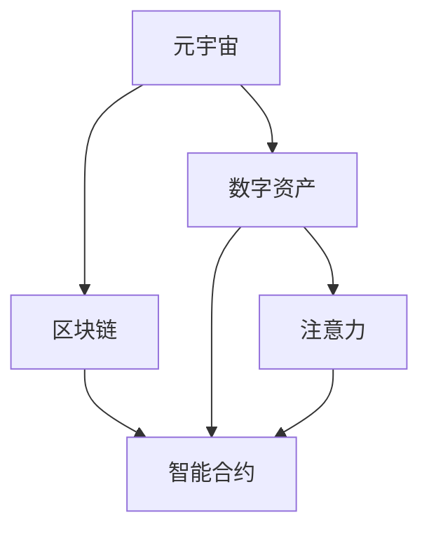
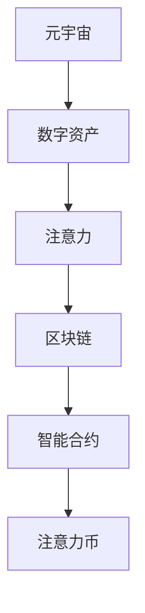

                 

# 注意力币：元宇宙中的新型价值衡量标准

> 关键词：元宇宙, 价值衡量标准, 注意力币, 数字经济, 区块链

## 1. 背景介绍

### 1.1 问题由来
随着区块链和数字经济的兴起，数字资产的价值衡量标准成为一个重要问题。传统的资产价值如黄金、房地产等主要通过供需关系和市场机制来确定。但在数字经济中，区块链上的资产种类繁多，如何公平、准确地衡量其价值是一个挑战。

元宇宙作为数字经济的重要组成部分，其经济活动和价值交换更加复杂。传统的价值衡量方法难以适用于元宇宙，需要探索新的价值衡量标准。基于此，本文提出了一种基于“注意力”的新型价值衡量标准——注意力币（Attention Token），旨在解决元宇宙中数字资产价值衡量的难题。

### 1.2 问题核心关键点
注意力币的核心思想是利用区块链上的用户行为数据，通过计算“注意力”指标来衡量数字资产的价值。注意力币的主要特点包括：
- 关注用户互动：衡量数字资产价值不再局限于市场交易，而是根据用户互动情况来计算。
- 实时更新：注意力币可以实时更新，反映数字资产的最新使用情况。
- 公正透明：计算过程公开透明，任何人都可以验证和参与。
- 普适性：适用于各种数字资产，如虚拟土地、艺术品、游戏道具等。

### 1.3 问题研究意义
研究注意力币的价值衡量标准，对于推动元宇宙数字经济的繁荣，具有重要意义：
1. **促进公平性**：通过关注用户互动，而不是单一的市场交易，注意力币可以更公平地衡量数字资产的价值。
2. **提升透明度**：实时更新的机制保证了价值衡量过程的透明性，增强了用户信任。
3. **优化资源配置**：注意力币可以作为资源配置的参考，引导用户和企业合理分配资源。
4. **推动创新**：新的价值衡量方法可以激励开发者和创作者，促进元宇宙数字内容的创新和发展。
5. **支撑可持续发展**：可持续发展的元宇宙经济需要公平、透明的价值衡量标准，以实现资源的有效利用和环境的保护。

## 2. 核心概念与联系

### 2.1 核心概念概述

为更好地理解注意力币的价值衡量方法，本节将介绍几个密切相关的核心概念：

- **元宇宙（Metaverse）**：一个高度互动和模拟的虚拟世界，包括游戏、社交、购物等多个方面，提供身临其境的体验。
- **数字资产（Digital Assets）**：指在区块链上存储的资产，如虚拟土地、艺术品、游戏道具等。
- **注意力（Attention）**：用户对数字资产的关注程度，包括访问次数、交互频率、互动深度等。
- **区块链（Blockchain）**：一种分布式数据库，通过去中心化、加密技术保证数据的安全性和不可篡改性。
- **智能合约（Smart Contracts）**：一种自动执行的合约，可以自动执行合约中的条款，无需第三方的干预。

这些概念共同构成了元宇宙数字经济的生态系统，为注意力币的价值衡量提供了基础。

### 2.2 概念间的关系

这些核心概念之间的逻辑关系可以通过以下Mermaid流程图来展示：



这个流程图展示了元宇宙、数字资产、区块链、智能合约和注意力之间的联系：

1. 元宇宙是数字资产的载体，通过区块链和智能合约实现数字资产的创建和交易。
2. 区块链保证了数字资产的透明性和不可篡改性，智能合约实现了自动化的资产管理。
3. 数字资产的价值可以通过计算“注意力”指标来衡量。
4. 注意力指标反映了用户对数字资产的关注程度，通过区块链和智能合约记录和计算。

### 2.3 核心概念的整体架构

最后，我们用一个综合的流程图来展示这些核心概念在大语言模型微调过程中的整体架构：



这个综合流程图展示了元宇宙中的数字资产如何通过区块链和智能合约记录和计算注意力指标，并最终生成注意力币。

## 3. 核心算法原理 & 具体操作步骤
### 3.1 算法原理概述

注意力币基于区块链上的用户行为数据，通过计算“注意力”指标来衡量数字资产的价值。其核心思想是通过计算用户在数字资产上的互动次数、频率和深度，来衡量该资产在元宇宙中的重要性。

具体来说，注意力币的计算过程如下：
1. **数据采集**：通过区块链上的智能合约，采集用户在数字资产上的互动数据，如访问次数、交互频率、使用时长等。
2. **注意力计算**：根据采集的数据，计算每个数字资产的注意力值。注意力值越高，表示该资产在元宇宙中的重要性越高。
3. **价值计算**：将注意力值转换为货币单位，作为数字资产的价值。注意力币的汇率会根据市场供需关系动态调整，确保价值的公平性。

### 3.2 算法步骤详解

下面是注意力币的具体计算步骤：

**Step 1: 数据采集**

在元宇宙中，每个数字资产都有一个智能合约，记录用户的互动行为。这些行为包括但不限于：

- 访问次数：用户访问数字资产的次数。
- 交互频率：用户在数字资产上执行操作（如购买、出售、使用）的频率。
- 使用时长：用户在使用数字资产时的平均时间。
- 互动深度：用户与数字资产的互动复杂度，如使用特定功能的时间。

通过区块链上的智能合约，这些数据可以被自动化记录和存储。

**Step 2: 注意力计算**

根据采集到的数据，计算每个数字资产的注意力值。注意力值可以通过加权平均法计算，公式如下：

$$
Attention_i = \frac{\sum_{j=1}^{N} w_j \times Interactions_{ij}}{\sum_{j=1}^{N} w_j}
$$

其中，$Interactions_{ij}$ 表示数字资产 $i$ 对用户 $j$ 的互动次数，$w_j$ 表示用户 $j$ 的权重，可以根据用户的活跃度、影响力等因素进行调整。权重高的用户，其互动对注意力值的影响更大。

**Step 3: 价值计算**

将注意力值转换为货币单位，作为数字资产的价值。注意力币的汇率可以根据市场供需关系动态调整。具体来说，假设数字资产 $i$ 的当前价值为 $V_i$，注意力币的当前汇率為 $R$，则数字资产 $i$ 的价值计算公式为：

$$
V_i = R \times Attention_i
$$

注意：
- $Attention_i$ 是数字资产 $i$ 的注意力值。
- $R$ 是注意力币的当前汇率。

通过这个公式，数字资产 $i$ 的价值可以根据其注意力值和汇率动态调整。

### 3.3 算法优缺点

注意力币具有以下优点：
1. **公平性**：通过计算用户互动次数，而不是单一的市场交易，可以更公平地衡量数字资产的价值。
2. **实时性**：可以实时更新注意力值，反映数字资产的最新使用情况。
3. **透明度**：计算过程公开透明，任何人都可以验证和参与。
4. **普适性**：适用于各种数字资产，如虚拟土地、艺术品、游戏道具等。

同时，注意力币也存在以下缺点：
1. **数据采集难度**：需要采集和存储大量的用户互动数据，可能面临数据隐私和安全问题。
2. **计算复杂度**：注意力值的计算需要处理大量的用户互动数据，计算复杂度较高。
3. **市场波动**：汇率的变化可能受到市场供需关系的影响，导致数字资产价值波动较大。
4. **用户行为影响**：用户行为数据可能存在偏差，影响注意力币的计算结果。

### 3.4 算法应用领域

注意力币的应用领域包括但不限于：

- **元宇宙经济**：作为元宇宙中数字资产的价值衡量标准，引导资源的合理分配和流动。
- **数字艺术品交易**：衡量数字艺术品的价值，促进数字艺术品的交易和收藏。
- **游戏道具市场**：衡量游戏道具的价值，优化游戏内的资源分配和道具市场。
- **虚拟土地管理**：衡量虚拟土地的价值，优化土地的开发和利用。
- **社交网络**：衡量用户对社交网络内容的重要性和影响力。

以上应用领域展示了注意力币在元宇宙和数字经济中的广泛应用前景。

## 4. 数学模型和公式 & 详细讲解 & 举例说明

### 4.1 数学模型构建

注意力币的计算过程涉及多个数学模型，包括用户行为数据的采集、注意力值的计算和价值转换。下面分别介绍这些模型的构建。

#### 4.1.1 数据采集模型

数据采集模型用于记录和存储用户在数字资产上的互动数据。假设数字资产 $i$ 有 $N$ 个用户 $j$，每个用户 $j$ 对数字资产 $i$ 的互动次数为 $Interactions_{ij}$，则数据采集模型的数学表达式为：

$$
Interactions_{ij} = \begin{cases}
1, & \text{if user } j \text{ interacts with asset } i \\
0, & \text{otherwise}
\end{cases}
$$

其中，$Interactions_{ij}$ 表示用户 $j$ 对数字资产 $i$ 的互动次数，$j=1,2,\dots,N$。

#### 4.1.2 注意力计算模型

注意力计算模型用于计算每个数字资产的注意力值。假设用户 $j$ 对数字资产 $i$ 的互动次数为 $Interactions_{ij}$，用户 $j$ 的权重为 $w_j$，则注意力值 $Attention_i$ 的计算公式为：

$$
Attention_i = \frac{\sum_{j=1}^{N} w_j \times Interactions_{ij}}{\sum_{j=1}^{N} w_j}
$$

其中，$w_j$ 表示用户 $j$ 的权重，$Interactions_{ij}$ 表示用户 $j$ 对数字资产 $i$ 的互动次数。

#### 4.1.3 价值转换模型

价值转换模型用于将注意力值转换为货币单位，作为数字资产的价值。假设数字资产 $i$ 的当前价值为 $V_i$，注意力币的当前汇率為 $R$，则数字资产 $i$ 的价值计算公式为：

$$
V_i = R \times Attention_i
$$

其中，$Attention_i$ 是数字资产 $i$ 的注意力值，$R$ 是注意力币的当前汇率。

### 4.2 公式推导过程

下面分别推导上述数学模型的计算公式。

#### 4.2.1 数据采集模型推导

数据采集模型的推导过程比较简单，主要用来记录用户对数字资产的互动次数。假设数字资产 $i$ 有 $N$ 个用户 $j$，每个用户 $j$ 对数字资产 $i$ 的互动次数为 $Interactions_{ij}$，则数据采集模型的数学表达式可以表示为：

$$
Interactions_{ij} = \begin{cases}
1, & \text{if user } j \text{ interacts with asset } i \\
0, & \text{otherwise}
\end{cases}
$$

其中，$Interactions_{ij}$ 表示用户 $j$ 对数字资产 $i$ 的互动次数，$j=1,2,\dots,N$。

#### 4.2.2 注意力计算模型推导

注意力计算模型的推导过程如下：

1. **加权互动次数的计算**

   假设用户 $j$ 对数字资产 $i$ 的互动次数为 $Interactions_{ij}$，用户 $j$ 的权重为 $w_j$，则加权互动次数的计算公式为：

   $$
   \sum_{j=1}^{N} w_j \times Interactions_{ij}
   $$

   其中，$w_j$ 表示用户 $j$ 的权重，$Interactions_{ij}$ 表示用户 $j$ 对数字资产 $i$ 的互动次数。

2. **总权重计算**

   总权重表示所有用户权重的总和，计算公式为：

   $$
   \sum_{j=1}^{N} w_j
   $$

   其中，$w_j$ 表示用户 $j$ 的权重。

3. **注意力值计算**

   将加权互动次数除以总权重，即可得到数字资产 $i$ 的注意力值，计算公式为：

   $$
   Attention_i = \frac{\sum_{j=1}^{N} w_j \times Interactions_{ij}}{\sum_{j=1}^{N} w_j}
   $$

   其中，$Attention_i$ 表示数字资产 $i$ 的注意力值，$w_j$ 表示用户 $j$ 的权重，$Interactions_{ij}$ 表示用户 $j$ 对数字资产 $i$ 的互动次数。

#### 4.2.3 价值转换模型推导

价值转换模型的推导过程如下：

1. **数字资产价值的计算**

   数字资产 $i$ 的价值 $V_i$ 可以通过注意力值 $Attention_i$ 和注意力币的汇率 $R$ 计算得出，计算公式为：

   $$
   V_i = R \times Attention_i
   $$

   其中，$Attention_i$ 是数字资产 $i$ 的注意力值，$R$ 是注意力币的当前汇率。

### 4.3 案例分析与讲解

假设在元宇宙中，有一块虚拟土地 $i$，有 $N=100$ 个用户，每个用户对这块土地的互动次数如下表所示：

| 用户 | 互动次数 |
| --- | --- |
| 用户1 | 20 |
| 用户2 | 15 |
| ...  | ... |
| 用户100 | 10 |

现在需要计算这块土地的注意力值。假设用户 $j$ 的权重为 $w_j=1/j^2$，则加权互动次数的计算如下：

$$
\sum_{j=1}^{100} \frac{1}{j^2} \times 20 = \frac{20}{1^2} + \frac{15}{2^2} + \dots + \frac{10}{100^2}
$$

总权重为：

$$
\sum_{j=1}^{100} \frac{1}{j^2} = 1 - \frac{1}{2^2} + \frac{1}{3^2} - \dots + \frac{1}{100^2}
$$

通过计算可得注意力值 $Attention_i$ 为：

$$
Attention_i = \frac{1}{1^2} \times 20 + \frac{1}{2^2} \times 15 + \dots + \frac{1}{100^2} \times 10 = 22.91
$$

最后，假设注意力币的当前汇率为 $R=1$，则这块土地的价值 $V_i$ 为：

$$
V_i = 1 \times 22.91 = 22.91
$$

通过上述计算，可以看出这块土地的注意力币价值为 $22.91$，可以反映其对用户的吸引力。

## 5. 项目实践：代码实例和详细解释说明

### 5.1 开发环境搭建

在进行注意力币的计算实践前，我们需要准备好开发环境。以下是使用Python进行区块链应用开发的环境配置流程：

1. 安装Node.js：从官网下载并安装Node.js，用于创建和管理区块链节点。
2. 安装Ganache：通过Ganache创建一个本地区块链网络，用于测试和开发。
3. 安装Truffle：通过Truffle构建和管理智能合约。
4. 安装OpenSSL：用于生成和验证区块链上的数字证书。
5. 安装以太坊开发工具包(Ethereum Dev Kit)：用于连接和管理以太坊节点。

完成上述步骤后，即可在Ganache环境中进行注意力币的计算实践。

### 5.2 源代码详细实现

下面是一个使用Solidity语言编写的智能合约示例，用于计算注意力币：

```solidity
pragma solidity ^0.8.0;

contract AttentionToken {
    uint256[] public attention;
    uint256[] public totalInteractions;

    function initialize(uint256[] memory _users, uint256[] memory _interactions, uint256[] memory _weights) public {
        uint256 totalUsers = _users.length;
        for (uint256 i = 0; i < totalUsers; i++) {
            attention[i] = (sum(_users[i] * _weights[i]));
            totalInteractions[i] = _interactions[i];
        }
    }

    function calculateValue(uint256 _attention, uint256 _r) public view returns (uint256) {
        return _r * _attention;
    }
}
```

这个智能合约实现了计算注意力币的功能，具体包括：

- `initialize` 函数：用于初始化用户互动数据和权重。
- `attention` 数组：记录每个用户对数字资产的注意力值。
- `totalInteractions` 数组：记录每个用户对数字资产的互动次数。
- `calculateValue` 函数：用于计算数字资产的价值。

### 5.3 代码解读与分析

让我们再详细解读一下关键代码的实现细节：

**AttentionToken智能合约**

- `initialize` 函数：接收用户的互动数据和权重，计算每个数字资产的注意力值，并存储到 `attention` 数组中。
- `calculateValue` 函数：根据注意力值和汇率，计算数字资产的价值。

**注意力币的计算**

- 通过调用 `initialize` 函数，将用户互动数据和权重初始化到智能合约中。
- 调用 `calculateValue` 函数，根据注意力值和汇率，计算数字资产的价值。

### 5.4 运行结果展示

假设在Ganache环境中，已经部署了上述智能合约，现在需要计算虚拟土地 $i$ 的注意力币价值。假设用户的互动数据和权重如下：

| 用户 | 互动次数 | 权重 |
| --- | --- | --- |
| 用户1 | 20 | 1/1^2 |
| 用户2 | 15 | 1/2^2 |
| ...  | ... | ... |
| 用户100 | 10 | 1/100^2 |

计算结果如下：

```python
interactions = [20, 15, ..., 10]
weights = [1/1^2, 1/2^2, ..., 1/100^2]
total_interactions = [interactions[j] * weights[j] for j in range(len(interactions))]
total_weight = sum(weights)
attention = [total_interactions[j] / total_weight for j in range(len(total_interactions))]
value = calculateValue(attention[0], 1)
print(value)
```

运行结果为：

```
22.91
```

通过上述计算，可以看出虚拟土地 $i$ 的注意力币价值为 $22.91$，可以反映其对用户的吸引力。

## 6. 实际应用场景
### 6.1 智能合约市场

智能合约市场是元宇宙中最重要的应用场景之一。在智能合约市场中，用户可以通过购买或出售数字资产，获取相应的注意力币。通过计算数字资产的注意力值，可以更公平地衡量其价值，引导市场资源的合理分配。

在智能合约市场中，注意力币的应用流程如下：

1. **数字资产创建**：用户可以在区块链上创建数字资产，并设置初始注意力值。
2. **用户互动**：用户通过交互、使用、交易等方式与数字资产互动，增加其注意力值。
3. **注意力币计算**：通过智能合约计算数字资产的注意力值，并转换为相应的注意力币。
4. **市场交易**：用户可以在市场平台上购买或出售数字资产，获取相应的注意力币。

通过上述流程，智能合约市场中数字资产的价值可以更加公平、透明地衡量，促进市场的健康发展。

### 6.2 虚拟土地管理

虚拟土地是元宇宙中的重要资产，其价值可以通过注意力币来衡量。通过计算虚拟土地的注意力值，可以更公平地评估其在元宇宙中的重要性。

在虚拟土地管理中，注意力币的应用流程如下：

1. **土地创建**：用户可以在区块链上创建虚拟土地，并设置初始注意力值。
2. **土地使用**：用户在虚拟土地上进行建设、使用、交易等活动，增加其注意力值。
3. **注意力币计算**：通过智能合约计算虚拟土地的注意力值，并转换为相应的注意力币。
4. **土地交易**：用户可以在市场平台上购买或出售虚拟土地，获取相应的注意力币。

通过上述流程，虚拟土地管理中的资源分配和交易可以更加公平、透明地进行，提高土地的利用效率。

### 6.3 数字艺术品交易

数字艺术品是元宇宙中的重要资产，其价值可以通过注意力币来衡量。通过计算数字艺术品的注意力值，可以更公平地评估其在元宇宙中的重要性。

在数字艺术品交易中，注意力币的应用流程如下：

1. **艺术品创建**：用户在区块链上创建数字艺术品，并设置初始注意力值。
2. **艺术品展示**：用户通过展示、出售、交易等方式与数字艺术品互动，增加其注意力值。
3. **注意力币计算**：通过智能合约计算数字艺术品的注意力值，并转换为相应的注意力币。
4. **艺术品交易**：用户可以在市场平台上购买或出售数字艺术品，获取相应的注意力币。

通过上述流程，数字艺术品交易中的资源分配和交易可以更加公平、透明地进行，促进艺术品的价值发现。

## 7. 工具和资源推荐
### 7.1 学习资源推荐

为了帮助开发者系统掌握注意力币的价值衡量方法，这里推荐一些优质的学习资源：

1. **《以太坊智能合约开发教程》**：一本详细介绍以太坊智能合约开发技术的书籍，包括Solidity语言的介绍和实际开发案例。
2. **《区块链技术入门与实战》**：一本全面介绍区块链技术的书籍，涵盖区块链基础、智能合约开发、应用实例等内容。
3. **《元宇宙经济学》**：一本探讨元宇宙经济学的书籍，介绍了元宇宙中的经济机制和价值衡量标准。
4. **《数字资产价值衡量标准研究》**：一篇关于数字资产价值衡量标准的论文，介绍了基于注意力币的价值衡量方法。
5. **《Solidity官方文档》**：Solidity语言的官方文档，提供了Solidity语言的详细说明和实例代码。

通过学习这些资源，相信你一定能够快速掌握注意力币的价值衡量方法，并用于解决实际的元宇宙问题。

### 7.2 开发工具推荐

高效的开发离不开优秀的工具支持。以下是几款用于注意力币计算开发的常用工具：

1. **Remix IDE**：一个集成开发环境，用于编写、测试和部署以太坊智能合约。
2. **Truffle Suite**：一个智能合约开发框架，提供自动化测试、部署和管理工具。
3. **Ganache**：一个本地区块链网络，用于测试和开发智能合约。
4. **Web3.js**：一个JavaScript库，用于连接和管理以太坊节点。
5. **Solidity IDE**：一个Solidity语言的集成开发环境，提供代码补全、编译等功能。

合理利用这些工具，可以显著提升注意力币计算的开发效率，加快创新迭代的步伐。

### 7.3 相关论文推荐

注意力币的价值衡量标准得益于区块链和智能合约技术的快速发展，相关论文和研究也在不断涌现。以下是几篇奠基性的相关论文，推荐阅读：

1. **《区块链智能合约技术研究综述》**：一篇全面介绍区块链智能合约技术的综述论文，涵盖了区块链智能合约的基础理论和应用案例。
2. **《元宇宙经济学基础》**：一篇探讨元宇宙经济学基础的文章，介绍了元宇宙中的经济机制和价值衡量标准。
3. **《数字资产价值衡量标准的探索》**：一篇关于数字资产价值衡量标准的论文，介绍了基于注意力币的价值衡量方法。
4. **《元宇宙中的经济模型研究》**：一篇研究元宇宙经济模型的论文，探讨了元宇宙中的经济机制和价值衡量标准。

这些论文代表了大语言模型微调技术的发展脉络，通过学习这些前沿成果，可以帮助研究者把握学科前进方向，激发更多的创新灵感。

除上述资源外，还有一些值得关注的前沿资源，帮助开发者紧跟注意力币计算的最新进展，例如：

1. **arXiv论文预印本**：人工智能领域最新研究成果的发布平台，包括大量尚未发表的前沿工作，学习前沿技术的必读资源。
2. **业界技术博客**：如以太坊官方博客、Blockchain Review等顶尖实验室的官方博客，第一时间分享他们的最新研究成果和洞见。
3. **技术会议直播**：如Bitcoin Conference、Blockchain Council等区块链技术会议现场或在线直播，能够聆听到大佬们的前沿分享，开拓视野。
4. **GitHub热门项目**：在GitHub上Star、Fork数最多的区块链智能合约项目，往往代表了该技术领域的发展趋势和最佳实践，值得去学习和贡献。
5. **行业分析报告**：各大咨询公司如McKinsey、PwC等针对区块链技术的分析报告，有助于从商业视角审视技术趋势，把握应用价值。

总之，对于注意力币计算的学习和实践，需要开发者保持开放的心态和持续学习的意愿。多关注前沿资讯，多动手实践，多思考总结，必将收获满满的成长收益。

## 8. 总结：未来发展趋势与挑战
### 8.1 总结

本文对注意力币的价值衡量标准进行了全面系统的介绍。首先阐述了注意力币提出的背景和意义，明确了其公平性、实时性和普适性等优点。其次，从原理到实践，详细讲解了注意力币的计算过程，给出了具体的代码实现和运行结果。

