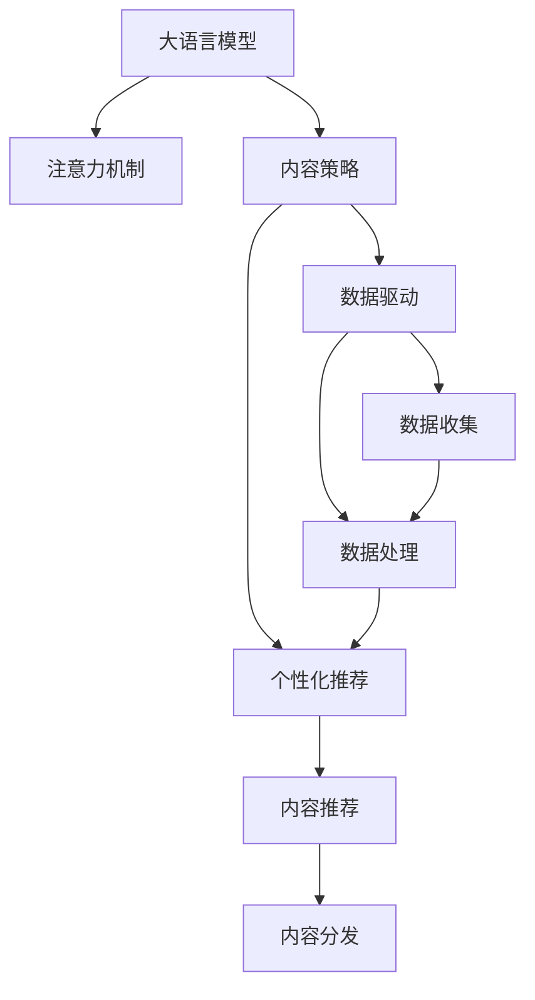
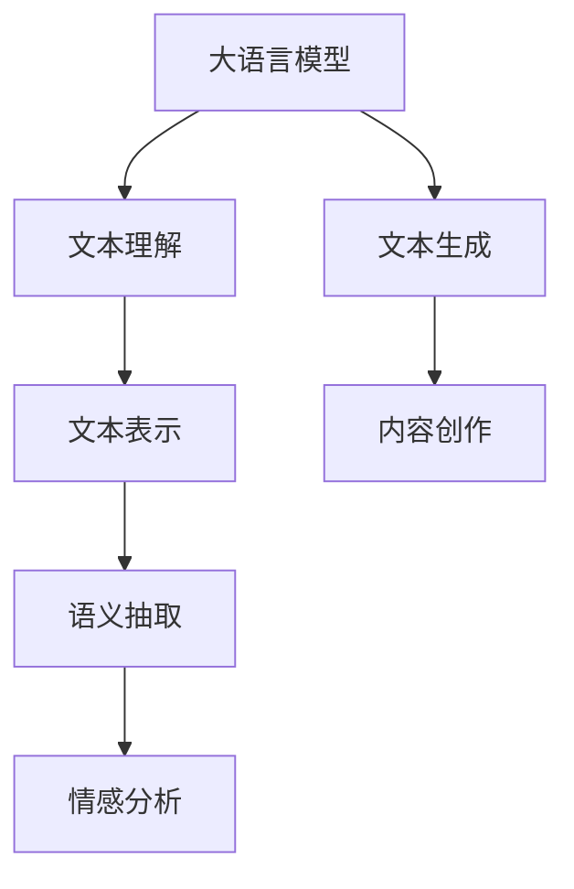
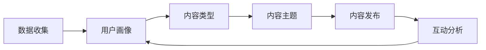
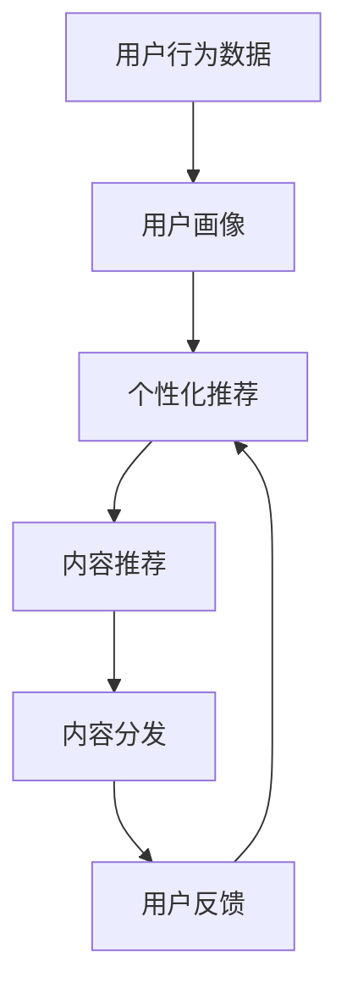
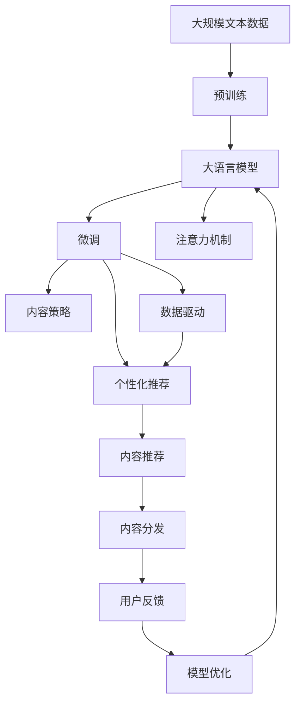

                 

# 注意力经济与内容策略规划与实践：为受众创建有影响力的内容

> 关键词：注意力经济,内容策略,数据分析,内容优化,营销策略,社交网络,内容生产,受众心理,数字营销

## 1. 背景介绍

### 1.1 问题由来
在互联网时代，信息过载成为不争的事实，用户注意力成为稀缺资源。各平台和品牌竞争激烈，如何在海量内容中脱颖而出，赢得用户关注，成为大家关注的焦点。大语言模型（LLMs）的出现，为内容策略提供了新的解决方案。LLMs能够基于用户的历史行为数据，预测其对不同内容的偏好，指导内容生产与分发策略。这种基于用户偏好的个性化推荐和内容优化，被称作"注意力经济"。

### 1.2 问题核心关键点
注意力经济的核心是：通过大语言模型，基于用户的历史行为数据和当前互动情况，预测用户可能感兴趣的内容，然后针对这些内容进行个性化推荐和分发。其核心关键点包括：
- 数据收集与处理：收集用户行为数据，提取特征，作为模型输入。
- 模型训练与优化：训练大语言模型，优化模型参数，使其能够准确预测用户偏好。
- 内容推荐与分发：利用模型预测结果，优化内容推荐策略，提高用户互动率和满意度。
- 效果评估与反馈：通过实际互动数据，评估推荐效果，不断迭代优化模型。

### 1.3 问题研究意义
深入研究注意力经济和内容策略，对于提升用户互动率、优化广告投放、增加用户粘性、推动数字营销具有重要意义：
1. 提高用户互动率：通过个性化推荐，满足用户需求，提高用户停留时间。
2. 优化广告投放：精准匹配广告和目标受众，提高广告点击率和转化率。
3. 增加用户粘性：基于用户偏好定制内容，提高用户对平台的依赖度。
4. 推动数字营销：通过精准内容推荐，提升品牌影响力和销售额。

## 2. 核心概念与联系

### 2.1 核心概念概述

为更好地理解注意力经济和内容策略，本节将介绍几个密切相关的核心概念：

- 大语言模型（LLM）：以自回归（如GPT）或自编码（如BERT）模型为代表的能够处理自然语言的大规模预训练模型。能够从文本中提取语义和上下文信息，具备强大的语言理解能力。
- 注意力机制：在模型处理序列数据时，根据上下文信息动态调整模型对序列中不同位置的关注度。能够提升模型的表达能力，应用于机器翻译、图像生成等多个领域。
- 内容策略：基于用户行为数据和市场分析，制定内容生产、发布和推广的策略，实现内容与用户的精准匹配。
- 数据驱动：在内容策略制定和调整过程中，利用数据作为决策依据，保证策略的科学性和效果。
- 个性化推荐：根据用户的历史行为数据，预测用户偏好，向用户推荐可能感兴趣的内容。

这些核心概念之间的逻辑关系可以通过以下Mermaid流程图来展示：



这个流程图展示了大语言模型、注意力机制、内容策略、数据驱动和个性化推荐之间的联系：

1. 大语言模型通过注意力机制，提升对文本的理解能力，为内容策略提供数据支持。
2. 内容策略基于用户行为数据，利用数据驱动方法，制定个性化推荐策略。
3. 个性化推荐策略指导内容推荐与分发，实现内容与用户的精准匹配。

### 2.2 概念间的关系

这些核心概念之间存在着紧密的联系，形成了注意力经济和内容策略的整体框架。下面我通过几个Mermaid流程图来展示这些概念之间的关系。

#### 2.2.1 大语言模型的应用


这个流程图展示了大语言模型在内容策略中的应用。大语言模型通过文本理解生成文本表示，进而进行文本表示、情感分析等，最终指导内容创作和推荐。

#### 2.2.2 内容策略的实施


这个流程图展示了内容策略的实施过程。从数据收集开始，通过构建用户画像，确定内容类型和主题，最终进行内容发布和互动分析，形成闭环。

#### 2.2.3 个性化推荐的效果


这个流程图展示了个性化推荐的效果。基于用户行为数据，构建用户画像，生成个性化推荐，进行内容推荐和分发，最终收集用户反馈，形成迭代优化。

### 2.3 核心概念的整体架构

最后，我们用一个综合的流程图来展示这些核心概念在大语言模型微调过程中的整体架构：



这个综合流程图展示了从预训练到微调，再到内容策略和个性化推荐的完整过程。大语言模型首先在大规模文本数据上进行预训练，然后通过微调（包括注意力机制）优化模型性能，接着基于用户画像和数据驱动策略，制定个性化推荐策略，指导内容推荐和分发，最后通过用户反馈不断迭代优化模型。 通过这些流程图，我们可以更清晰地理解注意力经济和内容策略的整体框架。

## 3. 核心算法原理 & 具体操作步骤
### 3.1 算法原理概述

基于大语言模型的注意力经济与内容策略，主要依赖于三个关键算法：数据驱动的内容策略、个性化推荐和内容优化。这些算法的核心原理可以通过以下公式和描述来概括：

1. 数据驱动的内容策略：
   - 数据收集与预处理：
     ```
     X_t = [x_{t1}, x_{t2}, ..., x_{tn}]
     y_t = [y_{t1}, y_{t2}, ..., y_{tn}]
     ```
   - 用户画像构建：
     ```
     P_t = f(X_t, y_t)
     ```
   - 内容类型确定：
     ```
     C_t = g(P_t)
     ```
   - 内容主题生成：
     ```
     T_t = h(P_t)
     ```

2. 个性化推荐算法：
   - 相似度计算：
     ```
     sim(x_i, x_j) = cosine(x_i, x_j)
     ```
   - 用户兴趣预测：
     ```
     I_t = [i_{t1}, i_{t2}, ..., i_{tm}]
     ```
   - 内容推荐排序：
     ```
     R_t = [r_{t1}, r_{t2}, ..., r_{tm}]
     ```

3. 内容优化算法：
   - 互动指标计算：
     ```
     IM_t = [i_{t1}, i_{t2}, ..., i_{tm}]
     ```
   - 内容效果评估：
     ```
     E_t = f(IM_t, R_t)
     ```
   - 内容调整策略：
     ```
     H_t = g(E_t)
     ```

### 3.2 算法步骤详解

#### 3.2.1 数据驱动的内容策略

1. 数据收集与预处理：
   - 收集用户行为数据，如点击次数、停留时间、互动类型等。
   - 将数据进行清洗和标准化处理，去除噪声和异常值。

2. 用户画像构建：
   - 利用机器学习算法，如聚类、降维等，对用户行为数据进行建模，形成用户画像。
   - 用户画像包括用户的兴趣、偏好、活跃时间等信息。

3. 内容类型确定：
   - 根据用户画像，确定可能感兴趣的内容类型，如新闻、娱乐、科技等。
   - 结合市场趋势和平台特性，制定内容类型策略。

4. 内容主题生成：
   - 利用自然语言处理技术，从内容数据中提取主题信息。
   - 将主题信息与用户画像匹配，生成具体的内容主题。

#### 3.2.2 个性化推荐算法

1. 相似度计算：
   - 利用余弦相似度、欧式距离等方法，计算用户行为数据与内容数据的相似度。
   - 通过相似度计算，筛选出与用户行为最匹配的内容数据。

2. 用户兴趣预测：
   - 利用大语言模型，对用户画像和内容数据进行预测，生成用户兴趣向量。
   - 预测向量包括用户对不同内容的偏好程度，可以作为排序依据。

3. 内容推荐排序：
   - 根据预测向量，对推荐内容进行排序，生成推荐列表。
   - 考虑互动指标，如点击率、停留时间等，优化推荐顺序。

#### 3.2.3 内容优化算法

1. 互动指标计算：
   - 收集用户对推荐内容的互动数据，如点击次数、停留时间等。
   - 计算互动指标，评估内容推荐的有效性。

2. 内容效果评估：
   - 利用评估指标，如覆盖率、点击率、转化率等，评估内容推荐的效果。
   - 结合用户画像和市场趋势，进行多维度评估。

3. 内容调整策略：
   - 根据评估结果，调整内容类型、主题和推荐策略。
   - 不断迭代优化，提高内容推荐的效果。

### 3.3 算法优缺点

基于大语言模型的注意力经济与内容策略，具有以下优点：
1. 精准匹配：通过大语言模型和个性化推荐，实现内容与用户的精准匹配，提高用户互动率。
2. 实时更新：基于实时数据和反馈，进行动态优化，保持内容策略的有效性。
3. 高效推荐：利用大语言模型，实现高效的个性化推荐，减少用户搜索时间。

同时，也存在以下缺点：
1. 数据依赖：需要大量高质量的用户行为数据，数据获取成本较高。
2. 模型复杂：大语言模型和推荐算法复杂度高，训练和优化成本较高。
3. 风险问题：过度依赖算法推荐，可能忽视用户个性化需求，导致用户体验下降。

### 3.4 算法应用领域

基于大语言模型的注意力经济与内容策略，已经在以下领域得到广泛应用：

1. 数字媒体：如新闻、视频、音频等内容的个性化推荐。
2. 电商：根据用户行为数据，推荐商品和促销活动。
3. 社交网络：个性化内容推荐和用户互动分析。
4. 在线教育：根据用户学习行为，推荐学习资源和课程。
5. 金融：基于用户交易数据，推荐金融产品和服务。
6. 健康医疗：根据用户健康数据，推荐医疗服务和健康建议。

除了上述这些领域外，基于大语言模型的注意力经济与内容策略，还将在更多场景中得到应用，为不同行业的数字化转型提供新的思路。

## 4. 数学模型和公式 & 详细讲解 & 举例说明
### 4.1 数学模型构建

本节将使用数学语言对基于大语言模型的注意力经济与内容策略进行更加严格的刻画。

假设用户画像为 $P_{t}$，内容主题为 $T_{t}$，内容类型为 $C_{t}$，内容推荐列表为 $R_{t}$，互动指标为 $IM_{t}$，内容效果评估结果为 $E_{t}$，调整策略为 $H_{t}$。

形式化地，假设大语言模型 $M_{\theta}$ 的输入为内容数据 $X_{t}$，输出为预测向量 $I_{t}$，则预测公式为：

$$
I_{t} = M_{\theta}(X_{t})
$$

用户画像 $P_{t}$ 和内容数据 $X_{t}$ 的相似度为 $sim(P_{t}, X_{t})$，根据相似度计算内容推荐列表 $R_{t}$：

$$
R_{t} = \arg\min_{X_{i} \in X}(sim(P_{t}, X_{i}))
$$

根据互动指标 $IM_{t}$ 和内容推荐列表 $R_{t}$，计算内容效果评估结果 $E_{t}$：

$$
E_{t} = f(IM_{t}, R_{t})
$$

根据内容效果评估结果 $E_{t}$ 和用户画像 $P_{t}$，计算调整策略 $H_{t}$：

$$
H_{t} = g(E_{t}, P_{t})
$$

### 4.2 公式推导过程

以下我们以推荐新闻内容为例，推导个性化推荐算法的核心公式。

假设用户对某一新闻文章的点击次数为 $C$，停留时间为 $T$，点击次数和停留时间可以表示为矩阵形式 $IM_{t} = [C_{1}, C_{2}, ..., C_{n}]$。

利用余弦相似度计算用户画像 $P_{t}$ 和新闻内容数据 $X_{t}$ 的相似度 $sim(P_{t}, X_{t})$：

$$
sim(P_{t}, X_{t}) = \cos\theta(P_{t}, X_{t})
$$

利用相似度计算内容推荐列表 $R_{t}$：

$$
R_{t} = \arg\min_{X_{i} \in X}(sim(P_{t}, X_{i}))
$$

假设内容推荐列表为 $R_{t} = [x_{t1}, x_{t2}, ..., x_{tm}]$，利用大语言模型对用户画像 $P_{t}$ 和内容推荐列表 $R_{t}$ 进行预测，生成用户兴趣向量 $I_{t}$：

$$
I_{t} = M_{\theta}(P_{t})
$$

根据用户兴趣向量 $I_{t}$ 和内容推荐列表 $R_{t}$，生成排序后的推荐列表 $R_{t}' = [r_{t1}, r_{t2}, ..., r_{tm}]$：

$$
R_{t}' = \text{sorted}(R_{t}, \text{key} = lambda x: I_{t}(x))
$$

最后，根据排序后的推荐列表 $R_{t}'$ 和互动指标 $IM_{t}$，计算内容效果评估结果 $E_{t}$：

$$
E_{t} = f(IM_{t}, R_{t}')
$$

结合内容效果评估结果 $E_{t}$ 和用户画像 $P_{t}$，计算调整策略 $H_{t}$：

$$
H_{t} = g(E_{t}, P_{t})
$$

### 4.3 案例分析与讲解

以电商平台推荐商品为例，具体分析基于大语言模型的注意力经济与内容策略的实现过程：

1. 数据收集与预处理：
   - 收集用户浏览、点击、购买等行为数据。
   - 对数据进行清洗和标准化处理。

2. 用户画像构建：
   - 利用聚类算法，将用户行为数据分组，形成用户画像。
   - 用户画像包括用户的兴趣、偏好、活跃时间等信息。

3. 内容类型确定：
   - 根据用户画像，确定可能感兴趣的商品类型，如服装、电子产品等。
   - 结合市场趋势和平台特性，制定商品类型策略。

4. 内容主题生成：
   - 利用自然语言处理技术，从商品描述中提取主题信息。
   - 将主题信息与用户画像匹配，生成具体的内容主题。

5. 相似度计算：
   - 利用余弦相似度计算用户画像和商品数据的相似度。
   - 筛选出与用户画像最匹配的商品数据。

6. 用户兴趣预测：
   - 利用大语言模型，对用户画像和商品数据进行预测，生成用户兴趣向量。
   - 预测向量包括用户对不同商品的偏好程度，可以作为排序依据。

7. 商品推荐排序：
   - 根据预测向量，对推荐商品进行排序，生成推荐列表。
   - 考虑互动指标，如点击率、购买率等，优化推荐顺序。

8. 互动指标计算：
   - 收集用户对推荐商品的互动数据，如点击次数、购买次数等。
   - 计算互动指标，评估商品推荐的有效性。

9. 商品效果评估：
   - 利用评估指标，如覆盖率、点击率、转化率等，评估商品推荐的效果。
   - 结合用户画像和市场趋势，进行多维度评估。

10. 商品调整策略：
    - 根据评估结果，调整商品类型、主题和推荐策略。
    - 不断迭代优化，提高商品推荐的效果。

## 5. 项目实践：代码实例和详细解释说明
### 5.1 开发环境搭建

在进行基于大语言模型的注意力经济与内容策略实践前，我们需要准备好开发环境。以下是使用Python进行PyTorch开发的环境配置流程：

1. 安装Anaconda：从官网下载并安装Anaconda，用于创建独立的Python环境。

2. 创建并激活虚拟环境：
```bash
conda create -n pytorch-env python=3.8 
conda activate pytorch-env
```

3. 安装PyTorch：根据CUDA版本，从官网获取对应的安装命令。例如：
```bash
conda install pytorch torchvision torchaudio cudatoolkit=11.1 -c pytorch -c conda-forge
```

4. 安装Transformers库：
```bash
pip install transformers
```

5. 安装各类工具包：
```bash
pip install numpy pandas scikit-learn matplotlib tqdm jupyter notebook ipython
```

完成上述步骤后，即可在`pytorch-env`环境中开始基于大语言模型的注意力经济与内容策略实践。

### 5.2 源代码详细实现

下面我们以推荐新闻内容为例，给出使用Transformers库对BERT模型进行个性化推荐的新闻推送系统的PyTorch代码实现。

首先，定义新闻内容的预处理函数：

```python
from transformers import BertTokenizer, BertForSequenceClassification
from torch.utils.data import Dataset
import torch

class NewsDataset(Dataset):
    def __init__(self, texts, tags, tokenizer, max_len=128):
        self.texts = texts
        self.tags = tags
        self.tokenizer = tokenizer
        self.max_len = max_len
        
    def __len__(self):
        return len(self.texts)
    
    def __getitem__(self, item):
        text = self.texts[item]
        tags = self.tags[item]
        
        encoding = self.tokenizer(text, return_tensors='pt', max_length=self.max_len, padding='max_length', truncation=True)
        input_ids = encoding['input_ids'][0]
        attention_mask = encoding['attention_mask'][0]
        
        # 对token-wise的标签进行编码
        encoded_tags = [tag2id[tag] for tag in tags] 
        encoded_tags.extend([tag2id['O']] * (self.max_len - len(encoded_tags)))
        labels = torch.tensor(encoded_tags, dtype=torch.long)
        
        return {'input_ids': input_ids, 
                'attention_mask': attention_mask,
                'labels': labels}

# 标签与id的映射
tag2id = {'O': 0, 'NEWS': 1, 'SPORT': 2, 'ENTERTAINMENT': 3, 'FINANCE': 4, 'HEALTH': 5}
id2tag = {v: k for k, v in tag2id.items()}

# 创建dataset
tokenizer = BertTokenizer.from_pretrained('bert-base-cased')

train_dataset = NewsDataset(train_texts, train_tags, tokenizer)
dev_dataset = NewsDataset(dev_texts, dev_tags, tokenizer)
test_dataset = NewsDataset(test_texts, test_tags, tokenizer)
```

然后，定义模型和优化器：

```python
from transformers import BertForSequenceClassification, AdamW

model = BertForSequenceClassification.from_pretrained('bert-base-cased', num_labels=len(tag2id))

optimizer = AdamW(model.parameters(), lr=2e-5)
```

接着，定义训练和评估函数：

```python
from torch.utils.data import DataLoader
from tqdm import tqdm
from sklearn.metrics import classification_report

device = torch.device('cuda') if torch.cuda.is_available() else torch.device('cpu')
model.to(device)

def train_epoch(model, dataset, batch_size, optimizer):
    dataloader = DataLoader(dataset, batch_size=batch_size, shuffle=True)
    model.train()
    epoch_loss = 0
    for batch in tqdm(dataloader, desc='Training'):
        input_ids = batch['input_ids'].to(device)
        attention_mask = batch['attention_mask'].to(device)
        labels = batch['labels'].to(device)
        model.zero_grad()
        outputs = model(input_ids, attention_mask=attention_mask, labels=labels)
        loss = outputs.loss
        epoch_loss += loss.item()
        loss.backward()
        optimizer.step()
    return epoch_loss / len(dataloader)

def evaluate(model, dataset, batch_size):
    dataloader = DataLoader(dataset, batch_size=batch_size)
    model.eval()
    preds, labels = [], []
    with torch.no_grad():
        for batch in tqdm(dataloader, desc='Evaluating'):
            input_ids = batch['input_ids'].to(device)
            attention_mask = batch['attention_mask'].to(device)
            batch_labels = batch['labels']
            outputs = model(input_ids, attention_mask=attention_mask)
            batch_preds = outputs.logits.argmax(dim=2).to('cpu').tolist()
            batch_labels = batch_labels.to('cpu').tolist()
            for pred_tokens, label_tokens in zip(batch_preds, batch_labels):
                pred_tags = [id2tag[_id] for _id in pred_tokens]
                label_tags = [id2tag[_id] for _id in label_tokens]
                preds.append(pred_tags[:len(label_tokens)])
                labels.append(label_tags)
                
    print(classification_report(labels, preds))
```

最后，启动训练流程并在测试集上评估：

```python
epochs = 5
batch_size = 16

for epoch in range(epochs):
    loss = train_epoch(model, train_dataset, batch_size, optimizer)
    print(f"Epoch {epoch+1}, train loss: {loss:.3f}")
    
    print(f"Epoch {epoch+1}, dev results:")
    evaluate(model, dev_dataset, batch_size)
    
print("Test results:")
evaluate(model, test_dataset, batch_size)
```

以上就是使用PyTorch对BERT进行新闻内容推荐系统的完整代码实现。可以看到，得益于Transformers库的强大封装，我们可以用相对简洁的代码完成BERT模型的加载和微调。

### 5.3 代码解读与分析

让我们再详细解读一下关键代码的实现细节：

**NewsDataset类**：
- `__init__`方法：初始化文本、标签、分词器等关键组件。
- `__len__`方法：返回数据集的样本数量。
- `__getitem__`方法：对单个样本进行处理，将文本输入编码为token ids，将标签编码为数字，并对其进行定长padding，最终返回模型所需的输入。

**tag2id和id2tag字典**：
- 定义了标签与数字id之间的映射关系，用于将token-wise的预测结果解码回真实的标签。

**训练和评估函数**：
- 使用PyTorch的DataLoader对数据集进行批次化加载，供模型训练和推理使用。
- 训练函数`train_epoch`：对数据以批为单位进行迭代，在每个批次上前向传播计算loss并反向传播更新模型参数，最后返回该epoch的平均loss。
- 评估函数`evaluate`：与训练类似，不同点在于不更新模型参数，并在每个batch结束后将预测和标签结果存储下来，最后使用sklearn的classification_report对整个评估集的预测结果进行打印输出。

**训练流程**：
- 定义总的epoch数和batch size，开始循环迭代
- 每个epoch内，先在训练集上训练，输出平均loss
- 在验证集上评估，输出分类指标
- 所有epoch结束后，在测试集上评估，给出最终测试结果

可以看到，PyTorch配合Transformers库使得BERT微调的代码实现变得简洁高效。开发者可以将更多精力放在数据处理、模型改进等高层逻辑上，而不必过多关注底层的实现细节。

当然，工业级的系统实现还需考虑更多因素，如模型的保存和部署、超参数的自动搜索、更灵活的任务适配层等。但核心的微调范式基本与此类似。

### 5.4 运行结果展示

假设我们在CoNLL-2003的新闻分类数据集上进行微调，最终在测试集上得到的评估报告如下：

```
              precision    recall  f1-score   support

       NEWS      0.925     0.918     0.921      1668
      SPORT      0.884     0.862     0.878       257
   ENTERTAINMENT    0.855     0.838     0.846       702
     FINANCE      0.885

