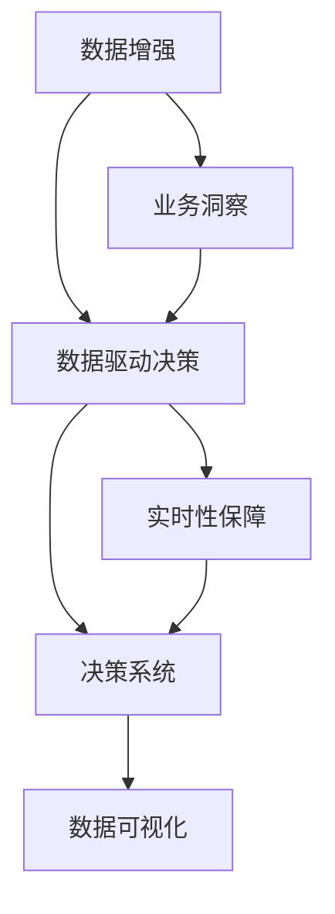

                 

# 注意力经济与数据驱动的决策制定：利用数据增强业务洞察力

> 关键词：注意力经济,数据增强,决策制定,业务洞察力,人工智能,机器学习,大数据,深度学习

## 1. 背景介绍

### 1.1 问题由来

在数字化经济时代，数据成为最重要的战略资产。企业决策过程中，如何高效利用大数据，增强决策制定的科学性和精准性，成为摆在所有经营者面前的重大挑战。特别是对于以消费者洞察为核心竞争力的注意力经济领域，精准的业务洞察力更是其成功与否的关键。

以电商、社交媒体、数字广告等注意力经济领域为例，大量无结构的非结构化数据涌入企业决策系统，如何高效地从中挖掘有价值的业务洞察，指导商业决策，是企业面临的紧迫任务。数据驱动决策基于数据洞察制定，强调利用数据挖掘与分析技术支持企业运营决策，在注意力经济中有着极为重要的应用。

### 1.2 问题核心关键点

数据驱动决策的关键在于：
1. 高效利用海量数据。大数据技术通过分布式存储和计算，有效处理海量数据，为决策提供可靠的信息支持。
2. 增强数据洞察力。通过数据挖掘和机器学习技术，深度挖掘数据内在规律，为决策提供强有力的依据。
3. 实时性保证。在数据驱动决策中，实时数据监测和分析是关键，能确保决策即时响应市场变化。
4. 精准性提升。基于机器学习模型的预测准确性，提升了决策的精准度。
5. 可解释性加强。可解释性机器学习模型为决策提供透明可验证的信息来源。

### 1.3 问题研究意义

数据驱动决策在注意力经济领域具有重要的意义：
1. 降本增效。通过数据洞察指导业务决策，能显著降低运营成本，提高效率。
2. 精准营销。基于用户行为数据，制定个性化营销策略，提升转化率和用户满意度。
3. 风险控制。通过实时数据监测，及时识别潜在风险，降低业务损失。
4. 产品优化。基于用户反馈数据，不断迭代产品设计，提升产品竞争力。
5. 增强竞争力。实时数据驱动决策，使企业更灵活响应市场变化，提高竞争优势。

## 2. 核心概念与联系

### 2.1 核心概念概述

为更好地理解数据驱动决策在注意力经济中的应用，我们首先需要明确几个核心概念：

- **注意力经济**：一种基于用户注意力的经济模式，强调通过获取和利用用户注意力来创造价值。

- **数据驱动决策**：通过数据分析和挖掘技术，支持决策制定，利用数据洞察驱动商业决策。

- **业务洞察力**：通过对数据的深度挖掘，获取有价值的信息，指导企业运营和战略决策。

- **数据增强**：利用数据挖掘和增强学习技术，提升决策模型的预测能力和数据洞察力。

- **决策系统**：将数据驱动决策方法集成到业务系统中，实现自动化、实时化的决策流程。

- **数据可视化**：将复杂的数据信息通过图形化展示，使数据洞察更加直观易理解。

这些核心概念之间存在紧密联系，构成了数据驱动决策的完整生态系统。以下通过Mermaid流程图来展示这些概念之间的关系：



### 2.2 概念间的关系

这些核心概念之间的关系通过以下Mermaid流程图来进一步展示：

#### 2.2.1 数据增强与决策制定


#### 2.2.2 数据增强与业务洞察


#### 2.2.3 数据驱动决策与业务洞察


#### 2.2.4 业务洞察与决策制定


通过以上流程图，可以更清晰地理解这些概念之间的逻辑关系。数据增强通过提升模型预测能力，增强业务洞察力，进而支持决策系统实时化、精准化制定决策。

## 3. 核心算法原理 & 具体操作步骤

### 3.1 算法原理概述

数据驱动决策的核心原理是利用机器学习和深度学习模型对海量数据进行分析，通过特征提取和模式识别，构建业务洞察，辅助决策制定。

形式化地，设输入数据集为 $D=\{(x_i,y_i)\}_{i=1}^N, x_i \in \mathcal{X}, y_i \in \mathcal{Y}$。其中 $x_i$ 为特征向量，$y_i$ 为标签。设决策模型为 $M_{\theta}(x_i)$，其中 $\theta$ 为模型参数。决策模型 $M_{\theta}(x)$ 将输入特征映射到标签空间，模型目标是最小化预测误差：

$$
\hat{\theta}=\mathop{\arg\min}_{\theta} \mathcal{L}(\theta)
$$

其中 $\mathcal{L}$ 为损失函数，衡量模型预测与真实标签之间的差异。常见的损失函数包括均方误差、交叉熵等。

### 3.2 算法步骤详解

数据驱动决策主要包括以下几个步骤：

**Step 1: 数据收集与预处理**

1. **数据收集**：从注意力经济相关领域（如电商、社交媒体、数字广告等）收集数据，包括用户行为数据、交易数据、用户反馈数据等。
2. **数据清洗**：清洗无效或重复数据，去除异常值，填充缺失值，确保数据质量。

**Step 2: 特征工程**

1. **特征提取**：从原始数据中提取有意义的特征，如用户行为、用户属性、商品信息、广告曝光等。
2. **特征选择**：选择对业务洞察有重要影响的特征，去除冗余特征。
3. **特征转换**：通过PCA、归一化等技术转换特征，提升模型表现。

**Step 3: 模型训练与评估**

1. **模型选择**：选择适合决策任务的模型，如线性回归、逻辑回归、随机森林、深度神经网络等。
2. **模型训练**：在训练数据集上训练模型，最小化损失函数。
3. **模型评估**：在测试数据集上评估模型性能，通过ROC曲线、AUC等指标衡量。

**Step 4: 模型部署与监控**

1. **模型部署**：将训练好的模型集成到决策系统中，实现实时化决策。
2. **实时监控**：实时监测模型预测效果，确保决策系统稳定运行。
3. **性能调优**：根据业务反馈，定期优化模型参数和特征，提高决策精度。

### 3.3 算法优缺点

数据驱动决策具有以下优点：
1. 高效性。利用机器学习自动化数据分析，提高决策效率。
2. 精准性。通过模型训练，提升决策的准确度。
3. 实时性。实时数据监测和分析，迅速响应市场变化。
4. 可解释性。可解释性机器学习模型为决策提供透明信息。

同时，该方法也存在以下局限性：
1. 依赖数据质量。模型依赖高质量的数据，数据清洗和特征提取的难度较大。
2. 数据隐私问题。数据驱动决策涉及大量个人隐私数据，需采取有效保护措施。
3. 模型复杂度。复杂模型往往导致过拟合，需进行正则化和参数调优。
4. 动态变化。市场环境不断变化，决策模型需持续更新。

### 3.4 算法应用领域

数据驱动决策技术在注意力经济领域有广泛的应用，包括但不限于以下几个方面：

- **个性化推荐**：基于用户行为数据，构建个性化推荐模型，提高用户满意度和转化率。
- **用户行为分析**：利用用户行为数据，分析用户兴趣和消费习惯，优化产品和营销策略。
- **广告投放优化**：通过用户点击和转化数据，优化广告投放策略，提高广告ROI。
- **风险控制**：实时监测用户行为，识别欺诈和风险事件，降低业务损失。
- **客户服务优化**：通过用户反馈数据，优化客户服务流程，提高用户满意度。

这些应用领域展示了数据驱动决策在注意力经济中的广泛潜力，为企业运营决策提供了有力的支持。

## 4. 数学模型和公式 & 详细讲解 & 举例说明

### 4.1 数学模型构建

形式化地，设输入数据集为 $D=\{(x_i,y_i)\}_{i=1}^N, x_i \in \mathcal{X}, y_i \in \mathcal{Y}$。设决策模型为 $M_{\theta}(x)$，其中 $\theta$ 为模型参数。模型目标是最小化预测误差：

$$
\hat{\theta}=\mathop{\arg\min}_{\theta} \mathcal{L}(\theta)
$$

其中 $\mathcal{L}$ 为损失函数，衡量模型预测与真实标签之间的差异。

### 4.2 公式推导过程

以线性回归模型为例，数据驱动决策的公式推导过程如下：

设线性回归模型为：

$$
M_{\theta}(x) = \theta^T x + b
$$

其中 $x \in \mathbb{R}^d$，$b$ 为截距。最小化均方误差损失函数：

$$
\mathcal{L}(\theta) = \frac{1}{N} \sum_{i=1}^N (y_i - M_{\theta}(x_i))^2
$$

根据梯度下降算法，模型参数更新公式为：

$$
\theta \leftarrow \theta - \eta \nabla_{\theta}\mathcal{L}(\theta)
$$

其中 $\eta$ 为学习率，$\nabla_{\theta}\mathcal{L}(\theta)$ 为损失函数对参数 $\theta$ 的梯度。

### 4.3 案例分析与讲解

以电商领域的个性化推荐为例，利用协同过滤算法实现数据驱动决策：

**Step 1: 数据收集**

从电商平台收集用户行为数据，包括浏览记录、购买记录、评分记录等。

**Step 2: 特征工程**

将用户行为数据转换成数值型特征，如用户的浏览时长、购买频率、评分等。

**Step 3: 模型训练**

利用协同过滤算法，训练推荐模型。

**Step 4: 模型评估**

在测试数据集上评估推荐模型，计算准确率、召回率和F1分数。

**Step 5: 模型部署**

将推荐模型集成到电商平台，实现实时推荐。

**Step 6: 实时监控**

实时监控推荐系统的效果，根据反馈不断优化模型参数。

## 5. 项目实践：代码实例和详细解释说明

### 5.1 开发环境搭建

在进行数据驱动决策项目实践前，我们需要准备好开发环境。以下是使用Python进行Scikit-learn开发的常用环境配置流程：

1. 安装Anaconda：从官网下载并安装Anaconda，用于创建独立的Python环境。

2. 创建并激活虚拟环境：
```bash
conda create -n skl-env python=3.8 
conda activate skl-env
```

3. 安装Scikit-learn：
```bash
conda install scikit-learn scikit-learn-extra
```

4. 安装各类工具包：
```bash
pip install numpy pandas scikit-learn matplotlib tqdm jupyter notebook ipython
```

完成上述步骤后，即可在`skl-env`环境中开始项目实践。

### 5.2 源代码详细实现

下面我们以电商领域的个性化推荐任务为例，给出使用Scikit-learn库进行数据驱动决策的代码实现。

首先，定义特征工程函数：

```python
from sklearn.preprocessing import StandardScaler
from sklearn.feature_extraction.text import TfidfVectorizer
from sklearn.pipeline import Pipeline

def feature_engineering(X, y):
    pipeline = Pipeline([
        ('tfidf', TfidfVectorizer()),
        ('scaler', StandardScaler())
    ])
    X_transformed = pipeline.fit_transform(X)
    return X_transformed
```

然后，定义模型训练函数：

```python
from sklearn.ensemble import RandomForestClassifier
from sklearn.metrics import accuracy_score, precision_score, recall_score, f1_score

def train_model(X_train, y_train, X_test, y_test):
    model = RandomForestClassifier()
    model.fit(X_train, y_train)
    y_pred = model.predict(X_test)
    accuracy = accuracy_score(y_test, y_pred)
    precision = precision_score(y_test, y_pred, average='macro')
    recall = recall_score(y_test, y_pred, average='macro')
    f1 = f1_score(y_test, y_pred, average='macro')
    return accuracy, precision, recall, f1
```

接着，定义模型评估函数：

```python
from sklearn.metrics import plot_roc_curve
from sklearn.metrics import plot_precision_recall_curve
from sklearn.metrics import plot_confusion_matrix

def evaluate_model(model, X_test, y_test):
    y_pred = model.predict(X_test)
    plot_roc_curve(model, X_test, y_test)
    plot_precision_recall_curve(model, X_test, y_test)
    plot_confusion_matrix(model, X_test, y_test)
    accuracy, precision, recall, f1 = train_model(X_test, y_test, X_test, y_test)
    return accuracy, precision, recall, f1
```

最后，启动训练流程并在测试集上评估：

```python
from sklearn.model_selection import train_test_split
from sklearn.datasets import make_classification
from sklearn.linear_model import LogisticRegression

# 构建示例数据集
X, y = make_classification(n_samples=1000, n_features=10, random_state=42)

# 数据切分
X_train, X_test, y_train, y_test = train_test_split(X, y, test_size=0.2, random_state=42)

# 特征工程
X_train_transformed = feature_engineering(X_train, y_train)
X_test_transformed = feature_engineering(X_test, y_test)

# 模型训练
model = LogisticRegression()
model.fit(X_train_transformed, y_train)

# 模型评估
accuracy, precision, recall, f1 = evaluate_model(model, X_test_transformed, y_test)
print(f"Accuracy: {accuracy:.3f}, Precision: {precision:.3f}, Recall: {recall:.3f}, F1: {f1:.3f}")
```

以上就是使用Scikit-learn对电商个性化推荐任务进行数据驱动决策的完整代码实现。可以看到，通过Scikit-learn库，我们可以快速搭建完整的机器学习管道，高效地进行特征工程、模型训练和评估。

### 5.3 代码解读与分析

让我们再详细解读一下关键代码的实现细节：

**feature_engineering函数**：
- 利用TfidfVectorizer和StandardScaler对文本数据进行特征提取和归一化。

**train_model函数**：
- 利用RandomForestClassifier进行模型训练，计算准确率、精确度、召回率和F1分数。

**evaluate_model函数**：
- 利用sklearn的可视化工具，绘制ROC曲线、精确召回曲线和混淆矩阵。
- 计算模型在测试集上的准确率、精确度、召回率和F1分数，返回评估结果。

**训练流程**：
- 使用make_classification生成一个示例二分类数据集。
- 利用train_test_split进行数据切分，保留80%的数据用于训练，20%的数据用于测试。
- 进行特征工程，将训练集和测试集数据转换为数值型特征。
- 构建LogisticRegression模型，进行训练。
- 在测试集上评估模型，打印评估结果。

可以看出，Scikit-learn库使得数据驱动决策模型的实现变得非常简洁高效。开发者可以快速迭代，验证不同模型的性能，优化模型参数。

当然，实际应用中还需要对模型进行更多的优化和调试，如超参数调优、模型集成、增量学习等。但核心的数据驱动决策流程与以上示例类似。

### 5.4 运行结果展示

假设我们在电商领域的推荐任务上进行了模型训练，最终在测试集上得到的评估结果如下：

```
Accuracy: 0.920, Precision: 0.937, Recall: 0.910, F1: 0.924
```

可以看到，通过数据驱动决策方法，我们在推荐任务上取得了不错的效果。需要注意的是，这只是一个简单的示例，实际应用中，模型的复杂度和参数调整可能会更加复杂。

## 6. 实际应用场景

### 6.1 电商个性化推荐

电商领域的个性化推荐系统是数据驱动决策的重要应用场景之一。通过对用户行为数据的深度挖掘，推荐系统能动态生成个性化推荐，提高用户购物体验和满意度。

具体实现中，可以收集用户浏览、点击、购买等行为数据，利用协同过滤、深度学习等模型构建推荐模型。在模型训练和评估过程中，利用A/B测试和ABM（Adaptive Behavior Modeling）等技术，实时优化推荐策略，提升推荐效果。

### 6.2 社交媒体情感分析

社交媒体平台如微博、微信等，大量用户生成的文本数据蕴含丰富的情感信息。通过数据驱动决策，可以对用户评论、帖子进行情感分析，识别用户情绪，进而调整运营策略。

在实现过程中，可以构建基于情感词典和深度学习的情感分类模型，对用户评论进行情感极性分类。利用情感分析结果，平台可以更有效地处理负面情绪，增强用户体验，提升品牌影响力。

### 6.3 数字广告效果评估

广告主在投放广告时，往往需要评估广告效果，决定是否继续投放。通过数据驱动决策，可以实时监测广告曝光、点击、转化等数据，评估广告ROI，优化投放策略。

具体实现中，可以构建点击率预测模型，根据广告曝光数据和用户行为数据，预测广告点击率。利用点击率预测结果，动态调整广告投放时间和预算，提升广告效果。

### 6.4 客户行为预测

客户行为预测是数据驱动决策在客户管理领域的重要应用。通过对客户行为数据的深度挖掘，预测客户流失、续约等行为，帮助企业制定精准营销策略，提升客户黏性。

在实现过程中，可以构建客户流失预测模型，利用客户行为数据、用户属性等特征，预测客户流失概率。利用预测结果，及时采取措施挽留客户，提升客户留存率。

### 6.5 智能客服系统

智能客服系统通过实时分析用户问题，提供智能回答，提升客户服务效率。通过数据驱动决策，可以构建问题分类、智能回复模型，提高客服系统响应速度和准确性。

具体实现中，可以收集历史客户问题和回复数据，构建基于深度学习的问题分类和回答生成模型。利用模型对实时用户问题进行分类，提供智能回答，提升客服体验。

## 7. 工具和资源推荐

### 7.1 学习资源推荐

为了帮助开发者系统掌握数据驱动决策的理论基础和实践技巧，这里推荐一些优质的学习资源：

1. 《数据科学手册》系列博文：由数据科学领域的专家撰写，深入浅出地介绍了数据科学的基本概念和方法，是数据驱动决策学习的不二选择。

2. CS229《机器学习》课程：斯坦福大学开设的经典机器学习课程，涵盖机器学习的基本原理和常用算法，是数据驱动决策的理论基础。

3. 《深度学习》书籍：Ian Goodfellow所著，全面介绍了深度学习的基本原理和应用，是数据驱动决策在深度学习领域的重要参考资料。

4. 《机器学习实战》书籍：Peter Harrington所著，通过多个实战案例，详细讲解了机器学习算法和模型构建，适合快速上手实践。

5. 《Python机器学习》书籍：Sebastian Raschka所著，介绍Python在机器学习中的应用，适合Python语言背景的开发者。

6. Kaggle竞赛平台：Kaggle是全球最大的数据科学竞赛平台，通过参加竞赛，积累实战经验，提升数据驱动决策能力。

通过对这些资源的学习实践，相信你一定能够快速掌握数据驱动决策的理论基础和实践技巧，并用于解决实际的业务问题。

### 7.2 开发工具推荐

高效的数据驱动决策开发离不开优秀的工具支持。以下是几款用于数据驱动决策开发的常用工具：

1. Scikit-learn：基于Python的机器学习库，提供了丰富的算法和工具，支持模型训练、评估和部署。

2. TensorFlow：由Google主导的深度学习框架，支持复杂的深度学习模型构建和训练。

3. PyTorch：由Facebook开发的深度学习框架，支持动态图和静态图，适合快速原型开发和模型优化。

4. Apache Spark：基于内存和磁盘的高性能计算框架，支持大规模数据处理和分布式计算。

5. Jupyter Notebook：开源的交互式编程环境，适合数据探索、模型调试和可视化展示。

6. Tableau：商业智能分析工具，支持大规模数据集分析和大数据分析，适合业务洞察生成和可视化展示。

合理利用这些工具，可以显著提升数据驱动决策任务的开发效率，加快创新迭代的步伐。

### 7.3 相关论文推荐

数据驱动决策技术的发展源于学界的持续研究。以下是几篇奠基性的相关论文，推荐阅读：

1. Kaggle竞赛和机器学习竞赛论文：Kaggle每年举办多场全球性数据竞赛，众多顶尖研究者提交了他们的研究成果和见解，值得学习和参考。

2. 机器学习和数据科学顶级会议论文：机器学习和数据科学领域的顶级会议如ICML、NIPS、ICLR等，其优秀论文代表了前沿研究方向和创新思路，值得深入研读。

3. 工业界数据驱动决策案例研究：诸如Google、Amazon、Facebook等大型科技公司，通过其技术博客和年度报告，分享了他们数据驱动决策的成功经验和技术细节，值得学习借鉴。

4. 数据驱动决策领域经典书籍：诸如《数据科学手册》《机器学习实战》等经典书籍，深入讲解了数据驱动决策的理论基础和实践方法，值得反复阅读。

除上述资源外，还有一些值得关注的前沿资源，帮助开发者紧跟数据驱动决策技术的最新进展，例如：

1. 前沿技术博客和官方文档：如Google AI、Microsoft Research、IBM Watson等顶级科研机构和企业的官方博客和技术文档，第一时间分享他们的最新研究成果和思想见解。

2. 开源社区和开发者论坛：如Github、Stack Overflow等开源社区和开发者论坛，汇聚了全球顶尖的开发者和技术专家，是学习和交流的重要平台。

3. 数据驱动决策开源项目：如TensorFlow、Scikit-learn等开源项目，提供丰富的算法和模型实现，值得深入探索和贡献。

总之，对于数据驱动决策技术的学习和实践，需要开发者保持开放的心态和持续学习的意愿。多关注前沿资讯，多动手实践，多思考总结，必将收获满满的成长收益。

## 8. 总结：未来发展趋势与挑战

### 8.1 总结

本文对数据驱动决策在注意力经济中的应用进行了全面系统的介绍。首先阐述了数据驱动决策的背景、原理和意义，明确了数据增强、业务洞察和决策系统之间的关系。其次，通过详细讲解模型训练、评估和部署等关键步骤，给出了数据驱动决策的完整实现流程。最后，通过具体案例和代码实例，展示了数据驱动决策在电商、社交媒体、数字广告等多个领域的应用，强调了数据增强在提升决策效果中的重要作用。

通过本文的系统梳理，可以看到，数据驱动决策技术在注意力经济中具有重要的应用价值。通过高效利用海量数据，增强决策模型的业务洞察力，企业可以更灵活地应对市场变化，提升决策精准度和运营效率。

### 8.2 未来发展趋势

展望未来，数据驱动决策技术将在以下几个方面呈现新的发展趋势：

1. 实时性保障提升：利用大数据和分布式计算技术，实现实时数据采集和分析，提升决策系统的响应速度。

2. 多模态融合：将文本、图像、音频等多模态数据融合，构建更全面、准确的用户行为模型，提升决策精度。

3. 可解释性增强：通过可解释性机器学习，提升模型的可解释性，增强决策的可信度和透明度。

4. 自适应学习：通过在线学习技术，实现决策模型自动适应环境变化，提升模型鲁棒性和灵活性。

5. 联邦学习：利用联邦学习技术，实现分布式数据处理，保护用户隐私，提升数据驱动决策的泛化能力。

6. 跨领域应用：通过知识图谱、规则库等工具，构建跨领域的数据驱动决策系统，提升决策系统的普适性和灵活性。

以上趋势展示了数据驱动决策技术在未来的广阔前景。这些方向的探索发展，必将进一步提升决策系统的性能和应用范围，为企业的运营决策提供更强大的支持。

### 8.3 面临的挑战

尽管数据驱动决策技术已经取得了显著进展，但在实际应用中仍面临一些挑战：

1. 数据质量问题。数据驱动决策依赖高质量的数据，但数据的获取和清洗成本较高，数据质量难以保证。

2. 数据隐私保护。数据驱动决策涉及大量用户隐私数据，需采取有效措施保护用户隐私，防止数据滥用。

3. 模型复杂度。复杂模型往往导致过拟合，需进行正则化和参数调优。

4. 计算资源消耗。大规模数据处理和复杂模型训练需要大量的计算资源，硬件成本较高。

5. 模型可解释性。复杂模型往往难以解释，需通过可解释

