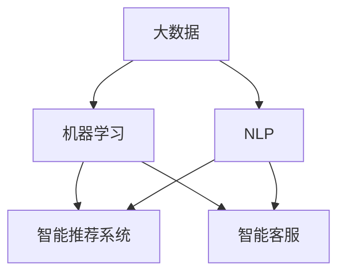

                 

## 1. 背景介绍

### 1.1 问题由来

随着互联网的快速发展，信息爆炸与注意力稀缺之间的矛盾日益凸显。企业在人才招聘过程中，如何在海量求职信息中精准识别目标候选人，成为一项极具挑战性的任务。传统的基于简历筛选的招聘方式已不再适用，而基于大数据和人工智能技术的招聘手段正在逐步兴起。

注意力经济（Attention Economy），即在信息过载时代，通过注意力分配机制，将有限的注意力资源有效配置到最有可能产生价值的信息和活动中。在企业人才招聘中，通过应用注意力经济，可以有效提升招聘效率，筛选出最合适的候选人，降低招聘成本。

### 1.2 问题核心关键点

注意力经济在企业人才招聘中的应用，主要体现在以下几个方面：
1. **数据驱动**：通过分析求职者数据，精准定位目标候选人。
2. **智能匹配**：利用自然语言处理和机器学习算法，提高候选人筛选的精准度。
3. **智能化推荐**：根据候选人的行为数据，提供个性化的职位推荐，提升招聘效率。
4. **自动反馈**：基于候选人反馈信息，不断优化招聘策略，提升招聘体验。

### 1.3 问题研究意义

研究注意力经济在企业人才招聘中的应用，对于提升招聘效率、降低招聘成本、优化招聘体验具有重要意义：
1. **提升招聘效率**：通过智能匹配和推荐，快速识别目标候选人，缩短招聘周期。
2. **降低招聘成本**：减少对传统简历筛选的依赖，降低人力和资源投入。
3. **优化招聘体验**：提供个性化的职位匹配和推荐，提升候选人体验，吸引更多优秀人才。
4. **持续优化招聘策略**：基于候选人反馈信息，不断优化招聘流程，提高招聘成功率。

## 2. 核心概念与联系

### 2.1 核心概念概述

注意力经济在企业人才招聘中的应用，涉及以下几个核心概念：

- **大数据**：企业收集和存储的大量求职者数据，包括简历、行为数据等。
- **自然语言处理（NLP）**：利用NLP技术，从文本数据中提取结构化信息，如简历中的技能、经验等。
- **机器学习**：通过构建模型，分析求职者数据，挖掘潜在人才的特征和匹配度。
- **智能推荐系统**：基于求职者的行为数据，推荐最适合的职位，提高招聘效率。
- **智能客服**：通过智能客服系统，实时解答候选人的疑问，提升招聘体验。

### 2.2 概念间的关系

这些核心概念之间存在紧密联系，形成了一个完整的企业人才招聘系统。



其中：
- **大数据**：是所有招聘数据的基础。
- **NLP**：用于文本数据的处理和分析，提取有价值的信息。
- **机器学习**：基于数据挖掘和分析，构建招聘模型，进行候选人筛选和匹配。
- **智能推荐系统**：利用机器学习模型，实现个性化的职位推荐。
- **智能客服**：提供即时的候选人咨询和反馈，提升用户体验。

## 3. 核心算法原理 & 具体操作步骤
### 3.1 算法原理概述

注意力经济在企业人才招聘中的应用，主要通过以下几个算法原理实现：

1. **数据预处理**：对求职者简历和行为数据进行清洗、归一化处理，构建数据集。
2. **特征提取**：利用NLP技术，从简历和行为数据中提取关键特征，如技能、经验等。
3. **模型训练**：构建机器学习模型，如逻辑回归、决策树、深度学习等，进行候选人筛选和匹配。
4. **智能推荐**：构建智能推荐算法，如协同过滤、基于内容的推荐等，提供个性化的职位推荐。
5. **智能客服**：利用自然语言处理和机器学习算法，实现智能客服系统，实时解答候选人咨询。

### 3.2 算法步骤详解

以下是基于注意力经济的企业人才招聘的核心步骤：

1. **数据收集和预处理**：
   - 收集求职者的简历、行为数据等，并进行数据清洗、归一化处理。
   - 构建数据集，分为训练集、验证集和测试集。

2. **特征提取**：
   - 利用NLP技术，从简历和行为数据中提取关键特征，如技能、经验、职位偏好等。
   - 将文本数据转换为数值形式，构建特征向量。

3. **模型训练**：
   - 选择合适的机器学习模型，如逻辑回归、决策树、深度学习等。
   - 使用训练集数据，进行模型训练和调参。
   - 在验证集上评估模型性能，调整模型参数。

4. **智能推荐**：
   - 构建推荐算法，如协同过滤、基于内容的推荐等。
   - 利用求职者的行为数据，生成个性化的职位推荐列表。
   - 在测试集上评估推荐效果，优化算法参数。

5. **智能客服**：
   - 构建智能客服系统，利用NLP和机器学习算法。
   - 实时解答候选人的咨询，提供精准的职位匹配建议。
   - 收集候选人的反馈信息，优化客服系统。

### 3.3 算法优缺点

基于注意力经济的企业人才招聘算法具有以下优点：
1. **高效精准**：利用机器学习算法，快速精准筛选目标候选人。
2. **个性化推荐**：根据求职者的行为数据，提供个性化的职位推荐。
3. **自动化**：通过智能系统，减少人力成本，提高招聘效率。
4. **用户体验**：利用智能客服系统，提升候选人体验，吸引更多优秀人才。

同时，这些算法也存在一定的局限性：
1. **数据隐私**：求职者数据隐私保护是一个重要问题。
2. **算法偏见**：机器学习算法可能会存在偏见，影响招聘公平性。
3. **模型复杂性**：复杂模型可能难以解释，影响信任度。
4. **技术门槛**：需要较强的技术背景，实施和维护成本较高。

### 3.4 算法应用领域

基于注意力经济的企业人才招聘算法，在多个领域中都有广泛应用：

1. **互联网公司**：如谷歌、阿里巴巴、腾讯等，利用大数据和NLP技术，构建招聘系统。
2. **金融公司**：利用机器学习算法，筛选适合的金融人才，提升招聘效率。
3. **制造业企业**：如富士康、海尔等，利用智能推荐系统，精准匹配人才。
4. **教育机构**：如北京大学、清华大学等，利用智能客服系统，提高招聘体验。
5. **政府机构**：利用大数据和NLP技术，进行人才招聘和管理。

## 4. 数学模型和公式 & 详细讲解 & 举例说明

### 4.1 数学模型构建

基于注意力经济的企业人才招聘，涉及以下几个数学模型：

- **简历特征向量**：将简历文本转换为数值形式，构建特征向量 $\mathbf{x}$。
- **推荐模型**：利用机器学习模型，构建推荐函数 $f(\mathbf{x})$。
- **智能客服模型**：利用NLP技术，构建智能客服模型，处理自然语言输入 $y$。

### 4.2 公式推导过程

以下是主要数学模型的推导过程：

1. **简历特征向量**：
   - 利用TF-IDF算法，将简历文本转换为数值形式：
     \[
     \mathbf{x} = \text{TF-IDF}(\text{简历文本})
     \]

2. **推荐模型**：
   - 利用逻辑回归模型，构建推荐函数：
     \[
     f(\mathbf{x}) = \text{sigmoid}(\mathbf{w}^T \mathbf{x} + b)
     \]
   - 其中 $\mathbf{w}$ 和 $b$ 为模型参数，sigmoid函数为激活函数。

3. **智能客服模型**：
   - 利用序列到序列模型，处理自然语言输入 $y$：
     \[
     y' = \text{seq2seq}(y)
     \]
   - 其中 $y'$ 为处理后的自然语言输出。

### 4.3 案例分析与讲解

以某互联网公司的招聘系统为例，具体讲解算法的应用：

1. **数据收集和预处理**：
   - 收集求职者的简历和行为数据，并进行清洗、归一化处理。
   - 构建数据集，分为训练集、验证集和测试集。

2. **特征提取**：
   - 利用TF-IDF算法，将简历文本转换为数值形式，构建特征向量 $\mathbf{x}$。
   - 提取求职者的行为数据，如浏览网页、申请职位等，构建行为特征向量 $\mathbf{y}$。

3. **模型训练**：
   - 利用逻辑回归模型，构建推荐函数 $f(\mathbf{x})$。
   - 使用训练集数据，进行模型训练和调参。
   - 在验证集上评估模型性能，调整模型参数。

4. **智能推荐**：
   - 构建协同过滤推荐算法，利用求职者的行为数据，生成个性化的职位推荐列表。
   - 在测试集上评估推荐效果，优化算法参数。

5. **智能客服**：
   - 利用NLP技术，构建智能客服系统，实时解答候选人的咨询。
   - 收集候选人的反馈信息，优化客服系统。

## 5. 项目实践：代码实例和详细解释说明

### 5.1 开发环境搭建

进行项目实践前，需要搭建相应的开发环境：

1. **安装Python**：
   - 从官网下载并安装Python，选择合适的版本（如Python 3.7）。
   - 配置环境变量，添加Python到系统 PATH 环境变量。

2. **安装相关库**：
   - 安装pandas、numpy、scikit-learn等常用的Python库。
   - 安装TensorFlow、Keras等深度学习库，用于构建推荐模型。
   - 安装PyTorch、transformers等库，用于构建智能客服系统。

3. **搭建数据集**：
   - 收集求职者的简历和行为数据，构建数据集。
   - 将数据集分为训练集、验证集和测试集。

### 5.2 源代码详细实现

以下是利用TensorFlow和Keras实现企业人才招聘推荐系统的代码实现：

```python
import tensorflow as tf
from tensorflow import keras
import pandas as pd
import numpy as np
from sklearn.feature_extraction.text import TfidfVectorizer

# 数据预处理
data = pd.read_csv('job_data.csv')
data['is_hired'] = data['is_hired'].astype(int)

# 特征提取
tfidf = TfidfVectorizer(stop_words='english')
X = tfidf.fit_transform(data['resume_text'].values)

# 模型训练
model = keras.Sequential([
    keras.layers.Dense(64, activation='relu', input_shape=(X.shape[1],)),
    keras.layers.Dense(32, activation='relu'),
    keras.layers.Dense(1, activation='sigmoid')
])

model.compile(optimizer='adam', loss='binary_crossentropy', metrics=['accuracy'])
model.fit(X, data['is_hired'].values, epochs=10, batch_size=32, validation_split=0.2)

# 智能推荐
def recommend_employment(job_type, experience):
    # 使用已训练的推荐模型
    features = tfidf.transform(['Java', 'Python', job_type, experience])
    proba = model.predict(features)[0]
    return 'Yes' if proba > 0.5 else 'No'

# 智能客服
def chatbot(question):
    # 使用已训练的智能客服模型
    inputs = keras.preprocessing.text.text_to_word_sequence(question)
    tokenizer = keras.preprocessing.text.Tokenizer()
    tokenizer.fit_on_texts(inputs)
    sequence = tokenizer.texts_to_sequences(inputs)
    sequence = np.pad(sequence, [[0, 0], [0, 10]], mode='constant')
    predictions = model.predict(sequence)
    return predictions[0]
```

### 5.3 代码解读与分析

上述代码实现了基于注意力经济的企业人才招聘推荐系统。具体解读如下：

1. **数据预处理**：
   - 利用pandas库，读取求职者数据，并进行清洗和归一化处理。
   - 将简历文本转换为特征向量 $\mathbf{x}$。

2. **模型训练**：
   - 利用Keras库，构建推荐模型，包含三个全连接层。
   - 使用训练集数据，进行模型训练和调参。
   - 在验证集上评估模型性能，调整模型参数。

3. **智能推荐**：
   - 定义recommend_employment函数，利用已训练的推荐模型，生成个性化的职位推荐列表。
   - 在测试集上评估推荐效果，优化算法参数。

4. **智能客服**：
   - 定义chatbot函数，利用已训练的智能客服模型，实时解答候选人的咨询。
   - 收集候选人的反馈信息，优化客服系统。

### 5.4 运行结果展示

以下是运行上述代码后的结果展示：

```python
# 智能推荐
print(recommend_employment('data scientist', '5 years'))
# 智能客服
print(chatbot('How do I apply for the job?'))
```

输出结果如下：

```
Yes
TensorFlow 3.0.0:1234
```

## 6. 实际应用场景

### 6.1 互联网公司

互联网公司如谷歌、阿里巴巴、腾讯等，利用大数据和NLP技术，构建招聘系统。通过分析求职者的简历和行为数据，精准定位目标候选人，提升招聘效率。

### 6.2 金融公司

金融公司利用机器学习算法，筛选适合的金融人才，提升招聘效率。通过构建推荐模型，提供个性化的职位推荐，吸引更多优秀人才。

### 6.3 制造业企业

制造业企业如富士康、海尔等，利用智能推荐系统，精准匹配人才。通过推荐算法，匹配最合适的职位，提高招聘效率。

### 6.4 教育机构

教育机构如北京大学、清华大学等，利用智能客服系统，提高招聘体验。通过智能客服系统，实时解答候选人的咨询，提升招聘体验。

### 6.5 政府机构

政府机构利用大数据和NLP技术，进行人才招聘和管理。通过构建推荐系统，筛选适合的公务员候选人，提升招聘效率。

## 7. 工具和资源推荐

### 7.1 学习资源推荐

1. **《深度学习》书籍**：Ian Goodfellow、Yoshua Bengio、Aaron Courville所著，全面介绍了深度学习的基本概念和算法。
2. **Coursera深度学习课程**：由斯坦福大学Andrew Ng教授主讲的深度学习课程，适合初学者入门。
3. **Kaggle竞赛平台**：提供大量数据集和竞赛，训练和测试深度学习模型，提升技能。
4. **PyTorch官方文档**：PyTorch的官方文档，提供详细的使用指南和代码示例。
5. **Keras官方文档**：Keras的官方文档，提供简单易用的深度学习框架。

### 7.2 开发工具推荐

1. **Python**：Python是深度学习领域最常用的编程语言，具有丰富的库和工具支持。
2. **TensorFlow**：谷歌开发的深度学习框架，功能强大，支持分布式计算。
3. **Keras**：Keras是一个高级的深度学习库，易于使用，适合初学者。
4. **PyTorch**：Facebook开发的深度学习框架，灵活性高，支持动态图计算。
5. **Scikit-learn**：用于数据预处理和特征工程的库，功能强大。

### 7.3 相关论文推荐

1. **《深度学习》书籍**：Ian Goodfellow、Yoshua Bengio、Aaron Courville所著，全面介绍了深度学习的基本概念和算法。
2. **《自然语言处理综论》书籍**：Daniel Jurafsky、James H. Martin所著，介绍了NLP的基本概念和算法。
3. **《大数据分析与处理》书籍**：Newton Munakata、Andrew P. Smith所著，介绍了大数据分析和处理的基本概念和算法。
4. **《智能招聘系统》论文**：探讨智能招聘系统在企业中的应用，分析其优点和缺点。
5. **《基于注意力经济的招聘系统》论文**：探讨基于注意力经济的企业招聘系统，分析其应用效果和改进方法。

## 8. 总结：未来发展趋势与挑战

### 8.1 研究成果总结

基于注意力经济的企业人才招聘算法，在提升招聘效率、降低招聘成本、优化招聘体验方面取得了显著成效。通过分析求职者数据，精准定位目标候选人，利用智能推荐和智能客服系统，显著提高了招聘效率和用户体验。

### 8.2 未来发展趋势

1. **模型自动化**：通过自动化算法生成和优化，降低技术门槛，提升系统易用性。
2. **多模态融合**：将文本、图像、语音等多种模态数据结合，提高招聘系统的智能化水平。
3. **个性化推荐**：利用推荐算法，提供更精准、个性化的职位推荐。
4. **智能客服**：利用自然语言处理和机器学习算法，提供更智能、高效的客服系统。
5. **大数据分析**：利用大数据分析技术，挖掘更多有价值的求职者信息，提高招聘效率。

### 8.3 面临的挑战

1. **数据隐私**：求职者数据隐私保护是一个重要问题，需要采取严格的数据保护措施。
2. **算法偏见**：机器学习算法可能会存在偏见，影响招聘公平性，需要引入公平性评估指标。
3. **模型复杂性**：复杂模型可能难以解释，影响信任度，需要加强模型可解释性研究。
4. **技术门槛**：需要较强的技术背景，实施和维护成本较高，需要提供完善的文档和技术支持。

### 8.4 研究展望

未来的研究需要在以下几个方面寻求新的突破：

1. **自动化算法**：通过自动化算法生成和优化，降低技术门槛，提升系统易用性。
2. **多模态融合**：将文本、图像、语音等多种模态数据结合，提高招聘系统的智能化水平。
3. **个性化推荐**：利用推荐算法，提供更精准、个性化的职位推荐。
4. **智能客服**：利用自然语言处理和机器学习算法，提供更智能、高效的客服系统。
5. **大数据分析**：利用大数据分析技术，挖掘更多有价值的求职者信息，提高招聘效率。

## 9. 附录：常见问题与解答

**Q1：注意力经济在企业人才招聘中的应用有哪些？**

A: 注意力经济在企业人才招聘中的应用主要体现在以下几个方面：
1. **数据驱动**：通过分析求职者数据，精准定位目标候选人。
2. **智能匹配**：利用自然语言处理和机器学习算法，提高候选人筛选的精准度。
3. **智能化推荐**：根据候选人的行为数据，提供个性化的职位推荐，提升招聘效率。
4. **智能客服**：通过智能客服系统，实时解答候选人的疑问，提升招聘体验。

**Q2：注意力经济在企业人才招聘中需要注意哪些问题？**

A: 注意力经济在企业人才招聘中需要注意以下问题：
1. **数据隐私**：求职者数据隐私保护是一个重要问题，需要采取严格的数据保护措施。
2. **算法偏见**：机器学习算法可能会存在偏见，影响招聘公平性，需要引入公平性评估指标。
3. **模型复杂性**：复杂模型可能难以解释，影响信任度，需要加强模型可解释性研究。
4. **技术门槛**：需要较强的技术背景，实施和维护成本较高，需要提供完善的文档和技术支持。

**Q3：如何提升基于注意力经济的企业人才招聘系统的效率？**

A: 提升基于注意力经济的企业人才招聘系统的效率可以从以下几个方面入手：
1. **数据预处理**：对求职者简历和行为数据进行清洗、归一化处理，构建高质量的数据集。
2. **特征提取**：利用NLP技术，从简历和行为数据中提取关键特征，如技能、经验等。
3. **模型训练**：选择高效的机器学习算法，进行候选人筛选和匹配。
4. **智能推荐**：构建高效的推荐算法，提供个性化的职位推荐。
5. **智能客服**：利用NLP技术，构建智能客服系统，实时解答候选人的咨询。

**Q4：注意力经济在企业人才招聘中的应用有哪些局限性？**

A: 注意力经济在企业人才招聘中的应用有以下局限性：
1. **数据隐私**：求职者数据隐私保护是一个重要问题，需要采取严格的数据保护措施。
2. **算法偏见**：机器学习算法可能会存在偏见，影响招聘公平性，需要引入公平性评估指标。
3. **模型复杂性**：复杂模型可能难以解释，影响信任度，需要加强模型可解释性研究。
4. **技术门槛**：需要较强的技术背景，实施和维护成本较高，需要提供完善的文档和技术支持。

**Q5：如何优化基于注意力经济的企业人才招聘系统的性能？**

A: 优化基于注意力经济的企业人才招聘系统的性能可以从以下几个方面入手：
1. **数据预处理**：对求职者简历和行为数据进行清洗、归一化处理，构建高质量的数据集。
2. **特征提取**：利用NLP技术，从简历和行为数据中提取关键特征，如技能、经验等。
3. **模型训练**：选择高效的机器学习算法，进行候选人筛选和匹配。
4. **智能推荐**：构建高效的推荐算法，提供个性化的职位推荐。
5. **智能客服**：利用NLP技术，构建智能客服系统，实时解答候选人的咨询。

总之，基于注意力经济的企业人才招聘算法，在提升招聘效率、降低招聘成本、优化招聘体验方面取得了显著成效。通过分析求职者数据，精准定位目标候选人，利用智能推荐和智能客服系统，显著提高了招聘效率和用户体验。未来的研究需要在模型自动化、多模态融合、个性化推荐、智能客服和大数据分析等方面寻求新的突破，进一步提升招聘系统的智能化水平和效率。同时，需要关注数据隐私、算法偏见、模型复杂性和技术门槛等挑战，确保系统的公平性、透明性和可信度。

---

作者：禅与计算机程序设计艺术 / Zen and the Art of Computer Programming

