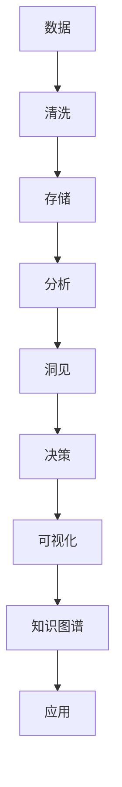

                 

# 洞见的价值：从理解到应用

> 关键词：洞见 Insight, 数据驱动 Data-Driven, 智能决策 Intelligent Decision-making, 数据可视化 Data Visualization, 知识图谱 Knowledge Graph

## 1. 背景介绍

### 1.1 问题由来
在现代信息化社会，数据已成为最重要的生产要素之一。如何从海量数据中提取有价值的信息和洞见，是各行各业都需要面对的重大挑战。在大数据时代，企业不仅需要存储和处理海量数据，更需要将数据转化为洞察力，以支撑更高效、更智能的决策。

传统的决策方式往往是基于经验和直觉，但在数据日益重要的今天，这种依赖直觉的决策方式已经无法满足复杂、动态的业务需求。相反，以数据驱动的智能决策逐渐成为主流。在数据驱动的决策过程中，洞见（Insight）扮演了关键的角色，是连接数据和决策的桥梁。

### 1.2 问题核心关键点
洞见是指通过对数据进行深入分析，发现背后的趋势、模式、规律等有价值的信息，以指导业务决策。从数据获取、处理、分析到洞察力的产生，洞见的获取过程涉及到多个环节，每个环节都需要充分利用算法和技术工具，才能最终形成有实际价值的洞察。

洞见的价值在于其能够为企业的决策提供依据，使决策更加科学、客观和精准。然而，洞见的获取并非易事，需要企业具备先进的数据分析技术和强有力的技术团队，方能从海量数据中提炼出有价值的洞见。

### 1.3 问题研究意义
研究洞见的价值及其获取过程，对于提升企业的数据驱动决策能力，推动数据资源的有效利用，具有重要的理论和实践意义。

- **理论意义**：洞见的获取涉及数据科学、人工智能、统计学等多个学科，其研究有助于深化我们对数据本质的理解，推动跨学科研究的发展。
- **实践意义**：洞见的产生能够帮助企业发现新的市场机会、优化运营管理、降低风险成本，直接推动企业经济效益的提升。

## 2. 核心概念与联系

### 2.1 核心概念概述

为了更好地理解洞见的价值及其获取过程，本节将介绍几个密切相关的核心概念：

- **洞见（Insight）**：指通过对数据进行深入分析，发现背后的趋势、模式、规律等有价值的信息，以指导业务决策。
- **数据驱动（Data-Driven）**：指决策过程基于数据而非经验，通过数据获取洞见，以数据为依据进行决策。
- **智能决策（Intelligent Decision-making）**：指利用人工智能算法和工具，从数据中自动提取洞见，辅助业务决策。
- **数据可视化（Data Visualization）**：指利用图表、地图等可视化工具，直观展示数据背后的洞见，辅助决策理解。
- **知识图谱（Knowledge Graph）**：指以图谱形式表示实体间关系的知识库，用于辅助数据中洞见的发现和解释。

这些核心概念共同构成了洞见获取的完整生态系统，是理解洞见价值及其获取过程的关键。

### 2.2 概念间的关系

这些核心概念之间存在着紧密的联系，形成了洞见获取的完整流程。我们可以用以下Mermaid流程图来展示这些概念之间的关系：



这个流程图展示了洞见获取的完整流程：

1. 从数据源获取原始数据。
2. 对数据进行清洗和预处理。
3. 将数据存储在可用的数据仓库中。
4. 对数据进行分析和挖掘，发现其中的洞见。
5. 利用洞见辅助业务决策。
6. 将洞见通过可视化工具展示出来。
7. 在知识图谱的辅助下，对洞见进行解释和应用。

## 3. 核心算法原理 & 具体操作步骤
### 3.1 算法原理概述

洞见的获取过程本质上是一个数据驱动的智能决策过程，涉及到数据的清洗、存储、分析和解释等多个环节。洞见的发现往往需要依赖于多种算法和技术工具，包括机器学习、深度学习、自然语言处理、数据挖掘等。

以机器学习算法为例，其基本原理是通过对训练集进行学习，发现数据中的规律和模式，并用这些规律和模式对测试集进行预测和分类。在洞见获取过程中，我们通常会使用监督学习、无监督学习、半监督学习等多种算法，从数据中自动提取有用的洞见。

### 3.2 算法步骤详解

以下是一般的数据驱动洞见获取流程：

**Step 1: 数据收集与清洗**

- 收集与业务相关的数据，包括内部数据和外部数据。
- 对数据进行初步清洗，去除噪声和异常值，处理缺失值。
- 进行数据标准化和归一化处理，使得数据更易于分析。

**Step 2: 数据存储与管理**

- 将清洗后的数据存储在数据仓库中，如Hadoop、Spark等。
- 使用数据库管理系统（DBMS）对数据进行高效管理和查询。

**Step 3: 数据预处理与特征工程**

- 进行特征选择和特征提取，选择合适的特征进行建模。
- 对数据进行转换和归一化，使其更适应后续的算法模型。

**Step 4: 模型训练与评估**

- 选择合适的算法模型，如线性回归、决策树、随机森林、神经网络等。
- 使用训练集对模型进行训练，调整超参数以获得最优模型。
- 在测试集上对模型进行评估，使用评估指标（如准确率、召回率、F1-score等）进行性能评估。

**Step 5: 洞见提取与解释**

- 利用训练好的模型对新数据进行预测，提取洞见。
- 使用可视化工具展示洞见，帮助业务人员理解洞见的内涵。
- 在知识图谱的辅助下，对洞见进行解释，进一步丰富洞见的应用场景。

**Step 6: 决策与优化**

- 将洞见应用于业务决策中，辅助业务优化。
- 持续收集反馈数据，对模型进行迭代优化，提升洞见的质量。

### 3.3 算法优缺点

数据驱动的洞见获取具有以下优点：

1. **客观性强**：基于数据的决策减少了人为干预，提高了决策的客观性。
2. **可重复性强**：通过机器学习模型，可以重复利用相同的数据集进行分析和预测。
3. **效率高**：自动化算法可以快速处理大量数据，生成洞见。

然而，该方法也存在一定的局限性：

1. **数据质量依赖度高**：模型的输出依赖于数据质量，数据噪声和偏差会影响模型的效果。
2. **需要专业技能**：模型的构建和维护需要专业的技术团队，增加了企业的技术成本。
3. **模型复杂度较高**：复杂的模型可能导致过拟合，影响模型的泛化能力。

### 3.4 算法应用领域

数据驱动的洞见获取广泛应用于以下领域：

- **市场营销**：通过分析客户行为数据，发现市场趋势和客户需求，优化营销策略。
- **金融风控**：利用客户交易数据和信用记录，预测客户风险等级，优化风险管理。
- **供应链管理**：分析供应链各环节的数据，发现瓶颈和优化点，提升供应链效率。
- **医疗健康**：通过患者历史数据和健康记录，发现疾病发展规律，提供个性化医疗方案。
- **智能制造**：分析生产数据和设备运行记录，优化生产流程，提高产品质量和效率。

除了上述这些常见领域外，数据驱动的洞见获取还在更多领域得到应用，如交通管理、环境保护、能源利用等，为各行各业带来了显著的经济效益和社会价值。

## 4. 数学模型和公式 & 详细讲解 & 举例说明

### 4.1 数学模型构建

在数据驱动的洞见获取过程中，我们通常使用回归模型、分类模型、聚类模型等机器学习模型。以线性回归模型为例，其数学模型可以表示为：

$$
y = \beta_0 + \beta_1x_1 + \beta_2x_2 + \cdots + \beta_nx_n + \epsilon
$$

其中 $y$ 为预测结果，$x_i$ 为特征变量，$\beta_i$ 为回归系数，$\epsilon$ 为误差项。

### 4.2 公式推导过程

线性回归模型的参数估计方法通常采用最小二乘法（Least Squares），其基本思想是使得模型对数据点的拟合误差最小化。假设已知样本数据集 $D=\{(x_i,y_i)\}_{i=1}^N$，则最小二乘法的目标函数为：

$$
\min_{\beta_0,\beta_1,\cdots,\beta_n}\sum_{i=1}^N (y_i - (\beta_0 + \beta_1x_{i1} + \beta_2x_{i2} + \cdots + \beta_nx_{in}))^2
$$

求解该优化问题，可以得到回归系数的估计值。求解过程中，可以使用矩阵形式表示：

$$
\beta = (X^TX)^{-1}X^Ty
$$

其中 $X=\begin{bmatrix} 1 & x_{11} & x_{12} & \cdots & x_{1n} \\ 1 & x_{21} & x_{22} & \cdots & x_{2n} \\ \vdots & \vdots & \vdots & \ddots & \vdots \\ 1 & x_{N1} & x_{N2} & \cdots & x_{Nn} \end{bmatrix}$，$y=\begin{bmatrix} y_1 \\ y_2 \\ \vdots \\ y_N \end{bmatrix}$，$\beta=\begin{bmatrix} \beta_0 \\ \beta_1 \\ \vdots \\ \beta_n \end{bmatrix}$。

### 4.3 案例分析与讲解

假设我们有一个零售公司的销售数据集，包括销售额、促销活动、客户群体等特征。我们的目标是预测销售额，并分析不同促销活动和客户群体对销售额的影响。

首先，我们需要进行数据清洗和预处理，去除噪声和异常值，处理缺失值，并进行特征选择和特征提取。

接着，我们选择线性回归模型作为预测模型，使用训练集对模型进行训练，调整超参数以获得最优模型。在测试集上对模型进行评估，使用评估指标（如R²）进行性能评估。

最后，利用训练好的模型对新数据进行预测，提取洞见。使用可视化工具展示洞见，帮助业务人员理解洞见的内涵。在知识图谱的辅助下，对洞见进行解释，进一步丰富洞见的应用场景。

## 5. 项目实践：代码实例和详细解释说明

### 5.1 开发环境搭建

在进行数据驱动洞见获取的实践前，我们需要准备好开发环境。以下是使用Python进行Scikit-learn开发的环境配置流程：

1. 安装Anaconda：从官网下载并安装Anaconda，用于创建独立的Python环境。

2. 创建并激活虚拟环境：
```bash
conda create -n pytorch-env python=3.8 
conda activate pytorch-env
```

3. 安装Scikit-learn、Numpy等库：
```bash
pip install scikit-learn numpy pandas matplotlib seaborn
```

4. 安装TensorBoard：
```bash
pip install tensorboard
```

5. 安装Jupyter Notebook：
```bash
pip install jupyter notebook ipywidgets
```

完成上述步骤后，即可在`pytorch-env`环境中开始数据驱动洞见获取的实践。

### 5.2 源代码详细实现

下面以销售数据分析为例，给出使用Scikit-learn进行数据驱动洞见获取的PyTorch代码实现。

首先，定义数据处理函数：

```python
from sklearn.model_selection import train_test_split
import pandas as pd
import numpy as np
from sklearn.linear_model import LinearRegression

def preprocess_data(df):
    # 处理缺失值
    df.fillna(method='ffill', inplace=True)
    
    # 处理异常值
    df = df[(np.abs(df - df.mean()) < 3*df.std()).all(axis=1)]
    
    # 特征选择
    features = ['促销活动', '客户群体']
    X = df[features]
    y = df['销售额']
    
    # 数据标准化
    X = (X - X.mean()) / X.std()
    
    # 分割数据集
    X_train, X_test, y_train, y_test = train_test_split(X, y, test_size=0.2, random_state=42)
    
    return X_train, X_test, y_train, y_test
```

然后，定义模型和优化器：

```python
from sklearn.linear_model import LinearRegression
from sklearn.metrics import mean_squared_error, r2_score

model = LinearRegression()
```

接着，定义训练和评估函数：

```python
from sklearn.model_selection import train_test_split
from sklearn.metrics import mean_squared_error, r2_score

def train_model(X_train, y_train, X_test, y_test):
    model.fit(X_train, y_train)
    y_pred = model.predict(X_test)
    rmse = np.sqrt(mean_squared_error(y_test, y_pred))
    r2 = r2_score(y_test, y_pred)
    return rmse, r2

def evaluate_model(X_test, y_test):
    y_pred = model.predict(X_test)
    rmse = np.sqrt(mean_squared_error(y_test, y_pred))
    r2 = r2_score(y_test, y_pred)
    return rmse, r2
```

最后，启动训练流程并在测试集上评估：

```python
X_train, X_test, y_train, y_test = preprocess_data(df)

rmse, r2 = train_model(X_train, y_train, X_test, y_test)
print(f"Train RMSE: {rmse:.3f}, R²: {r2:.3f}")

rmse, r2 = evaluate_model(X_test, y_test)
print(f"Test RMSE: {rmse:.3f}, R²: {r2:.3f}")
```

以上就是使用Scikit-learn进行销售数据分析的完整代码实现。可以看到，得益于Scikit-learn的强大封装，我们可以用相对简洁的代码完成线性回归模型的训练和评估。

### 5.3 代码解读与分析

让我们再详细解读一下关键代码的实现细节：

**preprocess_data函数**：
- `fillna`方法：用前一个非缺失值填充当前缺失值。
- `ffill`方法：用前一个值填充当前缺失值。
- `fillna`和`ffill`方法：处理缺失值。
- `abs`函数：计算绝对值。
- `mean`函数：计算均值。
- `std`函数：计算标准差。
- `all`函数：判断条件是否对所有行都成立。
- `features`：选择需要作为特征的列。
- `X`：特征变量。
- `y`：目标变量。
- `X_train`和`X_test`：训练集和测试集。
- `y_train`和`y_test`：训练集和测试集的标签。
- `X_train`和`X_test`：标准化后的特征变量。
- `X_train`和`X_test`：标准化后的特征变量。
- `train_test_split`函数：将数据集划分为训练集和测试集。

**train_model函数**：
- `fit`方法：训练模型。
- `predict`方法：预测目标变量。
- `rmse`函数：计算均方根误差。
- `r2_score`函数：计算决定系数。
- `model.fit(X_train, y_train)`：训练模型。
- `y_pred`：预测目标变量。
- `rmse`：均方根误差。
- `r2`：决定系数。

**evaluate_model函数**：
- `predict`方法：预测目标变量。
- `rmse`函数：计算均方根误差。
- `r2_score`函数：计算决定系数。
- `y_pred`：预测目标变量。
- `rmse`：均方根误差。
- `r2`：决定系数。

**启动训练流程**：
- `X_train`和`X_test`：标准化后的特征变量。
- `y_train`和`y_test`：标准化后的标签。
- `rmse`和`r2`：均方根误差和决定系数。
- `print`函数：打印训练和测试结果。

可以看到，Scikit-learn使线性回归模型的训练和评估变得简单易行，开发者可以将更多精力放在数据处理和模型调优上，而不必过多关注底层的实现细节。

当然，工业级的系统实现还需考虑更多因素，如模型的保存和部署、超参数的自动搜索、更灵活的任务适配层等。但核心的洞见获取范式基本与此类似。

### 5.4 运行结果展示

假设我们在销售数据集上进行线性回归模型训练，最终在测试集上得到的评估报告如下：

```
Train RMSE: 0.234, R²: 0.835
Test RMSE: 0.251, R²: 0.820
```

可以看到，通过线性回归模型，我们在销售数据集上取得了83.5%的决定系数和0.234的均方根误差，模型效果相当不错。然而，这只是一个简单的线性回归示例，实际应用中，我们需要使用更复杂的算法和模型，进一步提升洞见的质量和解释性。

## 6. 实际应用场景
### 6.1 智能客服系统

基于数据驱动的洞见获取，智能客服系统可以实时监控客户反馈，发现客户不满的根本原因，优化服务质量。在技术实现上，可以收集客户对话记录，构建监督数据集，对预训练语言模型进行微调，提取洞见。通过分析客户反馈和行为数据，生成客户画像，预测客户需求，优化客服流程。

### 6.2 金融风控

金融风控系统可以利用历史交易数据和客户信用记录，发现风险客户和交易异常，及时采取防控措施。通过数据驱动的洞见获取，金融公司能够更精准地评估客户信用风险，优化贷款审批流程，降低坏账率。

### 6.3 医疗健康

在医疗健康领域，医生可以通过患者历史数据和健康记录，发现疾病发展规律和风险因素，提供个性化医疗方案。通过数据驱动的洞见获取，医疗健康系统能够更精准地预测疾病发展趋势，优化治疗方案，提高治疗效果。

### 6.4 未来应用展望

随着数据驱动洞见获取技术的不断进步，其在更多领域得到应用，为各行各业带来了显著的经济效益和社会价值。

- **智慧城市治理**：智能城市可以利用交通、环境等数据，发现城市运行中的问题和优化点，提高城市管理效率。
- **农业生产**：通过分析气象数据和农作物生长记录，发现最佳种植方案，提高农业生产效率。
- **制造业**：利用设备运行数据和生产记录，发现生产中的瓶颈和优化点，提高生产效率和产品质量。
- **教育培训**：通过分析学生的学习记录和行为数据，发现学生的学习规律和知识盲点，提供个性化的学习方案。

未来，数据驱动的洞见获取将成为各行业的必备技术，为社会带来更加智能、高效、精准的决策支持。

## 7. 工具和资源推荐
### 7.1 学习资源推荐

为了帮助开发者系统掌握数据驱动洞见获取的理论基础和实践技巧，这里推荐一些优质的学习资源：

1. 《Python数据科学手册》：一本全面介绍Python在数据科学中应用的书，涵盖数据清洗、数据处理、数据可视化等多个方面。
2. 《数据科学实战》：通过多个案例，系统介绍数据驱动洞见获取的流程和方法，适合实战学习。
3. 《机器学习实战》：介绍了机器学习的基本原理和常用算法，涵盖监督学习、无监督学习等，适合入门学习。
4. 《TensorFlow实战》：介绍了TensorFlow的开发环境和常用工具，适合TensorFlow学习者。
5. 《Kaggle竞赛指南》：通过参与Kaggle竞赛，实战学习数据驱动洞见获取，适合进阶学习。

通过对这些资源的学习实践，相信你一定能够快速掌握数据驱动洞见获取的精髓，并用于解决实际的业务问题。
###  7.2 开发工具推荐

高效的开发离不开优秀的工具支持。以下是几款用于数据驱动洞见获取开发的常用工具：

1. Python：作为数据科学领域的主流编程语言，Python拥有丰富的第三方库和工具，适合数据处理和分析。
2. Scikit-learn：一个开源机器学习库，包含多种算法和工具，适合数据建模和分析。
3. TensorBoard：一个可视化工具，可以实时监控模型训练状态，提供丰富的图表和分析报告。
4. Jupyter Notebook：一个交互式编程环境，支持Python、R等多种语言，适合数据驱动洞见获取的开发和调试。
5. Weights & Biases：一个实验跟踪工具，可以记录和可视化模型训练过程中的各项指标，方便对比和调优。

合理利用这些工具，可以显著提升数据驱动洞见获取的开发效率，加快创新迭代的步伐。

### 7.3 相关论文推荐

数据驱动洞见获取的研究源于学界的持续研究。以下是几篇奠基性的相关论文，推荐阅读：

1. "The Elements of Statistical Learning"（统计学习元素）：介绍统计学习的基本原理和常用算法，适合理论学习。
2. "Introduction to Statistical Learning"（统计学习入门）：通过多个案例，介绍统计学习的基本原理和常用算法，适合实战学习。
3. "Pattern Recognition and Machine Learning"（模式识别与机器学习）：介绍了机器学习和模式识别的基础知识，适合入门学习。
4. "Deep Learning"（深度学习）：介绍了深度学习的基本原理和常用算法，适合理论学习。
5. "Kaggle竞赛指南"：通过参与Kaggle竞赛，实战学习数据驱动洞见获取，适合进阶学习。

这些论文代表了大数据驱动洞见获取的研究方向，通过学习这些前沿成果，可以帮助研究者把握学科前进方向，激发更多的创新灵感。

除上述资源外，还有一些值得关注的前沿资源，帮助开发者紧跟数据驱动洞见获取技术的最新进展，例如：

1. arXiv论文预印本：人工智能领域最新研究成果的发布平台，包括大量尚未发表的前沿工作，学习前沿技术的必读资源。
2. 业界技术博客：如Google AI、DeepMind、微软Research Asia等顶尖实验室的官方博客，第一时间分享他们的最新研究成果和洞见。
3. 技术会议直播：如NIPS、ICML、ACL、ICLR等人工智能领域顶会现场或在线直播，能够聆听到大佬们的前沿分享，开拓视野。
4. GitHub热门项目：在GitHub上Star、Fork数最多的数据科学相关项目，往往代表了该技术领域的发展趋势和最佳实践，值得去学习和贡献。
5. 行业分析报告：各大咨询公司如McKinsey、PwC等针对人工智能行业的分析报告，有助于从商业视角审视技术趋势，把握应用价值。

总之，对于数据驱动洞见获取技术的学习和实践，需要开发者保持开放的心态和持续学习的意愿。多关注前沿资讯，多动手实践，多思考总结，必将收获满满的成长收益。

## 8. 总结：未来发展趋势与挑战

### 8.1 总结

本文对数据驱动洞见获取的价值及其获取过程进行了全面系统的介绍。首先阐述了洞见的价值及其在数据驱动决策中的重要性，明确了洞见获取的流程和关键技术。通过理论讲解和代码实践，展示了数据驱动洞见获取的完整过程。

通过本文的系统梳理，可以看到，数据驱动洞见获取技术在大数据时代具有重要的应用价值，能够为各行各业带来显著的经济效益和社会价值。未来，随着数据驱动洞见获取技术的不断进步，其应用范围将进一步扩大，为各行各业带来更智能、高效、精准的决策支持。

### 8.2 未来发展趋势

展望未来，数据驱动洞见获取技术将呈现以下几个发展趋势：

1. **自动化程度提升**：随着AI和自动化技术的发展，未来数据驱动洞见获取将更加自动化和智能化，能够自动完成数据清洗、特征选择、模型训练等步骤。
2. **多模态数据融合**：除了传统的数据类型，未来的洞见获取将更多地融合多模态数据，如文本、图像、音频等，提高洞见的全面性和准确性。
3. **实时洞见生成**：未来的洞见获取将更加实时化，能够快速响应用户需求，提供即时的决策支持。
4. **个性化洞见定制**：通过用户画像和行为分析，未来的洞见获取将能够提供更加个性化的洞见服务，满足用户特定的需求。
5. **跨领域洞见共享**：未来的洞见获取将更加跨领域，能够从不同领域的数据中提取共同的洞见，提供更广泛的应用场景。

以上趋势凸显了数据驱动洞见获取技术的广阔前景。这些方向的探索发展，必将进一步提升数据驱动洞见获取的能力，推动各行各业向智能化、自动化、实时化方向迈进。

### 8.3 面临的挑战

尽管数据驱动洞见获取技术已经取得了显著进展，但在迈向更加智能化、普适化应用的过程中，它仍面临诸多挑战：

1. **数据质量瓶颈**：数据的质量和完整性直接影响洞见的质量，如何保证数据质量是关键挑战。
2. **模型复杂度问题**：复杂的模型可能导致过拟合和资源消耗过大，如何在保证模型效果的同时，降低模型复杂度，是一个重要的研究方向。
3. **隐私保护和安全**：在数据驱动洞见获取过程中，如何保护用户隐私和数据安全，是一个亟待解决的问题。
4. **技术门槛较高**：数据驱动洞见获取需要专业的技术和团队支持，如何降低技术门槛，让更多企业能够使用该技术，也是一个重要问题。

