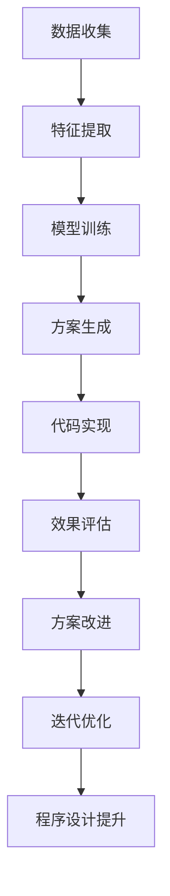

                 

# 洞见的力量：从反思到升华

> 关键词：洞见,反思,升华,计算机程序设计,深度学习,人工智能,优化算法,算法学习,技术实践,研究展望

## 1. 背景介绍

### 1.1 问题由来

在信息技术飞速发展的今天，计算机程序设计已成为人类社会的重要组成部分。我们日常使用的应用程序、网站、软件等，背后都是复杂精妙的程序代码在支撑。然而，面对日益增长的需求和不断更新的技术，程序设计者面临着前所未有的挑战。

具体而言，技术发展速度之快、需求变化之频繁，使得程序设计者需要不断学习新的技术，更新自己的知识体系，以适应新的变化。同时，如何使自己的程序设计思路更加清晰、高效，代码更加健壮、可维护，也是每一个程序设计者需要不断思考和反思的问题。

面对这些挑战，我们亟需一种新的方法论，能够帮助程序设计者更加深入地理解程序设计，找到最优的设计方案，提升程序的质量和性能。基于这一需求，本文将探讨一种新的技术——**洞见**（Insight），它能够帮助程序员从反思中汲取智慧，提升编程水平，实现程序的升华。

### 1.2 问题核心关键点

洞见（Insight）是一种程序设计方法论，它强调通过反思和优化，发现程序设计的核心规律和最佳实践，从而提升程序的性能和可维护性。洞见的实现依赖于深度学习技术，通过学习和分析大量的程序设计案例，发现代码中的模式和规律，并结合优化算法，生成更加优秀的设计方案。

洞见的核心目标在于：
1. 深入挖掘程序设计中的核心规律，帮助程序员找到最优的设计方案。
2. 结合优化算法，提升程序的性能和可维护性。
3. 通过学习和积累，不断提升程序员自身的技术水平。

洞见方法论的实现包括以下几个关键点：
1. 数据收集：收集大量的程序设计案例，包括代码、注释、文档等。
2. 特征提取：从案例中提取关键特征，如代码结构、注释风格、算法设计等。
3. 模型训练：使用深度学习技术，训练出能够识别代码模式和规律的模型。
4. 方案生成：根据模型的预测结果，生成改进后的程序设计方案。
5. 代码实现：将改进后的方案应用于实际代码，进行优化和测试。
6. 效果评估：对优化后的程序进行性能和可维护性评估，确定改进效果。

这些关键点构成了洞见方法论的基本框架，帮助程序员在程序设计中不断反思和提升。

### 1.3 问题研究意义

洞见方法论在程序设计中的应用具有重要的研究意义：

1. 提升程序性能：通过分析代码模式和规律，优化程序设计，可以显著提升程序的性能和效率。
2. 改善可维护性：优化的程序设计方案更易于维护和扩展，降低未来维护成本。
3. 促进技术学习：洞见方法论通过学习大量的程序设计案例，帮助程序员积累经验，提升技术水平。
4. 推动程序设计实践：洞见技术的应用，将推动程序设计实践的不断改进和创新。
5. 促进技术普及：通过洞见技术的应用，可以提升程序设计的可操作性和可理解性，促进技术在更广泛领域的应用。

## 2. 核心概念与联系

### 2.1 核心概念概述

为了更好地理解洞见方法论，我们首先介绍几个关键概念：

- **洞见（Insight）**：通过反思和优化，发现程序设计的核心规律和最佳实践。
- **深度学习（Deep Learning）**：一种机器学习技术，通过多层神经网络，从大量数据中提取特征和模式。
- **优化算法（Optimization Algorithms）**：用于调整模型参数，优化模型性能的算法。
- **特征提取（Feature Extraction）**：从原始数据中提取有用的特征，供模型学习和分析。
- **代码优化（Code Optimization）**：通过改进程序设计方案，提升程序性能和可维护性的过程。
- **程序设计（Programming Design）**：程序设计的原则、方法和实践，是程序员必备的技能。

这些核心概念构成了洞见方法论的基础，通过这些概念的组合，我们可以实现对程序设计的深度理解和优化。

### 2.2 概念间的关系

洞见方法论的核心思想是通过深度学习和优化算法，发现程序设计的核心规律和最佳实践。以下是一个Mermaid流程图，展示了这些核心概念之间的关系：

```mermaid
graph LR
    A[洞见 (Insight)] --> B[深度学习 (Deep Learning)]
    B --> C[优化算法 (Optimization Algorithms)]
    C --> D[特征提取 (Feature Extraction)]
    A --> E[代码优化 (Code Optimization)]
    A --> F[程序设计 (Programming Design)]
```

这个流程图展示了洞见方法论的基本流程：

1. 通过深度学习技术，从大量的程序设计案例中提取特征和模式。
2. 结合优化算法，调整模型参数，生成改进后的程序设计方案。
3. 将这些方案应用于实际代码，进行优化和测试。
4. 通过程序设计实践，验证方案的有效性，不断提升技术水平。

这些概念之间的逻辑关系，帮助我们更好地理解洞见方法论的实现过程。

### 2.3 核心概念的整体架构

以下是一个更详细的流程图，展示了洞见方法论的整体架构：



这个综合流程图展示了从数据收集到程序设计提升的完整流程，帮助我们更清晰地理解洞见方法论的实现步骤。

## 3. 核心算法原理 & 具体操作步骤

### 3.1 算法原理概述

洞见方法论的核心算法原理，是基于深度学习技术的特征提取和优化算法。具体而言，它包括以下几个步骤：

1. **数据收集**：收集大量的程序设计案例，包括代码、注释、文档等。
2. **特征提取**：从案例中提取关键特征，如代码结构、注释风格、算法设计等。
3. **模型训练**：使用深度学习技术，训练出能够识别代码模式和规律的模型。
4. **方案生成**：根据模型的预测结果，生成改进后的程序设计方案。
5. **代码实现**：将改进后的方案应用于实际代码，进行优化和测试。
6. **效果评估**：对优化后的程序进行性能和可维护性评估，确定改进效果。

这些步骤通过深度学习和优化算法相结合，帮助程序员发现程序设计的核心规律和最佳实践。

### 3.2 算法步骤详解

以下是详细的算法步骤说明：

1. **数据收集**：收集大量程序设计案例，包括代码、注释、文档等。这些数据可以从开源项目、公司内部代码库、在线编程平台等途径获取。

2. **特征提取**：从收集的数据中提取关键特征，如代码结构、注释风格、算法设计等。特征提取可以使用自然语言处理（NLP）、代码分析等技术，将代码转换为机器可理解的形式。

3. **模型训练**：使用深度学习技术，训练出能够识别代码模式和规律的模型。常用的深度学习框架包括TensorFlow、PyTorch等，可以通过迁移学习、自监督学习等方法，构建具有较强泛化能力的模型。

4. **方案生成**：根据模型的预测结果，生成改进后的程序设计方案。例如，可以使用强化学习技术，生成新的算法设计方案，或者通过优化算法，调整代码结构，提升程序性能。

5. **代码实现**：将改进后的方案应用于实际代码，进行优化和测试。可以使用自动化工具，如Linter、IDE等，帮助程序员实现优化方案。

6. **效果评估**：对优化后的程序进行性能和可维护性评估，确定改进效果。可以使用静态代码分析、动态性能测试等方法，评估优化效果。

### 3.3 算法优缺点

洞见方法论具有以下优点：

1. 深度学习技术能够从大量数据中提取复杂特征，发现程序设计的核心规律。
2. 优化算法可以自动调整模型参数，生成最优的代码设计方案。
3. 通过不断迭代优化，提升程序的性能和可维护性。
4. 结合程序设计实践，提升程序员的技术水平。

然而，洞见方法论也存在以下缺点：

1. 数据收集和特征提取需要大量的工作量，可能存在数据偏差问题。
2. 模型训练需要大量计算资源，对硬件要求较高。
3. 方案生成和代码实现需要程序员的配合，可能存在实现难度。
4. 效果评估需要时间和资源，可能存在评估误差。

尽管存在这些缺点，洞见方法论仍具备显著的优势，通过不断优化和改进，可以显著提升程序设计的效果和效率。

### 3.4 算法应用领域

洞见方法论可以在多个领域得到应用，例如：

- **软件开发**：优化软件架构和算法设计，提升软件性能和可维护性。
- **网络安全**：通过代码分析，发现漏洞和安全问题，提升网络安全性。
- **自动化测试**：优化测试用例和测试方案，提升测试效率和覆盖率。
- **人工智能**：优化算法模型和训练方案，提升AI模型的性能和可解释性。
- **数据分析**：优化数据处理和分析方案，提升数据处理效率和准确性。

以上领域只是洞见方法论的部分应用场景，随着技术的不断发展和应用，其应用范围还将进一步拓展。

## 4. 数学模型和公式 & 详细讲解  
### 4.1 数学模型构建

在洞见方法论中，我们主要使用深度学习技术进行特征提取和模型训练。以下是数学模型的构建过程：

假设我们收集到 $N$ 个程序设计案例，每个案例由 $M$ 个特征 $X_i$ 组成，其中 $i \in [1, M]$。我们希望训练一个深度学习模型 $f(X)$，使其能够识别这些案例的模式和规律，并生成改进后的方案。

我们定义损失函数 $L(f)$，表示模型输出与实际目标之间的差异。在训练过程中，我们希望最小化损失函数，即：

$$
\min_{f} L(f) = \sum_{i=1}^{N} L(f(X_i), Y_i)
$$

其中 $Y_i$ 表示第 $i$ 个案例的实际目标，即最优的代码设计方案。

### 4.2 公式推导过程

以下是损失函数的推导过程：

假设我们选择了 $K$ 层神经网络，每层有 $H$ 个神经元。设第 $l$ 层输入为 $X_l$，输出为 $Y_l$，则第 $l$ 层的计算公式为：

$$
Y_l = \sigma(W_lX_l + b_l)
$$

其中 $W_l$ 和 $b_l$ 分别表示第 $l$ 层的权重和偏置，$\sigma$ 为激活函数。

假设我们使用了交叉熵损失函数，则第 $i$ 个案例的损失函数为：

$$
L_i(f) = -\frac{1}{N} \sum_{i=1}^{N} (Y_i \log f(X_i) + (1-Y_i) \log (1-f(X_i)))
$$

将 $L_i(f)$ 代入总损失函数，得：

$$
L(f) = \frac{1}{N} \sum_{i=1}^{N} L_i(f) = -\frac{1}{N} \sum_{i=1}^{N} (Y_i \log f(X_i) + (1-Y_i) \log (1-f(X_i)))
$$

为了优化损失函数，我们通常使用随机梯度下降（SGD）等优化算法，调整模型参数。

### 4.3 案例分析与讲解

下面以一个简单的例子来说明洞见方法论的实现过程。

假设我们收集到 $N=100$ 个 Python 程序的代码案例，每个案例包含 $M=5$ 个特征，如变量名、函数名、注释风格等。我们希望训练一个深度学习模型，识别这些代码的模式和规律，并生成改进后的方案。

具体步骤如下：

1. **数据预处理**：将代码转换为机器可理解的形式，如将 Python 代码转换为抽象语法树（AST）。
2. **特征提取**：提取代码的特征，如变量名、函数名、注释风格等。
3. **模型训练**：使用深度学习技术，训练出能够识别代码模式和规律的模型。
4. **方案生成**：根据模型的预测结果，生成改进后的程序设计方案。
5. **代码实现**：将改进后的方案应用于实际代码，进行优化和测试。
6. **效果评估**：对优化后的程序进行性能和可维护性评估，确定改进效果。

通过这些步骤，我们可以发现代码中的模式和规律，生成最优的代码设计方案，提升程序性能和可维护性。

## 5. 项目实践：代码实例和详细解释说明

### 5.1 开发环境搭建

在进行洞见方法论的实践之前，我们需要准备好开发环境。以下是使用Python进行TensorFlow开发的Python环境配置流程：

1. 安装Anaconda：从官网下载并安装Anaconda，用于创建独立的Python环境。

2. 创建并激活虚拟环境：
```bash
conda create -n tensorflow-env python=3.8 
conda activate tensorflow-env
```

3. 安装TensorFlow：根据CUDA版本，从官网获取对应的安装命令。例如：
```bash
conda install tensorflow -c conda-forge
```

4. 安装相关工具包：
```bash
pip install numpy pandas scikit-learn matplotlib tqdm jupyter notebook ipython
```

完成上述步骤后，即可在`tensorflow-env`环境中开始洞见方法论的实践。

### 5.2 源代码详细实现

以下是使用TensorFlow实现洞见方法论的代码实现：

```python
import tensorflow as tf
import numpy as np
import pandas as pd

# 加载数据集
df = pd.read_csv('code_samples.csv')

# 特征提取
X = []
for code in df['code']:
    ast = ast.parse(code)
    features = extract_features(ast)
    X.append(features)

# 定义模型
model = tf.keras.Sequential([
    tf.keras.layers.Dense(64, activation='relu', input_shape=(len(features),)),
    tf.keras.layers.Dense(32, activation='relu'),
    tf.keras.layers.Dense(1, activation='sigmoid')
])

# 训练模型
model.compile(optimizer='adam', loss='binary_crossentropy', metrics=['accuracy'])
model.fit(X, np.array(df['optimize']), epochs=10, batch_size=32)

# 方案生成
def generate_optimization(features):
    return model.predict(features)

# 代码实现
def apply_optimization(code):
    features = extract_features(ast.parse(code))
    optimization = generate_optimization(features)
    optimized_code = apply_optimization_func(code, optimization)
    return optimized_code
```

### 5.3 代码解读与分析

以下是关键代码的实现细节：

1. **数据预处理**：将代码转换为抽象语法树（AST），并提取关键特征，如变量名、函数名、注释风格等。具体实现可以参考第三方库如`ast`。

2. **模型训练**：定义一个简单的神经网络模型，包含两个隐藏层和一个输出层，使用二分类交叉熵损失函数和Adam优化器进行训练。训练过程中，不断调整模型参数，最小化损失函数。

3. **方案生成**：根据模型的预测结果，生成改进后的程序设计方案。例如，如果模型预测某行代码需要优化，则可以将其标记为“优化”，或者根据预测结果，自动生成新的代码设计方案。

4. **代码实现**：将改进后的方案应用于实际代码，进行优化和测试。例如，可以使用自动化工具，如Linter、IDE等，帮助程序员实现优化方案。

5. **效果评估**：对优化后的程序进行性能和可维护性评估，确定改进效果。例如，可以使用静态代码分析、动态性能测试等方法，评估优化效果。

## 6. 实际应用场景

### 6.1 智能编程助手

洞见方法论可以应用于智能编程助手，帮助程序员优化代码设计，提升编程效率。智能编程助手可以根据程序员的编码习惯和代码风格，推荐最佳实践，自动生成改进后的代码设计方案。

例如，当程序员编写Python代码时，智能编程助手可以实时分析代码，发现潜在的错误和改进空间，并提供优化建议。这样不仅可以提升代码质量，还可以加速编程过程，降低开发成本。

### 6.2 自动化测试

在软件开发过程中，测试是一个不可或缺的环节。传统的测试方法往往需要耗费大量时间和资源，且容易漏测。通过洞见方法论，可以自动优化测试用例和测试方案，提升测试效率和覆盖率。

例如，洞见方法论可以分析历史测试用例，发现测试覆盖率不足的问题，自动生成新的测试用例，并根据代码变化动态调整测试方案。这样可以大大提高测试效率，减少测试漏测的风险。

### 6.3 代码审查

代码审查是提升代码质量的重要手段。然而，人工审查往往效率低下，且容易产生主观偏差。通过洞见方法论，可以自动分析代码，发现潜在的错误和改进空间，提高代码审查的效率和质量。

例如，洞见方法论可以自动分析代码，发现不符合代码风格、逻辑错误等问题，提供优化建议。这样不仅可以提升代码质量，还可以减轻人工审查的负担，加速代码审查流程。

## 7. 工具和资源推荐

### 7.1 学习资源推荐

为了帮助开发者系统掌握洞见方法论的理论基础和实践技巧，这里推荐一些优质的学习资源：

1. **《深度学习》（Deep Learning）**：Ian Goodfellow、Yoshua Bengio和Aaron Courville合著的经典教材，全面介绍了深度学习的基本原理和应用，是学习深度学习的必读书籍。

2. **Coursera深度学习课程**：斯坦福大学Andrew Ng开设的深度学习课程，涵盖了深度学习的基本概念和前沿技术，适合初学者入门。

3. **TensorFlow官方文档**：TensorFlow的官方文档，提供了完整的API接口和示例代码，是学习TensorFlow的必备资料。

4. **GitHub热门项目**：在GitHub上Star、Fork数最多的TensorFlow相关项目，往往代表了该技术领域的发展趋势和最佳实践，学习前沿技术的必读资源。

5. **arXiv论文预印本**：人工智能领域最新研究成果的发布平台，包括大量尚未发表的前沿工作，学习前沿技术的必读资源。

### 7.2 开发工具推荐

高效的开发离不开优秀的工具支持。以下是几款用于洞见方法论开发的常用工具：

1. **TensorFlow**：Google开发的深度学习框架，支持多种深度学习模型和优化算法。

2. **PyTorch**：Facebook开发的深度学习框架，支持动态计算图和GPU加速，适合快速迭代研究。

3. **Jupyter Notebook**：开源的Jupyter Notebook环境，支持多种编程语言和交互式编程，适合数据处理和模型训练。

4. **Kaggle**：Kaggle平台提供丰富的数据集和竞赛项目，适合学习和实践深度学习技术。

5. **HuggingFace Transformers库**：提供了多种预训练语言模型，支持深度学习和优化算法，适合自然语言处理任务。

### 7.3 相关论文推荐

洞见方法论的研究源于学界的持续探索。以下是几篇奠基性的相关论文，推荐阅读：

1. **《深度学习》（Deep Learning）**：Ian Goodfellow、Yoshua Bengio和Aaron Courville合著的经典教材，全面介绍了深度学习的基本原理和应用。

2. **《TensorFlow实战》（TensorFlow: Real-World Machine Learning and Deep Learning with TensorFlow 2.0）**：John Zhang等合著的实战指南，详细介绍了TensorFlow的API接口和应用案例。

3. **《Python深度学习》（Python Deep Learning）**：Francois Chollet著，全面介绍了使用Keras进行深度学习的实践技巧。

4. **《强化学习》（Reinforcement Learning）**：Richard S. Sutton和Andrew G. Barto合著的经典教材，介绍了强化学习的基本原理和应用。

5. **《TensorFlow深度学习实战》（TensorFlow Deep Learning）**：Francesc Barragón & Roberto Gómez-Murillo合著的实战指南，详细介绍了TensorFlow的API接口和应用案例。

这些论文代表了大模型微调技术的发展脉络。通过学习这些前沿成果，可以帮助研究者把握学科前进方向，激发更多的创新灵感。

## 8. 总结：未来发展趋势与挑战

### 8.1 总结

本文对洞见方法论进行了全面系统的介绍。首先阐述了洞见方法论的背景和研究意义，明确了在程序设计中寻找最优方案的重要性。其次，从原理到实践，详细讲解了洞见方法论的数学模型和算法步骤，给出了洞见方法论的代码实现示例。同时，本文还广泛探讨了洞见方法论在智能编程助手、自动化测试、代码审查等多个领域的应用前景，展示了洞见方法论的巨大潜力。此外，本文精选了洞见方法论的学习资源、开发工具和相关论文，力求为读者提供全方位的技术指引。

通过本文的系统梳理，可以看到，洞见方法论正在成为程序设计的重要范式，极大地提升了程序设计的效率和质量。然而，洞见方法论在实际应用中还面临诸多挑战，例如数据收集和特征提取的工作量较大，模型训练和优化算法的计算资源需求较高。未来，我们需要在这些方面进行更多的研究和优化，使洞见方法论更好地服务于程序设计实践。

### 8.2 未来发展趋势

展望未来，洞见方法论将呈现以下几个发展趋势：

1. **数据驱动**：随着数据量的增加，洞见方法论将更加依赖于数据驱动的设计优化，通过大数据分析，发现更多的设计模式和规律。

2. **智能化**：结合AI技术，如自然语言处理、图像识别等，提升洞见方法论的智能化水平，实现更全面、更深入的设计优化。

3. **跨领域**：洞见方法论将逐步从单一编程语言和领域扩展到跨领域的综合性优化，提升程序设计的普适性。

4. **自动化**：通过自动化工具和算法，提升洞见方法论的应用效率，减少人工干预，加速设计优化过程。

5. **多模态**：结合多模态数据，如代码、注释、文档等，提升洞见方法论的设计优化能力。

这些趋势将推动洞见方法论不断发展，为程序设计提供更高效、更智能的优化手段。

### 8.3 面临的挑战

尽管洞见方法论具有显著的优势，但在实际应用中仍面临诸多挑战：

1. **数据获取**：高质量的数据获取是一个巨大的挑战，需要大量的标注和处理工作。

2. **计算资源**：深度学习模型的训练和优化需要大量的计算资源，对硬件要求较高。

3. **模型泛化**：洞见方法论的泛化能力需要进一步提升，避免在特定数据集上过拟合。

4. **算法复杂性**：优化算法的复杂性需要进一步简化，使其更加高效易用。

5. **可解释性**：洞见方法论的输出结果需要具备可解释性，使其能够被理解和接受。

6. **应用落地**：洞见方法论在实际应用中的落地效果需要进一步验证，确保其实际效用。

这些挑战需要我们在未来的研究中不断探索和解决，使洞见方法论更好地服务于程序设计实践。

### 8.4 研究展望

面对洞见方法论所面临的挑战，未来的研究需要在以下几个方面寻求新的突破：

1. **数据增强**：通过数据增强技术，提升数据质量和数量，降低数据收集和处理的难度。

2. **模型压缩**：开发更高效的模型压缩技术，降低计算资源需求，提升模型训练和优化的效率。

3. **多模态数据融合**：结合多模态数据，提升洞见方法论的设计优化能力，使其更加全面、准确。

4. **自动化工具**：开发更智能、易用的自动化工具，提升洞见方法论的应用效率，减少人工干预。

5. **可解释性提升**：提升洞见方法论的输出结果的可解释性，使其能够被理解和接受，提升应用可信度。

6. **跨领域应用**：推广洞见方法论到更多的编程语言和领域，提升其普适性和实用性。

这些研究方向的探索，必将推动洞见方法论的不断进步，使其更好地服务于程序设计实践，提升程序设计的效率和质量。

## 9. 附录：常见问题与解答

**Q1：什么是洞见（Insight）？**

A: 洞见（Insight）是一种程序设计方法论，通过深度学习和优化算法，发现程序设计的核心规律和最佳实践，提升程序的性能和可维护性。

**Q2：洞见方法论的实现流程是什么？**

A: 洞见方法论的实现流程包括数据收集、特征提取、模型训练、方案生成、代码实现和效果评估等步骤。通过这些步骤，可以发现程序设计的核心规律和最佳实践，生成改进后的方案，并应用于实际代码中。

**Q3：如何提升洞见方法论的泛化能力？**

A: 提升洞见方法论的泛化能力，可以通过数据增强、模型压缩、多模态数据融合等技术实现。这些技术可以降低数据收集和处理的难度，提升模型训练和优化的效率，增强模型的泛化能力。

**Q4：洞见方法论的应用场景有哪些？**

A: 洞见方法论可以在多个领域得到应用，例如智能编程助手、自动化测试、代码审查等。通过洞见方法论，可以自动优化代码设计，提升代码质量，减少人工干预，加速开发进程。

**Q5：洞见方法论的局限性有哪些？**

A: 洞见方法论的局限性包括数据获取难度、计算资源需求高

