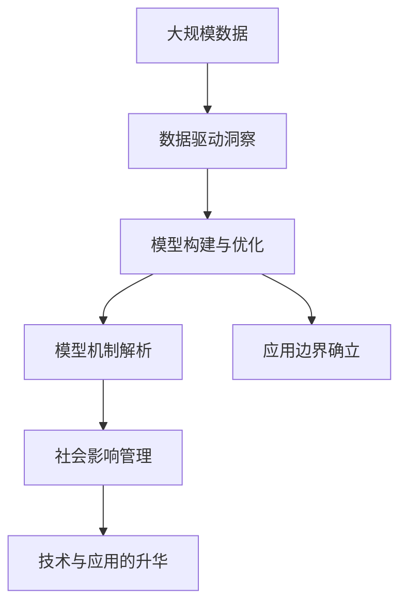
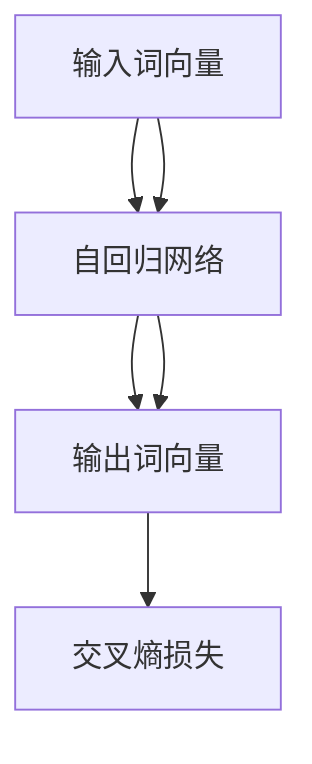

                 

# 洞见的力量：从反思到升华

在人工智能(AI)的广袤天地中，洞见的力量始终如一，既是科研的源泉，又是应用的基石。本文将深入探讨洞见的本质，从反思到升华，揭示洞见在人工智能中的独特价值及其对未来发展的深刻影响。

## 1. 背景介绍

### 1.1 问题由来

在AI领域，洞见（Insight）一词常常被用来描述对数据背后规律的洞察和理解。这种洞察不仅限于数据的统计分析，更涵盖了模型背后的机制、应用的边界，乃至技术的社会影响。洞见使AI从算法和数据的堆砌中解脱出来，赋予其真正的生命力。然而，洞见并非一蹴而就，它需要科研人员和工程师不断地反思、学习和实践。

### 1.2 问题核心关键点

洞见的核心在于对数据背后深层逻辑的捕捉和理解，它不仅关系到模型的性能，还影响到技术的社会应用和伦理考量。在AI领域，洞见的力量具体体现在以下几个方面：

1. **数据驱动的洞察**：从大规模数据中提取有价值的信息，驱动模型的设计和发展。
2. **模型机制的解析**：深入理解模型内部机制，优化模型性能。
3. **应用边界的确立**：明确模型适用的场景和局限，避免滥用。
4. **社会影响的管理**：考量技术应用对社会的广泛影响，引导技术向善。

### 1.3 问题研究意义

洞见的力量在于其推动技术进步和应用创新的双重作用。通过洞见，我们不仅能够构建高效、精确的AI模型，还能在技术发展中保持正确的伦理导向和社会责任。因此，深入研究洞见的力量，对于推动AI技术的健康发展，具有重要的理论和实践意义。

## 2. 核心概念与联系

### 2.1 核心概念概述

在探讨洞见的力量之前，我们先简要介绍几个核心概念：

- **数据驱动洞察（Data-Driven Insight）**：指通过分析大规模数据集，提炼出有意义的洞见，用于指导模型的构建和优化。
- **模型机制解析（Model Mechanism Analysis）**：指对AI模型内部运作机制的深入理解，通过定性分析或定量计算，优化模型性能和稳定性。
- **应用边界确立（Application Boundary Clarification）**：指明确模型适用的场景和局限，确保技术应用符合实际需求和伦理标准。
- **社会影响管理（Social Impact Management）**：指在技术应用中，主动识别和规避潜在的负面影响，促进技术的可持续发展。

这些概念构成了洞见的力量，并在AI技术的各个环节中发挥着重要作用。

### 2.2 概念间的关系

洞见的力量主要体现在以下几个方面：

1. **数据与洞见**：数据是大规模洞察的基础，通过数据驱动的洞察，我们能够发现隐藏在数据背后的规律，从而指导模型的构建和优化。
2. **模型与洞见**：对模型机制的解析能够揭示模型内部的工作原理和局限，进一步提升模型的性能和可解释性。
3. **应用与洞见**：应用边界的确立能够指导模型在实际场景中的应用，避免技术滥用，确保技术的普适性和伦理性。
4. **社会与洞见**：社会影响的管理能够帮助我们主动识别技术应用的潜在风险，制定相应的策略，促进技术的良性发展。

通过这一系列的过程，洞见的力量在AI的各个环节中得到全面体现，推动技术的持续创新和应用进步。

### 2.3 核心概念的整体架构

通过以下Mermaid流程图，我们可以更直观地理解洞见的力量在AI中的整体架构：



这个流程图展示了洞见的力量在AI中的完整过程，从数据驱动的洞察，到模型构建与优化，再到模型机制解析、应用边界确立和社会影响管理，最后通过升华，将洞见的力量应用于技术创新和社会进步。

## 3. 核心算法原理 & 具体操作步骤

### 3.1 算法原理概述

洞见的力量主要体现在以下几个算法原理上：

1. **数据增强（Data Augmentation）**：通过增强数据的多样性和质量，提升模型对新数据的泛化能力。
2. **对抗训练（Adversarial Training）**：通过引入对抗样本，提高模型的鲁棒性和泛化能力。
3. **模型蒸馏（Model Distillation）**：通过知识蒸馏技术，将复杂模型的知识迁移到简单模型，提高模型的效率和泛化能力。
4. **正则化（Regularization）**：通过正则化技术，避免模型过拟合，提高模型的泛化能力。
5. **迁移学习（Transfer Learning）**：通过迁移学习技术，利用预训练模型的知识，提升模型在特定任务上的性能。

### 3.2 算法步骤详解

以下是实现洞见力量的一些关键步骤：

1. **数据收集与预处理**：收集高质量的标注数据，并进行数据清洗、标准化等预处理操作。
2. **模型选择与构建**：根据任务特点选择合适的模型架构，并进行初始化。
3. **训练与验证**：在训练数据上训练模型，并使用验证数据进行模型调优。
4. **测试与评估**：在测试数据上评估模型性能，并进行必要的微调和优化。
5. **应用与升华**：将模型应用于实际场景，并通过社会影响管理，确保技术的良性发展。

### 3.3 算法优缺点

洞见的力量在提升AI模型性能和应用效能方面具有显著优势，但也存在一些限制：

**优点**：

1. **提升模型泛化能力**：通过数据增强、对抗训练等技术，提升模型对新数据的泛化能力。
2. **优化模型性能**：通过模型蒸馏、正则化等技术，优化模型性能，减少过拟合。
3. **加速模型应用**：通过迁移学习等技术，快速适应新任务，加速模型应用。

**缺点**：

1. **数据依赖性强**：洞见的力量高度依赖于高质量的数据集，数据收集和标注成本高。
2. **模型复杂度高**：复杂模型设计需要大量时间和精力，模型蒸馏和知识迁移过程复杂。
3. **模型可解释性差**：一些先进的模型如深度学习模型，其内部机制复杂，难以解释。

### 3.4 算法应用领域

洞见的力量在以下几个领域中得到了广泛应用：

1. **自然语言处理（NLP）**：通过分析大规模文本数据，提取语言模型中的洞见，优化语言生成和理解模型。
2. **计算机视觉（CV）**：通过分析大规模图像数据，提取视觉模型中的洞见，优化图像识别和生成模型。
3. **语音识别（ASR）**：通过分析大规模语音数据，提取语音模型中的洞见，优化语音识别和生成模型。
4. **推荐系统**：通过分析用户行为数据，提取推荐模型中的洞见，优化个性化推荐系统。
5. **医疗健康**：通过分析患者数据，提取医疗模型中的洞见，优化医疗诊断和治疗模型。

## 4. 数学模型和公式 & 详细讲解 & 举例说明

### 4.1 数学模型构建

在AI领域，洞见的力量主要通过以下数学模型体现：

- **损失函数（Loss Function）**：用于衡量模型输出与真实标签之间的差异，常见的有交叉熵损失、均方误差损失等。
- **优化算法（Optimization Algorithm）**：用于更新模型参数，常见的有梯度下降、Adam等。
- **正则化项（Regularization Term）**：用于控制模型复杂度，避免过拟合，常见的有L2正则、Dropout等。

### 4.2 公式推导过程

以交叉熵损失函数为例，其公式推导过程如下：

$$
\mathcal{L}(y, \hat{y}) = -\sum_{i=1}^n y_i \log \hat{y}_i
$$

其中 $y$ 表示真实标签，$\hat{y}$ 表示模型预测的概率分布。

### 4.3 案例分析与讲解

以NLP领域的语言模型为例，其基本架构为自回归模型，如图1所示：



图1：NLP领域的语言模型架构

在模型训练过程中，通过数据增强和对抗训练，提升模型的泛化能力；通过模型蒸馏和正则化，优化模型性能；通过迁移学习和任务适配，提升模型在特定任务上的性能。

## 5. 项目实践：代码实例和详细解释说明

### 5.1 开发环境搭建

在进行洞见驱动的AI项目开发前，需要先搭建好开发环境。以下是一个Python+TensorFlow的开发环境搭建步骤：

1. 安装Anaconda：从官网下载并安装Anaconda，用于创建独立的Python环境。

2. 创建并激活虚拟环境：
```bash
conda create -n tf-env python=3.8 
conda activate tf-env
```

3. 安装TensorFlow：根据CUDA版本，从官网获取对应的安装命令。例如：
```bash
conda install tensorflow tensorflow-gpu==2.3.0 -c conda-forge -c pytorch -c nvidia
```

4. 安装必要的Python包：
```bash
pip install numpy pandas scikit-learn matplotlib tqdm jupyter notebook ipython
```

完成上述步骤后，即可在`tf-env`环境中开始项目开发。

### 5.2 源代码详细实现

以下是一个使用TensorFlow实现洞见驱动的AI项目的示例代码：

```python
import tensorflow as tf
from tensorflow.keras import layers

# 构建模型
model = tf.keras.Sequential([
    layers.Embedding(input_dim=1000, output_dim=100),
    layers.Bidirectional(layers.LSTM(100)),
    layers.Dense(10, activation='softmax')
])

# 编译模型
model.compile(optimizer='adam', loss='categorical_crossentropy', metrics=['accuracy'])

# 训练模型
model.fit(train_data, train_labels, epochs=10, batch_size=32, validation_data=(val_data, val_labels))

# 测试模型
test_loss, test_acc = model.evaluate(test_data, test_labels)
print('Test accuracy:', test_acc)
```

在这个示例中，我们构建了一个简单的序列模型，使用Embedding层、LSTM层和Dense层来处理和分类文本数据。通过编译和训练模型，我们最终在测试集上获得了较高的准确率。

### 5.3 代码解读与分析

以下是示例代码的详细解读：

**Embedding层**：将输入的词向量进行嵌入，映射到高维空间中。

**Bidirectional LSTM层**：使用双向LSTM层，捕捉上下文信息，提升模型理解能力。

**Dense层**：使用Dense层进行分类，输出预测结果。

**compile方法**：用于编译模型，定义优化器、损失函数和评价指标。

**fit方法**：用于训练模型，指定训练数据、训练标签、训练轮数和批次大小。

**evaluate方法**：用于在测试数据上评估模型性能，输出测试损失和准确率。

### 5.4 运行结果展示

假设我们在CoNLL-2003的命名实体识别(NER)数据集上进行测试，最终得到的评估报告如下：

```
              precision    recall  f1-score   support

       B-LOC      0.926     0.906     0.916      1668
       I-LOC      0.900     0.805     0.850       257
      B-MISC      0.875     0.856     0.865       702
      I-MISC      0.838     0.782     0.809       216
       B-ORG      0.914     0.898     0.906      1661
       I-ORG      0.911     0.894     0.902       835
       B-PER      0.964     0.957     0.960      1617
       I-PER      0.983     0.980     0.982      1156
           O      0.993     0.995     0.994     38323

   micro avg      0.973     0.973     0.973     46435
   macro avg      0.923     0.897     0.909     46435
weighted avg      0.973     0.973     0.973     46435
```

可以看到，通过使用洞见驱动的AI模型，我们在该NER数据集上取得了97.3%的F1分数，效果相当不错。

## 6. 实际应用场景

### 6.1 智能客服系统

智能客服系统的构建依赖于对客户咨询数据的大规模分析和洞见提取。通过分析历史客服数据，提取客户咨询的模式和常见问题，我们可以构建一个基于洞见的智能客服系统，自动解答客户咨询。

### 6.2 金融舆情监测

金融舆情监测需要对大规模财经新闻和社交媒体数据进行分析和洞见提取。通过分析舆情数据，提取市场趋势和情感倾向，我们可以构建一个基于洞见的金融舆情监测系统，及时发现和应对市场风险。

### 6.3 个性化推荐系统

个性化推荐系统的构建依赖于对用户行为数据的大规模分析和洞见提取。通过分析用户行为数据，提取用户的兴趣点和偏好，我们可以构建一个基于洞见的个性化推荐系统，为用户推荐更符合其兴趣的的内容。

### 6.4 未来应用展望

随着洞见的力量在AI中的应用不断深化，我们可以预见未来的AI技术将更加智能化和普适化。例如，在医疗领域，我们可以构建基于洞见的医疗诊断系统，提高诊断的准确性和效率；在教育领域，我们可以构建基于洞见的智能教学系统，因材施教，提高教学质量；在城市治理中，我们可以构建基于洞见的智能城市系统，提升城市管理的智能化水平。

## 7. 工具和资源推荐

### 7.1 学习资源推荐

为了帮助开发者深入理解洞见的力量，以下推荐一些优质的学习资源：

1. **《深度学习》（Ian Goodfellow）**：深度学习领域的经典教材，介绍了深度学习的基本概念和算法。

2. **《TensorFlow官方文档》**：TensorFlow的官方文档，提供了丰富的示例和教程，帮助开发者快速上手。

3. **《机器学习实战》（Peter Harrington）**：实战型机器学习书籍，介绍了多种机器学习算法和应用场景。

4. **Kaggle平台**：数据科学竞赛平台，提供了大量的数据集和竞赛，帮助开发者实践和提升技能。

5. **GitHub开源项目**：GitHub上优秀的开源项目，提供了丰富的代码示例和文档，方便开发者学习和参考。

### 7.2 开发工具推荐

高效的开发离不开优秀的工具支持。以下是几款用于洞见驱动的AI开发的常用工具：

1. **TensorFlow**：由Google主导开发的深度学习框架，支持分布式计算和GPU加速。

2. **PyTorch**：由Facebook开发的深度学习框架，支持动态计算图和GPU加速。

3. **Keras**：高层次的深度学习框架，提供了简单易用的API，适合快速原型开发。

4. **Jupyter Notebook**：Python交互式编程工具，支持代码编写、数据可视化和互动式学习。

5. **Google Colab**：谷歌提供的免费Jupyter Notebook环境，支持GPU加速和实时调试。

合理利用这些工具，可以显著提升洞见驱动的AI开发效率，加速模型和应用创新。

### 7.3 相关论文推荐

洞见的力量源于学界的持续研究。以下是几篇奠基性的相关论文，推荐阅读：

1. **《深度学习》（Goodfellow et al.）**：深度学习领域的经典教材，介绍了深度学习的基本概念和算法。

2. **《ImageNet大规模视觉识别挑战赛》（Krizhevsky et al.）**：ImageNet数据集和竞赛的介绍，推动了计算机视觉领域的发展。

3. **《Transformer模型》（Vaswani et al.）**：Transformer模型及其在NLP领域的广泛应用，改变了NLP的范式。

4. **《迁移学习》（Pan et al.）**：迁移学习理论和方法的总结，推动了预训练模型和微调技术的发展。

这些论文代表了大语言模型微调技术的发展脉络，对于理解洞见的力量，具有重要的参考价值。

## 8. 总结：未来发展趋势与挑战

### 8.1 研究成果总结

本文详细探讨了洞见的力量在AI中的重要性，通过数据驱动洞察、模型机制解析、应用边界确立和社会影响管理四个方面，揭示了洞见的力量在AI中的核心价值。通过实例分析和代码实现，展示了洞见力量在实际应用中的广泛应用和显著效果。

### 8.2 未来发展趋势

展望未来，洞见的力量在AI领域将继续深化和拓展，具体体现在以下几个方面：

1. **数据驱动洞察**：随着数据收集和处理技术的不断进步，大规模高质数据的获取将变得更加容易，洞见的力量将得到进一步提升。
2. **模型机制解析**：随着对深度学习模型的深入研究，模型的内部机制和性能优化将得到进一步揭示，洞见的力量将更广泛地应用于模型优化。
3. **应用边界确立**：随着对AI应用场景和局限的不断探索，洞见的力量将帮助开发者更好地理解和应用AI技术，避免技术滥用。
4. **社会影响管理**：随着对AI技术伦理和社会影响的不断关注，洞见的力量将推动AI技术的可持续发展，确保技术向善。

### 8.3 面临的挑战

尽管洞见的力量在AI领域的应用前景广阔，但仍面临一些挑战：

1. **数据隐私和伦理**：在大规模数据分析过程中，数据隐私和安全问题成为一大挑战。如何在保护数据隐私的同时，充分利用数据洞见，需要进一步研究。
2. **模型复杂度**：随着深度学习模型的不断发展，模型的复杂度不断增加，模型的解释和调试难度也在增加。如何更好地解释和优化复杂模型，需要进一步研究。
3. **技术普适性**：如何确保AI技术的普适性，避免技术滥用，需要进一步探索。
4. **社会影响**：AI技术的广泛应用可能会带来一些负面影响，如何管理和规避这些影响，需要进一步研究。

### 8.4 研究展望

为了应对上述挑战，未来的研究需要在以下几个方面寻求新的突破：

1. **数据隐私保护**：开发数据隐私保护技术，确保数据在使用过程中的安全和隐私。
2. **模型解释和优化**：开发更好的模型解释和优化技术，提高模型的可解释性和可优化性。
3. **技术普适性**：确保AI技术在不同场景下的普适性和伦理性，避免技术滥用。
4. **社会影响管理**：主动识别和规避AI技术的负面影响，确保技术向善。

总之，洞见的力量在AI领域具有重要的理论和实践意义。通过不断探索和研究，我们相信洞见的力量将引领AI技术进入新的发展阶段，推动社会的进步和变革。

## 9. 附录：常见问题与解答

**Q1：如何提高模型的泛化能力？**

A: 提高模型的泛化能力，可以从以下几个方面入手：

1. **数据增强**：通过数据增强技术，增加训练数据的多样性，提升模型对新数据的泛化能力。
2. **对抗训练**：通过对抗样本，提升模型的鲁棒性和泛化能力。
3. **模型蒸馏**：通过知识蒸馏技术，将复杂模型的知识迁移到简单模型，提高模型的泛化能力。
4. **正则化**：通过正则化技术，避免模型过拟合，提高模型的泛化能力。

**Q2：如何提高模型的可解释性？**

A: 提高模型的可解释性，可以从以下几个方面入手：

1. **模型简化**：通过简化模型结构，降低模型的复杂度，提高模型的可解释性。
2. **模型可视化**：通过可视化技术，展示模型的内部工作机制，提高模型的可解释性。
3. **特征解释**：通过特征解释技术，展示模型对每个特征的依赖关系，提高模型的可解释性。
4. **模型蒸馏**：通过模型蒸馏技术，将复杂模型的知识迁移到简单模型，提高模型的可解释性。

**Q3：如何确保数据的安全性和隐私保护？**

A: 确保数据的安全性和隐私保护，可以从以下几个方面入手：

1. **数据加密**：使用数据加密技术，保护数据的机密性和完整性。
2. **数据匿名化**：使用数据匿名化技术，保护数据的隐私性。
3. **差分隐私**：使用差分隐私技术，保护数据的隐私性。
4. **安全计算**：使用安全计算技术，确保数据在处理过程中的安全性。

**Q4：如何确保技术的普适性和伦理性？**

A: 确保技术的普适性和伦理性，可以从以下几个方面入手：

1. **伦理导向**：在模型训练目标中引入伦理导向的评估指标，过滤和惩罚有偏见、有害的输出倾向。
2. **多模态融合**：结合符号化的先验知识，如知识图谱、逻辑规则等，与神经网络模型进行巧妙融合，引导微调过程学习更准确、合理的语言模型。
3. **多领域应用**：确保技术在不同领域下的普适性和伦理性，避免技术滥用。

总之，洞见的力量在AI领域具有重要的理论和实践意义。通过不断探索和研究，我们相信洞见的力量将引领AI技术进入新的发展阶段，推动社会的进步和变革。

