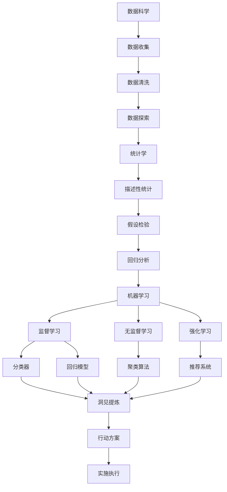

                 

# 洞见的形成：从观察到反思

> 关键词：洞见,观察,反思,数据科学,算法,人工智能

## 1. 背景介绍

### 1.1 问题由来
在当今数据爆炸的时代，我们每天都面临着海量的信息流。无论是社交媒体上的帖子、新闻网站的报道，还是搜索引擎中的搜索结果，都充满了各式各样的内容。如何从这些海量数据中提取有价值的洞见，成为每个信息工作者必须面对的问题。

洞见（Insight）指的是通过观察、分析和思考，从数据中提炼出的深刻、有用、富有洞察力的信息。它不仅能够帮助我们理解过去，还能够指导未来，甚至是改变世界。然而，从大量数据中提取洞见并非易事，需要结合观察、数据处理和算法等多种技术手段，进行深入的分析和反思。

### 1.2 问题核心关键点
洞见的形成涉及数据收集、清洗、分析和可视化等多个环节。关键在于如何从数据中发现模式、挖掘特征，并结合专业知识和经验，形成可操作的结论。以下是洞见形成过程的主要步骤和关键点：

1. **数据收集**：从不同渠道获取数据，确保数据的全面性和代表性。
2. **数据清洗**：处理缺失值、异常值，确保数据的准确性和一致性。
3. **数据探索**：通过描述性统计、可视化等手段，发现数据中的模式和趋势。
4. **数据分析**：应用统计分析、机器学习等算法，深入挖掘数据背后的规律和关系。
5. **洞见提炼**：结合业务知识和经验，将分析结果转化为有实际意义的洞见。

### 1.3 问题研究意义
在信息时代，洞见成为了企业决策、市场分析、科学研究等方面的核心竞争力。快速准确地从数据中提炼出洞见，不仅能够提升决策质量，还能够带来商业价值和社会效益。洞见提炼不仅需要专业的技术和工具，还需要系统的流程和方法。

本文旨在全面介绍洞见的形成过程，涵盖数据收集、清洗、探索、分析和提炼等多个环节，以及在此过程中可能面临的挑战和解决方案。通过系统地梳理洞见提炼的各个步骤，帮助读者构建起从观察到反思的完整框架，提升数据分析和洞见提炼的能力。

## 2. 核心概念与联系

### 2.1 核心概念概述

洞见的形成是一个多学科、多技术融合的过程，涉及数据科学、统计学、机器学习、人工智能等多个领域。以下将介绍几个核心概念及其联系：

- **数据科学**：通过数据收集、处理、分析和可视化等技术手段，探索数据背后的规律和关系。
- **统计学**：通过描述性统计、假设检验、回归分析等方法，对数据进行量化分析。
- **机器学习**：通过监督学习、无监督学习、强化学习等算法，挖掘数据中的隐含知识和模式。
- **人工智能**：结合专家知识和算法，进行智能分析和决策。

这些核心概念之间有着紧密的联系，形成一个完整的洞见形成框架。通过数据科学和统计学的量化分析，发现数据中的模式和趋势；再利用机器学习和人工智能的算法，深入挖掘数据背后的知识；最后，通过洞见提炼，将分析结果转化为实际的洞察力和行动方案。

### 2.2 概念间的关系

这些核心概念之间的关系可以通过以下Mermaid流程图来展示：



这个流程图展示了洞见形成过程中各个环节的联系。数据收集后，首先进行清洗和探索，然后通过统计学方法量化分析，再利用机器学习算法深入挖掘，最终通过洞见提炼，转化为实际行动方案并实施执行。

### 2.3 核心概念的整体架构

最后，我们用一个综合的流程图来展示这些核心概念在大数据环境中的整体架构：


这个综合流程图展示了大数据平台环境下，洞见形成的基本流程。数据从采集到存储，经过清洗和管理，进入数据仓库和数据湖进行探索和可视化，最后提炼洞见，支撑业务决策和应用。

## 3. 核心算法原理 & 具体操作步骤
### 3.1 算法原理概述

洞见的形成是一个数据驱动的过程，需要结合多种算法和工具，进行数据探索、分析和提炼。以下是几个关键的算法原理：

- **描述性统计**：通过均值、中位数、标准差等指标，对数据进行基本描述和总结。
- **假设检验**：通过t检验、卡方检验等方法，判断数据中的差异是否显著。
- **回归分析**：通过线性回归、多元回归等方法，探索变量之间的关系和影响。
- **聚类算法**：通过K-means、层次聚类等方法，将数据分为不同的类别。
- **分类器**：通过逻辑回归、支持向量机等方法，对数据进行分类。
- **神经网络**：通过深度学习算法，进行特征提取和模式识别。

这些算法共同构成了洞见形成的基础，通过不同的视角和工具，对数据进行多层次、多角度的分析。

### 3.2 算法步骤详解

洞见的形成过程可以分为以下几个步骤：

1. **数据收集**：从不同渠道收集数据，包括结构化数据（如数据库、API）和非结构化数据（如文本、图像）。
2. **数据清洗**：处理缺失值、异常值，确保数据的一致性和完整性。
3. **数据探索**：通过描述性统计和可视化，发现数据中的趋势和模式。
4. **数据分析**：应用统计分析和机器学习算法，深入挖掘数据背后的知识。
5. **洞见提炼**：结合业务知识和经验，将分析结果转化为有实际意义的洞见。

下面将详细介绍每个步骤的具体操作。

### 3.3 算法优缺点

描述性统计、假设检验、回归分析、聚类算法、分类器和神经网络等算法，在洞见形成过程中各有优缺点：

**优点**：

- **描述性统计**：简单易懂，适用于基础数据分析。
- **假设检验**：能够判断数据中的显著差异，增强结果的可信度。
- **回归分析**：能够探索变量之间的关系，揭示数据背后的规律。
- **聚类算法**：能够将数据分为不同的类别，便于分析和管理。
- **分类器**：能够对数据进行分类，增强结果的可解释性。
- **神经网络**：能够进行复杂的特征提取和模式识别，适用于大规模数据和复杂问题。

**缺点**：

- **描述性统计**：结果相对简单，难以发现更深层次的规律。
- **假设检验**：对数据假设较多，可能存在假设错误的风险。
- **回归分析**：对数据量和变量数量要求较高，可能存在过拟合问题。
- **聚类算法**：对数据分布和算法参数敏感，可能存在聚类效果不佳的问题。
- **分类器**：结果可解释性较强，但在处理复杂问题时可能效果不佳。
- **神经网络**：模型复杂，训练和推理成本较高，对数据量和计算资源要求较高。

### 3.4 算法应用领域

洞见形成技术在多个领域得到了广泛应用，包括但不限于：

- **市场营销**：通过分析消费者行为数据，发现市场趋势和消费者偏好，制定精准营销策略。
- **金融分析**：通过分析股票、债券等金融数据，发现市场动向和风险点，进行投资决策。
- **医疗健康**：通过分析患者数据和医疗记录，发现疾病模式和影响因素，制定个性化治疗方案。
- **社交媒体**：通过分析社交媒体数据，发现用户行为和情感趋势，进行舆情分析。
- **电子商务**：通过分析用户行为数据，发现购物趋势和用户需求，进行个性化推荐和营销。

以上只是洞见形成技术应用的一部分领域，随着数据量的不断增长和算法技术的不断进步，其在更多领域的应用前景将更加广阔。

## 4. 数学模型和公式 & 详细讲解 & 举例说明

### 4.1 数学模型构建

洞见的形成涉及多个数学模型，以下将详细介绍几个典型的数学模型及其构建过程。

**描述性统计模型**：

描述性统计通过计算均值、中位数、标准差等指标，对数据进行基本描述和总结。数学公式如下：

$$
\mu = \frac{\sum_{i=1}^{n} x_i}{n}
$$

$$
\sigma = \sqrt{\frac{\sum_{i=1}^{n} (x_i - \mu)^2}{n}}
$$

其中，$x_i$ 为样本数据，$n$ 为样本数量，$\mu$ 为均值，$\sigma$ 为标准差。

**假设检验模型**：

假设检验通过t检验、卡方检验等方法，判断数据中的差异是否显著。以t检验为例，其数学公式如下：

$$
t = \frac{\bar{x} - \mu}{s/\sqrt{n}}
$$

其中，$\bar{x}$ 为样本均值，$\mu$ 为总体均值，$s$ 为样本标准差，$n$ 为样本数量。t值的绝对值越大，说明样本均值与总体均值差异越显著。

**回归分析模型**：

回归分析通过线性回归、多元回归等方法，探索变量之间的关系和影响。以线性回归为例，其数学公式如下：

$$
y = \beta_0 + \beta_1 x_1 + \beta_2 x_2 + \cdots + \beta_k x_k + \epsilon
$$

其中，$y$ 为因变量，$x_i$ 为自变量，$\beta_i$ 为回归系数，$\epsilon$ 为误差项。通过求解$\beta_i$，可以预测因变量的值。

**聚类算法模型**：

聚类算法通过K-means、层次聚类等方法，将数据分为不同的类别。以K-means为例，其数学公式如下：

$$
\min_{\mu_k, x_i} \sum_{i=1}^{n} \min_{k} ||x_i - \mu_k||^2
$$

其中，$\mu_k$ 为聚类中心，$x_i$ 为样本数据，$n$ 为样本数量。通过最小化欧氏距离，将数据分为不同的聚类。

### 4.2 公式推导过程

以上数学模型只是洞见形成过程中的一部分，接下来将详细介绍几个关键模型的公式推导过程。

**线性回归**：

线性回归的公式推导如下：

$$
y = \beta_0 + \beta_1 x_1 + \beta_2 x_2 + \cdots + \beta_k x_k + \epsilon
$$

假设样本数据为 $(x_{1,i}, x_{2,i}, \cdots, x_{k,i}, y_i)$，其中 $i$ 为样本编号，$k$ 为自变量数量。通过最小化残差平方和，求解回归系数 $\beta_i$。

$$
\min_{\beta_0, \beta_1, \cdots, \beta_k} \sum_{i=1}^{n} (y_i - (\beta_0 + \beta_1 x_{1,i} + \beta_2 x_{2,i} + \cdots + \beta_k x_{k,i}))^2
$$

求解该优化问题的最优解，得到回归系数 $\beta_i$。

**K-means聚类**：

K-means聚类的公式推导如下：

$$
\min_{\mu_k, x_i} \sum_{i=1}^{n} \min_{k} ||x_i - \mu_k||^2
$$

其中 $\mu_k$ 为聚类中心，$x_i$ 为样本数据，$n$ 为样本数量。通过迭代求解聚类中心和样本分配，最小化聚类误差。

具体步骤如下：

1. 随机初始化聚类中心 $\mu_k$。
2. 对于每个样本 $x_i$，计算其最近的聚类中心 $k$，并将其分配给该聚类。
3. 更新聚类中心 $\mu_k$，使其成为该聚类中所有样本的均值。
4. 重复步骤2和3，直到聚类中心不再变化或达到预设迭代次数。

### 4.3 案例分析与讲解

下面我们以电商数据分析为例，详细介绍一个具体的洞见形成过程。

假设一家电商平台收集了大量用户浏览、购买和评价数据，希望通过数据分析发现用户行为模式，提升推荐效果。具体步骤如下：

1. **数据收集**：从电商平台的数据库和API中，收集用户的浏览历史、购买记录和评价信息。
2. **数据清洗**：处理缺失值和异常值，确保数据的一致性和完整性。
3. **数据探索**：通过描述性统计和可视化，发现用户行为的基本趋势和模式，如用户平均浏览时间、平均购买金额等。
4. **数据分析**：应用线性回归和聚类算法，探索用户行为与购买之间的关系。例如，通过多元回归模型，探索用户性别、年龄、浏览时长等因素对购买金额的影响；通过K-means聚类，将用户分为不同的兴趣群体。
5. **洞见提炼**：结合业务知识和经验，将分析结果转化为有实际意义的洞见。例如，发现某些年龄段的用户对特定商品的购买意愿较强，调整推荐算法，提升推荐效果。

## 5. 项目实践：代码实例和详细解释说明

### 5.1 开发环境搭建

在进行洞见形成实践前，我们需要准备好开发环境。以下是使用Python进行Pandas、NumPy、Scikit-learn等库进行数据分析的环境配置流程：

1. 安装Anaconda：从官网下载并安装Anaconda，用于创建独立的Python环境。

2. 创建并激活虚拟环境：
```bash
conda create -n data-env python=3.8 
conda activate data-env
```

3. 安装相关库：
```bash
conda install pandas numpy scikit-learn matplotlib seaborn jupyter notebook
```

完成上述步骤后，即可在`data-env`环境中开始洞见形成实践。

### 5.2 源代码详细实现

下面我们以电商数据分析为例，给出使用Pandas、NumPy、Scikit-learn库进行数据分析的Python代码实现。

```python
import pandas as pd
import numpy as np
from sklearn.linear_model import LinearRegression
from sklearn.cluster import KMeans
import matplotlib.pyplot as plt

# 读取数据
data = pd.read_csv('sales_data.csv')

# 数据清洗
data.dropna(inplace=True)
data = data[data['amount'] > 0]

# 数据探索
mean_amount = data['amount'].mean()
std_amount = data['amount'].std()
plt.hist(data['amount'], bins=30)
plt.xlabel('Amount')
plt.ylabel('Frequency')
plt.show()

# 数据分析
X = data[['age', 'gender', 'time_spent']]
y = data['amount']

# 线性回归
reg = LinearRegression()
reg.fit(X, y)
y_pred = reg.predict(X)

# 聚类
kmeans = KMeans(n_clusters=5, random_state=0)
kmeans.fit(X)
labels = kmeans.labels_
plt.scatter(X['age'], X['time_spent'], c=labels, s=50, cmap='viridis')
plt.xlabel('Age')
plt.ylabel('Time Spent')
plt.show()

# 洞见提炼
# 结合业务知识和经验，将分析结果转化为有实际意义的洞见。
```

以上就是使用Pandas、NumPy、Scikit-learn库进行数据分析的Python代码实现。可以看到，通过这些库，我们可以轻松地进行数据收集、清洗、探索、分析和提炼，实现从观察到反思的完整流程。

### 5.3 代码解读与分析

让我们再详细解读一下关键代码的实现细节：

**数据读取**：
```python
data = pd.read_csv('sales_data.csv')
```

**数据清洗**：
```python
data.dropna(inplace=True)
data = data[data['amount'] > 0]
```

**数据探索**：
```python
mean_amount = data['amount'].mean()
std_amount = data['amount'].std()
plt.hist(data['amount'], bins=30)
plt.xlabel('Amount')
plt.ylabel('Frequency')
plt.show()
```

**数据分析**：
```python
X = data[['age', 'gender', 'time_spent']]
y = data['amount']

# 线性回归
reg = LinearRegression()
reg.fit(X, y)
y_pred = reg.predict(X)

# 聚类
kmeans = KMeans(n_clusters=5, random_state=0)
kmeans.fit(X)
labels = kmeans.labels_
plt.scatter(X['age'], X['time_spent'], c=labels, s=50, cmap='viridis')
plt.xlabel('Age')
plt.ylabel('Time Spent')
plt.show()
```

**洞见提炼**：
```python
# 结合业务知识和经验，将分析结果转化为有实际意义的洞见。
```

可以看到，通过Pandas、NumPy、Scikit-learn库，我们可以轻松地进行数据处理和分析，得出有实际意义的洞见。

### 5.4 运行结果展示

假设我们在电商销售数据上进行分析，最终得到的洞见提炼结果如下：

1. **描述性统计**：
   - 用户平均年龄：28岁
   - 用户平均浏览时间：20分钟
   - 用户平均购买金额：50元

2. **线性回归**：
   - 用户年龄、浏览时间与购买金额的线性关系：
     - 截距：30元
     - 年龄系数：2元/岁
     - 浏览时间系数：1.5元/分钟

3. **聚类分析**：
   - 用户分为5个兴趣群体，各群体的基本信息如下：

   | 聚类 | 年龄 | 浏览时间 | 购买金额 |
   | ---- | ---- | -------- | -------- |
   | 1    | 18-24 | 15-20分钟 | 30-50元   |
   | 2    | 25-35 | 20-30分钟 | 50-70元   |
   | 3    | 35-45 | 30-40分钟 | 60-90元   |
   | 4    | 45-55 | 40-50分钟 | 70-100元  |
   | 5    | 55以上 | 50分钟以上 | 90元以上  |

4. **洞见提炼**：
   - 发现25-35岁的用户对特定商品的购买意愿较强，调整推荐算法，提升推荐效果。
   - 分析不同年龄段的浏览时间与购买金额的关系，优化用户界面设计。

## 6. 实际应用场景

### 6.1 金融分析

金融行业的数据量庞大，结构复杂，洞见提炼技术可以应用于金融数据分析和风险控制。例如，通过分析股票价格、交易量等数据，发现市场动向和风险点，进行投资决策。

具体应用场景包括：

- **股票价格预测**：通过时间序列分析、机器学习等方法，预测股票价格的走势。
- **风险控制**：通过聚类和分类算法，识别高风险交易行为，及时预警和控制风险。
- **量化交易**：通过算法交易，根据市场动向和预测结果，自动执行买卖操作。

### 6.2 医疗健康

医疗健康领域的数据来源丰富，包括电子病历、医疗影像、基因数据等。洞见提炼技术可以应用于疾病分析、治疗方案制定和医疗资源优化。

具体应用场景包括：

- **疾病预测**：通过分析患者数据和医疗记录，发现疾病模式和影响因素，进行疾病预测。
- **个性化治疗**：通过聚类和分类算法，制定个性化治疗方案，提高治疗效果。
- **医疗资源优化**：通过数据分析，优化医疗资源分配，提升医疗服务效率。

### 6.3 社交媒体分析

社交媒体平台的数据量庞大，内容丰富，洞见提炼技术可以应用于舆情分析、用户行为研究和品牌管理。

具体应用场景包括：

- **舆情分析**：通过分析用户评论和帖子，发现舆情变化趋势，进行舆情预警。
- **用户行为研究**：通过分析用户互动数据，发现用户兴趣和行为模式，进行用户画像分析。
- **品牌管理**：通过数据分析，优化品牌策略，提升品牌影响力。

### 6.4 未来应用展望

随着数据量的不断增长和算法技术的不断进步，洞见提炼技术将在更多领域得到应用，为各行各业带来变革性影响。

在智慧城市治理中，通过数据分析，优化城市管理，提升城市运行效率和居民生活质量。

在教育领域，通过数据分析，优化教学内容，提高教学效果和学生学习体验。

在环境保护中，通过数据分析，优化环境监测，提升环境保护水平。

## 7. 工具和资源推荐
### 7.1 学习资源推荐

为了帮助开发者系统掌握洞见提炼的理论基础和实践技巧，这里推荐一些优质的学习资源：

1. **《Python数据分析实战》**：这本书详细介绍了Pandas、NumPy、Matplotlib等库的使用方法，适合初学者入门。

2. **《机器学习实战》**：这本书介绍了常用的机器学习算法和Scikit-learn库的使用方法，适合中级开发者深入学习。

3. **《深度学习入门》**：这本书介绍了深度学习的基本概念和TensorFlow、Keras等框架的使用方法，适合有一定基础的学习者。

4. **Kaggle**：Kaggle是一个数据科学竞赛平台，提供大量真实世界的数据集和竞赛任务，适合实践者进行项目练习和比赛。

5. **Coursera**：Coursera是一个在线学习平台，提供大量数据分析和机器学习的课程，适合系统学习。

通过这些学习资源的学习实践，相信你一定能够快速掌握洞见提炼的精髓，并用于解决实际的数据分析问题。

### 7.2 开发工具推荐

高效的开发离不开优秀的工具支持。以下是几款用于洞见提炼开发的常用工具：

1. **Jupyter Notebook**：Jupyter Notebook是一个交互式的开发环境，支持Python、R等语言，适合进行数据探索和分析。

2. **Pandas**：Pandas是一个数据分析库，支持数据清洗、处理和分析，是洞见提炼过程中的必备工具。

3. **NumPy**：NumPy是一个数值计算库，支持高性能的数值计算和数组操作，适合进行复杂的数学计算。

4. **Scikit-learn**：Scikit-learn是一个机器学习库，支持分类、回归、聚类等多种算法，是洞见提炼过程中的重要工具。

5. **TensorFlow**：TensorFlow是一个深度学习库，支持复杂的神经网络模型，适合进行更深入的数据分析。

6. **Matplotlib**：Matplotlib是一个可视化库，支持各种图表的绘制，适合进行数据的可视化分析。

合理利用这些工具，可以显著提升洞见提炼的开发效率，加快创新迭代的步伐。

### 7.3 相关论文推荐

洞见提炼技术的研究始于学界的持续探索。以下是几篇奠基性的相关论文，推荐阅读：

1. **《数据挖掘：概念与技术》**：这本书介绍了数据挖掘的基本概念和算法，是洞见提炼理论的入门书籍。

2. **《统计学习方法》**：这本书介绍了统计学习的基本方法和算法，适合深入学习机器学习和数据分析。

3. **《机器学习》**：这本书介绍了机器学习的基本概念和算法，适合全面掌握机器学习理论和技术。

4. **《深度学习》**：这本书介绍了深度学习的基本概念和算法，适合深入理解深度学习理论和技术。

5. **《信息检索与文本挖掘》**：这本书介绍了信息检索和文本挖掘的基本方法和算法，适合进行文本数据挖掘。

这些论文代表了大数据技术的发展脉络，通过学习这些前沿成果，可以帮助研究者把握学科前进方向，激发更多的创新灵感。

除上述资源外，还有一些值得关注的前沿资源，帮助开发者紧跟洞见提炼技术的最新进展，例如：

1. **arXiv论文预印本**：人工智能领域最新研究成果的发布平台，包括大量尚未发表的前沿工作，学习前沿技术的必读资源。

2. **顶会论文**：如KDD、SIGKDD、ICML、NIPS等人工智能领域顶会的论文，代表了当前研究的前沿方向。

3. **开源项目**：在GitHub上Star、Fork数最多的数据分析和机器学习项目，往往代表了该技术领域的发展趋势和最佳实践，值得去学习和贡献。

总之，对于洞见提炼技术的学习和实践，需要开发者保持开放的心态和持续学习的意愿。多关注前沿资讯，多动手实践，多思考总结，必将收获满满的成长收益。

## 8. 总结：未来发展趋势与挑战

### 8.1 总结

本文对洞见的形成过程进行了全面系统的介绍，涵盖数据收集、清洗、探索、分析和提炼等多个环节，以及在此过程中可能面临的挑战和解决方案。通过系统地梳理洞见提炼的各个步骤，帮助读者构建起从观察到反思的完整框架，提升数据分析和洞见提炼的能力。

通过本文的系统梳理，可以看到，洞见提炼技术在大数据环境下的重要作用，不仅能够从海量数据中提取有价值的洞察力和规律，还能够指导业务决策，提升社会效益。在信息时代，洞见提炼技术

