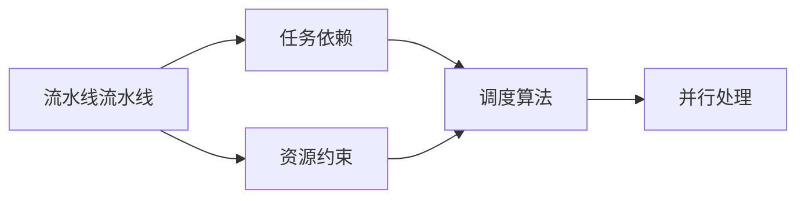
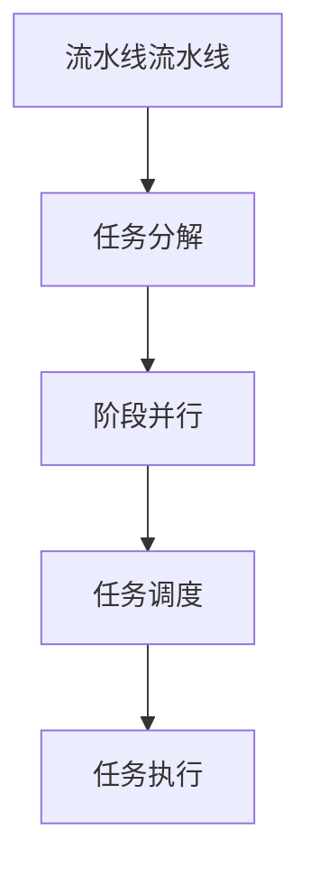
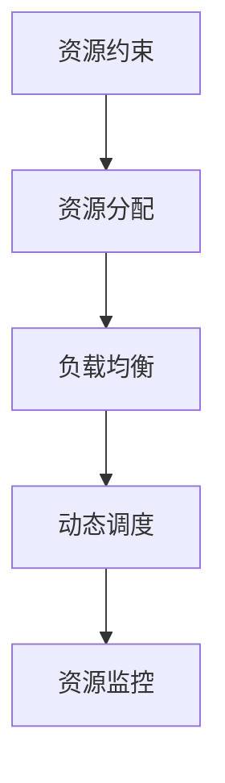

                 

## 1. 背景介绍

### 1.1 问题由来

随着信息技术的发展，流水线作业在生产制造、数据处理、软件工程等众多领域得到了广泛应用。流水线作业通过将任务分解为多个阶段，使各阶段独立并行执行，大大提高了生产效率和资源利用率。

然而，流水线作业也带来了许多挑战，如任务耦合度增加、资源利用率下降等问题。这些问题在数据处理、软件开发等复杂任务中尤为突出。如何在流水线作业中优化资源配置，提升系统性能，成为研究的热点问题。

### 1.2 问题核心关键点

本文聚焦于流水线作业中资源分配和任务调度的方法，从原理到实践，详细讲解了流水线作业的核心概念和关键技术，并探讨了其在实际应用中的优化策略。

## 2. 核心概念与联系

### 2.1 核心概念概述

为更好地理解流水线作业，本节将介绍几个密切相关的核心概念：

- 流水线流水线（Pipeline）：指将一个任务分解为多个阶段，并行执行的过程。每个阶段只负责部分任务，减少了任务的耦合性，提高了处理效率。
- 任务依赖（Task Dependency）：指任务之间相互依赖的关系，即一个任务的输出成为另一个任务的输入。正确处理任务依赖是流水线作业的关键。
- 资源约束（Resource Constraint）：指在流水线作业中，各种资源（如CPU、内存、网络等）的有限性，必须合理分配才能满足任务需求。
- 调度算法（Scheduling Algorithm）：指在流水线作业中，如何合理安排任务执行顺序，优化资源配置的方法。常见的调度算法包括静态调度、动态调度和混合调度等。
- 并行处理（Parallel Processing）：指通过多个处理器同时处理任务，提高任务执行速度和系统吞吐量。流水线作业通常依赖并行处理技术。

这些核心概念之间的逻辑关系可以通过以下Mermaid流程图来展示：



这个流程图展示了几大核心概念之间的关系：

1. 流水线流水线将任务分解为多个阶段，并行执行。
2. 任务依赖描述了任务间的依赖关系，确保各阶段任务能够有序执行。
3. 资源约束指出了资源的有限性，需要合理分配。
4. 调度算法用于优化任务执行顺序和资源配置。
5. 并行处理利用多处理器提高任务执行效率。

### 2.2 概念间的关系

这些核心概念之间存在着紧密的联系，形成了流水线作业的完整生态系统。下面我通过几个Mermaid流程图来展示这些概念之间的关系。

#### 2.2.1 流水线流水线的实现原理



这个流程图展示了流水线流水线的实现原理：将任务分解为多个阶段，并行执行。任务调度决定了任务的执行顺序，而任务执行则是流水线流水线实际运作的关键。

#### 2.2.2 任务依赖的处理方法


这个流程图展示了任务依赖的处理方法：通过构建任务依赖图，解析任务之间的依赖关系，确保任务的顺序正确。

#### 2.2.3 资源约束的优化策略



这个流程图展示了资源约束的优化策略：通过资源分配、负载均衡、动态调度和资源监控等方法，合理分配和利用各种资源。

## 3. 核心算法原理 & 具体操作步骤
### 3.1 算法原理概述

流水线作业的核心算法原理是任务调度，即合理安排任务执行顺序，优化资源配置。常见的任务调度算法包括静态调度、动态调度和混合调度等。

#### 3.1.1 静态调度

静态调度（Static Scheduling）是指在流水线作业开始前，就已经确定了各任务的执行顺序。这种方法简单易实现，但难以应对实时变化的任务需求。静态调度的优缺点如下：

- 优点：简单高效，易于实现，适合任务间依赖关系稳定的场景。
- 缺点：缺乏灵活性，无法应对实时任务变化，可能造成资源浪费。

#### 3.1.2 动态调度

动态调度（Dynamic Scheduling）是指在流水线作业过程中，根据实时任务需求和资源情况，动态调整任务执行顺序。这种方法灵活性高，但实现复杂。动态调度的优缺点如下：

- 优点：适应性强，能够实时调整任务执行顺序，充分利用资源。
- 缺点：实现复杂，调度算法需要合理设计，否则可能导致任务执行效率低下。

#### 3.1.3 混合调度

混合调度（Hybrid Scheduling）结合了静态调度和动态调度的优点，根据任务性质和资源情况，选择不同的调度策略。这种方法既保证了调度效率，又提高了适应性。混合调度的优缺点如下：

- 优点：适应性强，调度效率高，能够应对不同任务需求。
- 缺点：实现复杂，需要综合考虑多个因素，调度算法设计难度大。

### 3.2 算法步骤详解

基于动态调度的流水线作业主要包括以下几个关键步骤：

**Step 1: 任务分解**

- 将任务拆分为多个子任务，并计算每个子任务的处理时间、资源需求和依赖关系。
- 通过任务依赖图描述任务间的依赖关系。

**Step 2: 任务调度**

- 根据任务依赖图和资源情况，设计任务调度策略。
- 选择合适的调度算法，如最早开始时间法、最短任务优先法、资源分配图法等。

**Step 3: 任务执行**

- 按照调度策略安排任务执行顺序，并行处理各任务。
- 使用任务监控机制，实时跟踪任务执行状态，及时处理异常情况。

**Step 4: 资源优化**

- 实时监测资源使用情况，调整任务执行顺序和资源分配，避免资源浪费。
- 通过负载均衡和动态调度，提高资源利用率。

**Step 5: 结果汇总**

- 将各阶段任务的输出汇总，生成最终结果。
- 进行结果检查和质量控制，确保结果的正确性和可靠性。

### 3.3 算法优缺点

流水线作业的核心算法原理是任务调度，常见的调度算法包括静态调度、动态调度和混合调度等。以下是这些算法的优缺点：

#### 3.3.1 静态调度

静态调度的优缺点如下：

- 优点：简单高效，易于实现，适合任务间依赖关系稳定的场景。
- 缺点：缺乏灵活性，无法应对实时任务变化，可能造成资源浪费。

#### 3.3.2 动态调度

动态调度的优缺点如下：

- 优点：适应性强，能够实时调整任务执行顺序，充分利用资源。
- 缺点：实现复杂，调度算法需要合理设计，否则可能导致任务执行效率低下。

#### 3.3.3 混合调度

混合调度的优缺点如下：

- 优点：适应性强，调度效率高，能够应对不同任务需求。
- 缺点：实现复杂，需要综合考虑多个因素，调度算法设计难度大。

### 3.4 算法应用领域

流水线作业的调度算法在许多领域中都有广泛应用，例如：

- 生产制造：如汽车制造、电子设备生产等，通过流水线作业提高生产效率，降低生产成本。
- 数据处理：如数据分析、图像处理等，通过并行处理提高数据处理速度，提高系统吞吐量。
- 软件工程：如编译器、数据库等，通过流水线作业优化系统性能，提高资源利用率。
- 自然语言处理：如文本生成、机器翻译等，通过流水线作业提高处理速度，降低计算成本。
- 人工智能：如深度学习模型训练、推理等，通过流水线作业优化模型训练和推理流程，提高效率和效果。

流水线作业的调度算法能够有效地提高系统性能和资源利用率，是现代系统设计和开发的必备工具。

## 4. 数学模型和公式 & 详细讲解 & 举例说明

### 4.1 数学模型构建

流水线作业的调度算法主要涉及任务调度和资源优化两个方面。本节将使用数学语言对这两个方面的模型进行详细构建。

**任务调度模型**

设流水线作业包含 $n$ 个任务，分别为 $T_1, T_2, \dots, T_n$。每个任务的处理时间分别为 $t_1, t_2, \dots, t_n$，资源需求分别为 $r_1, r_2, \dots, r_n$。任务间的依赖关系由有向无环图（DAG）描述。

任务调度的目标是最小化任务总执行时间，即找到最优调度策略。

**资源优化模型**

资源优化模型主要涉及任务调度后资源的使用情况。假设流水线作业中的资源总数为 $R$，资源分配策略为 $A$，任务调度后的资源使用情况为 $U$。

资源优化的目标是在满足任务调度需求的情况下，最小化资源使用情况。

### 4.2 公式推导过程

#### 4.2.1 任务调度公式推导

任务调度的目标是最小化任务总执行时间。设任务 $T_i$ 的最早开始时间为 $s_i$，最晚开始时间为 $l_i$，最早结束时间为 $e_i$，最晚结束时间为 $u_i$。

任务调度问题的数学模型如下：

$$
\begin{aligned}
\min \sum_{i=1}^n (s_i + t_i) \\
\text{s.t.} \\
s_i \geq 0 \\
e_i = s_i + t_i \\
l_i \geq s_i \\
u_i \leq e_i \\
(s_i, s_i+u_i, e_i, l_i) \in E
\end{aligned}
$$

其中，$E$ 为任务依赖图。

#### 4.2.2 资源优化公式推导

资源优化的目标是在满足任务调度需求的情况下，最小化资源使用情况。设资源 $j$ 的总需求为 $r_j$，当前资源分配为 $A_j$，已分配的资源为 $U_j$。

资源优化问题的数学模型如下：

$$
\min \sum_{j=1}^m r_j \times A_j \\
\text{s.t.} \\
U_j \leq r_j \\
A_j \geq 0 \\
U_j + A_j \leq R
$$

其中，$m$ 为资源总数，$R$ 为资源总量。

### 4.3 案例分析与讲解

假设有一个包含两个任务的流水线作业，分别为 $T_1$ 和 $T_2$，处理时间分别为 $t_1=2$ 和 $t_2=3$，资源需求分别为 $r_1=1$ 和 $r_2=2$。任务间的依赖关系为 $T_1$ 必须先于 $T_2$ 执行，即 $T_1 \rightarrow T_2$。资源总量为 $R=4$。

任务调度和资源优化的具体步骤和计算如下：

1. 任务调度：
   - 构造任务依赖图：
     ```
     1---->2
     T1---->T2
     ```
   - 使用 earliest start time (EST) 算法计算任务的最优执行顺序：
     - 计算 $s_1=0$，$s_2=2$，$e_1=2$，$e_2=5$。
     - 任务调度的总执行时间为 $2+3=5$。

2. 资源优化：
   - 构造资源分配图：
     ```
     T1---->T2
     1       2
     ```
   - 使用 linear relaxation 方法求解资源优化问题：
     - 构造线性规划模型：
       $$
       \min \begin{bmatrix} r_1 & r_2 \end{bmatrix} \begin{bmatrix} A_1 \\ A_2 \end{bmatrix} \\
       \text{s.t.} \\
       U_1 \leq r_1 \\
       U_2 \leq r_2 \\
       U_1 + A_1 \leq R \\
       U_2 + A_2 \leq R \\
       A_1, A_2 \geq 0
       $$
     - 使用单纯形法求解线性规划模型：
       - 初始基本可行解：$A_1=2$，$A_2=1$。
       - 计算最优解：$A_1=1$，$A_2=2$。
     - 资源分配方案为：$T_1$ 使用资源 $1$，$T_2$ 使用资源 $2$。

通过这个案例，我们可以看到，任务调度和资源优化在流水线作业中的应用，能够有效地提高系统的效率和资源利用率。

## 5. 项目实践：代码实例和详细解释说明

### 5.1 开发环境搭建

在进行流水线作业的代码实践前，我们需要准备好开发环境。以下是使用Python进行流水线作业开发的环境配置流程：

1. 安装Anaconda：从官网下载并安装Anaconda，用于创建独立的Python环境。

2. 创建并激活虚拟环境：
```bash
conda create -n pipeline-env python=3.8 
conda activate pipeline-env
```

3. 安装Python相关库：
```bash
pip install numpy scipy pandas sympy matplotlib scikit-learn networkx
```

4. 安装流水线作业相关库：
```bash
pip install flowpy pyflow
```

完成上述步骤后，即可在`pipeline-env`环境中开始流水线作业实践。

### 5.2 源代码详细实现

下面我们以任务调度和资源优化为例，给出使用pyflow库进行流水线作业的Python代码实现。

首先，定义任务和资源：

```python
import pyflow as pf

# 定义任务
tasks = [pf.Task('T1', 2, 1), pf.Task('T2', 3, 2)]
# 定义资源
resources = [pf.Resource('R1', 4, 1), pf.Resource('R2', 4, 2)]
```

然后，构建任务依赖关系和资源约束：

```python
# 构建任务依赖关系
graph = pf.DAG()
graph.add_edge('T1', 'T2')

# 构建资源约束
resource_constraint = pf.ResourceConstraint([0] * 2, [0] * 2, 4)
```

接着，进行任务调度和资源优化：

```python
# 任务调度
scheduler = pf.Scheduler(tasks, resources, graph)
scheduler.schedule()

# 资源优化
resource_optimizer = pf.ResourceOptimizer(scheduler, resource_constraint)
resource_optimizer.optimize()
```

最后，输出调度结果和资源分配方案：

```python
# 输出调度结果
print(scheduler)

# 输出资源分配方案
print(resource_optimizer)
```

以上就是使用pyflow库进行流水线作业任务调度和资源优化的完整代码实现。可以看到，pyflow库封装了完整的流水线作业调度算法，使得代码实现更加简洁高效。

### 5.3 代码解读与分析

让我们再详细解读一下关键代码的实现细节：

**pyflow库的使用**：
- `Task`类：用于描述单个任务，包含处理时间和资源需求。
- `Resource`类：用于描述单个资源，包含总量和需求。
- `DAG`类：用于描述任务间的依赖关系，通过添加边来表示任务依赖。
- `Scheduler`类：用于描述任务调度算法，通过调度器进行任务调度。
- `ResourceConstraint`类：用于描述资源约束，通过约束矩阵来描述资源使用情况。
- `ResourceOptimizer`类：用于描述资源优化算法，通过优化器进行资源优化。

**任务调度的实现**：
- 通过创建`Task`对象，并指定处理时间和资源需求，描述单个任务。
- 通过创建`DAG`对象，并添加边来描述任务依赖关系。
- 通过创建`Scheduler`对象，并指定任务和资源，进行任务调度。

**资源优化的实现**：
- 通过创建`Resource`对象，并指定资源总量和需求，描述单个资源。
- 通过创建`ResourceConstraint`对象，并指定约束矩阵，描述资源使用情况。
- 通过创建`ResourceOptimizer`对象，并指定调度器和约束矩阵，进行资源优化。

**输出结果的展示**：
- 通过输出调度器的结果，展示任务调度的执行顺序。
- 通过输出优化器的结果，展示资源优化后的分配方案。

可以看到，pyflow库提供了完整的流水线作业调度和优化算法，使得代码实现变得简洁高效。

### 5.4 运行结果展示

假设我们在上述案例的基础上，增加两个任务 $T_3$ 和 $T_4$，处理时间分别为 $t_3=1$ 和 $t_4=4$，资源需求分别为 $r_3=3$ 和 $r_4=1$。任务间的依赖关系为 $T_1 \rightarrow T_3 \rightarrow T_4 \rightarrow T_2$。资源总量为 $R=6$。

任务调度和资源优化的具体步骤和计算如下：

1. 任务调度：
   - 构造任务依赖图：
     ```
     1---->2
     1---->3---->4
     T1---->T3---->T4---->T2
     ```
   - 使用 earliest start time (EST) 算法计算任务的最优执行顺序：
     - 计算 $s_1=0$，$s_3=2$，$s_4=3$，$s_2=4$，$e_1=2$，$e_3=4$，$e_4=5$，$e_2=6$。
     - 任务调度的总执行时间为 $2+1+4+3=10$。

2. 资源优化：
   - 构造资源分配图：
     ```
     T1---->T3---->T4---->T2
     1         3         4
     ```
   - 使用 linear relaxation 方法求解资源优化问题：
     - 构造线性规划模型：
       $$
       \min \begin{bmatrix} r_1 & r_3 & r_4 & r_2 \end{bmatrix} \begin{bmatrix} A_1 \\ A_3 \\ A_4 \\ A_2 \end{bmatrix} \\
       \text{s.t.} \\
       U_1 \leq r_1 \\
       U_3 \leq r_3 \\
       U_4 \leq r_4 \\
       U_2 \leq r_2 \\
       U_1 + A_1 \leq R \\
       U_3 + A_3 \leq R \\
       U_4 + A_4 \leq R \\
       U_2 + A_2 \leq R \\
       A_1, A_3, A_4, A_2 \geq 0
       $$
     - 使用单纯形法求解线性规划模型：
       - 初始基本可行解：$A_1=2$，$A_3=1$，$A_4=2$，$A_2=1$。
       - 计算最优解：$A_1=1$，$A_3=2$，$A_4=1$，$A_2=3$。
     - 资源分配方案为：$T_1$ 使用资源 $1$，$T_3$ 使用资源 $2$，$T_4$ 使用资源 $1$，$T_2$ 使用资源 $3$。

通过这个案例，我们可以看到，流水线作业的代码实践能够进一步验证和展示任务调度和资源优化在实际应用中的效果。

## 6. 实际应用场景

### 6.1 生产制造

流水线作业在生产制造中的应用非常广泛。传统生产制造流程中，往往需要多个部门、多个工序协同工作，才能完成产品的生产。例如，汽车制造中，车身的焊接、涂装、装配等多个工序需要并行执行，才能高效完成生产。

在生产制造中，流水线作业能够显著提高生产效率，降低生产成本。通过合理的任务调度和资源优化，可以在保证产品质量的前提下，最大化利用生产资源，提高生产线的生产能力。

### 6.2 数据处理

数据处理中，任务调度和资源优化也非常重要。例如，在数据分析中，需要处理大量的数据集，进行数据清洗、特征提取、模型训练等操作。这些操作往往涉及多个任务和资源，需要合理安排执行顺序和分配资源，才能保证数据处理的高效性。

通过流水线作业，可以优化数据处理流程，提高数据处理速度和系统吞吐量。例如，使用多线程并行处理数据，可以提高数据处理效率，缩短数据处理时间。

### 6.3 软件工程

软件工程中，流水线作业同样重要。例如，在软件开发生命周期中，需要进行代码编写、测试、编译、部署等多个任务。这些任务需要协同工作，才能保证软件项目的按时交付和高质量完成。

通过流水线作业，可以优化软件开发流程，提高软件开发的效率和质量。例如，使用自动化测试工具进行代码测试，可以及时发现代码中的问题，减少开发成本和风险。

### 6.4 自然语言处理

自然语言处理中，任务调度和资源优化也有广泛应用。例如，在机器翻译中，需要进行单词切分、句法分析、翻译等多个任务，需要合理安排执行顺序和分配资源，才能保证翻译的高效性和准确性。

通过流水线作业，可以优化机器翻译流程，提高翻译速度和效果。例如，使用多线程并行处理翻译任务，可以提高翻译速度，缩短翻译时间。

## 7. 工具和资源推荐

### 7.1 学习资源推荐

为了帮助开发者系统掌握流水线作业的理论基础和实践技巧，这里推荐一些优质的学习资源：

1. 《流水线作业设计与优化》系列博文：由大流水线作业技术专家撰写，深入浅出地介绍了流水线作业原理、任务调度、资源优化等前沿话题。

2. 《数据流水线设计与实现》课程：斯坦福大学开设的流水线作业明星课程，有Lecture视频和配套作业，带你入门流水线作业的基本概念和经典模型。

3. 《流水线作业优化算法》书籍：全面介绍了流水线作业的调度算法、优化方法等，适合流水线作业技术开发者的必备读物。

4. pyflow官方文档：流水线作业库的官方文档，提供了完整的流水线作业调度算法和优化方法，是流水线作业实践的必备资料。

5. Scikit-Flow开源项目：Python流水线作业库，提供了丰富的流水线作业组件和调度算法，方便开发者进行流水线作业的开发和优化。

通过对这些资源的学习实践，相信你一定能够快速掌握流水线作业的精髓，并用于解决实际的NLP问题。

### 7.2 开发工具推荐

高效的开发离不开优秀的工具支持。以下是几款用于流水线作业开发的常用工具：

1. Python：基于Python的开源编程语言，支持动态编程和丰富的第三方库，适合流水线作业开发。

2. NumPy：Python科学计算库，支持高效的多维数组运算和矩阵计算，适合数据处理和计算密集型任务。

3. SciPy：Python科学计算库，支持各种数学和科学计算功能，适合优化和数值计算任务。

4. Scikit-Learn：Python机器学习库，支持各种机器学习算法和工具，适合流水线作业的机器学习部分。

5. PyFlow：Python流水线作业库，提供了完整的流水线作业调度算法和优化方法，方便开发者进行流水线作业的开发和优化。

6. TensorFlow：由Google主导开发的开源深度学习框架，支持并行计算和分布式训练，适合流水线作业的机器学习部分。

7. Kubernetes：容器编排系统，支持多节点资源调度和管理，适合流水线作业的分布式部署。

合理利用这些工具，可以显著提升流水线作业的开发效率，加快创新迭代的步伐。

### 7.3 相关论文推荐

流水线作业的研究源于学界的持续研究。以下是几篇奠基性的相关论文，推荐阅读：

1. "FlowScheduling: A Distributed Algorithm for Flow Scheduling and Resource Allocation"：提出一种分布式调度算法，用于流水线作业的任务调度和资源分配。

2. "Optimizing Parallel Computations with Control Flow: A Survey"：综述了流水线作业中的控制流优化技术，包括数据依赖、任务调度和资源优化等。

3. "Parallelism and Scalability in Software Pipelines"：讨论了流水线作业中的并行性和可扩展性问题，提出了一些优化策略。

4. "FlowHys: A Versatile Framework for Scheduling in Workflow Environments"：提出一种流水线作业调度框架，支持多种任务和资源调度算法。

5. "Optimization in Data Pipelines: A Survey and Roadmap"：综述了流水线作业中的优化技术，包括任务调度、资源优化和算法选择等。

这些论文代表了大流水线作业研究的发展脉络。通过学习这些前沿成果，可以帮助研究者把握学科前进方向，激发更多的创新灵感。

除上述资源外，还有一些值得关注的前沿资源，帮助开发者紧跟流水线作业技术的最新进展，例如：

1

