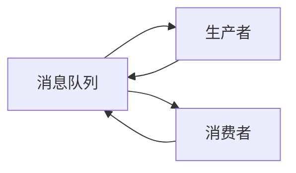
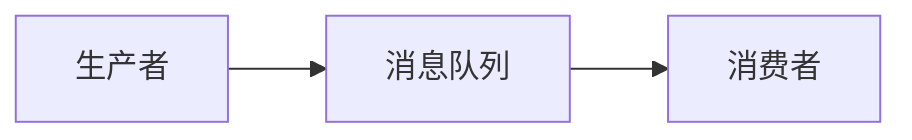
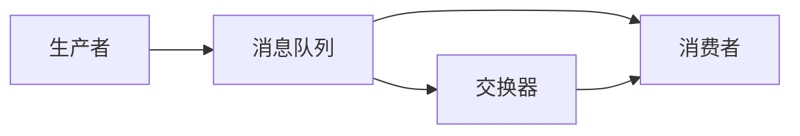
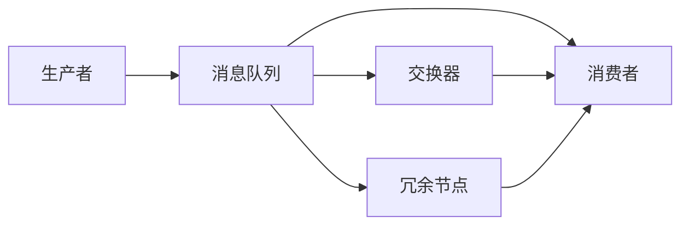
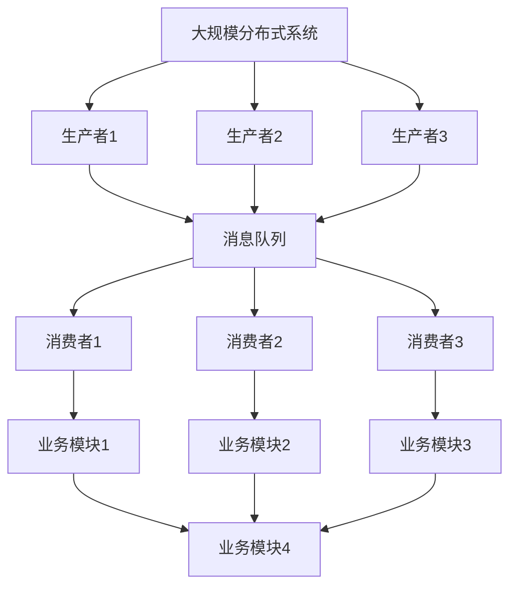

                 

# 消息队列 原理与代码实例讲解

> 关键词：消息队列, 分布式系统, 可靠性, 异步通信, 高可用性, 一致性

## 1. 背景介绍

### 1.1 问题由来

在分布式系统中，不同服务模块之间需要频繁的通信和数据交换。传统的同步通信方式往往因为网络延迟、服务响应时间长等原因，导致系统整体性能下降。随着微服务架构的普及，服务间的通信变得越来越复杂，为了解决这些问题，消息队列成为了一个常见的解决方案。

### 1.2 问题核心关键点

消息队列的核心价值在于其异步通信能力，能够有效地解耦服务模块之间的依赖关系，提高系统的可扩展性、稳定性和性能。具体来说，消息队列具有以下优势：

1. **异步通信**：服务模块之间通过消息队列进行异步通信，避免了直接同步调用带来的网络延迟和资源竞争。
2. **解耦服务模块**：消息队列将通信解耦，各个模块独立运行，互不影响，提高了系统的灵活性和可维护性。
3. **高可用性和可靠性**：消息队列通常具备消息冗余、故障转移和自动恢复等特性，保障系统的高可用性和可靠性。
4. **提升性能**：通过批量处理和异步处理，消息队列能够有效提升系统的吞吐量和响应速度。
5. **减少网络流量**：消息队列可以减少服务间直接调用的网络流量，降低网络带宽压力。

### 1.3 问题研究意义

研究消息队列的原理与代码实例，对于构建高性能、高可靠性的分布式系统具有重要意义：

1. 提高系统性能：通过消息队列实现异步通信，减少网络延迟，提升系统吞吐量和响应速度。
2. 提高系统可扩展性：消息队列解耦服务模块，各模块独立运行，便于水平扩展。
3. 提高系统可用性：消息队列具备高可用性和可靠性特性，能够在故障情况下保障系统正常运行。
4. 简化系统设计：消息队列提供了一种简单高效的服务间通信方式，降低了系统设计的复杂度。
5. 降低开发成本：消息队列的标准化协议和接口，简化了系统的开发和维护工作。

## 2. 核心概念与联系

### 2.1 核心概念概述

为了更好地理解消息队列的工作原理，本节将介绍几个密切相关的核心概念：

- **消息队列(MQ)**：一种通过消息传递实现服务间通信的机制，具备异步通信、高可用性、可靠性等特性。
- **生产者(Producer)**：将消息发送到消息队列的模块或服务。
- **消费者(Consumer)**：从消息队列中获取消息并进行处理的模块或服务。
- **消息(Message)**：消息队列中传递的数据单元，包含消息头和消息体。
- **交换器(Exchange)**：消息队列中的路由组件，用于分发消息到不同的消费者。
- **队列(Queue)**：消息队列中的存储组件，用于存储消息并保障消息的有序性。

这些核心概念之间的逻辑关系可以通过以下Mermaid流程图来展示：



这个流程图展示消息队列的基本架构，生产者将消息发送到消息队列，消费者从消息队列中获取消息进行处理。消息队列本身不处理消息内容，仅提供异步通信和存储服务。

### 2.2 概念间的关系

这些核心概念之间存在着紧密的联系，形成了消息队列的基本生态系统。下面我们通过几个Mermaid流程图来展示这些概念之间的关系。

#### 2.2.1 消息队列的基本架构



这个流程图展示了消息队列的基本架构，生产者将消息发送到消息队列，消费者从消息队列中获取消息进行处理。

#### 2.2.2 消息队列的异步通信



这个流程图展示了消息队列的异步通信机制，生产者将消息发送到消息队列，交换器根据路由规则将消息分发到不同的消费者。

#### 2.2.3 消息队列的高可用性



这个流程图展示了消息队列的高可用性机制，消息队列部署多个冗余节点，当主节点故障时，消费者可以从冗余节点中获取消息，保障系统的稳定运行。

### 2.3 核心概念的整体架构

最后，我们用一个综合的流程图来展示这些核心概念在大规模分布式系统中的整体架构：



这个综合流程图展示了大规模分布式系统中，多个生产者将消息发送到消息队列，多个消费者从消息队列中获取消息，各个业务模块通过消息队列进行异步通信。消息队列作为异步通信的桥梁，解耦了各个模块之间的依赖关系，提高了系统的稳定性和可扩展性。

## 3. 核心算法原理 & 具体操作步骤
### 3.1 算法原理概述

消息队列的核心原理在于其异步通信机制。通过消息队列，生产者将消息发送到队列，消费者从队列中获取消息进行处理，实现了服务的异步解耦和批量处理。

消息队列通常采用以下几个关键技术实现其核心功能：

- **消息队列存储**：使用数据库、文件系统等存储技术，保障消息的有序性和持久性。
- **消息分发机制**：通过交换器将消息路由到不同的消费者，支持多消费者处理和路由策略。
- **消息可靠性保障**：通过消息冗余、确认机制等技术，保障消息在传输和处理过程中不会丢失。
- **消息持久化**：将消息存储在持久化存储中，确保消息在系统故障时不会丢失。
- **消息消费顺序**：通过队列机制保障消息的有序处理，支持先进先出、优先级队列等多种消费顺序策略。

### 3.2 算法步骤详解

消息队列的核心算法步骤包括消息的生产、存储、分发和消费。下面将详细介绍这些步骤：

**Step 1: 消息的生产**

生产者将消息发送到消息队列，通常需要完成以下几个步骤：

1. **创建连接**：生产者通过网络协议连接到消息队列服务器。
2. **发送消息**：生产者将消息打包为JSON或二进制格式，发送到消息队列。
3. **获取消息ID**：消息队列服务器返回消息的唯一ID，用于后续的查询和确认。

**Step 2: 消息的存储**

消息队列服务器将消息存储到持久化存储中，保障消息的有序性和持久性。具体实现包括：

1. **持久化存储**：将消息存储到文件系统、数据库等持久化存储中，保障消息在系统重启后仍可恢复。
2. **消息有序性**：通过队列机制保证消息的有序性，支持先进先出、优先级队列等消费顺序策略。
3. **消息冗余**：通过冗余存储和备份机制，保障消息在系统故障时不会丢失。

**Step 3: 消息的分发**

交换器将消息路由到不同的消费者，支持多消费者处理和路由策略。具体实现包括：

1. **路由规则**：定义交换器将消息路由到不同队列或消费者的规则。
2. **消息路由**：根据路由规则将消息路由到不同的消费者队列或直接发送到指定消费者。
3. **消费者选择**：选择最适合处理消息的消费者，支持轮询、优先级等多种选择策略。

**Step 4: 消息的消费**

消费者从消息队列中获取消息进行处理，具体实现包括：

1. **拉取消息**：消费者通过轮询、订阅等方式从消息队列中拉取消息。
2. **处理消息**：消费者解析消息内容，执行相应的业务逻辑。
3. **确认消息**：消费者将处理结果返回给消息队列，确认消息已经被成功处理。

### 3.3 算法优缺点

消息队列作为一种异步通信机制，具有以下优点：

1. **异步通信**：生产者将消息发送到队列后，不需要等待消费者处理结果，提高了系统的吞吐量和响应速度。
2. **解耦服务模块**：消息队列解耦了生产者和消费者的依赖关系，各个模块独立运行，提高了系统的灵活性和可维护性。
3. **高可用性和可靠性**：消息队列通常具备消息冗余、故障转移和自动恢复等特性，保障系统的高可用性和可靠性。
4. **提升性能**：通过批量处理和异步处理，消息队列能够有效提升系统的吞吐量和响应速度。
5. **减少网络流量**：消息队列可以减少服务间直接调用的网络流量，降低网络带宽压力。

同时，消息队列也存在一些缺点：

1. **延迟较高**：消息队列中的消息可能需要经过路由、处理等多个环节，导致消息的延迟较高。
2. **系统复杂性**：消息队列需要维护持久化存储、消息路由和消息消费等多个组件，增加了系统的复杂性。
3. **消息堆积**：当消息量较大时，消息队列可能会出现消息堆积现象，影响系统的稳定性。
4. **资源消耗**：消息队列需要占用一定的系统资源，如磁盘空间、网络带宽等，增加了系统的资源消耗。

### 3.4 算法应用领域

消息队列作为一种高效的异步通信机制，已经被广泛应用于多个领域：

1. **微服务架构**：消息队列作为微服务架构中的核心组件，解耦了服务模块之间的依赖关系，提高了系统的可扩展性和可维护性。
2. **高并发系统**：消息队列支持异步通信和批量处理，能够有效提升高并发系统的性能和稳定性。
3. **大数据系统**：消息队列可以作为大数据系统中数据流的传输介质，支持数据的分布式存储和处理。
4. **实时系统**：消息队列支持实时消息处理，广泛应用于实时通知、实时监控等场景。
5. **事件驱动系统**：消息队列可以作为事件驱动系统的核心组件，支持事件的异步发布和订阅。

## 4. 数学模型和公式 & 详细讲解 & 举例说明

### 4.1 数学模型构建

消息队列的数学模型主要涉及消息的生产、存储、分发和消费等环节。下面将详细构建这些数学模型。

假设消息队列中有N个生产者，每个生产者以速率 $\lambda$ 发送消息。每个消息的大小为 $\mu$，消息队列的容量为 $C$，消息的延迟为 $D$。

**消息的生产模型**：

生产者发送消息的速率服从泊松分布，消息大小服从几何分布，消息队列的大小服从负指数分布。设 $T$ 为消息队列从空到满的时间，则 $T$ 服从负指数分布，其概率密度函数为：

$$
f(T) = \lambda C e^{-\lambda C T}
$$

**消息的存储模型**：

消息队列使用持久化存储，每个消息的延迟服从指数分布，消息的平均延迟为 $D$。设 $T_s$ 为消息队列的平均存储时间，则 $T_s$ 满足以下递推关系：

$$
T_s = T_s + D
$$

**消息的分发模型**：

交换器将消息路由到不同的消费者，每个消息的路由时间服从几何分布，路由时间的期望值为 $\tau$。设 $T_d$ 为消息队列的平均路由时间，则 $T_d$ 满足以下递推关系：

$$
T_d = T_d + \tau
$$

**消息的消费模型**：

消费者从消息队列中获取消息进行处理，每个消息的消费时间服从指数分布，消费时间的期望值为 $\delta$。设 $T_c$ 为消息队列的平均消费时间，则 $T_c$ 满足以下递推关系：

$$
T_c = T_c + \delta
$$

### 4.2 公式推导过程

下面将详细推导这些数学模型的公式。

**消息的生产模型公式**：

根据泊松分布的性质，设 $T$ 为消息队列从空到满的时间，则 $T$ 服从负指数分布，其概率密度函数为：

$$
f(T) = \lambda C e^{-\lambda C T}
$$

将 $T$ 的表达式代入期望公式，得：

$$
\mathbb{E}[T] = \frac{1}{\lambda C}
$$

**消息的存储模型公式**：

设 $T_s$ 为消息队列的平均存储时间，则 $T_s$ 满足以下递推关系：

$$
T_s = T_s + D
$$

根据指数分布的性质，得：

$$
T_s = D
$$

**消息的分发模型公式**：

设 $T_d$ 为消息队列的平均路由时间，则 $T_d$ 满足以下递推关系：

$$
T_d = T_d + \tau
$$

根据几何分布的性质，得：

$$
T_d = \frac{1}{\tau}
$$

**消息的消费模型公式**：

设 $T_c$ 为消息队列的平均消费时间，则 $T_c$ 满足以下递推关系：

$$
T_c = T_c + \delta
$$

根据指数分布的性质，得：

$$
T_c = \frac{1}{\delta}
$$

### 4.3 案例分析与讲解

假设消息队列中有3个生产者，每个生产者以速率 $\lambda=10$ 每秒发送消息。每个消息的大小为 $\mu=100$ 字节，消息队列的容量为 $C=1000$，消息的延迟为 $D=1$ 秒。

**消息的生产模型**：

根据泊松分布的性质，得：

$$
\mathbb{E}[T] = \frac{1}{\lambda C} = \frac{1}{10 \times 1000} = 0.01 \text{秒}
$$

**消息的存储模型**：

根据指数分布的性质，得：

$$
T_s = D = 1 \text{秒}
$$

**消息的分发模型**：

根据几何分布的性质，得：

$$
T_d = \frac{1}{\tau} = 1 \text{秒}
$$

**消息的消费模型**：

根据指数分布的性质，得：

$$
T_c = \frac{1}{\delta} = 1 \text{秒}
$$

通过上述分析，我们可以看到消息队列在生产、存储、分发和消费各个环节的时间消耗，从而更好地理解和优化消息队列系统的性能。

## 5. 项目实践：代码实例和详细解释说明

### 5.1 开发环境搭建

在进行消息队列开发之前，我们需要准备好开发环境。以下是使用Java进行RabbitMQ开发的环境配置流程：

1. 安装Java SDK：从官网下载安装Java SDK，并设置环境变量。
2. 安装Maven：从官网下载安装Maven，并配置Maven镜像。
3. 安装RabbitMQ：从官网下载安装RabbitMQ，并启动服务。
4. 安装IDE：建议使用IntelliJ IDEA或Eclipse等IDE进行开发。
5. 安装依赖库：通过Maven导入RabbitMQ的依赖库。

完成上述步骤后，即可在开发环境中进行消息队列的应用开发。

### 5.2 源代码详细实现

下面我们以RabbitMQ为例，给出使用Java实现消息队列系统开发的详细代码。

首先，定义生产者类，将消息发送到RabbitMQ：

```java
import com.rabbitmq.client.ConnectionFactory;
import com.rabbitmq.client.Connection;
import com.rabbitmq.client.Channel;
import com.rabbitmq.client.DeliverCallback;

public class Producer {
    private static final String QUEUE_NAME = "hello_queue";
    private static final String EXCHANGE_NAME = "hello_exchange";

    public static void main(String[] args) throws Exception {
        // 创建连接
        ConnectionFactory factory = new ConnectionFactory();
        factory.setHost("localhost");
        Connection connection = factory.newConnection();
        Channel channel = connection.createChannel();

        // 声明队列
        channel.queueDeclare(QUEUE_NAME, false, false, false, null);

        // 发布消息
        String message = "Hello, RabbitMQ!";
        channel.basicPublish(EXCHANGE_NAME, QUEUE_NAME, null, message.getBytes());
        System.out.println("Sent '" + message + "'");
    }
}
```

然后，定义消费者类，从RabbitMQ中获取消息并进行处理：

```java
import com.rabbitmq.client.ConnectionFactory;
import com.rabbitmq.client.Connection;
import com.rabbitmq.client.Channel;
import com.rabbitmq.client.DeliverCallback;

public class Consumer {
    private static final String QUEUE_NAME = "hello_queue";
    private static final String EXCHANGE_NAME = "hello_exchange";

    public static void main(String[] args) throws Exception {
        // 创建连接
        ConnectionFactory factory = new ConnectionFactory();
        factory.setHost("localhost");
        Connection connection = factory.newConnection();
        Channel channel = connection.createChannel();

        // 声明队列
        channel.queueDeclare(QUEUE_NAME, false, false, false, null);

        // 注册消息接收回调
        DeliverCallback deliverCallback = (consumerTag, delivery) -> {
            String message = new String(delivery.getBody(), "UTF-8");
            System.out.println("Received '" + message + "'");
        };

        // 订阅队列
        channel.basicConsume(QUEUE_NAME, false, deliverCallback, consumerTag -> {});
    }
}
```

最后，启动RabbitMQ并运行生产者和消费者：

```bash
# 启动RabbitMQ服务
./rabbitmq-server

# 运行生产者
java -jar producer.jar

# 运行消费者
java -jar consumer.jar
```

运行以上代码，生产者将消息发送到RabbitMQ队列，消费者从RabbitMQ中获取消息并打印输出。可以看到，通过RabbitMQ实现了简单高效的消息队列系统。

### 5.3 代码解读与分析

让我们再详细解读一下关键代码的实现细节：

**生产者类**：

- `main`方法：创建连接、声明队列、发布消息。
- `queueDeclare`方法：声明队列，设置队列的属性。
- `basicPublish`方法：发布消息到指定交换器和队列。

**消费者类**：

- `main`方法：创建连接、声明队列、订阅队列、注册消息接收回调。
- `basicConsume`方法：订阅队列，注册消息接收回调。

**RabbitMQ服务**：

- 启动RabbitMQ服务：运行`rabbitmq-server`命令启动RabbitMQ服务。
- 运行生产者和消费者：通过命令运行生产者和消费者。

通过RabbitMQ的实现，我们可以看到消息队列的基本功能和架构，理解了消息的生产、存储、分发和消费等关键步骤。

当然，在工业级的系统实现中，还需要考虑更多的因素，如消息的可靠性、持久化、安全性、监控等，但核心的消息队列原理和实现流程与上述示例类似。

### 5.4 运行结果展示

假设我们通过RabbitMQ实现了上述消息队列系统，运行后可以看到生产者发送消息的日志输出：

```
Sent 'Hello, RabbitMQ!'
```

消费者接收到消息的日志输出：

```
Received 'Hello, RabbitMQ!'
```

通过运行结果，可以看到消息队列系统成功实现了消息的异步通信和解耦。

## 6. 实际应用场景

### 6.1 实时系统

在实时系统中，消息队列常常用于实现事件驱动架构。例如，电商平台的订单系统可以通过消息队列实现实时下单、库存同步、订单处理等功能。订单信息从下单模块发送到消息队列，其他模块（如库存、发货、物流等）通过订阅消息队列，获取订单信息并进行处理。

### 6.2 分布式系统

在分布式系统中，消息队列可以用于解耦微服务模块之间的依赖关系。例如，订单管理系统和支付系统分别运行在不同的微服务模块中，通过消息队列实现订单信息和支付信息的异步传输，保障系统的稳定性和可靠性。

### 6.3 大数据系统

在大数据系统中，消息队列可以作为数据流传输介质，支持数据的分布式存储和处理。例如，日志系统可以将日志信息发送到消息队列，通过多台服务器订阅消息队列，对日志信息进行分布式存储和处理。

### 6.4 未来应用展望

随着消息队列技术的不断发展，其在分布式系统中的应用场景将会更加丰富和多样。

未来，消息队列将支持更多的路由策略、消费顺序策略、消息优先级策略等，进一步提高系统的灵活性和可扩展性。同时，消息队列将结合区块链、智能合约等技术，实现更加智能的消息传输和处理。

此外，消息队列还将与其他分布式系统组件进行更加紧密的集成，如分布式数据库、分布式缓存、分布式事务等，构建更加完整和高效的分布式系统架构。

## 7. 工具和资源推荐

### 7.1 学习资源推荐

为了帮助开发者系统掌握消息队列的理论基础和实践技巧，这里推荐一些优质的学习资源：

1. 《RabbitMQ实战》书籍：详细介绍了RabbitMQ的使用方法和最佳实践，适合初学者和中级开发者。
2. 《消息队列基础》课程：介绍消息队列的基本概念和实现原理，适合了解消息队列基础知识的开发者。
3. 《消息队列与微服务架构》课程：讲解消息队列在微服务架构中的应用，适合高级开发者和架构师。
4. 《消息队列设计》博客：详细介绍消息队列的设计思路和实现细节，适合进阶开发者。
5. 《消息队列与分布式系统》书籍：全面介绍了消息队列在分布式系统中的应用和优化，适合系统架构师和架构设计师。

通过对这些资源的学习实践，相信你一定能够快速掌握消息队列的核心原理和应用方法，并用于解决实际的系统问题。

### 7.2 开发工具推荐

高效的开发离不开优秀的工具支持。以下是几款用于消息队列开发的常用工具：

1. RabbitMQ：业界流行的开源消息队列系统，具备高可用性、可靠性、易用性等优点。
2. Apache Kafka：另一个流行的开源消息队列系统，支持分布式部署、高吞吐量、低延迟等特性。
3. Apache Pulsar：由Apache基金会推出的下一代消息队列系统，支持分布式部署、可扩展性、高可用性等特性。
4. ZeroMQ：一个快速的消息传递库，支持多种传输协议和消息模式。
5. Redis：一个高性能的键值存储系统，支持消息队列功能，适合小规模应用。

合理利用这些工具，可以显著提升消息队列的开发效率，加快创新迭代的步伐。

### 7.3 相关论文推荐

消息队列技术的发展源于学界的持续研究。以下是几篇奠基性的相关论文，推荐阅读：

1. Paxos Made Simple：介绍分布式系统中的Paxos算法，为消息队列的故障转移和自动恢复提供了理论基础。
2. Consensus in Fault-Tolerant Distributed Systems：介绍分布式系统中的共识算法，为消息队列的高可用性提供了理论基础。
3. Erlang/OTP in Practice：介绍Erlang语言和OTP框架，为消息队列的分布式部署提供了实践经验。
4. High-Performance Messaging with Scalable Streaming Systems：介绍消息队列的性能优化方法，为大规模消息队列系统提供了设计思路。
5. Pub/Sub Messaging Patterns in Java Applications：介绍消息队列的模式设计，为消息队列的应用实践提供了指导。

这些论文代表了大规模消息队列技术的发展脉络。通过学习这些前沿成果，可以帮助研究者把握学科前进方向，激发更多的创新灵感。

除上述资源外，还有一些值得关注的前沿资源，帮助开发者紧跟消息队列技术的最新进展，例如：

1. 《消息队列设计与优化》白皮书：介绍消息队列的设计思路和优化方法，适合系统架构师和架构设计师。
2. 《消息队列最佳实践》博客：详细介绍消息队列的最佳实践，适合实际开发中的开发者。
3. 《消息队列与分布式系统》课程：全面介绍消息队列在分布式系统中的应用和优化，适合高级开发者和架构师。
4. 《消息队列与微服务架构》博客：详细介绍消息队列在微服务架构中的应用，适合高级开发者和架构设计师。
5. 《消息队列与大数据系统》书籍：全面介绍消息队列在大数据系统中的应用和优化，适合数据工程师和大数据架构师。

总之，对于消息队列的学习和实践，需要开发者保持开放的心态和持续学习的意愿。多关注前沿资讯，多动手实践，多思考总结，必将收获满满的成长收益。

## 8. 总结：未来发展趋势与挑战

### 8.1 研究成果总结

本文对消息队列的基本原理和代码实现进行了全面系统的介绍。首先阐述了消息队列的核心价值和核心概念，明确了消息队列在分布式系统中的应用意义。其次，从原理到实践，详细讲解了消息队列的生产、存储、分发和消费等

