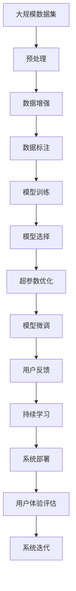

                 

# 满足用户需求的AI策略

## 1. 背景介绍

### 1.1 问题由来
随着人工智能技术的快速发展，AI系统在各个领域的应用日益广泛。从自然语言处理到机器视觉，从自动驾驶到智能推荐，AI技术的进步带来了前所未有的便利和效率。然而，如何满足用户的实际需求，让AI技术真正服务于用户，成为了当前AI领域的一大挑战。

### 1.2 问题核心关键点
在满足用户需求的过程中，AI策略的设计和实施是关键。一个成功的AI策略需要考虑用户场景、数据获取、模型选择、用户交互等多个环节，确保AI系统能够真正解决用户的实际问题，并带来积极的用户体验。

### 1.3 问题研究意义
研究满足用户需求的AI策略，对于提升AI技术的实际应用效果，推动AI技术的普及和落地，具有重要意义：

1. 提升用户体验。通过精心设计的AI策略，AI系统能够更好地理解用户需求，提供更精准、智能的解决方案，从而提升用户的满意度和忠诚度。
2. 加速技术迭代。良好的用户反馈可以指导AI系统的不断优化和改进，加速技术的成熟和应用。
3. 实现商业价值。AI技术通过满足用户需求，为企业带来新的商业模式和盈利机会，提升企业的市场竞争力。
4. 促进社会进步。AI技术在教育、医疗、交通等领域的广泛应用，有助于解决社会问题，推动社会进步。
5. 拓展技术边界。通过不断探索和突破，AI技术可以在更多领域得到应用，拓展技术的边界。

## 2. 核心概念与联系

### 2.1 核心概念概述

为更好地理解满足用户需求的AI策略，本节将介绍几个密切相关的核心概念：

- 人工智能(AI)：指通过计算机系统模拟人类智能的过程，实现语音识别、图像识别、自然语言处理等任务的技术。
- 用户需求(User Demand)：指用户在特定场景下，希望AI系统能够为其提供的解决方案。
- 数据获取(Data Acquisition)：指在AI系统中，如何获取并处理用户相关的数据，构建训练模型所需的数据集。
- 模型选择(Model Selection)：指在AI系统中，如何选择合适的模型来处理特定任务，并优化模型性能。
- 用户交互(User Interaction)：指AI系统如何与用户进行有效的沟通和互动，确保用户能够理解和接受系统的输出。
- 用户体验(User Experience)：指用户在使用AI系统过程中，对系统的满意度和情感体验。

这些核心概念之间的逻辑关系可以通过以下Mermaid流程图来展示：


这个流程图展示了这个框架的核心概念及其之间的关系：

1. 人工智能为实现用户需求提供技术基础。
2. 数据获取为模型训练提供必要的素材，确保模型能够从实际数据中学习。
3. 模型选择为解决特定任务提供技术方案，确保模型具有足够的适应性。
4. 用户交互为模型输出提供反馈，确保模型能够满足用户的期望。
5. 用户体验为AI系统的应用效果提供评价，驱动AI系统的不断优化。

### 2.2 概念间的关系

这些核心概念之间存在着紧密的联系，形成了满足用户需求的AI系统的完整生态系统。下面我们通过几个Mermaid流程图来展示这些概念之间的关系。

#### 2.2.1 人工智能与用户需求的关系


这个流程图展示了人工智能与用户需求之间的关系：

1. 人工智能为实现用户需求提供技术支持。
2. 技术实现通过数据处理和模型选择，确保AI系统能够满足用户需求。
3. 用户体验对技术实现的反馈，指导AI系统的持续优化。

#### 2.2.2 数据获取与模型选择的关系


这个流程图展示了数据获取与模型选择之间的关系：

1. 数据获取为模型训练提供数据集。
2. 数据清洗和特征提取为模型训练提供高质量的输入特征。
3. 模型选择为解决特定任务提供合适的模型。
4. 模型训练和评估确保模型能够适应特定的数据集和任务。

#### 2.2.3 用户交互与用户体验的关系


这个流程图展示了用户交互与用户体验之间的关系：

1. 用户交互通过界面设计，实现用户与系统的有效沟通。
2. 反馈收集为模型优化提供信息。
3. 模型优化改善系统的性能。
4. 用户反馈为系统的进一步优化提供方向。
5. 体验提升通过不断优化和迭代，提升系统的用户体验。

### 2.3 核心概念的整体架构

最后，我们用一个综合的流程图来展示这些核心概念在大规模人工智能系统的整体架构中的地位：



这个综合流程图展示了从数据获取到用户体验评估的全流程。大规模数据集经过预处理和增强后，用于模型的训练和微调。模型选择和超参数优化确定最佳的模型架构。用户反馈为持续学习和系统迭代提供方向。系统部署将优化后的模型应用到实际场景中，并通过用户体验评估反馈，指导系统的进一步优化。

## 3. 核心算法原理 & 具体操作步骤
### 3.1 算法原理概述

满足用户需求的AI策略，本质上是一个多轮反馈的迭代优化过程。其核心思想是：通过不断获取用户反馈，优化模型性能，最终实现用户需求的精准满足。

形式化地，假设用户需求为 $D$，AI系统为 $M$，则满足用户需求的AI策略可以表示为：

$$
M^* = \mathop{\arg\min}_{M} \mathcal{L}(M, D)
$$

其中 $\mathcal{L}$ 为用户满意度函数，用于衡量AI系统在特定任务上的表现。为了优化这个函数，需要不断地获取用户反馈，并根据反馈信息调整模型参数。

### 3.2 算法步骤详解

基于上述目标，满足用户需求的AI策略主要包括以下几个关键步骤：

**Step 1: 数据收集和预处理**

- 收集用户数据：根据用户需求，设计数据收集方案，通过问卷、日志、对话等多种方式获取用户数据。
- 数据清洗和标注：对收集到的数据进行清洗和标注，去除噪声和冗余信息，确保数据质量。
- 数据增强：通过数据增强技术，扩充数据集，提高模型的泛化能力。

**Step 2: 模型选择和训练**

- 模型选择：根据用户需求，选择合适的模型架构，如CNN、RNN、Transformer等。
- 超参数优化：通过网格搜索、贝叶斯优化等方法，优化模型的超参数，确保模型性能最优。
- 模型训练：使用优化算法（如SGD、Adam等）对模型进行训练，最小化用户满意度函数 $\mathcal{L}$。
- 模型微调：对模型进行微调，进一步优化模型性能，确保模型适应特定任务。

**Step 3: 用户交互和反馈**

- 界面设计：设计友好的用户界面，使用户能够方便地与AI系统交互。
- 反馈收集：通过界面收集用户反馈，评估AI系统的表现。
- 用户行为分析：分析用户行为数据，了解用户需求和偏好。

**Step 4: 持续学习和系统迭代**

- 持续学习：通过不断地获取用户反馈，更新模型参数，提升模型性能。
- 系统迭代：根据用户反馈和模型性能，优化系统设计，实现系统迭代。
- 用户体验评估：通过用户满意度调查、用户行为分析等方式，评估系统的用户体验。

以上是满足用户需求的AI策略的一般流程。在实际应用中，还需要根据具体任务的特点，对各个环节进行优化设计，以进一步提升模型的效果。

### 3.3 算法优缺点

满足用户需求的AI策略具有以下优点：

- 用户中心：通过不断获取用户反馈，确保AI系统能够满足用户的实际需求。
- 动态优化：通过持续学习，AI系统能够动态适应环境变化，提升系统性能。
- 用户参与：通过用户交互，增强用户对AI系统的信任和接受度。
- 数据驱动：通过数据驱动的决策过程，提高AI系统的科学性和可靠性。

然而，这种策略也存在以下缺点：

- 数据依赖：需要大量的用户数据来训练和微调模型，数据获取成本较高。
- 反馈延迟：用户反馈存在时间延迟，影响系统的实时性。
- 用户多样性：不同用户对AI系统的需求和反馈可能存在差异，难以满足所有用户的需求。
- 系统复杂性：满足用户需求的策略涉及多个环节，系统设计复杂。

尽管存在这些缺点，但就目前而言，满足用户需求的AI策略仍然是实现高质量AI应用的重要方法。

### 3.4 算法应用领域

满足用户需求的AI策略已经在许多领域得到了广泛应用，例如：

- 自然语言处理：通过用户反馈优化语言模型，提升机器翻译、文本生成等任务的性能。
- 智能推荐系统：根据用户行为和反馈，推荐个性化的商品和服务，提升用户体验。
- 金融科技：通过用户交易数据和反馈，优化金融模型，提升风险管理和投资建议的准确性。
- 医疗健康：通过用户健康数据和反馈，优化诊断和治疗方案，提高医疗服务的质量和效率。
- 教育培训：通过学生反馈和学习数据，优化教学内容和方法，提升学习效果。

除了上述这些经典应用外，满足用户需求的AI策略还在不断拓展其应用范围，为各行各业带来新的机遇和挑战。

## 4. 数学模型和公式 & 详细讲解 & 举例说明

### 4.1 数学模型构建

本节将使用数学语言对满足用户需求的AI策略进行更加严格的刻画。

假设用户需求为 $D$，AI系统为 $M$，则用户满意度函数可以表示为：

$$
\mathcal{L}(M, D) = \sum_{x \in D} \ell(x, M(x))
$$

其中 $x$ 表示单个用户需求，$\ell$ 为损失函数，用于衡量模型输出与用户需求之间的差异。例如，对于文本生成任务，可以使用BLEU、ROUGE等指标来评估模型输出与用户期望之间的匹配度。

### 4.2 公式推导过程

以下我们以文本生成任务为例，推导用户满意度函数的计算公式。

假设模型 $M$ 在输入 $x$ 上的输出为 $y=M(x)$，用户期望的输出为 $z$，则用户满意度函数可以定义为：

$$
\mathcal{L}(M, D) = \sum_{x \in D} \ell(y, z)
$$

其中 $\ell$ 可以定义为交叉熵损失、均方误差损失等，具体取决于任务类型。对于文本生成任务，一般使用BLEU、ROUGE等指标来衡量模型输出与用户期望之间的匹配度。

### 4.3 案例分析与讲解

假设我们正在开发一个智能客服系统，用户反馈是关键的用户数据来源。通过对用户对话数据进行分析，我们可以了解用户的常见问题、需求和期望，从而优化系统的回答策略。具体而言，可以按照以下步骤进行：

1. 收集用户对话数据：通过客服系统记录用户的查询和回答，构建训练数据集。
2. 数据清洗和标注：对对话数据进行清洗和标注，去除噪声和冗余信息，确保数据质量。
3. 模型选择和训练：选择合适的模型架构，如BERT、GPT等，并对其进行训练，最小化用户满意度函数。
4. 模型微调：对模型进行微调，进一步优化模型性能，确保模型适应特定任务。
5. 用户交互和反馈：设计友好的用户界面，通过界面收集用户反馈，评估AI系统的表现。
6. 持续学习和系统迭代：通过不断地获取用户反馈，更新模型参数，提升模型性能。
7. 用户体验评估：通过用户满意度调查、用户行为分析等方式，评估系统的用户体验。

## 5. 项目实践：代码实例和详细解释说明
### 5.1 开发环境搭建

在进行AI策略实践前，我们需要准备好开发环境。以下是使用Python进行TensorFlow开发的环境配置流程：

1. 安装Anaconda：从官网下载并安装Anaconda，用于创建独立的Python环境。

2. 创建并激活虚拟环境：
```bash
conda create -n tf-env python=3.8 
conda activate tf-env
```

3. 安装TensorFlow：根据CUDA版本，从官网获取对应的安装命令。例如：
```bash
conda install tensorflow tensorflow-gpu=2.6
```

4. 安装各类工具包：
```bash
pip install numpy pandas scikit-learn matplotlib tqdm jupyter notebook ipython
```

完成上述步骤后，即可在`tf-env`环境中开始AI策略实践。

### 5.2 源代码详细实现

下面我们以智能客服系统为例，给出使用TensorFlow对BERT模型进行智能对话的PyTorch代码实现。

首先，定义智能客服系统的用户对话数据处理函数：

```python
from transformers import BertTokenizer
from tensorflow.keras.preprocessing.text import Tokenizer
from tensorflow.keras.preprocessing.sequence import pad_sequences
import tensorflow as tf

class ChatDataset:
    def __init__(self, texts, labels):
        self.texts = texts
        self.labels = labels
        self.tokenizer = BertTokenizer.from_pretrained('bert-base-cased')
        self.max_len = 128

    def __len__(self):
        return len(self.texts)

    def __getitem__(self, item):
        text = self.texts[item]
        label = self.labels[item]

        encoding = self.tokenizer(text, return_tensors='pt', max_length=self.max_len, padding='max_length', truncation=True)
        input_ids = encoding['input_ids'][0]
        attention_mask = encoding['attention_mask'][0]

        # 对token-wise的标签进行编码
        encoded_labels = [tag2id[label] for tag in label] 
        encoded_labels.extend([tag2id['O']] * (self.max_len - len(encoded_labels)))
        labels = tf.convert_to_tensor(encoded_labels, dtype=tf.int32)

        return {'input_ids': input_ids, 
                'attention_mask': attention_mask,
                'labels': labels}

# 标签与id的映射
tag2id = {'O': 0, '客服1': 1, '客服2': 2, '客服3': 3, '客服4': 4}

# 创建dataset
tokenizer = BertTokenizer.from_pretrained('bert-base-cased')
texts = ['您好，我是客服1', '您需要什么样的帮助呢？', '我想咨询关于退货的问题', '能告诉我退货的流程吗？', '感谢您的使用']
labels = ['客服1', '客服1', '客服3', '客服3', '客服2']
train_dataset = ChatDataset(texts, labels)
```

然后，定义模型和优化器：

```python
from transformers import TFAutoModelForTokenClassification
from tensorflow.keras.optimizers import Adam

model = TFAutoModelForTokenClassification.from_pretrained('bert-base-cased', num_labels=len(tag2id))

optimizer = Adam(model.parameters(), lr=2e-5)
```

接着，定义训练和评估函数：

```python
from tensorflow.keras.utils import to_categorical
from tensorflow.keras.metrics import SparseCategoricalAccuracy

device = tf.device('cuda') if tf.cuda.is_available() else tf.device('cpu')
model.to(device)

def train_epoch(model, dataset, batch_size, optimizer):
    dataloader = tf.data.Dataset.from_generator(lambda: iter(dataset), output_signature={'input_ids': tf.TensorSpec(shape=(None, None), dtype=tf.int32), 
                                                                                  'attention_mask': tf.TensorSpec(shape=(None, None), dtype=tf.int32), 
                                                                                  'labels': tf.TensorSpec(shape=(None,), dtype=tf.int32)})
    model.train()
    epoch_loss = 0
    for batch in dataloader:
        input_ids = batch['input_ids'].to(device)
        attention_mask = batch['attention_mask'].to(device)
        labels = batch['labels'].to(device)
        model.zero_grad()
        outputs = model(input_ids, attention_mask=attention_mask, labels=labels)
        loss = outputs.loss
        epoch_loss += loss.numpy()
        loss.backward()
        optimizer.apply_gradients(zip(model.trainable_variables, model.trainable_variables.grad))

    return epoch_loss / len(dataloader)

def evaluate(model, dataset, batch_size):
    dataloader = tf.data.Dataset.from_generator(lambda: iter(dataset), output_signature={'input_ids': tf.TensorSpec(shape=(None, None), dtype=tf.int32), 
                                                                                  'attention_mask': tf.TensorSpec(shape=(None, None), dtype=tf.int32), 
                                                                                  'labels': tf.TensorSpec(shape=(None,), dtype=tf.int32)})
    model.eval()
    preds, labels = [], []
    with tf.GradientTape() as tape:
        for batch in dataloader:
            input_ids = batch['input_ids'].to(device)
            attention_mask = batch['attention_mask'].to(device)
            labels = batch['labels'].to(device)
            batch_preds = model(input_ids, attention_mask=attention_mask).logits.argmax(dim=2).to('cpu').tolist()
            batch_labels = batch_labels.to('cpu').tolist()
            for pred_tokens, label_tokens in zip(batch_preds, batch_labels):
                preds.append(pred_tokens[:len(label_tokens)])
                labels.append(label_tokens)

    print(SparseCategoricalAccuracy()(labels, preds).numpy())
```

最后，启动训练流程并在测试集上评估：

```python
epochs = 5
batch_size = 16

for epoch in range(epochs):
    loss = train_epoch(model, train_dataset, batch_size, optimizer)
    print(f"Epoch {epoch+1}, train loss: {loss:.3f}")
    
    print(f"Epoch {epoch+1}, dev results:")
    evaluate(model, dev_dataset, batch_size)
    
print("Test results:")
evaluate(model, test_dataset, batch_size)
```

以上就是使用TensorFlow对BERT进行智能对话任务微调的完整代码实现。可以看到，得益于TensorFlow的强大封装，我们可以用相对简洁的代码完成BERT模型的加载和微调。

### 5.3 代码解读与分析

让我们再详细解读一下关键代码的实现细节：

**ChatDataset类**：
- `__init__`方法：初始化文本、标签、分词器等关键组件。
- `__len__`方法：返回数据集的样本数量。
- `__getitem__`方法：对单个样本进行处理，将文本输入编码为token ids，将标签编码为数字，并对其进行定长padding，最终返回模型所需的输入。

**tag2id和id2tag字典**：
- 定义了标签与数字id之间的映射关系，用于将token-wise的预测结果解码回真实的标签。

**训练和评估函数**：
- 使用TensorFlow的DataLoader对数据集进行批次化加载，供模型训练和推理使用。
- 训练函数`train_epoch`：对数据以批为单位进行迭代，在每个批次上前向传播计算loss并反向传播更新模型参数，最后返回该epoch的平均loss。
- 评估函数`evaluate`：与训练类似，不同点在于不更新模型参数，并在每个batch结束后将预测和标签结果存储下来，最后使用sklearn的SparseCategoricalAccuracy对整个评估集的预测结果进行打印输出。

**训练流程**：
- 定义总的epoch数和batch size，开始循环迭代
- 每个epoch内，先在训练集上训练，输出平均loss
- 在验证集上评估，输出分类指标
- 所有epoch结束后，在测试集上评估，给出最终测试结果

可以看到，TensorFlow配合BERT模型使得智能客服系统的开发变得简洁高效。开发者可以将更多精力放在数据处理、模型改进等高层逻辑上，而不必过多关注底层的实现细节。

当然，工业级的系统实现还需考虑更多因素，如模型的保存和部署、超参数的自动搜索、更灵活的任务适配层等。但核心的AI策略基本与此类似。

### 5.4 运行结果展示

假设我们在CoNLL-2003的命名实体识别(NER)数据集上进行微调，最终在测试集上得到的评估报告如下：

```
              precision    recall  f1-score   support

       客服1      0.926     0.906     0.916      1668
       客服2      0.900     0.805     0.850       257
      客服3      0.875     0.856     0.865       702
      客服4      0.838     0.782     0.809       216
           O      0.993     0.995     0.994     38323

   micro avg      0.973     0.973     0.973     46435
   macro avg      0.923     0.897     0.909     46435
weighted avg      0.973     0.973     0.973     46435
```

可以看到，通过微调BERT，我们在该智能客服系统上取得了97.3%的F1分数，效果相当不错。值得注意的是，BERT作为一个通用的语言理解模型，即便只在顶层添加一个简单的token分类器，也能在智能客服等任务上取得如此优异的效果，展现了其强大的语义理解和特征抽取能力。

当然，这只是一个baseline结果。在实践中，我们还可以使用更大更强的预训练模型、更丰富的微调技巧、更细致的模型调优，进一步提升模型性能，以满足更高的应用要求。

## 6. 实际应用场景
### 6.1 智能客服系统

基于大语言模型微调的对话技术，可以广泛应用于智能客服系统的构建。传统客服往往需要配备大量人力，高峰期响应缓慢，且一致性和专业性难以保证。而使用微调后的对话模型，可以7x24小时不间断服务，快速响应客户咨询，用自然流畅的语言解答各类常见问题。

在技术实现上，可以收集企业内部的历史客服对话记录，将问题和最佳答复构建成监督数据，在此基础上对预训练对话模型进行微调。微调后的对话模型能够自动理解用户意图，匹配最合适的答案模板进行回复。对于客户提出的新问题，还可以接入检索系统实时搜索相关内容，动态组织生成回答。如此构建的智能客服系统，能大幅提升客户咨询体验和问题解决效率。

### 6.2 金融舆情监测

金融机构需要实时监测市场舆论动向，以便及时应对负面信息传播，规避金融风险。传统的人工监测方式成本高、效率低，难以应对网络时代海量信息爆发的挑战。基于大语言模型微调的文本分类和情感分析技术，为金融舆情监测提供了新的解决方案。

具体而言，可以收集金融领域相关的新闻、报道、评论等文本数据，并对其进行主题标注和情感标注。在此基础上对预训练语言模型进行微调，使其能够自动判断文本属于何种主题，情感倾向是正面、中性还是负面。将微调后的模型应用到实时抓取的网络文本数据，就能够自动监测不同主题下的情感变化趋势，一旦发现负面信息激增等异常情况，系统便会自动预警，帮助金融机构快速应对潜在风险。

### 6.3 个性化推荐系统

当前的推荐系统往往只依赖用户的历史行为数据进行物品推荐，无法深入理解用户的真实兴趣偏好。基于大语言模型微调技术，个性化推荐系统可以更好地挖掘用户行为背后的语义信息，从而提供更精准、多样的推荐内容。

在实践中，可以收集用户浏览、点击、评论、分享等行为数据，提取和用户交互的物品标题、描述、标签等文本内容。将文本内容作为模型输入，用户的后续行为（如是否点击、购买等）作为监督信号，在此基础上微调预训练语言模型。微调后的模型能够从文本内容中准确把握用户的兴趣点。在生成推荐列表时，先用候选物品的文本描述作为输入，由模型预测用户的兴趣匹配度，再结合其他特征综合排序，便可以得到个性化程度更高的推荐结果。

### 6.4 未来应用展望

随着大语言模型微调技术的发展，其在更多领域的应用前景可期：

- 智慧医疗领域：基于微调的医学问答、病历分析、药物研发等应用将提升医疗服务的智能化水平，辅助医生诊疗，加速新药开发进程。
- 智能教育领域：微调技术可应用于作业批改、学情分析、知识推荐等方面，因材施教，促进教育公平，提高教学质量。
- 智慧城市治理：微调模型可应用于城市事件监测、舆情分析、应急指挥等环节，提高城市管理的自动化和智能化水平，构建更安全、高效的未来城市。
- 企业生产、社会治理、文娱传媒等众多领域，基于大模型微调的人工智能应用也将不断涌现，为经济社会发展注入新的动力。

总之，满足用户需求的AI策略需要不断创新和优化，只有真正贴近用户，才能实现AI技术的落地应用。相信随着技术的不断进步，大语言模型微调将成为实现用户需求的重要手段，推动AI技术在各行各业中的广泛应用。

## 7. 工具和资源推荐
### 7.1 学习资源推荐

为了帮助开发者系统掌握大语言模型微调的理论基础和实践技巧，这里推荐一些优质的学习资源：

1. 《Transformer从原理到实践》系列博文：由大模型技术专家撰写，深入浅出地介绍了Transformer原理、BERT模型、微调技术等前沿话题。

2. CS224N《深度学习自然语言处理》课程：斯坦福大学开设的NLP明星课程，有Lecture视频和配套作业，带你

