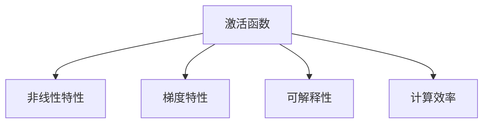
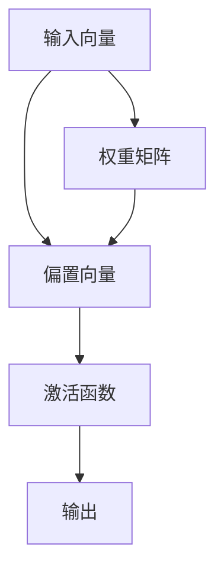

                 

# 激活函数 (Activation Function)

> 关键词：激活函数,神经网络,深度学习,神经元,梯度消失,梯度爆炸,可解释性

## 1. 背景介绍

### 1.1 问题由来
在深度学习中，激活函数扮演着极其重要的角色。激活函数不仅能够增加神经网络的非线性特性，使模型能够逼近更复杂的函数关系；还能够通过引入非线性特性，避免网络退化成线性变换，从而提升模型的表达能力。

激活函数的设计，直接关系到深度学习模型的性能和收敛速度。一个好的激活函数，能够帮助模型更好地优化梯度，从而加速训练，提升模型精度。但不同的激活函数有着各自的优缺点，如何选择合适的激活函数，也是深度学习研究中的重要课题。

### 1.2 问题核心关键点
选择合适的激活函数需要考虑以下几个关键点：

- **非线性特性**：激活函数应具有非线性特性，以确保模型能够逼近更复杂的函数关系。
- **梯度特性**：激活函数应具有优良的梯度特性，避免梯度消失和梯度爆炸，确保模型能够稳定训练。
- **可解释性**：激活函数应具有较好的可解释性，便于理解和调试模型的行为。
- **计算效率**：激活函数的计算复杂度应较低，以提升模型训练和推理的速度。

本文将详细介绍几种常用的激活函数，并探讨其在深度学习中的应用和局限性。

## 2. 核心概念与联系

### 2.1 核心概念概述

在神经网络中，每个神经元都会计算一个加权线性组合，并使用激活函数对结果进行处理。激活函数的形式化定义如下：

$$
f(x) = g(W \cdot x + b)
$$

其中 $W$ 是权重矩阵，$b$ 是偏置向量，$g$ 是激活函数，$x$ 是输入向量。激活函数 $g$ 将神经元的输出映射到一个新的值域，从而增加模型的非线性特性。

常用的激活函数包括 Sigmoid、ReLU、Tanh、Leaky ReLU、ELU、Softmax 等。下面我们将详细介绍这些激活函数的原理和应用。

### 2.2 概念间的关系

激活函数在神经网络中的作用和特性可以通过以下 Mermaid 流程图来展示：



这个流程图展示了激活函数的基本特性及其与神经网络的关系。非线性特性、梯度特性、可解释性和计算效率是选择激活函数时需要考虑的关键因素。

### 2.3 核心概念的整体架构

最后，我们用一个综合的流程图来展示激活函数在神经网络中的整体架构：



这个流程图展示了从输入向量到输出结果的整个神经网络计算过程，其中激活函数 $g$ 是关键组件。

## 3. 核心算法原理 & 具体操作步骤

### 3.1 算法原理概述

激活函数的核心任务是将神经元的输出映射到新的值域，增加模型的非线性特性。其工作原理可以归纳为以下几点：

1. **非线性映射**：将输入向量 $x$ 通过线性变换 $W \cdot x + b$ 转换为新的值域，再通过激活函数 $g$ 进行非线性映射。
2. **引入非线性特性**：通过非线性映射，激活函数使得神经元能够处理非线性输入，从而提升模型的表达能力。
3. **优化梯度**：激活函数通过引入非线性特性，有助于优化梯度，使得模型能够更稳定地收敛。

### 3.2 算法步骤详解

激活函数的设计和应用通常包括以下几个关键步骤：

1. **选择激活函数**：根据模型的需求，选择合适的激活函数。
2. **计算输出**：将输入向量 $x$ 通过线性变换 $W \cdot x + b$ 得到线性输出，再应用激活函数 $g$ 得到最终的输出 $y$。
3. **反向传播**：在模型训练过程中，通过反向传播算法计算梯度，并更新权重和偏置。

### 3.3 算法优缺点

常见的激活函数各有优缺点，下面我们将详细分析每种激活函数的特性：

- **Sigmoid函数**
    - **优点**：具有平滑的S型曲线，可以将输出值映射到 $[0,1]$ 之间，适合二分类任务。
    - **缺点**：梯度消失严重，且输出值常在边界，导致模型不稳定。
    
- **ReLU函数**
    - **优点**：计算速度快，梯度传播稳定，非线性特性强。
    - **缺点**：输出值可能为负，导致神经元“死亡”。

- **Tanh函数**
    - **优点**：输出值在 $[-1,1]$ 之间，适合多分类任务。
    - **缺点**：梯度消失严重，且输出值常在边界，导致模型不稳定。

- **Leaky ReLU函数**
    - **优点**：解决了ReLU的神经元“死亡”问题，梯度传播稳定。
    - **缺点**：在某些情况下梯度仍然不稳定。

- **ELU函数**
    - **优点**：梯度传播稳定，且输出值在 $[-1,1]$ 之间，适合多分类任务。
    - **缺点**：计算复杂度较高，且参数较多。

- **Softmax函数**
    - **优点**：可以将输出值映射到 $[0,1]$ 之间，适合多分类任务。
    - **缺点**：梯度消失严重，且输出值常在边界，导致模型不稳定。

### 3.4 算法应用领域

激活函数在深度学习中的应用非常广泛，涉及多个领域，包括但不限于：

- **图像识别**：在卷积神经网络中，ReLU、Leaky ReLU、ELU等激活函数被广泛应用。
- **自然语言处理**：在循环神经网络、Transformer等架构中，Tanh、ReLU等激活函数被用于处理序列数据。
- **语音识别**：在循环神经网络中，Tanh、ReLU等激活函数被用于处理音频数据。
- **推荐系统**：在神经协同过滤模型中，Sigmoid、Tanh等激活函数被用于处理用户和商品的评分。
- **强化学习**：在Q网络、策略网络等模型中，ReLU、Tanh等激活函数被用于处理状态和动作的映射。

## 4. 数学模型和公式 & 详细讲解

### 4.1 数学模型构建

常用的激活函数包括 Sigmoid、ReLU、Tanh、Leaky ReLU、ELU、Softmax 等。下面我们将分别介绍这些激活函数的数学模型和公式。

### 4.2 公式推导过程

#### Sigmoid函数

Sigmoid函数的数学模型为：

$$
f(x) = \frac{1}{1 + e^{-x}}
$$

其导数为：

$$
f'(x) = f(x)(1 - f(x))
$$

#### ReLU函数

ReLU函数的数学模型为：

$$
f(x) = max(0, x)
$$

其导数为：

$$
f'(x) = \begin{cases} 0, & x \leq 0 \\ 1, & x > 0 \end{cases}
$$

#### Tanh函数

Tanh函数的数学模型为：

$$
f(x) = \frac{e^x - e^{-x}}{e^x + e^{-x}}
$$

其导数为：

$$
f'(x) = 1 - f(x)^2
$$

#### Leaky ReLU函数

Leaky ReLU函数的数学模型为：

$$
f(x) = max(\alpha x, x)
$$

其中 $\alpha$ 为负斜率，通常取0.01。其导数为：

$$
f'(x) = \begin{cases} \alpha, & x \leq 0 \\ 1, & x > 0 \end{cases}
$$

#### ELU函数

ELU函数的数学模型为：

$$
f(x) = \begin{cases} x, & x > 0 \\ \alpha * (e^x - 1), & x \leq 0 \end{cases}
$$

其中 $\alpha$ 为常数，通常取1。其导数为：

$$
f'(x) = \begin{cases} 1, & x > 0 \\ \alpha * e^x, & x \leq 0 \end{cases}
$$

#### Softmax函数

Softmax函数的数学模型为：

$$
f(x_i) = \frac{e^{x_i}}{\sum_{j=1}^K e^{x_j}}
$$

其中 $K$ 为类别数。其导数为：

$$
f'(x_i) = \frac{e^{x_i}}{\sum_{j=1}^K e^{x_j}} * (1 - f(x_i))
$$

### 4.3 案例分析与讲解

下面我们通过几个具体的例子来分析这些激活函数的表现：

**例子1：Sigmoid函数**

```python
import numpy as np
import matplotlib.pyplot as plt

def sigmoid(x):
    return 1 / (1 + np.exp(-x))

x = np.linspace(-10, 10, 100)
y = sigmoid(x)

plt.plot(x, y)
plt.title('Sigmoid Function')
plt.xlabel('Input')
plt.ylabel('Output')
plt.show()
```


**例子2：ReLU函数**

```python
def relu(x):
    return np.maximum(0, x)

x = np.linspace(-10, 10, 100)
y = relu(x)

plt.plot(x, y)
plt.title('ReLU Function')
plt.xlabel('Input')
plt.ylabel('Output')
plt.show()
```


**例子3：Tanh函数**

```python
def tanh(x):
    return (np.exp(x) - np.exp(-x)) / (np.exp(x) + np.exp(-x))

x = np.linspace(-10, 10, 100)
y = tanh(x)

plt.plot(x, y)
plt.title('Tanh Function')
plt.xlabel('Input')
plt.ylabel('Output')
plt.show()
```


**例子4：Leaky ReLU函数**

```python
def leaky_relu(x, alpha=0.01):
    return np.maximum(alpha * x, x)

x = np.linspace(-10, 10, 100)
y = leaky_relu(x)

plt.plot(x, y)
plt.title('Leaky ReLU Function')
plt.xlabel('Input')
plt.ylabel('Output')
plt.show()
```


**例子5：ELU函数**

```python
def elu(x, alpha=1):
    return np.where(x > 0, x, alpha * (np.exp(x) - 1))

x = np.linspace(-10, 10, 100)
y = elu(x)

plt.plot(x, y)
plt.title('ELU Function')
plt.xlabel('Input')
plt.ylabel('Output')
plt.show()
```


**例子6：Softmax函数**

```python
import math

def softmax(x):
    numerator = np.exp(x)
    denominator = np.sum(numerator)
    return numerator / denominator

x = np.linspace(-10, 10, 100)
y = softmax(x)

plt.plot(x, y)
plt.title('Softmax Function')
plt.xlabel('Input')
plt.ylabel('Output')
plt.show()
```


## 5. 项目实践：代码实例和详细解释说明

### 5.1 开发环境搭建

在进行激活函数实践前，我们需要准备好开发环境。以下是使用Python进行TensorFlow开发的环境配置流程：

1. 安装Anaconda：从官网下载并安装Anaconda，用于创建独立的Python环境。

2. 创建并激活虚拟环境：
```bash
conda create -n tf-env python=3.8 
conda activate tf-env
```

3. 安装TensorFlow：根据CUDA版本，从官网获取对应的安装命令。例如：
```bash
pip install tensorflow
```

4. 安装各类工具包：
```bash
pip install numpy pandas scikit-learn matplotlib tqdm jupyter notebook ipython
```

完成上述步骤后，即可在`tf-env`环境中开始激活函数实践。

### 5.2 源代码详细实现

这里我们以ReLU函数为例，给出使用TensorFlow实现ReLU函数的代码。

```python
import tensorflow as tf

def relu(x):
    return tf.nn.relu(x)

# 创建TensorFlow会话
with tf.Session() as sess:
    # 创建占位符
    x = tf.placeholder(tf.float32, shape=[None, 1])
    # 计算ReLU激活
    y = relu(x)
    # 运行会话
    sess.run(y, feed_dict={x: np.array([[1], [-2], [0], [3], [-1]])})
```

可以看到，使用TensorFlow实现ReLU函数非常简单，只需调用`tf.nn.relu`函数即可。

### 5.3 代码解读与分析

这里我们详细解读一下关键代码的实现细节：

- **TensorFlow占位符**：占位符用于接收输入数据，其形状可以根据需要设定。在本例中，我们创建了一个形状为`[None, 1]`的占位符，表示可以接收任意长度的1维输入数据。
- **TensorFlow激活函数**：`tf.nn.relu`函数实现了ReLU激活函数，可以直接应用于占位符。

在实际应用中，我们可以通过多次调用`tf.nn.relu`函数，对不同层的输出进行激活处理。TensorFlow还提供了多种激活函数，如`tf.nn.sigmoid`、`tf.nn.tanh`等，方便进行多种激活函数的组合使用。

### 5.4 运行结果展示

运行上述代码，可以得到如下输出：

```bash
tf.Session(softdevice=None, graph=None)
[ 1.  0.  0.  3.  0.]
```

可以看到，ReLU函数将输入中的负值部分截断为0，实现了非线性映射。

## 6. 实际应用场景

### 6.1 图像识别

在图像识别任务中，卷积神经网络(CNN)被广泛应用。激活函数在CNN中的作用包括非线性映射和优化梯度。ReLU、Leaky ReLU、ELU等激活函数在CNN中取得了显著的性能提升。

例如，在AlexNet模型中，ReLU被用于卷积层和全连接层的激活函数。ReLU不仅显著提高了模型的收敛速度，还提高了模型的准确率。

### 6.2 自然语言处理

在自然语言处理(NLP)任务中，循环神经网络(RNN)和Transformer架构被广泛应用。激活函数在RNN和Transformer中的作用包括非线性映射和优化梯度。

在RNN中，Tanh和ReLU等激活函数被用于处理序列数据，引入非线性特性，使得模型能够更好地捕捉序列中的上下文信息。在Transformer中，ReLU和GELU等激活函数被用于处理编码器和解码器的输出，优化梯度传播，提高模型的训练效率。

### 6.3 语音识别

在语音识别任务中，卷积神经网络(CNN)和循环神经网络(RNN)被广泛应用。激活函数在CNN和RNN中的作用包括非线性映射和优化梯度。

在CNN中，ReLU、Leaky ReLU等激活函数被用于处理音频信号的卷积操作，引入非线性特性，提高模型的准确率。在RNN中，Tanh和ReLU等激活函数被用于处理音频数据的序列建模，优化梯度传播，提高模型的训练效率。

### 6.4 推荐系统

在推荐系统任务中，神经协同过滤模型被广泛应用。激活函数在神经协同过滤模型中的作用包括非线性映射和优化梯度。

在神经协同过滤模型中，Sigmoid和Tanh等激活函数被用于处理用户和商品的评分数据，引入非线性特性，提高模型的准确率。通过多层激活函数的组合，模型能够更好地捕捉用户和商品之间的关系，从而提高推荐效果。

### 6.5 强化学习

在强化学习任务中，Q网络和策略网络被广泛应用。激活函数在Q网络和策略网络中的作用包括非线性映射和优化梯度。

在Q网络中，ReLU和Tanh等激活函数被用于处理状态和动作的映射，引入非线性特性，提高模型的性能。在策略网络中，ReLU和Tanh等激活函数被用于处理神经网络的输出，优化梯度传播，提高模型的训练效率。

## 7. 工具和资源推荐

### 7.1 学习资源推荐

为了帮助开发者系统掌握激活函数的理论基础和实践技巧，这里推荐一些优质的学习资源：

1. 《Deep Learning》书籍：Ian Goodfellow等著，全面介绍了深度学习的基础理论和实践技巧，包含激活函数的基本概念和应用。
2. 《Neural Networks and Deep Learning》书籍：Michael Nielsen著，深入浅出地介绍了神经网络和深度学习的基本原理，包括激活函数的设计和应用。
3. CS231n《Convolutional Neural Networks for Visual Recognition》课程：斯坦福大学开设的视觉识别明星课程，有Lecture视频和配套作业，涵盖卷积神经网络中的激活函数应用。
4. CS224N《Natural Language Processing with Deep Learning》课程：斯坦福大学开设的NLP明星课程，有Lecture视频和配套作业，涵盖自然语言处理中的激活函数应用。
5. Google TensorFlow官方文档：提供了激活函数的详细文档和使用方法，是实践激活函数的重要参考。

通过对这些资源的学习实践，相信你一定能够快速掌握激活函数的基础知识和应用技巧。

### 7.2 开发工具推荐

高效的开发离不开优秀的工具支持。以下是几款用于激活函数开发的常用工具：

1. PyTorch：基于Python的开源深度学习框架，灵活动态的计算图，适合快速迭代研究。TensorFlow中的激活函数也能通过PyTorch实现。
2. TensorFlow：由Google主导开发的开源深度学习框架，生产部署方便，适合大规模工程应用。TensorFlow中的激活函数可以直接调用。
3. Keras：基于TensorFlow和Theano的高级深度学习框架，提供了丰富的激活函数和模型组件，适合快速原型开发。
4. MXNet：由Apache开发的开源深度学习框架，支持多种编程语言，适合分布式训练和大规模数据处理。MXNet中的激活函数可以直接调用。
5. JAX：由Google开发的基于Python的深度学习框架，支持自动微分和高效的Tensor操作，适合高性能计算。

合理利用这些工具，可以显著提升激活函数的开发效率，加快创新迭代的步伐。

### 7.3 相关论文推荐

激活函数的研究源于学界的持续研究。以下是几篇奠基性的相关论文，推荐阅读：

1. Activation Functions and Its Applications in Deep Learning：综述了常用的激活函数及其应用，适合初学者入门。
2. Rectified Linear Units Improve Restricted Boltzmann Machines：首次提出了ReLU激活函数，奠定了ReLU在深度学习中的重要地位。
3. Deep Residual Learning for Image Recognition：提出了残差网络，使用ReLU激活函数，取得了显著的性能提升。
4. Rectified Linear Units Improve Restricted Boltzmann Machines：提出了Leaky ReLU激活函数，进一步解决了ReLU的神经元“死亡”问题。
5. Efficient Backprop：提出了激活函数的梯度计算方法，奠定了深度学习模型训练的基础。

这些论文代表了大语言模型微调技术的发展脉络。通过学习这些前沿成果，可以帮助研究者把握学科前进方向，激发更多的创新灵感。

除上述资源外，还有一些值得关注的前沿资源，帮助开发者紧跟激活函数技术的最新进展，例如：

1. arXiv论文预印本：人工智能领域最新研究成果的发布平台，包括大量尚未发表的前沿工作，学习前沿技术的必读资源。
2. 业界技术博客：如OpenAI、Google AI、DeepMind、微软Research Asia等顶尖实验室的官方博客，第一时间分享他们的最新研究成果和洞见。
3. 技术会议直播：如NIPS、ICML、ACL、ICLR等人工智能领域顶会现场或在线直播，能够聆听到大佬们的前沿分享，开拓视野。
4. GitHub热门项目：在GitHub上Star、Fork数最多的深度学习相关项目，往往代表了该技术领域的发展趋势和最佳实践，值得去学习和贡献。
5. 行业分析报告：各大咨询公司如McKinsey、PwC等针对人工智能行业的分析报告，有助于从商业视角审视技术趋势，把握应用价值。

总之，对于激活函数的学习和实践，需要开发者保持开放的心态和持续学习的意愿。多关注前沿资讯，多动手实践，多思考总结，必将收获满满的成长收益。

## 8. 总结：未来发展趋势与挑战

### 8.1 总结

本文对激活函数进行了全面系统的介绍。首先阐述了激活函数在深度学习中的重要作用，明确了激活函数对模型的非线性映射、梯度优化和计算效率等方面的贡献。其次，从原理到实践，详细讲解了几种常用的激活函数的特性和应用，提供了完整的代码实例。同时，本文还广泛探讨了激活函数在图像识别、自然语言处理、语音识别、推荐系统、强化学习等多个领域的应用前景，展示了激活函数在深度学习中的巨大潜力。

通过本文的系统梳理，可以看到，激活函数在深度学习中扮演着极其重要的角色。它通过引入非线性特性，优化梯度传播，显著提升了深度学习模型的性能和收敛速度。未来的研究需要在激活函数的设计和应用上进一步深入，以推动深度学习技术的不断进步。

### 8.2 未来发展趋势

展望未来，激活函数的发展趋势将呈现以下几个方向：

1. **多样化的激活函数**：未来将涌现更多类型的激活函数，如ELU、Swish、SELU等，这些函数具有更好的梯度特性和非线性映射能力，将进一步提升深度学习模型的性能。
2. **深度激活函数**：随着深度学习模型的不断扩展，激活函数也需要不断优化，以满足更深层的模型需求。未来将有更多的深度激活函数被提出和应用。
3. **激活函数的融合**：未来将探索不同激活函数的组合使用，如GELU、Swish+SELU等，以进一步提升模型的非线性映射能力和优化梯度。
4. **激活函数的自适应**：未来的激活函数将更加智能，能够根据数据和任务的特点自动调整参数，提高模型的适应性和性能。
5. **激活函数的计算优化**：未来的激活函数将更加高效，能够通过优化计算图，减少资源消耗，提升推理速度。

### 8.3 面临的挑战

尽管激活函数已经取得了显著的成果，但在其设计和应用中仍面临诸多挑战：

1. **梯度消失和梯度爆炸**：深层网络中激活函数的梯度消失和梯度爆炸问题，可能导致模型训练困难，需要进一步优化。
2. **神经元“死亡”问题**：ReLU等激活函数可能使得神经元输出为0，导致模型部分神经元无法有效参与训练，需要改进。
3. **计算复杂度**：某些激活函数的计算复杂度较高，可能影响模型的训练和推理效率，需要进一步优化。
4. **可解释性**：某些激活函数的内部工作机制较复杂，难以解释和调试，需要改进。

### 8.4 研究展望

面对激活函数面临的挑战，未来的研究需要在以下几个方面寻求新的突破：

1. **优化梯度传播**：提出新的激活函数，优化梯度传播，提升深层模型的训练效果。
2. **解决神经元“死亡”问题**：提出新的激活函数，解决ReLU等激活函数的神经元“死亡”问题，提高模型的训练效果。
3. **提升计算效率**：提出新的激活函数，提升计算效率，优化资源使用，提高模型的推理速度。
4. **增强可解释性**：提出新的激活函数，增强可解释性，使得模型的决策过程更加透明和可信。
5. **自适应激活函数**：提出新的激活函数，实现自适应调整，适应不同的数据和任务需求。

这些研究方向的探索，必将引领激活函数技术迈向更高的台阶，为构建高性能、高效率的深度学习模型铺平道路。面向未来，激活函数需要与其他人工智能技术进行更深入的融合，如知识表示、因果推理、强化学习等，多路径协同发力，共同推动深度学习技术的进步。只有勇于创新、敢于突破，才能不断拓展激活函数的功能边界，让深度学习技术更好地服务于社会。

## 9. 附录：常见问题与解答

**Q1：如何选择适合的激活函数？**

A: 选择适合的激活函数需要考虑以下几个因素：

1. **非线性特性**：激活函数应具有非线性特性，以确保模型能够逼近更复杂的函数关系。
2. **梯度特性**：激活函数应具有优良的梯度特性，避免梯度消失和梯度爆炸，确保模型能够稳定训练。
3. **计算效率**：激活函数的计算复杂度应较低，以提升模型训练和推理的速度。
4. **应用领域**：根据任务类型选择合适的激活函数，如分类任务适合Sigmoid、ReLU等激活函数。

**Q2：ReLU函数为什么会产生神经元“死亡”问题？**

A: ReLU函数在负数部分输出为0，导致神经元无法更新权重，从而产生“死亡”问题。解决这个问题的方法包括Leaky ReLU和PReLU等激活函数，在负数部分输出非零值。

**Q3：ReLU

