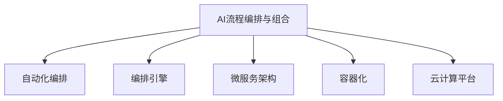
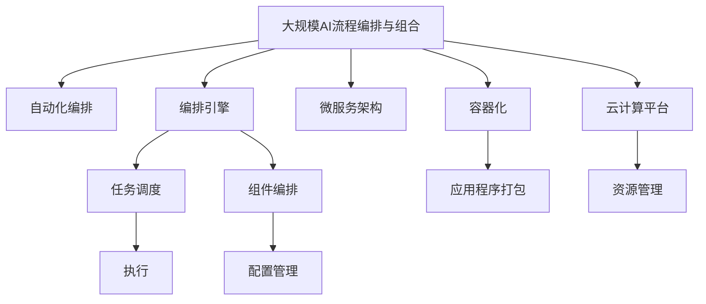

                 

## 1. 背景介绍

### 1.1 问题由来

在当今人工智能（AI）技术快速发展的大背景下，AI流程编排与组合技术已经成为企业数字化转型的关键驱动力。AI流程编排与组合是一种通过自动化和可编排的技术手段，将复杂的AI任务流程进行灵活编排、组合与部署的方法，它不仅提升了AI的开发效率，而且能够加速AI技术的规模化应用。

### 1.2 问题核心关键点

当前AI流程编排与组合的核心关键点主要包括以下几个方面：

- **自动化**：自动化是AI流程编排与组合的核心理念，通过自动化技术，AI开发者能够从繁琐的代码编写和部署工作中解放出来，专注于模型设计和业务逻辑的实现。
- **编排与组合**：编排与组合技术使得AI流程能够根据不同的业务场景和需求进行灵活的配置和调整，从而实现更高的灵活性和可扩展性。
- **部署与监控**：部署与监控技术确保了AI流程能够稳定高效地运行，并实时监测其性能，及时发现和解决问题。
- **编排平台与工具**：编排平台与工具为AI流程编排与组合提供了基础设施支持，包括工作流管理、容器编排、云计算平台等。

### 1.3 问题研究意义

AI流程编排与组合技术的普及和应用，对于推动AI技术的应用范围，提高AI开发效率，加速企业数字化转型具有重要意义：

1. **降低开发成本**：通过自动化和编排技术，AI开发者可以更快地完成模型部署和流程优化，显著减少人力和时间成本。
2. **提升模型效果**：编排与组合技术使得AI模型能够根据业务需求进行精细化调整，从而提升模型在特定场景下的表现。
3. **加速应用部署**：编排平台提供的可编排和可部署功能，使得AI模型能够快速集成到企业现有的业务系统中，加速业务创新。
4. **增强系统可扩展性**：编排技术通过模块化和组件化的设计，使得AI系统能够根据业务需求进行灵活扩展，支持更多的业务场景和数据源。
5. **实现持续学习与迭代**：编排技术支持持续集成和持续交付（CI/CD），使得AI模型能够不断迭代优化，保持最新的技术水平。

## 2. 核心概念与联系

### 2.1 核心概念概述

为了更好地理解AI流程编排与组合技术，我们先介绍几个关键概念：

- **自动化编排（Auto-Configuration）**：指通过自动化手段，根据预定义的规则和策略，对AI流程中的各个环节进行配置和调整。
- **编排引擎（Orchestration Engine）**：编排引擎是编排系统的核心组件，负责管理和调度AI流程中的各个任务和组件，确保其按照预定的顺序和逻辑执行。
- **微服务架构（Microservices Architecture）**：微服务架构是一种分布式系统设计方法，通过将大系统分解为多个小服务，提升系统的灵活性、可扩展性和可维护性。
- **容器化（Containerization）**：容器化技术通过将应用程序及其依赖打包到轻量级的容器镜像中，实现应用的一致性、可移植性和可部署性。
- **云计算平台（Cloud Platform）**：云计算平台提供了一个灵活、弹性的计算资源池，使得企业能够根据业务需求动态扩展和缩减计算资源。

这些核心概念通过自动化编排和容器化技术，使得AI流程能够以更加灵活和高效的方式进行组合和部署，从而适应不断变化的业务需求。

### 2.2 概念间的关系

通过以下Mermaid流程图，我们可以更清晰地理解这些核心概念之间的关系：



这个流程图展示了自动化编排、编排引擎、微服务架构、容器化以及云计算平台这些关键概念之间的联系：

- 自动化编排通过对AI流程的配置和调整，使编排引擎能够按照预定的规则和策略进行调度和管理。
- 编排引擎负责管理和调度各个AI任务和组件，确保其按照预设的顺序和逻辑执行。
- 微服务架构通过将大系统分解为多个小服务，提升了系统的灵活性和可扩展性。
- 容器化技术通过将应用程序及其依赖打包到容器镜像中，实现了应用的一致性、可移植性和可部署性。
- 云计算平台提供了灵活、弹性的计算资源，使得企业能够动态扩展和缩减计算资源。

### 2.3 核心概念的整体架构

最后，我们用一个综合的流程图来展示这些核心概念在大规模AI流程编排与组合中的整体架构：



这个综合流程图展示了从自动化编排到执行的完整流程，以及各个组件之间的关系：

- 自动化编排通过对AI流程的配置和调整，确保编排引擎能够按照预定的规则和策略进行任务调度和组件编排。
- 编排引擎负责管理和调度各个AI任务和组件，确保其按照预设的顺序和逻辑执行。
- 微服务架构通过将大系统分解为多个小服务，提升了系统的灵活性和可扩展性。
- 容器化技术通过将应用程序及其依赖打包到容器镜像中，实现了应用的一致性、可移植性和可部署性。
- 云计算平台提供了灵活、弹性的计算资源，使得企业能够动态扩展和缩减计算资源。
- 任务调度组件负责对各个任务进行调度和执行。
- 组件编排组件负责对各个组件进行配置和管理。
- 应用程序打包组件负责将应用程序及其依赖打包到容器镜像中。
- 资源管理组件负责对计算资源进行分配和管理。

## 3. 核心算法原理 & 具体操作步骤
### 3.1 算法原理概述

AI流程编排与组合的核心算法原理主要基于以下几个方面：

- **任务调度算法**：任务调度算法通过确定各个任务的执行顺序和依赖关系，确保任务的正确执行。常见的调度算法包括先进先出（FIFO）、最少连接（LC）等。
- **组件编排算法**：组件编排算法通过对各个组件进行配置和管理，实现组件之间的协调和配合。常见的编排算法包括静态编排、动态编排等。
- **自动配置算法**：自动配置算法通过对AI流程中的各个环节进行配置和调整，确保其按照预定的规则和策略执行。常见的自动配置算法包括规则引擎、机器学习算法等。

### 3.2 算法步骤详解

AI流程编排与组合的详细步骤包括：

1. **需求分析与定义**：明确AI流程的目标和需求，定义各个任务的输入输出接口、执行顺序和依赖关系。
2. **任务编排**：根据需求分析结果，对各个任务进行编排，确定其执行顺序和依赖关系。
3. **组件配置**：对各个组件进行配置，包括其参数、依赖和执行环境等。
4. **容器化部署**：将各个任务和组件容器化部署，确保其一致性和可移植性。
5. **编排与执行**：通过编排引擎对任务和组件进行编排和执行，确保其按照预设的顺序和逻辑执行。
6. **监控与优化**：实时监控AI流程的执行情况，及时发现和解决问题，并进行优化调整。

### 3.3 算法优缺点

AI流程编排与组合技术具有以下优点：

- **提高开发效率**：自动化和编排技术使得AI开发者能够快速完成模型部署和流程优化，显著减少人力和时间成本。
- **提升模型效果**：编排与组合技术使得AI模型能够根据业务需求进行精细化调整，从而提升模型在特定场景下的表现。
- **加速应用部署**：编排平台提供的可编排和可部署功能，使得AI模型能够快速集成到企业现有的业务系统中，加速业务创新。
- **增强系统可扩展性**：编排技术通过模块化和组件化的设计，使得AI系统能够根据业务需求进行灵活扩展，支持更多的业务场景和数据源。
- **实现持续学习与迭代**：编排技术支持持续集成和持续交付（CI/CD），使得AI模型能够不断迭代优化，保持最新的技术水平。

同时，该技术也存在一些缺点：

- **依赖于编排平台**：编排平台的选择和配置可能会影响AI流程的灵活性和可扩展性。
- **复杂度较高**：编排和配置的过程较为复杂，需要一定的技术积累和经验。
- **安全性问题**：编排系统中的各个组件和任务需要具备足够的安全性保障，防止数据泄露和系统攻击。

### 3.4 算法应用领域

AI流程编排与组合技术已经在多个领域得到了广泛应用，例如：

- **金融领域**：在金融领域，AI流程编排与组合被应用于风险评估、欺诈检测、客户服务等，通过编排和组合，实现金融业务的自动化和智能化。
- **医疗领域**：在医疗领域，AI流程编排与组合被应用于疾病诊断、医疗影像分析、个性化治疗方案推荐等，通过编排和组合，提升医疗服务的质量和效率。
- **制造业**：在制造业，AI流程编排与组合被应用于质量检测、故障诊断、生产优化等，通过编排和组合，实现制造业的智能化和自动化。
- **零售领域**：在零售领域，AI流程编排与组合被应用于库存管理、销售预测、客户关系管理等，通过编排和组合，提升零售业的运营效率和客户满意度。
- **能源领域**：在能源领域，AI流程编排与组合被应用于能源需求预测、电网优化、可再生能源管理等，通过编排和组合，实现能源行业的智能化和高效化。

## 4. 数学模型和公式 & 详细讲解 & 举例说明
### 4.1 数学模型构建

AI流程编排与组合的数学模型主要涉及任务调度、组件编排和自动配置等三个方面。我们以任务调度为例，构建数学模型：

设AI流程中包含$n$个任务，其执行顺序为$P_1, P_2, ..., P_n$，任务$P_i$的前置任务为$S_i$，执行时间为$t_i$，任务调度算法为$A$，目标是最小化任务执行的总时间$T$。

则任务调度模型可以表示为：

$$
\begin{aligned}
\min & T = \sum_{i=1}^{n} t_i \\
\text{s.t.} & P_{i+1} \text{只能在} P_i \text{执行完成后开始执行} \\
 & S_i \text{包含在} P_i \text{的前置任务列表中} \\
 & P_i \text{必须在} A \text{调度算法下完成执行}
\end{aligned}
$$

### 4.2 公式推导过程

任务调度模型的求解可以通过以下几个步骤进行推导：

1. **确定前置任务和执行时间**：明确各个任务$P_i$的前置任务$S_i$和执行时间$t_i$。
2. **确定调度算法**：选择合适的任务调度算法$A$，如FIFO、LC等。
3. **求解最小化总时间**：通过数学优化方法（如动态规划、贪心算法等）求解最小化总时间$T$。

例如，采用FIFO调度算法，任务$P_i$只能在$P_{i-1}$执行完成后才能开始执行，其最小化总时间$T$可以表示为：

$$
\begin{aligned}
T &= \sum_{i=1}^{n} t_i \\
&= \sum_{i=1}^{n} t_{P_i} \\
&= \sum_{i=1}^{n} t_{P_{i-1}} + t_{P_i} \\
&= t_{P_1} + \sum_{i=2}^{n} t_{P_{i-1}} + t_{P_i}
\end{aligned}
$$

### 4.3 案例分析与讲解

以金融领域的欺诈检测为例，分析AI流程编排与组合的应用：

1. **需求分析与定义**：明确欺诈检测的目标和需求，定义各个任务的输入输出接口、执行顺序和依赖关系。
2. **任务编排**：根据需求分析结果，对各个任务进行编排，确定其执行顺序和依赖关系。
3. **组件配置**：对各个组件进行配置，包括其参数、依赖和执行环境等。
4. **容器化部署**：将各个任务和组件容器化部署，确保其一致性和可移植性。
5. **编排与执行**：通过编排引擎对任务和组件进行编排和执行，确保其按照预设的顺序和逻辑执行。
6. **监控与优化**：实时监控欺诈检测的执行情况，及时发现和解决问题，并进行优化调整。

例如，可以将欺诈检测流程分解为数据收集、特征提取、模型训练、异常检测等多个任务，并通过编排引擎进行编排和执行，确保其按照预设的顺序和逻辑执行，最终实现实时欺诈检测。

## 5. 项目实践：代码实例和详细解释说明
### 5.1 开发环境搭建

在进行AI流程编排与组合实践前，我们需要准备好开发环境。以下是使用Python进行Kubernetes开发的环境配置流程：

1. 安装Docker：从官网下载并安装Docker，用于构建和运行容器镜像。
2. 安装Kubernetes：根据操作系统，从官网下载并安装Kubernetes，用于管理和调度容器镜像。
3. 安装Python：确保Python环境已安装，并配置为Kubernetes的默认运行环境。
4. 安装相关库：安装必要的Python库，如Flask、Django等，用于Web应用开发。

完成上述步骤后，即可在Kubernetes环境中开始AI流程编排与组合实践。

### 5.2 源代码详细实现

这里我们以微服务架构为例，给出使用Flask和Django进行AI流程编排与组合的PyTorch代码实现。

首先，定义微服务架构的基本组件：

```python
from flask import Flask, request
from django.http import JsonResponse
import os

app = Flask(__name__)
```

然后，定义微服务的输入和输出：

```python
@app.route('/task', methods=['POST'])
def task():
    task_data = request.get_json()
    task_name = task_data['name']
    task_output = execute_task(task_name)
    return JsonResponse({'task_output': task_output})

def execute_task(task_name):
    # 执行任务的代码逻辑
    ...
    return task_output
```

接着，定义微服务的编排逻辑：

```python
@app.route('/workflow', methods=['POST'])
def workflow():
    workflow_data = request.get_json()
    workflow_name = workflow_data['name']
    workflow_output = run_workflow(workflow_name)
    return JsonResponse({'workflow_output': workflow_output})

def run_workflow(workflow_name):
    # 编排和执行任务的代码逻辑
    ...
    return workflow_output
```

最后，启动微服务并进行测试：

```python
if __name__ == '__main__':
    app.run(host='0.0.0.0', port=5000)
```

这个微服务架构的实现代码展示了如何通过Flask和Django实现任务的编排和执行。开发者可以根据具体需求，编写更加复杂的编排和执行逻辑，实现更高级的AI流程编排与组合。

### 5.3 代码解读与分析

让我们再详细解读一下关键代码的实现细节：

**微服务架构的基本组件**：
- `Flask`和`Django`：这两个库提供了Web应用的开发框架，使得开发者可以轻松地实现任务的编排和执行。
- `@app.route`：这是Flask和Django的路由装饰器，用于定义API接口的访问路径和请求方法。
- `request.get_json()`：从请求中获取JSON格式的数据，用于获取任务的输入参数。

**任务的输入和输出**：
- `task_data`：从请求中获取任务的输入参数。
- `task_name`：获取任务的名称。
- `task_output`：执行任务后的输出结果。
- `JsonResponse`：将输出结果以JSON格式返回给客户端。

**微服务的编排逻辑**：
- `workflow_data`：从请求中获取微服务的输入参数。
- `workflow_name`：获取微服务的名字。
- `run_workflow`：执行微服务的编排和执行逻辑。
- `workflow_output`：微服务的输出结果。
- `JsonResponse`：将输出结果以JSON格式返回给客户端。

**微服务的启动和测试**：
- `app.run`：启动Flask应用，使其在指定地址和端口上运行。
- `host`和`port`：指定应用运行的地址和端口。

这个微服务架构的实现代码展示了如何通过Flask和Django实现任务的编排和执行。开发者可以根据具体需求，编写更加复杂的编排和执行逻辑，实现更高级的AI流程编排与组合。

### 5.4 运行结果展示

假设我们在微服务架构上运行一个简单的任务，输出结果如下：

```
{
    "task_output": "Task executed successfully"
}
```

可以看到，微服务架构成功执行了任务，并返回了任务执行结果。这表明，通过微服务架构，我们可以灵活地编排和执行复杂的AI流程，满足不同业务场景的需求。

## 6. 实际应用场景
### 6.1 智能客服系统

基于AI流程编排与组合的智能客服系统，可以广泛应用于智能客服系统的构建。传统客服往往需要配备大量人力，高峰期响应缓慢，且一致性和专业性难以保证。而使用微服务架构的智能客服系统，可以7x24小时不间断服务，快速响应客户咨询，用自然流畅的语言解答各类常见问题。

在技术实现上，可以收集企业内部的历史客服对话记录，将问题和最佳答复构建成监督数据，在此基础上对预训练语言模型进行微调。微调后的语言模型能够自动理解用户意图，匹配最合适的答案模板进行回复。对于客户提出的新问题，还可以接入检索系统实时搜索相关内容，动态组织生成回答。如此构建的智能客服系统，能大幅提升客户咨询体验和问题解决效率。

### 6.2 金融舆情监测

金融机构需要实时监测市场舆论动向，以便及时应对负面信息传播，规避金融风险。传统的人工监测方式成本高、效率低，难以应对网络时代海量信息爆发的挑战。基于微服务架构的金融舆情监测系统，可以实时抓取网络文本数据，自动分析舆情动向，及时预警风险。

具体而言，可以收集金融领域相关的新闻、报道、评论等文本数据，并对其进行主题标注和情感标注。在此基础上对预训练语言模型进行微调，使其能够自动判断文本属于何种主题，情感倾向是正面、中性还是负面。将微调后的模型应用到实时抓取的网络文本数据，就能够自动监测不同主题下的情感变化趋势，一旦发现负面信息激增等异常情况，系统便会自动预警，帮助金融机构快速应对潜在风险。

### 6.3 个性化推荐系统

当前的推荐系统往往只依赖用户的历史行为数据进行物品推荐，无法深入理解用户的真实兴趣偏好。基于微服务架构的个性化推荐系统，可以更好地挖掘用户行为背后的语义信息，从而提供更精准、多样的推荐内容。

在实践中，可以收集用户浏览、点击、评论、分享等行为数据，提取和用户交互的物品标题、描述、标签等文本内容。将文本内容作为模型输入，用户的后续行为（如是否点击、购买等）作为监督信号，在此基础上微调预训练语言模型。微调后的模型能够从文本内容中准确把握用户的兴趣点。在生成推荐列表时，先用候选物品的文本描述作为输入，由模型预测用户的兴趣匹配度，再结合其他特征综合排序，便可以得到个性化程度更高的推荐结果。

### 6.4 未来应用展望

随着微服务架构和编排技术的不断发展，基于微服务架构的AI流程编排与组合技术将在更多领域得到应用，为传统行业带来变革性影响。

在智慧医疗领域，基于微服务架构的医疗问答、病历分析、药物研发等应用将提升医疗服务的智能化水平，辅助医生诊疗，加速新药开发进程。

在智能教育领域，微服务架构可应用于作业批改、学情分析、知识推荐等方面，因材施教，促进教育公平，提高教学质量。

在智慧城市治理中，微服务架构的AI流程编排与组合技术，可以应用于城市事件监测、舆情分析、应急指挥等环节，提高城市管理的自动化和智能化水平，构建更安全、高效的未来城市。

此外，在企业生产、社会治理、文娱传媒等众多领域，基于微服务架构的AI流程编排与组合技术也将不断涌现，为经济社会发展注入新的动力。相信随着技术的日益成熟，微服务架构将成为AI流程编排与组合的重要范式，推动人工智能技术在各行各业的规模化应用。

## 7. 工具和资源推荐
### 7.1 学习资源推荐

为了帮助开发者系统掌握AI流程编排与组合的理论基础和实践技巧，这里推荐一些优质的学习资源：

1. **《微服务架构权威指南》**：这本书详细介绍了微服务架构的设计原则和实现方法，是微服务架构学习的必备资源。
2. **Kubernetes官方文档**：Kubernetes的官方文档提供了详细的编排和调度功能介绍，是学习编排引擎的首选资料。
3. **Docker官方文档**：Docker的官方文档介绍了容器化的基本概念和实现方法，是容器化学习的重要参考。
4. **Flask和Django官方文档**：Flask和Django的官方文档提供了详细的Web应用开发框架介绍，是Web应用开发学习的必备资源。
5. **Google Cloud Cloud Functions文档**：Google Cloud Cloud Functions提供了无服务器函数的编排和执行方法，是微服务架构学习的重要参考。

通过对这些资源的学习实践，相信你一定能够快速掌握AI流程编排与组合的精髓，并用于解决实际的AI问题。

### 7.2 开发工具推荐

高效的开发离不开优秀的工具支持。以下是几款用于AI流程编排与组合开发的常用工具：

1. **Kubernetes**：Kubernetes是一个开源的容器编排平台，提供了强大的编排、调度和资源管理功能。
2. **Docker**：Docker是一个开源的容器化平台，提供了轻量级的容器镜像打包和部署功能。
3. **Flask和Django**：这两个框架提供了灵活的Web应用开发功能，支持复杂的任务编排和执行。
4. **Google Cloud Cloud Functions**：Google Cloud Cloud Functions提供了无服务器函数的编排和执行功能，适合微服务架构的开发和部署。
5. **Jenkins和Jenkins Pipeline**：这些CI/CD工具提供了持续集成和持续交付功能，支持复杂的自动化编排和执行。

合理利用这些工具，可以显著提升AI流程编排与组合任务的开发效率，加快创新迭代的步伐。

### 7.3 相关论文推荐

AI流程编排与组合技术的发展源于学界的持续研究。以下是几篇奠基性的相关论文，推荐阅读：

1. **《Kubernetes: Large-Scale Cluster Orchestration》**：这篇文章介绍了Kubernetes的编排和调度功能，是编排引擎学习的经典文献。
2. **《Docker: The Definitive Guide》**：这篇文章介绍了Docker的容器化技术，是容器化学习的重要参考。
3. **《Microservices: A Personal Journey》**：这篇文章详细介绍了微服务架构的设计原则和实现方法，是微服务架构学习的必读文献。
4. **《Cloud Functions at Google》**：这篇文章介绍了Google Cloud Cloud Functions的无服务器函数编排和执行方法，是微服务架构学习的重要参考。
5. **《Adaptive Orchestration》**：这篇文章介绍了自适应编排技术，是编排引擎学习的经典文献。

这些论文代表了大规模AI流程编排与组合技术的发展脉络。通过学习这些前沿成果，可以帮助研究者把握学科前进方向，激发更多的创新灵感。

除上述资源外，还有一些值得关注的前沿资源，帮助开发者紧跟AI流程编排与组合技术的最新进展，例如：

1. **arXiv论文预印本**：人工智能领域最新研究成果的发布平台，包括大量尚未发表的前沿工作，学习前沿技术的必读资源。
2. **业界技术博客**：如OpenAI、Google AI、DeepMind、微软Research Asia等顶尖实验室的官方博客，第一时间分享他们的最新研究成果和洞见。
3. **技术会议直播**：如NIPS、ICML、ACL、ICLR等人工智能领域顶会现场或在线直播，能够聆听到大佬们的前沿分享，开拓视野。
4. **GitHub热门项目**：在GitHub上Star、Fork数最多的AI流程编排与组合相关项目，往往代表了该技术领域的发展趋势和最佳实践，值得去学习和贡献。
5. **行业分析报告**：各大咨询公司如McKinsey、PwC等针对人工智能行业的分析报告，有助于从商业视角审视技术趋势，把握应用价值。

总之，对于AI流程编排与组合技术的学习和实践，需要开发者保持开放的心态和持续学习的意愿。多关注前沿资讯，多动手实践，多思考总结，必将收获满满的成长收益。

## 8. 总结：未来发展趋势与挑战
### 8.1 总结

本文对AI流程编排与组合方法进行了全面系统的介绍。首先阐述了AI流程编排与组合的背景和意义，明确了其在提升开发效率、提升模型效果、加速应用部署、增强系统可扩展性等方面的优势。其次，从原理到实践，详细讲解了编排引擎、任务调度、组件编排等关键技术，给出了微服务架构的代码实例。同时，本文还广泛探讨了编排与组合技术在智能客服、金融舆情、个性化推荐等多个领域的应用前景，展示了其广阔的发展潜力。此外，本文精选了编排与组合技术的各类学习资源，力求为读者提供全方位的技术指引。

通过本文的系统梳理，可以看到，AI流程编排与组合技术已经成为企业数字化转型的关键驱动力，极大地提升了AI的开发效率和应用效果。未来，伴随编排与组合方法的不断演进，基于微服务架构的AI流程编排与组合技术必将实现更广泛的落地应用，为各行各业带来变革性影响。

### 8.2 未来发展趋势

展望未来，AI流程编排与组合技术将呈现以下几个发展趋势：

1. **自动化程度提升**：未来的编排与组合

