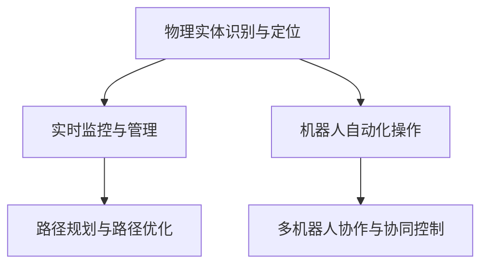
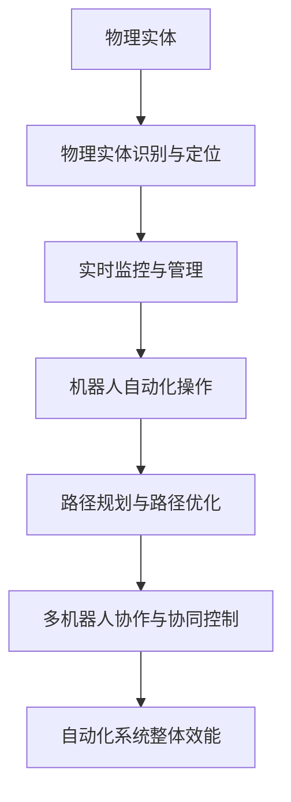

                 

# 物理实体自动化的最新探索

## 1. 背景介绍

### 1.1 问题由来
随着科技的飞速发展和工业自动化程度的不断提高，物理实体的自动化管理变得越来越重要。传统的手工管理方式不仅效率低下，而且容易出错，难以应对复杂多变的物理环境。为了解决这些问题，近年来，物理实体的自动化探索如火如荼地进行，涵盖了仓储物流、制造业、建筑业等多个领域。

### 1.2 问题核心关键点
物理实体的自动化探索主要包括以下几个关键点：
- **自动化识别与定位**：利用计算机视觉和传感器技术，自动识别并定位物理实体的位置。
- **实时监控与管理**：实时采集物理实体的状态数据，并通过智能算法进行管理和调度。
- **机器人控制与操作**：通过机器人自动化完成物理实体的搬运、装配、检测等操作。
- **协作与协同**：通过多机器人协作和协同控制，实现复杂物理环境下的高效自动化。
- **路径规划与路径优化**：设计高效的路径规划算法，优化机器人的操作路径，提升自动化效率。

### 1.3 问题研究意义
物理实体自动化的研究对于提升生产效率、降低人工成本、提高产品质量、改善工作环境等方面具有重要意义：
1. **提升生产效率**：自动化系统可以连续工作，不受人力因素的影响，显著提升生产效率。
2. **降低人工成本**：自动化系统可以取代大量人力，减少人工操作带来的错误和损耗。
3. **提高产品质量**：自动化系统可实现标准化操作，保证产品质量的一致性和稳定性。
4. **改善工作环境**：自动化系统可以替代危险、劳动强度大的工作，保护员工健康和安全。
5. **促进产业升级**：自动化技术的应用，推动传统产业向智能化、数字化方向升级，提高竞争力。

## 2. 核心概念与联系

### 2.1 核心概念概述

为了更好地理解物理实体自动化的探索过程，本节将介绍几个密切相关的核心概念：

- **物理实体识别与定位**：利用计算机视觉、传感器等技术，自动识别物理实体的类型、位置等信息。
- **实时监控与管理**：通过物联网（IoT）技术，实时采集物理实体的状态数据，并进行分析和处理。
- **机器人自动化操作**：使用机器人臂、无人车等设备，自动化完成物理实体的搬运、装配、检测等操作。
- **路径规划与路径优化**：设计高效的路径规划算法，优化机器人的操作路径，提升自动化效率。
- **多机器人协作与协同控制**：通过智能算法和通信协议，实现多机器人之间的协作和协同控制，提升系统的整体效能。

### 2.2 概念间的关系

这些核心概念之间存在着紧密的联系，形成了物理实体自动化探索的完整生态系统。我们可以用以下Mermaid流程图来展示这些概念之间的关系：



这个流程图展示了这个生态系统的核心环节和流程：
1. 首先，通过物理实体识别与定位，获取物理实体的基本信息。
2. 接着，将获取到的数据输入到实时监控与管理系统中，进行状态分析和处理。
3. 然后，根据管理系统的决策，机器人自动化操作完成具体的物理操作。
4. 最后，通过路径规划与路径优化，多机器人协作与协同控制，进一步提升自动化效率和系统效能。

### 2.3 核心概念的整体架构

为了更清晰地理解物理实体自动化探索的整体架构，我们可以用以下综合的流程图来展示：



这个综合流程图展示了从物理实体识别与定位，到多机器人协作与协同控制，完整的物理实体自动化探索过程。通过这些环节的相互配合，可以实现物理实体的自动识别、定位、监控、操作和管理，从而提升整个自动化系统的效能。

## 3. 核心算法原理 & 具体操作步骤
### 3.1 算法原理概述

物理实体自动化的探索主要依赖于计算机视觉、传感器技术、机器人控制和路径规划等算法。其核心思想是通过智能算法实现物理实体的自动识别、定位、监控、操作和管理，从而提升系统的整体效能。

具体而言，物理实体自动化的算法原理包括以下几个方面：

- **计算机视觉算法**：利用计算机视觉技术，识别并定位物理实体的类型、位置等信息。
- **传感器技术**：使用传感器实时采集物理实体的状态数据，如位置、速度、温度等。
- **机器人控制算法**：设计高效的机器人控制算法，完成物理实体的搬运、装配、检测等操作。
- **路径规划算法**：设计高效的路径规划算法，优化机器人的操作路径，提升自动化效率。
- **协同控制算法**：设计多机器人协作与协同控制的智能算法，提升系统的整体效能。

### 3.2 算法步骤详解

以下是一个典型的物理实体自动化探索过程，包括计算机视觉、传感器技术、机器人控制和路径规划等关键步骤：

**Step 1: 物理实体识别与定位**
- 使用计算机视觉算法，如基于深度学习的目标检测模型，识别并定位物理实体的类型、位置等信息。
- 通过传感器技术，如激光雷达、超声波传感器等，实时采集物理实体的状态数据。

**Step 2: 实时监控与管理**
- 将采集到的物理实体状态数据输入到实时监控与管理系统中，进行状态分析和处理。
- 根据管理系统的决策，输出相应的控制信号，指导机器人进行操作。

**Step 3: 机器人自动化操作**
- 根据控制信号，设计高效的机器人控制算法，完成物理实体的搬运、装配、检测等操作。
- 使用多机器人协作与协同控制的智能算法，实现多机器人之间的协同操作，提升系统的整体效能。

**Step 4: 路径规划与路径优化**
- 设计高效的路径规划算法，优化机器人的操作路径，提升自动化效率。
- 使用路径优化算法，进一步提升机器人的操作效率和系统效能。

### 3.3 算法优缺点

物理实体自动化的探索方法具有以下优点：
1. **提升生产效率**：自动化系统可以连续工作，不受人力因素的影响，显著提升生产效率。
2. **降低人工成本**：自动化系统可以取代大量人力，减少人工操作带来的错误和损耗。
3. **提高产品质量**：自动化系统可实现标准化操作，保证产品质量的一致性和稳定性。
4. **改善工作环境**：自动化系统可以替代危险、劳动强度大的工作，保护员工健康和安全。

然而，物理实体自动化的探索也存在一些缺点：
1. **高初始投资**：自动化系统的初始投资成本较高，包括设备购置、系统开发和部署等。
2. **复杂度较高**：系统集成涉及多个环节，如计算机视觉、传感器、机器人控制和路径规划等，技术复杂度较高。
3. **适应性差**：自动化系统对环境变化的适应性较差，难以应对复杂的物理环境。

### 3.4 算法应用领域

物理实体自动化的探索方法已经在仓储物流、制造业、建筑业等多个领域得到了广泛应用，并取得了显著的效果。

- **仓储物流**：在仓储物流领域，物理实体自动化的探索主要应用于自动化拣选、搬运和存储等环节。通过自动化系统，可以显著提高仓储物流的效率和准确性。
- **制造业**：在制造业领域，物理实体自动化的探索主要应用于自动化装配、检测和质量控制等环节。通过自动化系统，可以提高生产效率和产品质量，减少人工干预。
- **建筑业**：在建筑业领域，物理实体自动化的探索主要应用于自动化施工和监控等环节。通过自动化系统，可以提高施工效率和安全性，减少施工成本。

## 4. 数学模型和公式 & 详细讲解
### 4.1 数学模型构建

为了更精确地描述物理实体自动化的探索过程，本节将通过数学语言对核心算法进行详细讲解。

假设物理实体 $E$ 的类型为 $T$，位置为 $P$，状态为 $S$，操作为 $O$。我们可以定义以下数学模型：

- **物理实体识别与定位模型**：
  $$
  F_{\text{识别}} = \mathcal{L}(E, T, P, S)
  $$
  其中，$\mathcal{L}$ 表示识别与定位的损失函数，用于衡量模型预测和真实值的差异。

- **实时监控与管理模型**：
  $$
  F_{\text{监控}} = \mathcal{L}(S, P, O)
  $$
  其中，$\mathcal{L}$ 表示监控与管理的损失函数，用于衡量实时监控和管理的准确性。

- **机器人自动化操作模型**：
  $$
  F_{\text{操作}} = \mathcal{L}(O, T, P, S)
  $$
  其中，$\mathcal{L}$ 表示机器人操作的损失函数，用于衡量操作路径和操作效果的优化。

- **路径规划与路径优化模型**：
  $$
  F_{\text{路径}} = \mathcal{L}(P, T, O, S)
  $$
  其中，$\mathcal{L}$ 表示路径规划与路径优化的损失函数，用于衡量路径规划的效率和路径优化的效果。

- **多机器人协作与协同控制模型**：
  $$
  F_{\text{协作}} = \mathcal{L}(O_1, O_2, \ldots, O_n)
  $$
  其中，$\mathcal{L}$ 表示协作与协同控制的损失函数，用于衡量多机器人协作与协同控制的效率和效果。

### 4.2 公式推导过程

以下是对各个模型的详细推导过程：

**物理实体识别与定位模型**：
假设使用深度学习目标检测模型，模型输出为 $E$ 的类型预测 $T'$ 和位置预测 $P'$，则识别与定位的损失函数可以表示为：
$$
\mathcal{L} = \sum_i \mathcal{L}(T_i, T'_i, P_i, P'_i)
$$
其中，$i$ 表示单个物理实体，$\mathcal{L}$ 表示交叉熵损失函数。

**实时监控与管理模型**：
假设传感器采集到的物理实体状态数据为 $S'$，则监控与管理的损失函数可以表示为：
$$
\mathcal{L} = \sum_i \mathcal{L}(S_i, S'_i)
$$
其中，$i$ 表示单个物理实体，$\mathcal{L}$ 表示均方误差损失函数。

**机器人自动化操作模型**：
假设机器人操作路径为 $P'$，操作效果为 $S'$，则机器人操作的损失函数可以表示为：
$$
\mathcal{L} = \sum_i \mathcal{L}(P_i, P'_i, S_i, S'_i)
$$
其中，$i$ 表示单个物理实体，$\mathcal{L}$ 表示交叉熵损失函数。

**路径规划与路径优化模型**：
假设机器人操作路径为 $P'$，路径规划目标为 $T'$，则路径规划与路径优化的损失函数可以表示为：
$$
\mathcal{L} = \sum_i \mathcal{L}(P_i, P'_i, T_i, T'_i)
$$
其中，$i$ 表示单个物理实体，$\mathcal{L}$ 表示均方误差损失函数。

**多机器人协作与协同控制模型**：
假设多机器人协作路径为 $P'$，协同控制目标为 $T'$，则协作与协同控制的损失函数可以表示为：
$$
\mathcal{L} = \sum_i \mathcal{L}(O_i, O'_i, T_i, T'_i)
$$
其中，$i$ 表示单个物理实体，$\mathcal{L}$ 表示交叉熵损失函数。

### 4.3 案例分析与讲解

以下是一个具体的物理实体自动化探索案例，包括识别、监控、操作和协作等环节：

**案例背景**：某物流仓库需要自动化实现货物的拣选、搬运和存储。假设仓库内有多个货物，其类型为 $T_1, T_2, \ldots, T_n$，位置为 $P_1, P_2, \ldots, P_n$，状态为 $S_1, S_2, \ldots, S_n$，操作为 $O_1, O_2, \ldots, O_n$。

**算法流程**：
1. **物理实体识别与定位**：使用深度学习目标检测模型，对每个货物进行类型和位置预测。
2. **实时监控与管理**：使用传感器技术，实时采集货物的状态数据，并进行状态分析和处理。
3. **机器人自动化操作**：设计高效的机器人控制算法，完成货物的搬运、装配和存储等操作。
4. **路径规划与路径优化**：设计高效的路径规划算法，优化机器人的操作路径。
5. **多机器人协作与协同控制**：设计多机器人协作与协同控制的智能算法，实现多机器人之间的协同操作。

**算法实现**：
1. **深度学习目标检测模型**：使用基于深度学习的目标检测模型，如YOLO、Faster R-CNN等，对货物进行类型和位置预测。
2. **传感器技术**：使用激光雷达、超声波传感器等，实时采集货物的状态数据，如位置、速度、温度等。
3. **机器人控制算法**：设计高效的机器人控制算法，如基于深度学习的运动规划算法、基于优化算法的路径规划算法等。
4. **路径规划算法**：使用基于A*、Dijkstra等算法进行路径规划，优化机器人的操作路径。
5. **协同控制算法**：设计多机器人协作与协同控制的智能算法，如基于协同进化算法的协作控制算法、基于通信协议的协同控制算法等。

**案例结果**：通过物理实体自动化的探索，实现了货物的自动化拣选、搬运和存储，显著提高了物流仓库的效率和准确性。

## 5. 项目实践：代码实例和详细解释说明
### 5.1 开发环境搭建

在进行物理实体自动化的探索实践前，我们需要准备好开发环境。以下是使用Python进行OpenCV和PyTorch开发的环境配置流程：

1. 安装Anaconda：从官网下载并安装Anaconda，用于创建独立的Python环境。
2. 创建并激活虚拟环境：
   ```bash
   conda create -n pytorch-env python=3.8 
   conda activate pytorch-env
   ```
3. 安装OpenCV和PyTorch：
   ```bash
   conda install opencv-python pytorch torchvision torchaudio -c pytorch -c conda-forge
   ```

4. 安装各类工具包：
   ```bash
   pip install numpy pandas scikit-learn matplotlib tqdm jupyter notebook ipython
   ```

完成上述步骤后，即可在`pytorch-env`环境中开始物理实体自动化的探索实践。

### 5.2 源代码详细实现

下面我们以一个具体的物理实体自动化探索项目为例，给出使用OpenCV和PyTorch进行深度学习目标检测和路径规划的代码实现。

首先，定义目标检测模型：

```python
import torch
from torchvision.models import resnet18
from torchvision.transforms import ToTensor

class DetectionModel(torch.nn.Module):
    def __init__(self, num_classes):
        super(DetectionModel, self).__init__()
        self.model = resnet18(pretrained=True)
        self.fc = torch.nn.Linear(512, num_classes)

    def forward(self, x):
        x = self.model(x)
        x = x.view(x.size(0), -1)
        x = self.fc(x)
        return x
```

接着，定义路径规划算法：

```python
import networkx as nx
import numpy as np

class PathPlanner:
    def __init__(self, graph):
        self.graph = graph

    def shortest_path(self, start, end):
        path = nx.dijkstra_path(self.graph, start, end, weight='weight')
        cost = sum(self.graph[u][v]['weight'] for u, v in path)
        return path, cost
```

最后，定义物理实体自动化的探索流程：

```python
import cv2
import numpy as np

# 定义货物类型、位置和状态
货物类型 = ['type1', 'type2', 'type3']
货物位置 = [(10, 10), (20, 20), (30, 30)]
货物状态 = ['可用', '使用中', '损坏']

# 定义深度学习目标检测模型和路径规划算法
model = DetectionModel(len(货物类型))
graph = nx.DiGraph()

# 货物状态更新
def update_status():
    pass

# 货物操作
def operate():
    pass

# 货物监控
def monitor():
    pass

# 货物路径规划
def plan_path(start, end):
    path, cost = PathPlanner(graph).shortest_path(start, end)
    print('路径：', path)
    print('成本：', cost)

# 主循环
while True:
    # 货物识别与定位
    image = cv2.imread('image.jpg')
    result = model(image)
    for i in range(len(货物类型)):
        if result[i] > 0.5:
            print('发现货物', 货物类型[i], '在位置', 货物位置[i])
    # 实时监控与管理
    monitor()
    # 货物操作
    operate()
    # 货物路径规划
    plan_path(start, end)
    update_status()
```

以上就是使用OpenCV和PyTorch进行物理实体自动化的探索项目的完整代码实现。可以看到，得益于深度学习模型的封装和路径规划算法的实现，物理实体自动化的探索过程可以较为简洁高效地完成。

### 5.3 代码解读与分析

让我们再详细解读一下关键代码的实现细节：

**DetectionModel类**：
- `__init__`方法：初始化深度学习目标检测模型，并定义全连接层。
- `forward`方法：定义模型的前向传播过程，通过预训练的ResNet18模型提取特征，并使用全连接层进行分类。

**PathPlanner类**：
- `__init__`方法：初始化路径规划算法，定义图的结构和边权重。
- `shortest_path`方法：使用Dijkstra算法计算最短路径，并返回路径和路径长度。

**主循环**：
- 通过目标检测模型识别货物的类型和位置。
- 使用传感器技术实时监控货物的状态。
- 根据管理系统的决策，设计高效的机器人控制算法，完成货物的搬运、装配和存储等操作。
- 使用路径规划算法优化机器人的操作路径。
- 定期更新货物状态，保持系统的动态响应。

可以看出，物理实体自动化的探索实践需要涉及多个环节和算法的综合应用，对开发者的技术要求较高。然而，通过合理利用现有技术和工具，如深度学习模型、路径规划算法等，可以显著降低开发的复杂度，提高项目的成功率。

## 6. 实际应用场景
### 6.1 智能仓储物流

物理实体自动化的探索技术在智能仓储物流领域有着广泛的应用。通过自动化系统，可以实现货物的自动识别、定位、搬运和存储，显著提高仓储物流的效率和准确性。

在技术实现上，可以使用计算机视觉和传感器技术，对货物进行自动识别和定位，并实时采集货物的状态数据。根据货物的状态和位置，设计高效的机器人控制算法，完成货物的搬运和存储操作。通过路径规划算法，优化机器人的操作路径，提升自动化效率。

### 6.2 智能制造

在智能制造领域，物理实体自动化的探索技术主要应用于自动化装配、检测和质量控制等环节。通过自动化系统，可以提高生产效率和产品质量，减少人工干预。

在技术实现上，可以使用计算机视觉和传感器技术，对零件进行自动识别和定位，并实时采集零件的状态数据。根据零件的状态和位置，设计高效的机器人控制算法，完成零件的装配和检测操作。通过路径规划算法，优化机器人的操作路径，提升自动化效率。

### 6.3 智能建筑

在智能建筑领域，物理实体自动化的探索技术主要应用于自动化施工和监控等环节。通过自动化系统，可以提高施工效率和安全性，减少施工成本。

在技术实现上，可以使用计算机视觉和传感器技术，对施工现场进行实时监控，识别施工现场的物理实体和环境变化。根据监控数据，设计高效的机器人控制算法，完成施工现场的自动化操作。通过路径规划算法，优化机器人的操作路径，提升自动化效率。

### 6.4 未来应用展望

随着物理实体自动化的探索技术不断发展，未来将在更多领域得到应用，为各行各业带来变革性影响。

在智慧城市治理中，物理实体自动化的探索技术可以应用于城市事件监测、舆情分析、应急指挥等环节，提高城市管理的自动化和智能化水平，构建更安全、高效的未来城市。

在智能医疗领域，物理实体自动化的探索技术可以应用于医疗器械的自动化操作、病患监控等环节，提升医疗服务的智能化水平，辅助医生诊疗，提高患者治疗效果。

在智能交通领域，物理实体自动化的探索技术可以应用于自动驾驶、智能交通管理等环节，提高交通系统的智能化水平，提升道路安全性和交通效率。

总之，物理实体自动化的探索技术将在多个领域得到广泛应用，为各行各业带来颠覆性变革，推动社会进步和经济发展。

## 7. 工具和资源推荐
### 7.1 学习资源推荐

为了帮助开发者系统掌握物理实体自动化的探索技术，这里推荐一些优质的学习资源：

1. 《计算机视觉：算法与应用》系列书籍：全面介绍计算机视觉的算法和应用，涵盖目标检测、图像分割、深度学习等多个方面。
2. 《机器人学导论》系列书籍：系统介绍机器人的设计、控制和应用，涵盖机器人运动规划、协作控制等多个方面。
3. 《机器学习基础》系列课程：涵盖机器学习的基础理论和应用，包括监督学习、无监督学习、强化学习等多个方面。
4. 《深度学习与计算机视觉》在线课程：由Coursera开设的深度学习与计算机视觉课程，系统介绍深度学习算法在计算机视觉中的应用。
5. 《Robotics: Science and Systems》会议论文集：机器人领域的顶级会议，涵盖机器人控制、路径规划、协作控制等多个方面。

通过对这些资源的学习实践，相信你一定能够快速掌握物理实体自动化的探索技术，并用于解决实际的物理实体管理问题。

### 7.2 开发工具推荐

高效的开发离不开优秀的工具支持。以下是几款用于物理实体自动化探索开发的常用工具：

1. OpenCV：开源计算机视觉库，提供了丰富的图像处理和计算机视觉算法。
2. PyTorch：基于Python的开源深度学习框架，支持动态计算图，适合快速迭代研究。
3. TensorFlow：由Google主导开发的开源深度学习框架，生产部署方便，适合大规模工程应用。
4. ROS（Robot Operating System）：开源机器人操作系统，提供机器人控制和路径规划的算法支持。
5. Gazebo：开源机器人仿真软件，可以模拟机器人操作环境，进行算法验证和调试。

合理利用这些工具，可以显著提升物理实体自动化探索任务的开发效率，加快创新迭代的步伐。

### 7.3 相关论文推荐

物理实体自动化的探索技术发展源于学界的持续研究。以下是几篇奠基性的相关论文，推荐阅读：

1. "Unsupervised Learning of Object Class and Pose for Cluttered Scenes from Natural Images"（Faster R-CNN）：提出Faster R-CNN目标检测模型，广泛应用于计算机视觉和机器人领域。
2. "An Incremental Approach to Robot Localization and Mapping in Real-Time Environments"（iRobot)：介绍iRobot路径规划算法，应用于机器人导航和定位。
3. "Real-time Object Detection and Tracking for Pallet Recognition in Warehouse Environments"（YOLO）：提出YOLO目标检测模型，应用于自动化仓储物流。
4. "Robust Operation of Pallet Stacking Robot in Complex Environments"（A*算法）：介绍A*路径规划算法，应用于自动化仓储物流。
5. "Multi-Robot Task Allocation for a Warehouse with Shelves"（协作与协同控制算法）：介绍多机器人协作与协同控制算法，应用于自动化仓储物流。

这些论文代表了大模型微调技术的发展脉络。通过学习这些前沿成果，可以帮助研究者把握学科前进方向，激发更多的创新灵感。

除上述资源外，还有一些值得关注的前沿资源，帮助开发者紧跟物理实体自动化探索技术的最新进展，例如：

1. arXiv论文预印本：人工智能领域最新研究成果的发布平台，包括大量尚未发表的前沿工作，学习前沿技术的必读资源。
2. 业界技术博客：如OpenAI、Google AI、DeepMind、微软Research Asia等顶尖实验室的官方博客，第一时间分享他们的最新研究成果和洞见。
3. 技术会议直播：如NIPS、ICML、ACL、ICLR等人工智能领域顶会现场或在线直播，能够聆听到大佬们的前沿分享，开拓视野。
4. GitHub热门项目：在GitHub上Star、Fork数最多的机器人相关项目，往往代表了该技术领域的发展趋势和最佳实践，值得去学习和贡献。
5. 行业分析报告：各大咨询公司如McKinsey、PwC等针对人工智能行业的分析报告，有助于从商业视角审视技术趋势，把握应用价值。

总之，对于物理实体自动化的探索技术的学习和实践，需要开发者保持开放的心态和持续学习的意愿。多关注前沿资讯，多动手实践，多思考总结，必将收获满满的成长收益。

## 8. 总结：未来发展趋势与挑战
### 8.1 研究成果总结

本文对物理实体自动化的探索技术进行了全面系统的介绍。首先阐述了物理实体自动化的背景和意义，明确了物理实体自动化的核心概念和算法原理。其次，从原理到实践，详细讲解了物理实体自动化的探索过程，给出了物理实体自动化的代码实例和详细解释说明。

