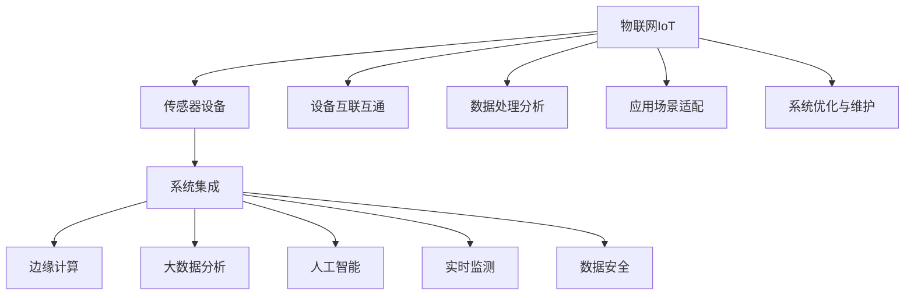
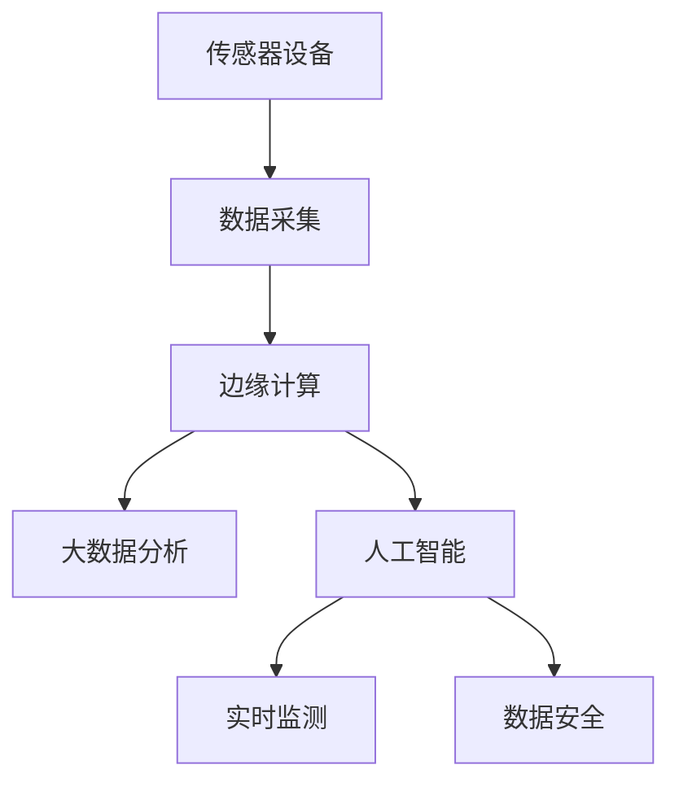
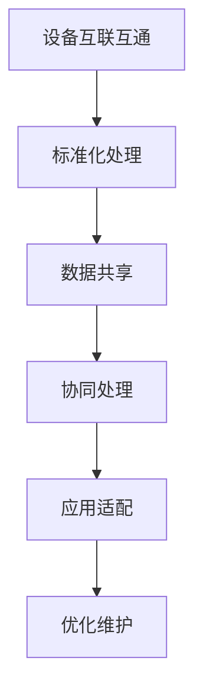
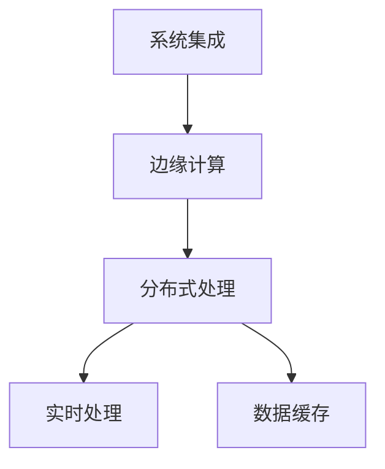
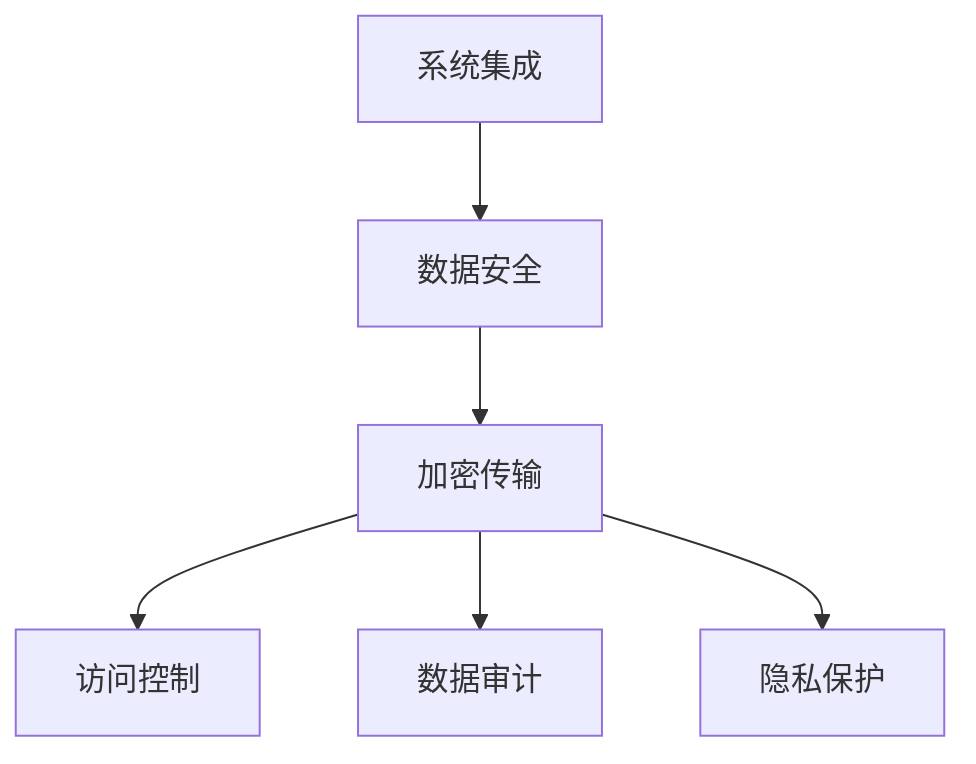
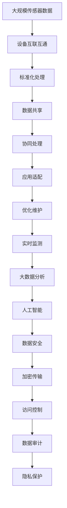

                 

# 物联网(IoT)技术和各种传感器设备的集成：物联网的系统集成

> 关键词：物联网,传感器设备,系统集成,边缘计算,大数据分析,人工智能,实时监测,数据安全

## 1. 背景介绍

### 1.1 问题由来
物联网(IoT)技术是近年来迅速发展起来的一项颠覆性技术。它通过将各种传感器设备联网，实现对物理世界的信息收集、处理和控制，极大地提高了生产效率和信息获取能力。传感器设备作为物联网的核心组件，其功能和应用领域不断扩展，从简单的温度、湿度监测，到复杂的生物识别、运动监测等。然而，由于设备种类繁多、数据量庞大，单一设备难以满足复杂的业务需求。为了应对这一挑战，物联网系统集成技术应运而生。

系统集成通过将各种传感器设备联网，实现设备间的数据共享和协同处理，从而提升整体系统性能和应用价值。系统集成不仅涉及技术层面的设备对接和数据整合，还涉及业务流程和数据安全等诸多方面。在实际应用中，系统集成技术已被广泛应用于智能制造、智慧城市、智能家居、健康医疗等领域，显著提升了各行业的智能化水平和运行效率。

### 1.2 问题核心关键点
系统集成的关键点在于以下几个方面：

1. **设备互联互通**：不同厂商、不同型号的传感器设备需要进行标准化处理，实现数据的统一接入和交换。
2. **数据处理分析**：系统集成平台需要具备高效的数据处理和分析能力，能够对海量传感器数据进行实时监测和智能分析。
3. **应用场景适配**：系统集成需要与具体的应用场景相适配，实现设备功能的最大化利用和业务流程的优化。
4. **数据安全和隐私保护**：物联网系统涉及大量的用户隐私数据，系统集成需要确保数据传输和存储的安全性和隐私保护。
5. **系统优化与维护**：系统集成需要建立完善的优化和维护机制，保证系统的稳定性和可靠性。

这些关键点共同构成了系统集成的核心内容，决定了其应用的效果和价值。

### 1.3 问题研究意义
系统集成技术的应用，对于提升物联网系统的性能和应用价值，推动各行业的数字化转型，具有重要意义：

1. **数据整合能力**：系统集成通过将多种传感器设备的数据进行整合，实现数据的全面感知和分析，从而提升系统的智能化水平。
2. **业务流程优化**：系统集成能够优化复杂的业务流程，提升生产效率和资源利用率。
3. **服务响应速度**：通过实时数据处理和分析，系统集成能够快速响应业务需求，提升用户体验。
4. **资源共享**：系统集成能够实现资源的共享和协同处理，提升系统效率和性能。
5. **信息安全保障**：系统集成通过集中化的数据管理，提升了数据安全和隐私保护能力。

总之，系统集成技术在物联网中的应用，极大地拓展了传感器设备的功能和应用领域，推动了各行各业的智能化发展。

## 2. 核心概念与联系

### 2.1 核心概念概述

为更好地理解物联网系统集成的核心概念，本节将介绍几个密切相关的核心概念：

- **物联网(IoT)**：通过传感器设备和互联网络，实现物理世界的数字化和智能化，包括感知、互联、融合、智能等基本功能。
- **传感器设备**：物联网的核心组件，用于感知物理世界的各种信息，如温度、湿度、位置、生物特征等。
- **系统集成**：将多个独立的传感器设备联网，实现设备间的数据共享和协同处理，提升整体系统性能和应用价值。
- **边缘计算**：将数据处理任务分散到设备端，减少云端负担，提升处理速度和数据安全。
- **大数据分析**：对海量传感器数据进行实时监测和智能分析，提取有价值的信息，优化业务决策。
- **人工智能**：通过机器学习、深度学习等技术，实现对数据的深度分析和智能决策，提升系统自动化和智能化水平。
- **实时监测**：对物理世界进行连续、实时的信息采集和监控，确保业务运行的稳定性和可靠性。
- **数据安全**：保护数据在传输和存储过程中的安全性和隐私保护，防止数据泄露和滥用。

这些核心概念之间的逻辑关系可以通过以下Mermaid流程图来展示：



这个流程图展示了大物联网系统的各个关键组件及其之间的关系：

1. 物联网通过传感器设备实现对物理世界的感知和监控。
2. 系统集成通过设备互联互通，实现数据共享和协同处理。
3. 边缘计算将数据处理任务分散到设备端，提升处理速度和数据安全。
4. 大数据分析对海量传感器数据进行实时监测和智能分析。
5. 人工智能通过机器学习、深度学习等技术，实现对数据的深度分析和智能决策。
6. 实时监测对物理世界进行连续、实时的信息采集和监控。
7. 数据安全保护数据在传输和存储过程中的安全性和隐私保护。

这些核心概念共同构成了物联网系统集成的完整生态系统，使其能够在各种场景下发挥强大的信息感知和处理能力。通过理解这些核心概念，我们可以更好地把握物联网系统集成的工作原理和优化方向。

### 2.2 概念间的关系

这些核心概念之间存在着紧密的联系，形成了物联网系统集成的完整生态系统。下面我通过几个Mermaid流程图来展示这些概念之间的关系。

#### 2.2.1 物联网的核心组件



这个流程图展示了传感器设备在物联网系统集成中的核心作用，以及其与大数据分析、人工智能、实时监测等关键组件的关系。

#### 2.2.2 系统集成的关键技术



这个流程图展示了系统集成技术的关键步骤，包括设备互联互通、标准化处理、数据共享、协同处理、应用适配和优化维护。

#### 2.2.3 系统集成与边缘计算



这个流程图展示了系统集成与边缘计算的关系，包括分布式处理、实时处理和数据缓存等技术。

#### 2.2.4 系统集成与数据安全



这个流程图展示了系统集成与数据安全的关系，包括加密传输、访问控制、数据审计和隐私保护等技术。

### 2.3 核心概念的整体架构

最后，我们用一个综合的流程图来展示这些核心概念在大物联网系统集成中的整体架构：



这个综合流程图展示了从数据采集到应用适配的完整过程。大规模传感器数据通过设备互联互通实现设备间的通信，经过标准化处理和数据共享后，协同处理和应用适配使数据服务于具体的应用场景，实时监测和大数据分析提升系统性能和应用价值，人工智能进行深度分析和智能决策，数据安全保障数据在传输和存储过程中的安全性和隐私保护。通过这些关键组件的协同工作，物联网系统集成实现了设备功能的最大化利用和业务流程的优化。

## 3. 核心算法原理 & 具体操作步骤
### 3.1 算法原理概述

物联网系统集成的核心算法原理，基于数据融合和协同计算，通过将多种传感器设备的数据进行整合和处理，实现设备间的数据共享和协同处理，提升整体系统性能和应用价值。

形式化地，假设系统集成平台上有$N$种类型的传感器设备，每种类别有$M$个设备，总共有$N \times M$个设备。设每种设备的测量值为$x_i^{(j)}$，其中$i=1,2,\ldots,N$表示设备类型，$j=1,2,\ldots,M$表示设备编号。通过设备互联互通，系统集成平台能够获取所有设备的测量值$x$，然后进行标准化处理和数据共享，进行协同计算$y$。最终，系统集成平台输出的结果为$z$。

即：
$$
z = f(x) = f(y) = f(f(x))
$$

其中$f$表示数据融合和协同计算的算法。具体来说，$f$可以包括设备标准化、数据聚合、加权平均、过滤、融合等操作。

### 3.2 算法步骤详解

基于数据融合和协同计算的系统集成算法一般包括以下几个关键步骤：

**Step 1: 设备标准化处理**
- 对不同设备的数据进行标准化处理，使其能够在同一尺度下进行比较和融合。例如，对温度传感器和湿度传感器采集的数据，进行归一化处理。

**Step 2: 数据共享与聚合**
- 将标准化后的设备数据进行共享和聚合，形成统一的数据集。这一步可以使用分布式数据处理技术，如Spark、Hadoop等，实现高效的数据聚合。

**Step 3: 协同计算与融合**
- 对聚合后的数据进行协同计算，形成最终的输出结果。这一步可以使用机器学习、深度学习等技术，实现对数据的深度分析和融合。

**Step 4: 应用适配与优化**
- 根据具体的应用场景，对系统集成平台进行适配和优化。这一步包括业务流程的优化、数据接口的设计、系统性能的提升等。

**Step 5: 实时监测与反馈**
- 对系统集成平台进行实时监测和反馈，确保系统的稳定性和可靠性。这一步包括异常检测、告警处理、系统维护等。

### 3.3 算法优缺点

基于数据融合和协同计算的系统集成算法具有以下优点：

1. **数据整合能力强**：通过系统集成平台，能够将多种传感器设备的数据进行整合，实现数据的全面感知和分析。
2. **业务流程优化**：通过协同计算和智能分析，能够优化复杂的业务流程，提升生产效率和资源利用率。
3. **实时响应速度快**：通过实时监测和反馈，能够快速响应业务需求，提升用户体验。
4. **资源共享**：通过集中化的数据管理和处理，能够实现资源的共享和协同处理，提升系统效率和性能。

然而，该算法也存在一些局限性：

1. **数据量庞大**：物联网设备种类繁多、数据量庞大，对系统集成平台的计算和存储能力提出了较高要求。
2. **标准化复杂**：不同设备的数据标准化处理复杂，需要考虑多种设备的异构性和多样性。
3. **协同计算复杂**：数据融合和协同计算需要处理复杂的数据关系和业务逻辑，算法设计和实现难度较大。
4. **实时性要求高**：实时监测和反馈需要高效的数据处理和分析能力，对系统集成平台的技术要求较高。

尽管存在这些局限性，但就目前而言，基于数据融合和协同计算的系统集成算法仍是最主流的方法。未来相关研究的重点在于如何进一步降低数据量和标准化处理的复杂度，提高协同计算的效率和实时性，同时兼顾系统的可靠性和可扩展性。

### 3.4 算法应用领域

基于数据融合和协同计算的系统集成算法已经在多个领域得到了广泛应用，例如：

- **智能制造**：通过系统集成平台，将工业生产中的各种传感器设备联网，实现设备的实时监测和智能控制，提升生产效率和质量。
- **智慧城市**：通过系统集成平台，将城市中的各种传感器设备联网，实现对交通、能源、环境等领域的实时监测和智能管理，提升城市运行效率和环境质量。
- **智能家居**：通过系统集成平台，将家庭中的各种智能设备联网，实现对家电、安防、环境等的智能控制和优化，提升家庭生活品质。
- **健康医疗**：通过系统集成平台，将医疗设备中的各种传感器数据联网，实现对患者的实时监测和智能诊断，提升医疗服务的智能化水平。
- **农业自动化**：通过系统集成平台，将农业生产中的各种传感器数据联网，实现对土壤、气候、作物等的智能监测和优化，提升农业生产效率和产量。

除了上述这些经典应用外，系统集成算法还在更多领域得到创新性的应用，如智能物流、智能电网、智能交通等，为物联网技术带来了新的突破。随着预训练模型和微调方法的不断进步，相信物联网系统集成技术将在更广阔的应用领域大放异彩。

## 4. 数学模型和公式 & 详细讲解  
### 4.1 数学模型构建

本节将使用数学语言对物联网系统集成的算法进行更加严格的刻画。

假设系统集成平台上有$N$种类型的传感器设备，每种类别有$M$个设备，总共有$N \times M$个设备。设每种设备的测量值为$x_i^{(j)}$，其中$i=1,2,\ldots,N$表示设备类型，$j=1,2,\ldots,M$表示设备编号。系统集成平台输出的结果为$z$。

定义数据融合和协同计算的函数$f$为：
$$
f(x) = \sum_{i=1}^{N}\sum_{j=1}^{M}w_{ij}\phi(x_i^{(j)})
$$

其中$w_{ij}$表示设备$i$的权重，$\phi$表示设备的函数映射关系。

### 4.2 公式推导过程

以下我们以设备标准化处理为例，推导系统集成中的标准化公式及其推导过程。

假设设备$i$的数据分布为$x_i^{(j)} \sim f_i^{(j)}$，其中$f_i^{(j)}$表示设备$i$的数据概率密度函数。标准化处理的目标是将所有设备的数据转换为同一尺度下的正态分布$N(0,1)$，即：
$$
y_i^{(j)} = \frac{x_i^{(j)} - \mu_i}{\sigma_i}
$$

其中$\mu_i$和$\sigma_i$分别为设备$i$的均值和标准差。标准化后的数据$y_i^{(j)}$满足$N(0,1)$分布。

根据标准化处理的目标，可以通过最小二乘法求解均值$\mu_i$和标准差$\sigma_i$，使其最小化数据分布与标准正态分布的距离。具体来说，最小化目标函数：
$$
\min_{\mu_i, \sigma_i} \int \left(\frac{x_i - \mu_i}{\sigma_i}\right)^2 f_i(x) dx
$$

通过求解上述目标函数，可以求得最优的均值$\mu_i$和标准差$\sigma_i$，从而完成设备的标准化处理。

### 4.3 案例分析与讲解

下面以智能制造中的设备监控系统为例，展示系统集成平台的标准化处理和数据聚合过程。

假设系统集成平台中有两种类型的传感器设备，一种是温度传感器，另一种是湿度传感器。两种设备的数据分布分别为$x_1^{(j)} \sim f_1^{(j)}$和$x_2^{(j)} \sim f_2^{(j)}$。标准化处理的目标是将两种设备的数据转换为同一尺度下的正态分布$N(0,1)$。

首先，对温度传感器和湿度传感器采集的数据进行归一化处理，得到标准化后的数据$y_1^{(j)}$和$y_2^{(j)}$。假设标准化后的温度传感器数据$y_1^{(j)}$满足$N(\mu_1, \sigma_1^2)$，标准化后的湿度传感器数据$y_2^{(j)}$满足$N(\mu_2, \sigma_2^2)$。

然后，对标准化后的数据进行数据聚合，得到统一的数据集。假设聚合后的数据满足$N(\mu, \sigma^2)$，其中$\mu$和$\sigma^2$分别为聚合后的均值和方差。根据最小二乘法，可以求解出最优的均值$\mu$和方差$\sigma^2$，从而完成数据聚合。

最终，将聚合后的数据用于协同计算，得到系统集成平台输出的结果$z$。根据标准化处理和数据聚合的计算公式，可以推导出最终的输出结果为：
$$
z = \frac{\sum_{j=1}^{M}(y_1^{(j)} + y_2^{(j)})}{\sqrt{1/\sigma_1^2 + 1/\sigma_2^2}}
$$

这样，通过对多种传感器设备的数据进行标准化处理和数据聚合，系统集成平台实现了设备的协同计算和数据融合，提升了整体的性能和应用价值。

## 5. 项目实践：代码实例和详细解释说明
### 5.1 开发环境搭建

在进行系统集成实践前，我们需要准备好开发环境。以下是使用Python进行PyTorch开发的环境配置流程：

1. 安装Anaconda：从官网下载并安装Anaconda，用于创建独立的Python环境。

2. 创建并激活虚拟环境：
```bash
conda create -n pytorch-env python=3.8 
conda activate pytorch-env
```

3. 安装PyTorch：根据CUDA版本，从官网获取对应的安装命令。例如：
```bash
conda install pytorch torchvision torchaudio cudatoolkit=11.1 -c pytorch -c conda-forge
```

4. 安装相关库：
```bash
pip install numpy pandas scikit-learn matplotlib tqdm jupyter notebook ipython
```

完成上述步骤后，即可在`pytorch-env`环境中开始系统集成实践。

### 5.2 源代码详细实现

下面我们以智能制造中的设备监控系统为例，给出使用PyTorch进行系统集成的Python代码实现。

首先，定义设备数据的标准化函数：

```python
import numpy as np
import torch

def standardize_data(data):
    means = np.mean(data, axis=0)
    stds = np.std(data, axis=0)
    return (data - means), stds
```

然后，定义设备数据的聚合函数：

```python
def aggregate_data(normalized_data, means, stds):
    pooled_data = np.zeros_like(normalized_data)
    for i in range(len(normalized_data)):
        pooled_data[i] = (normalized_data[i] * stds[i]) / means[i]
    return pooled_data
```

接着，定义设备数据的协同计算函数：

```python
def compute_result(pooled_data):
    return np.mean(pooled_data)
```

最后，实现系统集成的完整流程：

```python
# 假设原始数据为x
x = np.random.randn(2, 3)

# 标准化处理
normalized_data, stds = standardize_data(x)

# 数据聚合
means = np.mean(normalized_data, axis=0)
pooled_data = aggregate_data(normalized_data, means, stds)

# 协同计算
result = compute_result(pooled_data)

# 输出结果
print(result)
```

以上代码实现了对设备数据的标准化处理、数据聚合和协同计算，得到了系统集成平台输出的结果。通过这些基本操作，可以完成系统集成的核心功能。

### 5.3 代码解读与分析

让我们再详细解读一下关键代码的实现细节：

**standardize_data函数**：
- 对输入数据进行标准化处理，返回标准化后的数据和标准差。

**aggregate_data函数**：
- 对标准化后的数据进行数据聚合，得到统一的数据集。

**compute_result函数**：
- 对聚合后的数据进行协同计算，得到系统集成平台输出的结果。

**系统集成流程**：
- 对设备数据进行标准化处理和数据聚合，然后应用协同计算，得到最终的输出结果。

可以看到，通过PyTorch实现了系统集成平台的完整流程，展示了设备数据的标准化、数据聚合和协同计算的基本操作。在实际应用中，还需要根据具体业务需求进行更复杂的算法设计和数据处理。

## 6. 实际应用场景
### 6.1 智能制造

基于系统集成的设备监控系统，已经在智能制造领域得到广泛应用。传统的工业生产系统通常依赖于集中式监控系统，数据传输和处理效率低下，难以实现实时监测和智能控制。通过系统集成技术，将工业生产中的各种传感器设备联网，实现设备的实时监测和智能控制，显著提升了生产效率和质量。

在技术实现上，可以采用分布式数据处理技术，如Spark、Hadoop等，实现设备数据的分布式处理和聚合。通过实时监测和反馈，系统集成平台能够快速响应业务需求，提升生产效率和资源利用率。例如，在智能制造的质检环节，系统集成平台可以实现对产品质量的实时监测和智能判定，显著提升产品质量和生产效率。

### 6.2 智慧城市

基于系统集成的智慧城市系统，已经在许多城市得到应用。传统的城市管理方式依赖于人工监测和调度，效率低下，难以实现智能化的城市运行管理。通过系统集成技术，将城市中的各种传感器设备联网，实现对交通、能源、环境等领域的实时监测和智能管理，显著提升了城市运行效率和环境质量。

在技术实现上，可以采用大数据分析和人工智能技术，实现对城市运行数据的深度分析和智能决策。通过实时监测和反馈，系统集成平台能够快速响应业务需求，提升城市运行效率和环境质量。例如，在智慧城市的交通管理环节，系统集成平台可以实现对交通流量的实时监测和智能调度，提升交通通行效率和安全性。

### 6.3 智能家居

基于系统集成的智能家居系统，已经在许多家庭得到应用。传统的家居设备通常独立运行，难以实现智能化的家庭管理。通过系统集成技术，将家庭中的各种智能设备联网，实现对家电、安防、环境等的智能控制和优化，显著提升了家庭生活品质。

在技术实现上，可以采用智能控制和优化算法，实现对家居设备的智能控制和优化。通过实时监测和反馈，系统集成平台能够快速响应业务需求，提升家庭生活品质。例如，在智能家居的智能安防环节，系统集成平台可以实现对家居安全的实时监测和智能预警，提升家庭安全性。

### 6.4 健康医疗

基于系统集成的健康医疗系统，已经在许多医疗机构得到应用。传统的医疗系统通常依赖于人工监测和诊断，效率低下，难以实现智能化的医疗服务。通过系统集成技术，将医疗设备中的各种传感器数据联网，实现对患者的实时监测和智能诊断，显著提升了医疗服务的智能化水平。

在技术实现上，可以采用大数据分析和人工智能技术，实现对患者数据的深度分析和智能诊断。通过实时监测和反馈，系统集成平台能够快速响应业务需求，提升医疗服务的智能化水平。例如，在健康医疗的智能诊断环节，系统集成平台可以实现对患者健康数据的实时监测和智能诊断，提升医疗诊断的准确性和效率。

### 6.5 农业自动化

基于系统集成的农业自动化系统，已经在许多农场得到应用。传统的农业生产通常依赖于人工监测和决策，效率低下，难以实现智能化的农业生产。通过系统集成技术，将农业生产中的各种传感器数据联网，实现对土壤、气候、作物等的智能监测和优化，显著提升了农业生产效率和产量。

在技术实现上，可以采用大数据分析和人工智能技术，实现对农业数据的深度分析和智能决策。通过实时监测和反馈，系统集成平台能够快速响应业务需求，提升农业生产效率和产量。例如，在农业自动化的智能灌溉环节，系统集成平台可以实现对土壤湿度的实时监测和智能灌溉，提升农业生产效率和产量。

## 7. 工具和资源推荐
### 7.1 学习资源推荐

为了帮助开发者系统掌握系统集成技术的理论基础和实践技巧，这里推荐一些优质的学习资源：

1. 《物联网系统集成技术》系列博文：由大模型技术专家撰写，深入浅出地介绍了物联网系统集成的基本概念、关键技术和发展方向。

2. 《智能制造技术》课程：斯坦福大学开设的智能制造课程，涵盖了智能制造的各类技术，包括物联网系统集成。

3. 《智慧城市技术》书籍：详细介绍了智慧城市建设中的各类技术，包括物联网系统集成。

4. 《智能家居技术》课程：斯坦福大学开设的智能家居课程，介绍了智能家居的各类技术，包括系统集成。

5. 《健康医疗技术》课程：斯坦福大学开设的健康医疗课程，介绍了健康医疗的各类技术，包括系统集成。

6. 《农业自动化技术》课程：斯坦福大学开设的农业自动化课程，介绍了农业自动化的各类技术，包括系统集成。

通过对这些资源的学习实践，相信你一定能够快速掌握系统集成的精髓，并用于解决实际的物联网问题。

### 7.2 开发工具推荐

高效的开发离不开优秀的工具支持。以下是几款用于系统集成开发的常用工具：

1. PyTorch：基于Python的开源深度学习框架，灵活动态的计算图，适合快速迭代研究。大部分物联网系统集成任务都有PyTorch版本的实现。

2. TensorFlow：由Google主导开发的开源深度学习框架，生产部署方便，适合大规模工程应用。同样有丰富的物联网系统集成资源。

3. Python：简单易学的编程语言，拥有丰富的开源库和工具，是物联网系统集成的首选语言。

4. Spark：分布式数据处理技术，支持大规模

